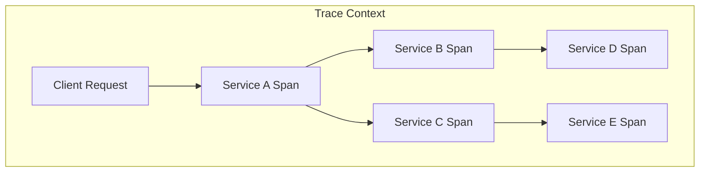
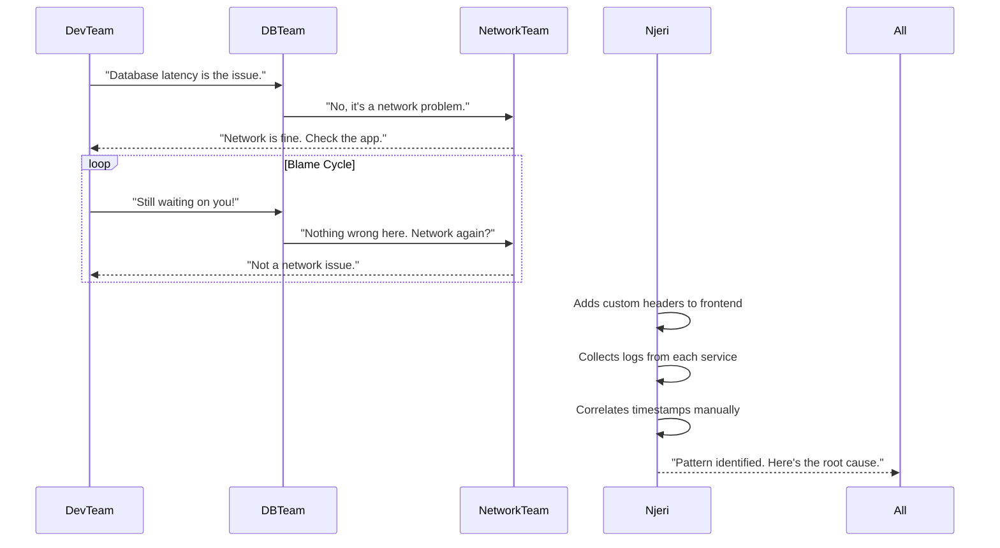
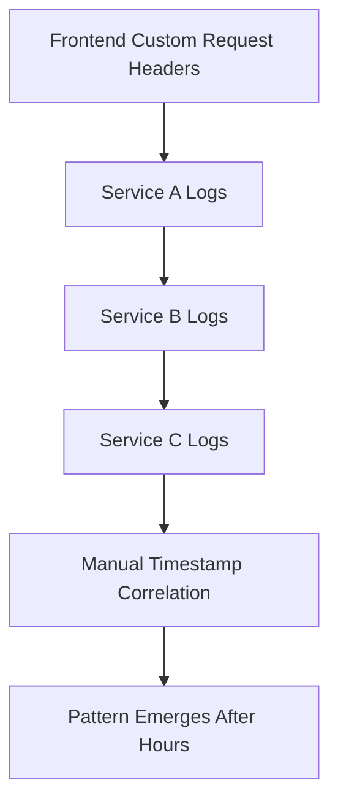
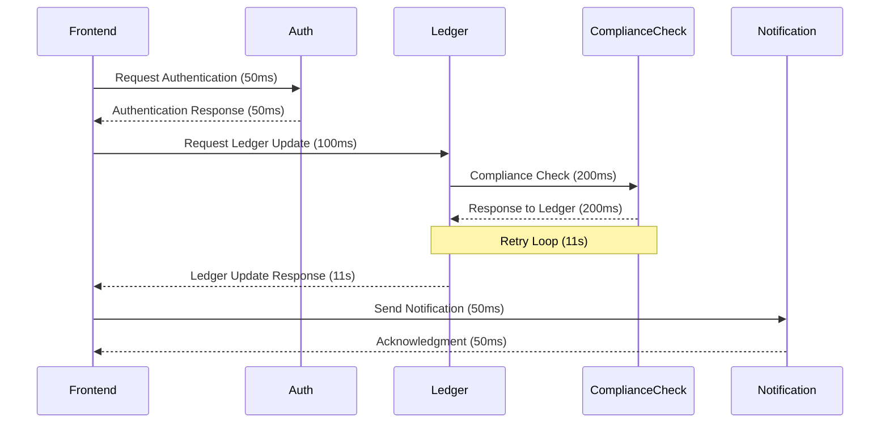
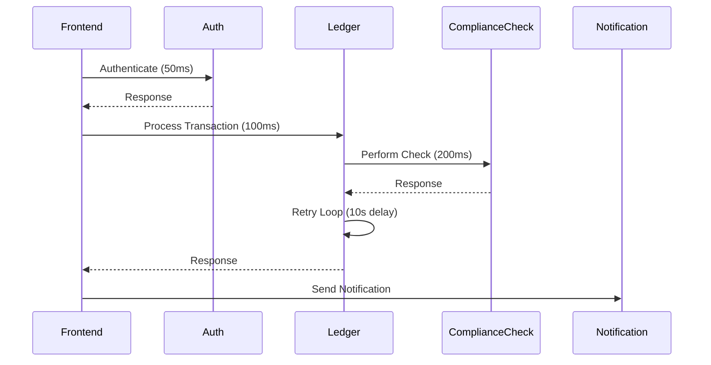
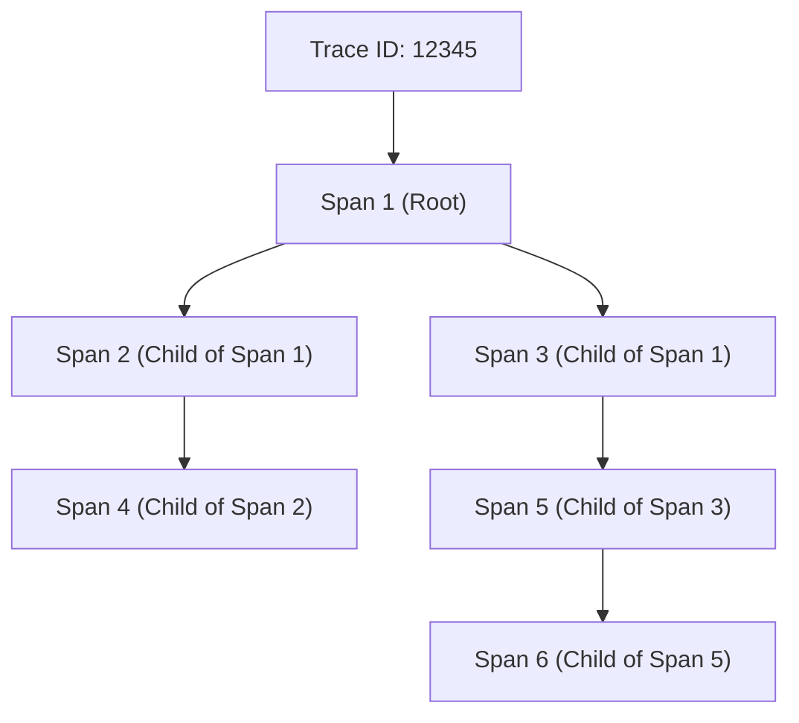
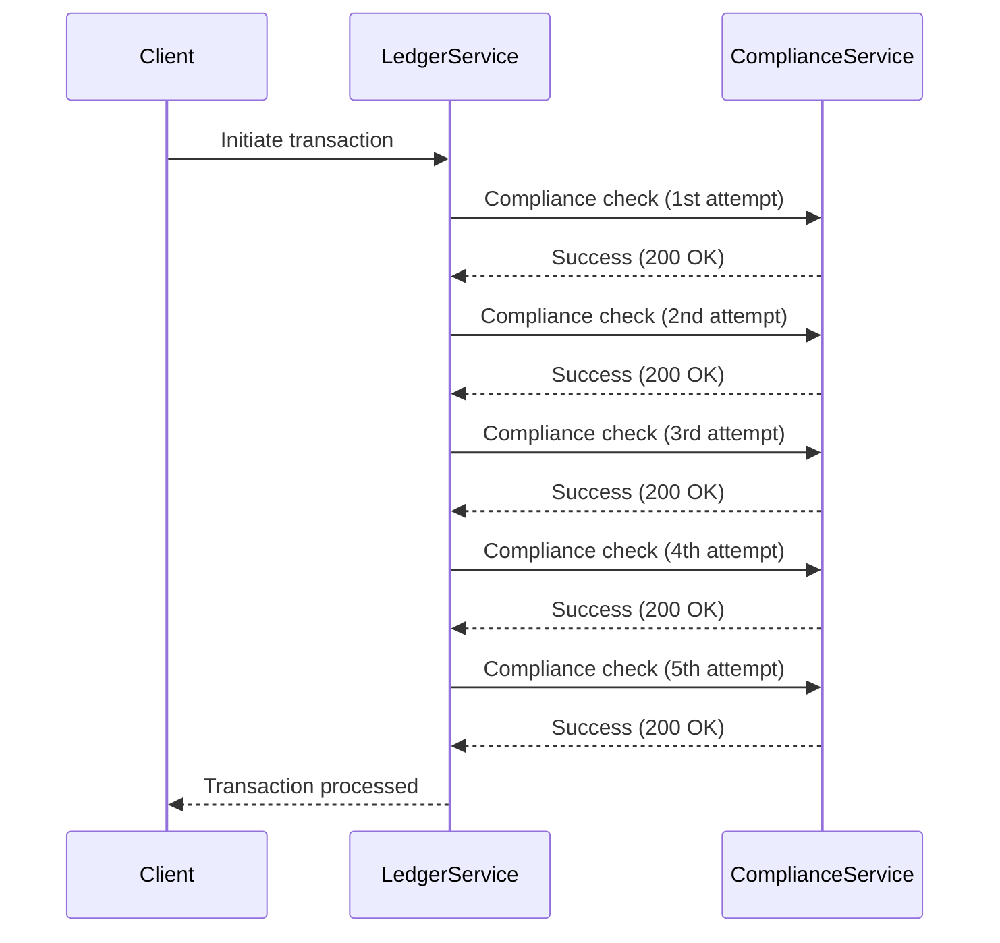

# Chapter 7: Tracing the Money Trail

## Chapter Overview

Welcome to the dark underbelly of transaction monitoring, where “all systems operational” is just the first lie your dashboards tell you. In this chapter, we follow the money—literally—and watch as customer wire transfers limp across the finish line while your metrics smugly insist everything’s fine. It’s a murder mystery where the victim is user trust, the suspects are every microservice in your stack, and the only honest witness is a well-instrumented distributed trace. If you think “no errors in the logs” means “no problems,” prepare to have your illusions shattered. This is tracing for financial services: where every blind spot can cost real money, and “flying blind” is a career-limiting move.

## Learning Objectives

- **Diagnose** hidden user experience issues that traditional metrics and logs sweep under the rug.
- **Instrument** end-to-end transaction monitoring that captures what your customers actually feel, not just what your services report.
- **Implement** distributed tracing with OpenTelemetry (or your poison of choice), ensuring every service in the critical path participates.
- **Correlate** logs, metrics, and traces using context propagation—no more manual log spelunking or guesswork.
- **Visualize** complete transaction flows to isolate bottlenecks and root causes in seconds, not hours.
- **Analyze** trace data to uncover operational, configurational, and business-impacting issues before your customers or regulators do.
- **Integrate** forensic observability techniques that leave no crime scene unsolved—ever.

## Key Takeaways

- Just because your dashboard is green doesn’t mean your customers aren’t screaming into the void. “No error” ≠ “No problem.”
- Transaction experience monitoring is the difference between “We met our SLA!” and “We lost half our customers this morning.”
- Disabling tracing for “performance reasons” is like turning off the headlights to go faster in the fog. Spoiler: you’ll crash.
- Manual log correlation is a heroic waste of salary. Pay for proper tracing instead of overtime pizza.
- Blame games are what happens when nobody can see the whole picture. Cross-service visibility ends the finger-pointing and the endless incident bridges.
- Trace visualization turns vague hunches into “here’s the smoking gun.” If you can’t spot the problem in under a minute, your tools are failing you.
- Trace context in logs and metrics is non-negotiable. Don’t make future-you dig through uncorrelated data at 3AM.
- Most outages are config bugs in disguise. Distributed tracing will rat them out—loudly.
- Forensic observability isn’t just operational hygiene—it’s regulatory survival. Auditors demand receipts, not stories.
- Logs tell you something’s dead, metrics tell you when, traces tell you who did it and how. Don’t settle for anything less.

## Panel 1: The Silent Delay - Transaction Experience Monitoring
### Scene Description
**The Silent Delay** – A customer's wire transfer takes 12 seconds. The frontend looks fine. Wanjiru notices a sharp drop in user completion rate.

*Expanded narrative: Customer support escalates a concerning trend: international wire transfers are completing but taking over 12 seconds—far beyond the 3-second target. The frontend application shows no errors or slowdowns. Database metrics look normal. Network latency is stable. Yet Wanjiru notices a troubling pattern in the analytics dashboard: a 40% drop in transfer completion rate. "Users are abandoning the process before it finishes," she explains. "Something's wrong, but our usual metrics show nothing."*
### Teaching Narrative
This scene illustrates a critical blind spot in traditional monitoring: the gap between technical success and user experience. The system is functioning according to conventional metrics, yet customers are abandoning transactions due to unacceptable delays. This pattern reveals how user experience problems can exist despite perfect technical indicators, creating a dangerous illusion of health.
#### Transaction Experience Monitoring Explained
Transaction Experience Monitoring focuses on measuring the actual customer experience of financial transactions:

1. **End-to-End Timing**: Tracking the complete duration of transactions from the user's perspective, not just individual service performance

2. **Completion Analytics**: Measuring how many users successfully complete transactions versus abandoning them

3. **Expectation Alignment**: Comparing actual performance against user expectations and business targets

4. **Behavioral Impact Analysis**: Understanding how system performance affects user behavior and business outcomes

In financial services, transaction experience is ultimately what matters. A wire transfer system that "works" technically but takes too long creates real business impact through abandoned transactions, customer frustration, and potential competitive disadvantage.
#### The Experiential vs. Technical Gap
Wanjiru's observation about the disconnect between technical metrics and user behavior highlights a fundamental monitoring challenge: many traditional metrics focus on what's happening inside the system, not what users are actually experiencing. This gap often appears when transactions cross multiple services, creating delays that individual component metrics don't capture.
### Banking Implementation Guidance
To implement transaction experience monitoring in financial systems:

1. **User Journey Instrumentation**: Track end-to-end transaction flows from the user's perspective, including all waiting time

2. **Abandonment Analytics**: Implement funnel analysis to identify where and why users drop out of transaction flows

3. **Expectation Thresholds**: Define clear targets for transaction timing based on user expectations and competitive benchmarks

4. **Synthetic User Testing**: Create automated tests that simulate real user transactions and measure their complete experience

Financial institutions must recognize that technical success isn't enough—user-perceived performance directly impacts business outcomes. By monitoring how long customers experience wire transfers taking, not just how long individual services report processing them, banks can identify and address experience problems before they impact customer satisfaction and transaction completions.
## Panel 2: Span-Free Zone - Distributed Tracing Fundamentals
### Scene Description
**Span-Free Zone** – Daniel pulls logs but finds no trace ID. Juana groans: "We deployed without span instrumentation again, didn't we?"

*Expanded narrative: Daniel attempts to investigate by searching logs for specific transaction IDs. He finds basic error records but no correlation identifiers or trace context. "I can't follow these transactions across services," he reports in frustration. Juana looks over his shoulder and groans: "We deployed without span instrumentation again, didn't we?" She opens the code repository and confirms her suspicion: the OpenTelemetry integration was commented out in the last deployment. "We're flying blind because we deliberately removed our navigation instruments."*
### Teaching Narrative

This scene introduces a fundamental component of modern observability: distributed tracing. Daniel's inability to follow transactions across services represents a common challenge in distributed systems. Juana's discovery that trace instrumentation was deliberately disabled highlights how observability is often sacrificed for perceived performance benefits, creating significant operational risk.

#### Distributed Tracing Fundamentals Explained
Distributed tracing provides end-to-end visibility into request flows across multiple services. The following key concepts form the foundation of distributed tracing:

1. **Trace Context**: A set of identifiers and metadata that follow requests as they traverse service boundaries.

2. **Spans**: Individual records of the time spent in each component, forming segments of the complete trace.

3. **Parent-Child Relationships**: Hierarchical connections between spans that show how service calls relate to each other.

4. **Baggage**: Additional metadata propagated with the trace to provide business and technical context.

Below is a simplified flow that illustrates how trace context, spans, and parent-child relationships work together in a distributed tracing system:

- **Trace Context** is propagated across all services (represented by the enclosing box).
- **Spans** (nodes) represent the time spent in each service.
- **Parent-Child Relationships** are shown by the arrows, indicating how the request flows through the system.

In financial services, distributed tracing addresses a critical visibility challenge: modern banking systems are composed of dozens or hundreds of microservices that collaborate to process transactions. Without tracing, teams can see individual service behavior but not how they work together to process customer money movement.

#### The Deliberate Blindness Problem
Juana's observation that "we deliberately removed our navigation instruments" highlights a common anti-pattern: disabling observability features for performance reasons. This tradeoff often seems reasonable in isolation but creates significant risk during incidents when the visibility those features provide becomes essential.
### Banking Implementation Guidance
To implement distributed tracing in financial systems:

1. **Critical Path Coverage**: Ensure that all services involved in critical financial transactions support trace context propagation

2. **Business Context Enrichment**: Include relevant financial information (transaction types, amounts, channels) in trace baggage

3. **Sampling Strategy**: Implement intelligent sampling that captures 100% of problematic transactions while sampling normal ones

4. **Performance Optimization**: Tune tracing implementations to minimize overhead rather than disabling them completely

Financial institutions should recognize distributed tracing as essential infrastructure, not an optional feature. The ability to follow transactions across service boundaries isn't just operationally valuable—it's increasingly a regulatory expectation for banks to maintain complete visibility into how customer transactions are processed.
## Panel 3: The Blame Bounces - Cross-Service Visibility
### Scene Description

**The Blame Bounces** – The dev team blames the DB. Infra blames the network. Njeri traces it manually using request headers.

*Expanded narrative: As the incident escalates, teams fall into familiar patterns: The development team suspects database latency. The database team points to network connectivity. The network team shows normal operations and suggests application inefficiency. Round and round it goes with no resolution. Meanwhile, Njeri takes a different approach—she modifies the frontend to add custom request headers, then traces individual requests manually across each service by correlating timestamps in logs. It's painstaking work, but slowly a pattern emerges.*

#### Sequence of Events

This sequence diagram illustrates the inefficiency of the blame cycle and the painstaking manual effort Njeri undertakes to trace the issue across services.
### Teaching Narrative

This scene illustrates a common incident response pattern: the blame cycle. Without end-to-end visibility, teams default to defending their territory rather than collaboratively finding solutions. Njeri's manual tracing represents a creative but inefficient workaround for proper distributed tracing. This situation demonstrates how the absence of cross-service visibility creates both technical and organizational challenges.

#### Cross-Service Visibility Explained
Cross-service visibility provides a unified understanding of how requests flow through distributed systems. The following table outlines its key elements, their purpose, and the benefits they provide:

| **Key Element**                    | **Purpose**                                                                  | **Benefits**                                                                                      |
| ---------------------------------- | ---------------------------------------------------------------------------- | ------------------------------------------------------------------------------------------------- |
| **Boundary Instrumentation**       | Captures and preserves context as requests cross service boundaries          | Enables tracking of requests end-to-end across services, ensuring no loss of critical context     |
| **Path Reconstruction**            | Assembles complete transaction flows from individual service interactions    | Provides a comprehensive view of the request lifecycle to identify bottlenecks and inefficiencies |
| **Timing Correlation**             | Tracks how time is spent across different system components                  | Helps pinpoint delays and optimize performance across services                                    |
| **Failure Propagation Visibility** | Visualizes how errors and delays in one service affect downstream components | Aids in identifying root causes and understanding the impact of failures on the entire system     |

In financial services, cross-service visibility is essential for both technical and business reasons. Technically, it enables faster incident resolution by showing exactly where problems occur in complex transaction flows. From a business perspective, it provides critical information about which components impact customer-facing transaction performance.

#### The Manual Workaround
Njeri's approach of manually correlating logs using custom headers demonstrates both ingenuity and waste. While her method eventually yields results, it represents hours of work that automated distributed tracing would have provided instantly.

**Visualizing Njeri's Manual Workflow:**

This manual effort often becomes necessary during incidents when proper instrumentation is missing, highlighting the critical need for automated distributed tracing tools to deliver immediate insights.
### Banking Implementation Guidance
To implement cross-service visibility in financial systems:

1. **Consistent Header Propagation**: Ensure all services preserve and forward tracing headers and context

2. **Standardized Instrumentation**: Implement uniform tracing approaches across all services regardless of technology stack

3. **Boundary Monitoring**: Add specific instrumentation at service boundaries to capture cross-service interactions

4. **Visualization Tools**: Deploy tools that can render complete transaction paths across multiple services

Financial institutions must recognize that cross-service visibility isn't just about technical convenience—it directly impacts incident resolution time, which translates to financial and customer impact. By implementing proper distributed tracing, banks can replace the blame cycle and manual correlation with fast, evidence-based problem identification.
## Panel 4: The Ghost Span Appears - Trace Visualization
### Scene Description

**The Ghost Span Appears** – Hector Alavaz walks in, drops a hand-annotated span diagram. "Your request went here, here, here, and exploded here."

*Expanded narrative: Hector Alavaz arrives, observes the situation briefly, and then places a hand-drawn diagram on the table. It shows a complete transaction flow with precise timing for each service: frontend → auth → ledger → notification. One segment is circled in red: ledger → compliance-check → ledger. "Your request went here, here, here, and exploded here," he explains, pointing to the compliance check service. "The actual processing takes 200ms, but you're waiting 11 seconds for a response because of a retry loop."*

The span diagram above illustrates the flow of the transaction and highlights the problematic segment: `ledger → compliance-check → ledger`. The compliance check service processes the request in 200ms, but a retry loop between ledger and compliance check causes an 11-second delay, resulting in degraded performance.
### Teaching Narrative

This scene demonstrates the diagnostic power of trace visualization. Hector Alavaz's hand-drawn trace diagram immediately reveals what hours of discussion and log analysis couldn't: the exact location and mechanism of the problem. This moment illustrates how properly visualized trace data transforms troubleshooting from speculation to precision, enabling teams to directly target the root cause rather than its symptoms.

#### Trace Visualization Explained

Trace Visualization is the graphical representation of request flows through distributed systems. Key components include:

1. **Sequential Timelines**: Displaying the temporal sequence of operations across multiple services.
2. **Hierarchical Relationships**: Showing the parent-child connections between related service calls.
3. **Duration Emphasis**: Highlighting where time is spent through proportional visual representation.
4. **Anomaly Highlighting**: Drawing attention to unusual patterns, errors, or timing issues.

In financial services, trace visualization provides tremendous operational value. During incidents affecting critical transactions like wire transfers, the ability to visually identify exactly where delays or errors occur in complex multi-service flows can reduce resolution time from hours to minutes.

#### Practical Example: Implementing Trace Visualization

To make trace visualization actionable in your environment, consider the following example and checklist:

**Example Scenario:**  
A payment processing system is experiencing intermittent delays. A trace visualization reveals the following flow:

The diagram highlights a retry loop in the **ledger → compliance-check → ledger** interaction, leading to a significant delay. By pinpointing this issue, the team adjusts the retry logic to resolve the bottleneck.

**Checklist for Implementing Trace Visualization:**

1. **Instrumentation:**  
   Ensure all services in your architecture are instrumented with tracing libraries compatible with your tracing framework (e.g., OpenTelemetry).

2. **Trace Aggregation:**  
   Use a centralized tracing system (e.g., Jaeger, Zipkin) to collect and aggregate trace data.

3. **Visualization Setup:**  
   Configure UI tools to display traces with key elements such as timelines, parent-child relationships, and duration emphasis.

4. **Anomaly Detection Rules:**  
   Define thresholds for latency, error rates, or unusual patterns to highlight problematic spans automatically.

5. **Practice and Calibration:**  
   Regularly analyze simulated or historical traces to fine-tune visualizations, ensuring they provide actionable insights during live incidents.

##### The Visual Diagnosis Power

Hector Alavaz's immediate identification of the problem—"ledger → compliance-check → ledger"—demonstrates how effective visualization transforms diagnostic capability. What was invisible in logs and metrics becomes instantly apparent in a properly structured trace visualization, allowing immediate focus on the specific component causing the issue.
### Banking Implementation Guidance
To implement effective trace visualization in financial systems:

1. **Critical Path Highlighting**: Ensure that trace visualizations emphasize the segments most relevant to transaction success

2. **Timing Proportionality**: Design visualizations where span lengths visually represent their duration for quick anomaly identification

3. **Service Boundary Emphasis**: Clearly show where requests cross service boundaries to identify communication issues

4. **Business Context Integration**: Include relevant financial information (transaction types, amounts) directly in trace visualizations

The specific issue Hector Alavaz identifies—a retry loop in the communication with the compliance service—represents a common pattern in financial systems. Compliance checks are critical for regulatory reasons but often become bottlenecks or failure points. Effective trace visualization makes these patterns immediately visible, enabling both tactical fixes and strategic improvements to these critical components.
## Panel 5: OpenTelemetry Unleashed - Tracing Implementation
### Scene Description

**OpenTelemetry Unleashed** – Daniel instrumenting real spans. Juana explains what a `parent_span_id` is while pointing at the new trace view.

*Expanded narrative: With the problem identified, the team implements proper instrumentation. Daniel adds OpenTelemetry trace collectors to each service. Juana explains the core concepts as they work: "Every transaction gets a unique trace ID that follows it everywhere. Each service creates spans—records of the work it performed. Each span knows its parent, so we can reconstruct the entire request flow." She displays a visualization of a properly traced transaction, showing the nested hierarchy of spans. "See how you can immediately spot where time is spent and what failed?"*

#### Trace Visualization Example:
Below is a simplified representation of the nested hierarchy Juana discusses, showing how spans relate to each other within a trace:

This hierarchical structure allows you to trace the flow of a transaction across services, identifying where time is spent and pinpointing failures at specific spans. Through this visualization, the team gains a clear understanding of how different operations are related within the broader transaction flow.
### Teaching Narrative
This scene demonstrates the technical implementation of distributed tracing. Daniel and Juana's work introduces key distributed tracing concepts—trace IDs, spans, parent-child relationships—while showing how modern tools like OpenTelemetry provide standardized implementations. This moment represents the transition from theory to practice, as the team implements the instrumentation needed for proper transaction visibility.
#### Tracing Implementation Explained
Tracing Implementation is the technical process of adding distributed tracing to applications:

1. **Instrumentation Libraries**: Adding code that creates and propagates trace context through applications

2. **Context Propagation**: Ensuring trace identifiers and metadata are preserved across service boundaries

3. **Span Creation**: Generating span records that capture the work performed by each service

4. **Collector Configuration**: Setting up systems to gather, process, and store distributed trace data

In financial services, standardized tracing implementation using frameworks like OpenTelemetry addresses both technical and organizational challenges. Technically, it provides consistent instrumentation across diverse technology stacks. Organizationally, it creates a common language and toolset for understanding transaction flows across team boundaries.
#### The Parent-Child Structure
Juana's explanation of how "each span knows its parent" highlights a fundamental aspect of distributed tracing: the hierarchical relationship between spans. This structure transforms individual timing records into a comprehensive picture of transaction flow, showing not just what happened but how different operations relate to each other.
### Banking Implementation Guidance
To implement distributed tracing in financial systems:

1. **Standard Framework Adoption**: Implement OpenTelemetry or similar standards across all services

2. **Transaction Boundary Coverage**: Ensure complete instrumentation at all service boundaries in transaction flows

3. **Metadata Enrichment**: Include relevant financial context (transaction types, amounts, channels) in trace data

4. **Sampling Strategy**: Implement intelligent sampling that captures 100% of problematic transactions

Financial institutions should approach tracing implementation as a strategic investment rather than a tactical addition. The visibility provided by comprehensive distributed tracing fundamentally transforms the organization's ability to understand, troubleshoot, and optimize the complex systems that process customer transactions.
## Panel 6: Trace ID Threading - Context Propagation
### Scene Description
**Trace ID Threading** – Njeri adds tracing context to logs and updates correlation logic. Traces now surface slowness in `auth` → `ledger` hops.

*Expanded narrative: Njeri enhances the implementation by ensuring consistent context propagation. "The magic happens when everything connects," she explains, showing how trace IDs thread through the entire transaction. She updates logging configurations to include trace and span IDs in every entry. She modifies metrics to include trace sampling. As the changes deploy, the observability tools light up with new insight—immediately highlighting a secondary issue: excessive latency in the handoff between authentication and ledger services that had been completely invisible before.*
### Teaching Narrative
This scene illustrates a critical aspect of effective observability: the integration of traces with logs and metrics. Njeri's work demonstrates how trace context threading creates connections between different telemetry types, enabling powerful correlations that weren't previously possible. This integration transforms traces from an isolated tool into a unifying framework that enhances the value of all observability data.
#### Context Propagation Explained
Context Propagation is the process of maintaining and sharing trace information across system boundaries:

1. **Header Passing**: Transmitting trace identifiers and metadata in request headers between services

2. **Cross-Telemetry Correlation**: Including trace identifiers in logs and metrics to connect different data types

3. **Baggage Handling**: Preserving additional business and technical context alongside core trace identifiers

4. **Middleware Integration**: Implementing automatic propagation in service communication layers

In financial services, effective context propagation creates a unified view of transaction processing. By threading trace context through logs, metrics, and service calls, banks can create complete visibility into how customer transactions flow through complex systems—visibility that's essential for both operational and regulatory purposes.
#### The Correlation Magic
Njeri's statement that "the magic happens when everything connects" captures a fundamental observability insight: the real power comes from integration, not isolation. When trace IDs connect logs and metrics across services, previously invisible patterns and relationships become apparent, enabling much more sophisticated analysis and diagnosis.
### Banking Implementation Guidance
To implement effective context propagation in financial systems:

1. **Standard Headers**: Define and enforce consistent header formats for trace context across all services

2. **Logging Integration**: Update logging frameworks to automatically include trace and span IDs in all log entries

3. **Metric Correlation**: Tag relevant metrics with trace identifiers to connect them with specific transaction flows

4. **Middleware Standardization**: Implement context propagation at the middleware level to ensure consistency

The secondary issue Njeri discovers—latency in the handoff between authentication and ledger services—demonstrates the power of comprehensive tracing. By making previously invisible connections visible, proper context propagation often reveals not just the immediate problem but additional optimization opportunities that deliver ongoing business value.
## Panel 7: Root Cause Found - Transaction Analysis
### Scene Description

**Root Cause Found** – A rogue retry loop in `ledger-service` delayed all downstream services. Traces light up with red bars.

*Expanded narrative: With full tracing implemented, the root cause becomes unmistakable. The trace visualization shows the ledger service making repeated calls to the compliance verification API—five retries for every transaction, each with a 2-second timeout. "There it is," Daniel points to the cascade of red bars on the trace visualization. "The compliance service is responding correctly the first time, but the ledger service ignores the response and retries anyway." A configuration parameter was set incorrectly: `retryOnSuccess: true`.*

Below is a simplified representation of the trace visualization:

*Key Insight: The red bars in the trace correspond to the repeated calls made by the ledger service to the compliance service, all of which were unnecessary and caused by an incorrect configuration setting (`retryOnSuccess: true`). This visualization highlights the cascading delays and pinpoints the misconfiguration as the root cause.*
### Teaching Narrative
This scene demonstrates the ultimate value of distributed tracing: precise root cause identification. The trace visualization exposes not just where the problem is occurring but exactly how and why—the ledger service is unnecessarily retrying successful compliance checks due to a configuration error. This level of diagnostic clarity represents the pinnacle of observability, transforming incident response from investigation to verification.
#### Transaction Analysis Explained
Transaction Analysis is the process of examining trace data to understand system behavior and issues:

1. **Pattern Recognition**: Identifying characteristic patterns that indicate specific types of problems

2. **Timing Analysis**: Examining how time is distributed across different parts of the transaction flow

3. **Error Propagation**: Tracing how failures in one component affect the rest of the system

4. **Configuration Validation**: Verifying that system behavior matches expected configuration

In financial services, detailed transaction analysis provides both operational and compliance value. Operationally, it enables rapid identification and resolution of issues affecting customer transactions. From a compliance perspective, it provides the detailed understanding of transaction handling required by financial regulators.
#### The Configuration Insight
The specific root cause identified—`retryOnSuccess: true`—exemplifies how tracing often reveals configuration issues rather than code bugs. This pattern is common in financial systems, where complex configuration governs critical behavior like transaction routing, retry policies, and compliance handling. Effective tracing makes these configuration issues visible rather than leaving them as hidden causes of mysterious behavior.
### Banking Implementation Guidance
To implement effective transaction analysis in financial systems:

1. **Pattern Libraries**: Document common trace patterns associated with specific types of issues

2. **Service Interaction Analysis**: Focus particular attention on the handoffs between services, where many problems occur

3. **Configuration Verification**: Use trace data to validate that actual system behavior matches configuration expectations

4. **Performance Budgeting**: Establish expected timing for different components and identify when they exceed their allocations

The visualization of "red bars" on the trace makes a critical point about effective transaction analysis: proper visualization transforms trace data from technical records into immediately apparent insights. In financial systems, where rapid problem resolution directly impacts customer experience and business outcomes, this visualization capability isn't just convenient—it's essential.
## Panel 8: Lesson Locked In - Forensic Observability
### Scene Description
**Lesson Locked In** – Hector Alavaz: "Tracing is the chalk outline. You want to see where the body dropped. Now you can."

*Expanded narrative: As the team deploys the fix and watches transaction times return to normal, Hector Alavaz offers his assessment. "Tracing is the chalk outline at a crime scene," he observes. "You want to see exactly where the body dropped and how it happened. Logs tell you something died. Metrics tell you when it died. Traces show you the entire sequence of events in perfect detail." He looks at the now-functioning trace visualization. "Now you can see not just that something's wrong, but precisely what's wrong—and how to fix it."*
### Teaching Narrative
Hector Alavaz's crime scene metaphor perfectly captures the unique value of distributed tracing in observability. His comparison of traces to chalk outlines emphasizes how tracing provides spatial and temporal context that other telemetry types can't. This framing helps the team understand not just the technical implementation of tracing but its fundamental purpose: to reveal the complete story of system behavior in a way that enables precise understanding and action.
#### Forensic Observability Explained
Forensic Observability is the practice of reconstructing exactly what happened during system operations:

1. **Sequence Recreation**: Establishing the precise order of events during normal operations and incidents

2. **Causal Chain Identification**: Determining how one event led to another throughout the system

3. **Behavioral Analysis**: Understanding not just what components did but why they behaved that way

4. **Evidence Preservation**: Maintaining sufficient detail to answer future questions about system behavior

In financial services, forensic observability addresses both operational and regulatory needs. Operationally, it enables precise diagnosis and correction of issues affecting customer transactions. Regulatorily, it provides the detailed documentation of transaction processing required by financial oversight bodies, which increasingly expect banks to maintain comprehensive transaction visibility.
#### The Telemetry Trinity
Hector Alavaz's description of how "logs tell you something died, metrics tell you when it died, traces show you the entire sequence" perfectly articulates the complementary nature of different telemetry types. This trinity provides complete observability when properly integrated, with each type contributing critical information that the others lack.
### Banking Implementation Guidance
To implement forensic observability in financial systems:

1. **Comprehensive Reconstruction**: Design tracing to capture the complete lifecycle of financial transactions

2. **Configuration Context**: Include system configuration in trace data to understand why components behaved as they did

3. **Evidence Retention**: Implement appropriate trace storage and retention policies, especially for high-value transactions

4. **Replay Capability**: Create the ability to replay traced transactions to understand and verify system behavior

The difference Hector Alavaz highlights—seeing "not just that something's wrong, but precisely what's wrong—and how to fix it"—represents the fundamental value proposition of distributed tracing. In financial systems, where transaction failures directly impact customers and the business, this precision translates to faster resolution, reduced downtime, better customer experience, and ultimately improved financial performance.