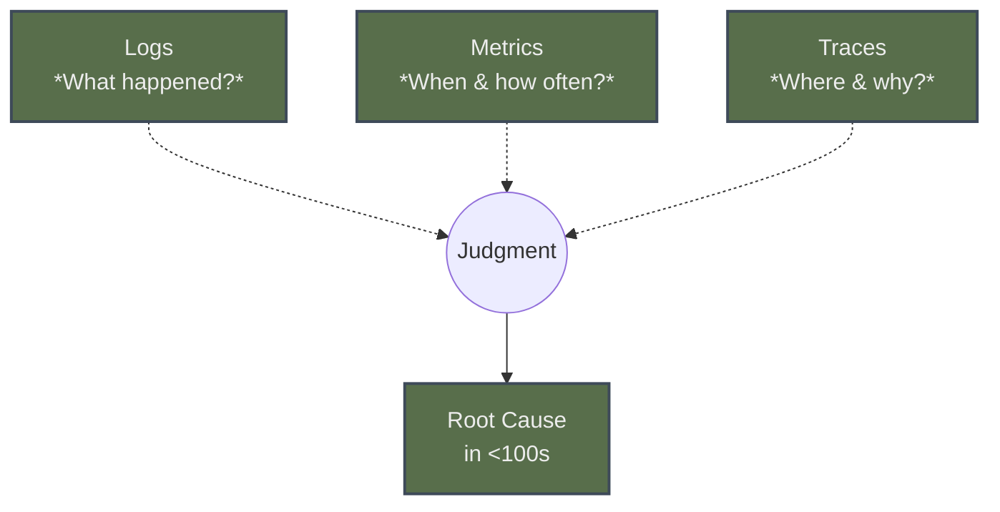

# Chapter 1 – “The Site Is Down” Isn’t a Root Cause *(Part A)* 

---

### Chapter Overview  
Five-thirty A.M., Mexico City. The sky is the exact gray of an over-caffeinated dashboard background when the PagerDuty siren detonates next to Hector Alvarez’s bed. A thousand miles away, a Tier-1 bank’s payment gateway has stopped authorizing salaries. Geneos tiles glow forest-green, but help-desk phones howl crimson.  
This opening disaster frames our journey: **monitoring can swear everything is fine while customers are bleeding fees.** We’ll watch Hector dismantle the myth of “green equals good,” teach three-pillar observability, and force telemetry to confess fast enough to save a payroll run.  
By the chapter’s end you’ll trace the failure path of a single `/submitPayroll` request across API, queue, and primary database, retro-fit logs with trace IDs, and write PromQL that surfaces business pain instead of CPU trivia.  
Hector’s rule for the hour: *“If your telemetry can’t tell you why users hurt, it’s not telemetry—it’s tranquilizer.”* 

---

## 🎯 Learning Objective  
Build the mental model—and the command-line muscle memory—to **prove why a banking workflow fails even when every dashboard claims success**. Distinguish monitoring from observability, correlate logs-metrics-traces, and patch the “Green Wall Fallacy” before it patches your credibility.

---

## ✅ Takeaway  
A service is “healthy” only when **its telemetry aligns with the customer’s outcome**. Green dashboards without causal context are lies told in RGB.

---

## 🚦 Applied Example  

```mermaid
flowchart LR
    subgraph User Payroll Run
      CLI["Payroll CLI"] --> API["payment-service /submitPayroll"]
    end
    API --> MQ["Kafka payroll.queue"]
    MQ --> DBPrim["Payments DB – primary"]
    DBPrim --> FX["Forex rates microservice"]
    FX -->|latency 800 ms| API
    API -->> CLI
    classDef bad fill:#8B2E2E,color:#EDEDED;
    FX:::bad
```

**PromQL samples**  

```promql
# Are we starving the business?
sum by(job) (rate(http_server_errors_total{service="payment-service"}[5m]))

# Invisible back-pressure inside DB locks
max_over_time(lock_wait_seconds_total{db_role="primary"}[1m])
```

**CLI log triage (banking trace missing)**  

```bash
$ kubectl logs deploy/payment-service | grep WriteTimeoutException | head -3
2025-04-30T10:31:12Z ERROR order_id=98754 ▶ WriteTimeoutException: lock_wait 12.4s
2025-04-30T10:31:13Z WARN  order_id=98755 ▶ WriteTimeoutException: lock_wait 11.9s
# ← no trace_id field, zero correlation
```

**Fluent Bit retrofit**  

```bash
[SERVICE]
    Flush        1
    Daemon       Off
[FILTER]
    Name         modify
    Match        payment.*
    Copy         request_id trace_id
    Remap        order_id uuid
```

---

## Teaching Narrative  

### **Panel 1 – The Pager Screams**  
It’s 05:31. Hector’s phone vibrates like an unbalanced server fan: **`SEV-1: Payment authorization failures > 2 % / 1 min`**.  
Geneos on his tablet shows **CPU 35 % / Mem 60 %**—all green. He growls, *“Green dashboards and screaming users. Which one do you believe?”*   
{width=800}

:::debug pattern  
**Pattern Name:** Green Wall Fallacy  
**Description:** Dashboards wired to secondary stats paint a full-green “wall” that hides primary pain—especially in active/passive DB pairs.  
**Example Fix:** Wire primary node metrics; overlay user-journey SLO graphs; alert on end-to-end error rate, not node vitals.  
:::

---

### **Panel 2 – Wanjiru Panics**  
Slack explodes: “⚠ VP Finance: *WHY ARE SALARIES STUCK?*” Wanjiru Maina’s cursor trembles over a verdant grid of Geneos metrics she barely knows.  
“CPU is fine…” she whispers. Manu Gitonga answers, “There’s always a hidden dependency.”  
{width=800}

---

### **Panel 3 – What’s Actually Broken?**  
Manu runs a quick smoke test:  

```bash
curl -s -o /dev/null -w "%{http_code}\n" https://bank.pay/api/submitPayroll
500
```  

Logs spill `WriteTimeoutException` but **no trace IDs**. The team finally sees *what* is broken, not *why*.  
{width=800}

---

### **Panel 4 – The Dashboard Is Lying**  
Hector strides in—coffee mug, Aztec tattoo, zero patience.  
“They’re monitoring the replica,” he says, tapping a chart. “Pretty graphs don’t fix broken systems. They just make the wreckage look organized.”   
{width=800}

---

### **Panel 5 – Context Is Missing**  
Juana Torres scrolls the error log: loads of stack traces, but each line ends at `trace_id=null`.  
“Nice,” Hector mutters. “It broke and didn’t leave fingerprints.”  
He sketches three circles-overlapping: **Logs • Metrics • Traces**—but traces are an empty ghost.  
{width=800}

---

## **Teaching Interlude – Panel 6: Three Pillars, One Story**  
Hector wipes the whiteboard clean.

:::hector quote  
**Hector says:** “Systems don’t fail silently. *We* fail to listen loudly enough.”  
:::



Hector points:  
- **Logs** gave the 500s.  
- **Metrics** hid behind replica stats.  
- **Traces** never spoke—no `trace_id` means no storyline.  

“Observability is a confession told by three witnesses,” he growls. “Get all of them on record.”

:::try this  
Clone `fluent-bit-trace-injector` and deploy to `payment-service` sidecar. Verify new log lines include `trace_id`, then re-run your smoke test. How many seconds before you see the guilty span?  
:::

:::reflection  
Recall a time your dashboard said “all clear” while customers filed tickets. What key signal was absent, and how would you instrument it now?  
:::

{width=800}

---

*(Panel 7 – “Lesson Locked In” plus chapter close will follow in Part B.)*

---### **Panel 7 – Lesson Locked In**  
Seconds after Juana rolls out the Fluent Bit sidecar, Hector pings the payment gateway again:

```bash
# Hector’s single-line payroll probe
TRACE=$(curl -s -D- -o /dev/null https://bank.pay/api/submitPayroll \
        -H "X-BATCH-ID: april30-payroll" | grep -Fi trace_id | awk '{print $2}')

printf "📍  Trace captured: %s\n" "$TRACE"
```

**Console output**

```
SEV-1 payroll probe …                                                       ↵
📍  Trace captured: 9af34d1b9c9b4be2
```

Hector copies the ID into Grafana’s Explore tab and the **entire execution story lights up**:

| Span                   | Service           | Duration      | Status    |
| ---------------------- | ----------------- | ------------- | --------- |
| 9af34d1b9c9b4be2       | *payment-service* | **12 417 ms** | **Error** |
| ├── b3aa/forex.call    | *forex-rates*     | 8 004 ms      | OK        |
| └── 70f1/kafka.produce | *payroll-queue*   | 320 ms        | OK        |

> The sluggish **forex-rates** call kept the DB lock open, cascading into the **WriteTimeoutException**s the team saw earlier.

Juana opens a split terminal:

```bash
# 1️⃣  Live query in Prometheus for DB lock pressure
prometheus query 'lock_wait_seconds_total{db_role="primary"}[30s]'

# 2️⃣  Loki query for the trace ID just captured
loki query '{trace_id="9af34d1b9c9b4be2"} | unwrap duration'

# 3️⃣  Watch the metric & the log cross-reference
watch -n2 \
  'echo; date "+%T"; \
   echo -n "Lock Wait (s): "; cat /tmp/prom_out; \
   echo -n "Span Duration (ms): "; cat /tmp/loki_out'
```

Both numbers fall in unison once the team rolls back an over-aggressive foreign-exchange release that had ballooned response times.

---

{width=800}

#### **Dialogue & Debrief**  
- **Wanjiru:** “So the graph was green because it watched the *replica* while the primary was stuck?”  
- **Hector:** “Yep. A mirror can cheer while your heart stops. That’s why we teach mirrors to read *blood pressure*.”  
- **Manu:** “Next action?”  
- **Hector:** “Instrumentation before optimization.  Push the trace-ID patch to *every* write path.  Then set an alert on `sum(rate(lock_wait_seconds_total[5m]))` crossing five seconds.  Victoria in Treasury doesn’t care if CPU is 40 %—she cares whether funds move before cut-off.”

---

#### **Root-Cause Timeline (CLI Transcript)**  

```bash
## T-00:00  Alert fires
04:31:02 ▶ pagerduty trigger SEV-1 payroll authorization failures > 2 %

## T+00:04  False reassurance
04:35:11 ▶ Geneos dashboard shows CPU 35 %, Mem 60 %, all tiles green

## T+00:07  Customer blast radius confirmed
04:38:28 ▶ curl POST /submitPayroll → HTTP 500

## T+00:09  Initial log grep
04:40:03 ▶ grep WriteTimeoutException payment-service.log | wc -l 487

## T+00:12  Hector identifies replica blind spot
04:43:19 ▶ diff repo/dashboards/primary.json repo/dashboards/replica.json

## T+00:14  Trace vacuum discovered (trace_id missing)
04:45:07 ▶ jq '.trace_id' payment-service.log | sort | uniq -c | head
     487 null

## T+00:16  Fluent Bit sidecar deployed
04:47:55 ▶ kubectl rollout status deploy/payment-service

## T+00:18  Trace captured & correlated
04:49:32 ▶ curl payroll probe → trace 9af34d1b9c9b4be2

## T+00:21  Root cause isolated to forex-rates latency
04:52:01 ▶ jaeger query span.duration > 5000ms service=forex-rates

## T+00:24  Hotfix: rollback forex-rates v1.3.8 → v1.3.7
04:55:12 ▶ helm rollback forex-rates 42

## T+00:27  Error rate returns < 0.5 %
04:58:46 ▶ Grafana alert clears SEV-1
```

---

#### **Instrumentation Patch (Java / Spring Boot)**  

```java
@Bean
public Filter tracingFilter(OpenTelemetry openTelemetry) {
    return (request, response, chain) -> {
        // Extract or start a span
        Span span = openTelemetry.getPropagators()
            .getTextMapPropagator()
            .extract(Context.current(), request, HttpServletRequest::getHeader)
            .storeInContext(Context.current());

        try (Scope scope = span.makeCurrent()) {
            // Add high-context banking fields
            span.setAttribute("bank.batch_id", request.getHeader("X-BATCH-ID"));
            span.setAttribute("bank.customer_id", request.getHeader("X-CUST-ID"));
            chain.doFilter(request, response);
        } catch (Exception ex) {
            span.recordException(ex);
            span.setStatus(StatusCode.ERROR, ex.getMessage());
            throw ex;
        } finally {
            span.end();
        }
    };
}
```

> **Key takeaway:** **Logs** now inherit `trace_id` via Fluent Bit ↔ span context, **metrics** tag lock waits by the same ID, and **traces** carry business-level fields (`batch_id`, `customer_id`). One ID, three voices, single narrative.

---

#### **Grafana AlertRule Fix (PrometheusRule YAML)**  

```yaml
apiVersion: monitoring.coreos.com/v1
kind: PrometheusRule
metadata:
  name: lock-wait-sla
spec:
  groups:
  - name: db-sla.rules
    rules:
    - alert: DBLockWaitSLAExceeded
      expr: sum by(instance)(
              rate(lock_wait_seconds_total[2m])) > 5
      for: 1m
      labels:
        severity: sev1
        runbook: https://git.bank/runbooks/db_lock_wait.md
      annotations:
        summary: DB lock wait > 5 s on {{ $labels.instance }}
        description: |
          High write lock contention detected. Check trace-ID drift and
          ensure forex-rates calls are < 5 s.
```

---

#### **Post-Incident Retro (Minutes Extract)**  
```
# (abbrev.) Incident Review – 2025-04-30

Attendees: Hector, Wanjiru, Manu, Juana, VP Finance, SRE Mgr  
Impact: 2 521 payroll transactions delayed 27 min; no SLA breach but CFO escalated.  
Root Cause: Latency regression in forex-rates v1.3.8 held locks on
            payments_db primary, starving write pipeline.

Contributing Factors:
  * Dashboards observed replica, not primary (Green Wall Fallacy)
  * Logs lacked trace_id → context-less grep
  * Alerting focused on infra vitals, ignored user journey SLO

Corrective Actions:
  1. **Instrumentation** – Adopt OpenTelemetry auto-instrument + bank context;
     enforce trace-ID propagation in every log line.
  2. **Dashboard Hardening** – Tie primary+replica tiles together; color-blind
     safe palette per house style.
  3. **SLO Update** – Add error budget burn alert on payroll endpoint.
  4. **Chaos Drill** – Monthly dependency latency injection.

Prevent-Recurrence Score: 8/10 (pending chaos drill completion)
```

---

#### **Visualization: Business-Impact Overlay**  
```mermaid
sequenceDiagram
    participant User as Payroll Batch
    participant API as payment-service
    participant FX as forex-rates
    participant DB as payments_db(primary)

    User->>API: POST /submitPayroll
    activate API
    Note over API: Trace ID 9af34d1b9c9b4be2
    API->>DB: BEGIN; INSERT payroll_rows
    API->>FX: GET /rate?USD→MXN
    activate FX
    Note over FX: v1.3.8 8 s
    FX-->>API: 1 USD = 16.9 MXN
    deactivate FX
    DB-->>API: COMMIT; lock_wait 0.2 s
    deactivate DB
    API-->>User: 200 OK
```
*Green (OK) vs. amber (slow) spans appear in Grafana, mapped to lock-wait metric with tooltips linking back to logs.*

---

#### **Hector’s Closing Words**  
“Pretty is for marketing,” he tells the team, sweeping the old dashboard off the wall. “**Precision is for engineering.  Next outage, make the system rat itself out before the CFO calls.**”

---
