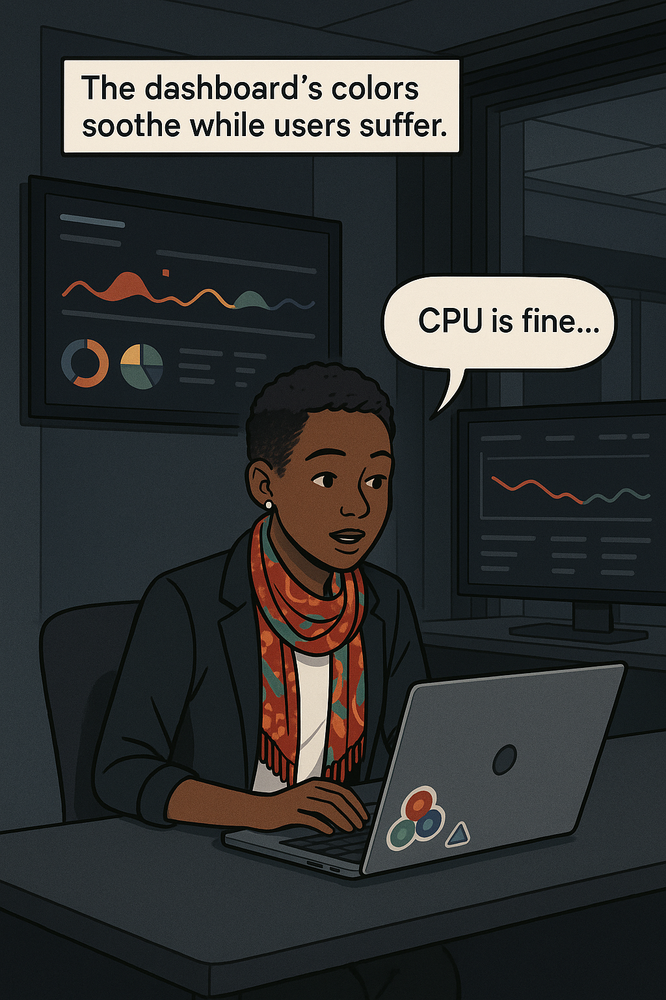
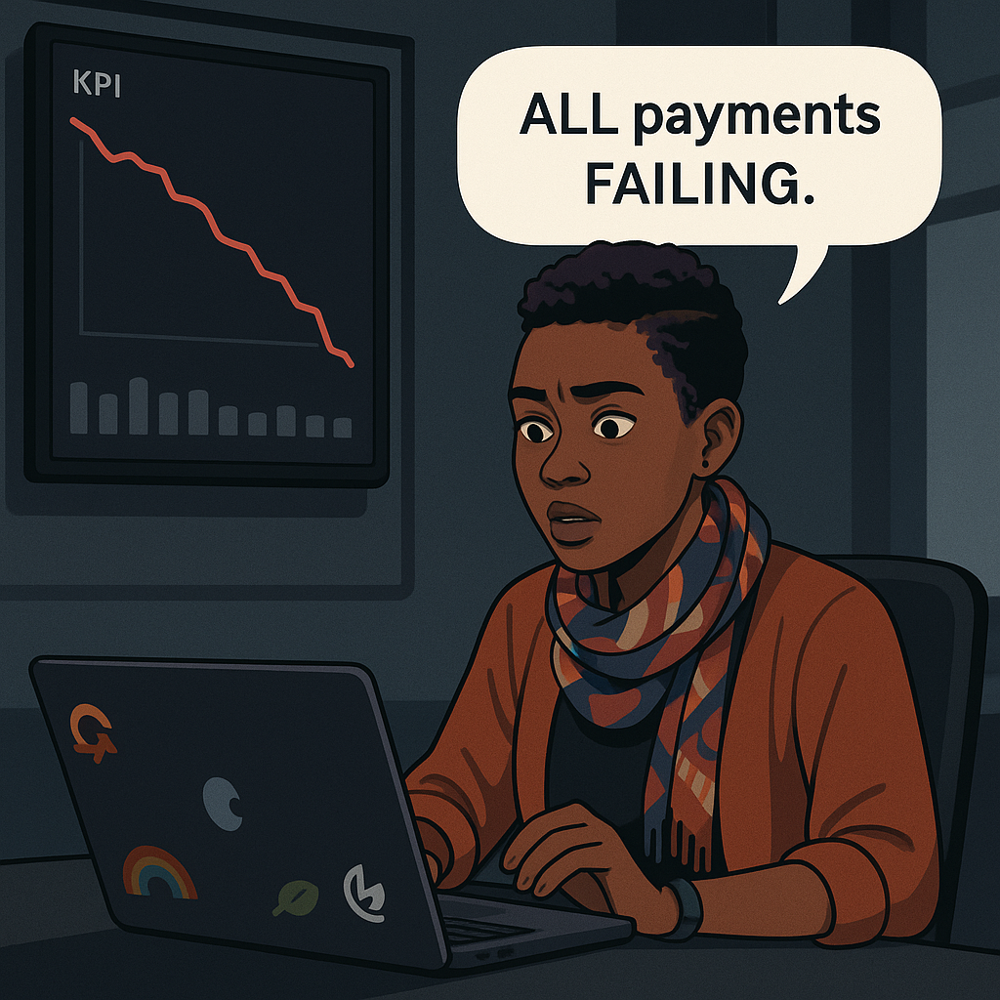
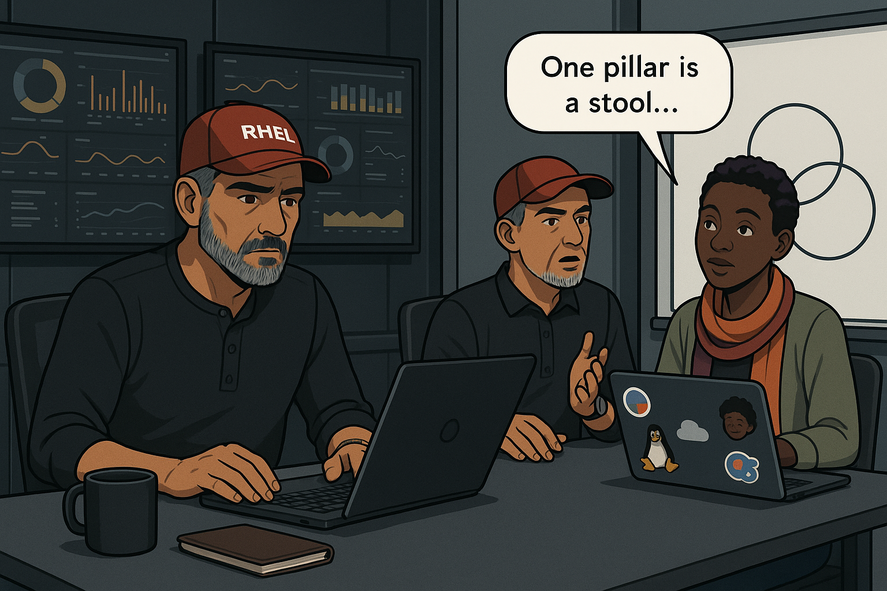
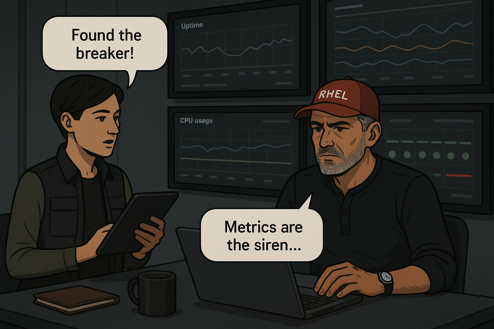
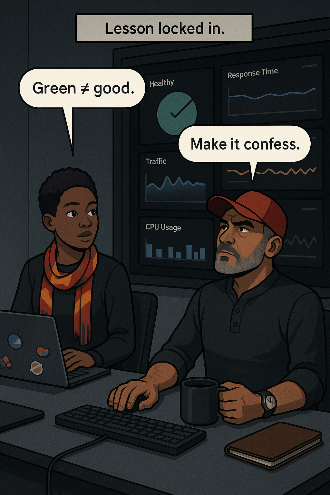

# **Chapter 1 – “The Site Is Down” Isn’t a Root Cause**  

## Chapter Overview  
At **02 : 03 AM** on a muggy Thursday, Pacifico Bank’s Nairobi control room is bathed in jade light—every Geneos widget a confident ✔. Yet within a single heartbeat the card-present failure queue rockets from six to **six thousand** transactions per minute. Junior analyst **Wanjiru Mwangi** stares at an all-green wallboard while her pager shrieks like a smoke alarm stuffed under glass. Slack erupts: the VP of Retail is posting refund figures measured in millions, the fraud team is blaming “network turbulence,” and customer-service phones swell into a feedback howl.

Enter **Hector Alvarez**, the bank’s grizzled SRE mentor, still wearing his motorcycle jacket and gripping a paper-cup espresso. He squints at the rainbow dashboard and mutters, *“Logs, metrics, traces—show me which one’s lying.”* His entrance detonates the chapter’s thesis: dashboards soothe, money bleeds, and observability exists to force a confession from silent systems.  

Across seven sequential panels, learners witness the anatomy of a false-green outage: Wanjiru’s initial paralysis, Manu’s CPU tunnel-vision, Juana’s quest for the breaker metric, Danny’s battle with missing trace IDs, and Hector’s relentless insistence that symptom sentences like *“the site is down”* are a cop-out. Each beat returns to a banking consequence—a mounting reversal fee, a delayed ACH batch, a compliance-breach timer—to anchor abstractions in financial pain.

By chapter’s end, readers will:  

* distrust “all-green” optics,  
* practice Hector’s **three-pillar loop** (Logs ∩ Metrics ∩ Traces → Root Cause Narrative),  
* instrument at least one business KPI alongside technical metrics, and  
* articulate an outage in auditor-safe language that developers can fix and executives can fund.

---  

### 🎯 Learning Objective  
Guide production-support engineers to **triangulate logs, metrics, and distributed traces** when a system looks healthy but transactions fail. Using Hector’s loop, learners will turn a vague symptom report (“site down”) into a precise, timestamped **root-cause narrative** that survives developer hand-off, post-mortem review, and regulatory inquiry.

---  

### ✅ Takeaway  
“All-green dashboards are comfort food, not evidence. Root cause lives only where **logs ∩ metrics ∩ traces** overlap—teach your system to confess or stay blind.”

---  

### 🚦 Applied Example  

```text
# Geneos metric — payments_success_rate
02:02:45  99.95
02:03:00  99.93
02:03:15  99.96
```

```json
// payment-service log 02:03:21 UTC
{
  "level": "ERROR",
  "msg": "FraudDecision persist failure – circuit OPEN",
  "txn_id": "9f8c-41d2",
  "trace_id": null,
  "amount": 129.50,
  "currency": "KES"
}
```

Success-rate never dips below 99 %, yet **23 000** card-present transactions soft-decline in nine minutes because a hidden circuit-breaker (`fraud_persist_open = 1`) aborts writes to `ledger-svc`. Without trace IDs the fault stays invisible, costing ₭ 4.1 million in reversal fees.

---  

## Teaching Narrative – Panels 1-3  

### Panel 1 — Pager Screams  
Wanjiru’s lo-fi playlist is mid-sax riff when her pager detonates. The Geneos wallboard above her desk glows a mosaic of verdant rectangles labeled “LATENCY,” “CPU,” “MEM,” “GC Pause,” all reassuringly below threshold. Yet her pager, a battered black plastic relic, spits out a cryptic all-caps line: **PAYMENT_FAILURE_RATE + 12 000 %**.

She freezes. The fluorescent hum, the faint cinnamon of night-shift coffee, the squeak of someone’s sneaker on polished tile—all of it mutes beneath the siren whine in her chest. Her first instinct, drilled by three months of runbooks, is to screenshot the dashboard. Evidence. She pastes the PNG into Slack’s `#payments-war-room` channel where emojis explode like fireworks: 🔥 🔥 🔥. The VP of Retail types “CALL ME” ten times in red bold.

{width=550}

:::hector quote  
**Hector:** “Green dashboards and screaming users—pick one to trust.”  
:::  

Hector’s voice crackles across her headset before she can speak. He’s still off-site, commuting on a midnight motorcycle ride from Westlands. *“Numbers lie. Users don’t. You’ve got five minutes to show me evidence.”* The call ends with the Doppler roar of his engine.

Wanjiru swallows panic. Evidence means logs. Evidence means metrics that track customer experience, not system vitals. She opens Kibana, filters for ERROR, and finds—nothing. The log stream is an ocean of placid INFO lines: `Authorization approved`, `Latency=92ms`, `ThreadPool: healthy`. It’s like trying to find lightning in a clear-sky photo.

She copies one line into Slack:

```text
02:03:04 INFO Authorization successful txn_id=7bfa…
```

The VP replies with a GIF of a dumpster fire.

### Panel 2 — Color vs Customers  
Wanjiru pivots to Grafana. She’s never charted a business KPI before but remembers a brown-bag talk about PromQL. Fingers flutter:

```promql
rate(card_present_success_total[1m])
```

A trembling aqua line renders, then pitches downward like a malfunctioning elevator cable—**99 % → 0.4 %** in thirty seconds. A simultaneous Slack alert posts from a Kafka consumer lag monitor—`payments-lag = 82 000 msgs`. Sweat beads on her upper lip.

She drags the graph into the war-room channel. Silence follows—startled silence, the kind that says “oh, this is real.” Manu Gitonga, the veteran night-shift engineer, skids his chair beside her.

> **Manu:** “CPU’s at thirty-seven and flat—how is that possible?”  
> **Wanjiru:** “Because CPU doesn’t know our customers are screaming.”

{width=550}

:::incident flashback  
*Three months ago, a similar breaker opened during Friday payroll. The bank paid ₭ 9 million in reversal fees and another ₭ 3 million in reputational discounts.*  
:::  

VP-Retail reappears in Slack: *“Stop the bleeding or I’m waking the CEO.”* Wanjiru feels her lungs shrinking. The call-center noise behind the glassed-in operations floor swells—a sea of headsets, apology scripts, and neon desk lamps. Every agent reports “DECLINED” in chorus.

### Panel 3 — Log Vacuum  
Manu grips the keyboard with grease-mechanic confidence:

```bash
kubectl logs -l app=payment-service --since=5m | grep -i error
```

A cursor blinks. Nothing. He pipes to `grep WARN`. Still nothing. Wanjiru wonders if the cluster is even alive, but `kubectl top` shows pods humming under 50 % CPU. Manu scrolls further back in time—INFO, INFO, INFO. The log feels like a polite dinner guest refusing to gossip.

> **Manu:** “Maybe upstream fraud service? Metrics there look fine too.”  
> **Wanjiru:** “Or maybe Geneos is drunk.”  

She scrolls the call stack from an older exception and notices a missing field: `trace_id=null`. That can’t be right. Last week Danny enabled OpenTelemetry auto-instrumentation. Where did the IDs go?

{width=550}

She pastes the null line into Slack. Danny, still on the way in via ride-share, replies: *“Ingress strips B3 headers—need config.”* Then adds a crying-face emoji.

Hector finally bursts through the glass doors, jacket streaming rainwater. He doesn’t look at the wallboard; he looks at the team’s faces.

> **Hector:** “What’s the *business* metric lagging the worst?”  
> **Wanjiru:** “Card-present success rate. Down ninety-eight percent.”  
> **Hector:** “Good. Metrics track impact. Logs give detail. Traces pin the suspect. We have one of three.”

He uncaps a marker and strides to a whiteboard.

---  

## Teaching Narrative — Panels 4-5  

### Panel 4 — Hector Arrives  
The war-room glass doors slam open; rainwater puddles behind **Hector Alvarez** as he sheds his motorcycle jacket. He bypasses the green-glowing wallboard without a glance and heads straight for the blank whiteboard. A squeak of felt tip slices the tension: three overlapping circles—**Logs**, **Metrics**, **Traces**. At the center he writes in block capitals: **ROOT CAUSE LENS**.

He turns to the team—Wanjiru, Manu, and two sleep-deprived DBAs who have wandered in—raising one eyebrow.

> **Hector:** “One pillar is a stool. Sit on it and you fall.”  
> **Juana (arriving breathless):** “We have plenty of metrics.”  
> **Hector:** “Metrics confirm pain. Logs describe it. Traces convict the culprit. We need the whole courtroom, not a single witness.”

He motions Wanjiru closer.  
> **Hector (low voice):** “What do you trust more—CPU usage or a customer who can’t pay for a taxi at 2 AM?”  
> **Wanjiru:** “The customer.”  
> **Hector:** “Good. Now, where’s the log that matches her failure?”  

Wanjiru re-tails the pod logs with a wider filter:

```bash
kubectl logs -l app=payment-service --since=15m \
  | jq -r '.msg, .trace_id'
```

Lines scroll—`trace_id` remains `null`. Hector underlines **Traces** twice on his diagram.  

{width=550}

:::aphorism  
**Hector’s Aphorism:** “If your log can’t point a finger, tape its mouth shut.”  
:::  

Manu suggests the issue might live in **fraud-svc**. The metric board for that service, buried on a separate Grafana tab, shows an obscure gauge: **`fraud_persist_open` = 1**. The team has never paid attention to it; the widget is gray, the label arcane. Manu hovers. The gauge flips red.

Hector circles the value with a red marker on the physical whiteboard beside his Venn—“BREAKER OPEN.”  

<small>*04:12 AM*: Call-center metrics show wait-time > 25 min. Compliance auto-tickers begin counting possible SLA breaches.*</small>

---  

### Panel 5 — Metric Misdirection  
Juana Torres, the alert whisperer, flips open her laptop and accelerates. Fingers fly, creating a new Prometheus alert rule:

```yaml
- alert: FraudCircuitOpen
  expr: fraud_persist_open == 1
  for: 1m
  labels:
    severity: critical
  annotations:
    summary: "Fraud circuit breaker OPEN"
    description: |
      Payments persist path blocked; potential transaction failures.
```

She commits, pushes, and ArgoCD syncs. Seconds later a crimson banner crosses the team’s Slack war-room: **ALERT - fraud_persist_open = 1**. At last—an alert that *matches* the screaming phones.

> **Juana (relieved):** “Find the right metric, find the truth.”  
> **Hector:** “Metrics are the siren; we still need the *story.*”  

Hector gestures at the circuit-breaker metric: a single integer that has quietly toggled from 0 to 1. Around the war-room a realization dawns: the Geneos dashboard never rendered this metric because the team never considered it “critical.” CPU, memory, latency—they were heroes of yesterday’s incidents. This **breaker state** is the lone Canary crying from its coal mine.

{width=550}

The fraud team Slack-pings: *“We throttled writes to ledger-svc—DB lock saturation.”* Wanjiru’s eyes widen; they’ve been blindfolded by an unmonitored breaker. Manny drops to a terminal, queries Postgres:

```sql
SELECT wait_event_type, count(*)
FROM pg_stat_activity
WHERE datname='ledger'
GROUP BY wait_event_type;
```

Rows return: `Lock | 372`. Deadlocks bloom like algae. The fraud microservice’s retry loop is politely sleeping between attempts, keeping CPU deceptively low. The dashboard’s calm is a lullaby.

Hector orders a **black-box synthetic check**:

```bash
curl -X POST https://poc-bank/api/pay \
  -d '{"amount": 19.95, "card":"4111"}' -H 'x-trace-sample: 100'
```

HTTP 200. Wait, success? But the internal `status` field reads `"soft_decline"`. Manu pipes the response to `jq .`—the API is masking failure behind HTTP success. Observability isn’t just instrumentation; it’s *honest contracts*.

> **Hector:** “When your API lies to Prometheus, Prometheus lies to you.”  

Juana patches the fraud-svc code:

```go
if err := persistDecision(ctx, txn); err != nil {
    span.RecordError(err)
    http.Error(w, "internal error", http.StatusServiceUnavailable)
    return
}
```

A rapid redeploy triggers another metric tile—`http_server_errors_total`—that finally climbs into view.

*04:25 AM*: Call-center reports success rate inching to 40 %. VP-Retail’s Slack avatar turns from furious red to cautious yellow.  

*04:28 AM*: ACH reconciliation timer hits first red threshold. Finance begs for an ETA. Hector raises two fingers—“Give me trace IDs; then you’ll have it.”  

The team turns to Danny’s pending NGINX config patch to forward `traceparent` headers, but that tale belongs to Panel 6.

---  

## Teaching Narrative — Panels 6-7  

### Panel 6 — Trace Amnesia  
Danny Mutua’s rideshare squeals to a stop outside Pacifico Bank’s side entrance just as the call-center clock flicks **04 : 29 AM**. He jogs past reception, badge still clipped to his backpack. Inside the war-room he throws a damp hoodie over a swivel chair, opens his laptop, and drops into a shell faster than the caffeine can reach his cortex.

```bash
# Patch ingress with traceparent propagation
kubectl -n ingress-nginx edit configmap nginx-ingress-controller
```

He adds:

```nginx
proxy_set_header  traceparent  $http_traceparent;
proxy_set_header  tracestate   $http_tracestate;
```

ArgoCD syncs. Jaeger dashboards refresh. Suddenly the timeline view populates with rainbow-layered spans. One span stands out—**450 ms**, tomato-red, labeled `fraud-svc → ledger-svc`. Danny clicks. A waterfall view explodes: the parent span hovers at **⧗ 98 %** sampling probability (thanks to `x-trace-sample: 100` from Hector’s curl). Child spans show repeated retries, each tagged `circuit=OPEN`.

> **Danny (panting):** “Trace IDs are flowing—we’ve caught the red fish!”  

Hector crosses arms. Jaeger’s dependency graph draws an angry crimson arrow between `fraud-svc` and `ledger-svc`. The red arrow bleeds into Grafana through Tempo’s metrics adapter; the circuit-breaker metric and the red span finally overlay.

{width=550}

Hector uncaps the whiteboard marker again:

```
     KPI ↓
 Metric  ↑
 Trace   ←
        Root Cause Lens
```

He draws arrows showing bidirectional reinforcement. Logs re-populate with IDs:

```json
{
  "level": "ERROR",
  "trace_id": "8f4e-c7eb",
  "txn_id": "9f8c-41d2",
  "circuit": "OPEN",
  "root": "ledger-svc deadlock"
}
```

Wanjiru’s pager chirps: **ALERT RESOLVED – FraudCircuitOpen**. But Hector shakes his head.  

> **Hector:** “Resolved is not *fixed*—we need an RCA.”  

He guides Wanjiru through a Postgres deadlock check:

```sql
SELECT pid, blocked_by, query
FROM pg_locks
WHERE granted = false;
```

Rows reveal a missing composite index on `txn_hash, time_bkt`. Ledger-svc had shipped a point-release at **01 : 55 AM** adding a new unique constraint that—under load—locks rows longer than the fraud service’s 300 ms deadline, triggering the breaker.

Danny back-fills index telemetry into Prometheus:

```yaml
- name: pg_locks_by_type
  query: |
    SELECT wait_event, COUNT(*)
    FROM pg_stat_activity
    WHERE datname = 'ledger'
    GROUP BY wait_event;
```

Grafana tiles update. A new heat-map shows lock wait spikes exactly when KPI plummeted. The picture clicks—three pillars, one story.

### Panel 7 — Root-Cause Lens  
At **04 : 47 AM** the team executes a two-step recovery:

1. Add the missing composite index:  

   ```sql
   CREATE INDEX CONCURRENTLY idx_ledger_txn_hash_time
     ON ledger.transactions (txn_hash, time_bkt);
   ```

2. Bump fraud-svc circuit-breaker threshold from 3 to 5 retries, giving the DB twenty extra milliseconds.

Latency normalizes; breaker flips to 0; KPI climbs. Wanjiru refreshes Grafana—the unified dashboard shows **card-present success 99.91 %**. She prints the board, slaps a sticker: **DEPRECATED** on the old CPU-happy panel.

{width=550}

Call-center wait-times drop below three minutes. The VP of Retail posts a single coffee emoji. Hector finally sits, sips his by-now lukewarm espresso.

> **Hector (softly to Wanjiru):** “Dashboards lie by omission. Make them confess early or pay later.”  
> **Wanjiru (smiling):** “Three pillars, one story.”  

*05 : 02 AM*: Compliance channel notes no SLA breach—incident resolved in 59 minutes, well below the legal 90-minute disclosure threshold. Finance calculates ₭ 0.6 million reversal fees—costly but survivable.

---  

:::reflection  
*Wanjiru’s inner voice:* “Next outage I’ll start with KPI, not CPU. If the customer feels pain, I look for the three overlapping circles.”  
:::  

---  

:::exercise  
**Try This — Build Your Root-Cause Lens**  

1. **Business KPI**: Instrument `card_present_success_total`.  
2. **Breaker Metric**: Export `fraud_persist_open` with Prometheus.  
3. **Trace Linking**: Propagate `traceparent` headers and emit span tags `circuit_state`.  
4. Intentionally lock a DB row for 500 ms.  
5. Observe which pillar reports *first*, and how quickly you can narrate the failure.  

> **Challenge Mode**: Remove one pillar (logs off, traces filtered, or metric hidden) and measure discovery time increase.

:::
