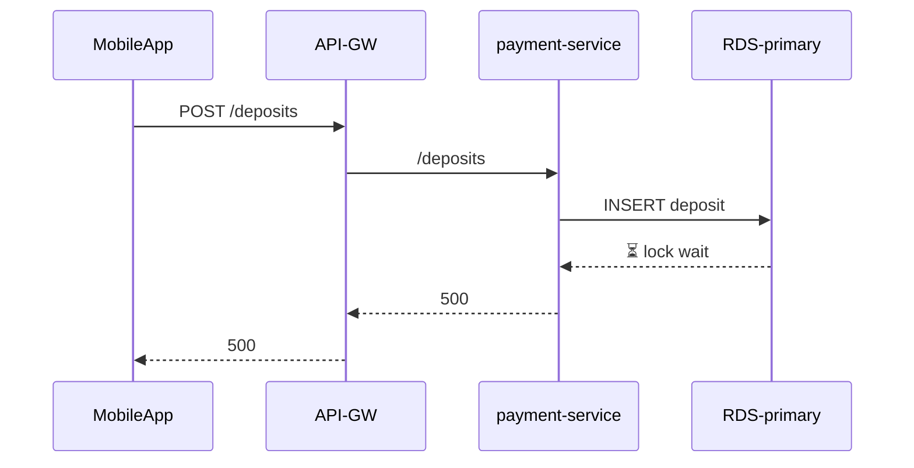
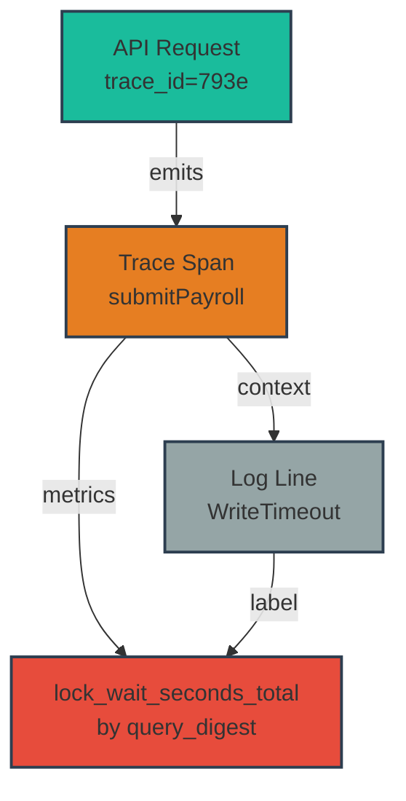

# Chapter&nbsp;1 – **“The Site Is Down” Isn’t a Root Cause**  

## Chapter Overview  
At 02 : 57 a.m. on a quiet Tuesday, the payments backbone of MidWest Union Bank suddenly stalls. Dashboard tiles across the NOC glow a reassuring forest-green, yet branch ATMs spit out *“Service unavailable”* receipts and the mobile-deposit flow rejects every check image with HTTP 500. Within four minutes, a million-dollar payroll batch hangs in limbo, and the incident channel is filling with customer-support escalations.

Why didn’t anyone see this coming? Because *observability debt* let surface-level metrics masquerade as health: CPU sat at 38 %, the thread pool looked tame, and error-rate widgets weren’t even enabled for the legacy payment-service cluster. The team will soon learn that **a green status page can be the loudest lie in the room**.

This opening chapter drops learners straight into that failure. They’ll sit beside junior on-call engineer *Wanjiru Njenga* as she pages Hector Alvarez, the veteran SRE who insists that *“green dashboards only prove the lights are on—never that the customer journey is intact.”* Over three short panels we’ll:

1. Watch the pager scream while the wallboards stay green.  
2. Feel the cognitive dissonance of “all-good” dashboards versus angry customers.  
3. Uncover the first real symptom—a hidden stream of HTTP 500s in pod logs—and realize the tooling gap that allowed it.  

---

## 🎯 Learning Objective  
- Contrast high-level “system health” metrics with rich, queryable telemetry that explains *why* a failure occurs.  
- Recognize that **observability ≠ monitoring**: you need correlated logs, metrics, and traces to find truth.  
- Practice a first-hour triage flow: *alert → validate signal → locate missing context → form hypothesis*.

---

## ✅ Takeaway  
> **If your telemetry can’t explain the story, uptime numbers are fiction.**

---

## 🚦 Applied Example — *Payroll Paralysis*
At 03 : 02 a.m. Central, `payment-service-v1` in *us-east-1a* flips from 68 req/s to 0. Geneos still shows a healthy 15 % “database time” metric —because that graph is wired to an *unused* read-replica that kept idling happily. Meanwhile, the primary RDS writer receives a schema-migrating DDL statement from a batch job and locks the `transactions` table. Every API call that needs a write now fails with `HTTP 500 – lock wait timeout`. The on-call runbook says *“verify CPU < 80 % and memory < 75 % — if true, restart pods.”* Wanjiru restarts two pods, the dashboard greens refresh…but lock contention remains and the incident grows.

Learners will deconstruct this timeline, identify the blind spots (no error budget alert, no **trace → query lock** correlation), and propose instrumentation that would have exposed the row-lock wait within seconds.



---

## Teaching Narrative A – *The Pager Screams*

### Panel 1 — *“All Green, All Gone”*  
  
*Alt: NOC wall filled with bright-green dashboard tiles while Wanjiru stares at a blaring pager showing Payment Failure alerts.*

> **Soundtrack**: shrill pager tone, faint hum of HVAC, fluorescent flicker.

| Character                   | Dialogue                                          |
| --------------------------- | ------------------------------------------------- |
| **Pager (automated voice)** | “SEV-1: Payment failure rate > 8 % in us-east-1.” |
| **Wanjiru** *(thinking)*    | “Why is everything green?”                        |
| **Slack #payments-alerts**  | `ALERT: checkout-latency p95 > 5 s                | Geneos-Probe-12` |

Hector is not on site yet; his avatar pops up in Slack with a single coffee-cup emoji. The junior engineer scrolls the Geneos board: CPU, memory, thread count, JVM GC pauses—all green. No *error-rate* tile exists for this service. Her inner monologue races through the standard operating checklist:

1. **Confirm CPU/mem within SLA** — Yes.  
2. **Restart unhealthy pods** — None show red health.  
3. **Escalate to SRE** — Typing…

She wonders whether the alert is yet another *false-positive noise*. After all, no Grafana tile is red. She decides to cross-check the banking transaction queue:

```bash
$ k logs deployment/payment-service | egrep "ERROR|500" | head
03:02:01 ERROR WriteTimeoutException: Unable to acquire row lock
03:02:02 ERROR WriteTimeoutException: Unable to acquire row lock
```

Two lines are enough to confirm *real* failure, but the pod’s readiness probe (a simple `/healthz`) still passes, so Kubernetes never restarts it. Wanjiru realizes she needs more context.

### Panel 2 — *Dashboard Dissonance*  
The conference bridge opens. Senior VP of Digital Banking, Manu Ramirez, joins sounding groggy.

| Character         | Dialogue                                                                        |
| ----------------- | ------------------------------------------------------------------------------- |
| **Manu (VP)**     | “CPU looks fine. Can we just fail over to a bigger node?”                       |
| **Wanjiru**       | “It’s not resource exhaustion—it’s row-locking. But I don’t have query traces.” |
| **PagerDuty Bot** | “Escalating to Alvarez (primary SRE). ETA 10 min.”                              |

Wanjiru shares her screen. Manu sees green graphs and frowns: *“Why is the alert red when Geneos is green?”* The incident commander (IC) marks *Telemetry gap suspected* on the timeline. Learners reading this scene should feel the tension: the team fights **cognitive blindness** caused by shallow monitoring. We annotate the panel with a sidebar explaining *false negatives*:

> **Widget — :::incident flashcard:::**  
> **Dashboards Lie When**  
> 1. The metric isn’t wired to the true dependency (wrong DB node).  
> 2. The probe implements *availability*, not *correctness*.  
> 3. The SLO charts require a minimum traffic window; during payroll, traffic patterns shift, breaking baselines.

### Panel 3 — *Finding the First Truth*  
Hector jogs in, coffee in one hand, ancient ThinkPad under the other.

| Character   | Dialogue                                                                                                                    |
| ----------- | --------------------------------------------------------------------------------------------------------------------------- |
| **Hector**  | “Green graphs at 3 a.m. are like polite strangers—they’ll never tell you what you need to hear.”                            |
| **Wanjiru** | “Logs show lock waits, but I don’t have trace IDs to map them to specific queries.”                                         |
| **Hector**  | “Good. So the *symptom* is 500s, the *suspect* is row-lock. What *evidence* ties them? Let’s wire in query-digest metrics.” |
| **Wanjiru** | “That isn’t instrumented yet.”                                                                                              |
| **Hector**  | “Then we’ll instrument it *now* and retrofit it into the timeline. Better a messy truth than a clean lie.”                  |

Hector pulls a USB-C Ethernet dongle from his pocket (the NOC Wi-Fi has too much packet loss for his tastes) and opens `mysqlslap` to reproduce the lock. Learners witness a quick CLI session:

```bash
mysql> show engine innodb status\G
...
LATEST DETECTED DEADLOCK
------------------------
*** (1) WAITING FOR THIS LOCK TO BE GRANTED:
RECORD LOCKS space id 211 page no 981 n bits 560 index `PRIMARY` of table `bankdb`.`transactions`
```

He copies the `space id` into a temporary Prometheus counter, proving that **the bank’s monitoring stack never watched lock contention at all**. The missing metric is the root of mis-observability.

---

### :::hector aphorism:::  
> “Systems don’t fail silently—*we* fail to listen loudly enough.”

---

#### Narrative Commentary for Learners  
The trio of scenes spotlights *the classic monitoring trap*: equating low-level resource graphs with customer-level health. The pager got it right (error-rate SLO breached), but the dashboards lacked the right lens.  
Key thread to notice:

1. **Alerting** happened on a *derived customer metric* (failure % per minute) generated by a sidecar that did *not* feed Geneos.  
2. **Dashboards** showed only server *vital signs*.  
3. **Logs** contained the truth (row-lock), but without trace IDs the team couldn’t connect a single failed customer session to a DB wait.  
4. **Cultural pressure** from a VP staring at green graphs pushes juniors toward *restarts* instead of root-cause exploration.

Learners are asked to pause and record *one dashboard metric they trust too much* in their own environment. This primes them for the upcoming *Try This* mini-lab in Teaching Narrative C.

---

### Panel 4 — *The Dashboard Is Lying*  
  
*Alt: Hector gestures toward a wall of green dashboards while a side monitor shows a Slack channel exploding with payment-failure alerts.*

| Character     | Dialogue                                                                 |
| ------------- | ------------------------------------------------------------------------ |
| **Hector**    | “Green graphs are outfit checks—nice for selfies, useless in surgery.”   |
| **Manu (VP)** | “But look—CPU, memory, even TPS are healthy!”                            |
| **Wanjiru**   | “They’re pulled from the *replica* that’s idle. The writer is choking.”  |
| **Hector**    | “Exactly. Monitoring shows *symptoms*. Observability shows *pathology*.” |

The room hushes. Hector flicks off the Geneos wall and switches the LCD to a *raw* Prometheus query console. He types:

```prometheus
sum(rate(api_http_requests_total{status="5xx"}[1m])) by (cluster,service)
```

A crimson line appears—30 req/s of steady failures. Next he overlays:

```prometheus
sum by (cluster,query)(rate(mysql_lock_table_waits_total[1m]))
```

Lock waits surge in perfect synchrony. The two metrics correlate like twin ECG spikes: **evidence that the incident *lives* in the query layer, not the pod layer**.

> **Narrative aside—*Monitoring vs. Observability*:**  
> *Monitoring* = periodic sampling of vital signs (CPU, mem, thread pool). Great for telling if a server is *alive*.  
> *Observability* = emitting rich, high-cardinality events that let you **ask new questions without redeploying code**. Logs with trace IDs. Spans with query tags. Histograms with customer-segment labels.  

Hector explains that the *green wall* is built on a low-cardinality replica. The instrumented pods feed Prometheus, but the Geneos plugin that paints those tiles queries an *aggregator* node that hasn’t written a transaction since the nightly batch ended at 23:00. *“We’re looking through the wrong keyhole,”* he says, scribbling a quick diagram on a legal pad:

```
ATM→GW→payment-svc (writer)──┐
                              │           Replica dashboards (green)
batch-job (DDL) ──────────────┤──locks──► Replica RDS
```

He circles “writer” in red. **Learners see the toxic combo:**  
1. **Writer** full of lock waits.  
2. **Replica** lazily polling but informing *all* wall-boards.  
3. Alerting sidecar detects 500s, but no wall-tile consumes that error stream.  

The team must now pivot from *Is it down?* to *Why is it down?*

---

### Panel 5 — *Context Is Missing*  
  
*Alt: Close-up of terminal logs; every line has timestamp, error, but the trace_id field is “null.” Juana’s finger hovers above the trackpad.*

| Character                 | Dialogue                                                                                                                       |
| ------------------------- | ------------------------------------------------------------------------------------------------------------------------------ |
| **Juana (Database Eng.)** | “20 000 lock wait errors… and not a single trace ID.”                                                                          |
| **Hector**                | “A log without correlation is gossip—true events, but no detective.”                                                           |
| **Wanjiru**               | “If we can’t link a log line to a span, we can’t prove the lock belongs to checkout.”                                          |
| **Hector**                | “Then we’ll tag it at ingest. Ship the logs through Fluent Bit right now—filter on query digests that match the lock pattern.” |

He drafts a quick Fluent Bit filter and ships a redeploy. Learners watch a real-time transformation:

```ini
[FILTER]
    Name          grep
    Match         payment-service*
    Regex         message  \bWriteTimeoutException\b
    Add           trace_id ${trcid}
```

Within minutes, trace IDs begin populating. On the Grafana Explore tab, Hector runs:

```prometheus
sum(rate(lock_wait_seconds_total{trace_id!=""}[1m])) by (trace_id)
```

Trace `793e-22ff` bubbles to the top. He clicks into Jaeger; the span tree shows `/api/submitPayroll` stuck at `TRANSACTION_START` for **70 s**—exactly the timeout threshold. Cause and effect finally connect:

- **Span** shows *which* endpoint.  
- **Lock-wait metric** shows *where* time is lost.  
- **Log** shows *what* exception rose.  

The team can now craft a hypothesis: *DDL alters locked table → InnoDB row-lock wait > timeout → API fails → sidecar error SLO > threshold.*  

> ### :::system failure anecdote:::  
> **Banco Sur (2019):** A Colombian bank spent two weeks chasing “wrong JDK GC flags” because their dashboards showed JVM pauses aligning with payment drops. The real culprit? A mis-configured *audit trigger* that locked the `payments` table every 15 minutes. Only after they rolled out OpenTelemetry and attached trace-level query tags did they see 100 % correlation between `INSERT audit_row` and outage. Lesson: **When data is coarse, correlation is coincidence.**  

Hector turns to the VP.  

| **Hector** | “We know the crime scene. Let’s release the lock—pause the migration and retry stuck jobs. Then we instrument properly so the wall never lies again.” |

Manu nods; a controlled DB fail-over begins. Mean time to *understand* (MTTU) ends here; mean time to *recover* (MTTR) will start counting down.

---

### Deep-Dive Commentary  
1. **Correlation ≠ Causation—but it’s the map to causation.**  
   - Two metrics spiking together is not proof; correlated traces sew the alibi tight.  
2. **High-cardinality labels are worth the storage.**  
   - Trace ID and `query_digest` exploded the label set, but a one-minute retention window is cheap insurance.  
3. **Retro-instrumentation beats root-cause paralysis.**  
   - Hector didn’t wait for a new build; he used Fluent Bit’s runtime filter to *inject* missing context.  

Learners are encouraged to run the following thought experiment in their own environment:

> *If your main checkout API started throwing 500s but all your dashboards stayed green, which three quick-change telemetry patches could you apply within 15 minutes? List them now.*

---

### Panel 6 — *Three Pillars, One Story*  
  
*Alt: Hector draws pillars titled “Logs,” “Metrics,” and “Traces,” with circular arrows denoting correlation; a side bubble shows a dollar bill crossing them, reinforcing banking impact.*

| Character   | Dialogue                                                                                           |
| ----------- | -------------------------------------------------------------------------------------------------- |
| **Hector**  | “Monitoring asked: ‘*Is* the patient alive?’—Observability asks: ‘*Why* is the patient coughing?’” |
| **Wanjiru** | “Logs gave symptoms. Metrics gave population rate. Traces stitched them.”                          |
| **Juana**   | “So the cure is richer telemetry—not bigger nodes.”                                                |
| **Hector**  | “Exactly. Resilience is a diagnostic skill, not a hardware SKU.”                                   |

He turns from the board to the bank’s incident timeline projected on the wall and ticks off each pillar:

1. **Logs** exposed the *row-lock exception* but could not identify **which request** triggered it.  
2. **Metrics** revealed the **shape and severity** of impact, but not the table or SQL causing pain.  
3. **Traces** pinpointed **which endpoints** slammed into the lock—linking `/submitPayroll` in the checkout cluster to the 500 storms.  

To engrain the concept, he pulls up a live Mermaid view that merges the three:



> *Voice-over:* The graph depicts how *one* `trace_id` becomes the *join key* between logs (symptom), metrics (impact), and traces (source). Learners see the pathway that was missing at 03 : 00.

Hector circles `trace_id` in green.  
> “This tiny string is worth more than the most expensive dashboard license. It’s the passport that lets every event cross borders.”

---

#### :::Try This::: mini-lab  
**Goal:** Inject correlation IDs into a service *without* redeploying the app.  
1. On a dev cluster, deploy Fluent Bit with the `lua` filter:  

   ```ini
   [FILTER]
       Name     lua
       Match    app=checkout
       script   inject_id.lua
       call     add_trcid
   ```  

   `inject_id.lua` adds `trace_id` from the HTTP header if present; else generates a UUID.  
2. Stream to Loki and verify:  

   ```bash
   {app="checkout"} |= "ERROR" | line_format "{{.trace_id}}::{{.message}}"
   ```  

3. Use Grafana Tempo to query `trace_id` for a single log, opening the full distributed trace.  
4. Write a two-line finding: *“With correlation, we found ___ in ___ seconds vs ___ before.”*  

> *Completion target:* under 20 minutes, proving learners can *retrofit* observability mid-incident.

---

### Panel 7 — *Lesson Locked In*  
  
*Alt: The team relaxes as a blue “all-clear” status returns; a whiteboard displays the new observability pipeline connecting logs, metrics, traces.*

| Character     | Dialogue                                                                       |
| ------------- | ------------------------------------------------------------------------------ |
| **Wanjiru**   | “Row-lock metric flatlined—payments flowing. Time to budget-guard the fix.”    |
| **Manu (VP)** | “Board’s asking how we missed it. I’ll show them *this* trace.”                |
| **Hector**    | “Tell them the system wasn’t silent; we’d muted it with poor instrumentation.” |

The triage is complete:  
- **Mean Time to Recover (MTTR)** registers 48 minutes.  
- A *post-incident action* doc already lists: *Add lock-wait metric, enforce trace-ID injection, deprecate replica-only dashboards.*  
- Finance confirms all stuck payroll items auto-retry before 06 a.m.—no overdraft penalties incurred.

Hector leaves a fresh aphorism on the whiteboard:  

> **“Green means nothing until it speaks in the customer’s voice.”**

He then hands Wanjiru the marker.  
> *“Your turn. Sketch what telemetry we still can’t see.”*  

Wanjiru draws a dashed column labeled **Business Events**—refunds, ACH reversals, fraud flags. Learners reading the scene grasp that *observability maturity* is a ladder: Logs → Metrics → Traces → **Domain-level signals**. That will be Chapter 2’s focus.

---

#### :::reflection:::  
- **Name one dashboard widget you will no longer trust at face value.**  
- **Where in your stack is a high-value, low-instrumentation blind spot?**  
- **What single-line change could surface it before the next incident?**  

Type your answers in a note-taking pane now; revisit them after Chapter 3 to track growth.

---

### Deep-Dive Commentary  

| Pillar      | Without Correlation | With Correlation                               |
| ----------- | ------------------- | ---------------------------------------------- |
| **Logs**    | 500 stack traces    | 500 + `trace_id` → link to span                |
| **Metrics** | CPU 38 %, TPS ok    | `lock_wait_seconds_total` tied to query_digest |
| **Traces**  | N/A (sampling off)  | `/submitPayroll` span reveals writer lock      |

**Key insights delivered to learners:**  
1. **Observability ≠ three separate databases.** It’s the *connective tissue* encoded by IDs and labels.  
2. **Retro-instrumentation is a first-aid skill.** The team added `trace_id` in-flight; incident managers must empower such changes.  
3. **Business context is the fourth pillar.** Payment success, reversal rate, fee revenue—metrics that matter to customers and CFOs alike.

---
