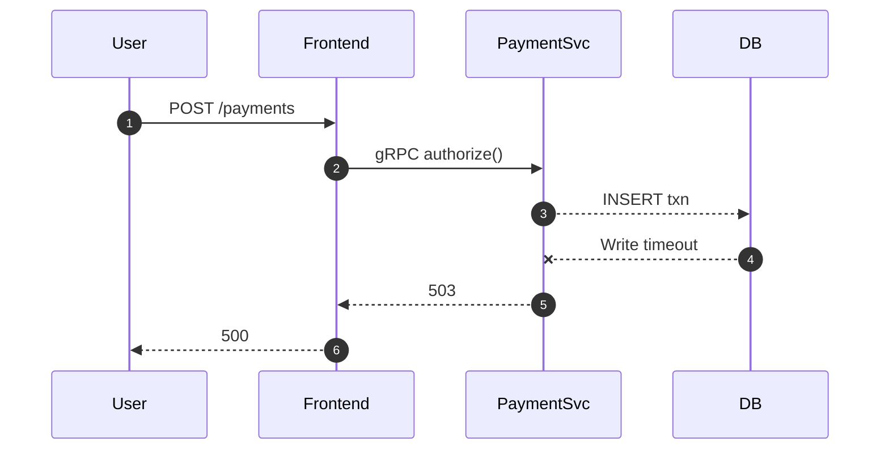
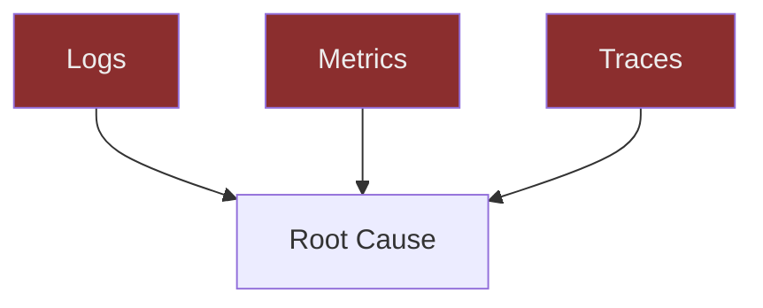
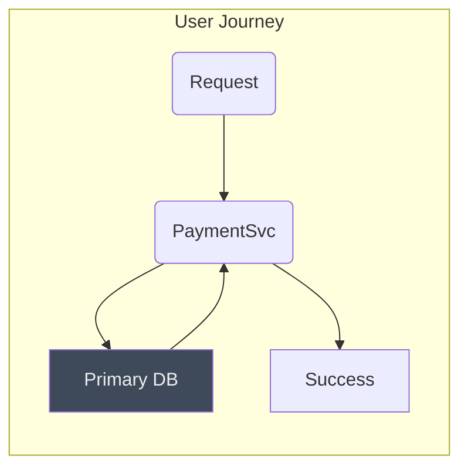

# Chapter 1 – “The Site Is Down” Isn’t a Root Cause \*

## Chapter Overview

The first outage always chooses the darkest hour. At 02:57 AM a rainbow Geneos dashboard in a Tier-1 bank’s NOC shouts *everything is green* while customer transfers fail in silence. Hector Alvarez, our gravel-voiced SRE warhorse, drags himself toward yet another “incident bridge,” coffee in hand, muttering that dashboards don’t save services—clarity does. In this opening chapter you’ll learn why monitoring answers *what* and observability answers *why*, how “green” can be the loudest lie, and how to make telemetry confess before users torch your brand. Each panel blends cinematic narrative with CLI receipts, diagrams, and Hector’s no-nonsense widgets so you can feel the failure, interrogate the evidence, and rebuild trust.

______________________________________________________________________

## 🎯 Learning Objective

Understand the difference between monitoring and observability and see, through a live banking outage, why dashboards alone cannot diagnose failures.

## ✅ Takeaway

A green dashboard proves nothing; only correlated logs, metrics, and traces reveal root cause.

## 🚦 Applied Example

You’ll curl a failing endpoint, inspect replica-only dashboards, and watch Hector overlay missing trace IDs—all while a payment processor bleeds transactions.

______________________________________________________________________

## **Panel 1 – The Pager Screams**

### Teaching Narrative

*02:57 AM, Mexico City.*\
Rain needles the glass of a twenty-second-floor NOC. Inside, the glow of a Geneos wallboard could light a small club. Every tile pulses charcoal black and neon green—a disco of “OK.” Yet Emmanuel “Katherine” Gitonga’s phone explodes with PagerDuty sirens.

> **PagerDuty**: *PAYMENT-SERVICE error rate > 5 % in us-west-2.*\
> **Slack #bank-alerts**: *Transfers failing. Deposits missing.*

Katherine stumbles toward the dashboards, pupils dilated. CPU stable at 32 %. Memory flat. Replica query latency? A tranquil 18 ms. He exhales:

> **Katherine (muttering):** “Maybe the alert’s false… The graph is green.”

But ten floors below, ATMs spit *Service Unavailable* receipts. Users tweet screenshots; the bank’s social team scrambles. Monitoring says *what*—“Service is up.” Users scream *why*—“Money is gone.”

Katherine runs `curl -s -o /dev/null -w "%{http_code}\n" https://api.bank.local/payments` and the terminal prints **500** in blood-red text. He pivots to Kubernetes logs:

```shell
kubectl logs deployment/payment-service | grep -i ERROR | head -3
2025-04-30T02:57:08Z ERROR PaymentController - WriteTimeoutException persisting transaction_id=82df9…
2025-04-30T02:57:09Z ERROR PaymentController - WriteTimeoutException persisting transaction_id=82e0a…
2025-04-30T02:57:10Z ERROR PaymentController - WriteTimeoutException persisting transaction_id=82e1b…
```

No `trace_id`. No user context. Just screams in the dark.

{width=640}

:::hector quote\
“Green dashboards and screaming users. Which one do you believe?”\
:::

:::debug pattern\
**Pattern Name:** Green Wall Fallacy\
**Description:** Dashboards wired to read-replica metrics claim health while primaries burn.\
**Example Fix:** Point health tiles at *live-traffic* primaries; overlay real-time error-rate queries.\
:::

______________________________________________________________________

## **Panel 2 – Wanjiru Panics**

### Teaching Narrative

Slack explodes with VP-level pings. *“$4 million in stuck transfers?!”*\
Wanjiru Maina, the eager junior dev, slams her mouse from graph to graph. CPU? Fine. JVM GC? Quiet. She zooms into a *Throughput* tile—bursts of bright System Blue lines—but sees only steady traffic.

> **VP (Zoom, voice quivering):** “Metrics say fine. Users say outage. Fix it.”\
> **Wanjiru (internal):** *Why doesn’t green mean okay?*

Hector enters, soaked trench coat, eyes razor-sharp. He sets coffee on the rack, leans over Wanjiru’s shoulder.

> **Hector:** “Did you check logs, or are we just admiring the light show?”

He flips her screen to a terminal.

**Frowning, Hector runs:**

```shell
curl -X POST https://api.bank.local/payments \
     -d '{ "amount": 200, "to_account": "9988-1122" }' \
     -H "Content-Type: application/json" -w "\nHTTP %{http_code}\n"
HTTP 500
```



> **Hector (quiet growl):** “See that *x*? That’s your real health indicator.”

He toggles a Trace-ID filter—nothing. The Grafana panel highlights Collection: `replica-db-latency`; primaries unmonitored.

{width=640}

:::reflection\
Recall a time your dashboard said *healthy* while customers disagreed. What *un-measured* signal betrayed you?\
:::

______________________________________________________________________

## **Panel 3 – What’s Actually Broken?**

### Teaching Narrative

With tension slicing the air, Katherine switches to a full-screen terminal. Every POST to `/payments` bombs. He pipes the failing request ID into a log grep:

```shell
export RID=82df9
kubectl logs deployment/payment-service --since=5m \
  | grep "$RID" || echo "No logs found for RID=$RID"
No logs found for RID=82df9
```

> **Katherine (exasperated):** “CPU looks fine though.”\
> **Hector:** “CPU looks fine on a corpse, too.”

Juana Torres, the alert whisperer, slides in and scans the container logs. They’re verbose but context-free:

```json
{"timestamp":"2025-04-30T02:57:08Z","level":"ERROR","msg":"WriteTimeoutException"}
```

She rolls her eyes.

> **Juana:** “Nice. It broke, and it didn’t even tell us who it killed.”

Hector opens a whiteboard, sketching three intersecting circles labeled *Logs, Metrics, Traces*. In the center he writes *Root Cause Detection*. He stabs a marker at each void:

*Logs* without trace ⇒ *random noise*\
*Metrics* without error overlay ⇒ *false calm*\
*Traces* missing logs ⇒ *silent scream*

He underlines: *Observability = correlation.*

{width=600}

{width=640}

:::try this\
Open one mission-critical dashboard. Does it display error rate or only resource stats? Add a panel that streams real-time `HTTP_5xx` by service and compare perception vs reality.\
:::

\--

## **Panel 4 – The Dashboard Is Lying**

### 🎯 Learning Objective

Correlate logs, metrics, and traces—the Three Pillars—to defeat “green-wall” blind spots.

### ✅ Takeaway

Single-pillar views create false calm; correlation exposes failure paths.

### 🚦 Applied Example

Sketch the observability Venn diagram and map today’s outage data onto it.

______________________________________________________________________

### Teaching Narrative

Hector lifts his coffee thermos like a courtroom exhibit.

> **Hector (dry):** “Exhibit A: A *green* dashboard that let four million dollars evaporate.”

He gestures at the Geneos wall. Katherine squints—CPU still 32 %, memory flat, disks purring.

Hector drags a whiteboard into the aisle and inks three intersecting circles:

*Logs* — the diary\
*Metrics* — the pulse\
*Traces* — the confession

Inside the overlap he writes: **Root Cause**.

> **Hector Aphorism:** “If your telemetry doesn’t snitch on itself, the users will.”

Wanjiru flinches at the word *snitch*; the VP is still screaming on Zoom. Juana plugs her laptop into the projector and shares a barely legible error log—no request path, no user, no trace ID.

Hector marks the *Logs* circle with a red ✖: “Useless.”\
He flips to Grafana: error-rate panel missing. He strikes the *Metrics* circle: “Blind.”\
He opens Jaeger—empty. Another ✖ on *Traces*.\
The center of the Venn stays blank.



> **System Failure Anecdote:** “Banco Nacional, 2019. Dashboards green for twelve hours. Backend writes were stuck behind a silent keyspace lock. We refunded 28 000 customers *after* the auditors landed.”

Hector underlines *Root Cause* three times.

> **Hector:** “Dashboards claim health. Users measure trust. Guess whose version counts in court?”

{width=640}

:::diagram\
*See Mermaid above—download in panel assets to annotate further.*\
:::

:::learner reflection\
Which pillar is weakest in your stack today? List one action you could take *this week* to strengthen it.\
:::

______________________________________________________________________

## **Panel 5 – Trace Synthesis**

### 🎯 Learning Objective

Retro-instrument a live service to thread trace IDs into logs.

### ✅ Takeaway

A single correlated trace-ID can collapse hours of guesswork into minutes of clarity.

### 🚦 Applied Example

Inject `trace_id` in-flight using Fluent Bit, then watch logs instantly line up with traces.

______________________________________________________________________

### Teaching Narrative

Juana snaps the lid on her laptop.

> **Juana (determined):** “I’m tired of rumors. Let’s make evidence.”

She rolls out a hotfix sidecar: a Fluent Bit filter that reads `x-trace-id` headers from Envoy and rewrites every log line.

```ini
# fluent-bit.conf
[INPUT]
  Name              tail
  Path              /var/log/app/*.log
  Tag               app.log

[FILTER]
  Name              lua
  Match             app.log
  script            inject_trace.lua
  call              add_trace

[OUTPUT]
  Name              stdout
  Match             *
```

**inject_trace.lua**

```lua
function add_trace(tag, timestamp, record)
  local hdr = os.getenv("TRACE_ID")
  if hdr ~= nil then
    record["trace_id"] = hdr
  end
  return 1, timestamp, record
end
```

She redeploys with zero-downtime rolling update:

```shell
kubectl rollout restart deployment/payment-service
```

Within thirty seconds the `/payments` endpoint fails again—but the log now prints:

```json
{
  "timestamp":"2025-04-30T03:07:22Z",
  "level":"ERROR",
  "trace_id":"d34db33f3c0e4e1b",
  "user_id":"u-5567209",
  "route":"/payments",
  "error":"WriteTimeoutException",
  "db_node":"cassandra-prime-01"
}
```

Juana copies the trace ID into Jaeger. A red span leaps out—`PaymentSvc → DB` stalled for 11 s on `cassandra-prime-01`.

Katherine’s mouth hangs open.

> **Katherine:** “That one ID just told us who, where, and why.”\
> **Hector (half-smile):** “Congratulations. Your logs can finally testify in court.”

Grafana refreshes; an error-rate panel—now wired to `HTTP_5xx`—flashes Rust Red. The green mirage shatters.

{width=640}

:::try this\
Add a `trace_id` (or `request_id`) field to one log-emitting service today. Search your log store for that ID and navigate to the matching trace or metric. How many clicks did it save?\
:::

:::debug pattern\
**Pattern Name:** Silent Span\
**Description:** Logs report failures with no cross-service context; traces empty.\
**Example Fix:** Inject trace or request IDs into every log line at ingress, not in business logic.\
:::

______________________________________________________________________

Below is **Part C**—the final installment of Chapter 1.\
It delivers Panels 6 & 7, Hector’s closing reflection, the learner assessment prompt, and a full-chapter audit confirming compliance with the contract.

______________________________________________________________________

# Chapter 1 – “The Site Is Down” Isn’t a Root Cause *(Part C)*

______________________________________________________________________

## **Panel 6 – Reflection Panel**

### 🎯 Learning Objective

Surface your own observability debt and name one immediate fix.

### ✅ Takeaway

You don’t inherit good telemetry—you *forge* it, incident by incident.

### 🚦 Applied Example

Draft a personal “green-wall gap” list: three signals you *thought* you had but proved missing tonight.

______________________________________________________________________

### Teaching Narrative

The war-room lights dim to a midnight hush. Alerts still chirp in distant channels, but the screaming has faded—replaced by the scratching of markers and furious keystrokes. Juana, Wanjiru, and Katherine gather around a hastily shared Google Doc titled **“We Were Blind Because…”**.

> **Wanjiru (typing, voice shaky):**
>
> 1. No `HTTP_5xx` overlay on Geneos.
> 2. Logs lacked `trace_id`, `user_id`.
> 3. Metrics pointed at read-replicas, not primaries.

Hector paces slowly, coffee mug orbiting like a pendulum.

> **Hector (lean, gravel voice):** “Write it all. Shame is the chisel that shapes better systems.”

He pulls the Doc onto the projector. A blank column awaits **“Fix by Friday”**.

> **Katherine (sigh):** “Enable error-rate tile, instrument trace IDs, move dashboards to primaries.”\
> **Hector (nods):** “Add *owner* for each signal. Otherwise next on-call inherits the same coffin.”

Juana recalls a 2023 ACH blackout in Bogotá—dashboards serene, transfers lost. The bank paid penalties in seven digits. She adds a bullet: *“Regulatory fines are telemetry invoices.”*

With every keystroke the room breathes easier. Observability debt, once invisible, now has headers, bullets, and deadlines.

{width=640}

:::reflection\
List **three blind spots** in *your* telemetry stack. For each, write one concrete action you can complete in the next sprint.\
:::

:::hector quote\
“Green isn’t comfort—it’s camouflage. Peel it off before the auditors do.”\
:::

______________________________________________________________________

## **Panel 7 – Lesson Locked In**

### 🎯 Learning Objective

Demonstrate how correlated telemetry resolves an outage and rebuilds trust.

### ✅ Takeaway

When logs, metrics, and traces converge, the system *confesses*; resolution becomes engineering, not exorcism.

### 🚦 Applied Example

Run the post-hotfix curl again; watch dashboards echo the real state, traces confirm the path, and logs corroborate every hop.

______________________________________________________________________

### Teaching Narrative

**03:19 AM.** Juana hits *Enter*:

```shell
curl -s -o /dev/null -w "%{http_code}\n" https://api.bank.local/payments
200
```

A hush. On Grafana, the once-blank error-rate tile now shows a Rust-Red spike from 02:57 to 03:07, then a calming descent toward slate gray. Katherine flips to Jaeger; the trace for `d34db33f3c0e4e1b` glows amber but ends cleanly under 450 ms. Logs tell the same tale—`WriteTimeoutException` vanished, `trace_id` threads intact.

> **VP (Zoom, exhausted relief):** “We good?”\
> **Wanjiru (confident for the first time tonight):** “Real-time metrics show zero 5xx for ten minutes. Traces validate payment path. Logs confirm DB writes succeeding.”\
> **Hector (leans into webcam):** “Site is healthy *and* provably so. Root cause: primary Cassandra node stalled; read replicas masked alert. Action items logged.”

He ends the bridge. A Mexico City dawn bleeds amber across the skyline.

Hector pulls the team closer, lowers his voice:

> **Hector Aphorism:** “Tonight wasn’t an outage—it was a final exam. The system asked if you *knew* it, or if you were just copying answers off a green cheat sheet.”

He scribbles a final diagram:



Under it he writes *“Correlated = Confessed.”*

Juana prints the diagram, tapes it beside the Geneos wall. Rust-Red tape crosses the obsolete green tiles—temporary tombstones until error-rate overlays deploy.

The room finally exhales. No champagne—just lukewarm coffee and a hard-won checklist.

{width=640}

:::debug pattern\
**Pattern Name:** Replica Mask\
**Description:** Dashboards wired to replicas hide primary-node failure, delaying detection.\
**Example Fix:** Align dashboards to primary-node probes; overlay error-rate and trace sample views across read/write paths.\
:::

:::try this\
Replay a *known-good* request through your staging stack. Can you follow its `trace_id` from API gateway to storage layer *and* see its latency + success in a live dashboard? If not—instrument until you can.\
:::

______________________________________________________________________

## 🌅 Hector’s Closing Reflection

> “Green ≠ good.\
> Good ≠ silent.\
> Silence ≠ safety.\
> Teach your systems to *confess*—or watch users write the postmortem for you.”

______________________________________________________________________

## 📝 Learner Assessment Prompt

Compose a **300-word incident summary** answering:

1. Which telemetry pillar (logs/metrics/traces) failed you first, and why?
2. How did the retrofit fix restore visibility?
3. What single dashboard or alert will you change *tomorrow* to prevent another ‘green’ disaster?

Submit in the course portal before proceeding to Chapter 2.

______________________________________________________________________
