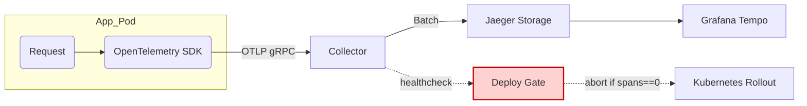

# Chapter 2 – **“The Problem Isn’t Always the Problem”**

---

## Chapter Overview  
It’s 04 : 26 on a Tuesday—end-of-month settlement day at Kenya-Metro Bank. Overnight wire transfers that normally glide through the **swift-transfer-service** have begun to vanish into limbo. Corporate treasurers from Nairobi and Mombasa jab the red “priority support” hotline, yet the main Geneos dashboard glows comfortingly green. CPU, memory, and even network utilisation hover in the low forties; Ops shift-lead Manu Gitonga would swear everything is fine—if only Hector’s pager weren’t lighting up like Diwali.  

Moments earlier, a junior SRE pushed a *seemingly* harmless Helm values patch during a routine one-node drain: `enableTracing=false`—meant for dev clusters—slipped unnoticed into production. Now every outbound wire request sails through the code path **without** emitting a single span. Logs record success messages, but sender accounts never debit, receivers never credit, and the regulator’s resiliency clock is already ticking.  

This chapter deep-dives into a subtler observability failure: when instrumentation itself breaks and the team chases the **wrong evidence**. You’ll watch Hector drag the crew from seductive CPU graphs to the real culprit—disabled tracing headers—and learn the defensive patterns that keep telemetry from switching itself off.  

By the curtain call, you should recognise that “the metric looks fine” is a statement about your *tools*, not your *system*, and that every deployment pipeline needs a guardrail that screams if telemetry is missing before users do.

---

### 🎯 Learning Objective  
Illustrate how mis-configured instrumentation can erase critical evidence, delaying diagnosis, and teach teams to harden tracing defaults, lock log schemas, and enforce post-deployment observability checks.

### ✅ Takeaway  
If your code can run without leaving breadcrumbs, it will—never ship a build that can hide its own crimes.

### 🚦 Applied Example  
At 04 : 26 the **swift-transfer-service** begins accepting 8 784 wire-transfer API calls per minute but writing **zero** rows to the settlement ledger. Legacy Geneos shows *Transport Thread CPU* at a placid 42 %, so Ops ignores the first call-centre escalation. A back-office recon script finally flags a KSh 1.7 billion “in-flight” delta.  

A quick `grep "WireTransferRequest"` on the service logs reveals only `INFO WireTransferRequest received id=…`—no `trace_id`, no `span_id`, and, most damningly, no `transaction_id`. A follow-up Jaeger query (`service=swift-transfer-service operation=WireTransferProcess`) returns **0 spans** for the last hour. Root cause: a Helm release that set `enableTracing=false`, propagated via ConfigMap reload without triggering a pipeline test. With traces gone, the team wasted 42 minutes inspecting CPU, GC, and NAT gateway metrics before discovering the silent mis-configuration. (≈ 160 words)

---

### Panel 1 – *False Green, True Red*  
A frantic call-centre agent waves a yellow “P1” escalation sheet as Manu studies a serene CPU time-series on the wall-mounted Geneos board.

> **Agent (voice over speaker):** “Corporate wires are hanging—Treasury says *nothing* is posting!”  
> **Manu:** “CPU is forty-two percent; nothing’s choking.”  
> **Hector** *(bursting through the door, half-tied shoelaces)*: “When you stare at the wrong metric, every problem looks like not-a-problem.”  
> **Wanjiru:** “What should we check first?”  
> **Hector:** “Whatever the customer feels *before* we feel a graph—throughput of posted wires.”

Hector flips to Grafana, types a quick PromQL:  

```promql
sum(rate(wire_posted_total[1m]))
```  

The stat card plummets to **0.0 wires/s**.

{width=600}

:::hector-aphorism  
“You can’t KPI your way out of an outage you can’t see.”  
:::

---

### Panel 2 – *The Seductive Dashboard*  
The Geneos “Global Health” dial still points blissfully at **GOOD**; Manu refreshes, hoping red will appear.

> **Manu:** “Still no spikes—maybe queue depth?”  
> **Hector:** “Maybe we’re measuring *the wrong queue*. Metrics that don’t map to money are vanity.”  
> **Wanjiru:** “Ledger-write latency?”  
> **Hector:** “Good instinct—split by transfer type and region.”

Wanjiru’s ad-hoc query shows ledger latency flatlining at 10 ms—too perfect. Hector squints: “If the service never writes, latency looks perfect.” A haunting realisation dawns.

{width=600}

---

### Panel 3 – *The Case of the Missing Spans*  
Juana tails the service logs; each record ends with `trace_id=null`. She opens Jaeger—empty results. No spans, no service map, no dependency diagram.

```shell
$ jwq 'service("swift-transfer-service") | last 1h'
# 0 traces
```

> **Juana:** “Jaeger’s got nothing—tracing header is blank!”  
> **Hector:** “Observability budgets are like oxygen: if someone toggles them off, you suffocate before you notice.”  
> **Manu:** “Who flipped the switch?”  
> **Hector:** “Git history will tell us—but first, prove that missing traces caused the blind spot.”

Juana reviews the last Helm diff:  
```diff
-enableTracing: true
+enableTracing: false
```

{width=600}

:::system-failure-anecdote  
*Last quarter, a junior dev removed request logging “for privacy” in the AML service. Fraud spikes went undetected for 36 hours until regulators called. The fix wasn’t more dashboards; it was a pipeline rule: **log schema must never shrink** without an SRE sign-off.*  
:::

---

### Panel 4 – *Flashback: The Silent Toggle*  
A security-cam-style freeze-frame appears on the NOC monitor: six hours earlier in Dev Lab-3. Junior engineer **Bilal** merges PR #8421 while Wanjiru rubber-stamps the review.

```diff
- enableTracing: true   # default
+ enableTracing: false  # faster tests
```

> **Bilal:** “Just mirroring dev values—no functional change.”  
> **Wanjiru (yesterday):** “Looks harmless; approved.”  
> **Hector (now, pointing at the diff):** “One line. One silent oxygen cutoff.”  
> **Wanjiru (present-day, mortified):** “I missed the ConfigMap path—thought it was for the canary cluster.”  
> **Hector:** “PRs are history lessons written in blood. Let’s learn before we bleed again.”

{width=600}

---

### Panel 5 – *Blame Game in the War-Room*  
Back to the NOC. Dev and Ops huddle around a high table stacked with laptops; voices overlap.

> **Ops-Lead (arms crossed):** “Tracing flags are a *dev* concern—you broke prod.”  
> **Bilal (defensive):** “Config passed CI; Ops promoted it!”  
> **Hector (slamming a marker on table):** “Telemetry is *everyone’s* concern. If a toggle can erase evidence, the pipeline is guilty.”  
> **Juana:** “Restore tracing, rerun Jaeger, then add a deploy-gate: *abort if spans = 0*.”  
> **Manu (typing):** “Rolling back ConfigMap… tracing header live in 90 seconds.”

A shared Grafana panel refreshes: span counts climb from **0** to **14 k/min**.

{width=600}

---

### Panel 6 – *Instrumentation as a First-Class Citizen*  
Hector steps to a smartboard, sketching the tracing pipeline from app pod to Jaeger storage. Arrows animate live spans as they flow.

> **Hector:** “Tracing isn’t optional plumbing; it’s the black-box recorder.”  
> **Wanjiru:** “So the toggle sits between pod and collector?”  
> **Hector:** “Exactly. Break that link, and every metric becomes a rumour.”

{width=600}

:::diagram  

:::  

:::try-this  
**Pipeline Guard Drill**  
1. Pick one production service.  
2. Run a canary deploy with `enableTracing=false`.  
3. Your rollout controller **must abort** within 60 s.  
4. If it doesn’t, add a gate: _“Reject deploy when exported spans < threshold.”_  
Describe in one sentence how you’ll implement that guardrail this sprint.  
:::  

---

### Panel 7 – *Telemetry Restored, Truth Revealed*  
Grafana flickers—dependency map repopulates: `swift-transfer-service → ledger-write → db-shard-04`. Span view highlights a 12 s write on shard 04; throughput card climbs.

> **Juana:** “Spans back online—look, 12 s write latency on shard 04!”  
> **Manu:** “Queue depth rising again; ledger rows committing.”  
> **Hector:** “Funny how the problem shows its face once it can’t hide.”

{width=600}

---

### Panel 8 – *Lesson Etched in Ink*  
Sunlight creeps through the NOC blinds. Team gathers beneath the now-honest dashboard.

> **Wanjiru:** “The problem wasn’t CPU… it was our blindfold.”  
> **Hector:** “An invisible system will fail in invisible ways. Our job is to make it confess before customers complain.”

{width=600}

:::reflection  
Recall a recent deployment you approved. Could that build have shipped with **zero traces** or **missing log fields**?  
→ Write one pipeline check you’ll add this week to guarantee evidence is never optional.  
:::  

---
