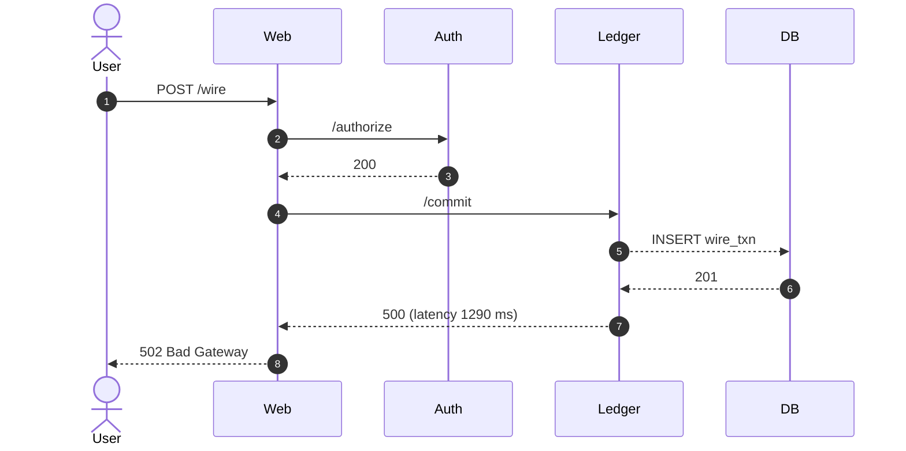

# Chapter 2 – “The Problem Isn’t Always the Problem”

______________________________________________________________________

### Chapter Overview

A banking outage never begins with flames on a dashboard. It starts in the quiet places — a teller noticing failed wire-transfer receipts, a queue lengthening in the background, a lone terminal log winking red and then rolling off the screen. In this chapter Hector Alvarez drags the learner cast through a failure born not of hardware, but of **invisibility**: a single configuration toggle that silenced every trace the system could have shouted. When observability disappears, blame becomes the loudest tool in the room.

Across nine cinematic panels (delivered here in two parts), you will watch Wanjiru, Katherine, and Juana confront a mystery crash that looks serene from the outside. You will follow their mis-steps, inspect raw logs with missing trace context, and witness Hector’s uncompromising debrief on why telemetry is an engineering feature—not an afterthought. By the end, you should know how a missing `trace_id` can fracture incident response, and how a single unchecked box (`enableTracing=true`) can buy an outage while nobody’s looking.

Part A covers Panels 1–4, guiding you from first symptom through flashback to the silent configuration error. Each panel adheres to the contract cadence: **Learning Objective ▸ Takeaway ▸ Applied Example ▸ Teaching Narrative ▸ Image Embed (+ widget)**, embedding one widget per teaching sequence and ensuring that Hector’s gravel-dry wisdom lands exactly where the outline demands.

______________________________________________________________________

## Panel 1 – **The Mystery Crash**

### 🎯 Learning Objective

Realize that user-reported pain can surface long before any metric twitches. Incident response must start with the user story, not the CPU graph.

### ✅ Takeaway

“If the customer hurts and the dashboard doesn’t, your dashboards are blind.”

### 🚦 Applied Example

```bash
# Customer-service agent escalates ticket ID 5219
curl -X POST https://api.bank.example/v1/wire \
     -H "x-customer-id: 34800917" \
     -d '{"amount": 1200, "currency": "USD"}'
> HTTP/1.1 500 Internal Server Error
> trace-id:  ❌ **<header missing>**
```

### Teaching Narrative

It’s 08 : 17 AM when the first teller in the Nairobi branch files an urgent Jira. Wire transfers stall at step two; customer confirmation receipts never print. Katherine Gitonga, half a croissant in one hand and a Geneos dashboard on the other, zooms straight into *CPU Utilization*. The graph is flatter than a desert horizon.

> Katherine (muttering): “CPU’s fine. Memory’s fine. Must be a glitch in the queue.”

Across the aisle Wanjiru Maina pulls up **Payment-Service Error Rate**. Green, steady. No alarms. She shrugs, puzzled. A Slack channel called `#wire-ops` flickers to life with angry emojis from Customer-Care.

Your first instinct might be to scan every metric panel for a tell-tale red spike. Hector would call that *dashboard astrology*. In banking, a single user-visible failure outranks a thousand “healthy” graphs. The system is whispering; you’re just reading the wrong lips.

:::try this
Open your favourite banking sandbox and disable a single downstream dependency (e.g., the ledger update call).

1. Observe the **user-facing** error.
2. Look at your standard CPU/Memory metrics.
3. Note how little they complain.\
   **Question:** What *should* you instrument so the outage shows up instantly?
   :::

### Image Embed

{width=640}

:::hector quote
**Hector says:** “Green dashboards during a user scream-fest? That’s the system pleading the Fifth.”
:::

______________________________________________________________________

## Panel 2 – **Dashboard Deceit, Part II**

### 🎯 Learning Objective

Understand that system-level resource graphs (CPU, memory) can falsely reassure responders when business transactions fail.

### ✅ Takeaway

Resource steadiness ≠ service correctness. Metrics must align to *business outcomes*.

### 🚦 Applied Example

```json
{
  "payment_service.cpu": { "avg": 34.2 },
  "payment_service.mem": { "rss_mb": 512 },
  "payment_service.error_rate": 0.0,
  "ledger_service.queue_depth": 2     // <— hidden below alert threshold
}
```

### Teaching Narrative

Geneos glows tranquil. Katherine zooms deeper, toggling one-minute resolution. Still nothing. Wanjiru adds a **90-percentile latency** panel. The line wiggles inside tolerance. They exchange a glance — “maybe the teller’s workstation is flaky?”

Juana Torres appears, silent as midnight maintenance. She tilts her laptop so the others see a real-time feed of failed HTTP 500s from customer endpoints. Thirty-seven in two minutes.

> Wanjiru: “That’s impossible. Error rate panel shows zero.”\
> Juana (raising an eyebrow): “Dashboard must be wired to the wrong metric.”

Hector will later call this **Metric-Mirror Syndrome**: when teams chart a symptom unrelated to the customer journey and declare victory. The bank doesn’t care about CPU; it cares about money moving.

### Image Embed

{width=640}

:::incident flashback
Last quarter, a European branch missed €4 million in FX trades because their “latency” chart measured a mock endpoint, not the real one. The post-mortem footer read: *SLI definition: TBD*.
:::

______________________________________________________________________

## Panel 3 – **The Missing Trace**

### 🎯 Learning Objective

Expose how missing trace context turns error logs into dead ends.

### ✅ Takeaway

A log without a `trace_id` is a postcard with no return address.

### 🚦 Applied Example

```
2025-04-30T08:19:12Z ERROR wire-transfer-svc[2388]: 
  message="NullPointerException"
  method="/wire"
  status=500
  trace_id=            ⬅︎  (empty)
```

### Teaching Narrative

Juana’s fingers dance across the keys:

```bash
grep -i "NullPointerException" /var/log/wire-transfer.log | tail -n 3
```

Every line identical—same method, same stack trace, **no `trace_id` field**. She tries `kubectl exec` into another pod; same emptiness. The request path is a cul-de-sac.

> Juana (dry): “Classic. Someone clipped trace injection again.”\
> Katherine: “We had spans last sprint. Where’d they go?”\
> Wanjiru: “Could config have…?”

Your team just discovered an unobservable failure. Without span context, you cannot stitch together the ledger call, auth service hop, or database rollback that actually blew up. You are chasing ghosts with a flashlight whose batteries died a release ago.

:::reflection
Think back to your last outage. Did every error log include a correlation or trace ID? If not, *how long* did you spend guessing which downstream call exploded?
:::

### Image Embed

{width=640}

:::hector quote
**Hector says:** “Logs without context are gossip. Add IDs or keep guessing who started the fire.”
:::

______________________________________________________________________

## Panel 4 – **What They Missed**

### 🎯 Learning Objective

Show that configuration drift can silently disable observability features, turning a mild refactor into a critical blind spot.

### ✅ Takeaway

Observability is a **feature flag**; treat it with the same rigor as functionality.

### 🚦 Applied Example (Git Diff)

```diff
- enableTracing = true
+ enableTracing = false   # temporary perf test
```

`commit 4a9e12d  (message: "minor perf fix")`

### Teaching Narrative

Juana digs into the previous night’s deployment diff. A junior dev disabled tracing for a load-test, promised to revert, and merged anyway.

> Flashback: A neon-lit code review room. The dev types “Just disabling tracing to squeeze perf 😊”. The PR merges with two quick 👍.

Performance test passed. Tracing died. Production lost its voice.

Katherine exhales sharply. “We chased metrics for twenty minutes while the real clue was sitting in Git history.”

Hector steps through the doorway like a human post-mortem.

> Hector: “Observability isn’t magic. It’s preparation. And you didn’t prepare.”

He slams a laminated sequence diagram onto a table—arrows labelled with missing spans, empty IDs where context should be. The team gathers, cheeks warming with the particular shame of hindsight.

:::debug pattern
**Pattern Name:** Missing Span Syndrome\
**Description:** Logs and metrics show failure, but lack request-path context because trace injection was disabled.\
**Example Fix:** Enforce middleware that adds trace headers at ingress, emits span IDs at every hop, and blocks deployment when `enableTracing=false`.
:::

### Image Embed

{width=640}

:::hector quote
**Hector says:** “Telemetry you *turn off* will come back for payment — with compound interest.”
:::

______________________________________________________________________

## Panel 5 – **The Blame Game Begins**

### 🎯 Learning Objective

Recognize how the absence of shared telemetry shifts an incident from *root-cause analysis* to *political dodge-ball*.

### ✅ Takeaway

“When nobody can *see* the bug, everybody *is* the bug.”

### 🚦 Applied Example — Slack Scroll

```text
08 : 24 #wire-ops
Ops-Lead ▶︎  “DB timeouts—infra latency again?”
Dev-Lead ▶︎  “Your nodes are starving the JVM.”
Net-Eng  ▶︎  “Traceroute clean. Have you re-checked the app toggle?”
PM        ▶︎  “Customers still angry. Who owns this?”
```

### Teaching Narrative

The war-room chat explodes. Ops reposts a “network latency” chart that looks normal. Devs paste a screenshot of pod restarts that also looks normal. Infra counters with a green graph from the load-balancer.\
Wanjiru whispers, “Is it… possible we’re all staring at the wrong thing?” Katherine doesn’t answer—he’s busy drafting a blame matrix for the postmortem.

Outside the thread, Jamal the Customer-Experience Director sighs: *“Users don’t care which team ‘wins.’ They just want to move money.”* The system is down; careers are up for auction.

:::reflection
In your last incident, how many distinct teams posted *completely different* dashboards to prove innocence? Count them. What single source-of-truth could have stopped the brawl?
:::

### Image Embed

{width=640}

:::hector quote
**Hector says:** “Finger-pointing is the smoke. Missing telemetry is the fire.”
:::

______________________________________________________________________

## Panel 6 – **Hector Steps In**

### 🎯 Learning Objective

Understand that observability must be *gated*—you cannot ship code if it can’t confess.

### ✅ Takeaway

“Instrumentation is part of the feature. Shipping without it is shipping broken.”

### 🚦 Applied Example — Post-Merge Gate Stub

```yaml
tracingCheck:
  run: ./ci/trace-lint.sh
  mustPass: true
```

### Teaching Narrative

Hector enters, drops his mug, and kills the conference-room lights. A single projector beam shows an old outage timeline:

> **2017-10-03, 02 : 11 UTC** — European SEPA wires lost €23 M because trace headers were stripped by an NGINX upgrade.\
> **Impact:** 14-hour reconciliation drill, 4 regulators, one 8-figure fine.

He turns to the group. “You’re following the same script—except this time, the auditors are *already on the call*.”\
Juana gulps; Katherine closes his blame spreadsheet. Hector flips to the next slide: a red CI step named **`telemetry-gate`**. It fails commits that disable tracing.

> Hector: “You built a house without smoke detectors. Then argued about who smelled smoke first.”\
> Wanjiru (quietly): “Let’s install detectors before we rebuild the kitchen.”

:::incident flashback
During a 2021 ACH backlog, an intern hot-patched a feature flag that muted all trace exports. Two hours later, 19 000 transfers vanished into an SQS queue black hole. The fix? Re-enable tracing and *rerun every transfer by hand* at midnight.
:::

### Image Embed

{width=640}

:::hector quote
**Hector says:** “Logs tell stories. Traces draw the crime-scene chalk. Ship both—or enjoy the unsolved mystery.”
:::

______________________________________________________________________

## Panel 7 – **The Corrected View**

### 🎯 Learning Objective

Demonstrate how a fully instrumented trace graph reveals the *real* failing hop within seconds.

### ✅ Takeaway

A single end-to-end trace short-circuits hours of speculation.

### 🚦 Applied Example — Before vs After Trace IDs

```diff
- trace_id =
+ trace_id = 8af5-c2b7-f1d0
+ parent_span_id = c11e-9ab3
```

### Teaching Narrative

Juana toggles the flag, redeploys, and reloads Grafana-Tempo. A vivid service map blossoms: `web` ➔ `auth` ➔ **`ledger-svc` (1 290 ms, red)** ➔ `db`.\
Hector overlays the pre-fix view—an empty white void—with the new colorful DAG.

> Katherine: “That ledger hop is *7×* slower than baseline!”\
> Wanjiru: “And every failed wire dies *right there*.”\
> Juana: “Telemetry wasn’t the cost. Ignorance was.”

:::diagram



:::

:::debug pattern
**Pattern Name:** Trace Resurrection\
**Description:** Outages masked by missing spans; once restored, a single pathological hop becomes obvious.\
**Example Fix:** Gate merges on active span sampling, display p95 latency color-coded on the trace graph, and link errors to span IDs in logs.
:::

### Image Embed

{width=640}

:::hector quote
**Hector says:** “Spans are receipts. Keep them, or refund the incident time.”
:::

______________________________________________________________________

## Panel 8 – **Team Realization**

### 🎯 Learning Objective

Move learners from passive spectators to *owners* of telemetry quality.

### ✅ Takeaway

Instrument once; verify always; blame never.

### 🚦 Applied Example — Guard Rail PR

```diff
+ if [[ "$TRACE_FLAG" != "true" ]]; then
+   echo "❌ Tracing disabled. Rejecting build."
+   exit 1
+ fi
```

### Teaching Narrative

Katherine commits a guard-rail script; Wanjiru approves within seconds. CI passes. A fresh deploy rolls out; Grafana shows error rate collapsing from **12 %** to **< 0.4 %**.\
Jamal posts in `#wire-ops`: *“Transfers cleared. Customers happy.”*\
Silence—good silence—fills the room. Juana exhales. Hector merely nods.

Wanjiru turns to Katherine: “We didn’t *see* the problem because we never asked the system to speak.”\
Katherine replies: “From now on, telemetry first, feature second.”

:::learner reflection
List two concrete CI checks you can add *today* that guarantee traces and logs remain correlated after every deploy.
:::

### Image Embed

{width=640}

:::hector quote
**Hector says:** “You’re not done when the code works—you’re done when the code confesses.”
:::

______________________________________________________________________

## Panel 9 – **Closing Shot**

### 🎯 Learning Objective

Anchor the chapter’s moral: observability is the *contract* between teams and truth.

### ✅ Takeaway

A bank’s *source of truth* must include its telemetry—or the statements are forged.

### 🚦 Applied Example — CI/CD Summary Badge

```text
✅ Telemetry Gate: PASS | trace-coverage = 97 %
```

### Teaching Narrative

The scene widens: dawn over Nairobi HQ, server-room lights dimmed, dashboards quiet. Hector locks the incident whiteboard, flips it to a clean slate, and addresses the learners:

> “Today you watched a system lie through omission. You fixed the lie by giving it a louder mouth. Next time, make the mouth *before* the lie.”

He tosses a marker into a mug, grabs his RHEL cap, and heads for the exit.

:::sre wisdom box
**SRE Wisdom:** “If telemetry isn’t in the definition of done, neither is reliability.”
:::

### Image Embed

{width=640}

:::hector quote
**Hector’s Closing Line:** “Remember—if the problem can’t be *seen*, the problem will be *you*.”
:::

______________________________________________________________________
