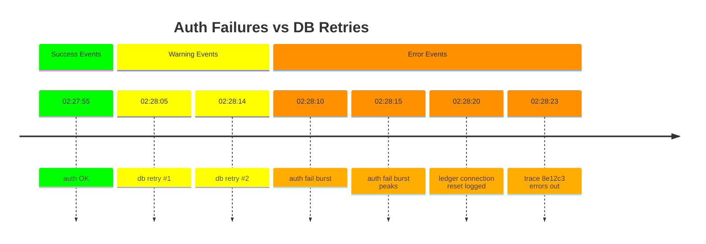

# Chapter 3 – “Logs That Talk, Metrics That Matter”  


## Chapter Overview

In modern systems, telemetry is abundant—but insight is scarce. Engineers often mistake verbosity for visibility, flooding log pipelines with irrelevant detail and dashboards with meaningless metrics. This chapter focuses on the cost of such noise—not just in storage, but in time, trust, and root cause clarity.

A banking system cannot afford verbosity-as-default. Regulators, auditors, and customers all need signals that are accountable, explainable, and discoverable under pressure. Logs should trace business impact. Metrics should show service health from the user’s perspective. And together, they should narrate—not obscure—what happened.

In this chapter, you’ll explore what happens when teams over-collect but under-connect. You’ll see how a poorly named metric hides a retry loop, how a debug flood buries a single transaction failure, and how the absence of structure makes telemetry unreadable by both humans and machines.

This isn’t about new tools. It’s about using the ones you already have more deliberately. Through structured fields, naming conventions, and signal-to-noise ratios, the team learns to reduce telemetry volume while increasing its resolution.

By the end, you'll have a working understanding of structured logs, owned metrics, cardinality control, and what Hector calls the mouth, the mood, and the memory of an honest system.

---

## Panel 1 – Death by Verbose Logging  

### 🎯 Learning Objective  
Recognise that **log volume ≠ diagnostic value**; learn how uncontrolled DEBUG streams mask critical context.  

### ✅ Takeaway  
If a log line can’t change an on-call decision, rotate it out or raise its signal.  

### 🚦 Applied Example  
```
2025-05-01T02:14:32.002Z DEBUG  [payments] Handler entered; state=START
...
2025-05-01T02:14:32.137Z ERROR  [payments] NullPointerException at DebitProcessor
```
Only the final line matters, yet it was paged away by 3,000 DEBUG siblings.  

### Teaching Narrative  
Leonel stands before a wall terminal, eyes gleaming as Splunk’s live-tail scrolls like falling code in *The Matrix*. “Beautiful, isn’t it?” he says. Manu squints: “Beautiful? Or blinding?” A sudden spike turns the scroll amber—disk write throttle hits 95 MB/s. The sole ERROR entry—`NullPointerException at DebitProcessor`—flies past, instantly buried.  

Hector steps from the doorway, coffee steaming. “Visibility isn’t the same as clarity,” he growls, killing the tail with `Ctrl-C`. He reruns the query, adding a **filter for severity >= WARN** and a **field extractor for `transactionId`**. Splunk now returns *three* lines—one per failed payment. Manu whispers, “We could’ve fixed this forty minutes ago.”  

:::hector quote  
**Hector says:** “If your telemetry doesn’t snitch, your outage will.”  
:::  

### Image Embed  
{width=600}

---

## Panel 2 – The Metrics Don’t Match  

### 🎯 Learning Objective  
Expose how *comfort metrics* (latency, CPU) can contradict lived user experience when uncorrelated with business outcomes.  

### ✅ Takeaway  
Dashboards must reconcile **technical health** with **customer pain**—otherwise they’re décor.  

### 🚦 Applied Example  
A Grafana panel shows median latency at **120 ms (green)** while a Zendesk heat-map glows red with 200 support tickets in the same five-minute window.  

### Teaching Narrative  
Manu drags Leonel to the observability wall: response-time graphs purr along a safe green band. Meanwhile, Wanjiru reads live chat. “Customers can’t complete transfers.” Manu taps the graph, puzzled. Aisha raises an eyebrow: “Latency isn’t lying; it’s just not answering the right question.”  

Hector overlays **failed-transaction-rate** atop latency. The green band vanishes under a sharp rust-red spike—250 fails/min at 02:15 UTC. “Metrics disconnected from reality are just static art,” he says. Wanjiru exhales, finally seeing the mismatch.  

:::reflection  
**Learner Reflection:** *Recall a time when your dashboard said “all good” but users disagreed. What metric was missing?*  
:::  

### Image Embed  
{width=600}

---

## Panel 3 – The Unreadable Log  

### 🎯 Learning Objective  
Demonstrate why **structured, contextual logs** (transactionId, traceId, userId) are mandatory for root-cause threads.  

### ✅ Takeaway  
If you can’t follow a single transaction through your logs in < 5 seconds, you’re courting blind outages.  

### 🚦 Applied Example  
```
INFO 2025-05-01T02:14:35Z  Debit OK amount=25000
```  
(No correlation identifiers present.) Searching for the customer’s failed transfer returns **0 matches**.  

### Teaching Narrative  
Wanjiru, fists tight, greps through 100 MB chunks: `grep "TX-977af"` returns nothing. “How does a transfer vanish?” she asks. Clara answers, “By never being logged.” Behind them, Leonel’s earlier *everything-log-everything* stance collapses—he sees that quantity without structure is nihilism.  

Hector opens the logging config, adding JSON layout:  
```json
{"ts":"2025-05-01T02:14:35Z","level":"INFO","service":"debit",
 "transactionId":"TX-977af","traceId":"b783cf","amount":25000,"status":"OK"}
```  
He reruns the transfer in dev; Splunk lights up with correlated entries. “See? The system just learned to *sign its work*,” he says.  

:::debug pattern  
**Pattern Name:** Missing Context Fields  
**Description:** Logs omit identifiers, preventing cross-service tracing.  
**Example Fix:** Emit `transactionId`, `traceId`, and user-centric fields at INFO; reserve DEBUG for local dev.  
:::  

### Image Embed  
{width=600}

---

## Panel 4 – Hector Steps In  

### 🎯 Learning Objective  
Connect **Logs + Metrics + Traces** as mutually validating lenses; understand overlap as root-cause zone.  

### ✅ Takeaway  
Coverage is meaningless without *intersection*; only the overlapping core accelerates diagnosis.  

### 🚦 Applied Example  
Hector sketches a Venn: Logs (mouth), Metrics (mood), Traces (memory). The sweet spot—**Root Cause Detection**—sits dead-center.  

### Teaching Narrative  
The room dims; Hector flips a digital whiteboard. Three circles bloom in **Slate Gray**, **System Blue**, and **Deep Amber**. “Logs shout events,” he begins, coloring that circle charcoal. “Metrics hum feelings,”—Slate overlay. “Traces remember timelines,”—Blue join. Their intersection glows amber.  

He overlays today’s incident: metrics flagged nothing, verbose logs hid context, traces weren’t wired. The intersection is blank—no overlap, no truth. The team stares, chastened.  

### Image Embed  
{width=600}

---

*Part B* – Panels 5 – 8  

---

## Panel 5 – Metric Hygiene Clinic  

### 🎯 Learning Objective  
Learn to **name, scope, and own metrics** so every graph tells one story—and somebody is accountable for it.  

### ✅ Takeaway  
A metric without an explicit **business meaning, namespace, and owner** is dead weight.  

### 🚦 Applied Example  
`service_latency_time_chart_thing{pod="payments-v2-2"} 0.045`  
No unit, no SLA, no description, no owner label.  

### Teaching Narrative  
The night still smells of burnt coffee when **Clara** storms toward the wall of Grafana panes. She jabs a finger at a widget titled `service_latency_time_chart_thing`.  
“Whose chart thing?” she snaps. No one answers. The metric legend shows forty-seven labels—pods, zones, random debug tags. The Y-axis is unlabeled; the title scrolls off the panel frame.  

**Hector** folds his arms. “Dollars to donuts this metric predates half the team,” he says. **Leonel** shrugs: “I-I think it came from the legacy Helm chart.”  

Clara executes:  

```shell
curl -s http://prometheus:9090/api/v1/series?match[]=service_latency_time_chart_thing | jq length
# => 16384
```  

Sixteen-thousand distinct series—one for every pod restart since March. Disk churn disguises real signals. Prometheus churn alert lights red.  

“Metric hygiene,” Hector intones, “is *dental care* for dashboards. Ignore it and everything rots—quietly.” Clara opens a pull request:  
* rename: `service_latency_time_chart_thing` ➜ `payments_request_latency_seconds`  
* add `team="payments"`, `slo="p95_lt_300ms"`  
* remove uncontrolled labels (`pod`, `instance`)  

Prometheus now reports **six** time-series instead of sixteen-thousand. Grafana refreshes: the pane title is crisp, the axis labeled *seconds*, and an SLA overlay shades anything > 0.3 s.  

:::reflection  
**Learner Reflection:** *Look at your top five graphs. Which metric name could you explain to a CFO in one sentence? Which one couldn’t you?*  
:::  

### Image Embed  
{width=600}  

---

## Panel 6 – Refactoring the Noise  

### 🎯 Learning Objective  
Apply **structured logging and metric cardinality reduction** techniques to turn chaos into correlation.  

### ✅ Takeaway  
Refactoring telemetry is code work: treat it with the same rigor—reviews, tests, and ownership.  

### 🚦 Applied Example  
**Before – log line:**  
```
2025-05-01T02:26:11Z DEBUG  processed  ok  21ms
```  
**After – log line:**  
```json
{"ts":"2025-05-01T02:26:11Z","level":"INFO","service":"payments",
 "transactionId":"TX-aa41f","traceId":"8e12c3","latency_ms":21,
 "status":"OK","amount_cents":4500}
```  

### Teaching Narrative  
Hector pulls the team into what he calls a **“telemetry mob refactor.”** Monitors darken; editors open. They draft a *Telemetry Definition of Done*:  

1. Every log in prod emits `transactionId`, `traceId`, `status`.  
2. Metrics carry ≤ 4 labels; one must be `team`.  
3. Owners document every metric in `metrics.md` with purpose & unit.  

**Manu** objects: “But DEBUG logs help *somebody* someday.” Hector fires back: “Not until they bury the outage.” He flips an old disk-space incident: DEBUG logs filled the disk, WAL flushes stalled, *auth-service* panicked. The bank missed an ACH window—$460 K in penalty fees. **System Failure Anecdote delivered.**  

Together they rip out naked `printf`s, replace with a **Logfmt** helper:  

```go
log.Info().
   Str("service", "auth").
   Str("transactionId", txID).
   Str("traceId", span.SpanContext().TraceID().String()).
   Int("latency_ms", elapsed).
   Msg("request completed")
```  

**Clara** trims Prometheus labels: removes per-pod cardinality, keeps `team`, `environment`, `outcome`. She pairs with **Wanjiru** to update Grafana dashboards; panels drop from 24 to 9.  

:::try this  
**Your Turn:**  
1. Pick one production log format today.  
2. Add a correlation field (`traceId` or `transactionId`).  
3. Remove or demote one DEBUG stream that never drove an incident fix.  
Commit, deploy, and track whether MTTR improves this week.  
:::  

### Image Embed  
{width=600}  

---

## Panel 7 – The Ah-Ha Graph  

### 🎯 Learning Objective  
See how **cleaned-up telemetry** reveals causal relationships that were invisible before.  

### ✅ Takeaway  
When noise drops, **correlation pops**—and root cause walks into the light.  

### 🚦 Applied Example  
A new Grafana panel:  
* **red line** – auth failure rate ↑ at 02:28  
* **amber bars** – DB retry count ↑ exactly in-sync  
* Clicking a bar opens a trace linking the two services via `traceId=8e12c3`.  

### Teaching Narrative  
Fresh dashboards glow against the dim NOC. The first graph shows a synchronized dance: every spike in DB retries exactly matches auth failure bursts.  

**Wanjiru** gasps. “It’s the same trace ID!” She clicks the node; **Tempo** renders a waterfall:  
`frontend → auth-svc → ledger-db` — latencies stack until *ledger-db* retries thrice on a stale connection pool.  

Hector nods, a rare half-smile flickering. “When your system finally *whispers* instead of screams, you can hear the pattern.” He draws a quick timeline on the tablet: log at `02:28:14Z` shows `connection_reset`; metric `db_connection_reset_total` ticks; trace span ID `8e12c3` turns crimson.  

:::diagram  

:::  

**Clara** overlays business KPI *failed transfers per minute*. The red zone aligns perfectly. The room is silent—a confession recorded in technicolor.  

### Image Embed  
{width=600}  

---

## Panel 8 – Lesson Locked In  

### 🎯 Learning Objective  
Internalize the chapter mantra: **Logs = mouth, Metrics = mood, Traces = memory**—and use all three *together*.  

### ✅ Takeaway  
Never confuse **ranting** (excess data) with **reasoning** (curated, correlated telemetry).  

### 🚦 Applied Example  
A single observability view (log search + metric graph + trace view) filtered by `traceId=8e12c3` shows:  
* Log excerpt: `"NullPointerException at DebitProcessor"`  
* Metric overlay: `payments_request_latency_seconds p95 1.2`  
* Trace timeline: auth → ledger 450 ms gap  

### Teaching Narrative  
Sunrise bleeds through the frosted windows. The incident is over; the lesson isn’t. Hector pours lukewarm coffee, eyes on the team.  

“Logs,” he says, tapping the console printout, “are the mouth. They tell you **what** happened.”  
“Metrics”—he gestures to the stabilized green bar—“are the mood. They hint **how** the system feels.”  
“Traces”—he rotates the tablet—“are the memory. They show **when and where** the pain began.”  

He leans back. “You need all three to write the autopsy *before* the patient dies.”  

:::hector quote  
**Hector says:** “Don’t confuse ranting with reasoning.”  
:::  

**Leonel** exhales, finally amused. “So… less karaoke, more confession?”  
Hector’s eyes crinkle. “Exactly. Teach the system to confess on the first note, not the last breath.”  

### Image Embed  
{width=600}  

---

## Chapter Reflection & Assessment Hook  

You close your laptop, new dashboards humming. Ask yourself:  

1. Which metric did you rename tonight, and **who owns it now**?  
2. Where will you add a **trace ID** in your next commit?  
3. How will you measure whether your telemetry *talks* or just *talks back*?  

Next chapter: **“You’re Not Alerting — You’re Alarming.”** We’ll make the pages beep for the *right* reasons.  

Hector’s final line, half into his mug:  
> “Get some sleep. Your logs know how to wake you—*now* they’ll know *why*.”  

---
