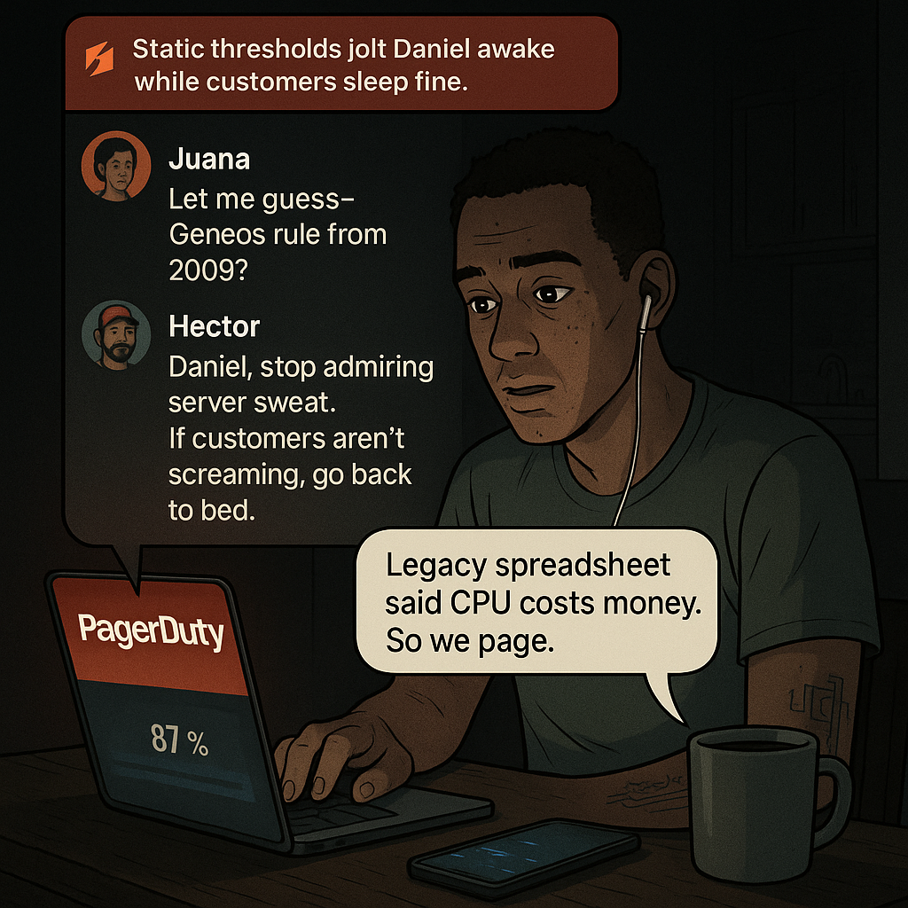
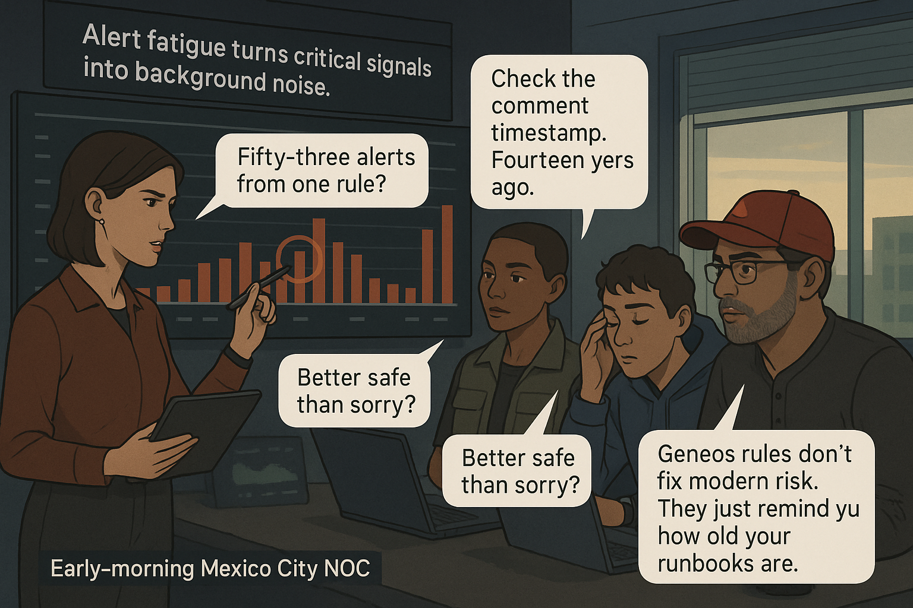
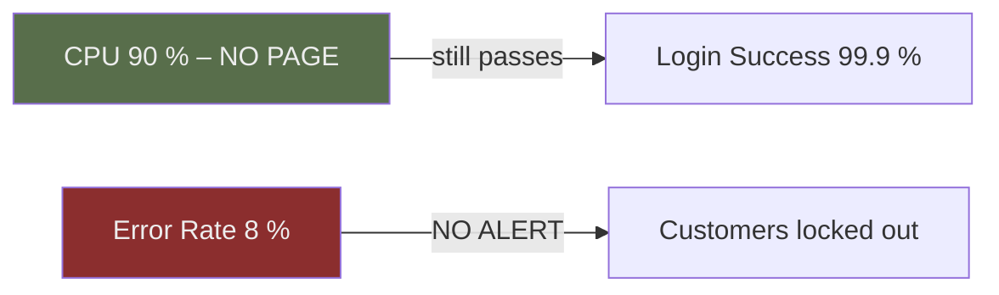
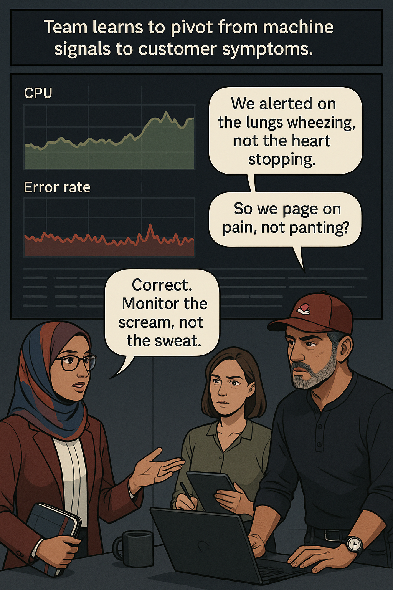
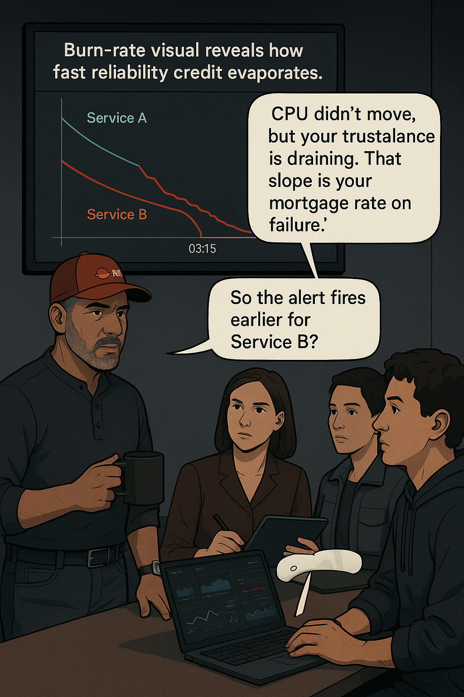
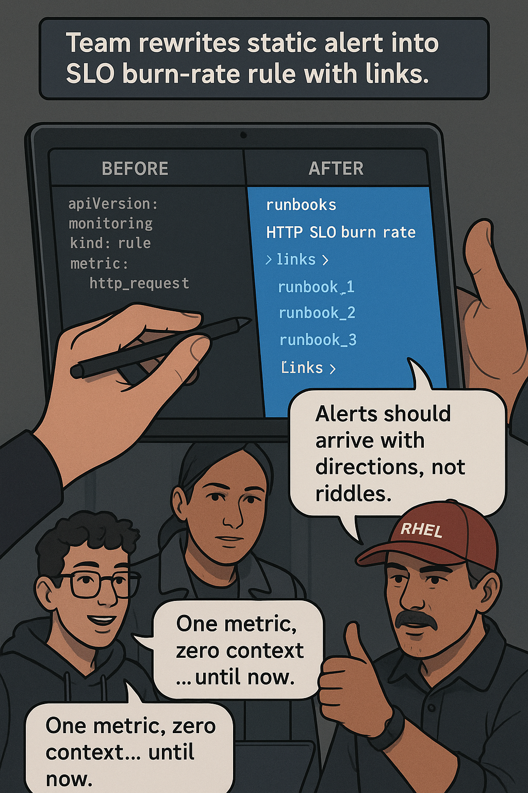
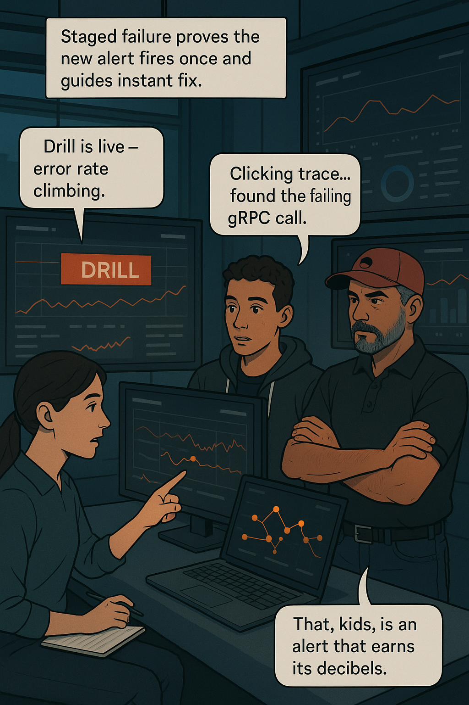
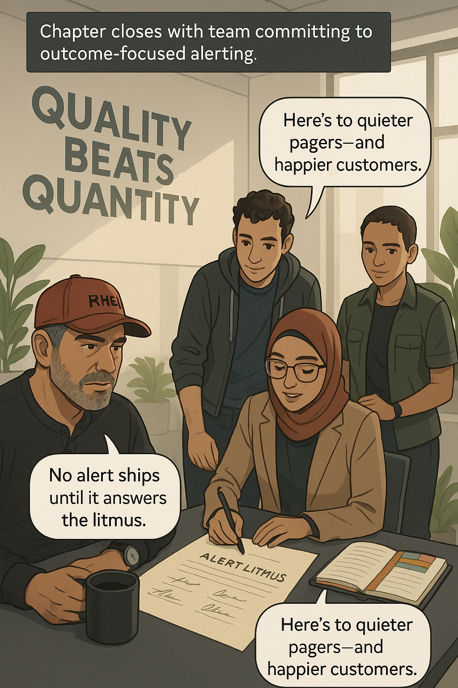

# Chapter 4 – “You’re Not Alerting — You’re Alarming”

## Chapter Overview

The first time a Tier-1 banking platform paged Hector for “CPU > 85 %,” no customer ever noticed. The second time it happened, a junior on-call quit on the spot. Static, host-centric alerts like that once made sense in mainframe days, but today’s micro-service meshes evaporate beneath them. Modern incidents hide in the seam between healthy hardware and furious users, so the chapter begins by exposing why old thresholds sleepwalk past real pain. :contentReference[oaicite:0]{index=0}

Traditional alerting pipelines assume resource exhaustion will always precede service failure. Banking stacks disprove that daily: a single mis-timed feature flag burns through a login SLO long before any host feels pressure. When engineers bind alerts to internals—CPU, memory, queue depth—they inherit every false positive those metrics cough up at high load, while missing the low-volume edge cases auditors actually care about.

Enter **burn rate**: the speed at which an error budget evaporates. An SLO-aware alert treats “five minutes of 15 % 5xx responses” as a burning fuse, regardless of CPU. By quantifying how quickly customer experience erodes, SLO alerts cut through infrastructure noise and wake the right humans only when failure is *imminent*. Error budgets become the currency of reliability, and burn-rate slopes show when that currency is on fire.

This chapter anchors those ideas in a real outage: login requests timed out for 8 % of mobile users while dashboards flashed green. Forty CPU alerts fired; zero user-impact alerts did. We’ll replay that night through Daniel’s exhausted eyes, let Juana surgically dismantle the faulty rules, and watch Hector drop a burn-rate diagram like an accountant revealing fraud.

By the end, you will rewrite one of your own alerts to measure **threats, not thresholds**. Expect fewer pages at 3 AM—and alerts that actually point to the smoking component.

______________________________________________________________________

## Panel 1 – **The All-Night Alarm**

### 🎯 Learning Objective

Recognize that a static CPU threshold alert can trigger without any customer impact, creating fatigue and distrust.

### ✅ Takeaway

If an alert can wake you up while the bank’s users remain happy, re-classify it as telemetry—*not* a page.

### 🚦 Applied Example

```text
PagerDuty #PD-102233: “db-core-02 CPU > 85 % for 5 m”
Acknowledged by: Daniel Mutua
Business KPI (mobile-login-success): 99.92 % → 99.91 % (flat)
Tracer logs: No spike in latency, error rate steady
```

### Teaching Narrative

It is 02:47 in a dim Nairobi apartment. Daniel’s phone banshee-screams, stacking its thirty-seventh “CPU > 85 %” notification. He has already SSH’d into `db-core-02` three times, run `top`, watched the graph wobble between 81 % and 88 %, and found nothing except a nightly ETL. Meanwhile, mobile logins tick along at 140 transactions / sec—boring, perfect green.

Juana Torres, still awake thanks to espresso and cynicism, pops into the Slack war-room:

> **Juana:** “Let me guess. Geneos rule from 2009?”
> **Daniel (yawning):** “Legacy spreadsheet said CPU cost money. So we page.”
> **Juana:** “Users cost more. Where’s their metric in that alert?”

Hector’s avatar appears—a coffee-stained RHEL cap an omen of honesty.

> **Hector:** “Daniel, stop admiring server sweat. If customers aren’t screaming, go back to bed.”

He pastes a screenshot of the login SLI, flat as a calm pulse. “You paged people for *exercise*, not for injury.”&#32;

### Image Embed

{width=600}

______________________________________________________________________

## Panel 2 – **False Positives Everywhere**

### 🎯 Learning Objective

Show how high alert volume erodes confidence and delays reaction to genuine incidents.

### ✅ Takeaway

Alert fatigue breeds tuned-out engineers; every pointless page taxes future vigilance.

### 🚦 Applied Example

```yaml
# legacy Geneos rule excerpt
- name: high_cpu
  threshold: 85          # %
  window:   1m
  repeat:   30s          # spam city
  severity: P1
```

### Teaching Narrative

Morning glow creeps across the Mexico City NOC. A wall monitor lists last night’s pages—200 of them—yet the incident queue is blank. Clara walks by, stylus tapping the tile scoreboard like a forensic accountant: “Fifty-three alerts from *one* rule?”

Juana taps the rule file onscreen: “Check the comment timestamp. 14 years ago. Nobody paged the author when the world changed.”

Daniel muscles a grin. “Better safe than sorry?” Hector’s laugh ricochets off graphite-painted walls.

> **Hector (Aphorism)**: “Geneos rules don’t fix modern risk. They just remind you how old your runbooks are.”&#32;

He toggles an overlay: last quarter’s *ignored* alerts versus mean-time-to-detect. Trendline? Upward misery. The team sees the silent killer: not downtime, but *trust decay*.

### Image Embed

{width=600}

:::hector quote
**Hector says:** “If your pager is louder than your customers, your priorities are upside-down.”
:::

______________________________________________________________________

## Panel 3 – **Looking for Symptoms, Not Signals**

### 🎯 Learning Objective

Pivot the team from machine-oriented alerts to customer-oriented symptom detection.

### ✅ Takeaway

Alert on *outcomes*—error rate, latency, failed transactions—then pivot to internals for root cause.

### 🚦 Applied Example



### Teaching Narrative

Aisha projects two timelines. Top: CPU spiking on a replica set during nightly fraud scoring—no dip in customer logins. Bottom: a five-minute 8 % HTTP 5xx burst that *never paged* anyone, yet 4 000 users failed to access their accounts.

> **Aisha:** “We alerted on the *lungs* wheezing, not the *heart* stopping.”
> **Clara:** “So we page on pain, not panting?”
> **Hector:** “Correct. Monitor the scream, not the sweat.”

He tells the war story of a London banking outage where CPU thresholds masked a TLS certificate failure; customers couldn’t trade for six minutes while on-call rebooted healthy servers. The bank lost £2.7 million before anyone checked error logs. System-failure anecdote delivered, the room falls silent.

### Image Embed

{width=600}

**Pattern Name:** Missing Symptom Coverage

**Description:** Alerts monitor resource usage but ignore direct customer pain indicators (error %, latency, abandonment). Engineers drown in noise and miss real outages.

**Example Fix:** Create multi-window burn-rate alerts on `error_rate > 2 %` that fire within 5 minutes and link directly to transaction traces plus runbook steps.

______________________________________________________________________

## Panel 4 – **Burn Rate Awakening**

### 🎯 Learning Objective

Understand **burn rate** as the speed at which an error budget is consumed and why multi-window SLO alerts fire on *risk slope*, not raw error count.

### ✅ Takeaway

If you know how fast you’re burning reliability credit, you know how long you have before customers riot.

### 🚦 Applied Example

```text
Service A  ❱ 10 % of 0.1 % error budget consumed in 5 m  →  ⏰ Page
Service B  ❱ 30 % of 1 % error budget consumed in 30 m →  ⚠️ Ticket
```

### Teaching Narrative

Hector stands at a wall screen that slopes upward like a mountain run. Two lines race: **green** for Service A, **rust-red** for Service B. Service B’s incline is twice as steep.

> **Hector (pointing):** “CPU didn’t move, but your *trust balance* is draining. That slope, amigos, is your mortgage rate on failure.”

Clara whispers, “So the alert fires *earlier* for Service B?” Juana nods: “Because customers feel it sooner.” Daniel frowns: “We set one threshold—why two windows?” Hector taps his watch.

> “Fast burn wakes you *now*. Slow burn nudges you *today*. Both protect users; one protects your weekend.”

### Image Embed

{width=600}

:::incident flashback
**Postmortem Recap:** In 2023, a Mexican mobile-payments cluster hit a silent 7 % 5xx for 14 minutes. Burn-rate math said *six* minutes of tolerance. The page never came; regulators did.
:::

______________________________________________________________________

## Panel 5 – **Fixing the Noise**

### 🎯 Learning Objective

Translate an old CPU alert into a burn-rate rule that links directly to traces and runbook steps.

### ✅ Takeaway

Good alerts tell *who’s hurt* and *where to click first*.

### 🚦 Applied Example

```yaml
# BEFORE — static
- alert: db_high_cpu
  expr: avg_over_time(cpu_usage[5m]) > 0.85
  for: 5m
  labels: {severity: P1}

# AFTER — burn-rate, user impact
- alert: login_error_budget_fast_burn
  expr: (
          rate(http_requests_total{status=~"5.."}[1m])
          /
          rate(http_requests_total[1m])
        ) > 0.02
  for: 2m
  labels:
    severity: P1
    runbook: https://runbooks.bank/sso-login
  annotations:
    description: |
      🔥 Login error budget burning at >2 %/min
      Links: {{ $labels.trace_url }} | {{ $labels.logs_url }}
```

### Teaching Narrative

Clara’s stylus taps the “BEFORE” block: “One metric, zero context.” Daniel scrolls to the bottom: “And no link to *anything*.” Together they craft the “AFTER” rule.

Juana pastes a trace-ID token. “Pager buttons you; click takes you straight to the failing span.” Hector grins—rare, brief.

> **Hector Aphorism:** “Alerts should arrive with directions, not riddles.”&#32;

### Image Embed

{width=600}

:::try this
Rewrite one of your own host-based alerts.

1. Identify the user-visible SLI it *should* protect.
2. Calculate the **fast-burn** (5 m) and **slow-burn** (30 m) thresholds.
3. Add a runbook, trace-link template, and customer-impact note. Commit the change.
   :::

______________________________________________________________________

## Panel 6 – **Test Fire Drill**

### 🎯 Learning Objective

Validate that an SLO alert delivers actionable context during a staged failure.

### ✅ Takeaway

The *best* time to rehearse an alert is before 3 AM.

### 🚦 Applied Example

```text
PagerDuty #PD-104499  (DRILL)
Title: 🔥 Login error budget fast burn
Links:
  • Trace ID: 8e12c3⇒ Jaeger
  • Kibana Log Filter
  • Runbook Step #12 – Revert build v2.4.8
Severity: P1
User Impact: 6 % mobile login failure (projected 15 % in 10 m)
```

### Teaching Narrative

Sofia flips the chaos-switch in staging. Error rates climb; the new alert fires once—*only once*. Daniel follows the embedded trace, lands precisely on a failing gRPC call, and patches it in four commands.

Clara clocks the timeline: first byte to fix in seven minutes. She high-fives Juana. Hector raises his coffee mug. “That, kids, is an alert that earns its decibels.”

### Image Embed

{width=600}

______________________________________________________________________

## Panel 7 – **Lesson Locked In**

### 🎯 Learning Objective

Establish the three-question litmus test for every production alert.

### ✅ Takeaway

An alert is production-worthy only if it answers: **What broke? Who’s affected? What do we do next?**

### 🚦 Applied Example

| Question | Example Data in Alert |
| --------------- | ------------------------------------ |
| What broke? | *Mobile-login SLO fast-burn* |
| Who’s affected? | *6 % of sessions → timeouts* |
| Next step? | *Rollback `login-svc` or add 2 pods* |

### Teaching Narrative

Hector stands before a fresh standards doc, signatures queued. “No alert ships until it passes the litmus.” Aisha signs first; Daniel scribbles last, exhaustion replaced by relief.

> **Hector (closing grin):** “Let’s not build alarms. Let’s build clarity.”&#32;

### Image Embed

{width=600}

:::hector quote
**Hector says:** “Bad alerts make good engineers quit. Great alerts let them sleep—and still keep their jobs.”
:::

______________________________________________________________________

______________________________________________________________________

*End of Chapter 4.*
