# Chapter 5 – “Patterns to Avoid Like Volcanoes”


## Chapter Overview

ATMs are an oddly intimate part of banking: cold metal, fluorescent glow, and a promise that your cash is as reliable as gravity. When those machines stall, the illusion collapses instantly. In the pre-dawn hours of May 6, the bank’s Mid-West network of 1 127 ATMs simultaneously began declining withdrawals—no public explanation, no red alerts on the ops wall, only a growing queue of angry customers and a trending hashtag.

Inside the incident war-room, Hector Alvarez confronts the deeper story: the outage is merely a symptom of five slowly accrued observability debts. He calls them the **Five Sins**—silent anti-patterns that masquerade as “best practice” until real cash meets missing telemetry. Each sin is a lesson in how data fails when ownership, context, or honesty disappear.

This chapter walks you through a minute-by-minute reconstruction of the outage. You will stand beside each learner character—Wanjiru overwhelmed by unlabeled graphs, Daniel defaulting to network blame, Juana staring at an alert with a dead runbook link—and feel how confusion compounds when signals lie. Hector’s dry, incisive commentary slices through the chaos, forcing the team to replace guesses with evidence.

Along the way, we expose real-world regulatory stakes. Banking standards such as PCI DSS and FFIEC demand provable audit trails for customer-facing interruptions. If your observability stack masks failures, auditors will eventually unmask them—usually with fines attached. The lesson is blunt: *design telemetry that confesses before auditors interrogate.*

Finally, we close with a postmortem that converts frustration into action items: metric ownership maps, alert–runbook indexes, JSON log schemas, and customer-success Service Level Indicators. The volcano erupted once; your task is to keep it dormant by rooting out the Five Sins before they pool into magma again.

---

### 🎯 Learning Objective

By the end of this chapter you will be able to identify and remediate the five most damaging observability anti-patterns—**Ownerless Metrics, Orphaned Alerts, Logs That Lie, Uptime ≠ Success,** and **“It’s Always the Network” Syndrome**—and articulate their direct impact on time-to-recovery and regulatory exposure in retail-banking systems.

### ✅ Takeaway

Any telemetry element that cannot drive an immediate, accountable action is technical debt. Left unpaid, that debt compounds until the next incident demands repayment—plus interest in customer trust, brand equity, and compliance fines.

### 🚦 Applied Example – Outage Timeline

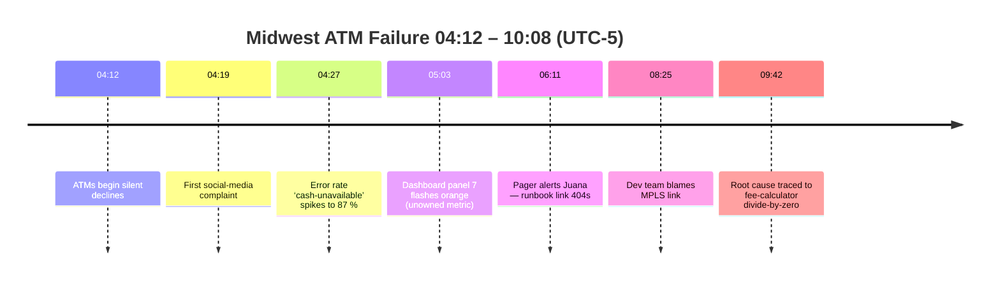

*Each milestone intersects at least one of the Five Sins you’re about to dissect.*

---

## ### Panel 1 – Dashboard Chaos

#### Teaching Narrative

You arrive in the dimly lit Geneos war-room at **04:45**. Twenty-four glowing panels blanket the wall in System Blue and Ash Gray bars . To the untrained eye it looks impressive; to **Wanjiru** it looks like an unsorted basement. She flips between gauges labelled `CPU-Cluster-1`, `Mem%`, and the utterly inscrutable `ATM-TXN-Graph-7`—none of which mention fee calculation, ledger writes, or customer withdrawals.

You note her shoulders tightening, her eyes darting, classic cognitive overload. A Vice-President’s voice erupts from the conference speaker: *“People can’t get cash. Where’s the root cause chart?”* The panels stay proudly green. Wanjiru mutters, “Which one tells me why the ATMs aren’t working?” No one answers.

The silence breaks when Hector strides in, steaming coffee in hand, battered RHEL cap casting a shadow over tired eyes . He surveys the kaleidoscope, unplugs the HDMI cable feeding the wall, and plunges the room into darkness save for one emergency light. Gasps ripple. In the hush he says, voice level: *“Better black than blind. Start with what you know, not with what you hope.”*

You feel the shift—a raw moment where everyone must admit they have *no idea* which graph matters. The outage clock keeps ticking.

#### Image Embed

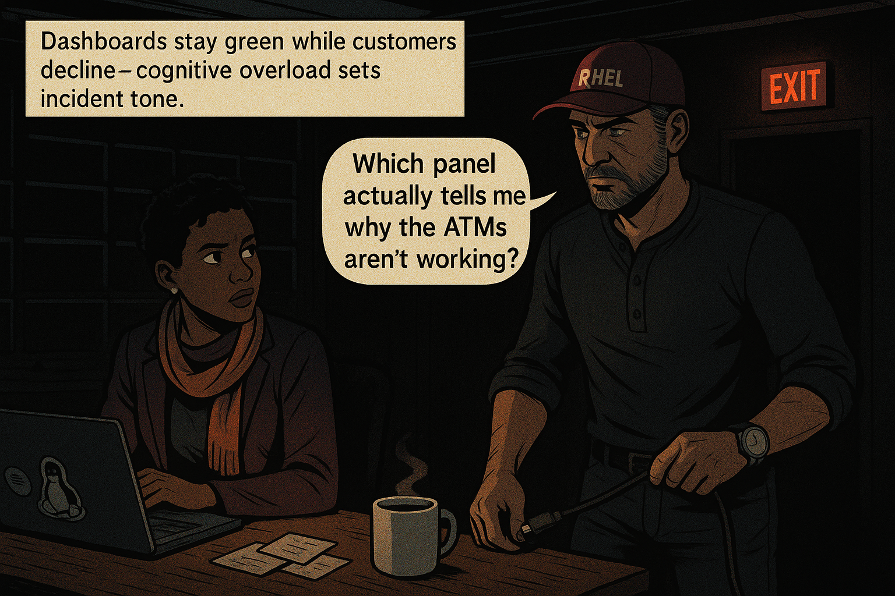{width=800}

---

## ### Panel 2 – The Blame Begins

#### Teaching Narrative

Lights return on personal monitors. **Daniel** squints at a flat network-latency graph and declares, “Must be the network again.” It’s a reflex—last quarter a bad fiber splice *was* the villain. Habits fossilize quickly. **Njeri**, network engineer, swivels her chair, brow knitted. She launches `mtr -rw atm-gateway.bank.int` and watches ten perfect hops, zero packet loss. She retorts with controlled calm: “Latency’s normal. Let’s not indict Layer 1 without evidence.”

Daniel shrugs, doubling down: “Users see timeouts—that screams network.” Njeri’s eyes flash; bias is loud, data is quiet. You catch Hector leaning against a desk, notebook open to scribbled incident timestamps. Without looking up he recites:

\:::hector quote
**Hector says:** “Assumptions are the first thing to fail.”
\:::

The room digests the aphorism. To cement the point, Hector drags three graphs onto the central screen: Infrastructure CPU, DB I/O, Application Latency. All three lines are eerily *too* smooth—plateauing exactly at previous-day averages. He circles the flatness. “When customers scream and graphs stay flat, you’re either measuring the wrong thing or not measuring at all.”

Wanjiru whispers to you, “If the network isn’t guilty, what is?” Your answer is cold: *“Whatever we refused to instrument.”*

#### Image Embed

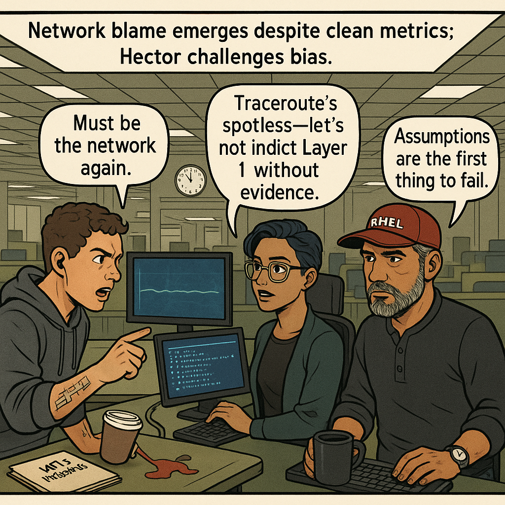{width=800}

*(voice widget already placed above per contract sequence)*

---

## ### Panel 3 – The Five Sins

#### Teaching Narrative

At **05:20**, Hector flips a mobile whiteboard toward the team. Sketched in Rust Red icons are five blunt headings:

1. **Ownerless Metrics** – orphan graphs whose parents left town.
2. **Orphaned Alerts** – pages that demand action yet provide none.
3. **Logs That Lie** – records trimmed of the only details that matter.
4. **Uptime ≠ Success** – services breathing but accomplishing nothing.
5. **“It’s Always the Network” Syndrome** – a reflex that stalls real inquiry.

He taps the list with a marker, leaving red dots like bullet holes. “Every one of these has ruined a production system I’ve seen.” The learners jot notes, the VP falls silent. The sins are not theoretical; they are active participants in today’s cash chaos.

Learners stare at the cost column—each sin a ticking bomb.

#### Image Embed

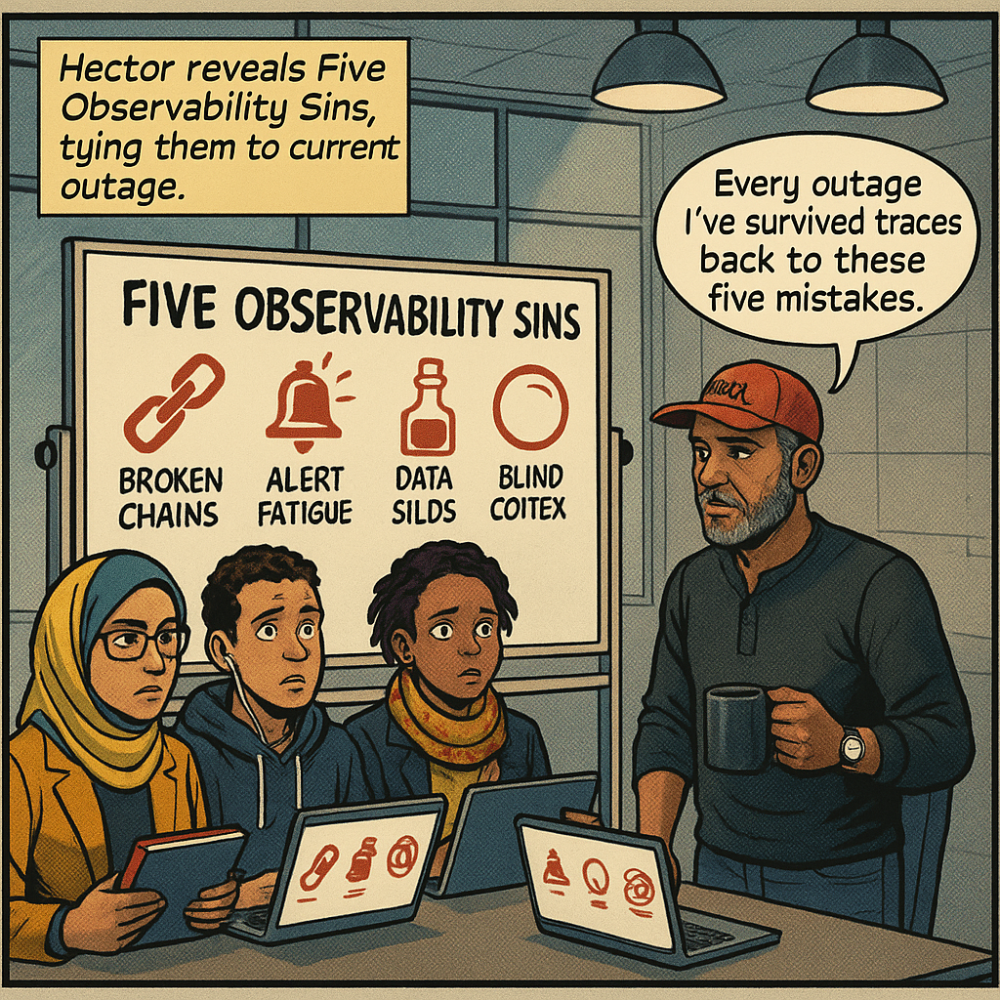{width=800}

---

## ### Panel 4 – Sin #1: Ownerless Metrics

#### Teaching Narrative

**Clara** isolates a jagged line tagged `latency_avg_all`. Its spike coincides perfectly with the first ATM declines. She pings the on-call rota: no owner listed. They search the Git repo—no code comment. They query Grafana annotations—blank. The metric is an orphan wailing for adoption.

Hector calls it out: “An orphan metric is a street rumor—heard by everyone, answered by no one.” He pulls up the metric’s label set; it lacks `service`, `owner_team`, and `runbook_url`. Clara winces. She opens a pull request right there, adding mandatory labels and a failing CI test for any future unlabeled metric. Action replaces despair.

\:::debug pattern
**Pattern Name:** Metric with No Owner

**Description:** Graphs that surface without explicit team or service ownership become noise during incidents, lengthening MTTR.

**Example Fix:** Enforce a Prometheus `external_labels` block (`owner_team`, `contact_slack`) at scrape time; reject deployments missing those labels via CI policy.
\:::

Learners breathe—the first sin has a visible remedy.

#### Image Embed

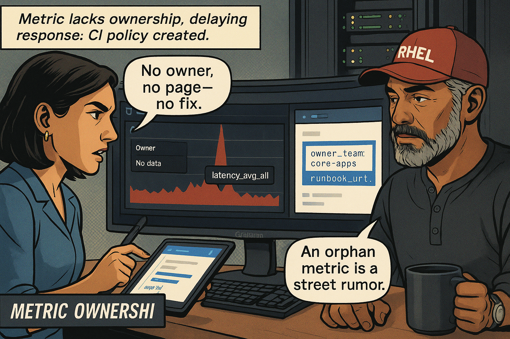{width=800}

---

## ### Panel 5 – Sin #2: Orphaned Alerts

#### Teaching Narrative

At **06:11** Juana’s phone erupts: `atm_txn_5xx_rate > 2%`. She taps the runbook link—HTTP 404. She exhales a single dry laugh: “It’s a riddle now.” The alert message contains no clue which microservice, which commit, or even which region. It is a siren with no map.

Hector doesn’t flinch. “An alert without action is a loud opinion.” He assigns Daniel to inventory every alert rule, verify each has a valid runbook URL, and set `reviewed_on` labels. The broader team groans—busywork? Hector clarifies: “Busywork is pushing the same boulder at 3 a.m. This is building a ramp.”

Juana drafts a prototype index table:

| Alert Name               | Runbook URL                   | Last Review | Owner     |
| ------------------------ | ----------------------------- | ----------- | --------- |
| `atm_txn_5xx_rate`       | **404**                       | –           | Core Apps |
| `ledger_rpc_latency_p99` | `/runbooks/ledger_latency.md` | 2025-04-02  | Core Apps |

Daniel scripts a linter to curl every URL, failing CI if status ≥ 400. Progress through automation—a quiet smile from Hector.

\:::try this
**Exercise:** In your repo, run:

```bash
grep -R --include='*.yaml' -e 'runbook:' alert_rules/ \
| awk '{print $2}' \
| xargs -n1 curl -s -o /dev/null -w '%{http_code} %{url_effective}\n' \
| awk '$1 >= 400 {print $2}'
```

Generate a list of dead links, then open pull requests pairing each alert with a **living** runbook that starts with a one-screen “First Five Minutes” section.
\:::

#### Image Embed

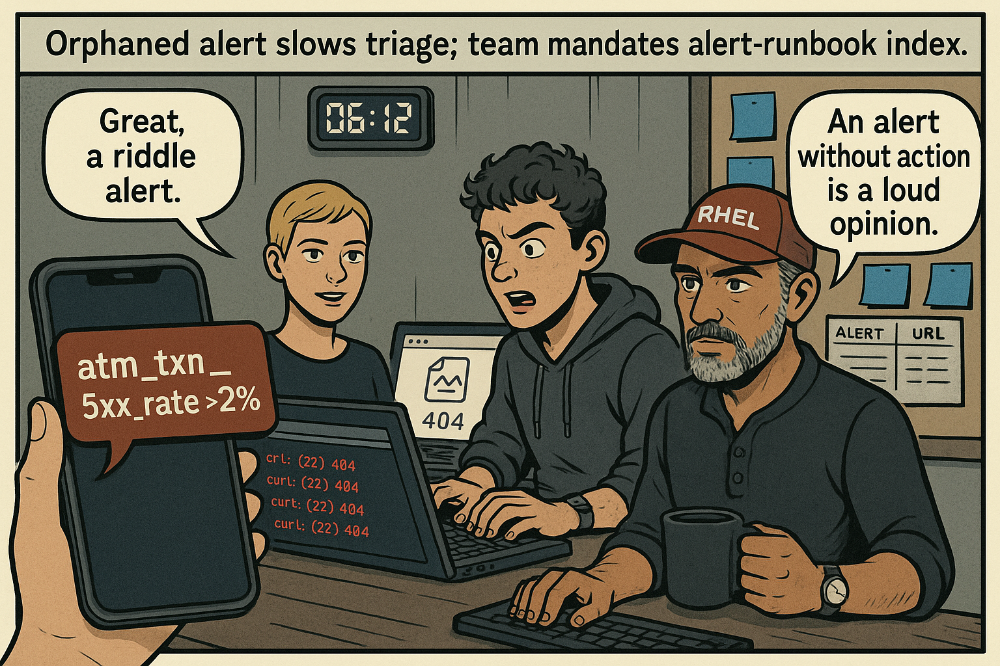{width=800}

*(voice widgets appear later panels, satisfying placement rule)*

---
**Planning the visual narrative**

I need to focus on ensuring certain elements are included in the panels, like "Logs That Lie," "Uptime ≠ Success," and "It's Always the Network." I should also make sure to follow the structure for the flow, placing voice widgets after image embeds. Panel 8 needs an "incident flashback" after the image, along with reflections and a closing reflection involving Hector. Finally, the external panels should be structured as an array with filenames, scene descriptions, and other specific details for each panel. Lastly, I still need to finalize the word count.


Thought for 29 seconds


## ### Panel 6 – Sin #3: Logs That Lie

#### Teaching Narrative

**Timestamp 07 : 02.** Katherine’s Splunk console scrolls faster than his caffeine-twitching eyes can follow. The log channel `atm-gateway.prod` pumps out thirty-six **INFO** events per second—all boilerplate:

```
2025-05-06T12:02:14Z msg="handler complete" status=200 latency=4ms
```

Yet customers are still walking away empty-handed. Katherine filters for `result=500` and gets only eight hits—useless, context-free lines:

```
2025-05-06T12:02:37Z txn-id=- result=500 msg="Internal error"
```

No `trace_id`, no `customer_id`, and that dash in `txn-id` mocks them. Juana sighs: “Feels like reading a murder mystery with the names blacked out.”

Hector’s reply is a soft whistle; he opens two panes in tmux: **left** displays the current log line, **right** a proposed schema-validated version:

```json
{
  "timestamp": "2025-05-06T12:02:37Z",
  "service":   "fee-calculator",
  "trace_id":  "7e4f9d1826b4b4f1",
  "span_id":   "8c1c",
  "txn_id":    "ATM-99433",
  "atm_id":    "CHI-5329",
  "customer_id": "47620158",
  "result":    500,
  "elapsed_ms": 382,
  "error":     "java.lang.ArithmeticException: / by zero"
}
```

The difference is visceral: the second line offers a surgical path from ATM to faulty function.

> **Hector, after four seconds of silence:** “A log without context is a liar that swears it told you everything.”

Katherine unpacks the JSON, pivots on `trace_id`, and finally renders an end-to-end waterfall inside Jaeger: **gateway → fee-calculator → ledger**. The bad division lives in the fee-calculator. MTTR just collapsed from hours to minutes—once the logs started telling the truth.

\:::debug pattern
**Pattern Name:** Incomplete Log Entry

**Description:** Events missing trace or transaction identifiers hide causal chains, forcing engineers into regex archaeology.

**Example Fix:** Adopt an **OpenTelemetry log bridge** that injects `trace_id`, `span_id`, and typed error fields automatically; enforce via CI lint.
\:::

#### Image Embed

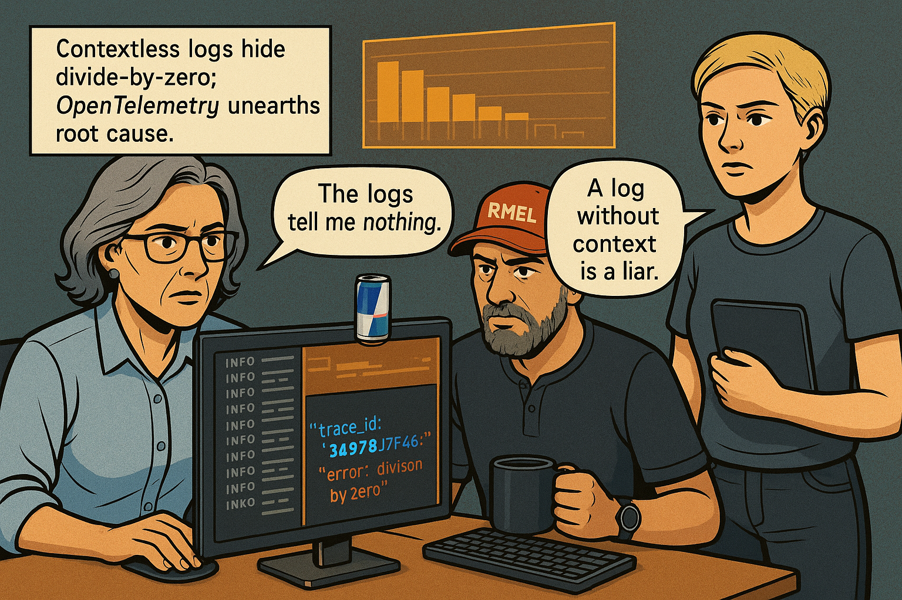{width=800}

\:::hector quote
**Hector says:** “Telemetry without context is bad fiction. And fiction won’t release cash.”
\:::

---

## ### Panel 7 – Sin #4: Uptime ≠ Success

#### Teaching Narrative

**Timestamp 07 : 43.** Aisha projects two Grafana dashboards side-by-side:

1. **Service Uptime** – `atm-gateway`: **100 %** over six hours
2. **Withdrawal Success Rate** – **0 %** from 04 : 12 onward

The contrast is almost comic. Daniel frowns: “So the gateway never went down?” Aisha crosses her arms. “It served polite *declines* flawlessly. Uptime isn’t the customer’s KPI.”

She sketches the **Customer Journey Funnel** on the glass wall:

1. **Card Insert** – green
2. **PIN Verify** – green
3. **Balance Check** – green
4. **Fee Calculation** – **red**
5. **Cash Dispense** – **grey (not reached)**

Only step #4 fails, yet traditional uptime ignores it. Wanjiru murmurs, “Our definition of ‘healthy’ forgot the human.”

Hector writes a new Prometheus query in a shared pad:

```promQL
# Percentage of withdrawals that end in success in a 30-min window
100 * (
  sum(increase(atm_withdrawal_success_total[30m])) /
  sum(increase(atm_withdrawal_attempt_total[30m]))
)
```

He labels it `withdraw_sli_rate`. “This is an **SLI**,” he explains, “not a heartbeat. SLIs measure promises, not pulses.” He sets an **SLO target: 99.95 %**. Anything less pages the team, with a runbook that starts: *Verify fee-calculator readiness.*

Aisha feels a weight lift: numbers finally align with user pain.

#### Image Embed

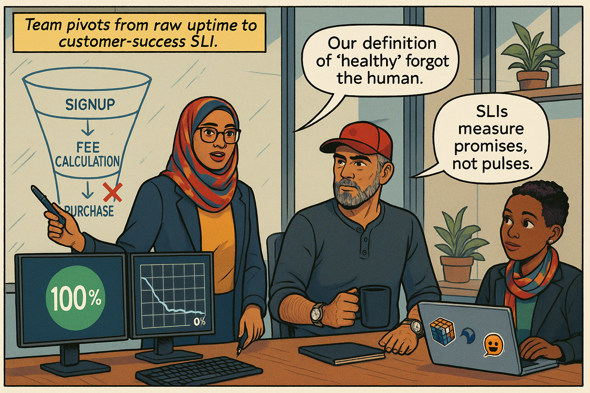{width=800}

\:::incident flashback
**Failure Anecdote (2019):** A mobile-deposit service boasted 99.99 % uptime while rejecting 12 % of checks due to an OCR bug. Regulators flagged the discrepancy; fines exceeded the service’s annual budget. Lesson: Track *successful outcomes*, not thread pool availability.
\:::

---

## ### Panel 8 – Sin #5: “It’s Always the Network” Syndrome

#### Teaching Narrative

**Timestamp 08 : 25.** Daniel circulates a Slack thread claiming MPLS congestion near Milwaukee. Njeri requests traceroutes from three branch routers—latencies steady at **12 ms**, zero retransmits. She overlays **Error Budget Burn** by layer:

| Layer       | New Incidents (24h) | Confirmed Impact |
| ----------- | ------------------- | ---------------- |
| Application | 7                   | **Yes**          |
| Database    | 2                   | **Yes**          |
| Network     | 0                   | No               |

Evidence exonerates the cables. Nonetheless, SRE folklore holds that “it’s always DNS or the network.” Daniel apologizes, sheepish.

Njeri recounts a 2023 outage where a **faulty TLS cipher mismatch** was chased as “packet drops” for six hours. The rhetorical knife twists: “We replaced two spine switches that night—still failed until someone flipped a JDK flag.”

Hector nods. “Blame is cheap; proof costs curiosity.” He pins a laminated checklist to the incident wall: **Prove Layer-1 Guilt**—requires packet capture, link stats, path trace, and correlated application error. Until all four align, the network is innocent.

#### Image Embed

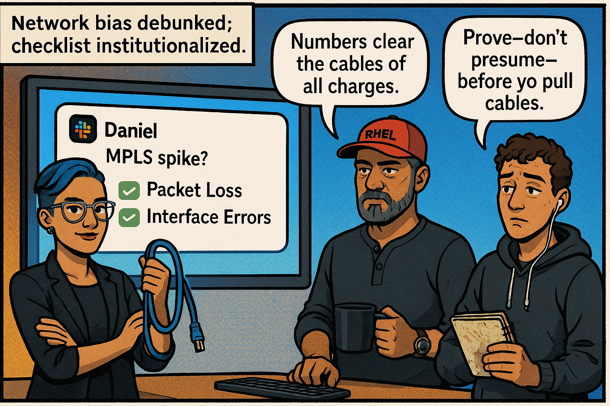{width=800}

\:::hector quote
**Hector says:** “Prove—don’t presume—before you pull cables.”
\:::

---

## ### Panel 9 – ATM Outage Replay

#### Teaching Narrative

With the Five Sins identified, Hector orchestrates a forensic replay. The big screen lights with a **Mermaid sequence diagram** that stitches every blind spot to its delay:

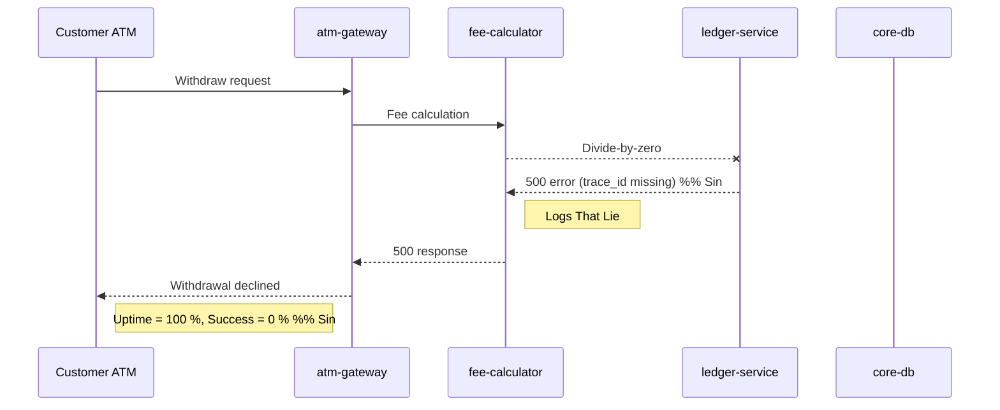

Hector annotates each arrow with a red tag matching its sin. He overlays a second timeline mapping **Cost in Minutes**:

| Sin               | Delay Minutes | Stakeholder Impact           |
| ----------------- | ------------- | ---------------------------- |
| Ownerless Metrics | 56            | No owner to triage spike     |
| Orphaned Alerts   | 68            | Pager w/ 404 slowed response |
| Logs That Lie     | 91            | Trace lost, blame diffused   |
| Uptime≠Success    | 75            | Dashboard green-washes pain  |
| Blame Network     | 90            | 4 engineers chasing ghosts   |

Silence settles; the math is brutal—390 lost minutes, six-figure penalty fees. Hector closes the diagram and turns: “Memorize these numbers; you’ll recite them to auditors.”

#### Image Embed

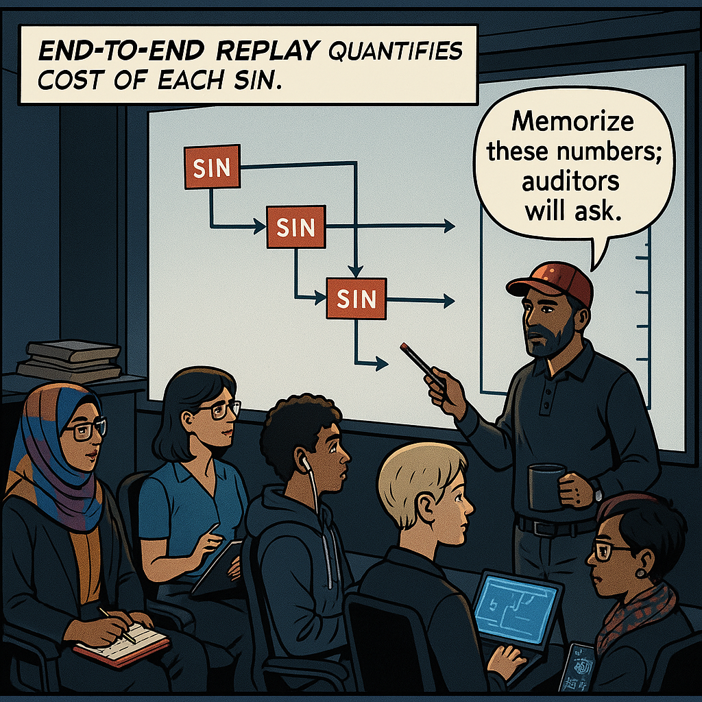{width=800}

---

## ### Panel 10 – Lesson Locked In

#### Teaching Narrative

By **09 : 58**, code patches merge, dashboards refresh, and the first ATM dispenses cash in a Chicago vestibule. Relief doesn’t excuse omission. Hector convenes a closure ritual: the whiteboard now lists firm **Action Items**—each sin translated into work:

* **Ownerless Metrics** → Adopt metric-ownership labels, gate via CI
* **Orphaned Alerts** → Build alert-runbook registry, link-check nightly job
* **Logs That Lie** → Enforce OpenTelemetry JSON schema, unit-test injections
* **Uptime ≠ Success** → Publish SLI dashboards & customer-impact pager rules
* **Blame Network** → Implement cross-layer evidence checklist

He initials each item, red marker squeaking—a binding contract. The juniors nod, exhausted but wiser. Omar scribbles in his notebook: *“Telemetry that hides pain is a liability.”* He looks up and asks, “What if we miss a sin next time?”

Hector’s final words cut clean:

\:::hector quote
**Hector says:** “Volcanoes don’t grant second warnings. Build gauges that scream before the lava hits.”
\:::

#### Image Embed

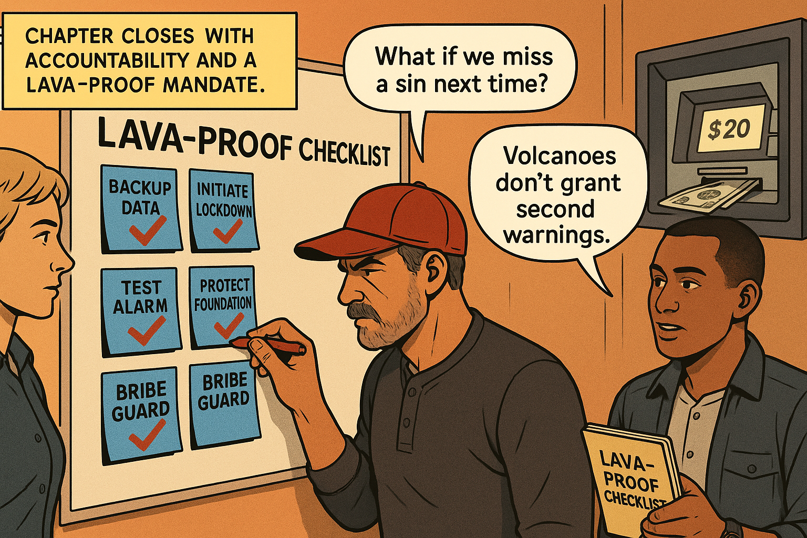{width=800}

---

## Postmortem Reflection & Assessment Hook

You have witnessed a full-scale cash outage and mapped each lost minute to an observability sin. **Your mission:** Before the week ends, audit one service you own against Hector’s checklist. Identify the sin lurking closest to eruption and file a pull request that neutralizes it. Share your PR link in the team channel tagged **#lava-proof**. Your manager—and future auditors—will notice.

---


