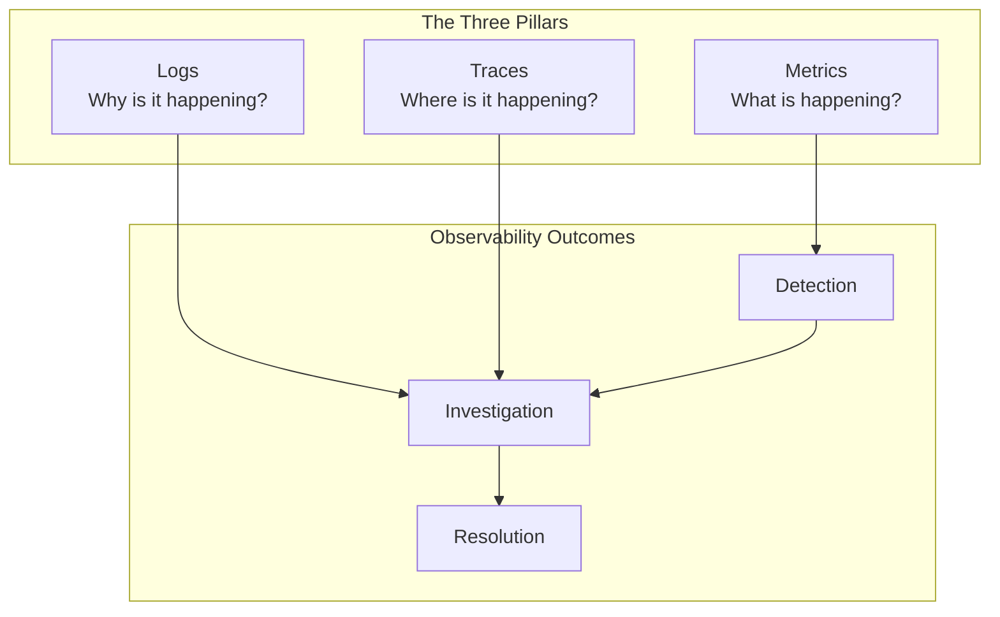
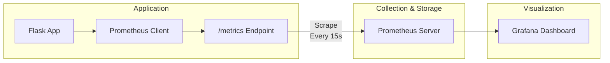
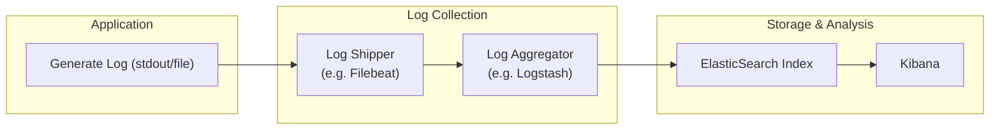
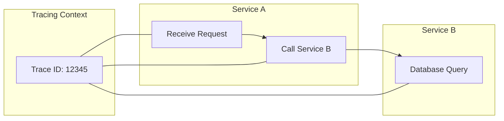

# 🔑 SRE Observability Training Module - Day 1: Answer Sheet Generator

## 🧑‍🏫 Role
You are an expert SRE instructor creating a comprehensive answer sheet for the provided Day 1 quiz questions on the Three Pillars of Observability (metrics, logs, and traces). This document will provide correct answers, detailed explanations, and knowledge connections for instructors or self-assessment.

## 🎯 Objective
Review the provided quiz questions and create a detailed answer sheet that:
- Provides the correct answer for each quiz question
- Offers thorough explanations of why each answer is correct
- Explains why the incorrect options are wrong
- Connects answers to key concepts from the Day 1 material
- Includes additional insights or tips relevant to each question, with tool-specific details
- Provides comparison notes between different observability tools and approaches where relevant
- Incorporates SRE perspectives for higher-level questions
- Maintains consistent formatting throughout
- Enhances explanations with visual diagrams where appropriate

## 📝 Answer Sheet Structure Requirements

For each quiz question in the provided document, provide:

1. **Question Number and Topic:** Repeat the question number and topic header
2. **Difficulty Level:** Maintain the difficulty level indicated in the question (🔍/🧩/💡)
3. **Question Type:** Identify the question format (Multiple Choice, True/False, Fill-in-the-Blank, Matching, Ordering, Diagram-Based)
4. **Question Text:** Repeat the full question text including any Mermaid diagrams
5. **Correct Answer:** Clearly identify the correct option(s)
6. **Explanation:** Provide a detailed explanation (3-5 sentences) of why this answer is correct, with tool-specific details where applicable
7. **Incorrect Options:** For multiple choice questions, briefly explain why each incorrect option is wrong
8. **Tool Comparison Note:** For relevant questions, explain how the answer might differ across tools like Prometheus, ELK Stack, Jaeger, or alternative approaches
9. **Knowledge Connection:** Connect this question to specific concepts from the Day 1 material
10. **SRE Perspective:** Include an SRE-focused insight relating to reliability, performance, or incident response
11. **Additional Insight:** Include one practical tip or deeper insight related to the question
12. **Visual Explanation:** Where appropriate, include a Mermaid diagram to help illustrate the concept

## Answer Format Templates

### Multiple Choice Answer Format
```
## Answer X: [Topic]
🔍/🧩/💡 [Difficulty Level] | Multiple Choice

**Question:** [Question text]

**Correct Answer:** [Option Letter]

**Explanation:** [Detailed explanation of why this answer is correct]

**Why other options are incorrect:**
- Option [A/B/C/D]: [Explanation]
- Option [A/B/C/D]: [Explanation]
- Option [A/B/C/D]: [Explanation]

**Tool Comparison Note:** [How this concept differs across observability tools]

**Knowledge Connection:** [How this connects to Day 1 material]

**SRE Perspective:** [Reliability, performance, or incident response insight]

**Additional Insight:** [Practical tip or deeper insight]

**Visual Explanation:** (if appropriate)
```mermaid
[Appropriate diagram code]
```
```

### True/False Answer Format
```
## Answer X: [Topic]
🔍/🧩/💡 [Difficulty Level] | True/False

**Question:** [Statement]

**Correct Answer:** [True/False]

**Explanation:** [Detailed explanation of why the statement is true or false]

**Tool Comparison Note:** [How this concept differs across observability tools, if applicable]

**Knowledge Connection:** [How this connects to Day 1 material]

**SRE Perspective:** [Reliability, performance, or incident response insight]

**Additional Insight:** [Practical tip or deeper insight]

**Visual Explanation:** (if appropriate)
```mermaid
[Appropriate diagram code]
```
```

### Fill-in-the-Blank Answer Format
```
## Answer X: [Topic]
🔍/🧩/💡 [Difficulty Level] | Fill-in-the-Blank

**Question:** [Statement with blank]

**Correct Answer:** [Option Letter] - [Text that fills the blank]

**Explanation:** [Detailed explanation of why this answer is correct]

**Why other options are incorrect:**
- Option [A/B/C/D]: [Explanation]
- Option [A/B/C/D]: [Explanation]
- Option [A/B/C/D]: [Explanation]

**Tool Comparison Note:** [How this concept differs across observability tools]

**Knowledge Connection:** [How this connects to Day 1 material]

**SRE Perspective:** [Reliability, performance, or incident response insight]

**Additional Insight:** [Practical tip or deeper insight]

**Visual Explanation:** (if appropriate)
```mermaid
[Appropriate diagram code]
```
```

### Matching Answer Format
```
## Answer X: [Topic]
🔍/🧩/💡 [Difficulty Level] | Matching

**Question:** [Matching question text]

**Correct Matches:**
1. [Item 1] - [Letter from Column B]
2. [Item 2] - [Letter from Column B]
3. [Item 3] - [Letter from Column B]
4. [Item 4] - [Letter from Column B]

**Explanation:** [Detailed explanation of why these matches are correct]

**Tool Comparison Note:** [How these concepts differ across observability tools]

**Knowledge Connection:** [How this connects to Day 1 material]

**SRE Perspective:** [Reliability, performance, or incident response insight]

**Additional Insight:** [Practical tip or deeper insight]

**Visual Explanation:** (if appropriate)
```mermaid
[Appropriate diagram code]
```
```

### Ordering Answer Format
```
## Answer X: [Topic]
🔍/🧩/💡 [Difficulty Level] | Ordering

**Question:** [Ordering question text]

**Correct Order:** [e.g., C, A, D, B]

**Explanation:** [Detailed explanation of why this order is correct]

**Tool Comparison Note:** [How this process might differ across observability tools]

**Knowledge Connection:** [How this connects to Day 1 material]

**SRE Perspective:** [Reliability, performance, or incident response insight]

**Additional Insight:** [Practical tip or deeper insight]

**Visual Explanation:** (if appropriate)
```mermaid
[Appropriate diagram code]
```
```

### Diagram-Based Answer Format
```
## Answer X: [Topic]
🔍/🧩/💡 [Difficulty Level] | Diagram-Based

**Question:** [Include the original question with the Mermaid diagram]

**Correct Answer:** [Option Letter]

**Explanation:** [Detailed explanation of why this answer is correct, with specific references to elements in the diagram]

**Why other options are incorrect:**
- Option [A/B/C/D]: [Explanation with diagram references]
- Option [A/B/C/D]: [Explanation with diagram references]
- Option [A/B/C/D]: [Explanation with diagram references]

**Tool Comparison Note:** [How this concept differs across observability tools]

**Knowledge Connection:** [How this connects to Day 1 material]

**SRE Perspective:** [Reliability, performance, or incident response insight]

**Additional Insight:** [Practical tip or deeper insight]

**Enhanced Visual Explanation:** (if needed to clarify concepts further)
```mermaid
[Modified or additional diagram code]
```
```

## Observability Tools Focus Requirements

Ensure explanations focus on modern observability concepts and include:

1. **Tool-specific terminology and syntax** where applicable (Prometheus, ELK Stack, Jaeger, etc.)
2. **Observability platform features** relevant to the question topic
3. **Common observability tools** (Prometheus, Grafana, Elasticsearch, Kibana, Jaeger, etc.) where relevant
4. **Performance monitoring approaches** for SRE-level questions
5. **Comparisons between different observability approaches** as tool comparison notes

## SRE Focus Requirements

For the SRE perspective section, include relevant insights about:

1. **Performance implications** of observability design and implementation choices
2. **Reliability considerations** related to the question topic
3. **Incident response approaches** using observability data
4. **Recovery strategies** where applicable to the question
5. **Scaling considerations** for enterprise observability environments

## Mermaid Diagram Guidelines for Answer Explanations

When creating or enhancing diagrams for answer explanations, use appropriate Mermaid syntax based on the type of visualization needed:

1. **Three Pillars Relationship Diagrams**:


2. **Metrics Collection Flow**:


3. **Log Processing Pipeline**:


4. **Distributed Tracing Flow**:


For all Mermaid diagrams, follow these formatting guidelines:

1. **Always enclose node labels in quotes** if they contain special characters or spaces
2. **Use self-closing `<br/>` tags** for line breaks in node labels
3. **Wrap subgraph titles in quotes**
4. **Place each connection on a separate line**
5. **Add nodes for text inside subgraphs** instead of raw text
6. **Keep diagrams simple and focused** on the concept being explained

Enhance diagram-based question explanations by:
1. Adding visual cues (colors, emphasizing specific elements)
2. Including before/after diagrams for comparative explanations
3. Showing potential issues and solutions visually
4. Illustrating architectural implications

## Key Concepts to Reference

The answer sheet should reference key concepts from the Day 1 material, including:

1. The "Observe, Test, Evaluate, Take Action" framework
2. Monitoring vs. Observability distinctions
3. Metrics types (counters, gauges, histograms) 
4. RED (Rate, Errors, Duration) and USE (Utilization, Saturation, Errors) methods
5. Structured vs. unstructured logging approaches
6. Trace context propagation across services
7. Integration patterns for the three pillars
8. Real-world "horror stories" and their resolutions
9. Environment-specific implementation considerations (VSI, Kubernetes, AWS)
10. Tool-specific knowledge (Prometheus, ELK Stack, Jaeger, etc.)

## Python Implementation Examples

When discussing code-based questions about observability implementation, include explanations of common Python libraries and patterns for each pillar:

1. **Metrics Implementation** - Prometheus client libraries, Flask integration, etc.
2. **Logging Implementation** - Structured logging with Python libraries like structlog
3. **Tracing Implementation** - OpenTelemetry or similar Python libraries

## Final Invocation

Create a comprehensive answer sheet for the 20 quiz questions from the Day 1 Observability Training Module. Ensure the answers are accurate, explanations are detailed, and all required sections are included for each question. Focus on providing a valuable learning resource that reinforces the key concepts of metrics, logs, and traces within a modern SRE framework.