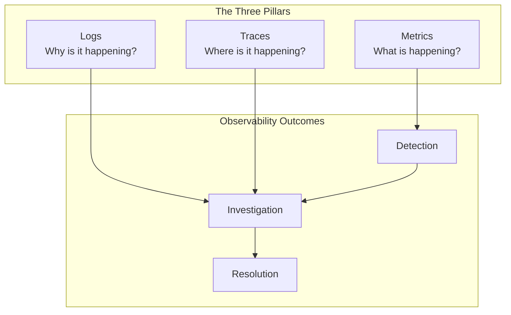
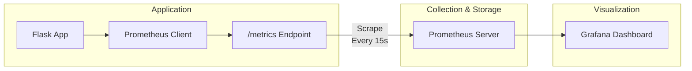
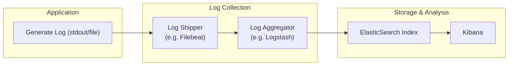
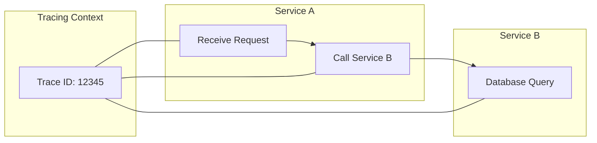

# 📝 SRE Observability Training Module - Day 1: Quiz Questions

## 🧑‍🏫 Role
You are an expert SRE instructor creating assessment questions for a Day 1 training module on the Three Pillars of Observability (metrics, logs, and traces). These questions will test knowledge from beginner to SRE-level concepts covered in the Day 1 material.

## 🎯 Objective
Create a comprehensive set of quiz questions that:
- Tests understanding of core observability concepts (metrics, logs, traces)
- Assesses knowledge of practical implementation details for each pillar
- Evaluates application of concepts to support and SRE scenarios in various environments (VSI, Kubernetes, AWS)
- Provides progressive difficulty from beginner to advanced levels
- Includes a variety of question types and formats including diagram-based questions
- Tests awareness of key differences between traditional monitoring and modern observability

## 📝 Quiz Structure Requirements

Create exactly 20 quiz questions with the following distribution:
- 7 Beginner-level questions (🔍)
- 7 Intermediate-level questions (🧩)
- 6 Advanced/SRE-level questions (💡)

Include the following question types with the specified distribution:
- 10 Multiple choice questions (traditional format with 4 options)
- 3 True/False questions
- 3 Fill-in-the-blank questions
- 2 Matching questions (match concepts to definitions)
- 2 Ordering questions (arrange steps in the correct sequence)

Each question must:
- Clearly indicate its difficulty level with the appropriate emoji (🔍, 🧩, 💡)
- Connect directly to content covered in the Day 1 material
- Be clearly written and unambiguous
- Include relevant context for scenario-based questions
- Include tool-specific content where appropriate (Prometheus, ELK Stack, Jaeger, etc.)

At least 5 questions should incorporate Mermaid diagrams (data flow, architecture, or implementation) for visual assessment.

## Question Type Formats

### Multiple Choice Format
```
## Question X: [Topic]
🔍/🧩/💡 [Difficulty Level]

[Question text]

A. [Option A]
B. [Option B]
C. [Option C]
D. [Option D]
```

### True/False Format
```
## Question X: [Topic]
🔍/🧩/💡 [Difficulty Level]

[Statement]

A. True
B. False
```

### Fill-in-the-Blank Format
```
## Question X: [Topic]
🔍/🧩/💡 [Difficulty Level]

Complete the following statement:

[Statement with ________ for the blank]

A. [Option A]
B. [Option B]
C. [Option C]
D. [Option D]
```

### Matching Format
```
## Question X: [Topic]
🔍/🧩/💡 [Difficulty Level]

Match each item in Column A with the appropriate item in Column B.

Column A:
1. [Item 1]
2. [Item 2]
3. [Item 3]
4. [Item 4]

Column B:
A. [Definition/Example A]
B. [Definition/Example B]
C. [Definition/Example C]
D. [Definition/Example D]
```

### Ordering Format
```
## Question X: [Topic]
🔍/🧩/💡 [Difficulty Level]

Arrange the following steps in the correct order:

A. [Step A]
B. [Step B]
C. [Step C]
D. [Step D]
```

### Diagram-Based Question Format
```
## Question X: [Topic]
🔍/🧩/💡 [Difficulty Level]

Examine the following observability diagram:

```mermaid
[Appropriate diagram code]
```

[Question text based on the diagram]

A. [Option A]
B. [Option B]
C. [Option C]
D. [Option D]
```

## Quiz Content Focus Areas

1. **Observability Foundations**
   - The Three Pillars of Observability (metrics, logs, traces)
   - Monitoring vs. Observability
   - The "Observe, Test, Evaluate, Take Action" framework
   - Observability maturity model

2. **Metrics**
   - Types of metrics (counters, gauges, histograms)
   - Metrics collection and visualization
   - RED and USE methods
   - Scaling and alerting strategies

3. **Logs**
   - Structured vs. unstructured logging
   - Log processing pipelines
   - Log correlation techniques
   - Log sampling and performance considerations

4. **Traces**
   - Spans and trace context
   - Distributed tracing flow
   - Context propagation
   - Sampling strategies

5. **Integrating the Three Pillars**
   - Correlation patterns across pillars
   - Unified observability architecture
   - Environment-specific implementation (VSI, Kubernetes, AWS)
   - Horror story resolutions

## Question Distribution Requirements

Ensure a good distribution of questions across:
- All concept areas covered in Day 1
- Different cognitive levels (recall, understanding, application, analysis)
- Tool-specific vs. general observability concepts
- Practical scenarios vs. theoretical knowledge
- Text-based questions vs. diagram-based questions

## Mermaid Diagram Guidelines for Questions

When creating diagram-based questions, use appropriate Mermaid syntax based on the type of visualization needed:

1. **Three Pillars Relationship Diagrams**:


2. **Metrics Collection Flow**:


3. **Log Processing Pipeline**:


4. **Distributed Tracing Flow**:


Follow these formatting guidelines to ensure proper Mermaid diagram rendering:

1. **Always enclose node labels in quotes** if they contain special characters or spaces
2. **Use self-closing `<br/>` tags** for line breaks in node labels
3. **Wrap subgraph titles in quotes**
4. **Place each connection on a separate line**
5. **Add nodes for text inside subgraphs** instead of raw text
6. **Keep diagrams simple and focused** on the concept being tested

## Diagram-Based Question Types

Consider these types of diagram-based questions:

1. **Three Pillars Integration**: Show how metrics, logs, and traces work together and ask about their relationships or use cases
2. **Data Flow Understanding**: Display a metrics collection or log processing flow and ask about expected behavior or components
3. **Troubleshooting Scenario**: Present an observability architecture with an issue and ask for identification of the problem
4. **Component Relationship**: Show different observability tools and ask about their interactions or dependencies
5. **Implementation Analysis**: Present a specific implementation (e.g., structured logging) and ask questions about its benefits or potential issues

DO NOT include the correct answers or explanations in the questions themselves. These will be provided in a separate answer key document.

## Content Examples to Reference

The questions should reference key concepts from the Day 1 material, including:

1. The "Observe, Test, Evaluate, Take Action" framework
2. Monitoring vs. Observability distinctions
3. Metrics types (counters, gauges, histograms)
4. RED (Rate, Errors, Duration) and USE (Utilization, Saturation, Errors) methods
5. Structured vs. unstructured logging approaches
6. Trace context propagation across services
7. Integration patterns for the three pillars
8. Real-world "horror stories" and their resolutions
9. Environment-specific implementation considerations (VSI, Kubernetes, AWS)
10. Tool-specific knowledge (Prometheus, ELK Stack, Jaeger, etc.)

## Final Invocation

Create a comprehensive set of 20 quiz questions based on the Day 1 Observability Training Module that follows all the requirements specified above. Ensure questions are clearly written, appropriately challenging for their indicated difficulty level, and directly relevant to the material covered in Day 1.