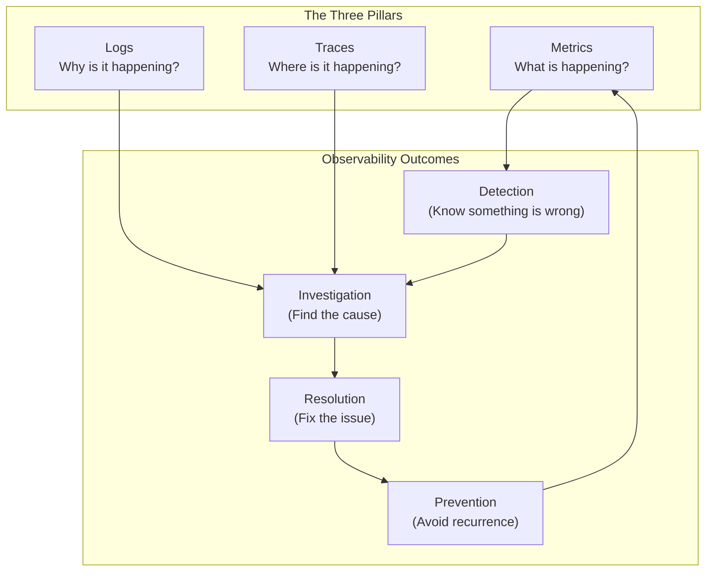
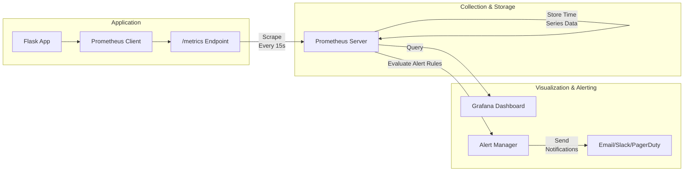
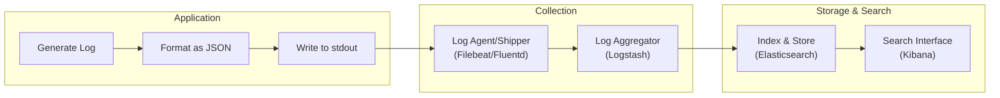
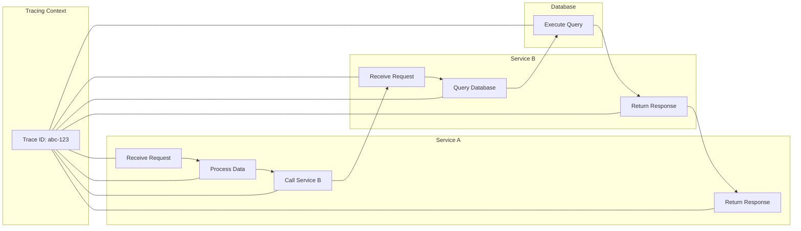
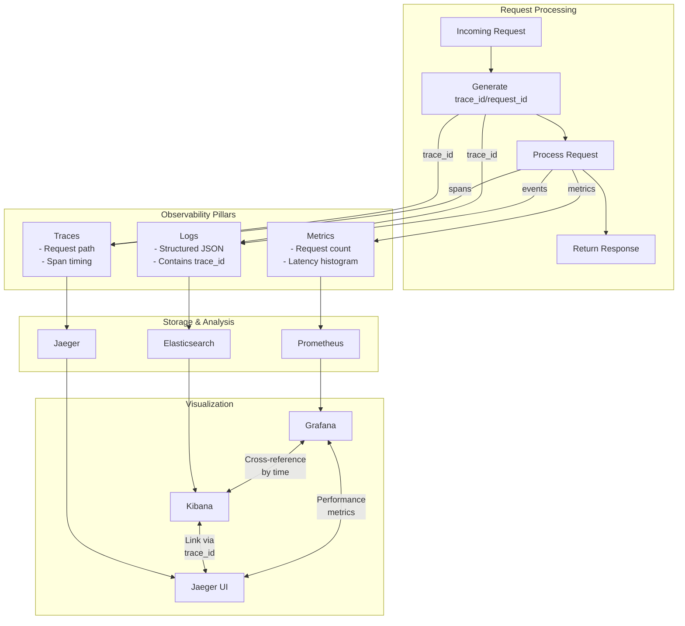
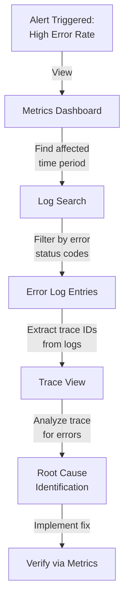

# 📊 Comprehensive Prompt: Day 1 Observability Training Module

## 🎯 Purpose & Overview

This prompt will guide the creation of a comprehensive, engaging, and practical Day 1 training module on the Three Pillars of Observability: Metrics, Logs, and Traces. The resulting material should serve as production-ready onboarding content that builds expertise from beginner to SRE-level through a practical, step-by-step approach.

## 👥 Target Audience

Beginner to Intermediate SREs and DevOps practitioners (ages 23-58, with 2-20 years of experience) who need to understand observability concepts to effectively implement monitoring and troubleshooting strategies. This is the first day of a comprehensive observability training program.

## 🧱 Learning Approach

Use a "brick-by-brick" teaching methodology that:
- Starts with fundamentals and progressively builds complexity
- Makes concepts tangible through real-world examples and "horror stories with happy endings"
- Reinforces learning with visual aids (diagrams), code examples, and hands-on exercises
- Offers tiered content for different experience levels (🔍 Beginner, 🧩 Intermediate, 💡 Advanced/SRE)
- Encourages empathy and humor when describing real-world operational challenges

## 📋 Content Requirements

### Required Module Structure

1. **Introduction: Observability 101**
   - Explain observability using the "Observe, Test, Evaluate, Take Action" framework
   - Clearly distinguish between monitoring and observability
   - Provide an overview of the Three Pillars (metrics, logs, traces) and their relationships
   - Include a real-world incident scenario demonstrating how proper observability resolves problems
   - Visual: Include a Three Pillars Overview Diagram showing relationships between pillars and outcomes
   - Video Placeholder: {{VIDEO_LINK_INTRO}}
   - Learning Objectives: List 4 measurable objectives for each tier (Beginner, Intermediate, Advanced/SRE)

2. **Core Concept: Metrics (The Quantified View)**
   - 🔍 Beginner: Provide an intuitive analogy (e.g., car dashboard), define metrics types (counters, gauges, histograms)
   - 🧩 Intermediate: Explain practical implementation, visualization techniques, RED/USE methods
   - 💡 Advanced/SRE: Discuss advanced concerns like cardinality issues, alerting strategies, and system performance impact
   - Visual: Include diagrams showing metrics collection flow and comparison of metric types
   - Implementation Comparison: Table comparing metrics in different platforms (Prometheus, Datadog, InfluxDB)
   - Horror Story: Share a metrics-related incident with resolution
   - Video Placeholder: {{VIDEO_LINK_METRICS}}

3. **Core Concept: Logs (The Narrative Thread)**
   - 🔍 Beginner: Provide an intuitive analogy (e.g., journey journal), explain log levels and basic logging
   - 🧩 Intermediate: Teach structured JSON logs, log aggregation techniques
   - 💡 Advanced/SRE: Show advanced log querying, correlation with metrics and traces, performance considerations
   - Visual: Include diagrams showing log processing pipeline and structured vs. unstructured logs comparison
   - Implementation Comparison: Table comparing logging in different platforms (ELK Stack, Splunk, Graylog)
   - Horror Story: Share a logging-related incident with resolution
   - Video Placeholder: {{VIDEO_LINK_LOGS}}

4. **Core Concept: Traces (The Request's Journey)**
   - 🔍 Beginner: Provide an intuitive analogy (e.g., GPS tracking), explain spans, trace IDs, and visualization
   - 🧩 Intermediate: Demonstrate trace context propagation and implementation in distributed systems
   - 💡 Advanced/SRE: Discuss sampling strategies, overhead considerations, and complex debugging techniques
   - Visual: Include diagrams showing distributed trace flow, span hierarchy, and trace context propagation
   - Implementation Comparison: Table comparing tracing in different platforms (Jaeger, Zipkin, AWS X-Ray)
   - Horror Story: Share a tracing-related incident with resolution
   - Video Placeholder: {{VIDEO_LINK_TRACES}}

5. **Integrating the Three Pillars**
   - Provide a decision framework for implementing all three pillars together
   - Show how metrics, logs, and traces correlate using shared IDs and timestamps
   - Demonstrate a workflow for investigating incidents using all three pillars
   - Identify common integration patterns and anti-patterns
   - Visual: Include diagrams showing three pillars integration and incident investigation flow
   - Video Placeholder: {{VIDEO_LINK_INTEGRATION}}

6. **Hands-On Exercises / Tiered Challenges**
   - 🔍 Beginner: Identify which pillar to use for specific scenarios; implement basic metrics in Flask
   - 🧩 Intermediate: Add structured logging to an application; create meaningful dashboards
   - 💡 Advanced/SRE: Design a complete observability strategy; correlate a trace with logs and metrics
   - Provide clear setup instructions and success criteria for each exercise

7. **Code Implementation Examples**
   - **Beginner Implementation**: Basic Metrics with Python Flask
   - **Intermediate Implementation**: Adding Structured Logging
   - **Advanced Implementation**: Adding Distributed Tracing
   - Each example should build on the previous one, showing the progression of a complete observability solution

8. **Real-World Scenarios**
   - **Scenario 1**: Detecting and Diagnosing a Performance Issue
   - **Scenario 2**: Tracking Down an Intermittent Error
   - Each scenario should show practical application of all three pillars to solve a realistic problem

### Required Code Examples

For each pillar, include fully functional Python code examples that learners can run themselves:

**1. Beginner Implementation: Basic Metrics with Python Flask**
```python
from flask import Flask, request
import time
from prometheus_client import Counter, Histogram, generate_latest

app = Flask(__name__)

# Define metrics
REQUEST_COUNT = Counter('app_requests_total', 'Total request count', ['method', 'endpoint'])
REQUEST_LATENCY = Histogram('app_request_latency_seconds', 'Request latency in seconds', ['endpoint'])

@app.before_request
def before_request():
    # Store request start time
    request.start_time = time.time()

@app.after_request
def after_request(response):
    # Record request metrics
    request_latency = time.time() - request.start_time
    REQUEST_COUNT.labels(method=request.method, endpoint=request.path).inc()
    REQUEST_LATENCY.labels(endpoint=request.path).observe(request_latency)
    return response

@app.route('/')
def hello():
    return "Hello World!"

@app.route('/metrics')
def metrics():
    return generate_latest()

if __name__ == '__main__':
    app.run(host='0.0.0.0', port=5000)
```

**2. Intermediate Implementation: Adding Structured Logging**
```python
import structlog
import logging
import time
import uuid
from flask import Flask, request, g
from prometheus_client import Counter, Histogram, generate_latest

# Configure structured logging
logging.basicConfig(level=logging.INFO)
structlog.configure(
    processors=[
        structlog.stdlib.add_log_level,
        structlog.processors.TimeStamper(fmt="iso"),
        structlog.processors.JSONRenderer()
    ],
    logger_factory=structlog.stdlib.LoggerFactory(),
)

logger = structlog.get_logger()
app = Flask(__name__)

# Define metrics (same as before)
REQUEST_COUNT = Counter('app_requests_total', 'Total request count', ['method', 'endpoint'])
REQUEST_LATENCY = Histogram('app_request_latency_seconds', 'Request latency in seconds', ['endpoint'])

@app.before_request
def before_request():
    # Generate request ID for correlation
    request.request_id = str(uuid.uuid4())
    # Store request start time
    request.start_time = time.time()
    # Create request-scoped logger
    g.logger = logger.bind(request_id=request.request_id, endpoint=request.path)
    g.logger.info("Request started", method=request.method, path=request.path)

@app.after_request
def after_request(response):
    # Record request metrics
    request_latency = time.time() - request.start_time
    REQUEST_COUNT.labels(method=request.method, endpoint=request.path).inc()
    REQUEST_LATENCY.labels(endpoint=request.path).observe(request_latency)
    
    g.logger.info("Request completed", 
                 status_code=response.status_code, 
                 duration_ms=request_latency*1000)
    return response

@app.route('/')
def hello():
    g.logger.info("Processing hello request")
    return "Hello World!"

@app.route('/metrics')
def metrics():
    return generate_latest()

if __name__ == '__main__':
    app.run(host='0.0.0.0', port=5000)
```

**3. Advanced Implementation: Adding Distributed Tracing**
```python
import time
import uuid
import structlog
import logging
from flask import Flask, request, g
from prometheus_client import Counter, Histogram, generate_latest
from opentelemetry import trace
from opentelemetry.exporter.jaeger.thrift import JaegerExporter
from opentelemetry.sdk.resources import SERVICE_NAME, Resource
from opentelemetry.sdk.trace import TracerProvider
from opentelemetry.sdk.trace.export import BatchSpanProcessor
from opentelemetry.instrumentation.flask import FlaskInstrumentor

# Configure structured logging (same as before)
logging.basicConfig(level=logging.INFO)
structlog.configure(
    processors=[
        structlog.stdlib.add_log_level,
        structlog.processors.TimeStamper(fmt="iso"),
        structlog.processors.JSONRenderer()
    ],
    logger_factory=structlog.stdlib.LoggerFactory(),
)
logger = structlog.get_logger()

# Configure OpenTelemetry tracing
resource = Resource(attributes={SERVICE_NAME: "example-flask-app"})
trace.set_tracer_provider(TracerProvider(resource=resource))
jaeger_exporter = JaegerExporter(
    agent_host_name="localhost",
    agent_port=6831,
)
span_processor = BatchSpanProcessor(jaeger_exporter)
trace.get_tracer_provider().add_span_processor(span_processor)
tracer = trace.get_tracer(__name__)

app = Flask(__name__)
FlaskInstrumentor().instrument_app(app)

# Define metrics (same as before)
REQUEST_COUNT = Counter('app_requests_total', 'Total request count', ['method', 'endpoint'])
REQUEST_LATENCY = Histogram('app_request_latency_seconds', 'Request latency in seconds', ['endpoint'])

@app.before_request
def before_request():
    # Get trace context
    span = trace.get_current_span()
    trace_id = format(span.get_span_context().trace_id, '032x')
    span_id = format(span.get_span_context().span_id, '016x')
    
    # Generate request ID (using trace ID)
    request.request_id = trace_id
    # Store request start time
    request.start_time = time.time()
    
    # Create request-scoped logger with trace context
    g.logger = logger.bind(
        request_id=request.request_id,
        trace_id=trace_id,
        span_id=span_id,
        endpoint=request.path
    )
    g.logger.info("Request started", method=request.method, path=request.path)

@app.after_request
def after_request(response):
    # Record request metrics
    request_latency = time.time() - request.start_time
    REQUEST_COUNT.labels(method=request.method, endpoint=request.path).inc()
    REQUEST_LATENCY.labels(endpoint=request.path).observe(request_latency)
    
    g.logger.info("Request completed", 
                 status_code=response.status_code, 
                 duration_ms=request_latency*1000)
    return response

@app.route('/')
def hello():
    with tracer.start_as_current_span("process_hello") as span:
        span.set_attribute("custom.tag", "example")
        g.logger.info("Processing hello request")
        # Simulate some work
        time.sleep(0.01)
        return "Hello World!"

@app.route('/metrics')
def metrics():
    return generate_latest()

if __name__ == '__main__':
    app.run(host='0.0.0.0', port=5000)
```

### Required Diagram Types

Include these Mermaid diagrams to enhance understanding of the concepts:

**1. Three Pillars Overview Diagram**


**2. Metrics Collection Flow Diagram**


**3. Log Processing Pipeline Diagram**


**4. Distributed Trace Flow Diagram**


**5. Three Pillars Integration Diagram**


**6. Incident Investigation Flow Diagram**


### Diagram Creation Guidelines

When creating Mermaid diagrams for the training module, follow these formatting rules to ensure proper rendering:

1. Always enclose node labels in quotes if they contain special characters like `()`, `:`, or HTML tags like `<br/>`. Example: `A["Node with (Parentheses)"]`.
2. Use self-closing `<br/>` tags for line breaks within node labels, inside the quotes. Example: `B["First Line<br/>Second Line"]`.
3. Always wrap subgraph titles in quotes. Example: `subgraph "My Subgraph"`.
4. Place each connection/arrow (`-->`, `---`) on its own line for clarity.
5. Do not add raw text immediately after a subgraph declaration; put text inside nodes.
6. Keep characters like `#`, `?` inside quotes if needed within labels.
7. Simplify complex diagrams or break them down if necessary.

## ✅ Format & Style Guidelines

1. **Section Structure**
   - Use consistent headings and subheadings for easy navigation
   - Include clear transitions between sections
   - Organize content from fundamental to advanced concepts

2. **Visual Elements**
   - Use emojis consistently to indicate different sections and concept tiers (🔍 Beginner, 🧩 Intermediate, 💡 Advanced/SRE)
   - Format Mermaid code blocks properly using the ```mermaid syntax
   - Ensure all tables have consistent column widths and properly aligned headers

3. **Code Examples**
   - Use consistent formatting for code blocks, including syntax highlighting for Python
   - Include step-by-step explanations for each code example
   - Show the progressive evolution of code from basic to advanced implementations

4. **Narrative Elements**
   - Include realistic "horror stories with happy endings" for each pillar
   - Use empathy and occasional humor to make technical content more relatable
   - Emphasize practical problem-solving rather than theory alone

## 🔥 Implementation Suggestions

1. **Real-World Integration**
   - Show how the three pillars work together in practice
   - Provide examples of correlation between metrics, logs, and traces
   - Demonstrate incident investigation workflows using all three pillars

2. **Learning Reinforcement**
   - Include knowledge check questions at the end of each section
   - Provide hands-on exercises that apply concepts incrementally
   - Offer extension activities for those who want to go deeper

3. **Accessibility**
   - Use analogies and visualizations to make abstract concepts concrete
   - Ensure explanations are clear for those with minimal prior exposure
   - Provide reference links for additional learning resources

## 📝 Final Invocation

Create a comprehensive Day 1 SRE training module focused on the Three Pillars of Observability (metrics, logs, and traces). Follow the "brick by brick" learning approach, introducing fundamental concepts and building to advanced SRE-level techniques. The goal is to produce training material that is ready for production onboarding, with sufficient detail and structure to serve as a complete learning resource for DevOps engineers and SREs.

The module should include:
- Detailed explanations of each pillar with tiered learning objectives
- Practical Python code examples for implementation
- Clear Mermaid diagrams illustrating key concepts and workflows
- Real-world scenarios and horror stories that demonstrate the value of observability
- Hands-on exercises for different skill levels
- Video placeholders for multimedia integration

The resulting training material should be comprehensive enough to serve as a standalone learning resource while maintaining accessibility for learners with diverse experience levels.