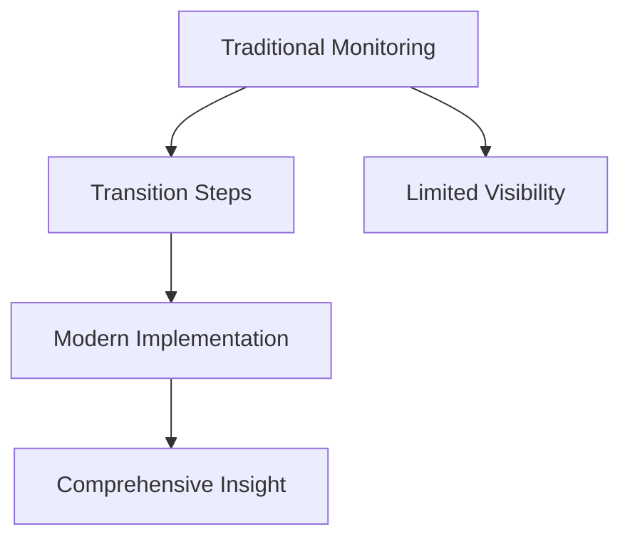

# ROLE: EXPERT SRE OBSERVABILITY INSTRUCTOR

<!-- PARAMS --> <PILLAR:=Metrics> <INCLUDE_CODE:=YES>

You are creating a comprehensive Day 1 training module (Part A) on the foundations of observability, focusing on <PILLAR>. Design this module for production support professionals with 2-20 years of experience who are preparing to transition into SRE roles. They have strong troubleshooting skills but need to understand modern observability concepts and practices to succeed in SRE interviews and roles.

## MODULE SPECIFICATIONS
- **Primary Focus:** <PILLAR> as a core observability pillar
- **Secondary Focus:** Bridging traditional monitoring to comprehensive observability
- **Length:** 1800-2500 words (excluding diagrams and code)
- **Voice:** Clear, educational, authoritative with occasional humor or empathy for real-world scenarios
- **Audience Context:** Production support professionals who need to evolve from reactive monitoring to proactive observability thinking

## CONTENT STRUCTURE

### 1. INTRODUCTION (200-250 words)
- Define <PILLAR> with an original, clear analogy that resonates with production support professionals
- Explain how <PILLAR> extends beyond traditional monitoring approaches
- Contrast how production support vs. SRE roles typically interact with <PILLAR>
- Connect to the OTEA framework (Observe→Test→Evaluate→Act)

### 2. LEARNING OBJECTIVES
List 3 specific, measurable objectives for each expertise tier:
- **Beginner objectives** - Focused on transitioning from monitoring to observability mindset
- **Intermediate objectives** - Building on existing troubleshooting skills with more systematic approaches
- **Advanced/SRE objectives** - Introducing system design and scalability perspectives

### 3. INCIDENT NARRATIVE (150-200 words)
Create a realistic incident scenario that:
- Begins with traditional monitoring alerts familiar to production support
- Shows how limited visibility slowed initial troubleshooting
- Demonstrates how proper <PILLAR> implementation revealed the true problem
- Highlights the difference between reactive monitoring and proactive observability

### 4. CORE CONCEPTS BY EXPERTISE TIER (600-800 words total)

#### BEGINNER LEVEL
- Definition and types of <PILLAR>
- How <PILLAR> differs from traditional monitoring data
- Key terminology with examples from both traditional monitoring and modern observability
- Fundamental use cases that improve upon typical production support workflows

#### INTERMEDIATE LEVEL
- Best practices for <PILLAR> implementation
- Common patterns and methodologies relevant to production environments
- Integration with other observability pillars
- Tool-agnostic implementation considerations
- How <PILLAR> enables proactive rather than reactive operations

#### ADVANCED/SRE LEVEL
- Design considerations for scale and reliability
- Performance impacts and optimization
- Advanced troubleshooting techniques using <PILLAR>
- SLO/SLI integration with <PILLAR>
- Cultural and organizational strategies for implementing <PILLAR>

### 5. VISUAL REPRESENTATIONS

#### CORE DIAGRAM: EVOLUTION FROM MONITORING TO <PILLAR>
Create a Mermaid flowchart diagram showing:
- Traditional monitoring approach
- Transition steps
- Modern <PILLAR> implementation
- Benefits gained at each stage

#### SUPPORTING DIAGRAM: <PILLAR> IMPLEMENTATION FLOW
Create a second diagram illustrating:
- Data generation sources
- Collection mechanisms
- Storage options
- Query/visualization methods
- Alert/action generation

### 6. IMPLEMENTATION COMPARISON TABLE
| Approach | Production Support Context | SRE Context | Key Transition Insights |
|----------|----------------------------|-------------|-------------------------|
| Basic Monitoring | Reactive alerting when systems fail | Proactive detection of potential issues | Focus on leading indicators over lagging |
| Custom Integration | Point solutions for specific services | Unified observability strategy | Standardized collection and correlation |
| Cross-Team Visibility | Siloed dashboards per team | Service-to-service dependency visibility | Building end-to-end visibility capabilities |

### 7. COMMON PITFALLS AND MISCONCEPTIONS
Create a table of tiered insights:
| Level | Common Production Support Approach | SRE Best Practice | Why It Matters |
|-------|-------------------------------------|------------------|----------------|
| Beginner | Focusing only on system-level metrics | Including application-level indicators | Connects infrastructure to user experience |
| Intermediate | Creating dashboards per component | Building service-oriented views | Reveals cross-service dependencies |
| Advanced/SRE | Alert on all deviations | Alert on SLO threats | Reduces noise and focuses on user impact |

### 8. REFLECTION QUESTIONS
Pose ONE thought-provoking question for each expertise level that:
- Challenges assumptions about monitoring vs. observability
- Encourages thinking about how <PILLAR> changes troubleshooting approaches
- Invites consideration of system design implications

### 9. PRACTICAL APPLICATION
Provide ONE simple real-world exercise that production support professionals can apply immediately in their current environment to begin implementing <PILLAR> with an SRE mindset.

## IMPORTANT GUIDELINES
- Bridge concepts between traditional monitoring (familiar to production support) and modern observability
- Include specific examples of how <PILLAR> helps in common production support scenarios
- Include Python examples that demonstrate simple implementation concepts
- Ensure content builds logically from production support mindset toward SRE approaches
- Address real-world challenges faced during the transition from production support to SRE roles
- All placeholders must be resolved before submission

## OUTPUT FORMAT
Return a well-formatted Markdown document with clear section headers matching this structure.