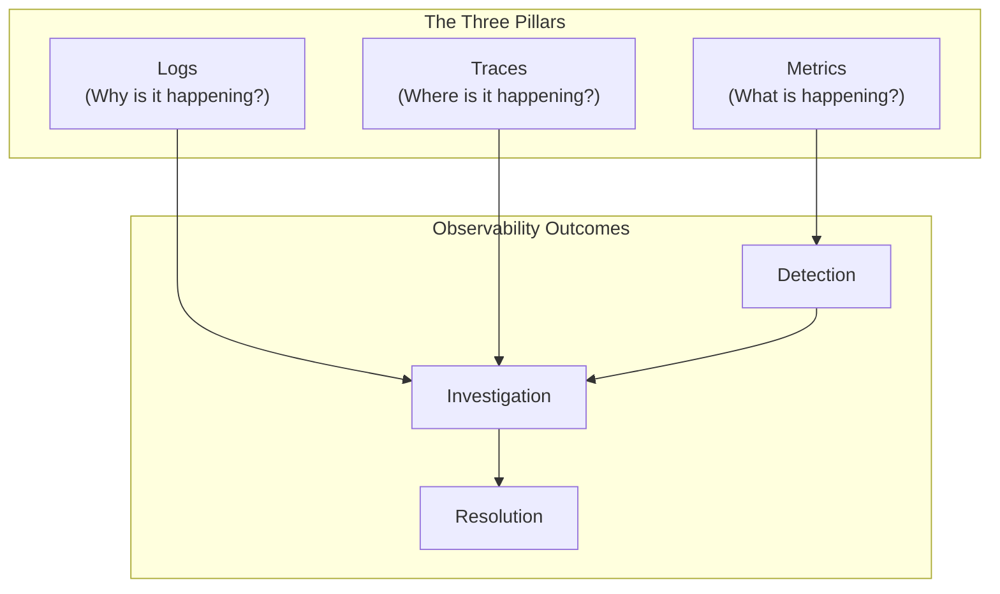
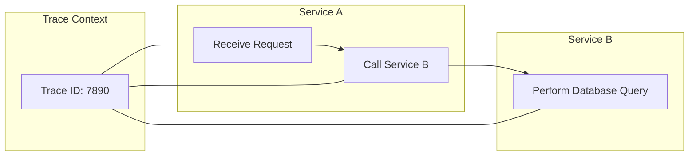
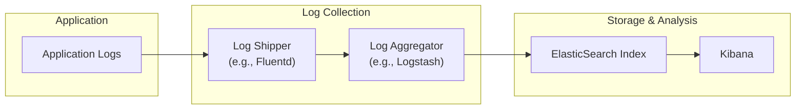
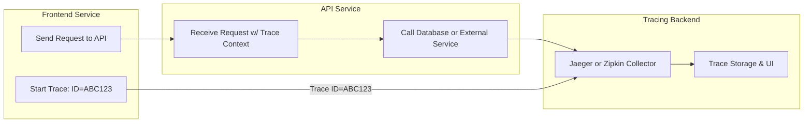
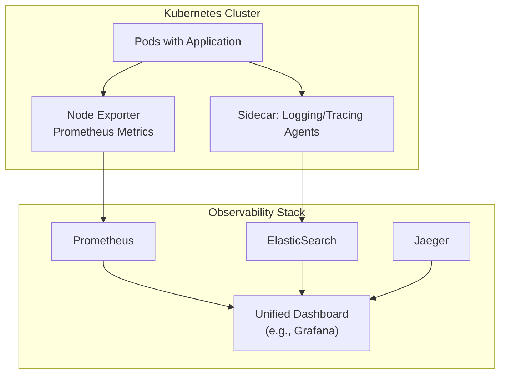

# SRE Day 1 Core Quiz Questions

Below is a set of 20 quiz questions  . They span beginner, intermediate, and advanced (SRE) levels, with multiple choice, true/false, fill-in-the-blank, matching, ordering, and diagram-based formats. Each question is labeled with its difficulty and topic, and incorporates practical observability scenarios and tools.

---

## 1. [Observability Overview]
🔍 Beginner | Multiple Choice | Diagram-Based

Examine the following basic overview of observability pillars and outcomes:

Which statement best describes the roles of these pillars in a typical SRE workflow?

A. Metrics show root-cause details, logs provide usage trends, and traces reveal system capacity  
B. Metrics highlight system status, logs help diagnose causes, and traces pinpoint path details  
C. Only logs and traces matter for detection, while metrics are rarely useful  
D. Traces always handle large-scale capacity planning, while metrics track debug messages  

---

## 2. [Metrics Fundamentals]
🔍 Beginner | Multiple Choice

Which of the following statements about **metrics** in an observability context is most accurate?

A. They are always stored as raw text lines without any aggregation  
B. They typically represent numeric measurements over time, such as CPU usage or request counts  
C. They are only meaningful for on-premise environments and cannot be used in cloud settings  
D. They cannot be used to set alerts or thresholds for SRE teams  

---

## 3. [Logs vs. Metrics]
🔍 Beginner | Multiple Choice

An SRE notices a spike in **error rates** for a microservice running in a Kubernetes cluster. Which pillar of observability most directly helps them identify **why** the errors are occurring?

A. Metrics  
B. Logs  
C. Synthetic checks  
D. Dashboards  

---

## 4. [Distributed Traces]
🔍 Beginner | Multiple Choice | Diagram-Based

Consider the partial distributed tracing flow for a request through two microservices:

In this scenario, which statement best explains the purpose of **Trace ID**?

A. It is used to group all logs from the same container  
B. It uniquely identifies the network route between two hosts  
C. It links related operations across services into a single end-to-end transaction view  
D. It triggers an autoscaling event whenever the ID repeats  

---

## 5. [Monitoring vs. Observability]
🔍 Beginner | True/False

Monitoring alone can fully replace the need for logs and traces when diagnosing complex, multi-service issues in production.

A. True  
B. False  

---

## 6. [Metrics Collection]
🔍 Beginner | Fill-in-the-Blank

Complete the following statement:

“In a typical Prometheus setup, the server ________ the `/metrics` endpoints of target services at defined intervals to collect numeric data.”

A. Pushes  
B. Scrapes  
C. Logs  
D. Overwrites  

---

## 7. [Logs & Formats]
🔍 Beginner | Matching

Match each **logging approach** in Column A with its main characteristic or advantage in Column B.

**Column A:**
1. Structured Logging  
2. Unstructured Logging  
3. Log Sampling  
4. Log Shippers (e.g., Filebeat)

**Column B:**
A. Outputs text without a fixed field format, making automatic parsing more difficult  
B. Reduces logging overhead by forwarding only a subset of messages under heavy load  
C. Emits key-value pairs or JSON to simplify searching and filtering  
D. Collects log files from an application and sends them to a centralized system  

---

## 8. [Metrics Types]
🧩 Intermediate | Multiple Choice

A metric that **only increases** (never decreases) over time, often used to track the number of requests served, is typically called:

A. Gauge  
B. Counter  
C. Histogram  
D. Duration  

---

## 9. [Log Processing Pipelines]
🧩 Intermediate | Multiple Choice

Which of the following best describes how a **centralized log processing pipeline** (e.g., ELK Stack) might help an SRE during an incident?

A. It ensures all logs are deleted after a fixed time to save storage space  
B. It disallows any form of indexing or searching to keep data hidden  
C. It aggregates logs from multiple services in one place, allowing easier filtering and correlation  
D. It guarantees full transaction traces without needing any instrumentation  

---

## 10. [SRE Alerting Basics]
🧩 Intermediate | True/False

A properly tuned **RED** (Rate, Errors, Duration) metrics dashboard can provide early warnings of service degradation before customers notice issues.

A. True  
B. False  

---

## 11. [Tracing Context Propagation]
🧩 Intermediate | Fill-in-the-Blank

Complete the following statement:

“When implementing distributed tracing in a microservices environment, each service must properly forward the ________ headers to allow trace continuity across calls.”

A. Configuration  
B. Billing  
C. Trace Context  
D. Authorization  

---

## 12. [Metrics vs. Logs Matching]
🧩 Intermediate | Matching

Match each **observability pillar** in Column A with the most **common usage** in Column B.

**Column A:**
1. Metrics  
2. Logs  

**Column B:**

A. Storing structured or unstructured text entries that record specific events  
B. Representing numerical time-series data that can be aggregated and alerted on  

*(Use each letter only once, for a total of 2 matches.)*

---

## 13. [Logs Pipeline Flow]
🧩 Intermediate | Multiple Choice | Diagram-Based

Examine the simplified log processing pipeline:

Which statement best describes this workflow?

A. The logs are automatically converted to metrics and sent to Prometheus  
B. The application receives logs from Elasticsearch and stores them on disk  
C. The log shipper and aggregator parse and enrich log data before indexing it  
D. Kibana directly ships logs to the aggregator for real-time ingestion  

---

## 14. [RED Method Steps]
🧩 Intermediate | Ordering

Arrange the following steps to implement the **RED method** for an SRE team:

A. Configure dashboards showing request rate, error counts, and response times  
B. Define thresholds for acceptable error rates and latencies  
C. Identify key endpoints or microservices to monitor  
D. Set up alerts that trigger when thresholds are exceeded  

---

## 15. [Advanced Metrics Visualization]
💡 Advanced/SRE | Multiple Choice

Which approach is typically **most** effective for analyzing high-cardinality metrics (e.g., per-customer or per-session data) in a large-scale AWS environment?

A. Storing raw high-cardinality metrics locally on each instance with no central aggregator  
B. Using a specialized metrics platform like Prometheus with dimensional labeling and carefully set retention  
C. Converting all metrics to logs and using a generic text search tool  
D. Avoiding any kind of metric collection to reduce overhead  

---

## 16. [Sampling Strategies]
💡 Advanced/SRE | True/False

**Statement**: In distributed tracing, using a 100% trace sampling rate is always the best practice for large-scale production environments.

A. True  
B. False  

---

## 17. [Horror Story Lessons]
💡 Advanced/SRE | Fill-in-the-Blank

Complete the following statement:

“One common ‘horror story’ is when logs grow faster than expected, leading to ________ of the logging system and causing missed or delayed entries.”

A. Over-provisioning  
B. Saturation  
C. Encryption  
D. Rotation  

---

## 18. [Distributed Tracing Architecture]
💡 Advanced/SRE | Multiple Choice | Diagram-Based

Consider the advanced tracing architecture:

Which statement best captures the purpose of the **Tracing Backend** in this setup?

A. It auto-corrects buggy code in the API service  
B. It aggregates and visualizes trace spans for end-to-end request insights  
C. It blocks network calls until the backend approves each step  
D. It replaces logs entirely by storing only performance metrics  

---

## 19. [Logs to SLO Enforcement]
💡 Advanced/SRE | Ordering

You’re implementing a process to **convert log-based data** into actionable **Service Level Objectives (SLOs)**. Arrange these steps in logical order:

A. Determine acceptable error and latency thresholds to define the SLO  
B. Collect structured logs with relevant response codes and timestamps  
C. Visualize SLO compliance in a dedicated dashboard  
D. Extract metrics from logs (e.g., parse response codes and durations)  

---

## 20. [Unified Observability Diagram]
💡 Advanced/SRE | Multiple Choice | Diagram-Based

Observe this high-level architecture for unifying **metrics, logs, and traces** in a Kubernetes environment:

Which statement **best** describes this unified approach?

A. The application pods send all data directly to Grafana without intermediate storage  
B. Logs, metrics, and traces are collected via sidecars or exporters and sent to specialized backends, then visualized in a central dashboard  
C. Prometheus forcibly converts logs and traces into numeric metrics so that Jaeger is unnecessary  
D. Elasticsearch automatically deploys new sidecar pods whenever CPU usage spikes  

---

**End of Day 1 SRE Observability Quiz**