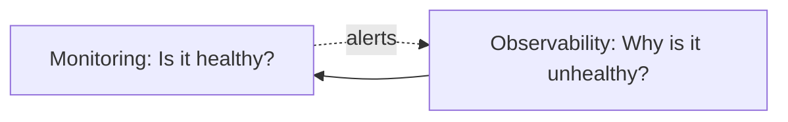
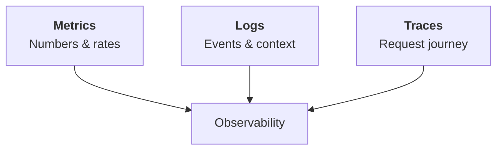
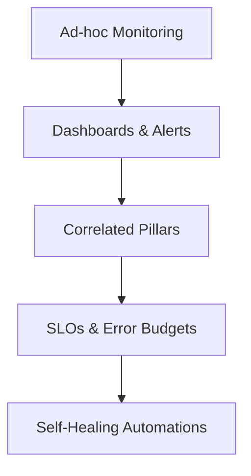
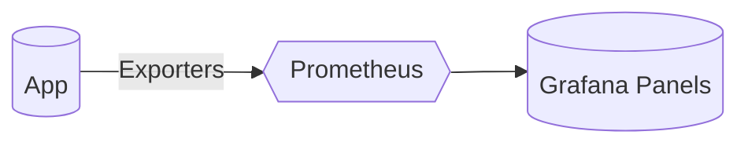
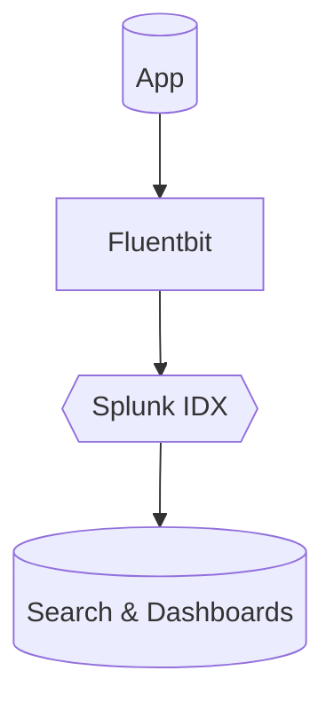
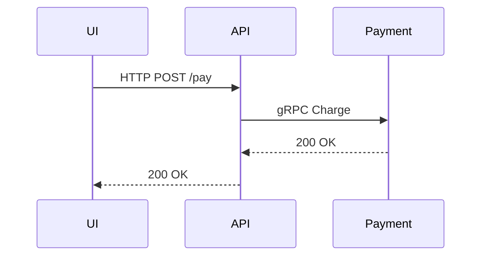
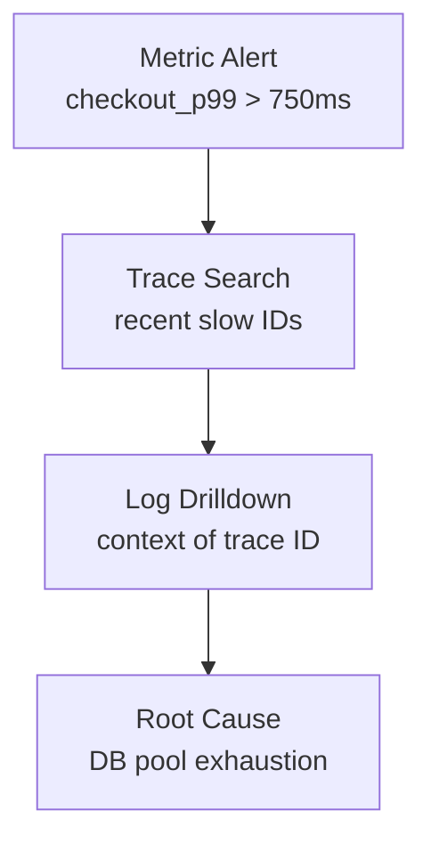
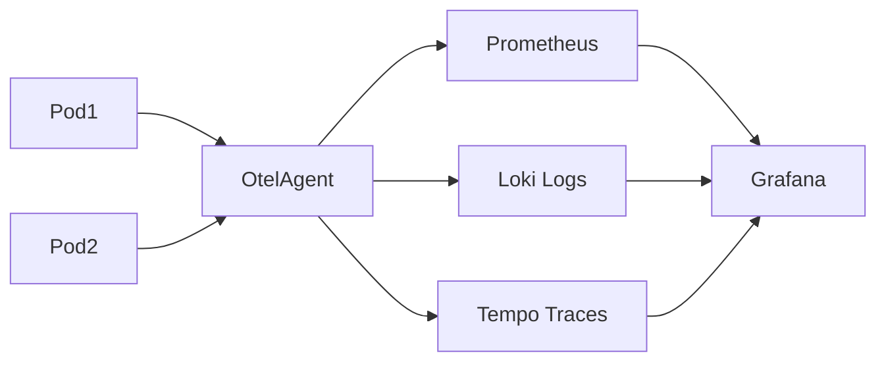

# Day 1 Training Module — **Foundations of Observability** 
---

## 1. Introduction: Observability Foundations  

### Welcome  
> *“If you can’t **see** the system clearly, you can’t **save** it quickly.”*  

Today we begin the journey from traditional **monitoring** to holistic **observability**. You already watch dashboards in Geneos, Splunk, Dynatrace, and Datadog; now we’ll learn to **connect the dots** so numbers, logs, and traces tell one coherent story.

### The O‑T‑E‑A Loop  
| Phase | What you do | Typical Tooling |
|-------|-------------|-----------------|
| **O**bserve | Collect signals (metrics / logs / traces) | Prometheus, Geneos agents |
| **T**est (Question) | Form a hypothesis | Kibana, Grafana Explore |
| **E**valuate | Correlate & confirm | Splunk SPL, Datadog Notebooks |
| **A**ct | Remediate / automate | CI/CD, Runbooks, ArgoCD |

### Monitoring ≠ Observability  
Monitoring asks **“Is it up?”**; observability asks **“*Why* is it misbehaving?”** Both are essential: monitoring raises the flag, observability guides the fix.

### The Three Pillars at a Glance  

### From Monitoring to Mature Observability  

**Learning Objectives**  
- **Beginner 🔍** Describe each pillar and when to use it.  
- **Intermediate 🧩** Correlate pillars to validate hypotheses.  
- **Advanced/SRE 💡** Design scalable pipelines and SLO‑driven alerts.

*(YouTube intro placeholder → **{{VIDEO_LINK_INTRO}}**)*  

---

## 2. Metrics — The Quantitative View  

### 🔍 Beginner  
**Analogy:** A car dashboard: speedometer (gauge), odometer (counter), 0‑60 timer (histogram).  

| Metric Type | Definition | Real Example in Geneos |
|-------------|------------|------------------------|
| **Counter** | Monotonic, only up | `payments_total` |
| **Gauge** | Up & down | JVM heap used |
| **Histogram** | Bucketed distribution | API latency buckets |

### 🧩 Intermediate  
*RED & USE methods*  
- **RED:** *Rate*, *Errors*, *Duration* — ideal for **user‑facing** services.  
- **USE:** *Utilization*, *Saturation*, *Errors* — ideal for **infrastructure**.  

**Naming & Cardinality Tips**  
`service:operation:latency_seconds_bucket{le="0.5"}` — keep labels low‑cardinality!

### 💡 Advanced/SRE  
- Alert **on burn rate**, not raw errors.  
- Shard Prometheus or use Cortex/Thanos for >10 million time‑series.

#### Horror Story (#1 — Metrics Saved the Day)  
A silent drop in checkout success reached only 0.5 % error‑rate — below legacy Geneos alert. A **histogram SLO alert** fired in Prometheus, pointing to elevated p95 latency in `charge-card`. Quick rollback saved \$40 k revenue in 12 min.

**Interview Questions**  
1. When would you choose a **Summary** over a **Histogram**?  
2. Explain how you’d alert on a 4‑hour error‑budget burn within 1 hour.  

*(Metrics deep‑dive video → **{{VIDEO_LINK_METRICS}}**)*  

---

## 3. Logs — The Narrative Thread  

### 🔍 Beginner  
**Analogy:** Ship’s logbook—every event recorded in time order.

**Structured vs Unstructured**  
- JSON, key‑value pairs → **searchable** and **aggregateable**.  
- Free‑text → only good for grep & hope.

### 🧩 Intermediate  
- **Correlation IDs** tie log lines to traces.  
- **Context enrichment** (host, k8s namespace) accelerates triage.  
- **Sampling** high‑volume noisy logs to 10 % cuts cost 80 % with minimal signal loss.

### 💡 Advanced/SRE  
- Build **dynamic parsing rules** (e.g., Splunk TA) to adapt to new log schemas.  
- Hot/warm/cold storage tiers for compliance & cost.

#### Horror Story (#2 — Logs Saved the Day)  
A VSI batch job intermittently deleted invoices. Metrics looked normal. A single **WARN** line buried in 5 GB logs showed `truncate table invoices`. Correlation ID led to mis‑scoped Flyway migration in staging config leaked into prod. Two‑line rollback script, issue resolved, auditors happy.

**Interview Questions**  
1. Why might you **sample** DEBUG logs but not ERROR logs?  
2. Show a SPL query joining Kubernetes labels with application fields.  

*(Logging essentials video → **{{VIDEO_LINK_LOGS}}**)*  

---

## 4. Traces — The Request’s Journey  

### 🔍 Beginner  
**Analogy:** GPS route showing each waypoint (span) of your commute.

- **Span** = single operation, **Trace** = tree of spans, **Context** travels via headers.

### 🧩 Intermediate  
- **Head‑based sampling** (drop early) vs **tail‑based** (decide after latency known).  
- Visualize critical path to chase the *slowest span*.

### 💡 Advanced/SRE  
- **Baggage vs Trace‑Context**: keep baggage ≤ 8 KB or pay the price.  
- Jaeger + OpenTelemetry collector scaling tips: use **kafka** pipeline for >50 k spans/s.

#### Horror Story (#3 — Traces Saved the Day)  
Checkout latency spiked only for AWS eu‑west‑1 customers. A trace heat‑map highlighted a hidden network call from `fraud‑svc` to an on‑prem LDAP over VPN (400 ms). Caching token locally fixed the issue—front‑end latency fell from p95 2 s → 300 ms.

**Interview Questions**  
1. Compare **span attributes** vs **baggage**.  
2. How would you instrument a Kafka consumer without double‑counting latency?  

*(Tracing walkthrough video → **{{VIDEO_LINK_TRACES}}**)*  

---

## 5. Integrating the Three Pillars  

**Correlation Patterns**  
1. **Start with metric alert** → retrieve trace IDs with high latency.  
2. Use trace ID to **filter logs** for context.  
3. Confirm fix by watching metric drop and trace durations shrink.

**Ref Architecture (Kubernetes)**  

#### Horror Story (#4 — Integrated Pillars Win)  
A Dynatrace alert flagged CPU on `quote‑svc`. Traces showed normal latency, but linked logs revealed bursty GC. Heap histogram metric confirmed leak. Hotfix rolled out; incident closed before pager hit level‑2.

**Interview Questions**  
1. Describe an **exemplars** workflow—metrics label pointing to trace.  
2. How would you migrate from Geneos monosilos to this architecture gradually?  

*(Integration demo video → **{{VIDEO_LINK_INTEGRATION}}**)*  

---

## 6. Knowledge Check & Wrap‑Up  

### Quick Quiz (self‑graded)  
1. **🔍** Name the three metric types and give one example each.  
2. **🧩** Which method—RED or USE—fits **database CPU saturation**? Why?  
3. **💡** How can tail‑based sampling improve *outlier* detection?  
4. **🔍** Structured log advantage over plain text?  
5. **🧩** What header carries trace context in W3C spec?  
6. **💡** Explain *burn‑rate* alerting in one sentence.  

*(Answer key in the facilitator’s guide.)*

### Today’s Takeaways  
- Observability **augments** monitoring—keep both.  
- Metrics tell **what**, logs tell **when/where**, traces tell **why/how**.  
- Correlating pillars shortens MTTR dramatically.  
- Start capturing **standard IDs** (trace_id) now; it pays off later.  

### Coming Up  
| Day | Focus |
|-----|-------|
| **Day 2** | SLOs & Error Budgets — metrics into promises |
| **Day 3** | Instrumentation Deep‑Dive — OpenTelemetry hands‑on |

### Recommended Resources  
- *Observability Engineering* (O’Reilly) chapters 1‑3  
- CNCF OpenTelemetry Workshop (YouTube)  
- Honeycomb’s *Guides to High‑Cardinality* blog series  

---

*End of Day 1 module — see you tomorrow!*  

---

