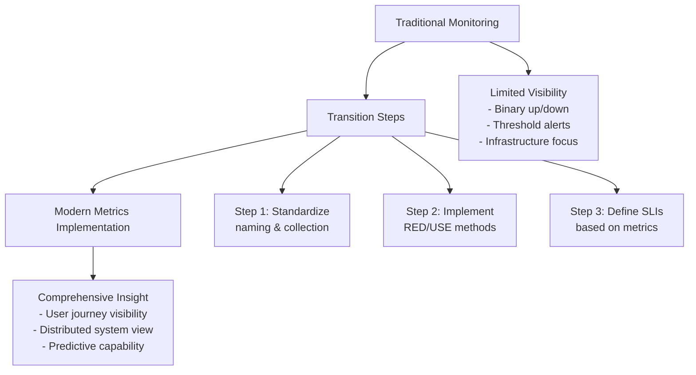
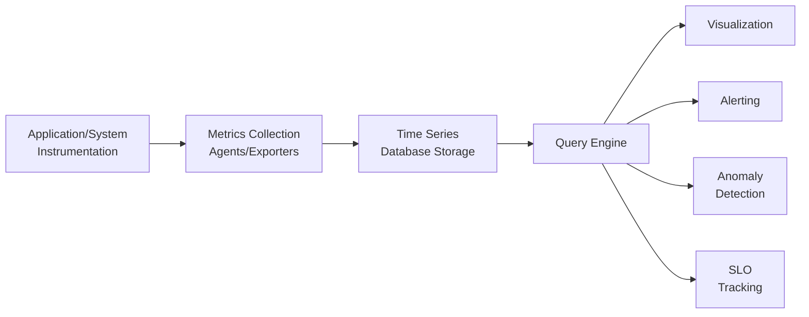

# Foundations of Observability: Metrics

## Introduction

In the world of production support, metrics have long been our system's vital signs - but for the aspiring SRE, they must become something more profound. Think of traditional monitoring metrics as watching the speedometer and fuel gauge of a vehicle. They tell you if you're moving too fast or about to run out of gas, but little else about the journey ahead or what's happening under the hood.

Modern metrics in observability are more like a neural network spreading throughout your entire system. They don't just report status; they reveal patterns, predict failures, expose hidden relationships, and answer questions you haven't even thought to ask yet. This neural network doesn't just wait for threshold breaches - it continuously transmits signals that, when properly interpreted, tell rich stories about your system's health and behavior.

Where production support traditionally interacts with metrics reactively ("the disk is 90% full, time to add space"), SRE roles leverage metrics proactively to understand system behaviors, establish normal baselines, define service objectives, and make data-driven decisions about everything from scaling to feature releases. The difference is moving from "Is it broken?" to "How is it performing, and how will it perform tomorrow?"

This transformation follows the OTEA framework: we Observe comprehensive metrics from all system levels, Test hypotheses about performance and reliability, Evaluate against service level objectives, and Act based on data rather than hunches. This is the evolution of metrics from alarms to insights.

## Learning Objectives

### Beginner Objectives
1. Distinguish between the four primary metric types (counters, gauges, histograms, summaries) and identify appropriate use cases for each
2. Explain how metrics-based observability differs from traditional threshold-based monitoring
3. Identify key metrics that bridge infrastructure health to application performance and user experience

### Intermediate Objectives
1. Implement the RED method (Rate, Errors, Duration) for service monitoring and the USE method (Utilization, Saturation, Errors) for resource monitoring
2. Design metrics collection that enables correlation across system components
3. Develop dashboards that reveal service dependencies and potential bottlenecks before they cause outages

### Advanced/SRE Objectives
1. Design metrics pipelines that scale efficiently with cardinality management and appropriate retention policies
2. Establish SLIs and SLOs using metrics data that meaningfully represent user experience
3. Architect metrics collection strategies that balance observability needs against performance overhead

## Incident Narrative: The Mysterious Monday Slowdown

Every Monday morning for three weeks, the customer support team reported the same issue: the order processing system slowed dramatically between 9-10 AM. The traditional monitoring dashboard showed all systems "green" - CPU below 70%, memory under threshold, disk space sufficient, and no network saturation.

The production support team spent hours each Monday checking logs, restarting services, and eventually just waiting for the problem to resolve itself. With limited visibility, they could only confirm "something is slow" without understanding why. Management was growing frustrated with the lack of resolution.

When the team implemented proper metrics observability, the picture changed dramatically. They added histograms for API response times, broken down by endpoint and operation type. They implemented custom metrics for database queries and external service calls. Instead of simple threshold monitoring, they tracked rates of change and percentiles.

The next Monday, their new metrics revealed the truth: batch reports scheduled for 8 AM were causing database query latency to spike specifically on queries from the order processing service. While overall database CPU looked normal, the 95th percentile query time for order processing had increased 400%. This combination of metrics - invisible in the traditional setup - immediately pinpointed the exact database contention issue, which was resolved with query optimization and job rescheduling.

What had been a multi-week mystery was diagnosed in minutes with proper metrics, demonstrating the difference between "Is the system down?" and "How is the system performing?"

## Core Concepts By Expertise Tier

### Beginner Level

**Definition and Types of Metrics**

Metrics are numerical measurements collected at regular intervals that represent the state or behavior of a system. Unlike logs that capture discrete events, metrics track values over time to reveal patterns and trends.

The four fundamental metric types include:

- **Counters**: Monotonically increasing values that track occurrences (requests, errors, completions)
- **Gauges**: Point-in-time measurements that can increase or decrease (memory usage, connection count)
- **Histograms**: Distribution of values across configurable buckets (request durations, sizes)
- **Summaries**: Similar to histograms but calculate percentiles directly

Traditional monitoring relied primarily on gauges (current values) with thresholds, while modern observability leverages all types with focus on rates and distributions.

**How Metrics Differ from Traditional Monitoring Data**

Traditional monitoring typically focuses on:
- Infrastructure health (CPU, memory, disk)
- Binary state (up/down)
- Threshold violations
- Point-in-time values

Observability metrics expand to include:
- Application-level indicators
- Request flow and user journeys
- Statistical distributions and trends
- Correlations between components

**Key Terminology Comparison**

| Traditional Monitoring Term | Modern Observability Term | What Changed |
|----------------------------|---------------------------|-------------|
| Alert threshold | Service Level Indicator (SLI) | From arbitrary numbers to meaningful targets |
| Uptime | Availability SLO | From server focus to service focus |
| Response time | Latency histogram | From averages to distributions |
| Error count | Error rate/ratio | From absolutes to proportions |

**Fundamental Use Cases**

Metrics in observability particularly improve production support workflows by:
- Providing early warning signs before issues impact users
- Enabling more precise isolation of problems across service boundaries
- Quantifying impact and improvement after changes
- Establishing baselines for "normal" behavior to detect anomalies

### Intermediate Level

**Best Practices for Metrics Implementation**

Effective metrics implementations follow several principles:
- Consistent naming conventions across services
- Standardized labels/tags for better querying
- Appropriate granularity without excessive cardinality
- Retention policies aligned with usage patterns

The most valuable metrics focus on the **Four Golden Signals**:
1. Latency - How long requests take
2. Traffic - How many requests occur
3. Errors - How many requests fail
4. Saturation - How "full" your system is

**Common Patterns and Methodologies**

The RED Method (commonly used for services):
- **R**ate: Requests per second
- **E**rror rate: Failed requests per second
- **D**uration: Distribution of request times

The USE Method (commonly used for resources):
- **U**tilization: Percentage of resource used
- **S**aturation: Extent of work queued
- **E**rrors: Error events for the resource

These methods provide structured approaches to metric collection that answer the most important operational questions.

**Integration with Other Observability Pillars**

Metrics work best when integrated with other observability pillars:
- Use metrics to detect issues (what's happening)
- Use logs to understand details (why it's happening)
- Use traces to follow request flow (where it's happening)

Effective integration requires consistent correlation identifiers across all three pillars.

**How Metrics Enable Proactive Operations**

With properly implemented metrics, operations becomes proactive through:
- Trend analysis revealing degradation before failure
- Capacity planning based on growth patterns
- Anomaly detection highlighting unusual patterns
- Comparative analysis before/after changes

### Advanced/SRE Level

**Design Considerations for Scale and Reliability**

As systems grow, metrics systems face challenges:
- Cardinality explosion from too many label combinations
- Retention vs. performance tradeoffs
- Query performance at scale
- High availability of the metrics pipeline itself

Solutions include:
- Streaming aggregation near the source
- Hierarchical storage (hot/warm/cold)
- Sampling strategies for high-volume endpoints
- Federation and sharding for large-scale deployments

**Performance Impacts and Optimization**

Metrics collection itself can impact the systems being measured:
- Instrumentation overhead must be measured and optimized
- Push vs. pull collection models have different scaling characteristics
- Data point frequency should align with metric volatility
- Batch processing may help reduce network overhead

**Advanced Troubleshooting Techniques**

SRE-level metrics analysis includes:
- Correlation analysis across multiple metrics
- Rate-of-change analysis to detect accelerating issues
- Statistical anomaly detection beyond simple thresholds
- Comparative profiling across time periods, regions, or deployments

**SLO/SLI Integration with Metrics**

Metrics form the foundation of SLOs through:
- Defining appropriate SLIs that reflect user experience
- Establishing error budgets based on historical performance
- Burn rate calculations showing budget consumption
- Multi-window, multi-signal alert policies

**Cultural and Organizational Strategies**

Implementing advanced metrics requires cultural changes:
- Shared ownership of instrumenting code
- Agreements on standardization across teams
- Balancing operational visibility against development velocity
- Data-driven discussions about reliability targets

## Visual Representations

### CORE DIAGRAM: EVOLUTION FROM MONITORING TO METRICS



### SUPPORTING DIAGRAM: METRICS IMPLEMENTATION FLOW



## Implementation Comparison Table

| Approach | Production Support Context | SRE Context | Key Transition Insights |
|----------|----------------------------|-------------|-------------------------|
| Basic Monitoring | Reactive alerting when CPU > 90% | Proactive tracking of CPU saturation trends | Focus on leading indicators (queue depth) over lagging ones (CPU) |
| Custom Integration | Prometheus scraping endpoints in each environment separately | Unified Prometheus federation with consistent labels | Standardized collection enables cross-service correlation and reduces duplication |
| Cross-Team Visibility | Database team has DB metrics, App team has app metrics | Service-oriented dashboards showing request flow through all components | Building end-to-end visibility reveals bottlenecks at system boundaries |
| Alert Configuration | Alert on any error spike | Alert on SLO budget consumption rates | Differentiate between systemic issues and acceptable transient errors |

## Common Pitfalls and Misconceptions

| Level | Common Production Support Approach | SRE Best Practice | Why It Matters |
|-------|-------------------------------------|------------------|----------------|
| Beginner | Focusing only on infrastructure metrics (CPU, memory, disk) | Including application-level metrics (requests, latency, errors) | Connects infrastructure problems to actual user experience impact |
| Beginner | Using averages for everything | Using percentiles for latency and other distributions | Averages hide problems affecting subsets of users |
| Intermediate | Creating separate dashboards per component | Building service-oriented views that follow request flow | Reveals cross-service dependencies and prevents finger-pointing |
| Intermediate | Measuring everything possible | Measuring what's meaningful for user experience | Reduces noise and focuses on what truly matters |
| Advanced/SRE | Alert on all deviations from normal | Alert on SLO threats with appropriate urgency | Reduces alert fatigue and prioritizes user-impacting issues |
| Advanced/SRE | Adding high-cardinality dimensions to metrics | Carefully managing cardinality with strategic labels | Prevents metrics explosion and performance issues |

## Reflection Questions

**Beginner Level Question:**
How does tracking the 95th percentile of API response time change your understanding of system performance compared to tracking the average response time? When might this difference lead to completely different troubleshooting approaches?

**Intermediate Level Question:**
If you had to reduce your entire metrics collection to just three metrics that would give you the most insight into system health, what would they be and why? How would these differ from what you currently monitor in production support?

**Advanced/SRE Level Question:**
How might your approach to metrics collection and alert design change if you were required to maintain 99.9% availability but could only page on-call engineers a maximum of twice per month? What tradeoffs would you make?

## Practical Application

**Exercise: Production Support to SRE Metrics Transformation**

Choose one application or service you currently support and:

1. Identify the three most common issues that cause production incidents
2. For each issue, document:
   - What metrics you currently use to detect the problem
   - What additional metrics would provide earlier warning
   - How you would quantify the user impact of this issue

3. Create a simple dashboard design (sketch is fine) that would show:
   - The current health of the system
   - Early warning indicators for these common issues
   - User impact measurements

4. Implement a basic RED method for this service by:
   - Identifying (or creating) Request Rate metrics
   - Identifying (or creating) Error Rate metrics
   - Identifying (or creating) Duration metrics
   - Setting up collection if possible, otherwise documenting what you would need

This exercise bridges current production support knowledge with SRE observability practices in a practical, immediately applicable way.

## Python Implementation Example

Here's a basic example of instrumenting a Python web application with Prometheus metrics:

```python
from flask import Flask, request
from prometheus_client import Counter, Histogram, generate_latest, CONTENT_TYPE_LATEST
import time

app = Flask(__name__)

# Define metrics - following RED method
REQUEST_COUNT = Counter(
    'app_request_count', 
    'Total request count of the application',
    ['endpoint', 'method', 'status']
)

REQUEST_LATENCY = Histogram(
    'app_request_latency_seconds',
    'Request latency in seconds',
    ['endpoint'],
    buckets=[0.01, 0.025, 0.05, 0.1, 0.25, 0.5, 1, 2.5, 5, 10]
)

# Production support might only track if the endpoint is accessible
# SRE approach tracks count, status, and latency distribution
@app.route('/api/v1/users')
def get_users():
    start_time = time.time()
    
    # Application logic here
    # ...
    
    # Simulate processing time
    time.sleep(0.05)
    
    status_code = 200
    
    # Record metrics - notice both count AND latency
    REQUEST_COUNT.labels(
        endpoint='/api/v1/users', 
        method='GET', 
        status=status_code
    ).inc()
    
    REQUEST_LATENCY.labels(
        endpoint='/api/v1/users'
    ).observe(time.time() - start_time)
    
    return {"users": ["user1", "user2"]}, status_code

# Expose metrics endpoint for Prometheus scraping
@app.route('/metrics')
def metrics():
    return generate_latest(), 200, {'Content-Type': CONTENT_TYPE_LATEST}

if __name__ == '__main__':
    app.run(host='0.0.0.0', port=8000)
```

This example illustrates several key SRE practices:
- Using standardized metric types (Counter, Histogram)
- Following the RED Method
- Recording both request count AND latency distribution
- Using meaningful labels for better analysis
- Exposing metrics for collection

Production support teams might only check if the endpoint returns 200, while an SRE approach provides rich data about performance characteristics and trends over time.