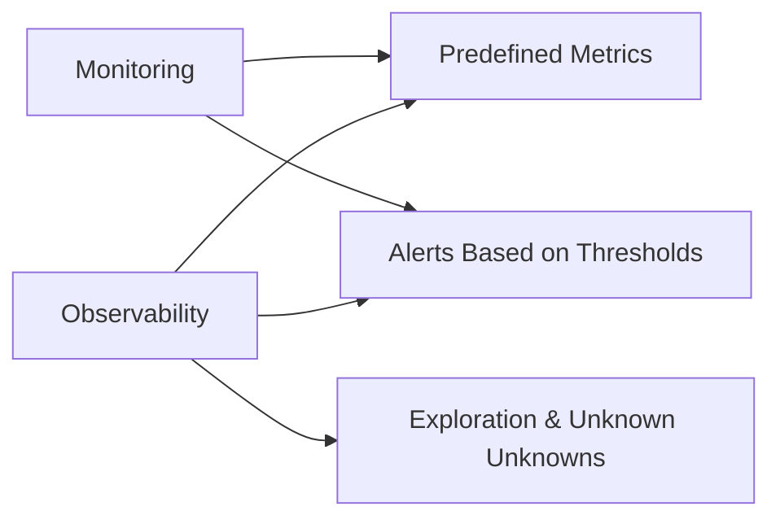
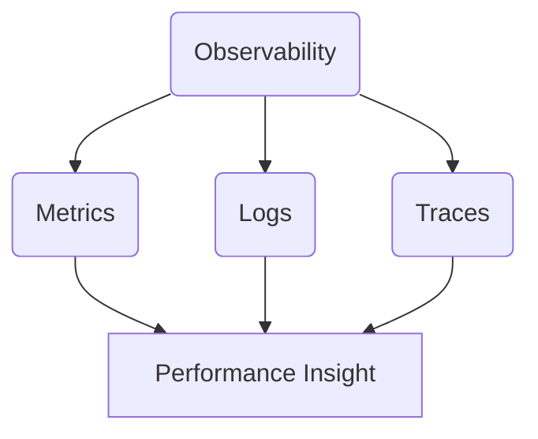
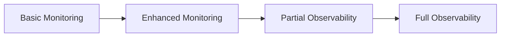

## 🔧 Let’s Build Out: **🧱 Day 1 — Intro to Observability & SRE**

**Character:** Hector — The Veteran SRE  
**Style:** Gruff, been paged too many times, teaches using systems, scars, and diagrams  
**Vibe:** “Let me tell you how this broke *last* time.”

---

# 🧠 Day 1: Foundations of Observability

### 👤 **Character Intro: Hector – Mexico City**
> “People think observability is about tools. It’s not. It’s about seeing clearly in chaos.  
> I don’t chase issues—I wait for the system to confess.”

---

## 🎯 Learning Objectives

### 🔍 Beginner
- Understand the 3 Pillars of Observability: Metrics, Logs, Traces
- Differentiate Monitoring vs Observability

### 🧩 Intermediate
- Learn how unknown unknowns are detected through observability
- Understand signal fidelity and the power of triangulation

### 💡 SRE-Level
- Model observability maturity
- Design a basic architecture for integrated signals

---

## 💥 Incident Hook: “The One Where Everything Looked Fine”

> “One day, the order API crashed… but every graph looked green.  
> We had alerts, logs, and dashboards—and *no clue what was happening*.  
> Took us 6 hours. What did we learn? You can’t monitor what you don’t understand.”

---

## 🔍 Core Concepts

### 🔹 Observability vs Monitoring

📝 **Monitoring** = Alert on what you know  
🧠 **Observability** = Ask *new* questions when things break

---

### 🔹 The 3 Pillars of Observability

- **Metrics** = Quantitative snapshots over time
- **Logs** = Discrete events or messages
- **Traces** = Request journey through systems

🗨️ *“Metrics say ‘something’s wrong’. Logs say ‘what happened’. Traces say ‘where it broke’.”*

---

### 🔹 Maturity Model: From Nagios to Nirvana

📌 Full observability = consistent signal collection, ID propagation, cross-pillar correlation

---

## 🧰 Tools You Might Use
(no install required—descriptive only)
- Prometheus: Metrics collection  
- Fluentbit: Log forwarding  
- Jaeger: Distributed tracing  
- Grafana: Unified dashboards  
- Splunk, Datadog, Dynatrace: Commercial platforms

🛑 These are **examples**, not prerequisites.

---

## 🔬 Exercises (Simulation Mode)

### Scenario:
You are handed 3 screenshots:
1. CPU graph: Normal
2. Log sample: `200 OK` for all requests
3. Trace: Missing spans between frontend and auth service

📌 **Question:** Which pillar is lying? What’s likely happening?  
📌 **Bonus:** What would you add to improve signal fidelity?

---

## 💀 Common Pitfalls

- Thinking logs alone will explain latency  
- Monitoring host metrics but not application metrics  
- No correlation IDs → no cross-signal tracing  
- Alerting only on thresholds, not behaviors

---

## 📜 Hector’s Commandments

1. “If it can’t be traced, it’s hiding something.”  
2. “Green dashboards lie.”  
3. “Observability is not a product. It’s a practice.”

---

## 🤝 Handoff to Tomorrow

> “Metrics are your first lens into any system. Tomorrow, Felix will show you how to build real-time signal detectors that don’t just bark—they tell you where to look.”

---

## 📦 Artifacts for Day 1

- ✅ 3 Mermaid diagrams  
- ✅ Tiered learning objectives  
- ✅ Incident scenario  
- ✅ Simulation prompts  
- ✅ Commandments & character voice  
- ✅ Teaser for Day 2

---

Want me to generate the PNG versions from the Mermaid code blocks next (for your Kroki setup)?  
Or go straight into building Day 2 using Felix the metrics snob?

Your system. Your call. I just run the logs.