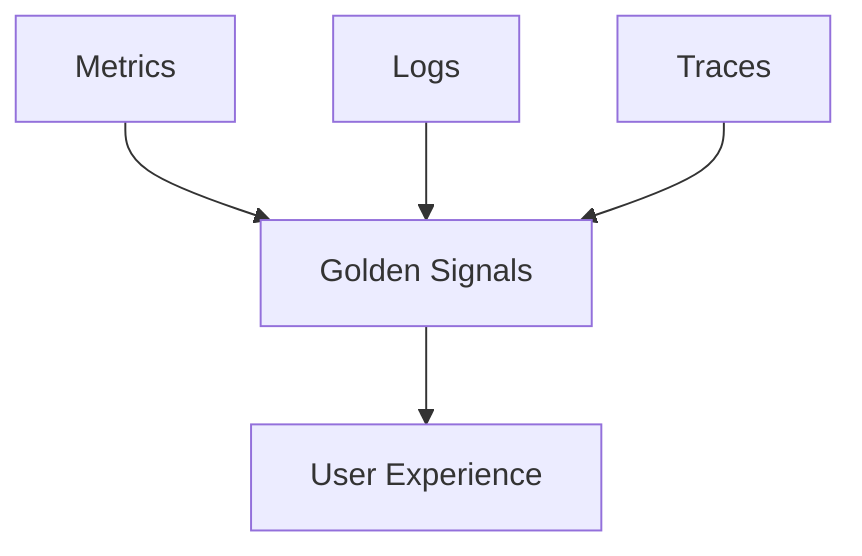
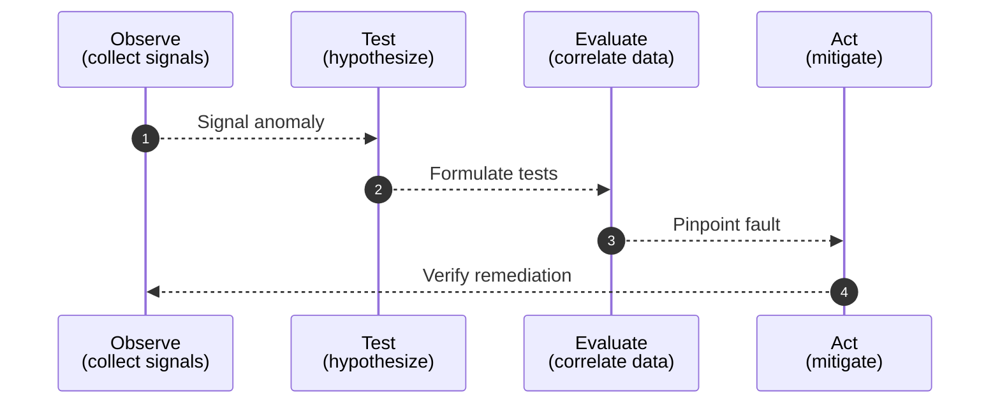
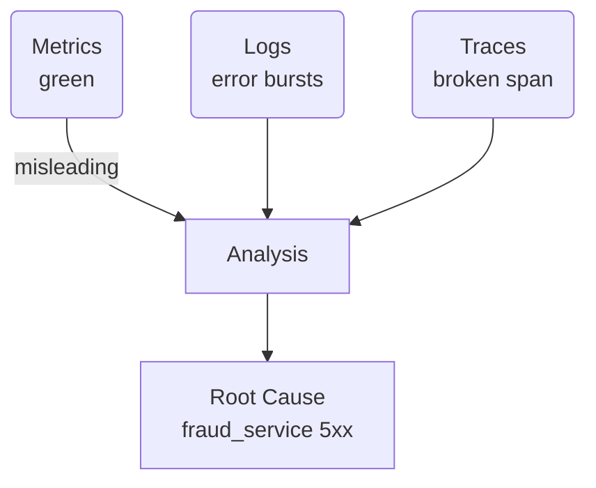

# Day 1 – Foundations of Observability  
*(SRE Core Training Curriculum)* citeturn0file0  

---

## 1  Character Introduction *(Narrator)*  

> **Meet Hector Alvarez – “El Viejo” of Site Reliability**  
> Veteran SRE, Mexico City native, twenty‑plus years of uptime scars. Sardonic grin, coffee‑stained RHEL baseball cap, and an allergy to “pretty dashboards with no soul.”  

**Memorable quote**

> “Monitoring tells you your pulse; observability tells you why your heart’s racing.”  

---

## 2  Real‑World Incident Hook *(Hector’s Voice)*  

“Last summer our payments API *looked* green—CPU 25 %, error rate < 0.1 %. Yet customers from São Paulo to Stockholm were hammering Twitter about declined cards.  
I opened Splunk on my RHEL9 jump‑box, tailed structured logs, and *boom*—a single downstream fraud‑check service was timing out for non‑US BINs. Metrics were too coarse to see the spike; traces weren’t stitched in. Fifty‑seven minutes of reputation damage we’ll never get back. If we’d wired *real* observability—metrics tied to traces tied to logs—we’d have paged the right team in five.”  

*Lesson*: Healthy nodes ≠ happy users. Only correlated signals reveal user pain early.

---

## 3  Learning Objectives *(Narrator)*  

| Level | You will be able to… |
|-------|----------------------|
| 🔍 **Beginner** | Distinguish **monitoring vs. observability**, list the **3 Pillars**. |
| 🧩 **Intermediate** | Apply the **Observe → Test → Evaluate → Act** (OTEA) loop; map signals to user journeys. |
| 💡 **Advanced / SRE** | Sketch a high‑level **observability architecture** and position your org on the **maturity model**. |

---

## 4  Core Concepts *(Mixed Narrator + Hector)*  

### 4.1 Observability vs. Monitoring  
Monitoring = *known‑unknowns* (“alert when CPU > 80 %”).  
Observability = tooling + culture to answer *unknown‑unknowns* without code change.  

### 4.2 The Three Pillars  



### 4.3 Golden Signals  
Latency ⏱  •  Traffic 📈  •  Errors ❌  •  Saturation 🚦  

### 4.4 OTEA Framework  



### 4.5 Maturity Model (0→4)  
0 = Ping checks → 1 = Basic host metrics → 2 = Service metrics & logs → 3 = Distributed tracing → 4 = Auto‑instrumented, business‑level SLIs.

---

## 5  Python Implementation *(Narrator)*  

### 5.1 Baseline Flask App with Metrics & Structured Logging  

```python
# app.py – run on RHEL9
from flask import Flask, jsonify
from prometheus_client import Counter, Histogram, generate_latest
import logging, time, random, os

app = Flask(__name__)

REQUESTS = Counter("http_requests_total", "Total HTTP requests", ["endpoint"])
LATENCY  = Histogram("http_request_latency_seconds", "Latency", ["endpoint"])

logging.basicConfig(
    level=logging.INFO,
    format="%(asctime)s | %(levelname)s | %(name)s | %(message)s",
)

@app.route("/healthz")
def health():
    return "ok", 200

@app.route("/pay")
@LATENCY.labels("/pay").time()
def pay():
    REQUESTS.labels("/pay").inc()
    if random.random() < 0.05:
        logging.error("card_declined", extra={"txn_id": os.urandom(4).hex()})
        return jsonify(status="declined"), 502
    return jsonify(status="approved")

@app.route("/metrics")
def metrics():
    return generate_latest(), 200, {"Content-Type": "text/plain; charset=utf-8"}

if __name__ == "__main__":
    app.run(host="0.0.0.0", port=5000)
```

*Run*: `pip install flask prometheus-client && python app.py`  
*Ship logs*: `python app.py | splunk forwarder …`  

### 5.2 Bonus – Correlating Metrics, Logs & Traces  
Add OpenTelemetry instrumentation (`opentelemetry-instrument flask`) and send spans to Jaeger. Use trace‑ID field to join Splunk logs and Prometheus metrics.

---

## 6  Hands‑On Exercise *(Hector’s Voice)*  

**Scenario** – Three screenshots (share in class):  

1. *Prometheus* shows `http_request_latency_seconds` p95 = 200 ms (green).  
2. *Flask logs* in Splunk reveal bursts of `card_declined`.  
3. *Jaeger trace* shows 50 % of `/pay` spans missing child span `fraud_check`.  

**Task** – Which pillar is lying? Why?  

**Success Criteria**  

- Identify **metrics** as misleading (latency OK but business errors high).  
- Explain correlation path: Logs show errors → traces show missing calls → root cause = downstream fraud‑service outage.  

**Solution Path**  



*(Students document steps; compare to Hector’s walk‑through at session end.)*

---

## 7  Dashboard Fundamentals *(Narrator)*  

| Panel | What to display | Why it matters |
|-------|-----------------|----------------|
| **1 – Latency & Traffic** | p95 latency line + RPS bar | Instant view of load vs. speed |
| **2 – Error Rate** | `http_errors_total / http_requests_total` | Surface user‑visible failure |
| **3 – Saturation** | CPU %, Mem %, queue depth | Capacity forecasting & throttling |

Tie panels with shared **trace‑ID** link‑outs and Splunk deep‑links. Keep *one* color scale per metric to avoid visual noise.

---

## 8  Common Pitfalls *(Hector’s Voice)*  

1. **Graph‑Spam** – “One dashboard per developer.” ✂️ Trim to Golden Signals.  
2. **Unlabeled Metrics** – No `txn_id` or `customer_region` label? Enjoy guessing at 3 AM.  
3. **Silent Sampling** – Tracing 0.1 % of traffic hides 99 % of outliers.  
4. **Ignoring Bash One‑Liners** – `curl -w "%{time_total}"` is still the fastest SLI smoke‑test.  

---

## 9  Hector’s Commandments *(Hector’s Voice)*  

1. **“Logs without context are rumors.”** Log *what* happened *and* *why*.  
2. **“Every alert must map to a user journey.”** Otherwise delete it.  
3. **“If you can’t replay it in Splunk on RHEL9, you didn’t measure it.”**  

---

## 10  Key Takeaways & Handoff *(Narrator)*  

- Observability ≠ stacks of metrics—it’s *correlated insight* that short‑circuits downtime.  
- The **OTEA loop** gives a repeatable method to debug the unknown‑unknowns.  
- Start with a **3‑panel Golden Signal dashboard**; evolve as maturity grows.  

*Tomorrow (Day 2)* you’ll meet **Aanya Patel**, the Incident Commander from Bangalore, and dive into **Incident Response Fundamentals**—alert design, on‑call etiquette, and run‑book automation. Don’t forget Hector’s parting words:  

> “Data’s cheap; insight’s priceless—see you at 0600.”  

---