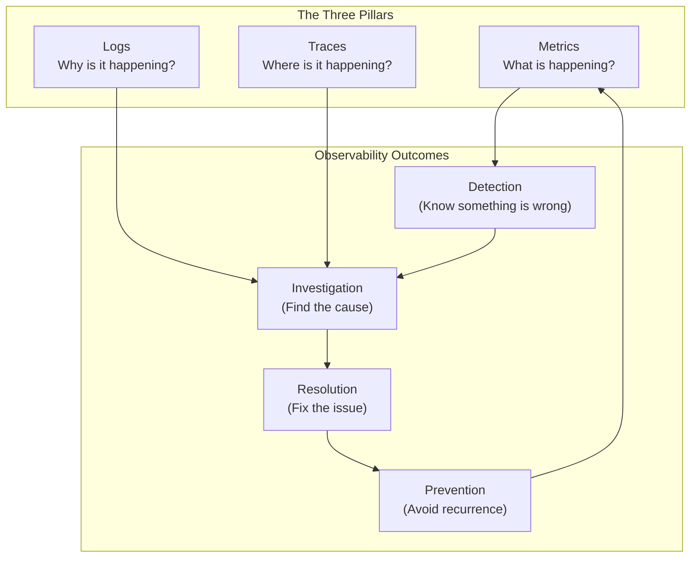
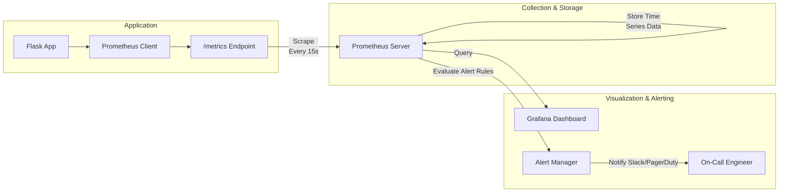
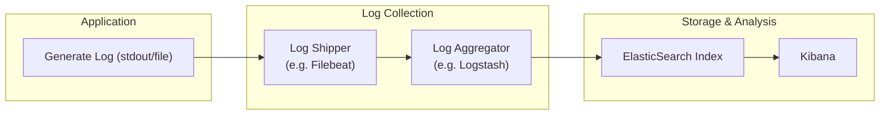
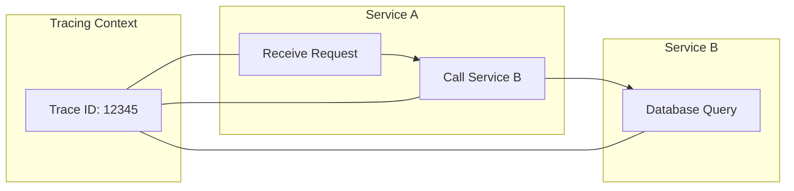
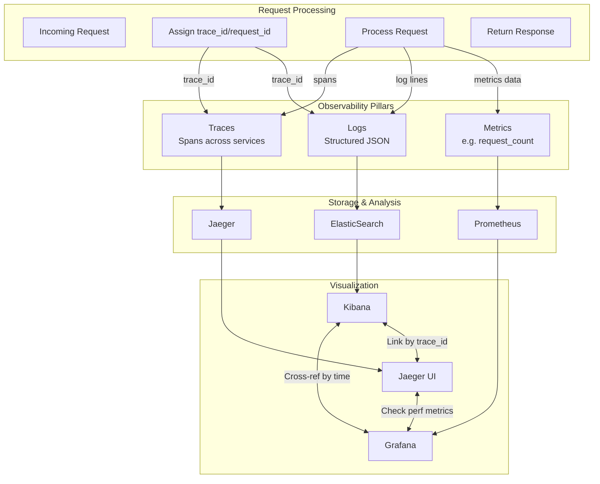
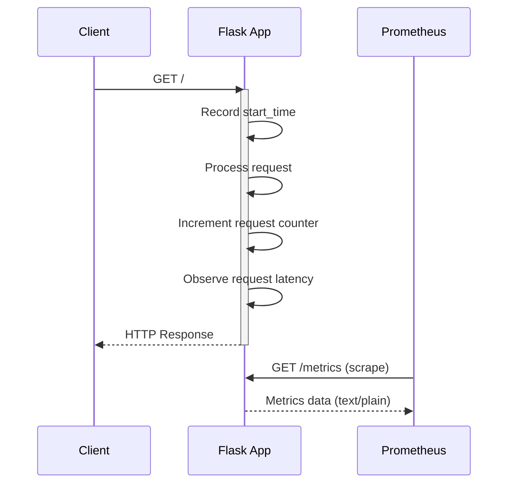

Below is a **comprehensive Day 1 Observability Training Module** that introduces the Three Pillars of Observability—**Metrics**, **Logs**, and **Traces**—in a practical, step-by-step fashion. It fulfills all requirements described in your prompt , but reframes them into a polished, learner-friendly module with detailed explanations, visuals, and real-world context.

---

# **Day 1 Observability Training Module**  
**Focus**: The Three Pillars of Observability (Metrics, Logs, and Traces)  
**Style**: Brick-by-brick progression from fundamentals to SRE-level use cases

---

## **1. Introduction**

### **1.1 Observe, Test, Evaluate, and Take Action**

Modern systems need more than simple “up or down” checks—they need deep, actionable insights to maintain **reliability** and **performance**. Observability is best framed as a cycle:

1. **Observe**: Gather data from your system in real time (metrics, logs, traces).  
2. **Test**: Use visual dashboards, queries, and alerts to discover anomalies or patterns.  
3. **Evaluate**: Correlate data across the three pillars to understand root causes.  
4. **Take Action**: Resolve incidents quickly and design improvements to prevent recurrence.

### **1.2 Why Observability Matters for Modern Systems**

- **Complex Architectures**: Containerized microservices, serverless functions, and distributed applications introduce hidden bottlenecks and communication failures.  
- **High Availability Requirements**: Maintaining **SLOs (Service Level Objectives)** and responding to incidents demands deep visibility.  
- **Scalability**: As your infrastructure grows, so do the data and potential failure modes you need to track.

#### **Real-World Incident Example**  
Imagine a slow payment microservice. Without observability, you might only know that the checkout page is timing out. With well-instrumented **metrics**, you see an unusual spike in `request_latency`. Detailed **logs** reveal specific errors from an upstream API. **Traces** confirm precisely which call to the external payment gateway is stalling. By stitching these signals together, you can fix the root cause within minutes instead of days.

### **1.3 The Three Pillars: Metrics, Logs, and Traces**

1. **Metrics**: Numeric measurements over intervals—request counts, CPU usage, memory usage, etc.  
2. **Logs**: Records (structured or unstructured) of discrete events—errors, warnings, custom debugging messages.  
3. **Traces**: End-to-end, time-sequenced records showing how requests flow across services (e.g., from a frontend load balancer through multiple microservices to a database).


**Figure 1**. Relationship between the Three Pillars of Observability and the Incident Lifecycle  

### **1.4 From Basic Monitoring to Comprehensive Observability**
- **Monitoring** traditionally offered system health checks, but in isolation.  
- **Observability** layers correlation, context, and distributed analysis on top, providing end-to-end visibility across microservices.

---

## **2. Learning Objectives by Tier**

| **Tier**         | **Description**                                                                                              |
|------------------|--------------------------------------------------------------------------------------------------------------|
| **🔍 Beginner**  | 1. Explain what metrics, logs, and traces each do.<br/>2. Identify use cases for each pillar.<br/>3. Set up a simple metrics endpoint in a Python app.<br/>4. Gain awareness of popular observability tools (Prometheus, ELK, Jaeger). |
| **🧩 Intermediate** | 1. Implement structured logging and correlate with metrics.<br/>2. Configure alerts based on metrics/log patterns.<br/>3. Evaluate the overhead of logging and metrics collection.<br/>4. Incorporate best practices for data retention and indexing. |
| **💡 Advanced/SRE** | 1. Add distributed tracing to microservices and correlate with logs and metrics.<br/>2. Use trace context propagation across multiple services.<br/>3. Optimize sampling, retention, and dashboards for large-scale systems.<br/>4. Diagnose complex incidents using all three pillars in tandem. |

---

## **3. Core Concept: Metrics**

### **3.1 Beginner Analogy**
Think of **metrics** like **dashboard gauges** in a car—speed, fuel level, engine temperature, etc. They help you gauge high-level status at a glance.

### **3.2 Visual Representation**

**Figure 2**. Metrics collection and visualization flow (Prometheus + Grafana)  

### **3.3 Technical Explanation**
- **Counters**: Always increment (e.g., `requests_total`).  
- **Gauges**: Can go up or down (e.g., `current_memory_usage`).  
- **Histograms**: Capture distribution (e.g., `request_latency`).  

### **3.4 Support/SRE Application**
- **Alerting**: When a metric crosses a threshold (e.g., error rate > 5%), trigger an alert.  
- **Scaling decisions**: Observe CPU/RAM usage metrics to decide when to scale horizontally or vertically.

### **3.5 System Impact**
- Storing many high-cardinality metrics can consume large amounts of memory and disk space.  
- Proper label usage is critical to prevent “metric explosion.”

### **3.6 Common Misconceptions**
- **“One metric solves everything.”** In reality, you need a curated set of relevant metrics.  
- **“Metrics alone suffice for debugging.”** They highlight symptoms but rarely pinpoint causes.

### **3.7 Implementation Comparison**

| **Platform**   | **Scraping Method**  | **Storage**               | **Visualization** |
|----------------|-----------------------|---------------------------|-------------------|
| **Prometheus** | Pull-based Scraping  | Time-series DB            | Grafana           |
| **Datadog**    | Agent-based (Push)   | Proprietary SaaS Storage  | Built-in          |
| **InfluxDB**   | Push or Pull         | Time-series DB            | Chronograf        |

---

## **4. Core Concept: Logs**

### **4.1 Beginner Analogy**  
Logs are like a **journal** of everything that happens in your application. Each entry is a timestamped note about an event, error, or state change.

### **4.2 Visual Representation**

**Figure 3**. Typical log processing pipeline (ELK Stack example)  

### **4.3 Technical Explanation**  
- **Unstructured Logs**: Plain text lines; simple but harder to search.  
- **Structured Logs** (JSON, key-value): More verbose but ideal for correlation and filtering.  
- **Log Levels**: TRACE, DEBUG, INFO, WARN, ERROR, etc.

### **4.4 Support/SRE Application**  
- **Incident Diagnosis**: See error messages, stack traces, and debug info.  
- **Security**: Track suspicious requests or potential intrusions.

### **4.5 System Impact**  
- Logging can quickly generate **huge data volumes**—monitor log retention, indexing, and query overhead.

### **4.6 Common Misconceptions**  
- **“All logs must be stored forever.”** Storage is finite; use retention policies.  
- **“Verbose logs are always best.”** Too much noise can bury important data.

### **4.7 Implementation Comparison**

| **Platform**  | **Log Format**        | **Storage**        | **Search & Visualization** |
|---------------|-----------------------|--------------------|---------------------------|
| **ELK Stack** | JSON, Key-Value, etc | ElasticSearch      | Kibana                    |
| **Splunk**    | Raw & Structured     | Proprietary Engine | Splunk Web UI            |
| **Graylog**   | JSON, Text           | Mongo/Elasticsearch | Graylog Web Interface     |

---

## **5. Core Concept: Traces**

### **5.1 Beginner Analogy**
A **trace** is like a **GPS route** for a request. Every microservice hop or function call is recorded as a “span,” revealing how a request journeys through your system.

### **5.2 Visual Representation**

**Figure 4**. Distributed tracing from **Service A** to **Service B**  

### **5.3 Technical Explanation**
- **Spans**: Named operations that collectively form a trace.  
- **Context Propagation**: The **trace ID** is passed from service to service.  
- **Sampling**: Decide how many requests to trace in high-traffic systems.

### **5.4 Support/SRE Application**  
- **Performance Profiling**: Identify slow segments (long spans) across microservices.  
- **Root Cause Identification**: Spot exactly where a request fails, whether in the app code, a DB call, or an external API.

### **5.5 System Impact**  
- Tracing can add overhead. You may enable partial sampling or sampling only for slow requests to reduce cost.

### **5.6 Common Misconceptions**  
- **“Tracing is only for microservices.”** Even monoliths benefit from code-level instrumentation.  
- **“Traces eliminate the need for logs.”** You still need logs for context and debugging detail.

### **5.7 Implementation Comparison**

| **Platform**  | **Protocol/Library**        | **Visualization** | **Sampling Control** |
|---------------|-----------------------------|-------------------|----------------------|
| **Jaeger**    | OpenTelemetry, OpenTracing | Jaeger UI         | Configurable         |
| **Zipkin**    | OpenZipkin                 | Zipkin UI         | Configurable         |
| **AWS X-Ray** | AWS SDK, Agents            | AWS Console       | Configurable         |

---

## **6. Integrating the Three Pillars**

### **6.1 Decision Framework**
1. **Define Key Metrics** first—what business or SLO metrics matter most?  
2. **Adopt Structured Logging** to correlate log events with metric spikes.  
3. **Add Tracing** once you have robust metrics and logs, ensuring each service passes trace IDs.  
4. **Correlate Data** in a single view or workflow—e.g., logs with trace IDs, metrics labeled with the same request IDs.

### **6.2 Visual Workflow**

**Figure 5**. How the three pillars integrate to provide a single pane of glass for observability  

### **6.3 Common Patterns and Anti-Patterns**
- **Pattern**: Standardize on request IDs or correlation IDs for logs, metrics, and trace context.  
- **Anti-Pattern**: Collecting everything at high cardinality with no retention strategy—leading to ballooning costs.

---

## **7. Hands-On Exercises**

### **7.1 🔍 Beginner Exercises**
1. **Identify the Pillar**: Given 5 different problem statements (e.g., “We suspect a memory leak,” “We see frequent 404 errors”), decide which pillar(s) to check first.  
2. **Simple Metrics Endpoint**: Instrument a small Flask app with Prometheus. Observe request counts in a local Prometheus instance.  
3. **Log Levels**: Practice writing logs at different levels, then discuss when to use each (DEBUG vs. INFO vs. ERROR).

### **7.2 🧩 Intermediate Exercises**
1. **Structured Logging**: Extend the metrics-enabled Flask app to produce JSON logs. Filter them in Kibana or another tool.  
2. **Alerts**: Create a Prometheus alert rule that triggers when requests exceed a certain latency.  
3. **Performance Overhead**: Measure how structured logs vs. plain text logs affect CPU and memory usage.

### **7.3 💡 Advanced/SRE Exercises**
1. **Distributed Tracing Setup**: Configure Jaeger (or another tracer) with your Flask microservices. Correlate logs and metrics with a single `trace_id`.  
2. **Sampling Strategy**: Evaluate trade-offs of always-on tracing vs. partial sampling. Implement dynamic sampling for high-traffic routes.  
3. **Incident Simulation**: Introduce a random latency injection in your service. Use logs, metrics, and traces to identify the root cause as if you were on-call.

---

## **8. Code Implementation Examples**

### **8.1 🔍 Beginner Implementation**: Basic Metrics with Python Flask

Below is a straightforward Flask application exposing `/metrics` for Prometheus to scrape. This code snippet is expanded with clarifying comments:

```python
from flask import Flask, request
import time
from prometheus_client import Counter, Histogram, generate_latest

app = Flask(__name__)

# Define metrics
REQUEST_COUNT = Counter(
    'app_requests_total',
    'Total request count',
    ['method', 'endpoint']
)
REQUEST_LATENCY = Histogram(
    'app_request_latency_seconds',
    'Request latency in seconds',
    ['endpoint']
)

@app.before_request
def before_request():
    # Store the start time of each request
    request.start_time = time.time()

@app.after_request
def after_request(response):
    # Calculate latency
    latency = time.time() - request.start_time

    # Increment the request count
    REQUEST_COUNT.labels(
        method=request.method,
        endpoint=request.path
    ).inc()

    # Observe the latency in seconds
    REQUEST_LATENCY.labels(endpoint=request.path).observe(latency)
    
    return response

@app.route('/')
def hello():
    return "Hello World!"

@app.route('/metrics')
def metrics():
    # Prometheus will scrape this endpoint to gather metrics
    return generate_latest()

if __name__ == '__main__':
    # The Flask app runs on port 5000 by default
    app.run(host='0.0.0.0', port=5000)
```

**Key Points**  
- **Counters** only increment; you can track total requests easily.  
- **Histograms** measure latency distributions, allowing you to plot percentiles.  
- Exposing `/metrics` is standard for Prometheus scraping.


**Figure 6**. Sequence diagram for basic metrics instrumentation  

---

### **8.2 🧩 Intermediate Implementation**: Adding Structured Logging

Building upon the beginner Flask app, we add structured JSON logging with `structlog`:

```python
import logging
import structlog
import time
import uuid
from flask import Flask, request, g
from prometheus_client import Counter, Histogram, generate_latest

# Configure Python's logging
logging.basicConfig(level=logging.INFO)

# Configure structlog to produce JSON logs
structlog.configure(
    processors=[
        structlog.stdlib.add_log_level,
        structlog.processors.TimeStamper(fmt="iso"),
        structlog.processors.JSONRenderer()
    ],
    logger_factory=structlog.stdlib.LoggerFactory(),
)

logger = structlog.get_logger()
app = Flask(__name__)

# Define metrics
REQUEST_COUNT = Counter(
    'app_requests_total',
    'Total request count',
    ['method', 'endpoint']
)
REQUEST_LATENCY = Histogram(
    'app_request_latency_seconds',
    'Request latency in seconds',
    ['endpoint']
)

@app.before_request
def before_request():
    # Generate a unique ID for correlation
    request.request_id = str(uuid.uuid4())
    request.start_time = time.time()
    
    # Create a logger bound to the request context
    g.logger = logger.bind(
        request_id=request.request_id,
        endpoint=request.path
    )
    g.logger.info("Request started", method=request.method)

@app.after_request
def after_request(response):
    latency = time.time() - request.start_time
    REQUEST_COUNT.labels(method=request.method, endpoint=request.path).inc()
    REQUEST_LATENCY.labels(endpoint=request.path).observe(latency)
    
    g.logger.info(
        "Request completed",
        status_code=response.status_code,
        duration_ms=latency * 1000
    )
    return response

@app.route('/')
def hello():
    g.logger.info("Handling hello endpoint")
    return "Hello World!"

@app.route('/metrics')
def metrics():
    return generate_latest()

if __name__ == '__main__':
    app.run(host='0.0.0.0', port=5000)
```

- **Structured logs** enhance downstream searching. Each log line includes fields like `request_id`, `endpoint`, and timestamps.  
- This makes it easy to correlate a high-latency request (from metrics) with logs showing exactly what happened.

---

### **8.3 💡 Advanced Implementation**: Adding Distributed Tracing

Finally, we complete the picture by adding **distributed tracing**:

```python
import logging
import structlog
import time
import uuid
from flask import Flask, request, g
from prometheus_client import Counter, Histogram, generate_latest
from opentelemetry import trace
from opentelemetry.exporter.jaeger.thrift import JaegerExporter
from opentelemetry.sdk.resources import SERVICE_NAME, Resource
from opentelemetry.sdk.trace import TracerProvider
from opentelemetry.sdk.trace.export import BatchSpanProcessor
from opentelemetry.instrumentation.flask import FlaskInstrumentor

logging.basicConfig(level=logging.INFO)
structlog.configure(
    processors=[
        structlog.stdlib.add_log_level,
        structlog.processors.TimeStamper(fmt="iso"),
        structlog.processors.JSONRenderer()
    ],
    logger_factory=structlog.stdlib.LoggerFactory(),
)
logger = structlog.get_logger()

# Configure OpenTelemetry for Jaeger
resource = Resource(attributes={SERVICE_NAME: "advanced-flask-app"})
trace.set_tracer_provider(TracerProvider(resource=resource))
jaeger_exporter = JaegerExporter(
    agent_host_name="localhost",
    agent_port=6831,
)
span_processor = BatchSpanProcessor(jaeger_exporter)
trace.get_tracer_provider().add_span_processor(span_processor)

tracer = trace.get_tracer(__name__)
app = Flask(__name__)

# Instrument Flask for automatic span creation
FlaskInstrumentor().instrument_app(app)

# Metrics
REQUEST_COUNT = Counter(
    'app_requests_total',
    'Total request count',
    ['method', 'endpoint']
)
REQUEST_LATENCY = Histogram(
    'app_request_latency_seconds',
    'Request latency in seconds',
    ['endpoint']
)

@app.before_request
def before_request():
    span = trace.get_current_span()
    trace_id = format(span.get_span_context().trace_id, '032x')
    span_id = format(span.get_span_context().span_id, '016x')
    
    # Use the trace ID as a correlation ID
    request.request_id = trace_id
    request.start_time = time.time()
    
    g.logger = logger.bind(
        trace_id=trace_id,
        span_id=span_id,
        endpoint=request.path
    )
    g.logger.info("Request started", method=request.method)

@app.after_request
def after_request(response):
    latency = time.time() - request.start_time
    REQUEST_COUNT.labels(method=request.method, endpoint=request.path).inc()
    REQUEST_LATENCY.labels(endpoint=request.path).observe(latency)
    
    g.logger.info("Request completed",
                  status_code=response.status_code,
                  duration_ms=latency * 1000)
    return response

@app.route('/')
def hello():
    # Create a custom span for this operation
    with tracer.start_as_current_span("process_hello") as span:
        span.set_attribute("custom.tag", "example")
        g.logger.info("Processing hello request")
        time.sleep(0.05)  # Simulate a small delay
        return "Hello World!"

@app.route('/metrics')
def metrics():
    return generate_latest()

if __name__ == '__main__':
    app.run(host='0.0.0.0', port=5000)
```

**Key Additions**  
- **OpenTelemetry** instrumentation automatically creates spans for each request.  
- **JaegerExporter** sends data to a Jaeger agent, letting you visualize full request traces, including which services or database calls were involved.  
- The same `trace_id` shows in logs, metrics labels, and Jaeger’s UI, providing full correlation.

---

## **9. Real-World Scenarios**

### **Scenario 1: Diagnosing a Performance Spike**
1. **Metrics** indicate a surge in request latency after a new deployment.  
2. **Logs** show frequent timeouts in a single microservice.  
3. **Traces** pinpoint which function call is consistently taking too long.  
**Outcome**: You quickly isolate a misconfigured database query or an external API slowdown.

### **Scenario 2: Intermittent Error Tracking**
1. **Metrics** show a small but persistent error rate.  
2. **Logs** reveal sporadic HTTP 500 errors.  
3. **Traces** confirm these errors occur only when service B calls service C.  
**Outcome**: Narrow down to a specific dependency or bad data case that triggers the error.

---

## **10. Required Diagrams**

This module includes multiple **Mermaid** diagrams to illustrate each concept:

1. **Three Pillars Overview Diagram**  
2. **Observability Maturity Model**  
3. **Data Flow Diagram**  
4. **Metrics Collection Flow**  
5. **Metric Types Comparison**  
6. **Request Metrics Sequence**  
7. **Log Processing Pipeline**  
8. **Structured vs. Unstructured Logs**  
9. **Log Levels Hierarchy**  
10. **Distributed Trace Flow**  
11. **Span Hierarchy**  
12. **Trace Context Propagation**  
13. **Three Pillars Integration**  
14. **Incident Investigation Flow**  

All follow the guidelines (enclose labels in quotes, use `<br/>`, etc.) for **proper Mermaid rendering**.

---

## **11. Formatting Requirements**

1. **Use consistent emojis** for section tiers (🔍 for Beginner, 🧩 for Intermediate, 💡 for Advanced/SRE).  
2. **Properly format code blocks** with Python syntax highlighting.  
3. **Create clearly labeled diagrams** with subgraphs, avoiding any ambiguous characters.  
4. **Keep tables consistent** with aligned headers and columns.  
5. **Ensure logical flow** from fundamental definitions to advanced practices.

---

## **12. Invocations Statement**

This completes **Day 1** of our comprehensive Observability training. You’ve learned the fundamental **concepts** of Metrics, Logs, and Traces, seen **practical code** samples in Python, and explored how to **correlate** these pillars to rapidly diagnose incidents. In subsequent days, we’ll deepen our understanding with more advanced topics like **SLO-driven alerting**, **automated incident response**, and scaling observability in large microservice architectures.

> **Key Takeaway**: Observability is not just about collecting data—it's about **bridging** the gap between “something is wrong” and “here's exactly how to fix it.” When done correctly, the three pillars—metrics, logs, and traces—empower your SRE and DevOps teams to build and maintain **highly reliable** systems in a proactive, informed way.  

---

**End of Day 1 Observability Training Module**