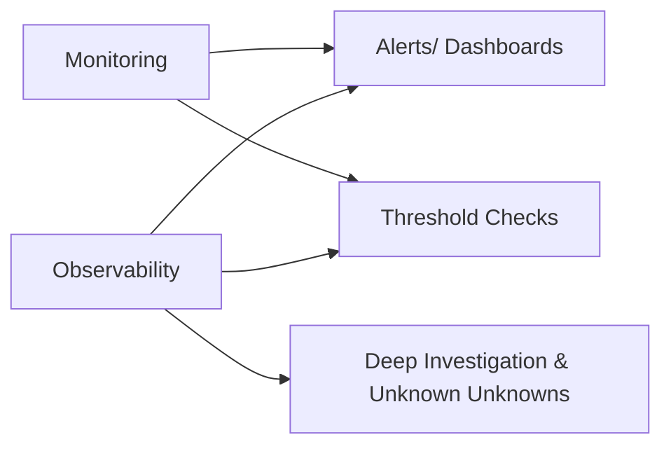
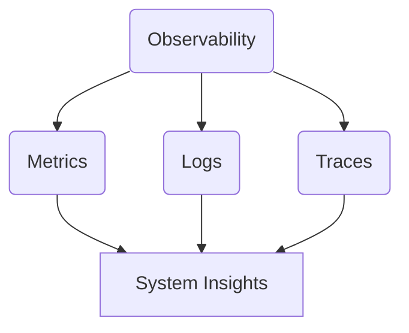
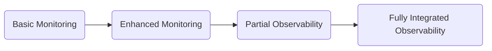
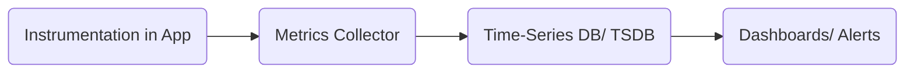
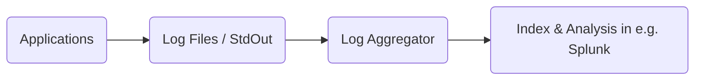
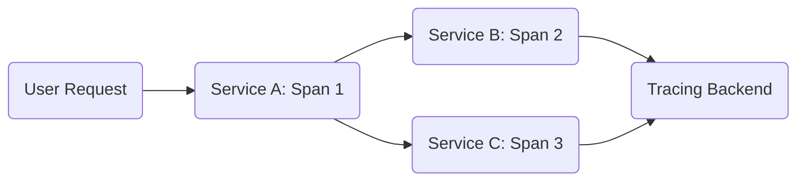
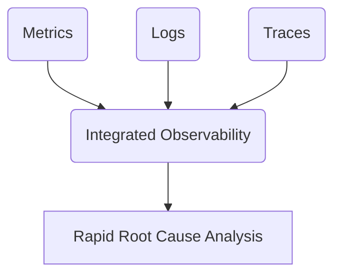

# Day 1 Observability Training Module

Below is the **Day 1 Observability Training Module** created from the updated prompt. It follows a **brick-by-brick** instructional approach with tiered content (Beginner, Intermediate, Advanced/SRE), integrates real-world “horror stories with happy endings,” and uses a friendly, conversational tone. Enjoy exploring how metrics, logs, and traces come together to form the backbone of modern SRE observability.

## 1. Introduction: Observability Foundations

### 1.1 Welcome & Context
Hello, everyone—welcome to Day 1 of your Observability training module! I’m your friendly SRE instructor, here to guide you through the Three Pillars of Observability and how they can transform your current monitoring experience. By the end of the day, you’ll see observability as more than just a buzzword—it’s a practical, essential approach that complements (rather than replaces) your existing tools like Geneos, Splunk, Dynatrace, and Datadog.

### 1.2 The "Observe, Test, Evaluate, Take Action" Framework
One simple way to think about observability is to break it into four key actions:

1. **Observe** – Collect signals (metrics, logs, traces) about how your system behaves  
2. **Test** – Ask new questions of the data to verify assumptions  
3. **Evaluate** – Interpret the insights you gather  
4. **Take Action** – Use that understanding to make improvements or fix issues  

### 1.3 Monitoring vs. Observability
- **Monitoring** is like having a few security cameras pointed at known entrances to your building: you’ll be alerted if something passes in front of them.  
- **Observability** is having a system of cameras, sensors, and logs throughout the building, so you can figure out exactly what’s happening anywhere—even if you didn’t anticipate the need to look there before.

**Key Point**: Monitoring still matters! Observability builds on it to give you richer investigative power.

### 1.4 The Three Pillars: Metrics, Logs, Traces
1. **Metrics** – Quantitative, time-series data indicating system performance or resource usage  
2. **Logs** – Time-stamped records capturing discrete events and messages  
3. **Traces** – End-to-end paths of requests as they traverse multiple services  

### 1.5 Evolution from Monitoring to Observability
- **Basic Monitoring**: A few simple metrics and alerts  
- **Enhanced Monitoring**: More detailed metrics + limited logging  
- **Partial Observability**: Logs, metrics, and maybe some partial traces  
- **Full Observability**: Metrics, logs, and traces integrated seamlessly for deep system insights

#### Observability Maturity Model

### 1.6 Learning Objectives by Tier

- 🔍 **Beginner**: Understand the Three Pillars of Observability (metrics, logs, traces) and how they fit with your current monitoring.
- 🧩 **Intermediate**: Learn techniques for correlating the pillars in real-world scenarios, including environment-specific details (VSI, Kubernetes, AWS).
- 💡 **Advanced/SRE**: Architect integrated, scalable observability solutions that unify data across distributed microservices.

### 1.7Introduction: Observability Foundations
Video: "OpenTelemetry and Observability: What, Why, and Why Now?" by Greg Leffler at SREcon22 Asia/Pacific​

- https://www.youtube.com/watch?v=sn6MWZPED24
- An insightful overview of OpenTelemetry and its role in modern observability practices.
---

## 2. Core Concept: Metrics – The Quantitative View

### 2.1 Beginner Level: “Car Dashboard” Analogy
Metrics are like your car’s dashboard indicators. They tell you how fast you’re going, how much fuel you have, and what your engine temperature is:

- **Counters**: Odometer reading (only increases)  
- **Gauges**: Fuel level (goes up or down)  
- **Histograms**: Distribution of your speeds over time

#### Real Examples
- Geneos or Datadog collecting CPU, memory, and I/O usage.  
- Prometheus collecting custom metrics (request rates, error counts) for your microservices.

### 2.2 Intermediate Level: RED and USE Methods
- **RED (Rate, Errors, Duration)**: Helps SREs track API or service-level performance.  
- **USE (Utilization, Saturation, Errors)**: Great for resource-focused monitoring (e.g., CPU or memory usage).

#### Metric Naming & Cardinality
- Use **consistent naming** (e.g., `app_requests_total`).  
- Avoid extremely high-cardinality labels (like unique user IDs) unless absolutely necessary—storage can explode!

### 2.3 Advanced/SRE Level: Scaling & Alerting Strategies
1. **High-Frequency Metrics**: Use rolling aggregates to prevent DB overload.  
2. **Multi-Cluster/Kubernetes**: Combine cluster metrics with a central aggregator (e.g., Prometheus → Thanos or Datadog).  
3. **Alerting**: Balance SLO-based alerts (e.g., 99% of requests <500ms) with classic threshold alerts.

### 2.4 Horror Story with a Happy Ending: Metrics
**Situation**: A microservice in AWS kept slowing down under load, but standard “CPU usage” monitoring looked fine.  
**Problem**: The dev team suspected memory leaks but had no direct memory or garbage collection metrics to confirm.  
**Solution**: After instrumenting advanced memory usage metrics (GC cycles, heap size, etc.), they found a memory fragmentation issue. Fixing it dropped response times back to normal.  
**Lesson**: When in doubt, pick the right metric to measure. Sometimes, CPU alone won’t tell the story!

### 2.5  Core Concept: Metrics – The Quantitative View
Video: "How Prometheus Monitoring Works" by TechWorld with Nana​

- https://www.youtube.com/watch?v=h4Sl21AKiDg
- A comprehensive introduction to Prometheus and its approach to metrics collection and monitoring.

### 2.6 Interview-Style Questions (Metrics)
1. **Beginner**: “What’s the difference between a counter and a gauge?”  
2. **Intermediate**: “How would you apply the RED method to an API-based microservice?”  
3. **Advanced**: “Describe a strategy to handle high-cardinality metrics in a large Kubernetes cluster.”

---

## 3. Core Concept: Logs – The Narrative Thread

### 3.1 Beginner Level: “Journey Journal” Analogy
Logs are like a daily journal entry for your system. Each log line captures an event or message that tells a story:

- **Structured Logs**: Key-value (like a neat bullet journal)  
- **Unstructured Logs**: Plain text (like scribbled notes—harder to parse later!)

#### Real Examples
- Splunk for centralized search/alerting  
- ELK or OpenSearch for collecting, indexing, and visualizing logs

### 3.2 Intermediate Level: Correlation & Context Enrichment
- **Correlation**: Link logs from multiple services using request IDs, user IDs, or other unique tags.  
- **Context Enrichment**: Add metadata like environment, version, or container ID to each log for more precise searching.

#### Log Sampling & Performance
- Heavy logging can cause performance degradation.  
- Consider sampling debug logs to store only a fraction of high-volume events.

### 3.3 Advanced/SRE Level: Scaling & Analysis Patterns
1. **Distributed Logging Pipelines**: Use something like Fluentd or Logstash to aggregate logs across multiple clusters.  
2. **Machine Learning / Anomaly Detection**: Tools like Splunk or Datadog can auto-detect unusual patterns in logs.  
3. **Cost-Optimization**: Tiered storage (hot vs. cold) ensures old logs don’t bankrupt your budget.

### 3.4 Horror Story with a Happy Ending: Logs
**Situation**: A memory leak was crashing pods, but the core logs only said “OOMKilled.” Support staff saw the error but had zero context.  
**Problem**: Unstructured, minimal logs gave no clues why memory was spiking.  
**Solution**: They started using structured logs with container metadata. Immediately, the logs showed a specific function that was allocating way too much memory.  
**Lesson**: With structured logs, you can pinpoint the exact function causing issues rather than guess.

### 3.5 Core Concept: Logs – The Narrative Thread
Video: "Observability with Fluent Bit: Logs, Metrics & Traces" by Eduardo Silva & Anurag Gupta​

- https://www.youtube.com/watch?v=PP8vlQBRtts 
- Explores how Fluent Bit can be used to manage logs, metrics, and traces for effective observability.

### 3.6 Interview-Style Questions (Logs)
1. **Beginner**: “What’s the difference between structured and unstructured logs?”  
2. **Intermediate**: “How do you correlate logs across multiple microservices?”  
3. **Advanced**: “Describe an approach to handle log retention and cost optimization at scale.”

---

## 4. Core Concept: Traces – The Request’s Journey

### 4.1 Beginner Level: “GPS Tracking a Journey”
A **trace** is like following your rideshare’s path on a map: you see each turn (span) from the moment you start to your final destination.

- **Span**: A single operation within the request path (e.g., calling a database).  
- **Trace Context**: IDs passed along so you can see the entire end-to-end transaction.

#### Real Examples
- Dynatrace APM automatically traces requests across your stack.  
- OpenTelemetry + Jaeger for custom distributed tracing solutions.

### 4.2 Intermediate Level: Trace Sampling & Visualization
- **Sampling**: You might not store every single trace if traffic is huge.  
- **Visualization**: Tools show timelines, letting you quickly spot which service is slow or failing.

### 4.3 Advanced/SRE Level: Context Propagation & Analysis Patterns
1. **Context Propagation**: Ensure that each microservice passes along a consistent `trace_id` so everything lines up.  
2. **Scaling**: High-throughput apps might require partial sampling or advanced storage solutions.  
3. **Cross-Environment Traces**: Traces that span on-prem (VSI), containers (Kubernetes), and cloud (AWS).

### 4.4 Horror Story with a Happy Ending: Traces
**Situation**: A request would randomly fail in a mesh of 20 microservices. Standard logs showed no single culprit, and metrics were too coarse to pinpoint.  
**Problem**: The error hopped between services, each blaming the next.  
**Solution**: Distributed tracing (Dynatrace + OpenTelemetry) revealed a chain reaction triggered by a slow downstream call. Once fixed, the failures disappeared.  
**Lesson**: Tracing can connect the dots between services, solving the “It’s not me!” blame game.

### 4.5 Core Concept: Traces – The Request’s Journey
Video: "Correlation Between Logs and Traces and Vice Versa"​

- https://www.youtube.com/watch?v=hc0Bo1l8rkA
- Discusses the importance of correlating logs and traces to achieve comprehensive observability.

### 4.6 Interview-Style Questions (Traces)
1. **Beginner**: “What is a span in distributed tracing?”  
2. **Intermediate**: “When is trace sampling helpful, and what are the trade-offs?”  
3. **Advanced**: “How would you design an end-to-end tracing solution for 100+ microservices spread across Kubernetes and AWS?”

---

## 5. Integrating the Three Pillars

### 5.1 Complementing Traditional Monitoring
Observability doesn’t replace your Geneos or Splunk dashboards; it extends them with a deeper layer of **“ask any question”** capability. You can still use threshold-based alerts while tapping into logs and traces for deep dives when anomalies arise.

### 5.2 Correlation Patterns Across Pillars
- **Metrics** might show a sudden spike in error rate.  
- **Logs** confirm the error and provide an exception message.  
- **Traces** pinpoint exactly which component or call is failing.

### 5.3 Architecture Diagrams for Full Integration
Picture a pipeline that collects logs, metrics, and traces from the same services—tagged with consistent IDs. This gives you an overarching “single pane of glass” for all your data.

### 5.4 Horror Story with a Happy Ending: Full Integration
**Situation**: After a critical deployment, user reports soared about slow logins. They had metrics, logs, and partial traces—but each was disjointed.  
**Problem**: No single vantage point gave the full story. The team wasted hours correlating data manually.  
**Solution**: By fully integrating metrics, logs, and distributed traces in Datadog, they quickly found a new caching layer misconfiguration.  
**Lesson**: When pillars are unified, you jump straight to root cause with minimal detective work.

### 5.5 Integrating the Three Pillars
Video: "Datadog Product Tour"​

- https://www.youtube.com/watch?v=YmJcbAI_OCg
- Provides an overview of Datadog's capabilities in integrating metrics, logs, and traces for full-stack observability.

### 5.6 Interview-Style Questions (Integrated Observability)
1. **Beginner**: “How do metrics, logs, and traces complement each other?”  
2. **Intermediate**: “What are some key IDs or tags you can use to correlate events across all three pillars?”  
3. **Advanced**: “Describe an architecture that provides unified visibility across on-prem (VSI), Kubernetes, and AWS.”

---

## 6. Knowledge Check & Day 1 Wrap-Up

### 6.1 Key Concept Summary
- **Metrics**: Quantitative signals for trends and alerts  
- **Logs**: Discrete, detailed records for deep event context  
- **Traces**: End-to-end visibility for transactions spanning multiple services  
- **Integration**: Tying them together creates a robust, agile troubleshooting framework

### 6.2 Self-Assessment Quiz
1. **Which pillar best helps find the “unknown unknowns?”**  
2. **Name one reason structured logs might be more valuable than unstructured logs.**  
3. **What is a span, and how does it differ from a trace?**  
4. **How do metrics, logs, and traces work together to accelerate root cause analysis?**  
5. **Give one example of how you could unify these pillars in your current environment (Geneos, Splunk, Dynatrace, Datadog).**

### 6.3 Preview of Day 2 and Day 3
- **Day 2**: Hands-on labs with advanced tool configurations and custom instrumentation  
- **Day 3**: SLOs, dashboards, and deeper pipeline integrations (Fluentd, OpenTelemetry, custom exporters)

### 6.4 Further Reading & Viewing
- **Prometheus/Grafana** for advanced metrics setup  
- **ELK Stack** or **OpenSearch** for integrated logging solutions  
- **OpenTelemetry** for vendor-neutral instrumentation  
- **Dynatrace**, **Datadog** APM resources

---

# Congratulations!
You’ve completed Day 1 of your Observability Training. You now have a strong conceptual foundation in metrics, logs, and traces—topped off by real “horror stories with happy endings” and a bit of SRE-style humor. Moving forward, you’ll learn how to integrate these pillars in practical ways, customizing them for your **VSI**, **Kubernetes**, and **AWS** environments. Keep asking questions, stay curious, and get ready to take your monitoring practices to the next level!