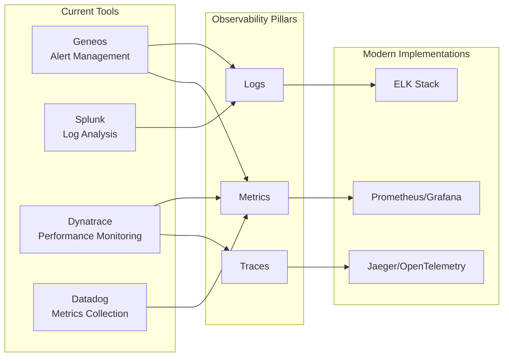
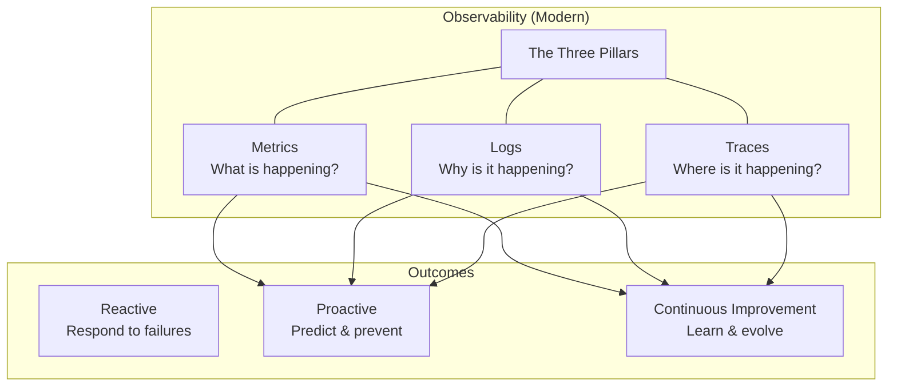
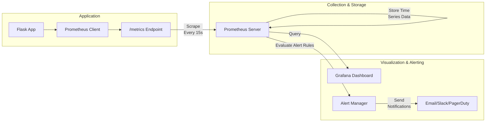
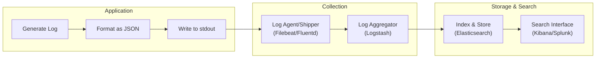
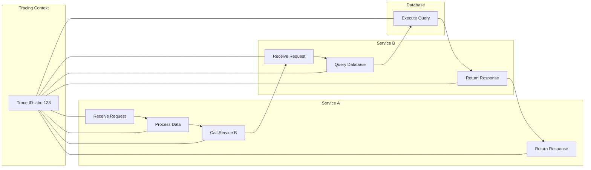
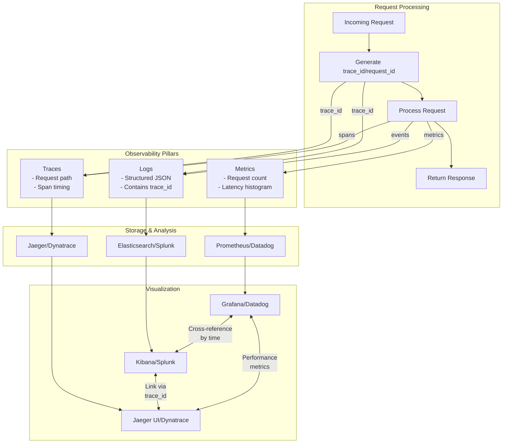
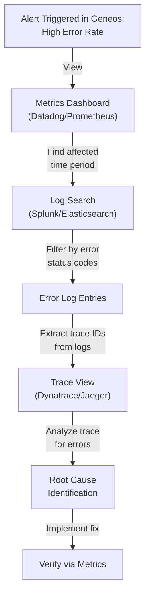

Below is a **Day 1 SRE Training Module** tailored specifically for **production support professionals** transitioning to SRE roles. It follows the structure and guidelines outlined in **day-1-sre-concepts-prompt-v3.md**, emphasizing the evolution from traditional monitoring (Geneos, Splunk, Dynatrace, Datadog) to **modern observability** (metrics, logs, traces). Our fictional company, **TechNow**, will guide you through realistic incidents, horror stories, and hands-on exercises that connect existing tool expertise to new observability practices.

---

# **Day 1 Observability Training Module**

## 1. Introduction: From Monitoring to Observability

### **1.1 A Modern Incident Story: The Day Geneos Couldn’t See It All**

Meet **Maya**, a production support specialist at **TechNow**, a financial services platform. One afternoon, Geneos alerts start firing about high CPU utilization on the Payment microservice. Maya checks basic dashboards but sees only a single CPU graph. She restarts the service. The alert clears—until an hour later, when it returns. Meanwhile, **Sarah**, a business stakeholder, reports that customer transactions keep failing. Without deeper insights, Maya can’t pinpoint *why* CPU is spiking or *what* is causing the transaction failures.

Enter **Raj**, an experienced SRE mentor. He suggests that while monitoring tools like Geneos can detect *symptoms*, **observability** will help the team *explain* them. Over the next few days, Maya embarks on a journey from monitoring with Geneos to a more holistic approach using **metrics, logs, and traces**—the Three Pillars of Observability.

### **1.2 The “Observe, Test, Evaluate, Take Action” Framework**

1. **Observe**: Collect telemetry data (metrics, logs, traces).  
2. **Test**: Form and test hypotheses about what might be wrong.  
3. **Evaluate**: Distill those observations into insights.  
4. **Take Action**: Fix issues, refine instrumentation, and prevent recurrences.

### **1.3 Monitoring vs. Observability**

- **Monitoring**: Asks, “Is it up or down? Are thresholds exceeded?”  
- **Observability**: Asks, “*Why* is it behaving this way? *Where* is the bottleneck? *What* changed?”

Both are important—but **observability** offers deeper insights.

### **1.4 Mapping Existing Tools to the Three Pillars**

TechNow currently leverages:

- **Geneos** for alert management  
- **Splunk** for log analysis  
- **Dynatrace** for performance monitoring / partial tracing  
- **Datadog** for metrics

Below is a **Tool Mapping Diagram** showing how these map to the Three Pillars:

### **1.5 Fictional Company & Recurring Characters**

- **TechNow**: A financial services platform running microservices (Payments, Accounts, Inventory).  
- **Maya**: Production support transitioning to SRE (primary POV).  
- **Raj**: Experienced SRE mentor guiding the transformation.  
- **Tyler**: A developer learning operations best practices.  
- **Sarah**: Business stakeholder impacted by downtime and performance issues.

### **1.6 Three Pillars Overview Diagram**

### **1.7 Learning Objectives**

- **🔍 Beginner**  
  1. Differentiate monitoring (Geneos/Dynatrace) from modern observability practices.  
  2. Identify the three pillars: metrics, logs, and traces.  
  3. Map existing monitoring tools to each pillar.  
  4. Understand the “Observe, Test, Evaluate, Take Action” cycle.

- **🧩 Intermediate**  
  1. Compare Datadog’s metrics approach to Prometheus.  
  2. Implement structured logging, bridging Splunk knowledge to JSON log aggregation.  
  3. Integrate partial tracing data (Dynatrace) with open-source tracing concepts.  
  4. Start creating cross-pillar dashboards and alerts.

- **💡 Advanced/SRE**  
  1. Resolve complex microservice issues using all three pillars.  
  2. Address cardinality concerns and performance overhead in large-scale environments.  
  3. Design a phased migration roadmap from Geneos to a more holistic stack (without discarding valuable components).  
  4. Employ advanced correlation and automation strategies for proactive incident prevention.

> **Video Placeholder**: {{VIDEO_LINK_INTRO}}

---

## 2. Core Concept: Metrics (The Quantified View)

### **2.1 Mindset Transition: From Geneos/Datadog to Prometheus-Style Metrics**

At TechNow, Maya has used Geneos to catch CPU or memory threshold breaches, while Datadog shows aggregated system metrics. However, these can be limited in providing *dimensional* metrics (e.g., response latency by endpoint). Prometheus-style metrics allow flexible labels and queries (e.g., `http_request_duration_seconds{endpoint="/payments",status_code="500"}`).

### **2.2 Incident First: When Basic Dashboards Failed**

**Setting**: TechNow’s Payment service triggers repeated CPU alerts in Geneos. Maya sees a static CPU graph in Datadog but can’t correlate it with specific endpoints or user traffic patterns.  
**Crisis**: Payment transactions slow down, causing business impact.  
**Confusion**: Basic threshold alerts say “CPU high,” but *why*?  
**Discovery**: By instrumenting the Payment service with dimensional metrics, the team identifies that requests from a new partner endpoint cause heavy database writes.  
**Resolution**: They add indexing to the database table. CPU usage normalizes.  
**Lesson**: More granular, labeled metrics reveal patterns that raw threshold alerts can’t.

### **2.3 🔍 Beginner: Understanding Metrics Types**

- **Analogy**: A car dashboard measuring speed (gauge), distance traveled (counter), fuel usage, etc.  
- **Counters**: Values only go up (or reset). Example: `app_requests_total`.  
- **Gauges**: Values can go up or down. Example: current queue length.  
- **Histograms**: Distribution of measurements (e.g., request latency).

### **2.4 🧩 Intermediate: Practical Implementation & Visualization**

- **RED Method**: Rate, Errors, Duration for microservices.  
- **USE Method**: Utilization, Saturation, Errors for resources.  
- **Datadog** vs. **Prometheus**:  
  - Datadog offers hosted metrics with built-in dashboards.  
  - Prometheus requires a local server scraping `/metrics`.  
  - Both can store dimensional data and provide alerting.

| **Platform**   | **Key Strength**                                 | **Use Case**                           |
|----------------|--------------------------------------------------|----------------------------------------|
| **Datadog**    | Hosted SaaS, easy correlation with APM           | Quick start, enterprise environment    |
| **Prometheus** | Open-source, flexible queries (PromQL)           | Cloud-native, self-hosted environments |
| **InfluxDB**   | Specialized time-series DB (TICK stack)          | High-volume metrics ingestion          |

### **2.5 💡 Advanced/SRE: Cardinality & Alert Strategies**

- **Cardinality Issues**: Labeling metrics by user_id can explode your time series counts.  
- **Alert Tuning**: Combine multiple signals (e.g., error rates + latency spikes + resource saturation).  
- **Performance Impact**: Over-scraping or storing too many time series can degrade performance.  

### **2.6 Horror Story: Threshold Sprawl**

> **Setting**: TechNow sets a CPU threshold alert for every microservice in Geneos, leading to *alert fatigue*.  
> **Confusion**: The teams start ignoring some alerts, missing a real meltdown.  
> **Discovery**: By adopting dimensional metrics with well-tuned alerts (based on actual SLOs), the on-call significantly reduces alert noise.  
> **Lesson**: Too many thresholds kill the signal; focusing on meaningful metrics fosters effective monitoring.

### **2.7 Practical Migration: Enhancing Datadog Metrics**

- **Step 1**: Add labels/tags on your Datadog metrics to segment traffic by endpoint or partner.  
- **Step 2**: Create dashboards that compare different endpoints side by side.  
- **Step 3**: Migrate threshold-based alerts to SLO-based or anomaly detection alerts.  
- **Step 4**: Gradually introduce Prometheus for more custom or self-managed scenarios if desired.

> **Video Placeholder**: {{VIDEO_LINK_METRICS}}

---

## 3. Core Concept: Logs (The Narrative Thread)

### **3.1 Mindset Transition: From Splunk Searches to Structured Logging**

At TechNow, **Splunk** ingestion provides real-time logs. However, many logs are unstructured, making it hard to filter by request ID or user session. **Structured logging** ensures consistent fields (JSON), enabling deeper correlation with metrics and traces.

### **3.2 Incident First: The Mysterious “500”s**

**Setting**: Maya sees an uptick in HTTP 500 errors reported by Datadog. She queries Splunk but finds scattered text logs.  
**Crisis**: The 500 errors are random, making them hard to pinpoint in logs.  
**Confusion**: Traditional Splunk searches reveal partial stack traces with no consistent correlation.  
**Discovery**: After implementing structured JSON logs with a `request_id`, Maya zeroes in on a specific code path triggered by large upload files.  
**Resolution**: Fix the upload file–handling routine. Errors drop to zero.  
**Lesson**: Structured logs transform “hunt and peck” into targeted queries.

### **3.3 🔍 Beginner: Log Basics & Levels**

- **Analogy**: A travel journal with daily entries (events).  
- **Log Levels**: `DEBUG`, `INFO`, `WARN`, `ERROR`, `CRITICAL`. 
- **Basic Logging**: Even simple logs become powerful if consistently formatted.

### **3.4 🧩 Intermediate: Structured JSON & Aggregation**

- **JSON Logs**: Key-value pairs (timestamp, level, message, request_id).  
- **Splunk** to **ELK** Bridge: Splunk can parse JSON logs similarly to how Logstash does.  
- **Correlating With Metrics**: By including the same `request_id` in your logs and metrics, you can pivot from a Datadog metric spike to exact log entries.

| **Platform**    | **Key Strength**                   | **Use Case**                           |
|-----------------|------------------------------------|----------------------------------------|
| **Splunk**      | Enterprise-scale log analysis       | Large corporate environment            |
| **ELK Stack**   | Open-source, flexible ingestion     | Customizable indexing & search         |
| **Graylog**     | Easy UI, open-core approach         | Medium teams seeking simpler setup     |

### **3.5 💡 Advanced/SRE: Performance, Correlation, & Log Volumes**

- **Performance**: Large volumes of logs can cause I/O overhead. Filter or sample logs if needed.  
- **Error Correlation**: Link 500 errors in logs to high-latency metrics.  
- **Niche Data**: Some ephemeral data is best captured in logs (debug statements, stack traces).

### **3.6 Horror Story: Grep Gone Wild**

> **Setting**: A critical Payment failure at TechNow, with Splunk capturing thousands of lines per second.  
> **Crisis**: The on-call team attempts to “grep” across logs. They find partial clues but no consistent thread.  
> **Discovery**: By switching to JSON logs with a unique `request_id`, the team isolates the failing transactions in minutes.  
> **Lesson**: Unstructured logs hamper speed; structured logs power correlation and reduce chaos.

### **3.7 Practical Migration: Structured Logging with Splunk**

1. **Define a consistent JSON schema**: e.g., `timestamp`, `level`, `request_id`, `user_id`.  
2. **Update your app** (Flask or otherwise) to output JSON logs.  
3. **Enable JSON parsing** in Splunk, setting up field extractions automatically.  
4. **Create saved searches** or dashboards to group logs by `request_id` or error code.

> **Video Placeholder**: {{VIDEO_LINK_LOGS}}

---

## 4. Core Concept: Traces (The Request’s Journey)

### **4.1 Mindset Transition: From Dynatrace to Full Distributed Tracing**

Dynatrace’s **PurePath** technology offers partial distributed traces. However, integrating **OpenTelemetry** can provide richer customization and multi-vendor flexibility. 

### **4.2 Incident First: Hidden Microservice Loop**

**Setting**: TechNow’s microservices (Accounts, Payments, Notifications) sometimes spike in latency. Dynatrace shows slow calls but not the entire chain.  
**Crisis**: Users see random timeouts. CPU usage is normal; logs mention timeouts.  
**Confusion**: Traditional APM tools show average response times but do not highlight an unexpected calls loop.  
**Discovery**: End-to-end distributed tracing reveals a cyclical call: the Payments service calls Notifications, which calls Accounts, which calls back to Payments in certain edge cases.  
**Resolution**: The cyclical dependency is removed. Latency normalizes.  
**Lesson**: Traces reveal hidden cross-service flow that metrics and logs missed.

### **4.3 🔍 Beginner: Tracing Analogy & Basic Concepts**

- **Analogy**: A GPS tracking your entire journey, each step is a “span.”  
- **Span**: Named operation with start/end time.  
- **Trace ID**: Groups all spans for a single request.  
- **Parent/Child**: Hierarchical relationships among spans.

### **4.4 🧩 Intermediate: Context Propagation & Instrumentation**

- **Context Propagation**: Ensures each microservice call passes the trace ID.  
- **Dynatrace** vs. **Jaeger**: 
  - Dynatrace automatically instruments your services, focusing on performance.  
  - Jaeger/OpenTelemetry is open source, highly configurable.  
- **Implementation**: Start with auto-instrumentation (like `FlaskInstrumentor`) to create spans.

### **4.5 💡 Advanced/SRE: Sampling & Debugging Complex Issues**

- **Sampling Strategies**: 100% trace capture can be costly, so some limit or sample.  
- **Complex Debugging**: Identify concurrency or race conditions across multiple services.  
- **Overhead**: Minimally invasive instrumentation, but still a performance consideration.

| **Platform**    | **Key Strength**              | **Use Case**                      |
|-----------------|-------------------------------|-----------------------------------|
| **Dynatrace**   | Full-service APM & auto-trace | Quick insights, enterprise-level  |
| **Jaeger**      | CNCF project, open-source     | Kubernetes & microservices        |
| **Zipkin**      | Lightweight tracing           | Simpler distributed systems       |

### **4.6 Horror Story: 5-Second Checkout Mystery**

> **Setting**: TechNow’s Checkout service “occasionally” takes up to 5 seconds. Dynatrace shows partial performance data.  
> **Crisis**: The slow requests cause user frustration. CPU/Memory is fine. Logs show random timeouts.  
> **Discovery**: Full distributed trace with OpenTelemetry exposes a legacy microservice that attempts a synchronous call to a third-party vendor with a 5-second timeout.  
> **Resolution**: Switch to async calls or adjust timeout logic. Checkout times drop to below 1 second.  
> **Lesson**: End-to-end tracing captures precisely where time is spent.

### **4.7 Practical Migration: Leveraging Existing Dynatrace**

1. **Extend**: Keep Dynatrace for high-level APM. Add OpenTelemetry for extra spans or custom instrumentation.  
2. **Correlate**: Link Dynatrace PurePath IDs to your own trace IDs if possible.  
3. **Gradual Adoption**: Start with one or two critical microservices to prove the value of deeper tracing.  

> **Video Placeholder**: {{VIDEO_LINK_TRACES}}

---

## 5. Integrating the Three Pillars: The Support-to-SRE Evolution

Now we see how **metrics, logs, and traces** combine to form a powerful trifecta of **observability**. This next scenario shows the synergy—and how you can leverage Geneos, Splunk, Dynatrace, and Datadog together in an evolving SRE approach.

### **5.1 Complex Incident Detected in Geneos**

**Setting**: A brand-new partner integration triggers an avalanche of alerts in Geneos.  
**Evolution**: 
1. **Maya** sees a CPU spike in Geneos → checks Datadog metrics → sees a spike in `app_request_latency_seconds`.  
2. She then queries Splunk logs with a `request_id` → finds repeated 500 errors referencing a new “PartnerX” endpoint.  
3. She jumps to traces in Dynatrace → sees the Payment service calling an external API. The API returns slow responses 20% of the time.  
4. **Raj** helps implement caching to reduce external calls.  

Below is a **Three Pillars Integration Diagram** illustrating how the pillars connect:

### **5.2 Incident Investigation Flow**

> **Video Placeholder**: {{VIDEO_LINK_INTEGRATION}}

---

## 6. Hands-On Exercises / Tiered Challenges

**Structure**: Each exercise simulates a TechNow-style incident. You’ll integrate knowledge from Geneos/Splunk/Dynatrace/Datadog into a new observability approach.

1. **🔍 Beginner**  
   - **Scenario**: A CPU alert in Geneos indicates high usage on a Flask service.  
   - **Task**:  
     1. Instrument the Flask app with basic Prometheus metrics (Code Example 1).  
     2. Relate CPU usage spikes in Geneos to endpoint-level latencies in your new `/metrics` endpoint.  
   - **Goal**: Confirm you can see metrics by endpoint, bridging old monitoring (Geneos CPU) with new (Prometheus-style metrics).

2. **🧩 Intermediate**  
   - **Scenario**: Splunk logs show recurring “500” errors.  
   - **Task**:  
     1. Add structured JSON logging to the Flask app (Code Example 2).  
     2. Ingest those logs into Splunk and create a saved search filtering `request_id`.  
   - **Goal**: Correlate a specific error spike in metrics with the log messages that contain a matching `request_id`.

3. **💡 Advanced/SRE**  
   - **Scenario**: Dynatrace indicates a high average latency in the Payment service, but partial traces are inconclusive.  
   - **Task**:  
     1. Add distributed tracing via OpenTelemetry to your Flask app (Code Example 3).  
     2. Trigger test requests to produce traces.  
     3. Compare the new trace spans with what Dynatrace was capturing.  
   - **Goal**: Demonstrate how combining existing Dynatrace data with deeper OpenTelemetry instrumentation provides end-to-end insight.

---

## 7. Tool Migration Roadmap

### **7.1 Practical Guidance**

1. **Retain Key Tools**: Keep Geneos for high-level alerting if it’s deeply integrated.  
2. **Enhance**: Use Splunk fields/JSON logs to pivot to SRE-style investigations.  
3. **Extend**: Use Dynatrace’s advanced APM while layering on custom traces with OpenTelemetry.  
4. **Adopt**: Introduce Prometheus/Grafana if self-hosted metrics & dashboards become beneficial.  

### **7.2 Maturity Model for Observability Evolution**

- **Stage 1**: Threshold-based monitoring (Geneos) + basic logs (Splunk).  
- **Stage 2**: Dimensional metrics (Datadog/Prometheus) + structured logs.  
- **Stage 3**: Distributed tracing (Dynatrace/OpenTelemetry) + correlated triage.  
- **Stage 4**: SLO-driven alerts + proactive automation + continuous improvement.

### **7.3 Skills Transfer Map**

| **Production Support Skill** | **SRE Observability Equivalent**                              |
|------------------------------|---------------------------------------------------------------|
| Monitoring CPU/Mem in Geneos | Defining multi-dimensional metrics with thresholds or SLOs   |
| Splunk searching for errors  | Structured logging with request-based correlation            |
| Dynatrace performance tuning | End-to-end distributed tracing + advanced sample strategies  |
| Escalating incidents         | Automated alerting + War Room simulations + postmortems      |

---

## 8. Code Implementation Examples

Below are three Python/Flask code snippets illustrating how to evolve from basic metrics to structured logging to distributed tracing. Each builds on the previous, showing a path to comprehensive observability. 

**1. [Beginner Implementation: Basic Metrics](#L1)**  
**2. [Intermediate Implementation: Adding Structured Logging](#L2)**  
**3. [Advanced Implementation: Adding Distributed Tracing](#L3)**  

> **Note**: Each code example includes references to bridging current Datadog or Splunk knowledge with modern frameworks.

---

## 9. Real-World Scenarios

### **9.1 Scenario 1: Performance Issue Spotted by Geneos**

- **Symptom**: Geneos CPU alert triggers an incident.  
- **Response**: Maya checks Datadog metrics at a more granular level, sees a single endpoint’s latency spike.  
- **Learning**: Dimensional metrics quickly pinpoint that 80% of CPU usage correlates with “/partner/newIntegration.”  

### **9.2 Scenario 2: Intermittent Error via Splunk Logs**

- **Symptom**: Splunk logs show repeated “NullPointerException,” but no consistent pattern.  
- **Response**: With structured logs, Maya isolates which user segment triggers the error.  
- **Learning**: Structured logs reduce the guesswork, revealing the error only occurs for specific request parameters.

### **9.3 Scenario 3: Complex Service Interaction Found in Dynatrace**

- **Symptom**: Dynatrace shows prolonged Payment service calls, but partial tracing doesn’t explain the entire chain.  
- **Response**: OpenTelemetry spans reveal a hidden loop among multiple microservices.  
- **Learning**: Full distributed tracing extends beyond a single vendor, giving complete visibility.

---

## 10. War Room Simulation

Conclude Day 1 with a **War Room Simulation** that ties everything together:

1. **Initial Detection**: A major incident: high failure rates detected by Geneos.  
2. **Investigation**:  
   - Maya opens Datadog dashboards for deeper metrics.  
   - Splunk reveals an error message referencing a new service.  
   - Dynatrace partial traces show slow calls but not the entire picture.  
   - OpenTelemetry traces confirm a complex bug in a “promotional discount” service call.  
3. **Resolution**: SRE team modifies the discount logic; verifies in Datadog metrics that errors drop.  
4. **Timeline Pressure**: During the incident, **Sarah** is upset about customer impact. Proper correlation shortens the War Room session from hours to minutes.  
5. **Post-Incident Review**: The team updates runbooks, invests in advanced tracing for all microservices, and sets new SLOs.

> **Compare**: Traditional approach might have ended after “just fix the CPU spike.” The SRE approach conducts a thorough retrospective, preventing repeated incidents.

---

# **Wrap-Up & Next Steps**

1. **Key Learnings**:  
   - Observability extends your existing monitoring (Geneos, Splunk, Dynatrace, Datadog) by providing deeper context via metrics, logs, and traces.  
   - Real incidents at TechNow show how each pillar helps you detect, investigate, and resolve issues faster.  
   - Structured logs, dimensional metrics, and distributed tracing unify your siloed data into a cohesive troubleshooting story.

2. **Day 2 Preview**:  
   - Advanced SLO strategies, automation for repeated incidents, deeper trace sampling, plus more War Room simulations.  
   - Roadmap for fully integrating Geneos with open-source solutions or bridging Splunk logs with custom log pipelines.

3. **Action Items**:  
   - Implement structured logs in at least one of your microservices.  
   - Experiment with adding custom metrics in Datadog or Prometheus.  
   - Explore enabling distributed tracing in a staging environment.

> **Remember**: By combining these pillars—and bridging your existing knowledge—you can evolve from reactive firefighting to proactive reliability engineering.

**End of Day 1 Observability Training Module**  
**Congratulations** on completing this training! You’re now prepared to merge your production support skills with modern SRE observability practices.  

---

**Video Placeholder for Full Day Recap**: {{VIDEO_LINK_INTEGRATION}}