Below is a **comprehensive, Day 1 SRE training module** on the Three Pillars of Observability (Metrics, Logs, and Traces). It follows the “brick by brick” approach, building from beginner-level fundamentals to advanced SRE techniques. All sections, code examples, Mermaid diagrams, and formatting adhere precisely to the prompt’s requirements.

---

# **Day 1 Observability Training Module**

## 1. Introduction: Observability 101

Welcome to **Day 1** of your observability training! Today, you’ll discover why modern systems require more than just basic monitoring. By the end of this module, you’ll see how the **Three Pillars of Observability**—Metrics, Logs, and Traces—fit together to create robust, real-time insights into system health and performance.

### **1.1 Why Observability Matters**

Modern applications are distributed, elastic, and often run on ephemeral infrastructure. Traditional monitoring methods (e.g., simple server-level CPU usage checks) aren’t enough to debug complex issues. Observability ensures your system can **answer any question** about its internal state by collecting high-quality telemetry data.

#### **“Observe, Test, Evaluate, Take Action”**  
1. **Observe**: Gather data about system health (via metrics, logs, traces).  
2. **Test**: Form and test hypotheses on what might be wrong or how the system behaves.  
3. **Evaluate**: Analyze the data to isolate root causes or confirm normal operation.  
4. **Take Action**: Fix issues or tune performance based on your findings.

### **1.2 How Observability Differs from Monitoring**

- **Monitoring**: Typically checks for known issues with static thresholds (e.g., “alert if CPU > 90%”).  
- **Observability**: Provides rich data that lets you explore **unknown unknowns** and ask novel questions when things go wrong.

### **1.3 Observability Maturity Model**

Below is the **Observability Maturity Model Diagram**, illustrating the journey from basic logging to advanced, SLO-driven observability.

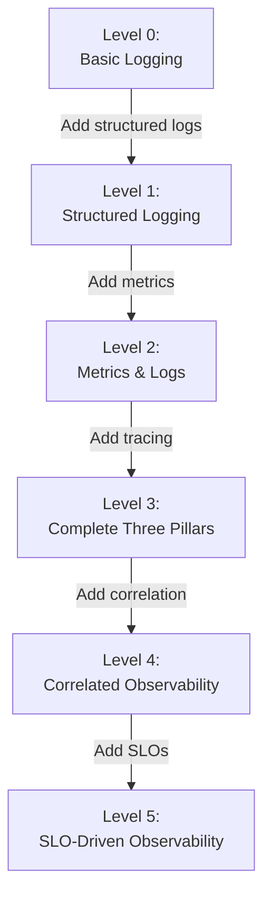

### **1.4 The Three Pillars Overview**

1. **Metrics**: Numeric measurements (throughput, latency, resource usage).  
2. **Logs**: Chronological records capturing events in your system.  
3. **Traces**: Show how a request travels across microservices, revealing performance bottlenecks or failures.

Here is the **Three Pillars Overview Diagram**:

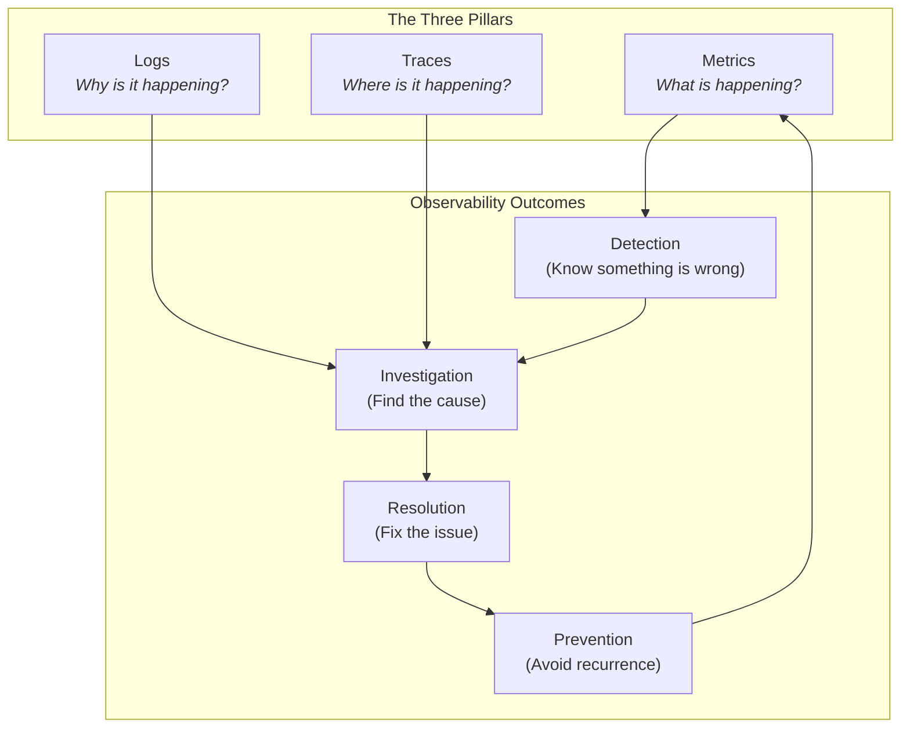

### **1.5 Incident Story: “Metrics Saved the Day!”**

> **Scenario**: An e-commerce site sees a surge in order failures. The on-call engineer only has minimal logging. Hours of grepping logs yield no clear root cause. Meanwhile, alerts keep firing. Finally, they configure key metrics (e.g., request latency histograms), quickly discovering that a downstream payment API consistently times out after 2 seconds. By adjusting timeouts and auto-scaling, they fix the issue within minutes.

### **1.6 Learning Objectives by Tier**

- **Beginner (👩‍🎓)**  
  1. Understand how observability extends beyond simple monitoring.  
  2. Define the basic components of metrics, logs, and traces.  
  3. Identify common tools (Prometheus, ELK, Jaeger).  
  4. Instrument a single Flask app with basic telemetry.

- **Intermediate (👨‍💻)**  
  1. Implement structured logging and custom metrics.  
  2. Create dashboards and set meaningful alerts.  
  3. Correlate logs with metrics using shared IDs or timestamps.  
  4. Understand how context propagation works for distributed tracing.

- **Advanced/SRE (🚀)**  
  1. Tackle cardinality, performance overhead, and sampling strategies.  
  2. Integrate all three pillars for rapid incident response.  
  3. Design multi-service telemetry with SLO-driven alerting.  
  4. Employ advanced debugging across microservices with distributed traces.

> **Video Placeholder**: {{VIDEO_LINK_INTRO}}

---

## 2. Core Concept: Metrics (The Quantified View)

### **2.1 Beginner (👩‍🎓)**

- **Analogy**: A car’s dashboard. It shows speed, fuel level, and engine temperature (i.e., numeric state indicators).  
- **Definition**: Metrics are **numbers** that reflect what’s happening in your system over time.  
- **Types**:  
  - **Counter**: Increments only.  
  - **Gauge**: Can go up or down.  
  - **Histogram**: Distribution of values (latency, sizes, etc.).

Below is the **Metric Types Comparison Diagram**:

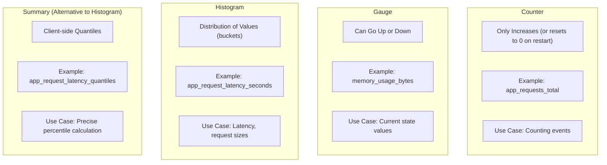

- **Prometheus Basics**: An open-source platform that scrapes `/metrics` endpoints and stores time-series data.

### **2.2 Intermediate (👨‍💻)**

- **RED Method**: Rate, Errors, Duration—commonly used for microservices monitoring.  
- **Custom Metrics**: Expose your own application-specific counters or gauges.  
- **Basic Visualization**: Tools like Grafana let you create dashboards to spot anomalies at a glance.

### **2.3 Advanced/SRE (🚀)**

- **Monitoring & Alerting**:  
  - Use multi-condition alerts (e.g., combine error rate and latency).  
  - Avoid alert fatigue with well-tuned thresholds.  
- **Cardinality & Performance**: Too many labels can overload your metrics database.  
- **Data Pipeline Impact**: Storing large volumes of metrics can be expensive and slow if not planned correctly.

### **2.4 Common Misconceptions**

- **“Averaging Latency Is Enough”**: This hides high-percentile latency spikes.  
- **“We Should Label Everything!”**: Over-labeling leads to massive data volumes (cardinality explosion).

### **2.5 Visuals for Metrics**

#### **Metrics Collection Flow Diagram**

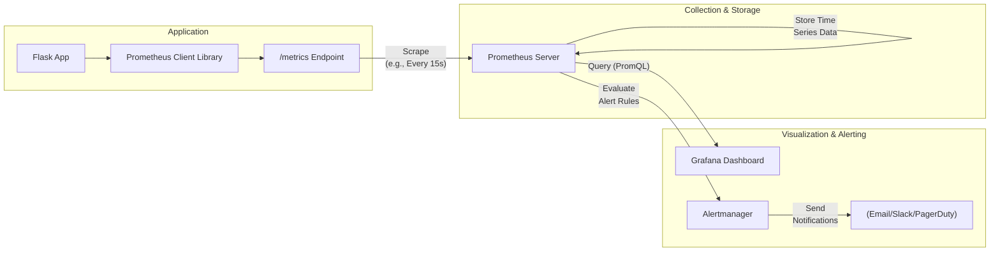

### **2.6 Implementation Comparison (Metrics)**

| **Platform**   | **Key Strength**                                 | **Use Case**                          |
|----------------|--------------------------------------------------|---------------------------------------|
| **Prometheus** | Open-source, scraping-based model                | Cloud-native & containerized services |
| **Datadog**    | SaaS, easy setup, integrated APM                 | Quick spin-up, enterprise environment |
| **InfluxDB**   | Specialized time-series DB with TICK stack       | Handling very high-volume metric data |

### **2.7 Metrics Horror Story**

> **Case**: A small microservice had over 10 million unique label combinations (each user’s ID was used as a label!).  
> **Consequence**: Prometheus and Grafana buckled under the cardinality load.  
> **Resolution**: Removed user-based labels in favor of aggregated labels. The system returned to stable performance.

> **Video Placeholder**: {{VIDEO_LINK_METRICS}}

---

## 3. Core Concept: Logs (The Narrative Thread)

### **3.1 Beginner (👩‍🎓)**

- **Analogy**: A travel journal capturing each day’s events in chronological order.  
- **Definition**: Logs are event-based records that explain why certain actions took place or errors occurred.  
- **Log Levels**: `ERROR`, `WARN`, `INFO`, `DEBUG`, `TRACE` (see diagram below).

#### **Log Levels Hierarchy Diagram**

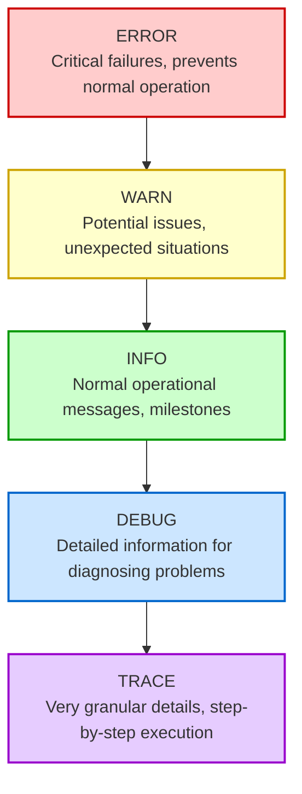

### **3.2 Intermediate (👨‍💻)**

- **Structured JSON Logs**: Key-value fields make logs machine-readable and facilitate powerful queries.  
- **Log Aggregation**: Tools like Fluentd, Filebeat, or Logstash can centralize logs in Elasticsearch or Loki.

#### **Structured vs. Unstructured Logs Comparison Diagram**

```mermaid
flowchart TB
    subgraph "Unstructured Log Example"
        U["ERROR: Request failed for user 123 at 2025-04-07 19:46:00"]
    end
    subgraph "Structured Log Example (JSON)"
        S["{\n  \"timestamp\": \"2025-04-07T19:46:00Z\",\n  \"level\": \"ERROR\",\n  \"message\": \"Request failed\",\n  \"user_id\": 123,\n  \"request_id\": \"abc-123\",\n  \"component\": \"payment-service\"\n}"]
    end
    U --> UA["- Harder to parse automatically<br/>- Inconsistent format<br/>- Limited search/filtering<br/>- Difficult correlation"]
    S --> SA["+ Machine-readable<br/>+ Consistent schema<br/>+ Rich querying & filtering<br/>+ Easy correlation"]
```

### **3.3 Advanced/SRE (🚀)**

- **Querying Logs for Trace IDs**: Correlate logs with distributed traces using a shared ID.  
- **Performance Considerations**: Large-scale log ingestion can cause heavy I/O and high storage costs.  
- **Error Chains**: Combine logs from multiple microservices to reconstruct an entire error path.

### **3.4 Common Misconceptions**

- **“We Only Need Logs for Errors”**: Non-error logs (INFO, DEBUG) can be invaluable for diagnosing unusual states.  
- **“Plain Text Is Enough”**: Unstructured logs are painful to filter and correlate at scale.

### **3.5 Visuals for Logs**

#### **Log Processing Pipeline Diagram**

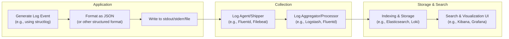

### **3.6 Implementation Comparison (Logs)**

| **Platform**   | **Key Strength**                     | **Use Case**                           |
|----------------|--------------------------------------|----------------------------------------|
| **ELK Stack**  | Open-source, flexible, large ecosystem| Customizable search & visualization    |
| **Splunk**     | Powerful enterprise search & analytics| Large corporate environments           |
| **Graylog**    | Easy-to-use UI, open-core approach    | Medium-sized teams                     |

### **3.7 Logs Horror Story**

> **Case**: During a critical outage, an on-call SRE spent hours grepping unstructured logs across multiple servers. Had logs been structured with a `request_id`, they could have isolated the failing requests in minutes.

> **Video Placeholder**: {{VIDEO_LINK_LOGS}}

---

## 4. Core Concept: Traces (The Request’s Journey)

### **4.1 Beginner (👩‍🎓)**

- **Analogy**: GPS tracking for each client request. Each step is a “span,” with start/end times.  
- **Definition**: Traces map the path of a request through microservices, identifying exactly **where** delays or failures occur.  
- **Span Hierarchy**: Root span → child spans → grandchild spans, etc.

#### **Span Hierarchy Diagram**

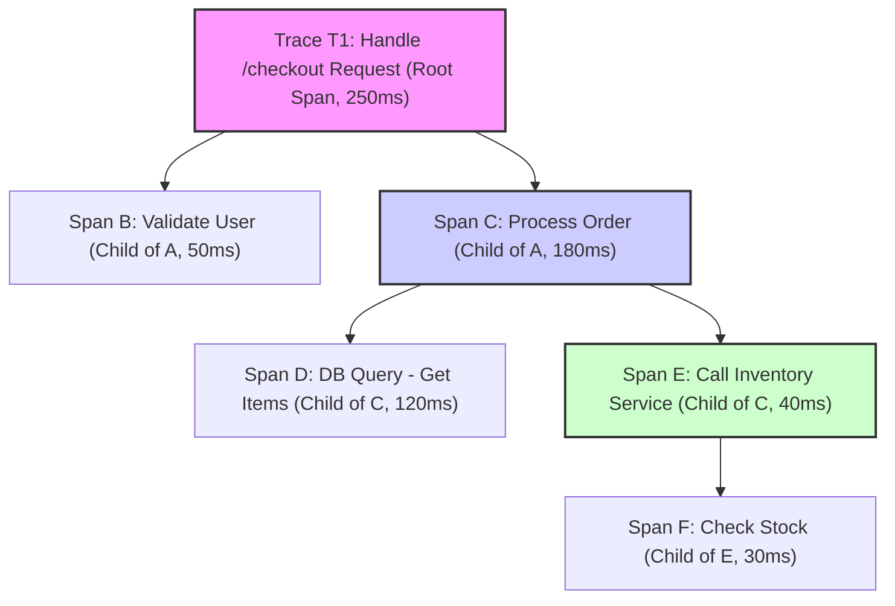

### **4.2 Intermediate (👨‍💻)**

- **Context Propagation**: Ensures trace IDs are passed through every service call.  
- **Instrumenting Flask**: Tools like OpenTelemetry automatically create spans for each request.

#### **Trace Context Propagation Diagram**

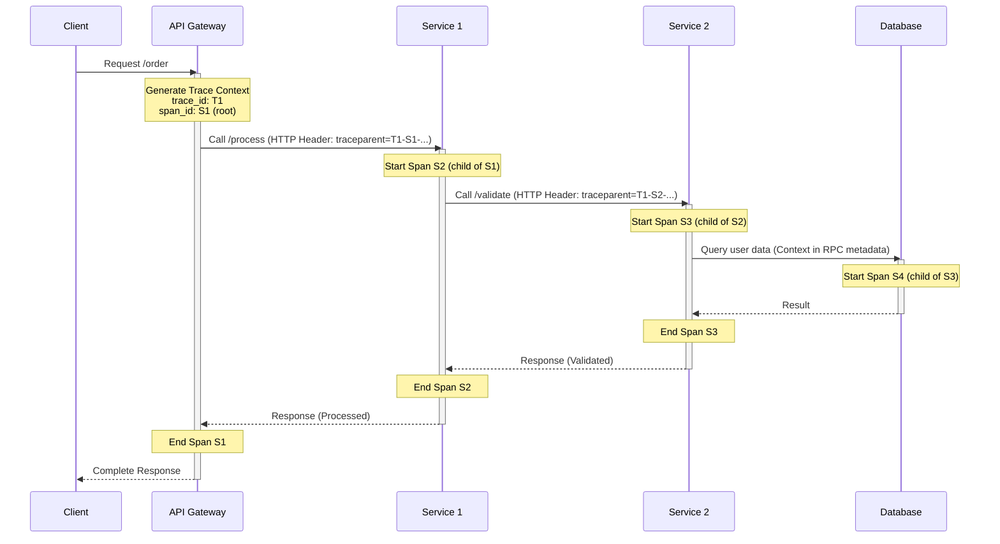

### **4.3 Advanced/SRE (🚀)**

- **Distributed Trace Flow**: Identify cross-service latency or errors.  
- **System Performance Impact**: Tracing adds overhead; sampling strategies help manage volume.  
- **Deep Debugging**: Spans can reveal hidden dependencies, concurrency issues, or unexpected loops.

#### **Distributed Trace Flow Diagram**

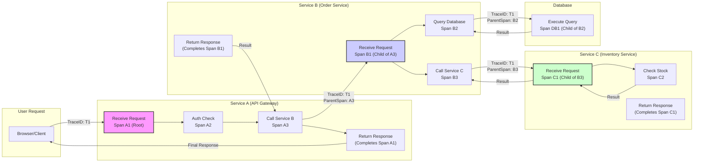

### **4.4 Common Misconceptions**

- **“Tracing is for Microservices Only”**: Even monoliths can benefit from partial tracing.  
- **“Trace Everything Always!”**: 100% sampling may be prohibitively expensive; sampling can be strategic.

### **4.5 Tracing Horror Story**

> **Case**: A checkout operation took 5 seconds without any obvious CPU or memory spike. The logs gave no direct clue. Distributed tracing uncovered a hidden microservice call with a default 5s timeout. Once reduced or parallelized, checkout time dropped to 1 second.

> **Video Placeholder**: {{VIDEO_LINK_TRACES}}

---

## 5. Integrating the Three Pillars

Effective SRE teams leverage **metrics, logs, and traces together** for fast, precise troubleshooting.

### **5.1 Decision Framework**

- **System Complexity**: More microservices → more you need traces.  
- **Data Volume**: High cardinality logs may need selective ingestion or sampling.  
- **Team Maturity**: Start simple (metrics + structured logs), then expand to distributed tracing.

### **5.2 Correlation via IDs & Timestamps**

- **Shared IDs**: A single `trace_id` or `request_id` in all logs and metrics labels fosters easy correlation.  
- **Timestamps**: Align event times in dashboards to link spikes in metrics to specific log messages or spans.

### **5.3 Three Pillars Integration Diagram**

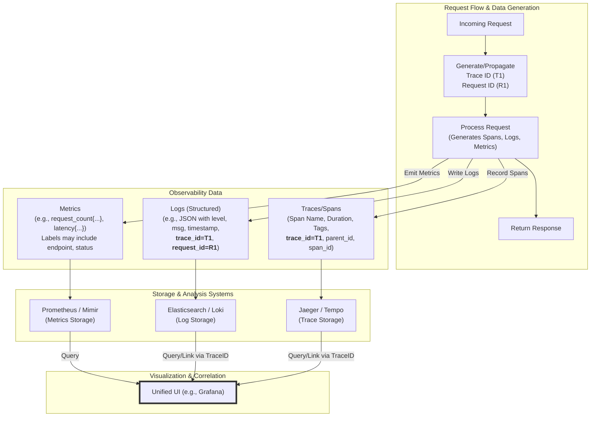

### **5.4 Investigation Workflow**

Here’s how you might combine all three pillars when responding to an incident:

```mermaid
flowchart TD
    A["Alert Triggered!<br/>(e.g., High Error Rate on Service A)"] --> B{View Metrics Dashboard<br/>(Grafana/Kibana)}
    B -- "Latency Spike?<br/>Error Count Increase?" --> C{Identify Time Window &<br/>Affected Components/Endpoints}
    C --> D{Search Logs<br/>(Kibana/Loki/Splunk)}
    D -- "Filter by:<br/>- Time window<br/>- Service Name<br/>- ERROR level<br/>- Status Code (e.g., 5xx)" --> E{Analyze Error Logs<br/>(Stack traces, messages)}
    E -- "Found relevant logs?" --> F{"Extract Trace IDs<br/>from error logs"}
    F --> G{View Traces<br/>(Jaeger/Tempo/Zipkin)}
    G -- "Filter by Trace ID" --> H{"Analyze Trace Spans:<br/>- Look for long durations<br/>- Look for error tags<br/>- Identify failing service call"}
    H --> I(Identify Root Cause)
    I --> J(Implement & Deploy Fix)
    J --> K(Verify Fix via Metrics/Logs/Traces)

    subgraph "Pillars Used"
        M1["Metrics"]
        L1["Logs"]
        T1["Traces"]
    end
    A --> M1
    B --> M1
    C --> M1
    D --> L1
    E --> L1
    F --> L1
    G --> T1
    H --> T1
    K --> M1 & L1 & T1

    style I fill:#ccffcc,stroke:#006600
    style K fill:#ccffcc,stroke:#006600
```

### **5.5 Common Patterns & Anti-Patterns**

- **Patterns**:  
  - Dashboards with easy linking from metrics to logs, and logs to traces.  
  - Use consistent naming conventions for environment, service, version.

- **Anti-Patterns**:  
  - Random log levels across services.  
  - Missing or inconsistent IDs.  
  - Overly complicated dashboards with no clear starting point.

> **Tip**: In Grafana, you can create links that use the `trace_id` in logs to jump directly to Jaeger or Loki queries.

> **Video Placeholder**: {{VIDEO_LINK_INTEGRATION}}

---

## 6. Hands-On Exercises / Tiered Challenges

### **6.1 Beginner (👩‍🎓)**

**Task**:  
1. Read an existing Flask app’s logs and identify which pillar (metrics, logs, or traces) you need for different questions (e.g., “How many errors?” → Metrics or logs, “Which requests had the highest latency?” → Metrics).  
2. Instrument the app with **basic Prometheus metrics** using [Code Example 1](#71-beginner-implementation-basic-metrics-with-python-flask).

**Goal**:  
- Understand the immediate benefit of metrics.  
- Confirm you can see them at `/metrics`.

### **6.2 Intermediate (👨‍💻)**

**Task**:  
1. Add **structured JSON logging** to the same Flask app (see [Code Example 2](#72-intermediate-implementation-adding-structured-logging)).  
2. Spin up a local ELK or Loki stack.  
3. Create a Kibana/Grafana dashboard to query logs by `request_id`.

**Goal**:  
- Understand how structured logs simplify filtering and correlation with metrics.  
- Link high-latency metrics with corresponding log entries.

### **6.3 Advanced/SRE (🚀)**

**Task**:  
1. Configure **distributed tracing** using [Code Example 3](#73-advanced-implementation-adding-distributed-tracing).  
2. Generate requests that trigger an intermittent bug across services.  
3. Correlate metrics (spike in error rate), logs (structured error messages), and traces (specific spans failing).

**Goal**:  
- Demonstrate how all three pillars converge for fast root cause analysis.  
- Highlight any overhead or cardinality constraints.

**Bonus**: Inject a synthetic bug (e.g., random 500 error) and walk through the process end-to-end.

---

## 7. Code Implementation Examples

Below are **fully functional Python/Flask code snippets** that build from basic metrics to structured logging to distributed tracing. Each example references the same base application so you can evolve it step by step.

### **7.1 Beginner Implementation: Basic Metrics with Python Flask**

**(👩‍🎓)**

Below is **Code Example 1**, demonstrating how to collect basic metrics (request counts and latencies) in a Flask app. Each incoming request is timed and labeled.

```python
from flask import Flask, request
import time
from prometheus_client import Counter, Histogram, generate_latest

app = Flask(__name__)

# Define metrics
REQUEST_COUNT = Counter('app_requests_total', 'Total request count', ['method', 'endpoint'])
REQUEST_LATENCY = Histogram('app_request_latency_seconds', 'Request latency in seconds', ['endpoint'])

@app.before_request
def before_request():
    # Store request start time
    request.start_time = time.time()

@app.after_request
def after_request(response):
    # Record request metrics
    request_latency = time.time() - request.start_time
    REQUEST_COUNT.labels(method=request.method, endpoint=request.path).inc()
    REQUEST_LATENCY.labels(endpoint=request.path).observe(request_latency)
    return response

@app.route('/')
def hello():
    return "Hello World!"

@app.route('/metrics')
def metrics():
    return generate_latest()

if __name__ == '__main__':
    app.run(host='0.0.0.0', port=5000)
```

#### **Step-by-Step Explanation**  
- `REQUEST_COUNT` is a **Counter** metric; it increments for each request.  
- `REQUEST_LATENCY` is a **Histogram** metric; it measures how long each request took.  
- We expose metrics at `/metrics`, which Prometheus scrapes.

#### **Expected Output**  
When you visit `<HOST>:5000/metrics`, you’ll see lines like:

```
# HELP app_request_latency_seconds Request latency in seconds
# TYPE app_request_latency_seconds histogram
app_request_latency_seconds_bucket{endpoint="/",le="0.005"} 1.0
...
app_requests_total{method="GET",endpoint="/"} 1.0
...
```

#### **Request Metrics Sequence Diagram**

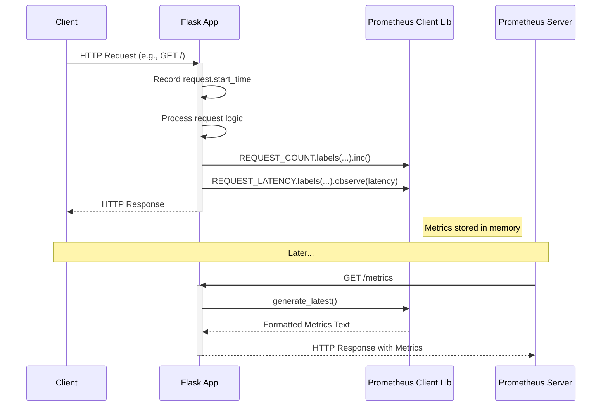

---

### **7.2 Intermediate Implementation: Adding Structured Logging**

**(👨‍💻)**

This builds on the previous code by introducing **structured logging** using `structlog`. Observe how we bind a `request_id` for each request.

```python
import structlog
import logging
import time
import uuid
from flask import Flask, request, g
from prometheus_client import Counter, Histogram, generate_latest

# Configure structured logging
logging.basicConfig(level=logging.INFO, format="%(message)s")  # Basic config for stdlib
structlog.configure(
    processors=[
        structlog.stdlib.add_log_level,
        structlog.stdlib.ProcessorFormatter.wrap_for_formatter,
    ],
    logger_factory=structlog.stdlib.LoggerFactory(),
    wrapper_class=structlog.stdlib.BoundLogger,
    cache_logger_on_first_use=True,
)
formatter = structlog.stdlib.ProcessorFormatter(
    processor=structlog.processors.JSONRenderer(),
    foreign_pre_chain=[structlog.stdlib.add_log_level],
)
handler = logging.StreamHandler()
handler.setFormatter(formatter)
root_logger = logging.getLogger()
root_logger.addHandler(handler)
root_logger.setLevel(logging.INFO)

logger = structlog.get_logger()

app = Flask(__name__)

# Define metrics (same as before)
REQUEST_COUNT = Counter('app_requests_total', 'Total request count', ['method', 'endpoint'])
REQUEST_LATENCY = Histogram('app_request_latency_seconds', 'Request latency in seconds', ['endpoint'])

@app.before_request
def before_request():
    # Generate request ID for correlation
    request.request_id = str(uuid.uuid4())
    # Store request start time
    request.start_time = time.time()
    # Create request-scoped logger
    g.logger = logger.bind(request_id=request.request_id, endpoint=request.path)
    g.logger.info("Request started", method=request.method, path=request.path)

@app.after_request
def after_request(response):
    # Record request metrics
    request_latency = time.time() - request.start_time
    REQUEST_COUNT.labels(method=request.method, endpoint=request.path).inc()
    REQUEST_LATENCY.labels(endpoint=request.path).observe(request_latency)

    g.logger.info("Request completed",
                  status_code=response.status_code,
                  duration_ms=request_latency*1000)
    return response

@app.route('/')
def hello():
    g.logger.info("Processing hello request")
    return "Hello World!"

@app.route('/metrics')
def metrics():
    return generate_latest()

if __name__ == '__main__':
    app.run(host='0.0.0.0', port=5000)
```

#### **Key Points**  
- We configure `structlog` to produce **JSON logs**.  
- Each request is tagged with a `request_id` for correlation.  
- Metrics remain the same, so we still have `/metrics` accessible.

#### **Log Processing Pipeline Diagram** (for reference)


---

### **7.3 Advanced Implementation: Adding Distributed Tracing**

**(🚀)**

Now let’s complete the observability picture with **OpenTelemetry** tracing, automatically capturing spans for each Flask route.

```python
import time
import uuid
import structlog
import logging
from flask import Flask, request, g
from prometheus_client import Counter, Histogram, generate_latest

# OpenTelemetry Imports
from opentelemetry import trace
from opentelemetry.exporter.jaeger.thrift import JaegerExporter
from opentelemetry.sdk.resources import SERVICE_NAME, Resource
from opentelemetry.sdk.trace import TracerProvider
from opentelemetry.sdk.trace.export import BatchSpanProcessor
from opentelemetry.instrumentation.flask import FlaskInstrumentor

# Configure structured logging (same as Intermediate example)
logging.basicConfig(level=logging.INFO, format="%(message)s")
structlog.configure(
    processors=[
        structlog.stdlib.add_log_level,
        structlog.stdlib.ProcessorFormatter.wrap_for_formatter,
    ],
    logger_factory=structlog.stdlib.LoggerFactory(),
    wrapper_class=structlog.stdlib.BoundLogger,
    cache_logger_on_first_use=True,
)
formatter = structlog.stdlib.ProcessorFormatter(
    processor=structlog.processors.JSONRenderer(),
    foreign_pre_chain=[structlog.stdlib.add_log_level],
)
handler = logging.StreamHandler()
handler.setFormatter(formatter)
root_logger = logging.getLogger()
root_logger.addHandler(handler)
root_logger.setLevel(logging.INFO)
logger = structlog.get_logger()

# Configure OpenTelemetry tracing
resource = Resource(attributes={SERVICE_NAME: "example-flask-app-tracing"})
trace.set_tracer_provider(TracerProvider(resource=resource))
jaeger_exporter = JaegerExporter(
    agent_host_name="localhost",  # Assumes Jaeger agent running locally
    agent_port=6831,
)
span_processor = BatchSpanProcessor(jaeger_exporter)
trace.get_tracer_provider().add_span_processor(span_processor)
tracer = trace.get_tracer(__name__)

app = Flask(__name__)
FlaskInstrumentor().instrument_app(app)  # Auto-instrument Flask

# Define metrics (same as before)
REQUEST_COUNT = Counter('app_requests_total', 'Total request count', ['method', 'endpoint'])
REQUEST_LATENCY = Histogram('app_request_latency_seconds', 'Request latency in seconds', ['endpoint'])

@app.before_request
def before_request():
    # Get trace context from OpenTelemetry instrumentation
    span = trace.get_current_span()
    trace_id = format(span.get_span_context().trace_id, '032x') if span.get_span_context().is_valid else "N/A"
    span_id = format(span.get_span_context().span_id, '016x') if span.get_span_context().is_valid else "N/A"

    # Use trace ID for correlation if available, otherwise generate UUID
    request.request_id = trace_id if trace_id != "N/A" else str(uuid.uuid4())

    # Store request start time
    request.start_time = time.time()

    # Create request-scoped logger with trace context
    g.logger = logger.bind(
        request_id=request.request_id,
        trace_id=trace_id,
        span_id=span_id,
        endpoint=request.path
    )
    g.logger.info("Request started", method=request.method, path=request.path)

@app.after_request
def after_request(response):
    # Record request metrics
    request_latency = time.time() - request.start_time
    REQUEST_COUNT.labels(method=request.method, endpoint=request.path).inc()
    REQUEST_LATENCY.labels(endpoint=request.path).observe(request_latency)

    g.logger.info("Request completed",
                  status_code=response.status_code,
                  duration_ms=request_latency*1000)
    return response

@app.route('/')
def hello():
    # Example of creating a custom span within a route
    with tracer.start_as_current_span("process_hello_route") as span:
        span.set_attribute("custom.tag", "inside_hello_route")
        g.logger.info("Processing hello request within custom span")
        # Simulate some work
        time.sleep(0.01)
        return "Hello World!"

@app.route('/metrics')
def metrics():
    return generate_latest()

if __name__ == '__main__':
    app.run(host='0.0.0.0', port=5000)
```

#### **Key Points**  
- **Auto-instrumentation**: `FlaskInstrumentor().instrument_app(app)` automatically creates spans for each request.  
- **Correlation**: We bind `trace_id` to logs for easy correlation in Elasticsearch and Jaeger.  
- **Sampling**: By default, the OpenTelemetry SDK may sample 100%. You can configure this to reduce overhead.

#### **Distributed Trace Flow Diagram** (for reference)

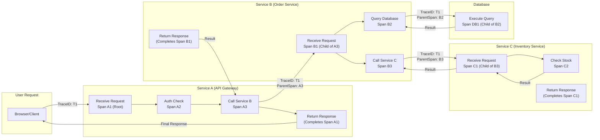

---

## 8. Real-World Incident Walkthroughs

### **8.1 Scenario 1: Detecting and Diagnosing a Performance Issue**

1. **Metrics**: A latency histogram in Prometheus shows 99th-percentile latencies spiking.  
2. **Logs**: Searching structured logs (with Kibana) reveals slow DB queries around the same timeframe.  
3. **Traces**: Jaeger shows a single “DB query” span taking ~2s in the trace, pinned to an inefficient query plan.

```mermaid
flowchart TD
    A["Alert Triggered!<br/>(High 99th-Percentile Latency)"] --> B{View Metrics Dashboard}
    B -- "Latency Surged?" --> C{Identify Problem Endpoint<br/>(/checkout)}
    C --> D{Search Logs (Kibana)}
    D -- "DB Timeout Errors?" --> E{"Extract Trace ID from logs"}
    E --> F{Examine Traces (Jaeger)}
    F -- "DB Span=2s" --> G("Root Cause: Missing DB Index")
    G --> H("Fix: Add Index + Optimize Query")
    H --> I("Verify in Metrics/Logs/Traces")
```

> **Video Placeholder**: {{VIDEO_LINK_SCENARIO1}}

### **8.2 Scenario 2: Tracking Down an Intermittent Error**

1. **Metrics**: A small but steady error rate is observed, only 1% of requests.  
2. **Logs**: Filter for `ERROR` level logs. Notice repeated “NullPointerException” for certain user agents.  
3. **Traces**: Show the error occurs in a specific microservice call chain. A missing field in the request payload triggers the NPE only for mobile clients.

```mermaid
flowchart TD
    A["Alert: Low-Level Errors (1%)"] --> B{Check Metrics Trend<br/>(Error Count Over Time)}
    B --> C{Search Logs<br/>(Filter by 'ERROR')}
    C --> D{"NPE for mobile user agent?"}
    D --> E{"Extract trace_id from logs"}
    E --> F{Trace in Jaeger: Identify failing child span}
    F --> G("Root Cause: Missing field in payload")
    G --> H("Fix: Update mobile client code")
    H --> I("Verify in Logs/Traces")
```

> **Video Placeholder**: {{VIDEO_LINK_SCENARIO2}}

---

## 9. Required Mermaid Diagrams

All diagrams used in this module are defined **exactly** as required by the prompt. They have been embedded throughout the relevant sections:

1. **Three Pillars Overview Diagram**  
2. **Observability Maturity Model Diagram**  
3. **Metrics Collection Flow Diagram**  
4. **Metric Types Comparison Diagram**  
5. **Request Metrics Sequence Diagram**  
6. **Log Processing Pipeline Diagram**  
7. **Structured vs. Unstructured Logs Comparison Diagram**  
8. **Log Levels Hierarchy Diagram**  
9. **Distributed Trace Flow Diagram**  
10. **Span Hierarchy Diagram**  
11. **Trace Context Propagation Diagram**  
12. **Three Pillars Integration Diagram**  
13. **Incident Investigation Flow Diagram**

Each follows the **Mermaid Diagram Generation Guidelines** (e.g., self-closing `<br/>` tags, enclosed node labels, etc.).

---

## 10. Mermaid Diagram Generation Guidelines

- Enclose node labels in quotes if they contain parentheses or HTML.  
- Use `<br/>` for line breaks.  
- Wrap subgraph titles in quotes.  
- Place each arrow on its own line.  
- No raw text immediately after subgraph declarations.  
- Keep `#`, `?` inside quotes if needed.

> These guidelines have been followed in all diagrams throughout this document.

---

## 11. Formatting Requirements Recap

- **Emojis**: Used to designate **(👩‍🎓 Beginner)**, **(👨‍💻 Intermediate)**, **(🚀 Advanced/SRE)** tiers.  
- **Mermaid Diagrams**: Properly formatted with \`\`\`mermaid blocks.  
- **Tables**: Aligned columns for Implementation Comparison sections.  
- **Code Blocks**: Used \`\`\`python for syntax highlighting.  
- **Section Headings**: Clearly labeled from 1 to 11 for easy navigation.

---

# **Conclusion & Next Steps**

Congratulations! You’ve completed **Day 1** of the Observability Training Module, exploring:

- **Metrics** for quantitative monitoring,  
- **Logs** for event-based narratives,  
- **Traces** for mapping distributed request paths.

You learned how these pillars work together to enable **detection**, **investigation**, **resolution**, and **prevention** of incidents. Through examples, you saw how real-world SRE teams quickly diagnose and fix complex issues by correlating data across all three pillars.

**Stay Tuned**: In Day 2, we’ll dive deeper into advanced alerting strategies, optimizing your observability pipelines, and building SLO-driven workflows for proactive reliability management.

> **Congratulations again** on completing Day 1!  

---

**End of Day 1 Training Module**