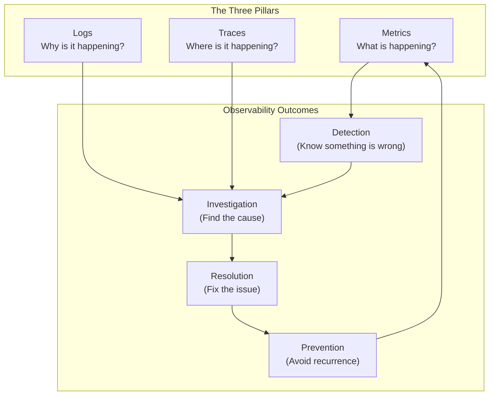
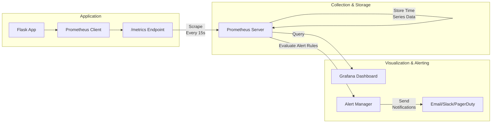
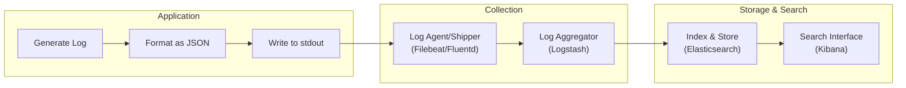
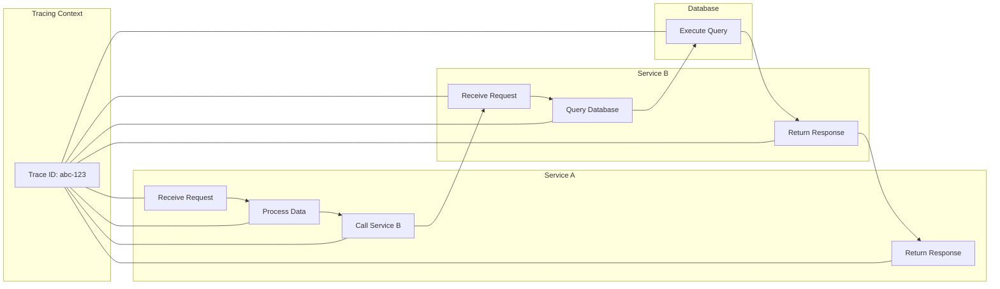
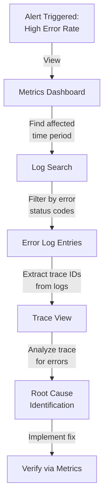
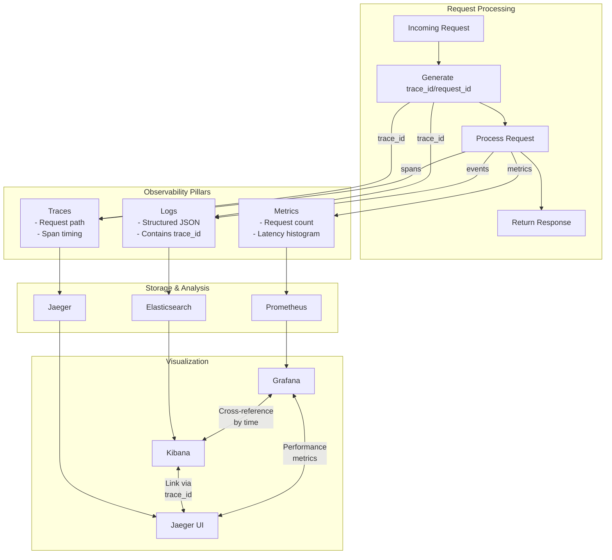

Below is a **Day 1 Observability Training Module** that follows the instructions in **day-1-sre-concepts-prompt-v1.1.md**. It uses a “brick-by-brick” approach, addresses each observability pillar (metrics, logs, and traces) with tiered depth, and provides horror stories, visuals, code examples, and hands-on exercises.

---

# **Day 1 SRE Training Module: The Three Pillars of Observability**

## 1. Introduction: Observability 101

Observability is your system’s ability to answer questions about its internal states by examining the data it generates. We often use the “Three Pillars” metaphor—**metrics**, **logs**, and **traces**—to collect, connect, and interpret these data signals. Below is a practical framework for understanding observability:

### **“Observe, Test, Evaluate, Take Action”**

1. **Observe**: Gather telemetry (metrics, logs, and traces) to see **what** is happening in your system.  
2. **Test**: Form and test hypotheses about system behavior or incidents.  
3. **Evaluate**: Distill your findings from telemetry to isolate root causes or confirm normal operation.  
4. **Take Action**: Fix issues, tune performance, or strengthen the system’s architecture based on insights.

### **Monitoring vs. Observability**
- **Monitoring** typically answers, “Is my system running within known limits?” It uses predefined alerts and thresholds.  
- **Observability** goes further: it equips you to explore unknown failures by providing enough data to ask—and answer—unforeseen questions.

### **Overview of the Three Pillars**
1. **Metrics**: Quantify system behavior (throughput, latency, CPU usage, etc.).  
2. **Logs**: Record discrete events with contextual details.  
3. **Traces**: Map requests through distributed systems, showing how each service call connects.

Below is a Mermaid diagram that illustrates these pillars and their relationship to incident outcomes:



### **Real-World Incident Scenario**

> **Scenario**: A payment service experiences random timeouts. Without structured logs, the team can’t pinpoint the root cause. Metrics only show throughput is dropping, but no direct cause. Finally, by adding traces, they discover a hidden circular call causing deadlocks. Within hours, they fix the call chain and prevent further revenue loss.

### **Learning Objectives**

Each pillar can be explored at three levels: **🔍 Beginner**, **🧩 Intermediate**, and **💡 Advanced/SRE**.

- **🔍 Beginner**  
  1. Recognize the difference between monitoring and observability.  
  2. Understand what metrics, logs, and traces each represent.  
  3. Know basic terminology (counter, log level, span).  
  4. Be able to instrument a simple application for a single pillar.

- **🧩 Intermediate**  
  1. Implement standard best practices (structured logs, Prometheus metrics, basic tracing).  
  2. Use visualization tools (Grafana, Kibana, Jaeger) to investigate performance issues.  
  3. Correlate basic logs with metrics for more thorough problem-solving.  
  4. Understand fundamentals of distributed tracing context propagation.

- **💡 Advanced/SRE**  
  1. Design multi-pillar observability strategies with alerting that minimizes false positives.  
  2. Tackle cardinality issues and high-volume logging.  
  3. Implement distributed tracing with sampling to optimize cost and performance.  
  4. Build integrated dashboards and workflows that show the full lifecycle of a request.

> **Video Placeholder**: {{VIDEO_LINK_INTRO}}

---

## 2. Core Concept: Metrics (The Quantified View)

Metrics provide **quantitative** insights: they track numerical data (throughput, latency, resource usage) over time.

### **🔍 Beginner**

- **Analogy**: Think of your car dashboard. Speed, RPM, and fuel gauge are “metrics” telling you at a glance how your car is performing.  
- **Types**:  
  - **Counters**: Always increase (e.g., total requests served).  
  - **Gauges**: Measure a value at a single point in time (e.g., current CPU usage).  
  - **Histograms**: Distributions of values (e.g., response latency).

### **🧩 Intermediate**

- **Implementation**: Tools like **Prometheus** (scrapes metrics endpoints), **Datadog** or **InfluxDB** (time-series platforms).  
- **Visualization**: Grafana dashboards to monitor your system’s health.  
- **Methods**:  
  - **RED** (Rate, Errors, Duration) for microservices.  
  - **USE** (Utilization, Saturation, Errors) for resource monitoring.

### **💡 Advanced/SRE**

- **Cardinality**: High-cardinality labels can inflate metric storage.  
- **Alerting Strategies**: Combine multiple signals (e.g., error rate + latency) to reduce noise.  
- **System Impact**: Over-collecting can burden your system.

### **Metrics Collection Flow Diagram**



### **Implementation Comparison (Metrics)**

| **Platform**   | **Key Strength**                                 | **Use Case**                         |
|----------------|--------------------------------------------------|--------------------------------------|
| **Prometheus** | Open-source, Kubernetes-friendly, flexible queries| Cloud-native microservices           |
| **Datadog**    | Hosted SaaS, easy setup, full-stack visibility    | Quick start, enterprise integrated   |
| **InfluxDB**   | Specialized time-series DB with TICK stack        | High-volume metric ingestion         |

### **Metrics Horror Story**

> **Context**: A new microservice at peak traffic.  
> **Symptom**: Sporadic CPU spikes cause slow response times. Only “requests/sec” were tracked, so no direct insight on CPU usage.  
> **Discovery**: After adding CPU and memory metrics, the team saw CPU usage was hitting 100% under bursts of requests.  
> **Resolution**: Autoscaling rules and CPU-limiting strategies restored stable performance.  

> **Video Placeholder**: {{VIDEO_LINK_METRICS}}

---

## 3. Core Concept: Logs (The Narrative Thread)

Logs are **event-based** records that describe what happened at specific points in time.

### **🔍 Beginner**

- **Analogy**: A personal journal or ship’s log. Each entry describes an event in chronological order.  
- **Log Levels**: Common levels are `DEBUG`, `INFO`, `WARN`, `ERROR`, and `CRITICAL` (or `FATAL`). Use them consistently.

### **🧩 Intermediate**

- **Structured Logging**: Capture logs in a consistent JSON format with fields (e.g., `timestamp`, `request_id`, `user_id`), making them easier to search/parse.  
- **Log Aggregation**: Tools like Filebeat, Logstash, or Fluentd to centralize logs (e.g., into Elasticsearch/Kibana).

### **💡 Advanced/SRE**

- **Correlation with Metrics/Traces**: Use a common ID (like `trace_id`) in logs for deeper analysis.  
- **Performance Considerations**: Large volumes of logs can be expensive to store and process.  
- **Security**: Ensure no sensitive PII or credentials are logged in plaintext.

### **Log Processing Pipeline Diagram**



### **Implementation Comparison (Logs)**

| **Platform**   | **Key Strength**                     | **Use Case**                         |
|----------------|--------------------------------------|--------------------------------------|
| **ELK Stack**  | Open-source, flexible, large ecosystem| Custom or self-managed deployments   |
| **Splunk**     | Advanced enterprise search/analytics  | Large-scale corporate environments   |
| **Graylog**    | Easy-to-use UI, open-core approach    | Medium-sized teams, faster start-up  |

### **Logs Horror Story**

> **Context**: A login service showing high error rates.  
> **Symptom**: Engineers see 500 Internal Server Errors but can’t figure out why.  
> **Discovery**: Switching from raw text logs to structured JSON revealed an “InvalidTokenException” repeating for specific user sessions.  
> **Resolution**: The team corrected the token refresh logic, preventing further authentication failures.

> **Video Placeholder**: {{VIDEO_LINK_LOGS}}

---

## 4. Core Concept: Traces (The Request’s Journey)

Traces capture how a single request travels across multiple services, allowing you to see the **“where”** of a bottleneck or failure.

### **🔍 Beginner**

- **Analogy**: A GPS route for your road trip. Each “span” is one segment of the journey, with start/end times.  
- **Key Terms**: **Trace ID**, **Span**, **Parent-Child relationships**.

### **🧩 Intermediate**

- **Context Propagation**: Each service in the request path must pass along the same **trace_id** so the entire journey is visible.  
- **Visualization**: Tools like **Jaeger** or **Zipkin** provide an interactive timeline of spans.

### **💡 Advanced/SRE**

- **Sampling Strategies**: For high-volume systems, you may not trace every request.  
- **Overhead**: Instrumentation can slow down your application if not carefully tuned.  
- **Complex Debugging**: Use cross-service traces to resolve concurrency issues, race conditions, etc.

### **Distributed Trace Flow Diagram**



### **Implementation Comparison (Traces)**

| **Platform**    | **Key Strength**                  | **Use Case**                                  |
|-----------------|-----------------------------------|-----------------------------------------------|
| **Jaeger**      | CNCF project, built for microservices | Kubernetes and cloud-native tracing          |
| **Zipkin**      | Lightweight, easy setup           | Smaller or simpler distributed systems        |
| **AWS X-Ray**   | AWS-native, integrated with other AWS services | Cloud-based deployments on AWS     |

### **Traces Horror Story**

> **Context**: A microservices setup with occasional “gateway timeout” errors.  
> **Symptom**: Simple logs show timeouts, but no clear cause. Metrics show random spikes.  
> **Discovery**: Distributed tracing reveals a circular dependency loop: Service A calls Service B, which calls Service A in certain edge cases.  
> **Resolution**: The team re-architects the call chain, removing the cyclical call. Timeouts disappear.

> **Video Placeholder**: {{VIDEO_LINK_TRACES}}

---

## 5. Integrating the Three Pillars

Real-world issues often require **all three** pillars. Metrics might tell you *something* is off, logs can guide you to *why*, and traces reveal *where* in a distributed system the breakdown occurs.

### **Decision Framework for Implementation**

1. **System Complexity**: For a large microservice environment, you’ll need all three pillars to keep track of complex interactions.  
2. **Data Volume & Budget**: Storing logs can be expensive; sampling traces can reduce overhead.  
3. **Team Maturity**: Start with robust metrics and logs. Add tracing once the team is comfortable with instrumentation.

### **Correlating the Pillars**

- **Shared IDs**: Include a `trace_id` or `request_id` in logs and metrics tags.  
- **Timestamps**: Align logs, metric timestamps, and trace spans to facilitate cross-referencing.

### **Incident Investigation Workflow**

Below is an example of using all three pillars in a single investigative path:



### **Three Pillars Integration Diagram**



> **Video Placeholder**: {{VIDEO_LINK_INTEGRATION}}

---

## 6. Hands-On Exercises / Tiered Challenges

### **🔍 Beginner Exercise**  
- **Scenario**: Your Flask application responds slowly to some requests.  
- **Task**:  
  1. Implement basic Prometheus metrics for request counting and latency.  
  2. Run the application under a simple load test.  
  3. Observe changes in the `/metrics` endpoint.  
- **Success Criteria**: You can see counters incrementing and latency histograms adjusting with traffic load.

### **🧩 Intermediate Exercise**  
- **Scenario**: After adding metrics, you see spikes in `500` errors.  
- **Task**:  
  1. Add structured JSON logging to the Flask application.  
  2. Aggregate logs in a local ELK stack.  
  3. Search for all `ERROR` logs within a certain time window.  
- **Success Criteria**: You can pinpoint the top errors, correlated with your metric spikes.

### **💡 Advanced/SRE Exercise**  
- **Scenario**: You now have two microservices. Error logs indicate intermittent failures crossing service boundaries.  
- **Task**:  
  1. Configure distributed tracing using OpenTelemetry and Jaeger.  
  2. Generate load to reproduce intermittent failures.  
  3. Use the Jaeger UI to identify which service call is failing and how often.  
- **Success Criteria**: You can trace problematic requests across both services, isolate the error path, and propose or implement a fix.

---

## 7. Code Implementation Examples

Below are three progressively richer code snippets in Python/Flask, demonstrating how to add each observability pillar.

### **1. Beginner Implementation: Basic Metrics with Python Flask**

```python
from flask import Flask, request
import time
from prometheus_client import Counter, Histogram, generate_latest

app = Flask(__name__)

# Define metrics
REQUEST_COUNT = Counter('app_requests_total', 'Total request count', ['method', 'endpoint'])
REQUEST_LATENCY = Histogram('app_request_latency_seconds', 'Request latency in seconds', ['endpoint'])

@app.before_request
def before_request():
    # Store request start time
    request.start_time = time.time()

@app.after_request
def after_request(response):
    # Record request metrics
    request_latency = time.time() - request.start_time
    REQUEST_COUNT.labels(method=request.method, endpoint=request.path).inc()
    REQUEST_LATENCY.labels(endpoint=request.path).observe(request_latency)
    return response

@app.route('/')
def hello():
    return "Hello World!"

@app.route('/metrics')
def metrics():
    return generate_latest()

if __name__ == '__main__':
    app.run(host='0.0.0.0', port=5000)
```

### **2. Intermediate Implementation: Adding Structured Logging**

```python
import structlog
import logging
import time
import uuid
from flask import Flask, request, g
from prometheus_client import Counter, Histogram, generate_latest

# Configure structured logging
logging.basicConfig(level=logging.INFO)
structlog.configure(
    processors=[
        structlog.stdlib.add_log_level,
        structlog.processors.TimeStamper(fmt="iso"),
        structlog.processors.JSONRenderer()
    ],
    logger_factory=structlog.stdlib.LoggerFactory(),
)

logger = structlog.get_logger()
app = Flask(__name__)

# Define metrics (same as before)
REQUEST_COUNT = Counter('app_requests_total', 'Total request count', ['method', 'endpoint'])
REQUEST_LATENCY = Histogram('app_request_latency_seconds', 'Request latency in seconds', ['endpoint'])

@app.before_request
def before_request():
    # Generate request ID for correlation
    request.request_id = str(uuid.uuid4())
    request.start_time = time.time()
    # Create request-scoped logger
    g.logger = logger.bind(request_id=request.request_id, endpoint=request.path)
    g.logger.info("Request started", method=request.method, path=request.path)

@app.after_request
def after_request(response):
    request_latency = time.time() - request.start_time
    REQUEST_COUNT.labels(method=request.method, endpoint=request.path).inc()
    REQUEST_LATENCY.labels(endpoint=request.path).observe(request_latency)
    
    g.logger.info("Request completed", 
                 status_code=response.status_code, 
                 duration_ms=request_latency*1000)
    return response

@app.route('/')
def hello():
    g.logger.info("Processing hello request")
    return "Hello World!"

@app.route('/metrics')
def metrics():
    return generate_latest()

if __name__ == '__main__':
    app.run(host='0.0.0.0', port=5000)
```

### **3. Advanced Implementation: Adding Distributed Tracing**

```python
import time
import uuid
import structlog
import logging
from flask import Flask, request, g
from prometheus_client import Counter, Histogram, generate_latest
from opentelemetry import trace
from opentelemetry.exporter.jaeger.thrift import JaegerExporter
from opentelemetry.sdk.resources import SERVICE_NAME, Resource
from opentelemetry.sdk.trace import TracerProvider
from opentelemetry.sdk.trace.export import BatchSpanProcessor
from opentelemetry.instrumentation.flask import FlaskInstrumentor

# Configure structured logging (same as before)
logging.basicConfig(level=logging.INFO)
structlog.configure(
    processors=[
        structlog.stdlib.add_log_level,
        structlog.processors.TimeStamper(fmt="iso"),
        structlog.processors.JSONRenderer()
    ],
    logger_factory=structlog.stdlib.LoggerFactory(),
)
logger = structlog.get_logger()

# Configure OpenTelemetry tracing
resource = Resource(attributes={SERVICE_NAME: "example-flask-app"})
trace.set_tracer_provider(TracerProvider(resource=resource))
jaeger_exporter = JaegerExporter(
    agent_host_name="localhost",
    agent_port=6831,
)
span_processor = BatchSpanProcessor(jaeger_exporter)
trace.get_tracer_provider().add_span_processor(span_processor)
tracer = trace.get_tracer(__name__)

app = Flask(__name__)
FlaskInstrumentor().instrument_app(app)

# Define metrics (same as before)
REQUEST_COUNT = Counter('app_requests_total', 'Total request count', ['method', 'endpoint'])
REQUEST_LATENCY = Histogram('app_request_latency_seconds', 'Request latency in seconds', ['endpoint'])

@app.before_request
def before_request():
    # Get trace context
    span = trace.get_current_span()
    trace_id = format(span.get_span_context().trace_id, '032x')
    span_id = format(span.get_span_context().span_id, '016x')
    
    # Use trace_id as request_id
    request.request_id = trace_id
    request.start_time = time.time()
    
    g.logger = logger.bind(
        request_id=request.request_id,
        trace_id=trace_id,
        span_id=span_id,
        endpoint=request.path
    )
    g.logger.info("Request started", method=request.method, path=request.path)

@app.after_request
def after_request(response):
    request_latency = time.time() - request.start_time
    REQUEST_COUNT.labels(method=request.method, endpoint=request.path).inc()
    REQUEST_LATENCY.labels(endpoint=request.path).observe(request_latency)
    
    g.logger.info("Request completed", 
                 status_code=response.status_code, 
                 duration_ms=request_latency*1000)
    return response

@app.route('/')
def hello():
    with tracer.start_as_current_span("process_hello") as span:
        span.set_attribute("custom.tag", "example")
        g.logger.info("Processing hello request")
        # Simulate some work
        time.sleep(0.01)
        return "Hello World!"

@app.route('/metrics')
def metrics():
    return generate_latest()

if __name__ == '__main__':
    app.run(host='0.0.0.0', port=5000)
```

---

## 8. Real-World Scenarios

### **Scenario 1: Detecting and Diagnosing a Performance Issue**

1. **Problem**: An API endpoint slows down under load, but error counts remain normal.  
2. **Metrics**: You see a spike in 95th and 99th percentile latency.  
3. **Logs**: Reveal many entries about external API timeouts.  
4. **Traces**: Confirm that a specific external call is delayed under certain load conditions.  
5. **Solution**: Add caching or asynchronous logic to mitigate the bottleneck.

### **Scenario 2: Tracking Down an Intermittent Error**

1. **Problem**: You see random “500” errors in your e-commerce service but can’t reproduce them locally.  
2. **Logs**: Pinpoint that the same `request_id` is always associated with a discount service call.  
3. **Metrics**: Indicate a small spike in error counts around the discount logic.  
4. **Traces**: Show that the discount service occasionally receives malformed data from the frontend.  
5. **Solution**: Fix data validation in the frontend, drastically reducing “500” errors in the discount service.

---

# **Wrap-Up and Next Steps**

- **Metrics** provide numerical trends, **logs** give descriptive details, and **traces** stitch together complex service interactions.  
- Together, these pillars allow you to **detect**, **investigate**, **resolve**, and **prevent** production incidents effectively.  
- By completing the hands-on exercises, you gain practical experience implementing each pillar incrementally.  
- On Day 2, you’ll deepen your knowledge: advanced alerting, scaling observability pipelines, and best practices for production readiness.

> **Congratulations** on completing Day 1. You now have the building blocks to develop a robust observability culture in your environment.

---

**End of Day 1 Observability Training Module**