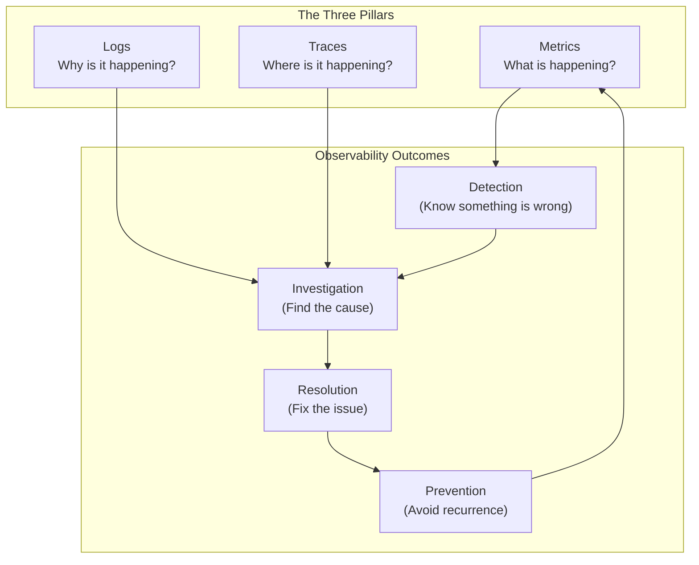
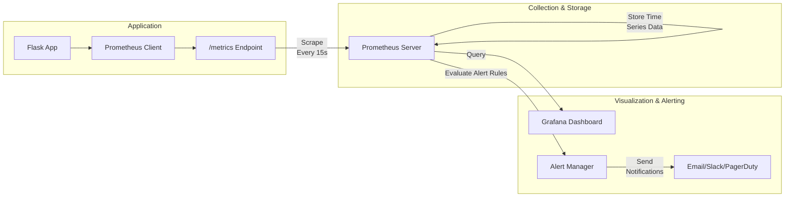
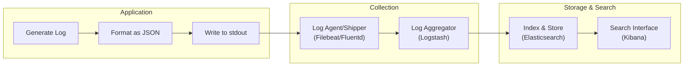
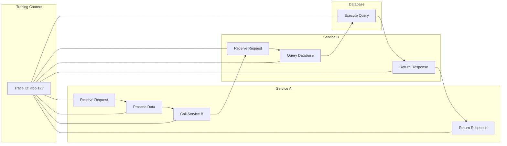
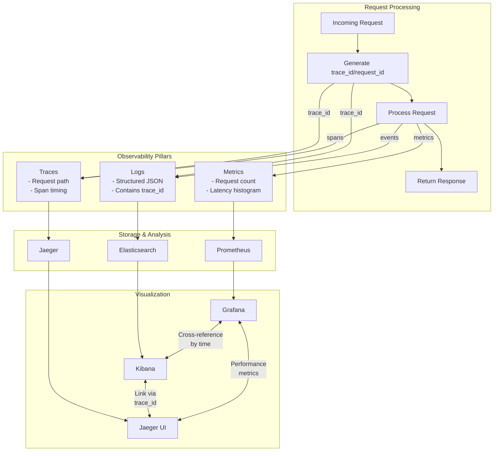

Below is a **Day 1 Observability Training Module** that follows the prompt’s guidelines. It uses a narrative-driven, incident-centric approach; introduces each pillar (metrics, logs, traces) with a “horror story” format; and progressively builds toward a final “War Room Simulation.” The fictional company “TechNow” anchors all examples, with recurring characters to make learning tangible, empathetic, and fun.

---
# **Day 1 SRE Training Module: The Three Pillars of Observability**

## 1. Introduction: Observability 101

Welcome to your first day of observability training! We’ll explore why metrics, logs, and traces (the “Three Pillars”) are integral to running modern, high-availability systems. Along the way, we’ll follow the story of “TechNow,” a fictional e-commerce startup navigating real-world operational challenges.

### **Incident Story: A Painful Launch-Day Outage**

> **Setting:** TechNow is gearing up for a major product launch with heavy promotion. The site traffic suddenly triples.  
> **Crisis:** Customers begin complaining that pages won’t load. The marketing team is in panic mode. The on-call engineer, Avery, scrambles to find out what’s wrong, but only basic uptime monitoring is in place—no real metrics, no structured logs, and no distributed tracing.  
> **Confusion:** Because there’s no detailed observability, Avery can’t pinpoint the issue. All they see is that the server is “up” but responding slowly. Meanwhile, complaints keep rolling in.  
> **Discovery:** Eventually, after hours of manual log digging, Avery identifies a database connection limit issue and restarts the service, but the brand damage is already done.  
> **Lesson:** Had TechNow invested in observability, engineers could have discovered the database bottleneck in minutes instead of hours.  

From this story, we see how important it is not just to monitor a service’s “heartbeat,” but to have thorough insights into *what*, *why*, and *where* something is happening.

### **“Observe, Test, Evaluate, Take Action”**  
Observability is about:
1. **Observe**: Collecting and examining telemetry data (metrics, logs, traces).  
2. **Test**: Applying queries and analysis to validate or refute hypotheses about system behavior.  
3. **Evaluate**: Distilling the data to find potential causes of issues.  
4. **Take Action**: Fixing or tuning your systems based on what you learn.

### **Monitoring vs. Observability**

- **Monitoring**: Typically focuses on known problems with predefined alerts (e.g., “CPU usage above 90%”).  
- **Observability**: Helps you explore *unknown unknowns* by gathering enough data and context to debug novel issues.

### **Three Pillars Overview**  
1. **Metrics**: High-level quantitative data about system performance.  
2. **Logs**: Chronological records detailing discrete events.  
3. **Traces**: End-to-end paths showing how requests flow through complex systems.

Below is a conceptual diagram of how these pillars fit together:



### **Learning Objectives**

- **🔍 Beginner**  
  1. Understand key differences between monitoring and observability  
  2. Explain the purpose of metrics, logs, and traces  
  3. Identify the basic tools for collecting each pillar  
  4. Recognize how each pillar helps with incident resolution  

- **🧩 Intermediate**  
  1. Configure and deploy basic observability tools (Prometheus, ELK, Jaeger)  
  2. Interpret real-world incidents and map them to metrics, logs, or traces  
  3. Build structured logs and correlate them with metrics  
  4. Begin exploring trace context propagation  

- **💡 Advanced/SRE**  
  1. Implement advanced alerting and reduce alert fatigue  
  2. Optimize and scale observability pipelines (handling cardinality, large data volumes)  
  3. Use distributed tracing to troubleshoot complex microservices  
  4. Integrate all three pillars for a comprehensive incident response framework  

> **Video Placeholder**: {{VIDEO_LINK_INTRO}}

---

## 2. Core Concept: Metrics (The Quantified View)

Metrics are your first line of defense: they quantify what’s happening in your system at a glance. They can tell you if your CPU usage is spiking or if request latencies have doubled. Metrics form the foundation of alerting and basic performance dashboards.

### **Incident First: The Great Checkout Lag**

> **Setting:** TechNow recently launched a new checkout service to streamline purchases.  
> **Crisis:** Customers report extremely slow checkout times. Sales start dropping, and TechNow can’t figure out why.  
> **Confusion:** There are no alerting thresholds set on checkout latencies. The existing dashboards only show “total requests” and “errors,” which remain normal.  
> **Discovery:** By introducing request latency metrics, the team notices that the median latency is low, but the 95th and 99th percentiles are huge (high outlier latencies). This reveals a few very slow requests.  
> **Resolution:** The slow requests turn out to be linked to a user-specific discount calculation that calls an external API. The team caches these API responses, drastically improving high-percentile performance.  
> **Lesson:** Metrics helped the TechNow team see what was really happening across different percentiles—a crucial insight they missed by only looking at average values.

### **Metrics Basics**

- **🔍 Beginner**  
  - **Analogy**: A car dashboard with your speedometer, fuel gauge, and engine temperature.  
  - **Types**:
    - **Counters**: Accumulate over time (e.g., number of requests).  
    - **Gauges**: Measure a value at a specific time (e.g., CPU usage).  
    - **Histograms**: Track distributions (e.g., request latency).  

- **🧩 Intermediate**  
  - **Implementation**: Prometheus or similar systems for metric collection.  
  - **Visualization**: Create performance and resource dashboards (Grafana).  
  - **Methods**:
    - **RED** (Rate, Errors, Duration) for microservices.  
    - **USE** (Utilization, Saturation, Errors) for system resources.  

- **💡 Advanced/SRE**  
  - **Cardinality**: Watch out for labels that explode metric counts (e.g., per-user metrics).  
  - **Alerting**: Use sophisticated alert rules to avoid false positives (e.g., combine multiple signals).  
  - **System Impact**: Understand overhead for collecting and storing high volumes of metrics.

### **Metrics Collection Flow Diagram**



### **Implementation Comparison (Metrics)**

| **Platform**  | **Key Strength**             | **Use Case**                                 |
|---------------|------------------------------|----------------------------------------------|
| **Prometheus** | Built for cloud-native, flexible queries | Kubernetes & microservices monitoring       |
| **Datadog**   | Hosted, full-stack solution | Quick start, all-in-one SaaS                 |
| **InfluxDB**  | Time-series focus, TICK stack| Specialized for high-volume time-series data |

> **Video Placeholder**: {{VIDEO_LINK_METRICS}}

---

## 3. Core Concept: Logs (The Narrative Thread)

Logs capture *why* events happened by providing human-readable records of system activities. Logs are crucial for debugging deeper issues that metrics alone can’t explain.

### **Incident First: The Mysterious Payment Failures**

> **Setting:** Right after fixing the checkout lag, TechNow experiences a wave of payment failures with no error metrics triggered.  
> **Crisis:** The user-facing error is ambiguous. The payment gateway is returning an odd status code that no one has documented.  
> **Confusion:** TechNow’s logs are unstructured text scattered across multiple servers. Searching for the gateway’s error code is painful.  
> **Discovery:** By introducing structured logging with consistent fields (e.g., “payment_status”), the team quickly zeroes in on the root cause: a misconfigured authentication token.  
> **Resolution:** Correct the token in the environment variables.  
> **Lesson:** Well-structured logs with a consistent schema dramatically reduce time-to-diagnosis.

### **Logs Basics**

- **🔍 Beginner**  
  - **Analogy**: A travel journal listing daily events in chronological order.  
  - **Log Levels**: `DEBUG`, `INFO`, `WARN`, `ERROR`, `CRITICAL`. Keep them consistent.  

- **🧩 Intermediate**  
  - **Structured JSON Logs**: Use a clear schema (e.g., `timestamp`, `request_id`, `error_code`).  
  - **Log Aggregation**: Tools like Filebeat/Fluentd to ship logs to ELK (Elasticsearch, Logstash, Kibana).  

- **💡 Advanced/SRE**  
  - **Correlation with Metrics**: Link logs to metric anomalies (e.g., same timeframe or request IDs).  
  - **Log Query Performance**: Plan for high ingest volumes.  
  - **Security & Compliance**: Mask sensitive data in logs.

### **Log Processing Pipeline Diagram**



### **Implementation Comparison (Logs)**

| **Platform**    | **Key Strength**                  | **Use Case**                           |
|-----------------|-----------------------------------|----------------------------------------|
| **ELK Stack**   | Open-source, flexible, large ecosystem | Building custom solutions in-house    |
| **Splunk**      | Powerful enterprise search & analytics | Large-scale corporate environments    |
| **Graylog**     | Simplified UI, open-core approach | Medium-sized teams wanting quick start |

> **Video Placeholder**: {{VIDEO_LINK_LOGS}}

---

## 4. Core Concept: Traces (The Request’s Journey)

Traces allow you to see *where* in a distributed system an issue occurs by tagging and timing each step of a request’s path.

### **Incident First: The Intermittent “White Screen” Bug**

> **Setting:** TechNow’s front end and back end are now separated into microservices, each calling another.  
> **Crisis:** Users randomly encounter a “white screen” with no content, but it’s inconsistent. Metrics show occasional spikes in error rate, logs don’t reveal a pattern.  
> **Confusion:** The bug depends on a combination of user role, cart contents, and feature flags. You only see partial logs from each service; the root cause is elusive.  
> **Discovery:** With distributed tracing, the team finds that one service call to the inventory microservice times out under certain conditions. The front end sees an error from a different gateway microservice, so the logs are misleading on their own.  
> **Resolution:** TechNow modifies the inventory microservice to handle the concurrency properly, resolving the random timeouts.  
> **Lesson:** In complex systems, tracing can pinpoint exactly which service or call chain is failing.

### **Traces Basics**

- **🔍 Beginner**  
  - **Analogy**: GPS tracking for your package delivery—each checkpoint has a timestamp.  
  - **Key Terms**: **Span**, **Trace ID**, **Parent/Child relationships**.  

- **🧩 Intermediate**  
  - **Context Propagation**: Ensuring the same **trace_id** is passed across services.  
  - **Visualization**: Tools like Jaeger or Zipkin display a timeline of each service call.  

- **💡 Advanced/SRE**  
  - **Sampling**: Decide how many requests to trace in high-traffic scenarios.  
  - **Complex Debugging**: Use traces to identify concurrency issues, ephemeral race conditions.  
  - **Overhead**: Minimize instrumentation overhead to avoid performance hits.

### **Distributed Trace Flow Diagram**



### **Implementation Comparison (Traces)**

| **Platform**    | **Key Strength**                  | **Use Case**                                       |
|-----------------|-----------------------------------|----------------------------------------------------|
| **Jaeger**      | CNCF project, good for microservices | Kubernetes native, large-scale distributed tracing |
| **Zipkin**      | Simple, widely adopted            | Easy setup, powerful UI for smaller to mid systems |
| **AWS X-Ray**   | Native to AWS ecosystem           | Minimal overhead if you’re fully on AWS            |

> **Video Placeholder**: {{VIDEO_LINK_TRACES}}

---

## 5. Integrating the Three Pillars

Now that you’ve seen the pillars individually, let’s explore how they intersect. Real-world incidents often require metrics, logs, and traces *together* for fast resolution.

### **The “Inventory Data Leak” Incident**

> **Setting:** TechNow merges the checkout and inventory services. A new bug emerges: some users see an “inventory mismatch error,” while others see “completed order,” but the data is out of sync.  
> **Crisis:** A single debugging approach (metrics, logs, or traces alone) proves insufficient. The problem is intermittent and distributed.  
> **How the Pillars Fit Together**:
> - **Metrics**: Reveal spikes in error rates and unusual memory usage on the checkout service.  
> - **Logs**: Show that certain requests have a unique “stock_check_failed” event.  
> - **Traces**: Pinpoint the exact sequence of calls leading to inventory mismatch, revealing a concurrency bug in the database transaction.  
> **Lesson**: By correlating all three data sources, the TechNow team fixes the concurrency bug, preserving data integrity.

### **Framework for Using the Pillars in Harmony**

1. **Metrics** detect anomalies quickly (e.g., high errors or latency).  
2. **Logs** provide immediate context and detailed error messages.  
3. **Traces** pinpoint which service or call triggered the anomaly.

### **Three Pillars Integration Diagram**



---

## 6. Hands-On Exercises / Tiered Challenges

These exercises simulate *actual incidents* at TechNow. Each tier builds upon the last.

### **🔍 Beginner: Simple Metric Collection**

**Scenario**: You’re seeing slow responses on a Flask API.  
1. Implement basic Prometheus metrics using the starter code.  
2. Spin up Prometheus locally to scrape `/metrics`.  
3. Generate traffic and observe your dashboard.  
4. **Goal**: Identify a high-latency endpoint from the metrics.

### **🧩 Intermediate: Log-Based Investigation**

**Scenario**: The same Flask API starts returning intermittent `500` errors.  
1. Enable structured JSON logging with `structlog`.  
2. Capture logs to a local ELK stack.  
3. Search for errors correlating with high-latency endpoints.  
4. **Goal**: Determine the top 3 root causes behind `500` errors using logs.

### **💡 Advanced/SRE: Distributed Tracing**

**Scenario**: You split the API into two microservices. Users occasionally see errors in the second service, but the first service logs appear normal.  
1. Instrument both services with OpenTelemetry.  
2. Configure Jaeger for distributed tracing.  
3. Simulate requests that trigger the intermittent bug.  
4. **Goal**: Pinpoint the exact microservice call that fails and why.

---

## 7. Code Implementation Examples

### **Beginner Implementation: Basic Metrics with Python Flask**

```python
from flask import Flask, request
import time
from prometheus_client import Counter, Histogram, generate_latest

app = Flask(__name__)

# Define metrics
REQUEST_COUNT = Counter('app_requests_total', 'Total request count', ['method', 'endpoint'])
REQUEST_LATENCY = Histogram('app_request_latency_seconds', 'Request latency in seconds', ['endpoint'])

@app.before_request
def before_request():
    # Store request start time
    request.start_time = time.time()

@app.after_request
def after_request(response):
    # Record request metrics
    request_latency = time.time() - request.start_time
    REQUEST_COUNT.labels(method=request.method, endpoint=request.path).inc()
    REQUEST_LATENCY.labels(endpoint=request.path).observe(request_latency)
    return response

@app.route('/')
def hello():
    return "Hello World!"

@app.route('/metrics')
def metrics():
    return generate_latest()

if __name__ == '__main__':
    app.run(host='0.0.0.0', port=5000)
```

### **Intermediate Implementation: Adding Structured Logging**

```python
import structlog
import logging
import time
import uuid
from flask import Flask, request, g
from prometheus_client import Counter, Histogram, generate_latest

# Configure structured logging
logging.basicConfig(level=logging.INFO)
structlog.configure(
    processors=[
        structlog.stdlib.add_log_level,
        structlog.processors.TimeStamper(fmt="iso"),
        structlog.processors.JSONRenderer()
    ],
    logger_factory=structlog.stdlib.LoggerFactory(),
)

logger = structlog.get_logger()
app = Flask(__name__)

# Define metrics (same as before)
REQUEST_COUNT = Counter('app_requests_total', 'Total request count', ['method', 'endpoint'])
REQUEST_LATENCY = Histogram('app_request_latency_seconds', 'Request latency in seconds', ['endpoint'])

@app.before_request
def before_request():
    # Generate request ID for correlation
    request.request_id = str(uuid.uuid4())
    # Store request start time
    request.start_time = time.time()
    # Create request-scoped logger
    g.logger = logger.bind(request_id=request.request_id, endpoint=request.path)
    g.logger.info("Request started", method=request.method, path=request.path)

@app.after_request
def after_request(response):
    # Record request metrics
    request_latency = time.time() - request.start_time
    REQUEST_COUNT.labels(method=request.method, endpoint=request.path).inc()
    REQUEST_LATENCY.labels(endpoint=request.path).observe(request_latency)
    
    g.logger.info("Request completed", 
                 status_code=response.status_code, 
                 duration_ms=request_latency*1000)
    return response

@app.route('/')
def hello():
    g.logger.info("Processing hello request")
    return "Hello World!"

@app.route('/metrics')
def metrics():
    return generate_latest()

if __name__ == '__main__':
    app.run(host='0.0.0.0', port=5000)
```

### **Advanced Implementation: Adding Distributed Tracing**

```python
import time
import uuid
import structlog
import logging
from flask import Flask, request, g
from prometheus_client import Counter, Histogram, generate_latest
from opentelemetry import trace
from opentelemetry.exporter.jaeger.thrift import JaegerExporter
from opentelemetry.sdk.resources import SERVICE_NAME, Resource
from opentelemetry.sdk.trace import TracerProvider
from opentelemetry.sdk.trace.export import BatchSpanProcessor
from opentelemetry.instrumentation.flask import FlaskInstrumentor

# Configure structured logging (same as before)
logging.basicConfig(level=logging.INFO)
structlog.configure(
    processors=[
        structlog.stdlib.add_log_level,
        structlog.processors.TimeStamper(fmt="iso"),
        structlog.processors.JSONRenderer()
    ],
    logger_factory=structlog.stdlib.LoggerFactory(),
)
logger = structlog.get_logger()

# Configure OpenTelemetry tracing
resource = Resource(attributes={SERVICE_NAME: "example-flask-app"})
trace.set_tracer_provider(TracerProvider(resource=resource))
jaeger_exporter = JaegerExporter(
    agent_host_name="localhost",
    agent_port=6831,
)
span_processor = BatchSpanProcessor(jaeger_exporter)
trace.get_tracer_provider().add_span_processor(span_processor)
tracer = trace.get_tracer(__name__)

app = Flask(__name__)
FlaskInstrumentor().instrument_app(app)

# Define metrics (same as before)
REQUEST_COUNT = Counter('app_requests_total', 'Total request count', ['method', 'endpoint'])
REQUEST_LATENCY = Histogram('app_request_latency_seconds', 'Request latency in seconds', ['endpoint'])

@app.before_request
def before_request():
    # Get trace context
    span = trace.get_current_span()
    trace_id = format(span.get_span_context().trace_id, '032x')
    span_id = format(span.get_span_context().span_id, '016x')
    
    # Generate request ID (using trace ID)
    request.request_id = trace_id
    # Store request start time
    request.start_time = time.time()
    
    # Create request-scoped logger with trace context
    g.logger = logger.bind(
        request_id=request.request_id,
        trace_id=trace_id,
        span_id=span_id,
        endpoint=request.path
    )
    g.logger.info("Request started", method=request.method, path=request.path)

@app.after_request
def after_request(response):
    # Record request metrics
    request_latency = time.time() - request.start_time
    REQUEST_COUNT.labels(method=request.method, endpoint=request.path).inc()
    REQUEST_LATENCY.labels(endpoint=request.path).observe(request_latency)
    
    g.logger.info("Request completed", 
                 status_code=response.status_code, 
                 duration_ms=request_latency*1000)
    return response

@app.route('/')
def hello():
    with tracer.start_as_current_span("process_hello") as span:
        span.set_attribute("custom.tag", "example")
        g.logger.info("Processing hello request")
        # Simulate some work
        time.sleep(0.01)
        return "Hello World!"

@app.route('/metrics')
def metrics():
    return generate_latest()

if __name__ == '__main__':
    app.run(host='0.0.0.0', port=5000)
```

---

## 8. Real-World Scenarios

Use these scenarios to deepen your understanding:

1. **Scenario 1**: **Detecting & Diagnosing a Performance Issue**  
   - Slow responses on a high-traffic endpoint.  
   - **Metrics**: Identify unusual 99th percentile latencies.  
   - **Logs**: Reveal repeated “timeout” entries from an external API.  
   - **Traces**: Confirm exactly which calls are slow.  
   - **Outcome**: Add caching or fallback logic to reduce latency.

2. **Scenario 2**: **Tracking Down an Intermittent Error**  
   - A sudden spike in “internal server errors,” but only for certain user accounts.  
   - **Metrics**: Show an elevated error rate.  
   - **Logs**: Indicate a specific error code triggered by “premium user discount” logic.  
   - **Traces**: Show which microservice fails, confirming the discount service times out occasionally.  
   - **Outcome**: Fix concurrency in the discount service or handle timeouts gracefully.

---

## 9. War Room Simulation

### **The Ultimate TechNow Outage**

> **Scenario**: TechNow experiences a severe site-wide outage during a flash sale. Metrics show traffic surging, logs are flooded with error messages, and partial traces show multiple services failing in a chain reaction.

1. **Detection (Metrics)**  
   - PagerDuty alert: “High 5xx error rate.”  
   - Observing dashboards, the on-call sees CPU usage and response times spike across multiple services.

2. **Investigation (Logs & Traces)**  
   - Logs from the frontend mention repeated “service unavailable.”  
   - Drilling deeper, you extract **trace_id** from the logs and open Jaeger.  
   - The trace reveals the inventory service is hitting a slow database query under the surge.

3. **Resolution**  
   - The team identifies a missing database index as the root cause.  
   - They add the index, reducing query times drastically.

4. **Communication Flow**  
   ```mermaid
   flowchart LR
       subgraph "Incident Detection"
           A["Alert Triggered"] --> B["On-Call Engineer<br/>Acknowledges"]
       end
       
       subgraph "Initial Response"
           C["Create Incident Channel"]
           D["Notify Stakeholders"]
           E["Begin Investigation"]
       end
       
       subgraph "Incident Management"
           F["Assign Incident Commander"]
           G["Divide Investigation Tasks"]
           H["Regular Status Updates"]
       end
       
       subgraph "Resolution"
           I["Identify Root Cause"]
           J["Implement Fix"]
           K["Verify Resolution"]
           L["Post-Incident Review"]
       end
       
       B --> C
       C --> D
       D --> E
       E --> F
       F --> G
       G --> H
       H --> I
       I --> J
       J --> K
       K --> L
   ```
5. **Post-Incident Review**  
   - Evaluate response times, patch any blind spots in metrics or logs.  
   - Update or create runbooks detailing the new instrumentation or indexes.  
   - Reflect on “how quickly might we have solved this if we missed one of the pillars?”

> **Conclusion**: This War Room simulation shows how vital it is to use *all* pillars in real-time to coordinate a large-scale incident response.

---

# **Wrap-Up: Key Takeaways**

1. **Metrics** offer quick detection but lack deep detail.  
2. **Logs** reveal contextual “why” details essential for deeper debugging.  
3. **Traces** map out “where” across distributed services, bridging the gap between metrics and logs.  
4. **Integration**: When combined thoughtfully, these pillars reduce MTTR (Mean Time to Restore) and provide invaluable insights into system behavior.

By consistently applying these observability practices, TechNow transforms from reactive firefighting to proactive incident prevention. As you build on Day 1 fundamentals, you’ll gain confidence in diagnosing complex production issues—even when they span multiple microservices and technologies.

> **Video Placeholder for Full Day Recap**: {{VIDEO_LINK_INTEGRATION}}  
> **Next Steps**: Prepare for deeper dives into advanced alerting strategies, scaling your observability stack, and automating incident response in future modules.

---

**End of Day 1 Training Module**  
Congratulations on completing your Day 1 Observability overview! You’ve learned the basics of metrics, logs, and traces, how they fit together, and how to use them in real-world incident scenarios at TechNow. Get ready for Day 2, where we’ll refine these skills and apply them to even more challenging situations.