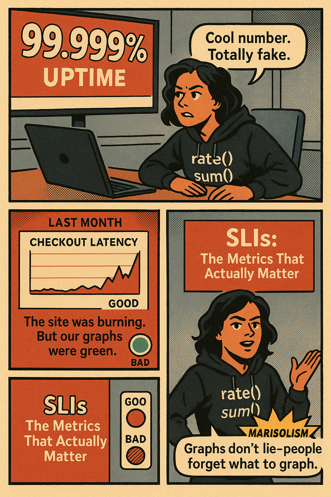
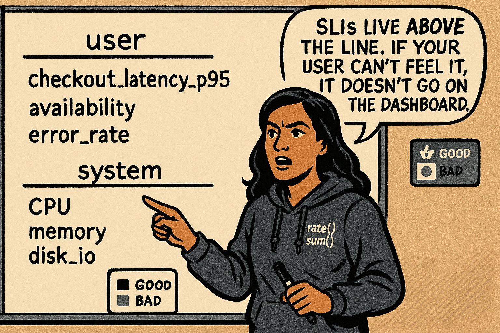
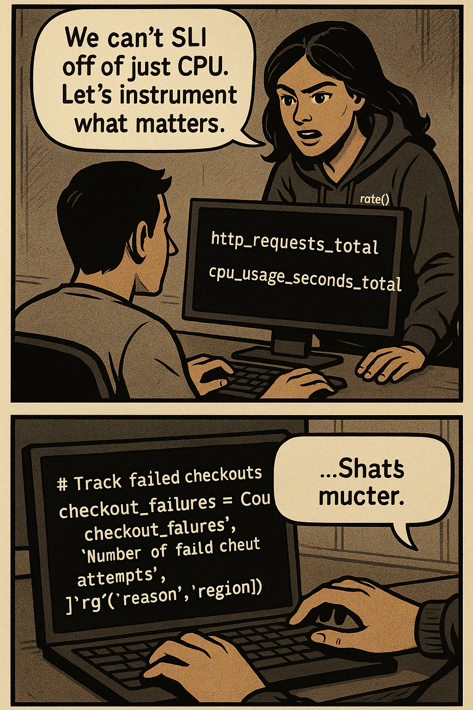
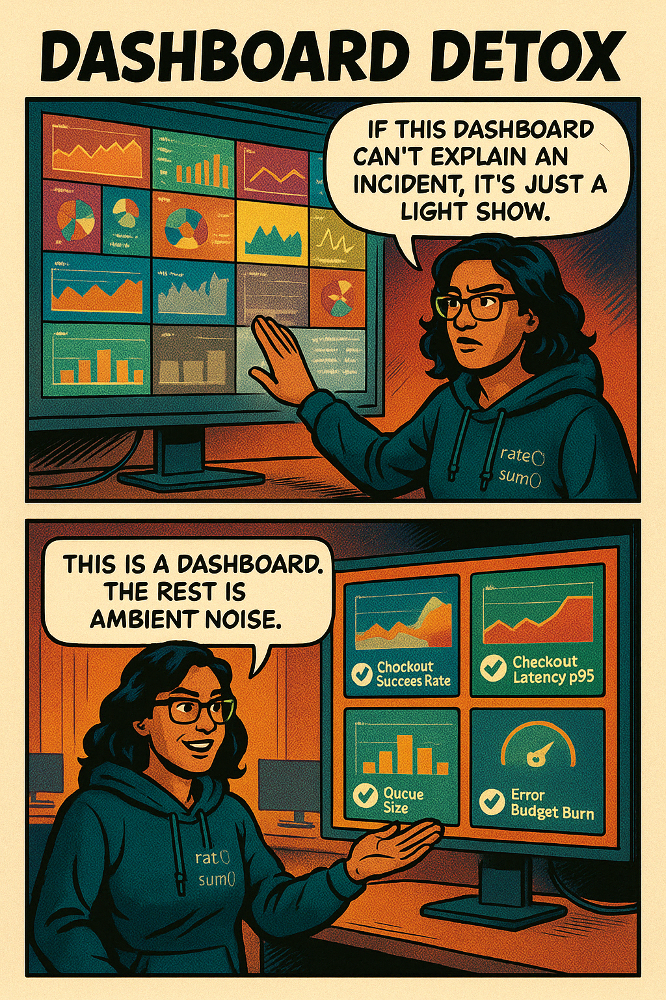
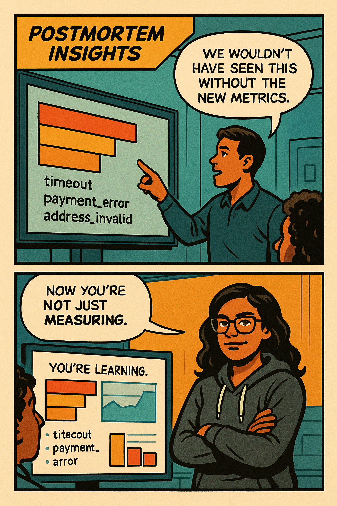

# 🎙️ **Marisol Vieira Presents: Advanced Metrics – “SLIs or Die Trying”**

> ## *“Monitoring shows you your vitals. SLIs show you what your users feel when those vitals drop.”*

---

## 💡 Scene Format

We’re keeping the **graphic novel structure**, but we’re adding more:
- **Inline panels for educational content**
- **Mini diagrams and breakdowns between scenes**
- **Marisolisms as running callouts**
- And just enough drama to make someone reconsider every alert they’ve ever written

---

## 🎨 SCENE 1: *“Who Watches the Watchmen? (We Do.)”*



---

## 📚 SLIs 101: What’s the Difference?

| Term | What It Is | Example |
|------|------------|---------|
| **Metric** | Any measurement you collect | `http_requests_total` |
| **SLI** | Service Level Indicator – A specific, user-impacting metric | % of requests under 300ms |
| **SLO** | Service Level Objective – Target level for SLI | 99.9% of logins under 400ms over 30d |
| **SLA** | Service Level Agreement – The contract with penalties | “If we drop below 99%, we owe credits” |

**Marisol (narration):**  
> “If a metric doesn’t represent the *user experience*, it’s not an SLI. It’s a stat.”

---

## 🎨 SCENE 2: *“Define or Be Defined”*



> ## “SLIs live *above the line*. If your user can't feel it, it doesn’t go on the dashboard.”

---

### 📐 Mini Guide: Common SLIs by Type

| Category    | Metric                            | How to Write It (PromQL) |
|-------------|-----------------------------------|---------------------------|
| Availability | % of requests returning 2xx/3xx  | `rate(http_requests_total{status=~"2..|3.."}[5m]) / rate(http_requests_total[5m])` |
| Latency     | % of requests under X ms         | `histogram_quantile(0.95, sum(rate(request_duration_bucket[5m])) by (le))` |
| Error Rate  | % of requests returning 5xx       | `sum(rate(http_requests_total{status=~"5.."}[5m])) / sum(rate(http_requests_total[5m]))` |
| Saturation  | Resource usage against limit      | `container_memory_usage_bytes / container_spec_memory_limit_bytes` |

---

## 🎨 SCENE 3: *“From Metric to Weapon”*

**Setting:**  
Marisol is in a pair-coding session with an app engineer



```python
# Track failed checkouts
checkout_failures = Counter(
  "checkout_failures_total",
  "Number of failed checkout attempts",
  ["reason", "region"]
)
```

**Narration:**  
> ## “SLIs start in code. Not Grafana.”

---

## 🛠️ Engineering a Real SLI

Let’s say the **critical path** is the *checkout process*.  
The SLI could be: *“95% of checkouts complete in < 2s”*

### Required Metrics:
- `checkout_duration_seconds_bucket` (histogram)
- `checkout_failures_total` (counter)
- `checkout_total` (counter)

### PromQL:
```promql
histogram_quantile(0.95,
  sum(rate(checkout_duration_seconds_bucket[5m])) by (le)
)
```

### Alerting Example:
```yaml
- alert: CheckoutLatencyTooHigh
  expr: histogram_quantile(0.95, sum(rate(checkout_duration_seconds_bucket[5m])) by (le)) > 2
  for: 5m
  labels:
    severity: page
    team: ecommerce
```

**Marisol (narration):**  
> “Now your alert is based on *user pain*, not system opinion.”

---

## 🎨 SCENE 4: *“Rewriting the Dashboard”*



---

### ⚠️ Error Budget Burn Panel

> Burn rate: How fast you’re exceeding your SLO target

**Query:**
```promql
(
  sum(rate(http_requests_total{status=~"5.."}[1m]))
/
  sum(rate(http_requests_total[1m]))
) / 0.001 > 1
```

> Target SLO is 99.9%, so error budget is 0.1%.  
> If you're burning more than 1x your budget → page.

---

## 🎨 SCENE 5: *“It’s Yours Now”*



---

## 🗯️ Marisolisms (Callout Boxes)

- **“An alert that doesn’t point to an SLI is just noise with good timing.”**
- **“If it’s not in your contract or your conscience, don’t page for it.”**
- **“Users don’t care about CPU. They care about checkout latency.”**
- **“You can’t fake uptime. But you can fake a healthy graph.”**
- **“SLIs are how your system proves its promises.”**

---

## ✅ Final Panel


---

## 🧱 Epilogue: Build Your Own

**Optional Capstone Assignment:**
- Pick a critical service.
- Identify 3 user-impacting SLIs.
- Write queries.
- Add to dashboard.
- Tie to alert.
- Use it in your next incident.
