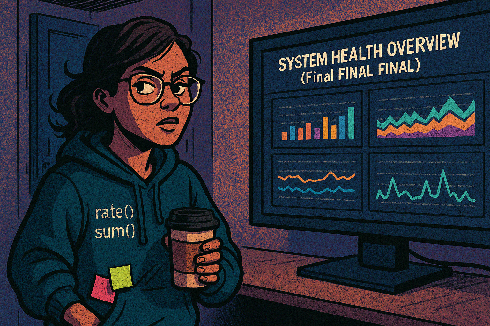
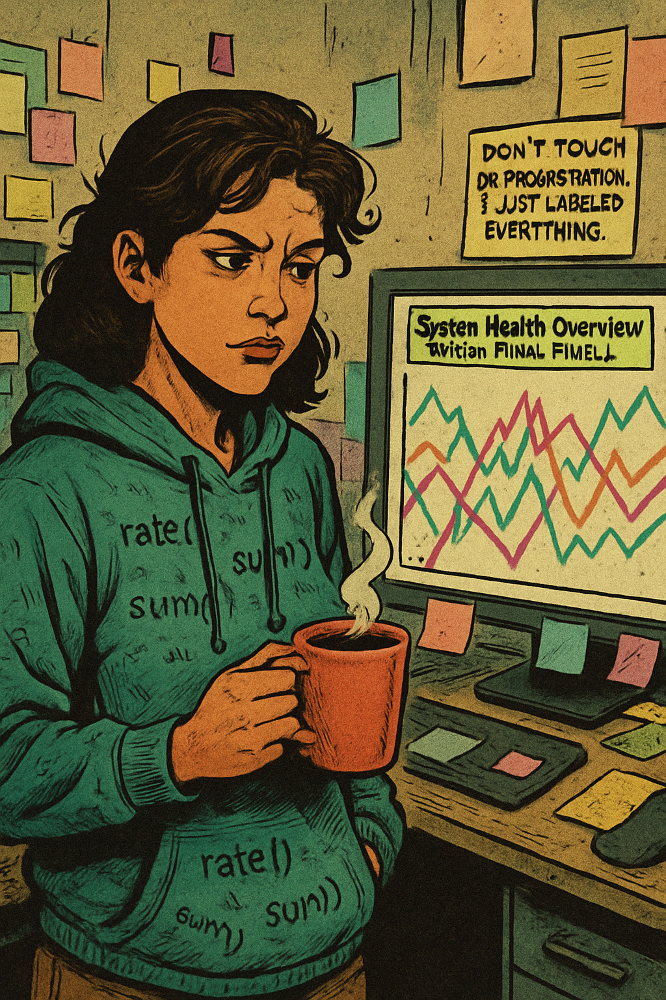
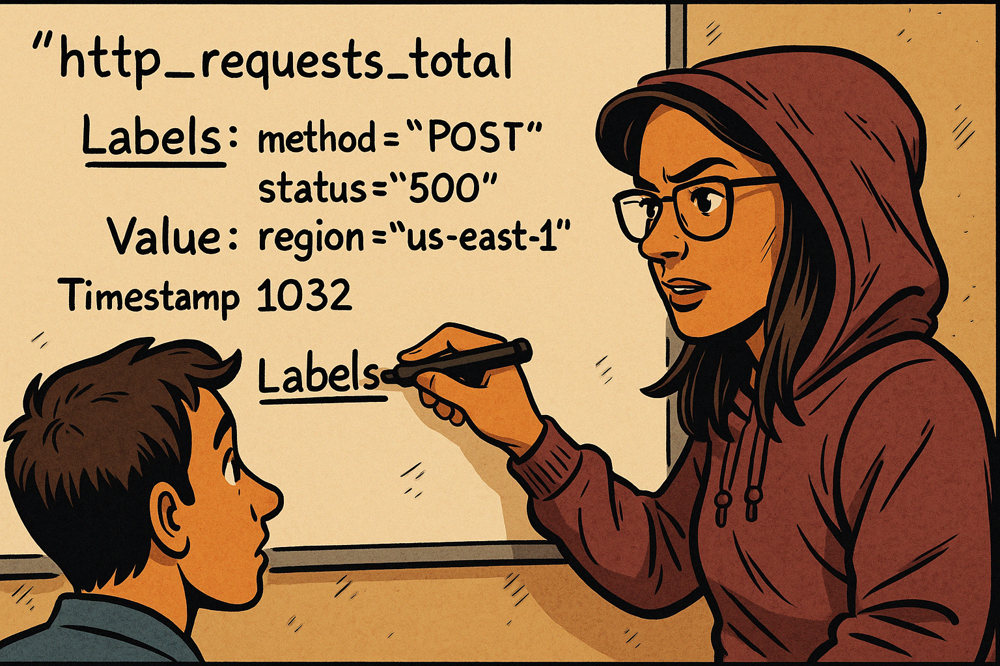
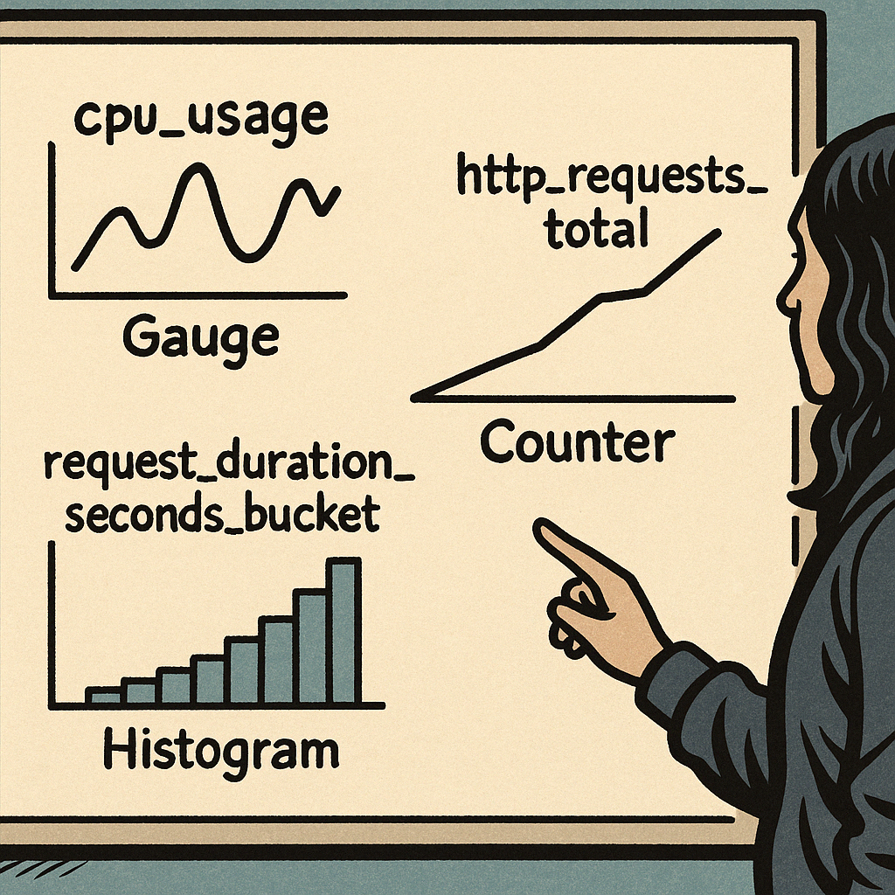
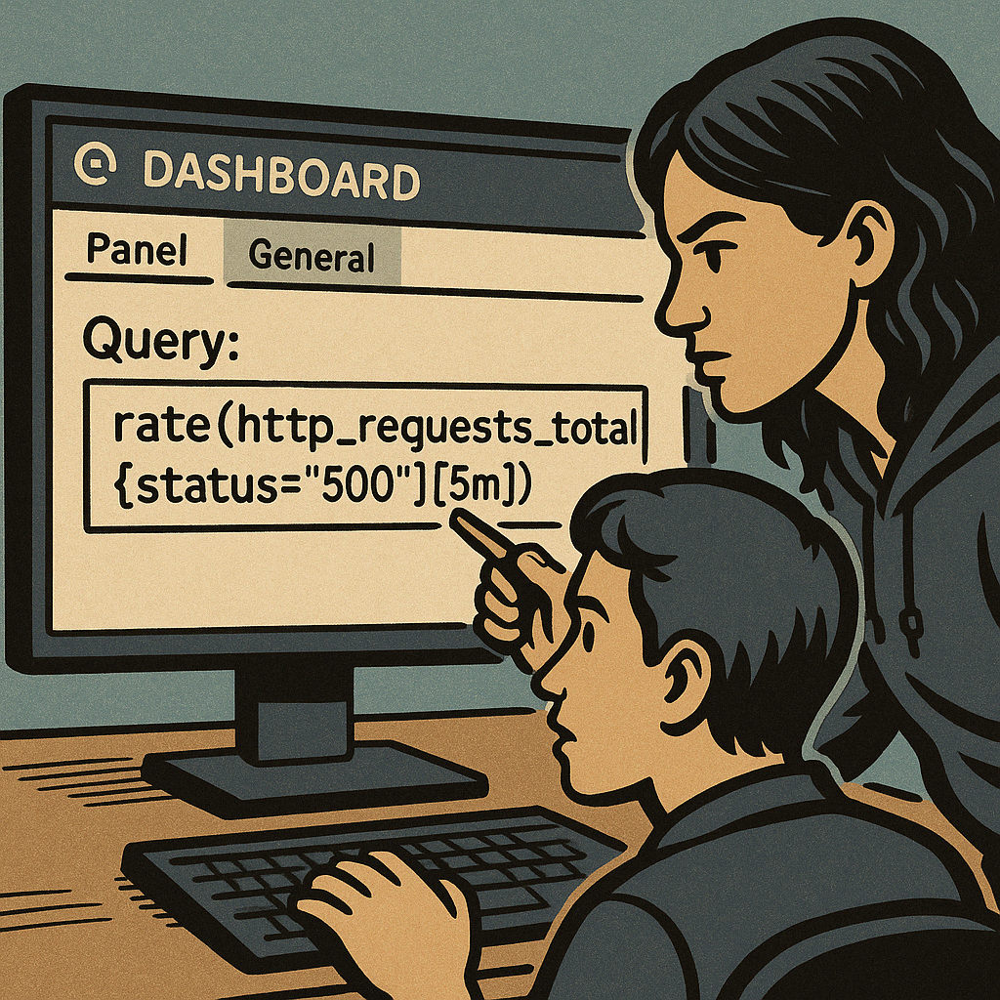
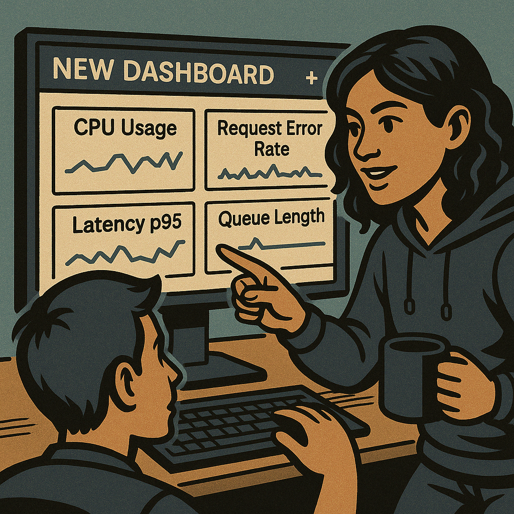
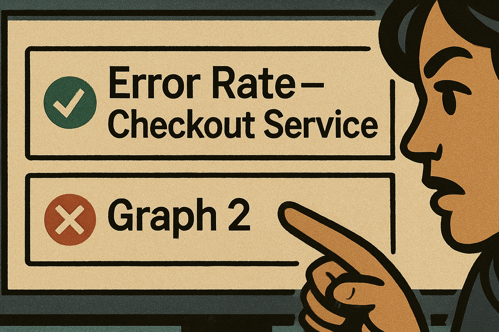
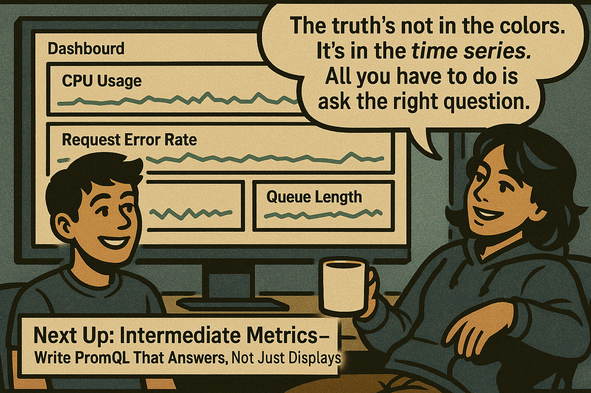

# 🎙️ **Marisol Vieira Presents: Metrics 101 – "The Truth in the Time Series"**

### 🎯 Focused on Beginner Tier Material  
From: “What is a metric?” to “Why does my dashboard look like a rainbow threw up?”


---

## 🎨 SCENE 1: *"Grafana Isn’t Magic, It’s Math."*

**Setting:**  
A busy DevOps war room. Monitors everywhere. A junior engineer stares at a colorful Grafana dashboard like it’s a piece of abstract art.



**Marisol (narration):**  
> “People think dashboards are like horoscopes. They look at a line going up and say ‘looks healthy!’”



**Marisol (speech bubble):**  
> “Let me show you what you’re *actually* looking at…”

---

## 🎨 SCENE 2: *"Metric Anatomy 101"*

**Setting:**  
Whiteboard corner. Marisol draws a time series diagram while the junior watches.


**Marisol (speech bubble):**  
> “This? This is a **metric**. Not a line. Not a guess. A **measured number**, in time, with context.”



**Marisol (narration):**  
> “Labels are like adjectives for your metrics. They turn ‘number of requests’ into ‘number of POST failures in us-east-1.’”

---

## 🎨 SCENE 3: *"Types of Metrics and What They Mean"*

**Setting:**  
The same whiteboard, now with graphs.



**Marisol (speech bubble):**  
> “Gauges go up and down. Counters only go up. Histograms measure **how fast** things happen.”


**Marisol (speech bubble):**  
> “Raw counts are lies. You want **change over time**. That’s what tells you what’s happening *now*.”

---

## 🎨 SCENE 4: *"Grafana Isn’t the Problem—You Are."*

**Setting:**  
Back at the desk. Junior’s dashboard, now in edit mode. Marisol leans in.


**Marisol (speech bubble):**  
> “This? This is poor promql. You’re graphing a counter without `rate()`. All you’re seeing is time passing.”



```promql
rate(http_requests_total{status="500"}[5m])
```

**Marisol (speech bubble):**  
> “Now *this* tells you something: how many failures are happening right now.”

> Graph updates. Junior stares, blinking slowly.

**Junior (thought bubble):**  
> “...why didn’t anyone tell me this before?”

---

## 🎨 SCENE 5: *"Dashboard Therapy"*

**Setting:**  
Same war room, later. Marisol is seated next to the junior. They’re building a new dashboard together.



**Marisol (narration):**  
> “Dashboards aren’t decoration. Each panel is a **question**, and the metric is the answer.”

---



**Marisol (speech bubble):**  
> **“If you name a panel `Graph 2`, I’m legally allowed to delete your dashboard.”**

---

## 🎨 FINAL PANEL



> Here’s the closing panel of this chapter—smiling junior, relaxed Marisol with coffee, polished dashboard on‑screen, speech‑bubble wisdom, and the teaser caption for what’s next. Let me know if you’d like any tweaks or are ready to roll into “Intermediate Metrics”!

---

## 🗯️ Marisolisms

These should be callout boxes throughout the graphic novel, for dramatic/instructional effect:

- **“Don’t graph a counter without a `rate()`. That’s like charting your age to guess your heart rate.”**
- **“No panel should exist without a question to answer.”**
- **“Labels give context. Too many? They give you pain.”**
- **“If your dashboard looks like a rainbow spaghetti plate, congratulations—it’s unusable.”**
- **“Every line is a decision. Make it count.”**

