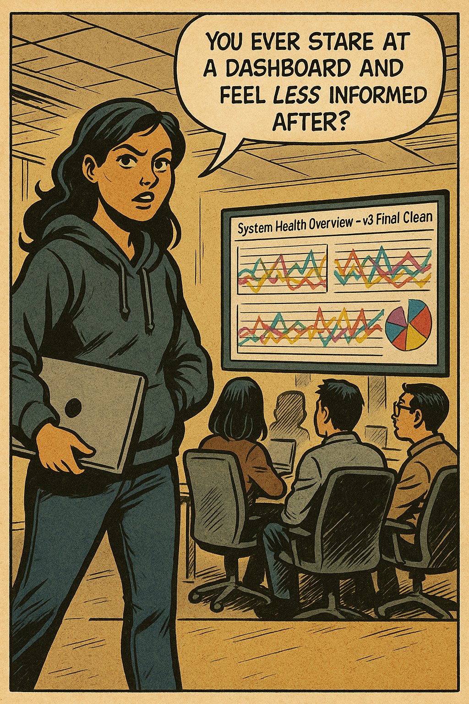
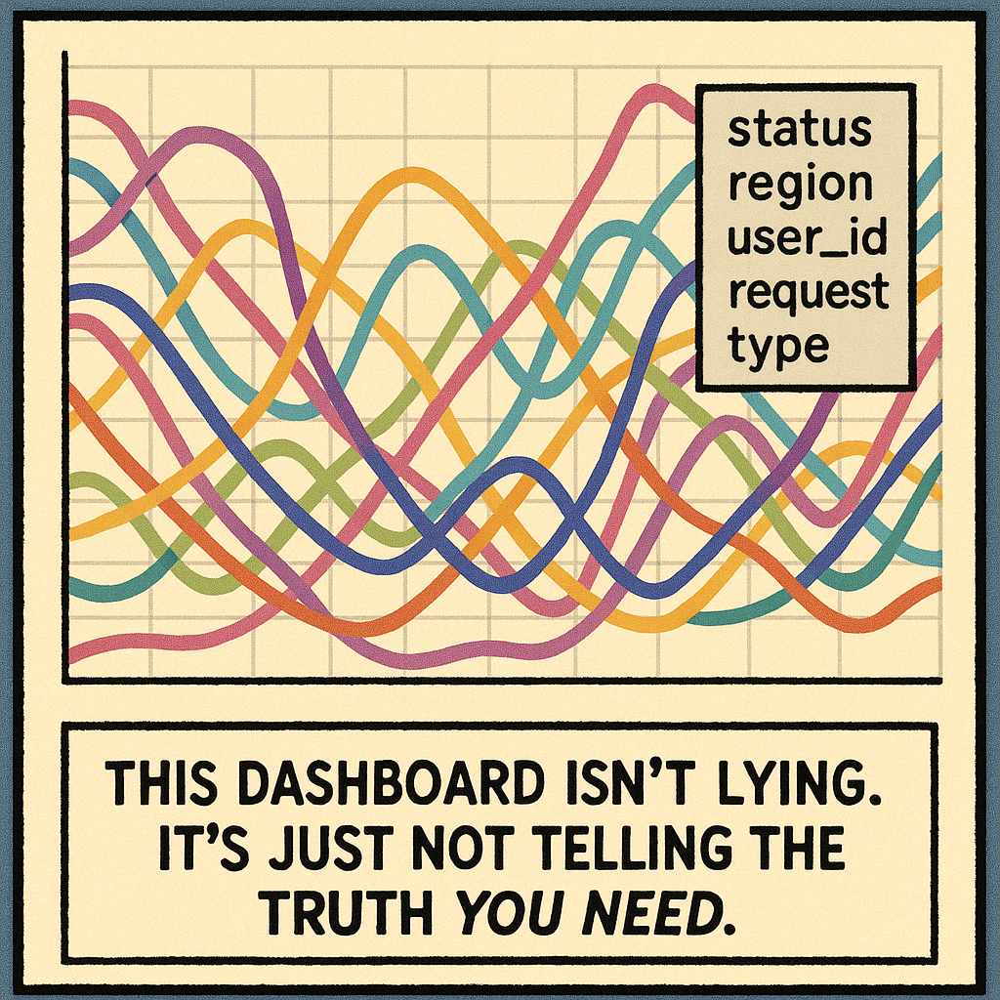
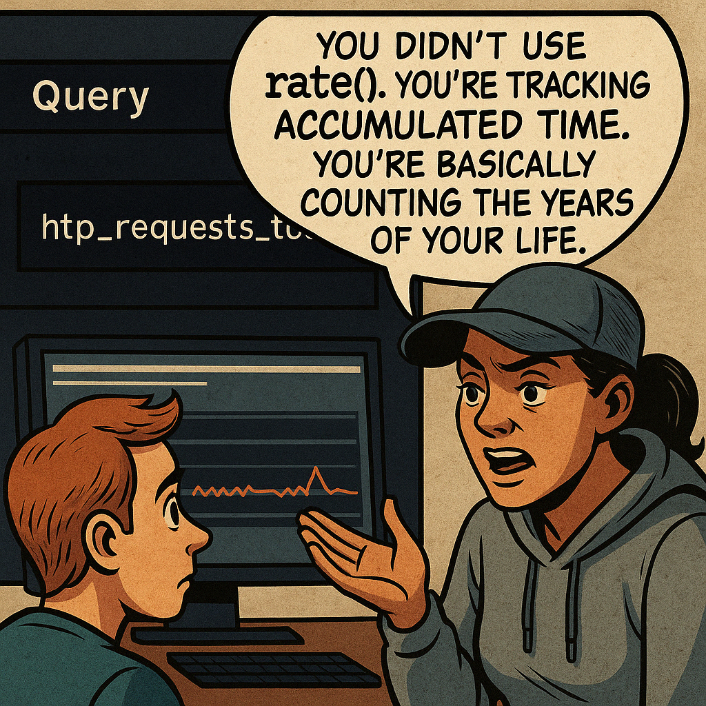
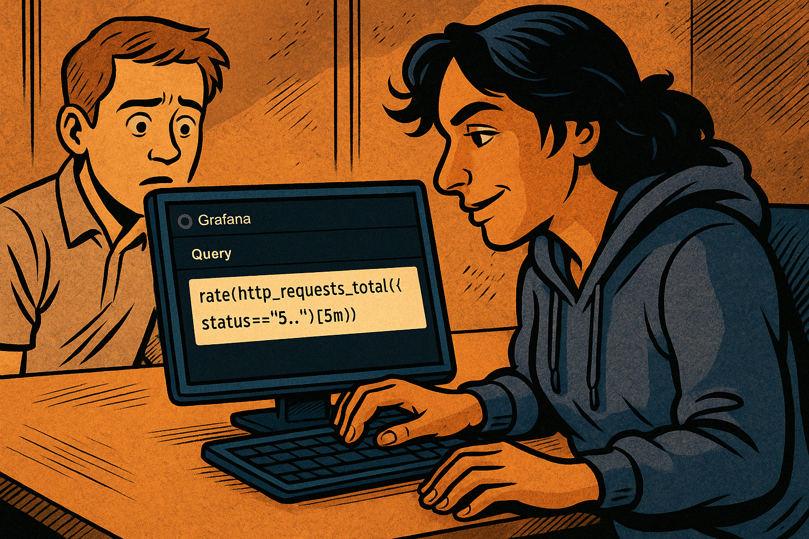
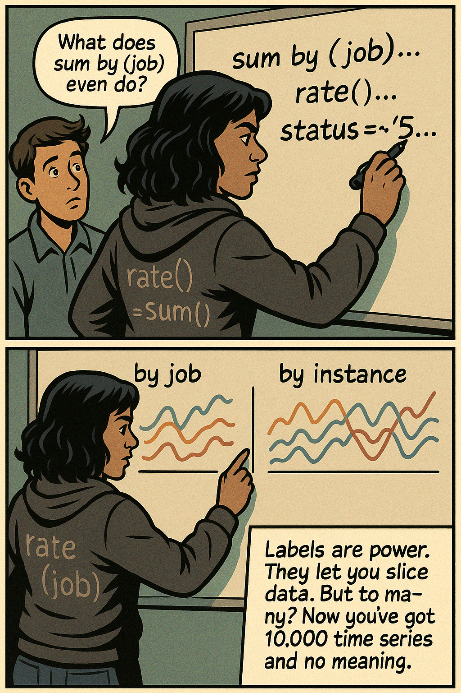
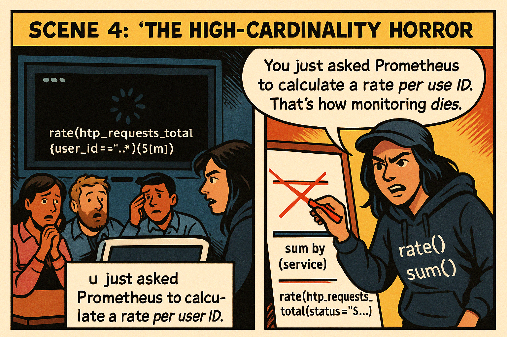
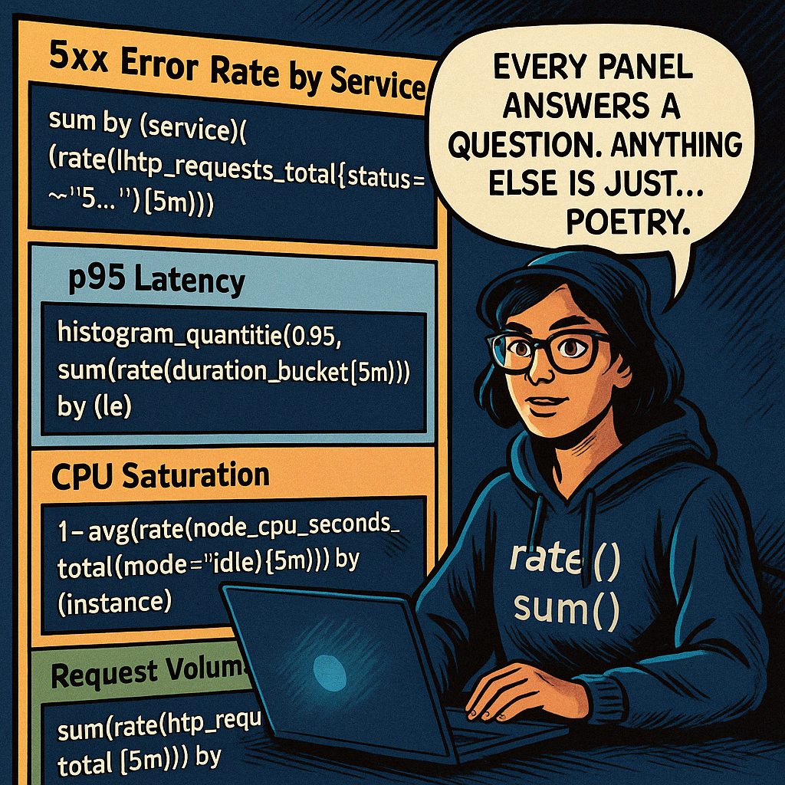
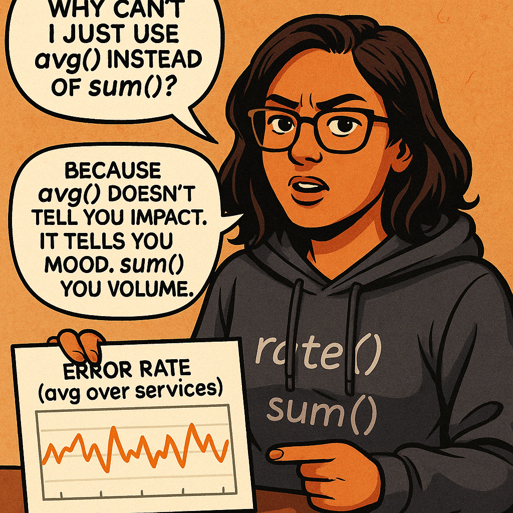

# 🎙️ **Marisol Vieira Presents: Intermediate Metrics – “By Label or By Fire”**

---

## 🎨 SCENE 1: *"This Dashboard Is Lying to You"*

**Setting:**  
Open office. A team stares at a dashboard titled "System Health Overview – v3 Final Clean." It looks like an explosion in a Skittles factory.



**Marisol (speech bubble):**  
> “You ever stare at a dashboard and feel *less* informed after?”

---



**Marisol (narration):**  
> “ tangled lines, small legend listing status, region, user_id, request_type, and Marisol’s narration beneath: “This dashboard isn’t lying. It’s just not telling the truth you need.” Let me know if any tweaks are needed or if you’re ready for the next step!”

---

## 🎨 SCENE 2: *"The PromQL Crime Scene"*


They pop open the Grafana query editor. The junior on-call engineer shrinks slightly.



Current query:  
```promql
http_requests_total
```
**Marisol (speech bubble):**  
> “You didn’t use `rate()`. You’re tracking *accumulated time*. You’re basically counting the years of your life.”
---


Panel updated—Marisol now types the corrected query:

```promql
rate(http_requests_total{status=~"5.."}[5m])
```
on the Grafana editor while the junior watches. Let me know if anything else needs adjusting or if we’re ready for the next beat!

**Marisol (speech bubble):**  
> “There. *Now* it shows how many requests are failing *right now*, not since the dawn of Linux.”

---

## 🎨 SCENE 3: *"Label Love, Label Rage"*

**Setting:**  
Whiteboard. Marisol draws the breakdown of a query: `sum by (job)`… `rate()`… `status=~"5.."`



**Marisol (narration):**  
> “Labels are power. They let you slice data. But too many? Now you’ve got 10,000 time series and no meaning.”

>Scene  delivered: two‑panel comic showing the whiteboard lesson. Panel 1—junior’s puzzled thought bubble as Marisol writes sum by (job)… rate()… status=~"5..". Panel 2—two grouped line sets (“by job” vs. “by instance”) and her narration about label power (and overload). Let me know if you’d like tweaks or if we roll on!
---

## 🎨 SCENE 4: *"The High-Cardinality Horror"*



```
rate(http_requests_total{user_id=~".*"}[5m])
```
to Marisol’s rewritten fix:
```
sum by (service)(
  rate(http_requests_total{status=~"5.."}[5m])
)
'``
and her full speech bubble. Let me know if you’d like any other tweaks!
```
---

## 🎨 SCENE 5: *"The Rebuild"*



| Panel Title                  | Query Snippet                                        |
|-----------------------------|------------------------------------------------------|
| 5xx Error Rate by Service    | `sum by (service)(rate(http_requests_total{status=~"5.."}[5m]))` |
| p95 Latency                 | `histogram_quantile(0.95, sum(rate(duration_bucket[5m])) by (le))` |
| CPU Saturation              | `1 - avg(rate(node_cpu_seconds_total{mode="idle"}[5m])) by (instance)` |
| Request Volume              | `sum(rate(http_requests_total[5m])) by (region)`      |

**Marisol (speech bubble):**  
> “Every panel answers a question. Anything else is just… visual poetry.”

---

## 🎨 SCENE 6: *"Teaching the Query Muscle"*




**Panel 2**  
Captioned panel shows `sum by (service)` pointing to a problem with `payment-service`.

---

## 🎨 SCENE 7: *"Tidy Dashboards, Clear Minds"*

**Setting:**  
The team’s new dashboard: 6 panels. All legible. Color-coded for urgency, not aesthetics.

**Panel 1**  
An engineer clicks on an alert annotation tied to a spike. The linked panel opens directly to the relevant graph.

**Marisol (speech bubble):**  
> “See? Now when something breaks, the dashboard **tells the story**. Not just the temperature.”

**Panel 2**  
Junior engineer nods.

**Junior:**  
> “It finally makes sense.”

**Marisol (speech bubble):**  
> “It’s not about looking good. It’s about seeing what matters—*before* it matters too late.”

---

## 🎯 LESSON PANELS (Insert throughout like visual flashcards):

### 🔹 PromQL Flow Breakdown:
```promql
sum by (service) (
  rate(http_requests_total{status=~"5.."}[5m])
)
```
- `rate()` for activity
- Filter by status
- Group by what your team *cares* about

---

### 🔹 Label Sanity Rules:
- ✅ `region`, `service`, `status`, `method`
- ⚠️ `user_id`, `path`, `query`, `request_id` (use with caution)
- 🚫 Anything unique per request = *flamethrower to your dashboards*

---

### 🔹 Marisolisms (Easter eggs):

- **“If you can’t describe what a panel is for, delete it.”**
- **“Unlabeled queries are the glitter of observability. They never go away.”**
- **“Group by like you page: with purpose.”**
- **“If it’s a counter and you didn’t use `rate()`, I will revoke your dashboard rights.”**

---

### 🎬 FINAL PANEL:

**Setting:**  
Office at sunset. Clean dashboards. Calm system. Marisol walks out the door, tossing a sticky note on the wall:

**Sticky note:**  
> “PromQL is a weapon. Use it with intention.”


