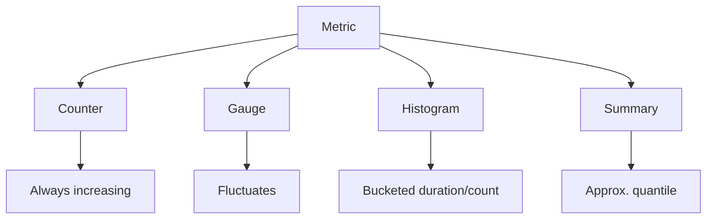

# 📖 Section 1 – What *Is* a Metric?

> **“A metric is a number with memory. It tells you what changed, how fast it’s changing, and if you should care.”**  
> – Marisol Vieira

---

## 🧠 Core Concept

A **metric** is a **numeric measurement** collected at regular intervals, associated with one or more **labels** that give it context. Metrics are:
- Lightweight
- Efficient to store
- Ideal for visualizing behavior over time
- Core to monitoring, alerting, and SLO/SLI design

Metrics are **not logs** (they don’t contain full event detail) and they are **not traces** (they don’t show request flow).  
They answer questions like:
- *How many?*
- *How fast?*
- *What percent?*
- *How long did it take?*

---

## 🏗 Metric Anatomy

Every metric is a **time series**, made of:

| Component   | Description                                | Example                                   |
|-------------|--------------------------------------------|-------------------------------------------|
| **Name**    | What is being measured                     | `http_requests_total`                     |
| **Labels**  | Extra tags that differentiate time series  | `status="500", method="POST"`             |
| **Value**   | A numeric value                            | `3.5`                                     |
| **Timestamp** | When it was measured                     | `2025-04-18T12:34:56Z`                    |

---

## 📊 Practical Example

Say you're tracking requests to your checkout service.

Without labels:
```text
http_requests_total = 500
```

With labels:
```text
http_requests_total{method="POST", status="500", region="us-east-1"} = 31
```

Suddenly, you’re not just counting—you’re learning:
- Which endpoint?
- What status?
- Which region?

---

## ⚠️ Label Design Advice

- ✅ Use labels to break down useful dimensions (`service`, `status`, `region`)
- ❌ Avoid high-cardinality labels (`user_id`, `path`, `session_id`)
- ✅ Keep label values predictable and bounded
- ❌ Never create labels from raw user input or dynamic strings

---

## 📐 Metric Types (Explained)

| Type         | What It Does                              | Use Case Example                        |
|--------------|--------------------------------------------|-----------------------------------------|
| **Counter**  | Increases over time, reset only on restart | `http_requests_total`, `errors_total`   |
| **Gauge**    | Goes up and down                          | `memory_usage_bytes`, `queue_length`    |
| **Histogram**| Buckets observations into ranges          | `request_duration_seconds_bucket`       |
| **Summary**  | Calculates quantiles (limited flexibility) | `response_duration_seconds`             |

---

### 🗺 Mermaid: Metric Type Overview  


---

## 📏 Where Do Metrics Come From?

Most come from:
- **Instrumentation in code**
- **Exporters** (like `node_exporter`, `nginx_exporter`)
- **System collectors** (Kubernetes cAdvisor, cgroups)

Common setup:
1. App exposes metrics at `/metrics`
2. Prometheus scrapes the data
3. Grafana visualizes the result

> Note: If you're using Grafana without Prometheus directly, someone has still built this behind the scenes.

---

## ⚙ Instrumentation Example

**Python (with `prometheus_client`):**
```python
from prometheus_client import Counter

errors = Counter(
    "checkout_failures_total",
    "Number of failed checkouts",
    ["region", "reason"]
)

errors.labels(region="us-east", reason="timeout").inc()
```

This defines a counter. Every time you call `.inc()`, it logs one failure, labeled by region and reason.

---

## 🔥 Gotchas

- A counter without `rate()` will just look like a slope
- Gauges can be noisy—scrape timing matters
- Histograms need consistent bucket configs across instances to aggregate meaningfully
- Summary metrics are **not aggregatable across services** (use histograms instead)

---

## ✅ Key Takeaways

- Metrics are simple, numeric time series with structured metadata (labels)
- They are the backbone of dashboards, alerts, and SLOs
- Label design is critical: good labels give insight, bad ones give pain
- Choose the right type: `counter` for totals, `gauge` for live values, `histogram` for distribution
- Understanding how metrics are collected gives you power over what gets visualized

