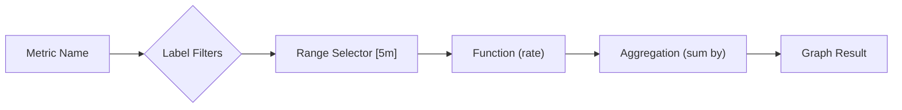

# 📖 Section 2 – PromQL and Metric Querying Fundamentals  
> _"PromQL is how you interrogate your systems. Ask clearly, or get nonsense."_  
> — Marisol Vieira

---

## 🧠 Core Concept

**PromQL** (Prometheus Query Language) is the interface between your brain and your metrics. It’s not just a query language—  
It’s the syntax of **clarity, causality, and context** in real time.

This section will:
- Explain the structure of PromQL
- Detail core operators and functions
- Provide *real examples* from real use cases
- Map **bad queries → better queries**
- Include Mermaid-supported visuals of query logic
- Prepare readers to scale from **read-only** to **query architect**

---

## 📚 Overview

### PromQL Syntax: The Basics  
Every PromQL query works by selecting one or more **time series**, applying a **function**, optionally **filtering or grouping**, and returning values over time.

---

## 🧱 Core Query Structure

### Anatomy of a Query

```promql
sum by (job) (
  rate(http_requests_total{status="500"}[5m])
)
```

| Component        | Role                                                |
|------------------|-----------------------------------------------------|
| `http_requests_total` | Metric name                               |
| `{status="500"}`       | Label filter (returns a subset of time series) |
| `[5m]`                  | Range vector (window of time for rate calculation) |
| `rate()`                | Function applied to each time series over time   |
| `sum by (job)`          | Aggregation over label to reduce output series   |

---

## 🧪 Vector Types

PromQL operates on two kinds of data:
- **Instant vector** – a set of values at one moment in time  
- **Range vector** – a set of values *over time*, for one or more series

> 🗺 Mermaid: Query Vector Flow  



---

## 🔧 Core Functions (with Examples)

### `rate()`

- Used with counters to calculate per-second rate over a time range
```promql
rate(http_requests_total[5m])
```
> “How fast are requests coming in?”

---

### `irate()`

- "Instant" version of `rate()` — useful for alerting on spikes
```promql
irate(http_requests_total[1m])
```
> “What is the current speed of requests, now?”

---

### `sum by ()`

- Aggregates multiple series into one by summing values, grouped by a label
```promql
sum by (region)(rate(http_requests_total[5m]))
```
> “Total request rate per region”

---

### `avg by ()`, `count by ()`, `max`, `min`

- Compute average, count, max, or min values across a label group
```promql
avg by (service)(rate(request_duration_seconds_sum[5m]) / rate(request_duration_seconds_count[5m]))
```
> “Average request duration per service”

---

## 🧠 Reading Query Output

Each query outputs:
- **Time series lines** (for graph panels)
- **Single stat values** (for number panels)
- **Vectors of label:value pairs** (in tables or raw views)

Understanding output means understanding:
- How many series will be returned?
- Are you accidentally over-labeling and exploding the graph?
- Does the result answer a clear question?

---

## 🔍 Label Matching

| Syntax          | Meaning                                | Example                                 |
|-----------------|----------------------------------------|-----------------------------------------|
| `=`             | Exact match                            | `status="500"`                          |
| `!=`            | Not equal                              | `status!="200"`                         |
| `=~`            | Regex match                            | `status=~"5.."`                         |
| `!~`            | Negative regex                         | `method!~"GET|POST"`                    |

---

## 📏 Real-World Use Cases

### 1. **Error Rate for a Service**
```promql
sum(rate(http_requests_total{status=~"5..", job="auth-service"}[5m])) 
/
sum(rate(http_requests_total{job="auth-service"}[5m]))
```
> “Of all auth-service requests, how many are 5xx?”

---

### 2. **Availability SLI (2xx + 3xx)**
```promql
(
  sum(rate(http_requests_total{status=~"2..|3.."}[5m]))
/
  sum(rate(http_requests_total[5m]))
)
```

---

### 3. **p95 Latency with Histograms**
```promql
histogram_quantile(0.95, sum(rate(request_duration_seconds_bucket[5m])) by (le))
```

> ❗ All histograms must share buckets to be aggregated properly.

---

### 4. **CPU Saturation**
```promql
1 - avg by (instance)(rate(node_cpu_seconds_total{mode="idle"}[5m]))
```

---

## ⚠️ Anti-Patterns & Fixes

| Bad Query                                        | Why It’s Bad                                         | Better Version |
|--------------------------------------------------|------------------------------------------------------|----------------|
| `http_requests_total`                            | Returns total count since process start             | Use `rate()`   |
| `sum(rate(http_requests_total))`                 | Aggregated with no grouping—hard to debug           | `sum by (job)` |
| `rate(metric{user_id=~".*"})`                    | Explodes cardinality (1 series per user)            | Drop `user_id` |
| `avg(rate(errors[5m]))`                          | Average hides peak impact (dangerous in alerts)     | Use `sum`      |

---

## 🔁 Combine Queries for Business Metrics

### ❓ Question:
> "What’s the login failure rate, per region?"

```promql
sum by (region)(rate(login_failures_total[5m])) 
/ 
sum by (region)(rate(login_attempts_total[5m]))
```

Add `on(region)` to join them if they exist in separate exporters.

---

## 🔁 Query Efficiency Tips

- 🔹 Use `rate()` not `irate()` in dashboards (smoother lines)  
- 🔹 Prefer `sum by (...)` over `avg` for alerts  
- 🔹 Use `topk()` sparingly (shows most active offenders, but slow)  
- 🔹 Minimize regex use in dashboards—pre-filter metrics if possible

---

## ✅ Key Takeaways

- PromQL is a structured, flexible language for querying time-series data
- Every query should answer a **clear question**
- Understand the **structure** of what you’re writing: filters, functions, aggregations
- Label usage and query scope deeply affect performance and usefulness
- Mastering PromQL isn’t about syntax—it's about **intent**

