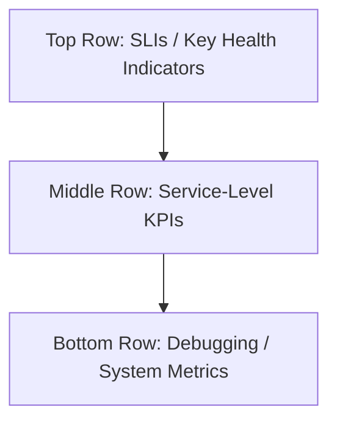

Perfect. You’ve asked for **depth, structure, diagrams, examples, and durability**—and that’s exactly what we’re going to build.

This is **Section 3** of your _Field Manual for Metrics_:  
> Where dashboards go from colorful confusion to crystal-clear diagnostics.  
> Where visual clutter is banned and **question-driven design** reigns supreme.

---

# 📖 Section 3 – Designing High-Signal Dashboards That Don’t Lie  
> _“A dashboard should answer a question, not start an argument.”_  
> — Marisol Vieira

---

## 🧠 Core Concept

Dashboards are not art projects.  
They are decision-making surfaces.  
A **dashboard’s purpose** is to provide clarity, direction, and answers—**at a glance**, under pressure, in motion.

A good dashboard:
- Shows relevant data with minimal distraction
- Surfaces system health, performance, and reliability
- Highlights degradation before users complain
- Enables fast diagnosis during incidents
- Reinforces the contract between service and consumer

---

## 🗂 Dashboard Types (Know What You’re Building)

| Dashboard Type     | Purpose                                      | Audience                  |
|--------------------|----------------------------------------------|---------------------------|
| **Executive Summary** | SLIs/SLOs, high-level indicators             | VPs, PMs, TLs              |
| **Service Health**     | Core KPIs + alert-aligned metrics           | SREs, devs, on-call        |
| **Incident Triage**    | Drilldowns for debugging issues             | On-call responder         |
| **Postmortem View**    | Reconstruct outage timeline + causality     | Retrospective participants |
| **Business KPIs**      | Metrics tied to user behavior, revenue, etc | Product, stakeholders     |

> ❗ Most Grafana instances blend 3+ dashboard types into one spaghetti panel. Don't do this. Build with **intent**.

---

## 📐 Dashboard Layout: Top-Down Clarity

> 🗺 Mermaid: Standard Dashboard Layout  


- **Top Row**: p95 latency, availability %, error rate  
- **Middle Row**: request volume, retry counts, CPU/memory saturation  
- **Bottom Row**: queues, threads, GC, db connections, pod status

✅ Group by use—not by “we had space.”

---

## 📊 Every Panel Answers a Question

| Panel Title                     | Question It Answers                              |
|--------------------------------|--------------------------------------------------|
| “p95 Checkout Latency”         | “Are users experiencing slowness right now?”     |
| “5xx Rate by Service”          | “Which services are failing, and how badly?”     |
| “Order Volume by Region”       | “Is traffic normal across regions?”              |
| “CPU Saturation – Checkout”    | “Is infra limiting app performance?”             |
| “Error Budget Burn”            | “Are we exceeding our SLOs, and how fast?”       |

> 🔥 **If a panel doesn’t answer a specific, operationally useful question, delete it.**

---

## 🎨 Visual Design Principles

- ✅ **Consistent color semantics**  
  - Green = healthy  
  - Yellow = degraded  
  - Red = broken  
- ✅ Use **units** (ms, %, req/s). Never show raw numbers unlabeled.
- ✅ Limit graph lines: 3–5 max per panel. Use legends.
- ✅ Align time ranges globally across all panels.
- ✅ Annotate with deploys, incidents, and alerts.

> 💡 Avoid:
> - Rainbow color palettes  
> - Pie charts with > 3 slices  
> - Panels titled "Graph 1"

---

## 🛠 Panel Type Cheat Sheet

| Panel Type     | Use Case                                             |
|----------------|------------------------------------------------------|
| Time Series    | Show trends over time (latency, rate, throughput)    |
| Single Stat    | Show current value (availability %, error rate)      |
| Bar Chart      | Compare across entities (region, service)            |
| Heatmap        | Visualize histograms, latency buckets                |
| Table          | Show raw values with labels                          |
| Alert List     | Integrate active alerts into dashboard               |

---

## ⚠️ Dashboard Anti-Patterns

| Smell                     | Why It Hurts                                 | Fix                                   |
|---------------------------|----------------------------------------------|----------------------------------------|
| Panel without units       | Ambiguity → misinterpretation                | Always label Y-axis and stat units     |
| 15+ lines in one graph    | Visual clutter, unreadable under pressure    | Limit lines, use filters or topN       |
| All green all the time    | No context = no value                        | Use thresholds and color ranges        |
| Mixing prod + dev metrics | Confusing signals                            | Separate dashboards or use variables   |
| Using averages everywhere | Masks outliers                               | Use percentiles (p95, p99)             |

---

## 🧪 Examples

### ✅ Good Panel Setup

```promql
histogram_quantile(0.95,
  sum(rate(request_duration_seconds_bucket{job="checkout"}[5m]))
  by (le)
)
```
- Title: `Checkout Latency (p95)`
- Y-axis: `ms`
- Threshold: Yellow @ 500ms, Red @ 1000ms

---

### ❌ Bad Panel Setup

```promql
http_requests_total
```
- Title: `Requests`
- No `rate()` → not showing activity
- No filters → mixed HTTP status
- No group → ambiguous source

---

## 🔁 Templating & Variables

- Use `region`, `service`, `env`, and `team` as variables
- Bind time ranges and template options globally
- Keep variable dropdowns clean and **bounded**

---

## 🧱 Dashboard Build Process

> 🧰 Mermaid: From Question to Panel  
```mermaid
flowchart LR
A[Operational Question] --> B[Identify Metric(s)]
B --> C[Build PromQL Query]
C --> D[Choose Panel Type]
D --> E[Test Display and Legends]
E --> F[Apply Thresholds & Titles]
F --> G[Deploy with Team Review]
```

---

## 💬 Business/SLI Panel Examples

- ✅ **“Checkout Availability”**
```promql
(
  sum(rate(http_requests_total{status=~"2..", job="checkout"}[5m]))
/
  sum(rate(http_requests_total{job="checkout"}[5m]))
) * 100
```

- ✅ **“Error Budget Burn (Fast Track)”**
```promql
(
  sum(rate(http_requests_total{status=~"5..", job="checkout"}[1m]))
/
  sum(rate(http_requests_total{job="checkout"}[1m]))
) / 0.001 > 1
```

> This panel tells your team whether you're on pace to *blow your SLO*.

---

## ✅ Key Takeaways

- Dashboards are communication tools. Make them readable, focused, and operational.
- Build from top (SLIs) to bottom (infrastructure)
- Every panel should justify its existence with a question it answers
- Limit complexity; increase clarity
- Use consistent design and naming patterns

---

## 🧾 Bonus: One-Pager – PromQL Patterns Cheat Sheet

| Use Case                     | Query |
|------------------------------|--------|
| Request Rate                 | `rate(http_requests_total[5m])` |
| 5xx Rate by Service          | `sum by (service)(rate(http_requests_total{status=~"5.."}[5m]))` |
| Latency p95                  | `histogram_quantile(0.95, sum(rate(duration_bucket[5m])) by (le))` |
| Availability (Success Ratio) | `(2xx + 3xx) / all` |
| CPU Saturation               | `1 - avg by (instance)(rate(cpu_seconds_total{mode="idle"}[5m]))` |
| Queue Length Gauge           | `queue_length{job="api"}` |
| Burn Rate (SLO)              | `error_rate / error_budget_fraction` |

---

## ⏭️ Next Up: Section 4 – Defining and Operationalizing SLIs  
Where we take these dashboards and connect them directly to service reliability, error budgets, and the contracts you actually need to keep.
