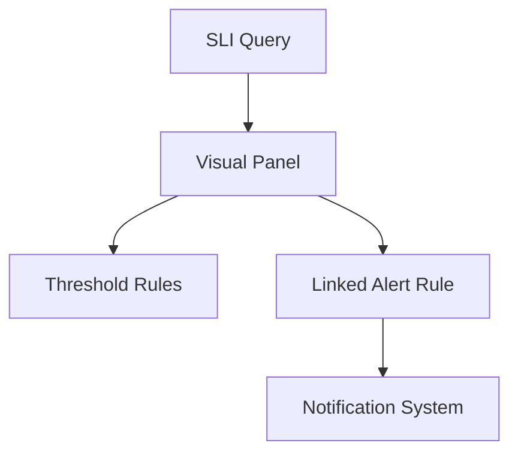

# 📖 Section 4 – SLIs and SLOs: Turning Metrics into Promises  
> _"Metrics measure behavior. SLIs define accountability."_  
> — Marisol Vieira

---

## 🧠 Core Concept

An **SLI** (Service Level Indicator) is a metric that reflects *what your users actually care about*.  
An **SLO** (Service Level Objective) is the *target* you aim to maintain for that SLI.  
And when you combine these with alerts, error budgets, and reporting—you’ve created a **reliability system**.

> ✅ SLIs measure *experience*.  
> ✅ SLOs define *expectations*.  
> ✅ Error budgets define *limits*.

This section provides a complete framework—from SLI definition to alerting logic and long-term governance.

---

## 📚 Table of Contents for This Section

1. 🔍 SLI vs. Metric: What’s the Difference?  
2. 📐 SLO Design Framework  
3. ⚖️ Error Budgets: Enforcing Reliability  
4. 🛠 SLI Query Library  
5. ⚙️ Alerting & Burn Rate Thresholds  
6. 📈 Monitoring Dashboards for SLIs  
7. 🗺 Mermaid Diagrams  
8. ✅ Best Practices

---

## 🔍 SLI vs. Metric

| Metric Type | Example                               | User-Relevant? | Use as SLI? |
|-------------|----------------------------------------|----------------|-------------|
| System metric | `cpu_usage`, `memory_bytes`           | ❌             | ❌          |
| App metric   | `http_requests_total`, `latency_p95`  | ✅ Sometimes   | ✅          |
| Business metric | `orders_completed_total`, `login_success_rate` | ✅ | ✅ |

> 📌 **SLIs are not all metrics, but all SLIs are metrics.**  
> The difference is *intent*.

---

## 📐 Designing an SLO

> 🗺 Mermaid: SLI to SLO Design Flow  
```mermaid
flowchart TD
A[Identify Critical User Path] --> B[Define SLI]
B --> C[Write PromQL]
C --> D[Set Target (SLO)]
D --> E[Track Error Budget]
E --> F[Alert & Report]
```

---

## ✍️ SLO Design Template

| Field           | Description                               | Example                          |
|------------------|-------------------------------------------|----------------------------------|
| **SLI**          | What are you measuring?                   | 95% of checkouts complete <2s   |
| **SLO Target**   | What’s acceptable over time?              | 99.9% success over 30 days       |
| **Budget Window**| How long is the rolling period?           | 30 days                          |
| **Budget Size**  | 0.1% (43 minutes per 30 days)             | (computed from SLO)              |
| **Alert Window** | When to notify on burn rate               | Burn rate > 2x for 5m            |

---

## ⚖️ Error Budgets

If your SLO target is 99.9%, you are allowed:
- 0.1% of failure
- Over 30 days, that’s **43 minutes and 12 seconds of downtime**

> This is your **error budget**.  
> Blow it, and you're out of compliance.  
> Respect it, and you stay reliable *and* deploy with confidence.

---

## 🧪 SLI Query Library

### ✅ Availability

```promql
(
  sum(rate(http_requests_total{status=~"2..|3..", job="checkout"}[5m]))
/
  sum(rate(http_requests_total{job="checkout"}[5m]))
) * 100
```
> Measures the percentage of successful responses.

---

### ✅ Latency (p95 or p99)

```promql
histogram_quantile(0.95,
  sum(rate(request_duration_seconds_bucket{job="checkout"}[5m]))
  by (le)
)
```
> Measures request latency at the 95th percentile.

---

### ✅ Error Rate

```promql
sum(rate(http_requests_total{status=~"5..", job="checkout"}[5m])) 
/ 
sum(rate(http_requests_total{job="checkout"}[5m]))
```
> Fraction of requests failing with a 5xx status.

---

### ✅ Throughput / Success Ratio

```promql
sum(rate(orders_completed_total{region="us-east"}[5m]))
```
> Business-level SLI: user transactions per region

---

## ⚙️ Alerting with Burn Rate

A burn rate tells you **how fast** you’re consuming your error budget.

| Burn Rate | Meaning                                |
|-----------|----------------------------------------|
| 1         | Budget being used perfectly evenly     |
| >1        | Budget is being consumed *too fast*    |
| <1        | Budget is healthy, safe burn           |

### 🔥 Burn Rate Alert Example

> **SLO Target**: 99.9% → error budget = 0.001  
> **Alert Trigger**: Burn rate > 2 for 5 minutes

```promql
(
  sum(rate(http_requests_total{status=~"5.."}[1m]))
/
  sum(rate(http_requests_total[1m]))
) / 0.001 > 2
```

> This tells you: "We're using our 30-day budget *twice as fast* as allowed."

---

## 📊 SLI Dashboard Layout

| Row        | Panels Included                                |
|------------|------------------------------------------------|
| **Top**    | Availability %, Latency (p95), Error Rate      |
| **Middle** | Throughput, Burn Rate                          |
| **Bottom** | Raw metrics for debugging                      |

Add:
- **Thresholds**
- **Annotations for deploys/incidents**
- **Links to alert definitions**

---

## 🗺 Mermaid: SLI Dashboard Flow  


---

## ✅ Best Practices for SLIs & SLOs

- ✅ Align SLIs with *user experience*, not system internals  
- ✅ Define SLIs before defining alerts  
- ✅ Use histograms for latency, not averages  
- ✅ Don’t try to make 100% your SLO—*allow* for failure  
- ✅ Automate burn rate tracking and reporting  
- ✅ Review SLOs quarterly and revise with actual data  

---

## 🧠 Key Takeaways

- SLIs are the lens through which we understand **user experience**  
- SLOs turn those metrics into promises—internally or contractually  
- Error budgets are operational currency; use them wisely  
- Burn rate tells you when you’re sprinting toward failure  
- Dashboards built on SLIs **justify themselves**

