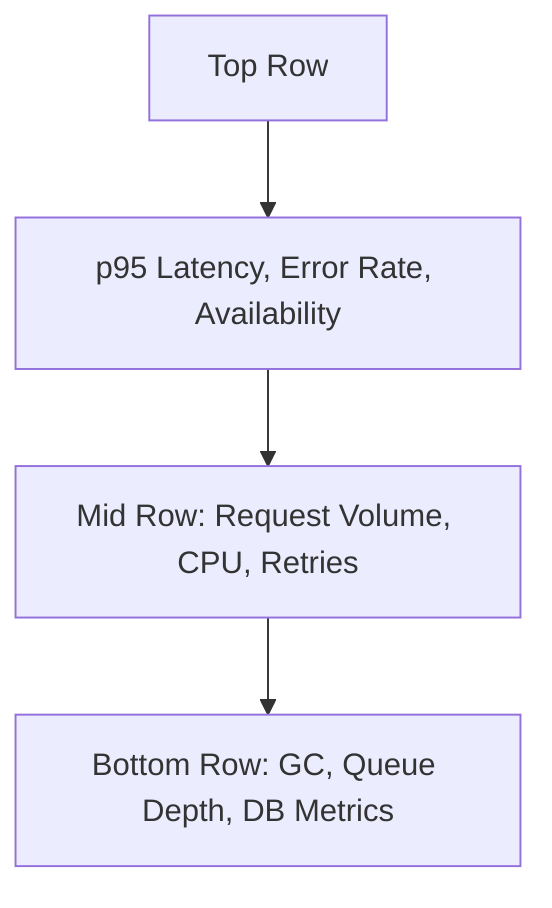

# 📋 Day 2 Quiz – Answer Sheet  

## Answer 1: [Metric Basics]

🔍 Beginner | Multiple Choice

**Question:** What are the four core parts of a metric in a time series database?  
A. Name, labels, value, timestamp  
B. Name, host, severity, unit  
C. Gauge, counter, histogram, summary  
D. Rate, value, trend, duration

**Correct Answer:** A – Name, labels, value, timestamp

**Explanation:** Metrics are structured as time series composed of four elements: a name (what's being measured), a value (the numeric data), labels (tags that add context), and a timestamp (when it was collected). This is the foundational format in systems like Prometheus【14†source】.

**Why others are wrong:**  
- **B:** These are metadata or alerting attributes, not metric structure components.  
- **C:** These are metric types, not parts of a metric.  
- **D:** These describe behavior, not structure.  

---

## Answer 2: [Metric Types]

🔍 Beginner | True/False

**Question:** A counter metric can increase and decrease over time.  
(True/False)

**Correct Answer:** False

**Explanation:** Counters are monotonically increasing—they only go up. They reset only on application restart. This makes them suitable for cumulative counts like total requests or failures【14†source】.

**Why others are wrong:**  
- **True:** This misrepresents the definition of a counter. Fluctuating values are traits of gauges, not counters.  

---

## Answer 3: [Metric Anatomy]

🔍 Beginner | Fill-in-the-Blank

**Question:** Labels act as ______________ that provide additional context to metrics and help group, filter, and slice data.

**Correct Answer:** filters or tags

**Explanation:** Labels allow you to add meaningful dimensions to metrics, such as region, status, or method. These make it possible to segment and analyze time series in useful ways【14†source】.

**Why others are wrong:**  
(No distractors in fill-in-the-blank)

---

## Answer 4: [Grafana Basics]

🔍 Beginner | Multiple Choice

**Question:** In most Prometheus-Grafana setups, where are metrics collected from?  
A. Grafana  
B. Datadog  
C. Exporters and instrumented services  
D. Logs

**Correct Answer:** C – Exporters and instrumented services

**Explanation:** Grafana only visualizes metrics. Prometheus scrapes data from sources such as instrumented applications or exporters (like node_exporter), which expose metrics via endpoints like `/metrics`【14†source】【22†source】.

**Why others are wrong:**  
- **A:** Grafana doesn’t collect data; it displays it.  
- **B:** Datadog is not part of the Prometheus-Grafana stack described here.  
- **D:** Logs are separate from metrics and handled by other tools.  

---

## Answer 5: [PromQL Basics]

🔍 Beginner | Matching

**Question:**  
Match the PromQL function to its purpose:  
| Function         | Purpose                      |
|------------------|------------------------------|
| A. rate()        | 1. Point-in-time rate        |
| B. irate()       | 2. Rolling rate over window  |
| C. sum by ()     | 3. Aggregate across labels  

**Correct Answer:**  
- A → 2  
- B → 1  
- C → 3  

**Explanation:**  
- `rate()` computes a smoothed per-second rate over a range of time—ideal for dashboards.  
- `irate()` gives a snapshot of the most recent rate change—ideal for fast alerts.  
- `sum by (...)` aggregates time series by a specified label【15†source】【21†source】.

**Why others are wrong:**  
(Not applicable to matching, as each match has only one correct option.)

--- 

## Answer 6: [Dashboard Fundamentals]

🔍 Beginner | True/False

**Question:** A flat line in a dashboard always means nothing is happening in the system.  
(True/False)

**Correct Answer:** False

**Explanation:** A flat line can result from using an unchanging metric like a raw counter without applying `rate()`, or from an inappropriate time range that obscures recent activity【19†source】【22†source】.

**Why others are wrong:**  
- **True:** This interpretation ignores the effect of query errors, scrape intervals, and missing rate functions.  

---

## Answer 7: [PromQL Filters]  
🧩 Intermediate | Multiple Choice

**Question:** Which of the following is an example of regex-based label filtering in PromQL?  
A. `status="500"`  
B. `status!="200"`  
C. `status=~"5.."`  
D. `status in ("5..", "4..")`

**Correct Answer:** C – `status=~"5.."`

**Explanation:** In PromQL, `=~` is used for regex-based filtering of label values. `"5.."` matches all 5xx status codes using a regular expression, enabling pattern-based selection of time series.

**Why others are wrong:**  
- **A:** This is an exact match, not regex.  
- **B:** This is a negated exact match.  
- **D:** PromQL doesn’t support `in (...)` syntax—this is invalid.  

---

## Answer 8: [Query Analysis]  
🧩 Intermediate | Fill-in-the-Blank

**Question:** The function `sum by (region)(rate(http_requests_total[5m]))` is used to calculate __________ per region.

**Correct Answer:** request rate

**Explanation:** The combination of `rate()` and `sum by (region)` computes the per-second rate of HTTP requests, grouped by the `region` label. It provides visibility into traffic volume from different regions.

---

## Answer 9: [Query Practices]  
🧩 Intermediate | Multiple Choice

**Question:** Which of the following queries would **overload** Prometheus with high cardinality?  
A. `rate(http_requests_total{status="500"}[5m])`  
B. `rate(http_requests_total{user_id=~".*"}[5m])`  
C. `sum by (region)(rate(http_requests_total[5m]))`  
D. `avg(rate(http_requests_total[5m]))`  

**Correct Answer:** B – `rate(http_requests_total{user_id=~".*"}[5m])`

**Explanation:** Using `user_id=~".*"` captures a unique time series per user, which leads to extremely high cardinality. This degrades Prometheus performance and can make dashboards unusable.

**Why others are wrong:**  
- **A:** Filters by one status code—low cardinality.  
- **C:** Groups cleanly by `region`, a bounded label.  
- **D:** Aggregates without label grouping—may be vague but not high-cardinality.  

---

## Answer 10: [Dashboard Design]  
🧩 Intermediate | True/False

**Question:** Good dashboards should mix production and development metrics to get a full picture.  
(True/False)

**Correct Answer:** False

**Explanation:** Mixing prod and dev signals causes confusion during incident response. Best practice is to separate dashboards or use clear variables to isolate environments.

**Why others are wrong:**  
- **True:** This leads to signal confusion, clutter, and potential false confidence.  

---

## Answer 11: [PromQL Best Practices]  
🧩 Intermediate | Ordering

**Question:**  
Put the PromQL pipeline stages in the correct order for a successful query:  
1. Apply a function (e.g., `rate()`)  
2. Select a metric (e.g., `http_requests_total`)  
3. Filter with labels  
4. Aggregate using `sum by ()`

**Correct Answer:**  
2 → 3 → 1 → 4

**Explanation:**  
- First, select the base metric.  
- Then, filter it using labels.  
- Apply a function like `rate()` to convert raw data to actionable signal.  
- Finally, aggregate using `sum by (...)` for grouped analysis.

---

## Answer 12: [Dashboard Interpretation]  
🧩 Intermediate | Multiple Choice

**Question:** What is the primary problem with showing a raw counter on a Grafana line graph?  
A. It makes the graph too flat  
B. It only works with tables  
C. It shows accumulation, not rate  
D. It doesn’t support labels

**Correct Answer:** C – It shows accumulation, not rate

**Explanation:** Counters measure totals since process start. Without wrapping them in a `rate()` function, the graph displays a cumulative slope, not actionable real-time behavior.

**Why others are wrong:**  
- **A:** Raw counters usually show a steep upward line, not flat.  
- **B:** This is unrelated to data format.  
- **D:** Counters can have labels like any metric.  

---

## Answer 13: [Label Strategy]  
🧩 Intermediate | Matching

**Question:**  
Match each label to its proper usage classification:  
| Label           | Usage Recommendation   |
|-----------------|------------------------|
| A. region       | 1. High risk / avoid   |
| B. user_id      | 2. Caution / limited   |
| C. path         | 3. Recommended  

**Correct Answer:**  
- A → 3  
- B → 1  
- C → 2  

**Explanation:**  
- `region` is recommended because it's a bounded, meaningful grouping label.  
- `user_id` is high risk due to exploding cardinality.  
- `path` can be risky if it includes dynamic or unbounded values like IDs.

---

Here is the final section of the **Day 2 Quiz – Answer Sheet**, covering the **Advanced-level questions (14–20)** in the required format.

---

## Answer 14: [SLIs vs Metrics]  
💡 Advanced | Multiple Choice

**Question:** Which of the following best describes an SLI?  
A. Any Prometheus metric  
B. A log line showing user activity  
C. A user-impacting metric tied to reliability goals  
D. The alert message sent to PagerDuty

**Correct Answer:** C – A user-impacting metric tied to reliability goals

**Explanation:** An SLI (Service Level Indicator) is a specific type of metric chosen because it reflects user experience and can be measured to determine reliability. It is not just any metric, but one intentionally tied to a service-level objective (SLO).

**Why others are wrong:**  
- **A:** Not all metrics are SLIs—only those measuring user impact.  
- **B:** Logs are not metrics and are not used directly as SLIs.  
- **D:** Alerts are triggered by SLIs but are not SLIs themselves.  

---

## Answer 15: [Instrumenting Metrics]  
💡 Advanced | Fill-in-the-Blank

**Question:** The Prometheus client library method `.inc()` is used to increment a _______________ type metric.

**Correct Answer:** counter

**Explanation:** The `.inc()` method is used with `Counter` objects in Prometheus client libraries to increment their value. Counters represent totals that increase over time, such as total errors or requests.

---

## Answer 16: [Burn Rate]  
💡 Advanced | True/False

**Question:** A burn rate of greater than 1 means you are consuming your error budget too quickly.  
(True/False)

**Correct Answer:** True

**Explanation:** A burn rate >1 means that the service is exhausting its error budget faster than the SLO allows. For example, a burn rate of 2 indicates using up the entire 30-day error allowance in 15 days or less.

**Why others are wrong:**  
- **False:** This contradicts the definition of burn rate.  

---

## Answer 17: [Alert Query Design]  
💡 Advanced | Multiple Choice

**Question:** What is a correct alert expression for triggering when p95 checkout latency exceeds 2 seconds?  
A. `rate(checkout_latency_total[5m]) > 2`  
B. `histogram_quantile(0.95, sum(rate(checkout_duration_seconds_bucket[5m])) by (le)) > 2`  
C. `avg(rate(checkout_latency_bucket[5m])) > 2`  
D. `checkout_duration_seconds{quantile="0.95"} > 2`

**Correct Answer:** B – `histogram_quantile(0.95, sum(rate(checkout_duration_seconds_bucket[5m])) by (le)) > 2`

**Explanation:** This query computes the 95th percentile latency using Prometheus histograms. It's the correct way to alert on high latency using the recommended pattern for aggregating histogram buckets.

**Why others are wrong:**  
- **A:** This is a raw counter rate and doesn't calculate percentile latency.  
- **C:** Averages hide outliers and aren't accurate for latency thresholds.  
- **D:** This syntax is invalid unless a summary type is precomputed, which is discouraged.  

---

## Answer 18: [Dashboard Layout]  
💡 Advanced | Diagram-Based

**Question:**  

According to the dashboard layout above, which row is intended to support incident debugging?

**Correct Answer:** Bottom Row

**Explanation:** The bottom row in an SRE-style dashboard typically includes infrastructure and system-level details like GC activity, database connection pools, and queue metrics. These are essential during incident diagnosis after SLIs indicate a problem.

---

## Answer 19: [Custom Metrics]  
💡 Advanced | Multiple Choice

**Question:** When should you avoid using a `summary` metric type in Prometheus?  
A. When measuring disk space  
B. When latency percentiles must be aggregated across services  
C. When the metric has no labels  
D. When using PromQL on CPU usage

**Correct Answer:** B – When latency percentiles must be aggregated across services

**Explanation:** Summary metrics compute quantiles at the client level and cannot be aggregated meaningfully across services or instances. Histograms are preferred for percentiles when cross-instance aggregation is needed.

**Why others are wrong:**  
- **A:** Disk space is usually a gauge; this is unrelated.  
- **C:** Summaries can have no labels—this isn’t the problem.  
- **D:** CPU usage uses gauge or counter types, not summaries.  

---

## Answer 20: [SLI Definition]  
💡 Advanced | Fill-in-the-Blank

**Question:** The PromQL function `histogram_quantile(0.95, sum(rate(request_duration_seconds_bucket[5m])) by (le))` is used to calculate the __________ percentile latency of requests.

**Correct Answer:** 95th

**Explanation:** `histogram_quantile(0.95, ...)` is used to compute the 95th percentile latency. This is a standard method for estimating how slow the slowest 5% of requests are in production, which is critical for SLIs related to performance.

