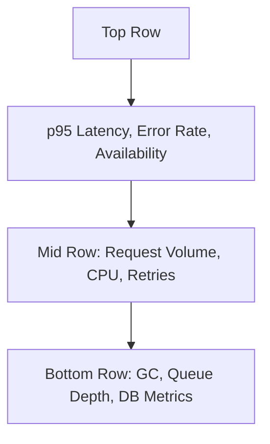

# 📊 Day 2 Quiz – Metrics  
🧪 Topic: Metrics, PromQL, Dashboards, SLIs  
🎯 Difficulty Spread: 6 Beginner, 7 Intermediate, 7 Advanced  
🔖 Based only on provided Day 2 training content

---

### 🔍 Beginner

---

**[Metric Basics] 🔍 Beginner – Multiple Choice**  
**Q1.** What are the four core parts of a metric in a time series database?  
A. Name, labels, value, timestamp  
B. Name, host, severity, unit  
C. Gauge, counter, histogram, summary  
D. Rate, value, trend, duration  

---

**[Metric Types] 🔍 Beginner – True/False**  
**Q2.** A counter metric can increase and decrease over time.  
(True/False)  

---

**[Metric Anatomy] 🔍 Beginner – Fill-in-the-Blank**  
**Q3.** Labels act as ______________ that provide additional context to metrics and help group, filter, and slice data.

---

**[Grafana Basics] 🔍 Beginner – Multiple Choice**  
**Q4.** In most Prometheus-Grafana setups, where are metrics collected from?  
A. Grafana  
B. Datadog  
C. Exporters and instrumented services  
D. Logs  

---

**[PromQL Basics] 🔍 Beginner – Matching**

Match the PromQL function to its purpose:  
| Function         | Purpose                      |
|------------------|------------------------------|
| A. rate()        | 1. Point-in-time rate        |
| B. irate()       | 2. Rolling rate over window  |
| C. sum by ()     | 3. Aggregate across labels   |

---

**[Dashboard Fundamentals] 🔍 Beginner – True/False**  
**Q6.** A flat line in a dashboard always means nothing is happening in the system.  
(True/False)

---

### 🧩 Intermediate

---

**[PromQL Filters] 🧩 Intermediate – Multiple Choice**  
**Q7.** Which of the following is an example of regex-based label filtering in PromQL?  
A. `status="500"`  
B. `status!="200"`  
C. `status=~"5.."`  
D. `status in ("5..", "4..")`

---

**[Query Analysis] 🧩 Intermediate – Fill-in-the-Blank**  
**Q8.** The function `sum by (region)(rate(http_requests_total[5m]))` is used to calculate __________ per region.

---

**[Query Practices] 🧩 Intermediate – Multiple Choice**  
**Q9.** Which of the following queries would **overload** Prometheus with high cardinality?  
A. `rate(http_requests_total{status="500"}[5m])`  
B. `rate(http_requests_total{user_id=~".*"}[5m])`  
C. `sum by (region)(rate(http_requests_total[5m]))`  
D. `avg(rate(http_requests_total[5m]))`  

---

**[Dashboard Design] 🧩 Intermediate – True/False**  
**Q10.** Good dashboards should mix production and development metrics to get a full picture.  
(True/False)

---

**[PromQL Best Practices] 🧩 Intermediate – Ordering**

Put the PromQL pipeline stages in the correct order for a successful query:  
1. Apply a function (e.g., `rate()`)  
2. Select a metric (e.g., `http_requests_total`)  
3. Filter with labels  
4. Aggregate using `sum by ()`

---

**[Dashboard Interpretation] 🧩 Intermediate – Multiple Choice**  
**Q12.** What is the primary problem with showing a raw counter on a Grafana line graph?  
A. It makes the graph too flat  
B. It only works with tables  
C. It shows accumulation, not rate  
D. It doesn’t support labels  

---

**[Label Strategy] 🧩 Intermediate – Matching**

Match each label to its proper usage classification:  
| Label           | Usage Recommendation   |
|-----------------|------------------------|
| A. region       | 1. High risk / avoid   |
| B. user_id      | 2. Caution / limited   |
| C. path         | 3. Recommended         |

---

### 💡 Advanced

---

**[SLIs vs Metrics] 💡 Advanced – Multiple Choice**  
**Q14.** Which of the following best describes an SLI?  
A. Any Prometheus metric  
B. A log line showing user activity  
C. A user-impacting metric tied to reliability goals  
D. The alert message sent to PagerDuty  

---

**[Instrumenting Metrics] 💡 Advanced – Fill-in-the-Blank**  
**Q15.** The Prometheus client library method `.inc()` is used to increment a _______________ type metric.

---

**[Burn Rate] 💡 Advanced – True/False**  
**Q16.** A burn rate of greater than 1 means you are consuming your error budget too quickly.  
(True/False)

---

**[Alert Query Design] 💡 Advanced – Multiple Choice**  
**Q17.** What is a correct alert expression for triggering when p95 checkout latency exceeds 2 seconds?  
A. `rate(checkout_latency_total[5m]) > 2`  
B. `histogram_quantile(0.95, sum(rate(checkout_duration_seconds_bucket[5m])) by (le)) > 2`  
C. `avg(rate(checkout_latency_bucket[5m])) > 2`  
D. `checkout_duration_seconds{quantile="0.95"} > 2`

---

**[Dashboard Layout] 💡 Advanced – Diagram-Based**

**Q18.** According to the dashboard layout above, which row is intended to support incident debugging?

---

**[Custom Metrics] 💡 Advanced – Multiple Choice**  
**Q19.** When should you avoid using a `summary` metric type in Prometheus?  
A. When measuring disk space  
B. When latency percentiles must be aggregated across services  
C. When the metric has no labels  
D. When using PromQL on CPU usage

---

**[SLI Definition] 💡 Advanced – Fill-in-the-Blank**  
**Q20.** The PromQL function `histogram_quantile(0.95, sum(rate(request_duration_seconds_bucket[5m])) by (le))` is used to calculate the __________ percentile latency of requests.
