# Chapter 1: Fundamentals of SRE Metrics

## **Chapter Overview: "Fundamentals of SRE Metrics"**

This chapter introduces the critical shift from traditional infrastructure-focused monitoring to outcome-based metrics that actually reflect customer experience and business impact. Set within high-stakes financial services environments, it explores how superficial metrics give a false sense of system health, leading to outages, failed transactions, and regulatory violations. Using scenes, examples, and practical frameworks, it maps out the evolution from basic monitoring to deep observability, ties in the regulatory dimension, and emphasizes instrumentation at the code level to ensure visibility is embedded, not bolted on.

______________________________________________________________________

## **Learning Objectives**

By the end of this chapter, readers should be able to:

1. Differentiate between traditional infrastructure metrics and customer-outcome-driven SRE metrics.
2. Recognize the risks of relying solely on superficial or component-level monitoring.
3. Describe the metrics evolution pathway: Monitoring → Metrics → Observability.
4. Design metrics that quantify business impact, customer experience, and regulatory compliance.
5. Implement Service Level Indicators (SLIs) and Objectives (SLOs) based on service criticality.
6. Build integrated metrics frameworks that align engineering, business, and compliance requirements.
7. Apply effective instrumentation strategies directly into service codebases.

______________________________________________________________________

## **Key Takeaways**

- **Healthy Servers ≠ Happy Customers**: Metrics must measure success from the user's perspective—not just CPU stats that make ops teams feel warm and fuzzy.
- **You Need to See the Crash Before You Hear It**: True observability lets you *predict* and *understand* failures, not just acknowledge they happened.
- **Bad Metrics Cost Money**: Especially in banking, where a bad dashboard can cost millions and make regulators pop out of the bushes.
- **SLIs & SLOs Aren’t Decorations**: They're business-aligned performance contracts, not fantasy football stats for nerds.
- **Metrics Aren’t Magic Dust**: If you don’t instrument your code with the right hooks, all your dashboards are just pretty lies.
- **Compliance Metrics Exist to Haunt You**: So integrate them before they integrate you... into an audit report.
- **Everything Ties to the Customer**: If a metric doesn't inform customer experience or business decision-making, it’s just noise.

______________________________________________________________________

## Panel 1: Why Traditional Metrics Fail

### Scene Description

The Senior SRE and the new team member are standing side-by-side, analyzing two monitors that starkly contrast in the information they display:

- **Left Monitor:** A dashboard glowing with all green indicators, showcasing seemingly perfect infrastructure health (e.g., CPU, memory, and disk utilization metrics).
- **Right Monitor:** A customer support queue inundated with reports of transaction failures, highlighting a disconnect between infrastructure metrics and actual user experience.

To illustrate this contrast, imagine the following layout:

```
+--------------------------+   +-----------------------------+
|      Infrastructure      |   |      Customer Support       |
|        Dashboard         |   |         Queue               |
|                          |   |                             |
|  CPU:    [#####     ] 70%|   |  - Transaction Failed: 102  |
|  Memory: [####      ] 50%|   |  - Payment Timeout: 67      |
|  Disk:   [######    ] 80%|   |  - Login Issues: 34         |
|                          |   |                             |
|      All Systems Green   |   |   User Impact Detected!     |
+--------------------------+   +-----------------------------+
```

The Senior SRE points at the right monitor and explains that traditional infrastructure metrics (on the left) do not always reflect the customer experience (on the right). This moment emphasizes the importance of outcome-based metrics that focus on user impact rather than internal system status.

### Teaching Narrative

SRE metrics fundamentally differ from traditional IT monitoring by measuring what matters to users rather than infrastructure health. While traditional monitoring captures system state (CPU, memory, disk utilization), SRE metrics measure service outcomes from the customer perspective. These outcome-based metrics create a direct link between technical measurements and business impact, enabling teams to understand if systems are truly meeting user needs regardless of internal component status.

### Common Example of the Problem

A major credit card authorization system shows perfect health metrics across all infrastructure components:

| **Infrastructure Metric** | **Status** |
| ------------------------- | ---------------------- |
| CPU Utilization | 15% (Healthy) |
| Memory Usage | 40% (Healthy) |
| Network Bandwidth | 30% Capacity (Healthy) |
| Service Health Checks | All "OK" |

Despite these positive indicators, the customer support queue is filling with urgent reports of declined transactions and merchant complaints. Here's the disconnect:

| **What Monitoring Captures** | **What Customers Experience** |
| ------------------------------ | --------------------------------------------------------------------- |
| Low CPU and memory utilization | Transactions failing during payment processing |
| Healthy network bandwidth | Merchants reporting authorization timeouts |
| All system health checks "OK" | Spike in declined transactions, creating frustration and lost revenue |

This discrepancy happens because traditional monitoring systems focus solely on the health of infrastructure components, not on the success rate of transactions or user-facing outcomes. The result is a dangerous false sense of security: while system components appear healthy, critical business operations are failing, leaving customers and merchants dissatisfied.

### SRE Best Practice: Evidence-Based Investigation

Implement comprehensive transaction-focused metrics that measure actual customer outcomes. Use the following checklist to guide your investigations and ensure metrics align with user impact:

#### Checklist for Transaction-Focused Metrics

- [ ] **Authorization Success Rate**: Measure the percentage of approved vs. attempted transactions to monitor customer success in real-time.
- [ ] **Segmented Success Metrics**: Track success rates segmented by:
  - [ ] Card type (e.g., Visa, Mastercard)
  - [ ] Merchant category (e.g., retail, travel)
  - [ ] Transaction value ranges (e.g., low, medium, high)
- [ ] **Latency Distribution Metrics**: Gather latency measurements across key percentiles (p50, p90, p99) to capture user-perceived delays, avoiding reliance on averages.
- [ ] **Decline Rate Metrics**: Break down failure rates with granular classifications for decline reasons (e.g., insufficient funds, fraud detection).
- [ ] **End-to-End Transaction Completion**: Monitor metrics spanning all stages of the transaction lifecycle to ensure comprehensive visibility (e.g., from initiation to settlement).

By following this checklist, teams can adopt an evidence-based approach to identifying and resolving user-impacting issues, ensuring that metrics directly reflect customer experiences.

### Banking Impact

For authorization systems, the gap between healthy infrastructure metrics and failed transactions creates direct revenue impact, customer frustration, and merchant dissatisfaction. When monitoring focuses only on system health, authorization failures can continue for hours before detection, potentially causing millions in lost transactions, damaged customer trust, and regulatory concerns.

#### Real-World Example: Payment Authorization Outage

Consider a major financial institution that experienced an undetected issue within their payment authorization system. Traditional metrics showed all backend systems as operational—CPU usage was low, memory utilization was stable, and no hardware faults were reported. However, customers and merchants began reporting a surge in transaction declines.

The root cause? A misconfigured database index slowed transaction processing for specific payment types, causing timeouts at the authorization layer. Traditional monitoring failed to detect the issue because all infrastructure components remained "healthy." By the time the problem was identified through customer complaints, the bank had already lost an estimated $5 million in declined transactions over a 3-hour period.

This incident not only caused revenue loss but also eroded customer trust and triggered inquiries from regulatory authorities. It highlighted the critical need for outcome-based metrics—such as transaction success rates and latency at the customer-facing level—to detect and address service-impacting issues in real time.

#### Key Takeaway

In financial services, focusing solely on infrastructure health can obscure critical service issues. By adopting SRE practices and monitoring customer-centric metrics, financial institutions can bridge the gap between technical performance and business outcomes, ensuring systems meet user needs while safeguarding revenue and trust.

### Implementation Guidance

To effectively implement outcome-based SRE metrics, follow the steps below, visualized in the accompanying flowchart:

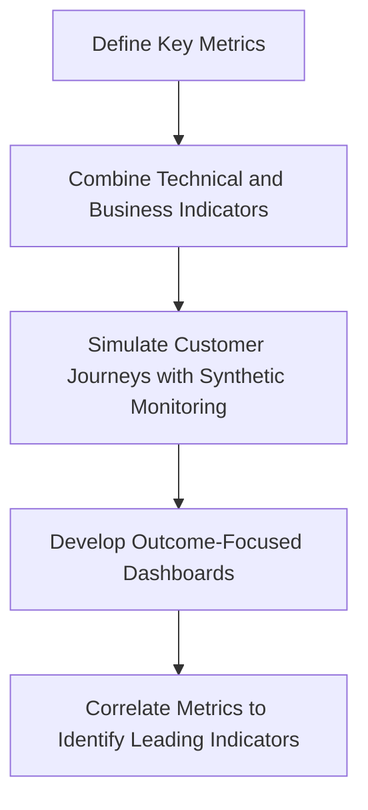

1. **Define Key Metrics**: Identify transaction success metrics that directly measure customer experience outcomes, such as transaction completion rates or page load times experienced by users.

2. **Combine Technical and Business Indicators**: Create composite metrics that blend technical performance (e.g., latency, error rates) with business success indicators (e.g., revenue per transaction, cart abandonment rates).

3. **Simulate Customer Journeys with Synthetic Monitoring**: Implement synthetic transaction monitoring to simulate real customer workflows, ensuring metrics reflect the actual user experience.

4. **Develop Outcome-Focused Dashboards**: Design dashboards that prominently display transaction success rates and other key customer-focused metrics, alongside traditional system health indicators.

5. **Correlate Metrics to Identify Leading Indicators**: Establish strong correlations between infrastructure metrics (like CPU usage or network latency) and transaction success rates to uncover leading indicators of potential issues.

## Panel 2: Metrics Evolution Pathway

### Scene Description

The monitoring evolution is depicted through a three-stage visual progression:

1. **Basic Monitoring**: Represented by a simplistic up/down dashboard, symbolizing binary state monitoring (e.g., is the system operational or not?).
2. **Metrics**: Illustrated with graphs and numerical data, showcasing quantitative measurements (e.g., latency, error rates) that indicate the severity of issues.
3. **Comprehensive Observability**: Visualized through an interconnected system capable of recognizing patterns, such as identifying anomalies in a fraud detection system, providing causal insights into system behavior.

Below is a conceptual representation of this evolution pathway:

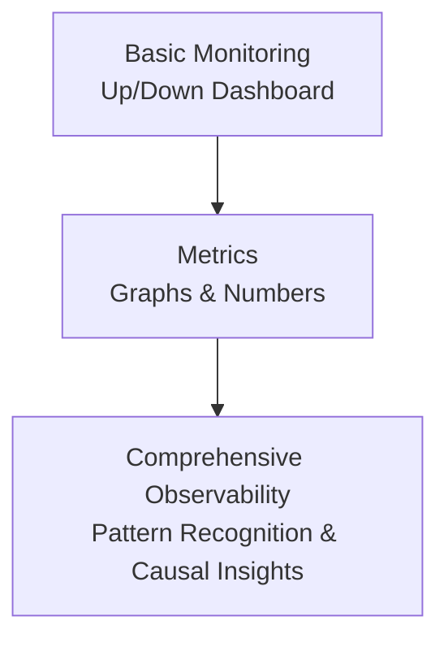

This flow highlights the progression from simple state awareness to deep system understanding, emphasizing how each stage builds upon the last to create actionable intelligence.

### Teaching Narrative

Metrics maturity follows a clear evolution from basic monitoring through metrics to comprehensive observability. This progression represents a journey of increasing measurement sophistication: monitoring tells you if something is broken (binary state), metrics tell you how badly it's broken (quantitative measurement), and observability enables you to understand why it's breaking (causal insight). Each stage builds on the previous, adding layers of measurement depth that transform raw data into actionable intelligence about system behavior.

### Common Example of the Problem

A bank's fraud detection system appears healthy according to conventional metrics:

| Metric | Current Value | Missing Measurement |
| -------------------- | ------------- | -------------------------------------- |
| Service Availability | 100% | False Positive Rate in Fraud Detection |
| API Response Time | 3ms (average) | Transaction Pattern Anomalies |
| API Error Rate | 0.1% | Decision Boundary Insights |
| CPU Utilization | Normal | Customer Behavior Analysis |
| Memory Utilization | Normal | |
| Database Connections | Functioning | |

Despite these positive indicators, customer complaints about legitimate transactions being incorrectly declined are increasing exponentially. The existing metrics fail to capture critical measurements such as false positive rates in the fraud detection algorithm, requiring deeper observability across transaction patterns, customer behavior, and decision boundaries. This highlights the gap between basic monitoring metrics and the actionable insights provided by comprehensive observability.

### SRE Best Practice: Evidence-Based Investigation

Implement a progressive metrics hierarchy that builds from basic health to comprehensive observability. Use the following checklist to guide your implementation:

#### Checklist: Progressive Metrics Hierarchy for Evidence-Based Investigation

1. **Establish Foundational Availability Metrics:**

   - [ ] Monitor service up/down status.
   - [ ] Track endpoint response success (e.g., HTTP 200 rates).

2. **Introduce Performance and Capacity Metrics:**

   - [ ] Measure response times (e.g., p95, p99 latencies).
   - [ ] Track queue depths to identify bottlenecks.
   - [ ] Monitor throughput rates for key transactions or processes.

3. **Track Business Outcome Metrics:**

   - [ ] Measure transaction success rates.
   - [ ] Record approval percentages (e.g., completed workflows, valid requests).
   - [ ] Monitor false positive rates for critical systems (e.g., fraud detection).

4. **Incorporate Customer Experience Metrics:**

   - [ ] Track completion rates for user workflows.
   - [ ] Identify abandonment points along user journeys.
   - [ ] Measure points of friction (e.g., retries, error messages).

5. **Enable Causal Relationship Metrics:**

   - [ ] Analyze correlation patterns between metrics (e.g., latency spikes vs. error rates).
   - [ ] Identify anomaly indicators using statistical or ML-based methods.
   - [ ] Develop prediction metrics to anticipate failures or performance degradation.

#### Example Flow: Metrics Maturity Pathway

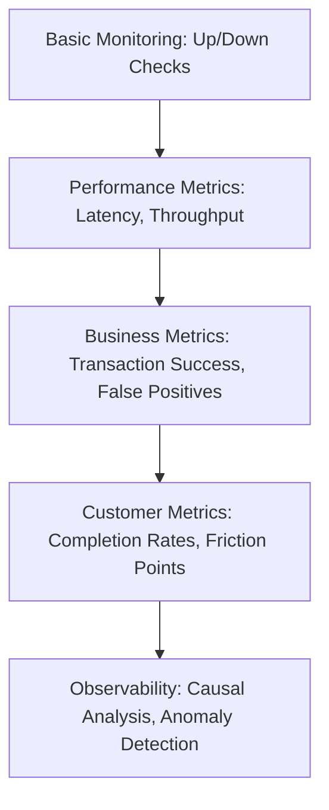

Use this pathway to align your metrics evolution with the increasing complexity and requirements of your system. Each step builds on the previous, ensuring a structured approach to achieving actionable observability.

### Banking Impact

In fraud detection systems, the gap between basic metrics and true observability directly impacts the balance between fraud prevention and customer experience. Without observability metrics that reveal false positive patterns by merchant category, geographic anomalies, or time-based triggers, banks must choose between excessive fraud exposure or frustrating legitimate customers. Enhanced metrics enable precision tuning that simultaneously improves fraud capture and customer satisfaction, directly affecting both security posture and revenue retention.

### Implementation Guidance

To effectively advance along the metrics evolution pathway, follow these step-by-step guidelines with a concrete example for clarity:

1. **Assess Current Metrics Maturity**\
   Begin by evaluating your team’s current monitoring and metrics capabilities. Identify whether you are primarily operating with basic up/down monitoring, quantitative metrics, or initial observability tools.\
   *Example:* The team reviews their current setup and finds they rely on a simplistic dashboard showing server uptime and error counts but lack insights into application performance or root cause analysis.

2. **Establish a Metrics Evolution Roadmap**\
   Define a roadmap that incrementally moves from monitoring to metrics to observability. Prioritize based on the criticality of business needs and system complexity.\
   *Example:* The team decides their first milestone is to implement key performance indicators (KPIs) that measure API response times and user transaction success rates.

3. **Implement Business Outcome Metrics**\
   Integrate metrics that go beyond system health to measure the impact on business objectives, such as algorithm effectiveness or user experience.\
   *Example:* The team introduces a metric tracking the accuracy of their fraud detection algorithm, which directly ties to reducing financial losses.

4. **Develop Correlation Metrics**\
   Introduce metrics that correlate seemingly unrelated data points, enabling identification of hidden patterns or root causes.\
   *Example:* The team creates a correlation between login failures and latency spikes, uncovering that a specific database query is overloading during peak traffic.

5. **Create Pattern Detection Metrics**\
   Build metrics that detect patterns indicative of emerging issues, such as gradual performance degradation or anomalous user behavior.\
   *Example:* The team sets up anomaly detection on payment transaction volumes, alerting them to potential fraud attempts or system misconfigurations before revenue is impacted.

6. **Build Exploratory Observability Dashboards**\
   Transition from static reporting to dynamic, exploratory dashboards that allow for real-time querying and investigation of system behaviors.\
   *Example:* The team develops a dashboard with interactive filters to segment metrics by geography, user type, and time, enabling rapid diagnosis of regional service outages.

### Example Evolution Flow

Here’s a simplified representation of the pathway as a team implements these steps:

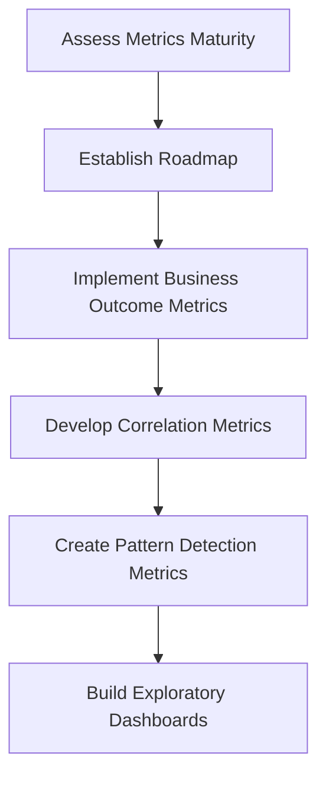

By following this structured approach, teams can systematically enhance their metrics capabilities, transforming raw data into actionable insights and achieving a mature observability posture.

## Panel 3: The Business Cost of Metric Blindness

### Scene Description

Emergency meeting with the CRO unfolds as financial impact dashboards are presented, highlighting the cascading effects of a mobile banking outage during payroll day. The room focuses on a trio of critical charts:

1. **Financial Losses Over Time**\
   A line graph showing a steep upward trajectory of monetary losses, starting from the initial minutes of the outage and escalating as the downtime persists.

2. **Regulatory Penalties**\
   A bar chart illustrating accruing fines, with each bar representing penalty thresholds triggered at predefined outage durations.

3. **Customer Churn Metrics**\
   A pie chart breaking down the percentage of customers leaving the platform, segmented by severity of dissatisfaction (e.g., delays, failed transactions).

Below is a simple representation of the financial losses chart to illustrate the escalating impact:

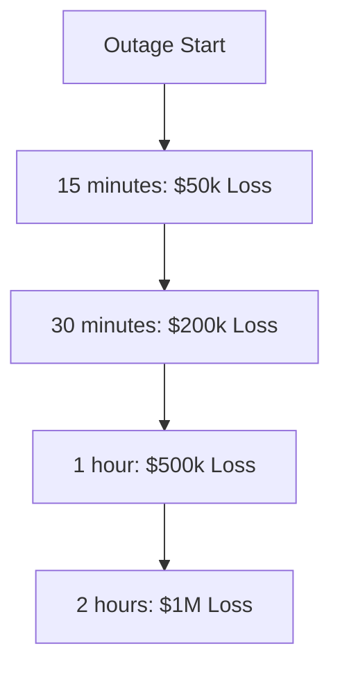

These visuals underscore the urgency of real-time metrics in mitigating damage, as each passing minute compounds the financial, legal, and reputational toll on the business.

### Teaching Narrative

Comprehensive metrics provide essential visibility that directly impacts business outcomes through faster detection, more effective response, and clearer communication during incidents. This "illumination" function of metrics transforms incident management from reactive to proactive by providing early warning of developing issues, precise impact assessment, and measurement-driven recovery tracking. For financial institutions, each minute without appropriate metrics during an incident translates directly to increased costs across multiple dimensions.

### Common Example of the Problem

A mobile banking platform fails during peak payroll processing, but operations teams lack critical visibility metrics. The incident's progression and impact are exacerbated by the absence of essential data at each stage. Below is a timeline illustrating how the lack of metrics compounded the issue:

```mermaid
gantt
    title Incident Timeline: The Cost of Metric Blindness
    dateFormat HH:mm
    section Incident Progression
    Initial Failure Detected: milestone, m1, 09:00, 1min
    Unknown Degradation (No Early Warning): active, d1, after m1, 30min
    Outage Declared (Only Binary Visibility): crit, o1, after d1, 10min
    Response Delayed (No Scope/Impact Metrics): active, r1, after o1, 40min
    Financial Exposure Grows (No Transaction Metrics): active, f1, after r1, 30min
    Resolution Achieved (No Historical Guidance): done, res1, after f1, 30min
    section Business Impact
    Customer Complaints Spike: active, c1, 09:30, 2h
    Regulatory Penalties Prepare: active, p1, 10:00, 1h
    Financial Loss Accumulates: active, l1, 09:00, 3h
```

Key visibility gaps during the incident included:

- **No degradation metrics** showing the progression of issues before the platform failed, missing early warning signs.
- **No transaction volume metrics** by channel or type, leaving teams unable to quantify the scope of the impact or prioritize response efforts.
- **No financial value metrics** to assess monetary exposure, delaying decisions on mitigation measures.
- **No historical performance metrics** for comparison, leading to longer resolution times due to lack of guidance.
- **No regulatory compliance metrics** to guide accurate and timely reporting to authorities.

This metrics gap turned what could have been a 30-minute minor incident into a three-hour major outage with corresponding financial and reputational damage. Teams were forced to rely on guesswork and assumptions, magnifying both the response time and the scale of the business impact.

### SRE Best Practice: Evidence-Based Investigation

Implement comprehensive incident metrics across the full lifecycle to enable faster detection, precise impact assessment, and effective response. Use the following checklist to guide metric implementation at each stage:

#### **Checklist: Key Metrics for Incident Lifecycle**

1. **Early Detection Metrics**

   - [ ] Progressive degradation metrics: Monitor trends signaling gradual performance decline.
   - [ ] Baseline deviation metrics: Identify anomalies by comparing to historical norms.
   - [ ] Leading indicator metrics: Predict potential issues before they escalate.

2. **Impact Quantification Metrics**

   - [ ] Transaction volume metrics: Measure affected transactions by service and channel.
   - [ ] Financial value metrics: Quantify losses for disrupted operations.
   - [ ] Customer segment impact metrics: Prioritize based on customer value and priority.

3. **Response Effectiveness Metrics**

   - [ ] Recovery progression metrics: Track remediation efforts and milestones.
   - [ ] Transaction success rate restoration metrics: Monitor as services recover.
   - [ ] Backlog processing metrics: Measure the clearance of delayed operations.

4. **Regulatory Compliance Metrics**

   - [ ] Service availability metrics: Ensure alignment with regulatory uptime definitions.
   - [ ] Customer impact metrics: Capture data for required incident reporting.
   - [ ] Financial exposure metrics: Assess materiality for compliance purposes.

#### **Lifecycle Metric Flow Example**

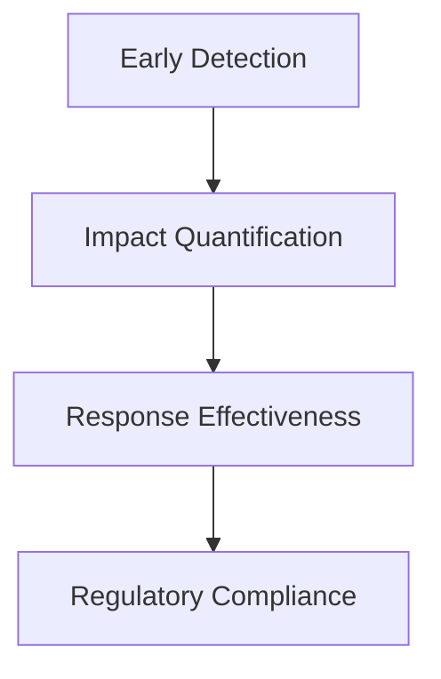

By following this checklist and maintaining visibility across the lifecycle, SRE teams can drive evidence-based investigations, enabling proactive management and reducing the business cost of metric blindness.

### Banking Impact

The cost of inadequate metrics during banking incidents cascades across multiple dimensions. A detailed breakdown of these cost categories is provided below:

| **Cost Category** | **Examples** | **Potential Dollar Impact** |
| --------------------------- | ------------------------------------------------------------------------ | ------------------------------------- |
| **Direct Financial Impact** | Failed transactions, compensation payments, penalty interest | $500,000 - $2,000,000 per hour |
| **Operational Costs** | Extended resolution time, emergency resource allocation, recovery effort | $200,000 - $800,000 per incident |
| **Regulatory Consequences** | Reporting violations, examination findings, compliance penalties | $1,000,000+ in fines and legal fees |
| **Customer Impact** | Relationship damage, trust erosion, potential attrition | Loss of 5-10% of high-value customers |

When metrics enable just 15 minutes faster detection and resolution, the financial benefit can be measured in millions of dollars for critical banking services during peak periods. This underscores the importance of robust metrics in minimizing incident costs and protecting long-term business performance.

### Implementation Guidance

To successfully implement metrics that provide actionable insights during incidents, follow the step-by-step process outlined below:

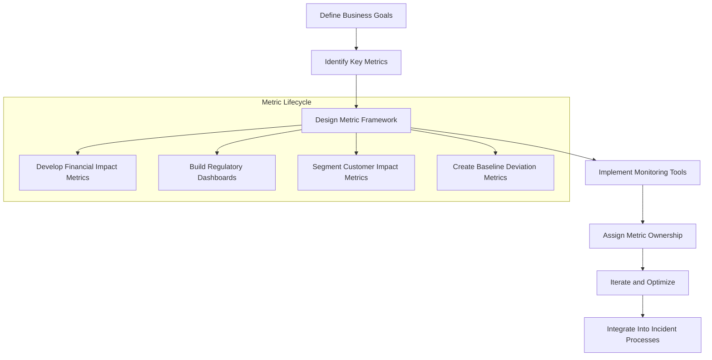

1. **Define Business Goals**: Align metrics creation with key business objectives, such as minimizing financial losses, ensuring regulatory compliance, and improving customer retention.
2. **Identify Key Metrics**: Focus on metrics that translate technical incidents into measurable business impacts, such as:
   - Financial impact metrics quantifying losses during downtime.
   - Compliance metrics tracking adherence to regulatory thresholds.
   - Customer impact metrics segmented by value tier and relationship importance.
   - Comparative metrics showing deviations from baseline performance.
3. **Design Metric Framework**: Organize metrics into a structured framework, ensuring they are actionable, measurable, and tied to specific incident scenarios.
4. **Implement Monitoring Tools**: Deploy tools and platforms to monitor, collect, and visualize the defined metrics in real-time.
5. **Assign Metric Ownership**: Establish clear accountability by assigning metric ownership to cross-functional teams, including both technical and business stakeholders.
6. **Iterate and Optimize**: Regularly review metrics for relevance and accuracy, incorporating feedback from incidents to refine their design and utility.
7. **Integrate Into Incident Processes**: Embed metrics into incident detection, response, and recovery workflows to enable faster and more informed decision-making.

By following this structured approach, organizations can achieve the "illumination" function of metrics, transforming incident management from reactive to proactive and mitigating the business costs of metric blindness.

## Panel 4: From Data Points to Meaningful Signals

### Scene Description

The team gathers around a whiteboard, engaged in a collaborative brainstorming session to define critical SLIs for ATM services. The discussion focuses on identifying the technical metrics that best represent customer experience and combining them into meaningful indicators.

Below is a conceptual visualization of the journey from raw technical metrics to meaningful customer experience indicators:

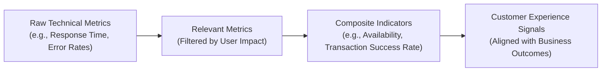

This transformation process emphasizes the importance of selecting metrics that correlate with service quality from the user's perspective. The session highlights the collaborative effort required to bridge technical measurements and business outcomes, ultimately creating a shared understanding between technical teams and stakeholders.

### Teaching Narrative

Service Level Indicators (SLIs) transform isolated technical metrics into meaningful measurements of customer experience. This transformation process requires identifying which metrics truly correlate with service quality from the user perspective and combining technical measurements into composite indicators that reflect business outcomes. Effective SLIs bridge the gap between what we can measure technically and what actually matters to customers, creating a shared language between technical and business stakeholders.

### Common Example of the Problem

Imagine trying to assemble a jigsaw puzzle, but instead of seeing the full picture on the box, you only have a random collection of pieces. Each piece might be detailed and well-crafted, but without understanding how they fit together, it’s impossible to see the bigger picture.

An ATM operations team faces a similar challenge when monitoring dozens of technical metrics:

- Network latency measured in milliseconds
- Cash dispenser mechanism operational status
- Card reader error frequency percentage
- Receipt printer paper supply level
- Software service health checks

These individual metrics, while precise, are like isolated puzzle pieces—they don't inherently answer the critical question: can customers successfully complete their banking transactions? For instance, an ATM with a failing receipt printer may pass all technical health checks and be marked "operational," yet it frustrates customers when it cannot complete their requests due to error messages. The metrics, in this case, fail to come together into a meaningful signal that reflects what truly matters for the business and the customer experience.

To create a coherent picture, we need to combine these pieces into composite indicators that measure the customer’s ability to achieve their goals, bridging the gap between technical monitoring and business outcomes.

### SRE Best Practice: Evidence-Based Investigation

Transform technical metrics into meaningful SLIs through systematic refinement. Use the following checklist to guide the process:

#### Checklist for Transforming Metrics into SLIs

1. **Understand the Customer Journey**

   - [ ] Map the complete transaction paths from the customer's perspective.
   - [ ] Identify critical success points in each journey.
   - [ ] Document potential failure modes that could impact successful completion.

2. **Define Success Metrics**

   - [ ] Identify transaction completion rate metrics (e.g., initiated vs. successfully completed).
   - [ ] Measure time-to-completion from the customer's perspective.
   - [ ] Include error recovery metrics to reflect the service’s resilience to minor issues.

3. **Develop Composite Indicators**

   - [ ] Combine multiple technical metrics to create SLIs representing key outcomes:
     - [ ] **Cash Availability SLI**: Tracks ATM cash availability through inventory, refill status, and system uptime.
     - [ ] **Operational Capability SLI**: Reflects all required ATM functions, such as withdrawals, deposits, and balance inquiries.
     - [ ] **Customer Experience SLI**: Incorporates speed, success rates, and usability factors to gauge overall satisfaction.

4. **Validate and Iterate**

   - [ ] Correlate proposed SLIs with real customer feedback and business outcomes.
   - [ ] Test SLIs under varying conditions to ensure reliability.
   - [ ] Refine based on operational insights and evolving customer needs.

#### Process Visualization

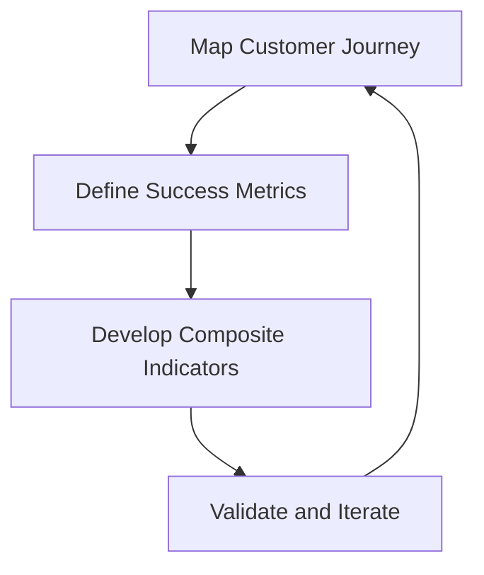

### Banking Impact

For ATM services, the gap between technical metrics and customer-centric SLIs directly impacts both satisfaction and operational efficiency. A technically "available" ATM that frustrates customers with slow performance or confusing errors drives transactions to more expensive channels like branches or call centers. Effective SLIs enable the team to prioritize improvements based on actual customer impact rather than technical elegance, optimizing both experience and cost-effectiveness simultaneously.

To clarify the relationship between raw technical metrics and customer outcomes, consider the following flow:

```
Technical Metric (e.g., ATM uptime) 
    ↓
Service Level Indicator (SLI) (e.g., Successful transaction rate within 5 seconds)
    ↓
Customer Impact (e.g., Faster transactions, reduced frustration)
    ↓
Business Outcome (e.g., Higher customer satisfaction, reduced operational costs)
```

This flow highlights how technical measurements, when thoughtfully aligned with user experience, can drive both customer satisfaction and business value. By focusing on SLIs that reflect meaningful customer outcomes, teams can bridge the gap between technical operations and business priorities.

### Implementation Guidance

To effectively implement Service Level Indicators (SLIs) that bridge technical metrics and customer experience, follow these structured steps:

| **Step** | **Purpose** | **Example Output** |
| -------- | ---------------------------------------------------------------------------------------------- | ---------------------------------------------------------------------------------------------------------------------------------------------------- |
| 1 | Create customer journey maps for all critical ATM transaction types with measurement points | A detailed map showing key stages like card insertion, PIN entry, cash withdrawal, and receipt printing, with associated metrics. |
| 2 | Develop composite SLIs that reflect successful journey completion rather than component health | A composite SLI such as "ATM Transaction Success Rate," combining metrics like card authentication, cash availability, and receipt printing success. |
| 3 | Implement weighted metric calculations that prioritize customer-visible components | Calculation formula where metrics like cash availability are weighted more heavily than receipt printing. |
| 4 | Establish correlation analysis between SLIs and customer satisfaction/complaint metrics | A report showing a strong positive correlation between the "ATM Transaction Success Rate" and Net Promoter Score (NPS). |
| 5 | Create regular SLI effectiveness reviews using actual customer feedback and behavior data | Quarterly review documentation summarizing customer feedback trends and adjustments to SLIs for improved alignment. |

This structured approach ensures SLIs are both technically robust and aligned with meaningful customer outcomes.

## Panel 5: Setting Realistic Performance Targets

### Scene Description

The scene opens with an SRE engaged in a discussion with the product team about setting reliability requirements for a critical payment system. A trade-off graph is prominently displayed, illustrating the relationship between reliability metrics, innovation velocity, and cost efficiency. The graph features an "S-curve" where diminishing returns in velocity and cost become evident as reliability approaches ultra-high levels like "five nines" (99.999%). The "five nines" target is highlighted with question marks, emphasizing its aspirational nature and prompting critical evaluation.

Below is a conceptual representation of the trade-off graph:


This visual helps contextualize the negotiation, showcasing the economic and technical trade-offs the team must navigate while prioritizing reliability for a high-criticality system.

### Teaching Narrative

Service Level Objectives (SLOs) transform SLI measurements into target performance levels, creating a quantitative reliability framework. Unlike aspirational goals, effective SLOs require calibration based on business requirements, technical capabilities, and economic trade-offs. The metrics challenge lies in setting values that balance reliability needs against innovation velocity and cost efficiency while reflecting actual service criticality rather than applying uniform standards across all systems.

### Common Example of the Problem

A bank's payment processing product team demands "five nines" reliability (99.999%, equating to just 5 minutes downtime per year) for all payment-related services based on these metrics:

- API availability: 99.999%
- Transaction success rate: 99.999%
- Response time: < 200ms for 99.999% of requests

This uniform approach disregards crucial differences between payment types that should be reflected in differentiated metric targets. Below is a comparison of reliability requirements and criticality for different payment services:

| **Payment Type** | **Criticality** | **Suggested Reliability Target** | **Key Metric Considerations** |
| ---------------------------- | ------------------------------------------ | -------------------------------- | --------------------------------------------------------------------------------- |
| High-Value Wire Transfers | Extremely high (millions per transaction) | 99.999% | Prioritize reliability and transaction success rate; minor latency is tolerable. |
| Retail Card Authorizations | High (high volume, lower individual value) | 99.99% | Prioritize throughput and low-latency response; minor failure rate is acceptable. |
| Account Information Requests | Moderate (non-transactional data access) | 99.9% | Moderate reliability; focus on cost efficiency and acceptable response time. |

By applying uniform "five nines" standards, the SLO metrics create impossible benchmarks for less critical services while inadequately addressing the needs of truly business-critical functions. Differentiated targets ensure resources are allocated effectively and trade-offs align with service criticality.

### SRE Best Practice: Evidence-Based Investigation

Implement a differentiated SLO framework based on service criticality and business impact. Use the following checklist to guide your process:

#### Checklist for Implementing a Differentiated SLO Framework

1. **Understand Service Criticality**

   - Categorize services based on business impact and user needs.
   - Identify Tier 1 (mission-critical), Tier 2 (important but less critical), and Tier 3 (supporting or informational) services.

2. **Define Service-Specific SLOs**

   - For each service tier, establish appropriate reliability targets:
     - **Tier 1:** Settlement and high-value transfers (e.g., 99.99%+ availability).
     - **Tier 2:** Standard payment processing (e.g., 99.9%+ availability).
     - **Tier 3:** Informational services (e.g., 99.5%+ availability).

3. **Incorporate Multi-Dimensional Metrics**

   - Define and measure SLOs across multiple dimensions:
     - **Availability:** Successful response percentage.
     - **Latency:** Response times at key percentiles (e.g., p50, p90, p99).
     - **Throughput:** Peak capacity requirements.
     - **Accuracy:** Transaction correctness.

4. **Align Metrics with Economic Considerations**

   - Evaluate the cost implications of increasing reliability:
     - **Cost-per-Reliability-Increment:** Quantify the economic impact of achieving higher availability.
     - **Innovation Impact:** Assess how reliability targets affect development velocity and innovation.
     - **Error Budget Utilization:** Use error budgets to balance reliability goals with calculated risk-taking.

5. **Calibrate Based on Real-World Data**

   - Regularly review historical performance data to validate SLO targets.
   - Adjust targets to reflect evolving business priorities and technical constraints.

6. **Communicate SLO Decisions**

   - Share SLO rationale with stakeholders to ensure clarity and alignment.
   - Use visualizations or trade-off graphs to highlight the balance between reliability, cost, and innovation.

#### Example Service Categorization Metrics

| Service Tier | Example Services | Availability Target |
| ------------ | -------------------------------- | ------------------- |
| Tier 1 | Settlement, high-value transfers | 99.99%+ |
| Tier 2 | Standard payment processing | 99.9%+ |
| Tier 3 | Informational services | 99.5%+ |

By following this checklist, you can create an evidence-based, differentiated SLO framework that balances reliability needs with business objectives and technical feasibility.

### Banking Impact

For payment systems, appropriate SLO calibration directly impacts both service reliability and innovation velocity. Excessive reliability requirements for non-critical services create unnecessary engineering costs, slow feature development, and reduce competitiveness. Insufficient reliability targets for critical services may allow unacceptable failure rates for high-value transactions. Finding the right balance requires metrics that reflect the actual business impact of different reliability levels for each service type.

### Implementation Guidance

To effectively implement Service Level Objectives (SLOs), follow the step-by-step process outlined below:

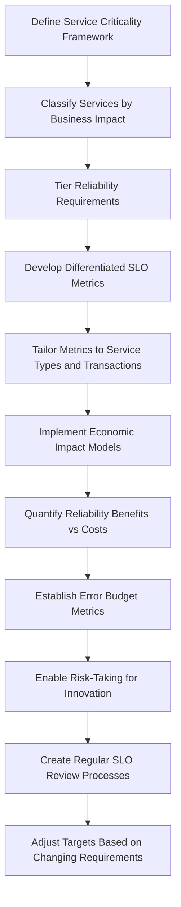

1. **Define Service Criticality Framework**\
   Begin by classifying services based on their business impact. Assign tiered reliability requirements, ensuring that critical systems prioritize higher reliability while less critical systems allow for more flexibility.

2. **Develop Differentiated SLO Metrics**\
   Tailor SLO metrics to reflect the unique characteristics of each service type and transaction category. Avoid a one-size-fits-all approach by aligning metrics with specific operational and user needs.

3. **Implement Economic Impact Models**\
   Quantify the trade-offs between reliability benefits and associated costs. Use these models to guide decisions that balance reliability with innovation velocity and cost efficiency.

4. **Establish Error Budget Metrics**\
   Define error budgets that act as a buffer for permissible failures. These metrics enable calculated risk-taking, allowing teams to experiment and innovate without compromising overall service reliability.

5. **Create Regular SLO Review Processes**\
   Develop processes to review and refine SLOs periodically. Adjust targets based on evolving business requirements, technical capabilities, and customer expectations, ensuring the SLOs remain aligned with organizational goals.

## Panel 6: Aligning Technical and Regulatory Metrics

### Scene Description

The scene depicts a meeting between an SRE, a compliance officer, and a business stakeholder focused on aligning service level requirements. The discussion emphasizes the integration of internal SLOs, customer SLAs, and regulatory reporting requirements. Below is a text-based representation of the hierarchy diagram that visually connects these elements and their interdependencies:

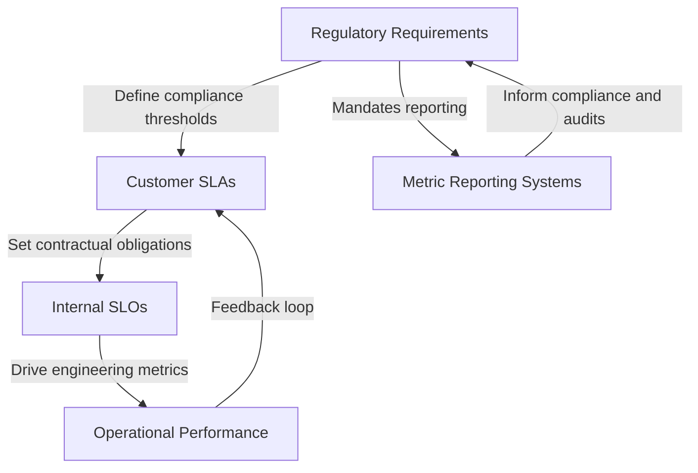

This hierarchy demonstrates how regulatory requirements inform customer SLAs, which in turn influence internal SLOs. Internal SLOs drive operational performance while feeding back into customer SLAs. Regulatory mandates also require metric reporting systems to ensure compliance, creating a cyclical relationship between these elements.

### Teaching Narrative

Financial services metrics exist within a complex regulatory framework that imposes external requirements on measurement, reporting, and performance standards. Effective metric design must integrate these regulatory requirements with internal operational needs, creating a cohesive measurement system that satisfies compliance obligations while providing practical utility for engineering teams. This integration prevents the proliferation of parallel, disconnected measurement systems that create confusion and compliance gaps.

### Common Example of the Problem

A bank implements SLO metrics based solely on engineering considerations without incorporating regulatory requirements. This creates three parallel measurement systems, leading to conflicting outputs during incidents:

| **Metric System** | **Focus** | **Example Measurement** | **Primary Concern During Incident** |
| ------------------------ | ----------------------- | ---------------------------------------------- | -------------------------------------------------------------------------------------------- |
| **Engineering Metrics** | Technical performance | Response time, error rates | Show performance within acceptable thresholds, leading to a false sense of stability. |
| **Compliance Metrics** | Regulatory requirements | Availability calculations, incident thresholds | Highlight regulatory violations if thresholds are crossed, even if unnoticed by engineering. |
| **Customer SLA Metrics** | Contractual obligations | Processing time guarantees | Indicate SLA breaches impacting customer commitments, potentially triggering penalties. |

#### Incident Flow Example

Below is a flow representation of the confusion caused by these disconnected systems during an incident:

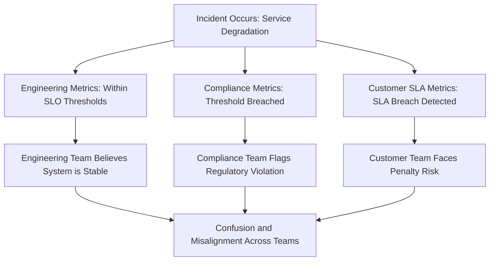

This disjointed system creates dangerous delays in incident response and compliance violations, even as engineering teams believe systems are operating acceptably. Integrating these metrics into a unified framework is essential to avoid such conflicts and ensure cohesive incident management.

### SRE Best Practice: Evidence-Based Investigation

Create an integrated metrics framework that aligns technical, contractual, and regulatory requirements by following this step-by-step guide:

#### **Step 1: Map Regulatory Metrics**

- Identify key metrics mandated by regulations:
  - Availability metrics based on calendar uptime requirements.
  - Processing time metrics for specific regulated transaction types.
  - Incident classification metrics with defined thresholds for mandatory reporting.
  - Security and compliance metrics required by industry standards or banking regulations.
- Document these regulatory metrics and their specific thresholds.

#### **Step 2: Build a Metrics Hierarchy**

- Define the relationships between different levels of metrics:
  - **Technical Metrics**: Core system performance indicators like latency, error rates, and uptime.
  - **Business Metrics**: Aggregated indicators tied to regulatory compliance, such as transaction processing times.
  - **Customer Metrics**: Metrics tied to service-level agreements (SLAs), such as response times and availability guarantees.
- Use a structured approach to map dependencies between these layers. For example:
  ```
  Technical -> Business -> Regulatory
             -> Customer
  ```
- Ensure traceability between metric levels to identify how lower-level technical metrics contribute to higher-level compliance and customer obligations.

#### **Step 3: Align Thresholds Across Metrics**

- Set internal thresholds tighter than external regulatory requirements to allow for early detection and proactive responses.
- Define graduated response thresholds, triggering different levels of alerts and escalation based on severity:
  - **Warning**: Early signs of deviation from acceptable performance.
  - **Critical**: Imminent risk of regulatory or SLA violation.
  - **Breach**: Threshold exceeded requiring immediate action and reporting.
- Incorporate leading indicator metrics to predict potential compliance or SLA violations before they occur.

#### **Step 4: Validate and Iterate**

- Regularly review the framework to ensure alignment with:
  - Updated regulatory requirements.
  - Changes in business objectives or SLAs.
  - Evolving technical infrastructure and operational practices.
- Run tabletop exercises with cross-functional teams (SRE, compliance, business stakeholders) to test the framework's effectiveness in realistic scenarios.
- Gather feedback and refine the framework as needed.

#### Checklist for Implementation

- [ ] Have regulatory metrics been fully identified and documented?
- [ ] Are technical, business, and customer metrics clearly mapped in a hierarchy?
- [ ] Are internal thresholds tighter than external requirements?
- [ ] Are graduated response thresholds defined and actionable?
- [ ] Are leading indicators in place to detect potential violations early?
- [ ] Has the framework been validated with cross-functional reviews or exercises?
- [ ] Is there a plan for continuous review and iteration of the framework?

### Banking Impact

Misalignment between technical and regulatory metrics creates significant compliance risk beyond the immediate operational impact. When metrics don't properly reflect regulatory definitions, systems might violate reporting requirements without triggering internal alerts, creating liability for notification failures, examination findings, and potential penalties. Integrated metrics ensure operations teams understand the compliance implications of technical performance and respond appropriately to emerging issues.

### Implementation Guidance

1. **Create comprehensive mapping between technical metrics and regulatory requirements**\
   Begin by documenting the relationships between internal service level objectives (SLOs), customer service level agreements (SLAs), and external regulatory reporting requirements. This mapping ensures that all metrics align with compliance needs without duplicating efforts.

2. **Implement regulatory threshold monitoring with appropriate buffer margins**\
   Establish monitoring systems to track regulatory thresholds, applying buffer margins as an early warning mechanism. This allows teams to address potential issues before they escalate into compliance violations.

3. **Develop integrated dashboards showing both technical and compliance perspectives**\
   Utilize dashboards to bring together technical and regulatory metrics into a single view. Below is a conceptual example of an integrated dashboard layout:

   ```
   +---------------------------------------------------+
   |                  Integrated Dashboard             |
   +--------------------+------------------------------+
   | Metric Category    | Example Metrics             |
   +--------------------+------------------------------+
   | Technical SLOs     | Latency: 95th pct < 200ms   |
   |                    | Error Rate: < 0.01%         |
   +--------------------+------------------------------+
   | Regulatory Metrics | Uptime: > 99.9%             |
   |                    | Data Retention Compliance   |
   +--------------------+------------------------------+
   | Alerts             | Latency approaching 180ms   |
   |                    | SLA breach risk detected    |
   +--------------------+------------------------------+
   ```

   This unified view allows teams to quickly compare internal performance with external obligations, reducing overlaps and misalignments.

4. **Build automated notification systems for approaching regulatory thresholds**\
   Design notification systems that proactively alert stakeholders when metrics approach critical thresholds. Ensure these notifications are context-rich, providing actionable details and prioritization based on compliance risks.

5. **Establish joint metrics reviews with engineering, compliance, and business stakeholders**\
   Schedule regular cross-functional reviews to evaluate metric performance and adjust thresholds or monitoring practices as needed. These reviews foster collaboration and ensure ongoing alignment between technical operations and regulatory compliance.

## Panel 7: Building Measurement into Code

### Scene Description

The scene depicts a Developer and an SRE pair programming to instrument a new transaction processing service. A split screen displays the code "before" and "after" instrumentation. The "before" side shows the original code without any measurement points, while the "after" side highlights the added instrumentation with comments and markers indicating key measurement points.

Below is a conceptual representation of the split screen:

**Before Instrumentation:**

```plaintext
// Transaction processing service
function processTransaction(transaction) {
    validateTransaction(transaction);
    applyBusinessRules(transaction);
    completeTransaction(transaction);
}
```

**After Instrumentation:**

```plaintext
// Transaction processing service with instrumentation
function processTransaction(transaction) {
    logMetric("transaction_received", { transactionId: transaction.id });
    validateTransaction(transaction);

    logMetric("validation_completed", { transactionId: transaction.id });
    applyBusinessRules(transaction);

    logMetric("business_rules_applied", { transactionId: transaction.id });
    completeTransaction(transaction);

    logMetric("transaction_completed", { transactionId: transaction.id, status: "success" });
}
```

Key measurement points such as `transaction_received`, `validation_completed`, and `transaction_completed` are annotated in the "after" view. These metrics capture both technical performance and business-critical data, enabling deeper visibility into the service's operation and impact on customer experience.

### Teaching Narrative

Comprehensive metrics begin with effective instrumentation - the systematic addition of measurement points within applications. Even the most sophisticated monitoring systems cannot provide visibility without properly placed instrumentation that captures the right data at appropriate points in the processing flow. For banking systems, this instrumentation must measure not just technical performance but also business context, transaction characteristics, and customer experience factors.

### Common Example of the Problem

A bank deploys a new transaction processing service with minimal instrumentation, capturing only basic availability data. The application logs contain limited timing information, no transaction context, and inconsistent formatting. When performance issues emerge, the operations team lacks critical visibility:

- Which transaction types experience problems (no business context metrics)
- Where in the process bottlenecks occur (no component-level timing metrics)
- Whether specific customer segments are affected (no user dimension metrics)
- How current performance compares to historical patterns (no baseline metrics)

This instrumentation gap transforms troubleshooting from data-driven analysis to speculative guesswork, extending resolution time and customer impact.

Below is a simplified flow of the transaction processing service, illustrating missing instrumentation points:

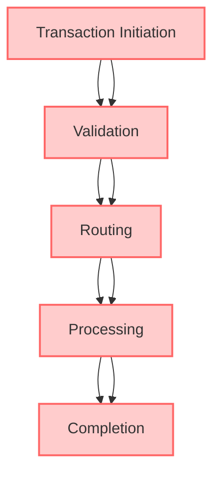

Key gaps in instrumentation along the flow include:

- **Transaction Initiation:** No metrics to identify transaction type or customer segment.
- **Validation:** Lack of timing data to detect delays in validation logic.
- **Routing:** No metrics tracking routing decisions or downstream dependencies.
- **Processing:** Missing component-specific timing or resource usage metrics.
- **Completion:** No baseline data to compare against historical performance.

Without capturing these metrics at critical points, understanding and resolving performance issues becomes a time-consuming and error-prone process.

### SRE Best Practice: Evidence-Based Investigation

Implement a comprehensive instrumentation strategy across three key dimensions. Use the following checklist to ensure all critical measurement points are covered:

| **Dimension** | **Key Metrics** | **Purpose** |
| ------------------------- | ------------------------------------------------------------- | -------------------------------------------------------------------------- |
| **Technical Performance** | - Function-level timing metrics for processing steps | Identify bottlenecks and optimize performance. |
| | - Error capture metrics with detailed classification | Provide actionable insights into failure patterns. |
| | - Resource utilization metrics (threads, connections, memory) | Monitor and manage resource efficiency. |
| | - Dependency performance metrics for external services | Ensure reliability and responsiveness of integrations. |
| **Business Context** | - Transaction type classification metrics | Analyze and optimize for specific transaction categories. |
| | - Processing stage tracking metrics | Track progress and identify delays across stages. |
| | - Amount range and risk category metrics | Enable risk-based analysis and reporting. |
| | - Merchant or counterparty classification metrics | Provide insights into partner or merchant-specific performance. |
| **Customer Experience** | - User segment identification metrics | Tailor optimizations for different customer groups. |
| | - Channel and device context metrics | Understand and enhance user experience across channels and devices. |
| | - Session and journey position metrics | Pinpoint user interactions and their context within the workflow. |
| | - Historical context and relationship metrics | Leverage prior interactions to improve personalization and predict issues. |

### Banking Impact

For transaction processing, instrumentation quality directly determines both operational visibility and control effectiveness. Inadequate instrumentation creates dangerous blind spots where issues develop undetected, potentially allowing transaction failures to persist without mitigation.

#### Case Study: The Cost of Poor Instrumentation

In one real-world example, a major retail bank suffered a prolonged outage in its transaction processing system, affecting millions of customers during a peak shopping season. The root cause was a subtle delay in a third-party API call for fraud detection. However, due to sparse and poorly placed instrumentation, the delay went unnoticed until transactions began timing out en masse. Without visibility into the API's performance metrics or transaction flow bottlenecks, the troubleshooting team took hours to isolate the issue. During that time, customers experienced failed payments, declined transactions, and account inaccuracies, leading to reputational damage and regulatory scrutiny.

#### The Value of Comprehensive Instrumentation

If the bank had implemented comprehensive instrumentation, critical measurement points would have been in place to monitor transaction latencies, API response times, and error rates. A well-instrumented system would have immediately flagged the API delay as an anomaly, allowing the team to respond proactively and mitigate customer impact. Comprehensive instrumentation not only ensures rapid identification and resolution of issues but also provides valuable insights for optimizing transaction flows, enhancing both technical performance and customer experience.

### Implementation Guidance

1. **Develop Standardized Instrumentation Libraries**\
   Create reusable libraries with consistent metric definitions for all banking applications. This ensures uniformity and simplifies integration across services. For example, in a Python application, a standardized instrumentation library might look like this:

   ```python
   from monitoring_library import Metrics

   # Define standard metrics
   metrics = Metrics(service_name="transaction_service")

   # Measure request processing time
   def process_transaction(transaction):
       with metrics.timer("transaction_processing_time"):
           # Transaction processing logic
           pass

   # Record custom business metric
   def record_transaction(transaction):
       metrics.increment("transactions_total", tags={"transaction_type": transaction.type})
   ```

2. **Implement Comprehensive Timing Metrics**\
   Add precise timing metrics at all critical stages of transaction processing, such as request receipt, validation, processing, and response. For example:

   ```python
   def handle_request(request):
       with metrics.timer("request_handling_time"):
           validate_request(request)
           process_transaction(request.transaction)
           send_response(request)
   ```

3. **Add Business Context to Metrics**\
   Enhance technical metrics by including business context dimensions, enabling segmentation and detailed analysis. For instance:

   ```python
   def process_transaction(transaction):
       metrics.increment(
           "transactions_processed",
           tags={
               "customer_id": transaction.customer_id,
               "region": transaction.region,
               "transaction_type": transaction.type,
           }
       )
   ```

4. **Create Correlation Identifiers**\
   Use correlation identifiers to track transactions across system and service boundaries. Include these identifiers in logs, metrics, and distributed traces. Example:

   ```python
   import uuid

   def generate_correlation_id():
       return str(uuid.uuid4())

   correlation_id = generate_correlation_id()
   metrics.set_context("correlation_id", correlation_id)

   # Pass correlation_id through subsequent service calls
   ```

5. **Establish Instrumentation Reviews**\
   Make instrumentation reviews a mandatory step in development and deployment pipelines. Use checklists or automated tools to ensure instrumentation completeness and correctness. A simple checklist might include:

   ```
   [ ] Are all critical paths instrumented with timing metrics?
   [ ] Are business context dimensions included in metrics?
   [ ] Are correlation identifiers implemented and propagated?
   [ ] Are metrics consistent with the standardized library?
   ```
