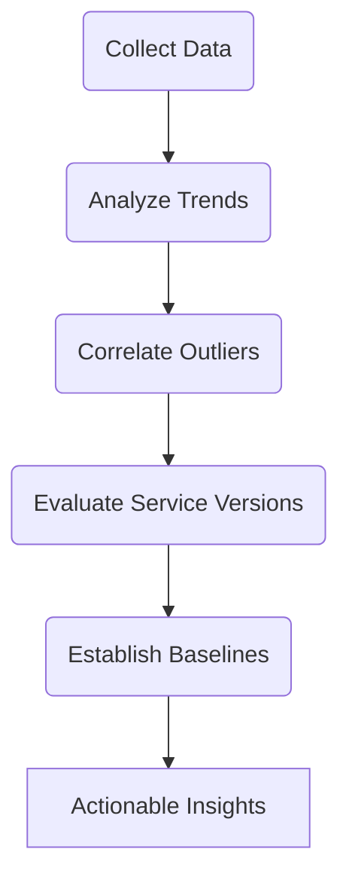
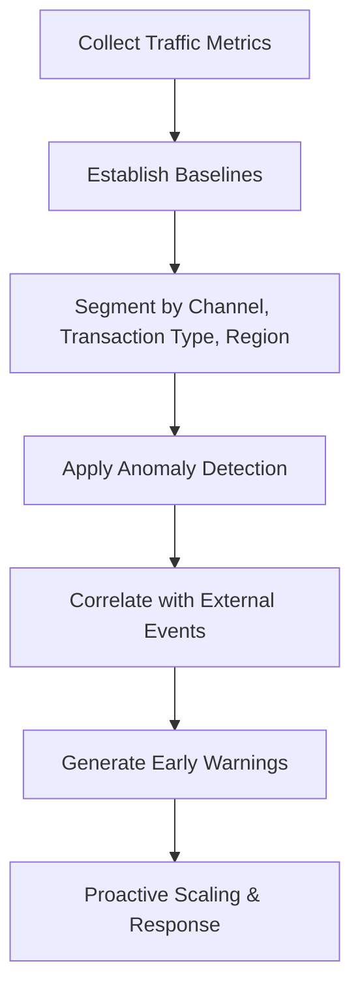
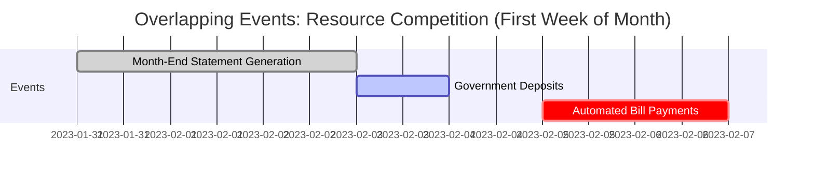
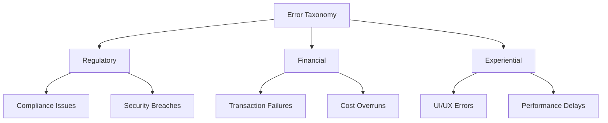
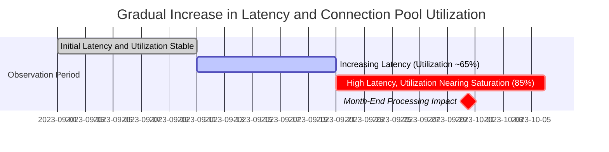
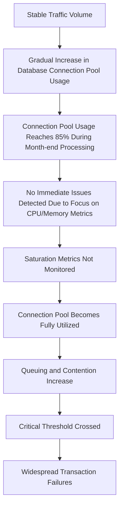
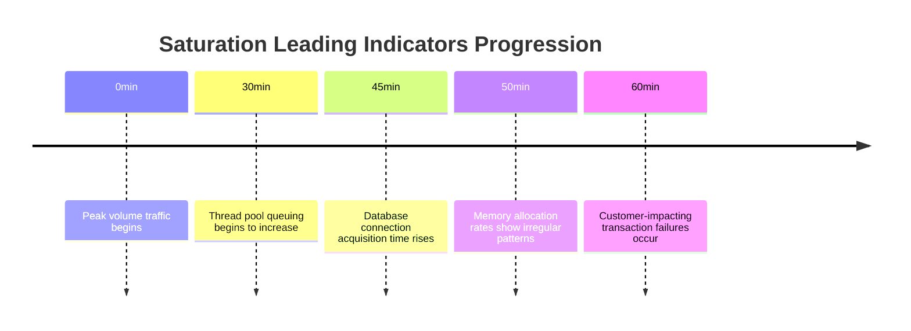

# Chapter 2: The Four Golden Signals

## Chapter Overview: The Four Golden Signals

This chapter delves into the core telemetry model used in Site Reliability Engineering (SRE): the Four Golden Signals—Latency, Traffic, Errors, and Saturation. With a heavy focus on financial systems, it showcases how each signal can betray a healthy-looking system while hiding catastrophic user failures. The narrative brings out subtle but impactful realities: averages that mislead, errors that aren’t technically errors, and success metrics that quietly fail the business. Through common industry examples, practical implementation tips, and SRE best practices, the chapter urges practitioners to discard vanity metrics and adopt granular, distributional, and business-impact-focused telemetry.

______________________________________________________________________

## Learning Objectives

By the end of this chapter, readers will be able to:

1. Explain the Four Golden Signals of SRE and how each reflects a critical system dimension.
2. Identify common pitfalls in interpreting averages and binary success indicators.
3. Use percentile-based latency and distribution metrics to detect outlier-driven failures.
4. Apply multi-dimensional traffic analysis for proactive scaling and anomaly detection.
5. Design error metrics that distinguish between technical success and business failure.
6. Monitor saturation using leading indicators to prevent silent degradation.
7. Implement dashboards and instrumentation strategies that enable predictive, not reactive, reliability.

______________________________________________________________________

## Key Takeaways

- **Averages Lie, Percentiles Tell the Truth**: If your latency looks good on average, congratulations—you’re helping no one. The pain lives in the tail.
- **HTTP 200 ≠ Success**: A transaction can be technically successful while completely failing the customer and the business. It’s called a *silent failure*, and it’s your new nemesis.
- **Traffic Isn’t Random**: It follows patterns, reacts to news, and laughs in the face of your "20% buffer." Forecast it like it matters—because it does.
- **Saturation is a Slow Death**: Systems don’t always crash; sometimes they crawl into a corner and stop returning your calls. Track saturation like it’s the emotional health of your infrastructure.
- **Business Metrics Trump Technical Vanity**: Who cares if your response time is 200ms if the customer never gets their money?
- **Four Signals, Infinite Blind Spots**: Until you treat them as connected, you’ll keep missing what matters.
- **Early Warnings Save Millions**: Waiting for red alerts is amateur hour. Build in the whispers before the scream.

______________________________________________________________________

## Panel 1: The Deceptive Average (Latency)

### Scene Description

The call center is overwhelmed with complaints about slow investment transactions, yet the performance dashboard displays "normal" average response times. A banking executive, confused by the contradiction between customer dissatisfaction and the reassuring metrics, questions the reliability of the dashboard.

**Text Diagram: Disconnect Between Metrics and Customer Experience**

```
Customer Complaints
   ↓
"Transactions are too slow!"
   ↓
Call Center Overwhelmed
   ↓
Performance Dashboard
   → Shows "Normal" Average Latency
   ↓
Banking Executive Confusion
   → "Why do metrics look fine if customers are unhappy?"
```

### Teaching Narrative

Latency metrics measure how long operations take to complete, but their effectiveness depends entirely on how they're calculated and presented. Average latency metrics conceal critical performance problems by masking outliers that significantly impact customer experience. In banking systems, percentile-based latency metrics (p50, p90, p99) provide essential visibility into the full spectrum of transaction performance, revealing the "long tail" problems that averages hide but customers experience directly.

### Common Example of the Problem

Imagine a popular restaurant that proudly advertises an average wait time of 15 minutes for a table. Most customers who visit during off-peak hours are seated within 5-10 minutes, but during peak dinner hours on weekends, some patrons end up waiting over an hour. The average wait time still calculates to a "perfectly acceptable" 15 minutes, but this number hides the frustrating experience of those stuck in long waits during busy periods.

Now apply this to an investment platform: the dashboard shows an average response time of 300ms, well within its 500ms SLO. Yet, the call center is overwhelmed with complaints about 10-second delays during market volatility. Investigation reveals that while 80% of transactions complete quickly, 20% of users—primarily those executing time-critical trades during market movements—experience 5-10 second delays. Just like the restaurant's average wait time, the average latency metric obscures these critical outliers, delaying the team's ability to respond while customers potentially lose thousands on delayed trades.

### SRE Best Practice: Evidence-Based Investigation

Implement comprehensive latency measurement across the full distribution to uncover hidden performance issues. Use the following checklist for an evidence-based approach:

#### Checklist: Latency Investigation Best Practices

- **Adopt Percentile-Based Metrics**
  - Replace averages with p50, p90, p99, and p99.9 latency measurements to expose the "long tail."
- **Segment and Contextualize**
  - Segment latency metrics by transaction type, customer tier, or geography.
  - Measure latency separately for successful vs. failed transactions to identify divergence.
- **Trend and Load Analysis**
  - Track latency trends over time to detect gradual degradation or improvements.
  - Analyze latency under various load conditions (low, normal, peak) to identify bottlenecks.
- **Correlation with System Components**
  - Correlate latency patterns with specific system components using distributed tracing tools.
  - Investigate database, network, and application layers for potential hotspots.
- **Simulate and Validate**
  - Test high-volume scenarios in staging environments to replicate real-world conditions.
  - Validate fixes by comparing pre- and post-change latency metrics.

#### Example: Distributed Tracing Insights

Using distributed tracing, you observe that during peak traffic, database connection pool saturation creates queuing delays for certain transaction types. This explains why some users experience extreme latency while others remain unaffected. Addressing this requires optimizing connection pool parameters and scaling database resources during high-volume periods.

### Banking Impact

For investment platforms, latency distribution directly impacts trading outcomes and customer satisfaction. During market volatility—precisely when performance matters most—some customers experience delays that prevent timely trade execution, potentially causing significant financial losses. These affected customers, often high-value clients, perceive the platform as unreliable even though "average" performance appears acceptable. The reputation damage drives clients to competitor platforms, creating lasting revenue impact that far exceeds the technical cost of addressing the underlying performance issues.

#### Comparison of Addressing vs. Not Addressing Latency Issues

| **Aspect** | **Addressing Latency Issues** | **Not Addressing Latency Issues** |
| ----------------------- | ---------------------------------------------------------------- | ------------------------------------------------------------- |
| **Customer Experience** | Improved transaction reliability and satisfaction | Frustration from delays, especially during high-stakes trades |
| **Financial Impact** | Retention of high-value clients; increased trading volume | Loss of high-value clients; reduced trading volume |
| **Reputation** | Perceived as a reliable and professional platform | Viewed as unreliable; negative word-of-mouth |
| **Revenue** | Long-term growth from loyal clients and new referrals | Declining revenues due to client churn |
| **Technical Costs** | Initial investment in system improvements; lower long-term costs | Repeated firefighting efforts; higher operational costs |

This table emphasizes the stark contrast between investing in latency improvements and ignoring the issue, underscoring how proactive action benefits both customer satisfaction and the organization's bottom line.

### Implementation Guidance

1. **Implement histogram-based latency tracking that captures the full distribution**\
   Use a metrics library such as Prometheus to configure histogram tracking for latency. Below is an example Prometheus configuration for tracking latency in milliseconds:

   ```yaml
   metrics:
     - name: http_request_duration_seconds
       help: "Histogram of HTTP request durations in seconds"
       type: histogram
       buckets: [0.005, 0.01, 0.025, 0.05, 0.1, 0.25, 0.5, 1, 2.5, 5, 10]
   ```

   This configuration ensures that latency is captured across a wide range of buckets, enabling detailed percentile calculations.

2. **Create dashboards showing all critical percentiles (p50, p90, p95, p99, p99.9)**\
   Use a visualization tool like Grafana to build dashboards displaying latency percentiles. Example PromQL query for p99 latency:

   ```promql
   histogram_quantile(0.99, sum(rate(http_request_duration_seconds_bucket[5m])) by (le))
   ```

   Repeat similar queries for other percentiles (e.g., p50, p90) to provide a comprehensive view of latency distribution.

3. **Establish separate latency SLOs for different percentiles and transaction types**\
   Define Service Level Objectives (SLOs) tailored to customer expectations. For example:

   - p50 latency < 100ms for standard transactions.
   - p99 latency < 500ms for high-value transactions.
     Document and monitor these SLOs to ensure alignment with business priorities.

4. **Deploy distributed tracing to identify component contributions to tail latency**\
   Implement a distributed tracing tool like OpenTelemetry or Jaeger. Example setup with OpenTelemetry in a Python application:

   ```python
   from opentelemetry import trace
   from opentelemetry.exporter.otlp.proto.grpc.trace_exporter import OTLPSpanExporter
   from opentelemetry.sdk.trace import TracerProvider
   from opentelemetry.sdk.trace.export import BatchSpanProcessor

   trace.set_tracer_provider(TracerProvider())
   tracer = trace.get_tracer(__name__)

   span_exporter = OTLPSpanExporter(endpoint="http://otel-collector:4317")
   span_processor = BatchSpanProcessor(span_exporter)
   trace.get_tracer_provider().add_span_processor(span_processor)
   ```

   This enables end-to-end visibility into transaction flows and highlights bottlenecks contributing to tail latency.

5. **Build latency anomaly detection that identifies changes in distribution shape, not just averages**\
   Leverage machine learning or statistical tools to detect anomalies in latency distribution. For example, use Z-score analysis to identify significant deviations in p99 latency over time:

   ```python
   import numpy as np

   def detect_anomalies(latency_data):
       mean = np.mean(latency_data)
       std_dev = np.std(latency_data)
       anomalies = [latency for latency in latency_data if abs(latency - mean) > 3 * std_dev]
       return anomalies
   ```

   This approach provides early warnings for shifts in tail latency that may impact customer experience.

## Panel 2: The Truth in Distribution (Latency)

### Scene Description

A performance engineer stands before the team, presenting a histogram of transaction times to illustrate the long tail problem in payment processing during periods of market volatility. The histogram, annotated with key metrics, shows a stark contrast between the p50 (median) and p99 (99th percentile) latency values, emphasizing the wide variability in transaction times. Annotations highlight customer impact at different points in the distribution, such as:

- **p50 (Median):** Most customers experience this typical transaction latency.
- **p90 (90th Percentile):** High-priority business clients begin to notice delays.
- **p99 (99th Percentile):** Rare but critical cases where severe delays disrupt user experience.

Below is a conceptual text-based representation of the histogram:

```
Latency (ms)
|    |    |    |    |    |    |    |    |    |    |
0    50   100  150  200  250  300  350  400  450  500+
|----|----|----|----|----|----|----|----|----|----|
█████████████
     ████████
          ████
           ██
            █
<-- p50 -------------------------- p90 -------- p99 -->
```

This visual aids the team in understanding how latency distribution impacts different customer segments, enabling targeted discussions on optimizing the most critical areas of performance.

### Teaching Narrative

Latency distribution metrics reveal the complete performance profile of financial transactions, providing visibility that simple averages cannot. For banking operations, understanding the entire latency distribution through percentile measurements enables precise identification of performance issues affecting specific customer segments or transaction types. These comprehensive latency metrics reveal whether slowdowns affect all users equally or disproportionately impact certain operations, enabling targeted optimization where it matters most.

### Common Example of the Problem

A payment gateway processes credit card authorizations with a reported average response time of 250ms. However, analyzing the full latency distribution reveals a concerning discrepancy:

| Percentile | Response Time | Key Correlation |
| ---------- | ------------- | ---------------------------------------------------- |
| p50 | 180ms | Standard domestic transactions |
| p90 | 800ms | Transactions using international cards |
| p99 | 3.2 seconds | Specific merchant categories and international cards |

This table highlights the significant long-tail issue: while the median (p50) shows most transactions are fast, a small but critical subset experiences severe delays. Further investigation uncovered that these delays were tied to bottlenecks within the authentication service, disproportionately affecting transactions with specific attributes (e.g., international cards or certain merchant categories).

The operations team, focusing solely on the database layer that impacts all transactions equally, missed this localized issue. Addressing these specific bottlenecks would significantly improve the experience for the affected customers without overhauling the entire system.

### SRE Best Practice: Evidence-Based Investigation

Follow this checklist to ensure a thorough, evidence-based investigation of latency distribution issues:

1. **Collect Comprehensive Data**:

   - Track full latency histograms with appropriate bucket distributions for all critical transaction types.
   - Ensure data granularity is sufficient to capture meaningful outliers.

2. **Analyze Trends**:

   - Measure percentile shifts over time (e.g., p50, p95, p99) to identify consistent or emerging degrading components.
   - Compare latency distributions under different business conditions (e.g., peak vs. off-peak hours).

3. **Correlate and Isolate Issues**:

   - Correlate latency outliers with specific transaction attributes (e.g., transaction type, geography, account type).
   - Identify whether slowdowns are systemic or localized to particular operations or customer segments.

4. **Evaluate Service Versions**:

   - Compare latency distributions across different service versions to detect regressions or improvements.
   - Cross-reference version changes with deployment timelines and performance anomalies.

5. **Establish Baselines**:

   - Define baseline distribution patterns for normal operation under various scenarios.
   - Use baselines to quickly detect deviations during incidents or market volatility.

### Flow Diagram: Evidence-Based Investigation Process



### Example Insight

Analysis reveals that third-party authentication service calls for international transactions have significantly higher and more variable latency. This contributes to the long tail effect that negatively impacts customer experience, even when average latency metrics appear healthy. Targeting this specific service for optimizations can significantly reduce outliers and improve overall reliability.

### Banking Impact

In payment processing, latency distribution directly affects authorization approval rates and merchant satisfaction. Long-tail latency causes transaction timeouts that register as technical declines, creating false payment failures that frustrate both cardholders and merchants. These timeout-induced declines disproportionately affect high-value international transactions, creating a negative experience for premium customers and potentially triggering fraud alerts as customers retry failed payments. The business impact includes lost transaction revenue, increased support costs, and merchant relationship damage.

For example, during a period of market volatility, a global payment processor observed a sharp increase in transaction latency for cross-border payments. Transactions that typically fell within the p90 latency range began to shift into the long tail, exceeding timeout thresholds. This led to a 15% spike in false declines for international customers, primarily affecting high-net-worth individuals making large-value purchases. As a result, merchants faced increased chargeback disputes, and the processor incurred reputational damage from both cardholders and merchants. By analyzing latency distribution metrics and isolating the root cause—a bottleneck in currency conversion services—the processor implemented targeted optimizations, reducing p99 latency by 40% and restoring transaction reliability for premium customers. This case highlights the critical role of latency analysis in minimizing customer impact and protecting business relationships.

### Implementation Guidance

#### Step-by-Step Process for Latency Distribution Analysis and Optimization

1. **Establish Comprehensive Latency Histograms**

   - Instrument your payment processing systems to log transaction times with high precision.
   - Aggregate this data into latency histograms for each critical payment flow.
   - Example code snippet for histogram creation using Python and Prometheus:
     ```python
     from prometheus_client import Histogram

     LATENCY_HISTOGRAM = Histogram(
         'payment_latency_seconds',
         'Transaction latency histogram',
         ['payment_flow']
     )

     def record_latency(flow_name, latency_seconds):
         LATENCY_HISTOGRAM.labels(payment_flow=flow_name).observe(latency_seconds)
     ```

2. **Visualize Latency Trends Over Time**

   - Generate heat maps to track changes in latency distributions across time windows.
   - Use data visualization tools like Grafana to overlay p50, p95, and p99 latency percentiles.
   - Example: A heat map grid displaying time on the x-axis, latency ranges on the y-axis, and intensity for transaction volume.

   ```mermaid
   gantt
       title Heat Map Example
       dateFormat YYYY-MM-DD HH:mm
       axisFormat %H:%M
       section p99 Latency
       1-2s Intensity :done, 2023-10-25 09:00, 1h
       2-3s Intensity :active, 2023-10-25 10:00, 1h
   ```

3. **Segment and Analyze Affected Transactions**

   - Perform segmented analysis by transaction attributes such as payment method, geography, or time of day.
   - Example SQL query for identifying high-latency segments:
     ```sql
     SELECT
         payment_method,
         AVG(latency) AS avg_latency,
         PERCENTILE_CONT(0.99) WITHIN GROUP (ORDER BY latency) AS p99_latency
     FROM
         transaction_logs
     WHERE
         timestamp BETWEEN '2023-10-01' AND '2023-10-31'
     GROUP BY
         payment_method
     ORDER BY
         p99_latency DESC;
     ```

4. **Implement Adaptive Timeout Mechanisms**

   - Use historical latency distributions to dynamically adjust timeout thresholds.
   - Example algorithm:
     - Calculate the p99 latency for each payment flow.
     - Set timeouts slightly above the p99 value to avoid premature transaction failures while maintaining responsiveness.
     - Adjust thresholds periodically based on updated latency data.

5. **Develop Targeted Optimization Roadmaps**

   - Prioritize transaction types with the highest tail latencies for optimization.
   - Break down optimization plans into actionable tasks, such as:
     - Database query tuning
     - Network routing improvements
     - Application code profiling and refactoring
   - Continuously re-evaluate latency distributions to measure the impact of optimizations.

By following this structured approach, teams can systematically address latency distribution issues, ensuring that performance improvements are data-driven and impactful.

## Panel 3: The Unexpected Holiday (Traffic)

### Scene Description

The on-call engineer notices a puzzling traffic spike in the metrics dashboard on a non-payday Friday. They begin investigating by examining transaction volume graphs, which reveal a sudden increase in activity. Further analysis shows a correlation between the traffic spike and a government stimulus announcement. Meanwhile, an executive highlights relevant news headlines that were missed by the team, providing context for the unexpected traffic surge.

#### Timeline of Events (Text Diagram)

```
[Start of Day] 
     ↓
[Traffic Spike Detected] → [On-call Engineer Investigates]
     ↓                            ↓
[Transaction Volume Correlated] → [Stimulus News Discovered]
     ↓                            ↓
[Executive Points to Headlines]  → [Understanding Achieved]
```

### Teaching Narrative

Traffic metrics quantify demand on banking systems, typically measured as transactions per second over time. These measurements serve multiple critical functions: capacity planning, anomaly detection, and business intelligence. Effective traffic metrics must account for multiple time dimensions, capture expected patterns, identify seasonality, and correlate with external events. For financial systems, understanding traffic patterns enables proactive scaling and resource allocation to maintain performance during both predicted and unexpected volume changes.

### Common Example of the Problem

A bank's payment processing system experiences a sudden 300% transaction volume spike on a regular Friday, causing degraded performance and increased error rates. The operations team, accustomed to traffic peaks on paydays, month-end, and holidays, is caught completely unprepared. Only after customer complaints escalate does someone notice news headlines about government stimulus payments being deposited that day. The team lacks metrics connecting external events to traffic patterns, forcing them into reactive scaling once problems have already impacted customers.

#### Missed Steps Checklist

To avoid similar situations, consider the following proactive measures:

1. **Monitor External Events**

   - Track government announcements, regulatory changes, and public holidays that might influence transaction volumes.
   - Use a feed or alert system for real-time updates on relevant news.

2. **Enhance Anomaly Detection**

   - Implement alerts for traffic patterns deviating significantly from historical norms.
   - Incorporate machine learning models to predict unusual spikes correlated with external factors.

3. **Correlate Metrics with External Data**

   - Integrate external data sources (e.g., economic reports, stimulus schedules) into traffic analysis tools.
   - Overlay external event timelines onto transaction volume graphs for contextual insights.

4. **Plan for Unexpected Scaling**

   - Design systems to support rapid scaling in response to unforeseen traffic surges.
   - Conduct regular capacity testing, including scenarios based on atypical events.

5. **Regularly Review Historical Data**

   - Analyze past traffic anomalies to identify patterns or triggers that were previously overlooked.
   - Use these insights to update capacity forecasts and alert thresholds.

#### Summary Table

| Problem Area | Potential Solution |
| ---------------------------- | -------------------------------------------------------------------------------- |
| Missed external event | Monitor news and announcements tied to financial operations. |
| Late anomaly detection | Use predictive analytics and automated alerts for traffic deviations. |
| Lack of external correlation | Combine transaction metrics with external event data for comprehensive analysis. |
| Reactive scaling | Build systems with elasticity and test for unexpected high-traffic scenarios. |
| Historical blind spots | Leverage historical event analysis to refine detection and response strategies. |

### SRE Best Practice: Evidence-Based Investigation

Implement multi-dimensional traffic analysis that anticipates both regular and exceptional patterns:

1. Establish baseline traffic patterns across multiple time dimensions (hourly, daily, weekly, monthly)
2. Create anomaly detection that identifies deviations from expected patterns
3. Develop forecasting models incorporating business calendars and external events
4. Segment traffic metrics by channel, transaction type, and geographic region
5. Implement leading indicators that predict traffic changes before they reach critical systems

#### Example Code Snippet: Anomaly Detection with Python

```python
import pandas as pd
from statsmodels.tsa.seasonal import seasonal_decompose

# Load traffic data
data = pd.read_csv('traffic_data.csv', parse_dates=['timestamp'], index_col='timestamp')
traffic_series = data['transactions_per_second']

# Decompose the time series to identify seasonality and trends
result = seasonal_decompose(traffic_series, model='additive', period=1440)  # 1440 for daily pattern
result.plot()

# Identify anomalies using a threshold based on standard deviation
threshold = 3  # Customize based on sensitivity
anomalies = traffic_series[(traffic_series - result.trend).abs() > threshold * traffic_series.std()]
print("Anomalies detected at:")
print(anomalies)
```

#### Workflow Diagram: Traffic Analysis Process



Analysis of historical patterns reveals that government announcements typically precede payment volume spikes by 1-2 days, providing an early warning indicator that could have prevented the incident.

### Banking Impact

Unpredictable traffic patterns create cascading failures across banking services. The impacts can be broken down into the following categories:

| Impact Area | Description | Consequences |
| ------------------------- | ---------------------------------------------------------------------------------- | ------------------------------------------------------------------------------------------- |
| **Payment Processing** | Slowdowns in payment systems due to transaction overload. | Delayed merchant transactions, customer dissatisfaction, and potential financial penalties. |
| **ATM Withdrawals** | Increased withdrawal attempts when electronic payments fail. | Cash shortages at ATMs, increased refilling costs, and logistical challenges. |
| **Call Centers** | Surge in customer inquiries as users face payment issues or system unavailability. | Overloaded support systems, longer wait times, and higher emergency staffing expenses. |
| **Financial Settlements** | Delays in clearing and settling high volumes of transactions. | Risk of regulatory scrutiny and compliance violations, impacting long-term trust. |
| **Reputation** | Customer frustration and public backlash during high-visibility disruptions. | Erosion of brand reputation, loss of customer loyalty, and negative media coverage. |

The financial impact extends to lost transaction revenue, emergency staffing costs, and potential penalties. Beyond the technical failures, customer frustration during these events can result in lasting reputational damage, which may significantly impact the organization’s competitive standing.

### Implementation Guidance

1. **Create multi-dimensional traffic dashboards showing patterns across time periods**\
   Design dashboards that visualize traffic metrics across different time dimensions (e.g., minutes, hours, days) and groupings (e.g., transaction types, user regions). For example, a dashboard could include metrics such as transactions per second, error rates, and latency. Below is a simple text-based representation of a dashboard layout:

   ```
   +-------------------------+---------------------+
   | Metric                 | Current Value       |
   +-------------------------+---------------------+
   | Transactions per Second | 1,200              |
   | Error Rate (%)          | 0.2                |
   | Avg Latency (ms)        | 150                |
   +-------------------------+---------------------+

   +-------------------+-------------------------+
   | Time Period       | Traffic Volume Trend    |
   +-------------------+-------------------------+
   | Last Hour         | ██████████▒▒▒▒▒         |
   | Last Day          | ████████████████▒▒▒▒▒▒  |
   | Last Week         | ████▒▒▒▒▒▒▒▒▒▒▒▒▒▒▒▒▒▒  |
   +-------------------+-------------------------+
   ```

2. **Implement anomaly detection based on deviation from expected patterns**\
   Use statistical models or machine learning algorithms to detect anomalies. For example, a Python snippet for anomaly detection using a z-score method might look like this:

   ```python
   import numpy as np

   def detect_anomalies(data, threshold=3):
       mean = np.mean(data)
       std_dev = np.std(data)
       anomalies = [x for x in data if abs((x - mean) / std_dev) > threshold]
       return anomalies

   traffic_data = [100, 120, 110, 3000, 115, 130, 125]  # Example data
   anomalies = detect_anomalies(traffic_data)
   print("Anomalies detected:", anomalies)
   ```

3. **Develop news and social media monitoring for leading traffic indicators**\
   Create automated tools to scrape or subscribe to news feeds, government announcements, and social platforms for relevant keywords or trends. This can help identify events (e.g., stimulus announcements) that may lead to traffic spikes.

4. **Build automated scaling mechanisms triggered by traffic prediction algorithms**\
   Integrate predictive analytics with infrastructure orchestration tools. For example, using a linear regression model to predict traffic and trigger scaling:

   ```python
   from sklearn.linear_model import LinearRegression
   import numpy as np

   # Example training data (time in hours vs transactions per second)
   X = np.array([1, 2, 3, 4, 5]).reshape(-1, 1)
   y = np.array([200, 400, 600, 800, 1000])
   model = LinearRegression().fit(X, y)

   # Predict traffic for the next hour
   next_hour = np.array([[6]])
   predicted_traffic = model.predict(next_hour)
   print("Predicted traffic for next hour:", predicted_traffic[0])

   # Logic to trigger scaling (pseudo-code):
   # if predicted_traffic > scaling_threshold:
   #     trigger_scaling_action()
   ```

5. **Establish traffic pattern libraries documenting responses to previous events**\
   Maintain a library of historical traffic patterns and corresponding system responses. For example, include a timeline of major events, detected anomalies, and scaling actions taken. This could be organized as a table:

   ```
   +-----------------------+---------------------+------------------+
   | Event                | Traffic Anomaly     | Response         |
   +-----------------------+---------------------+------------------+
   | Stimulus Announcement | 3x traffic spike   | Auto-scaled 5x   |
   | Black Friday          | Sustained high load| Pre-scaled 3x    |
   | System Maintenance    | Traffic drop       | No action needed |
   +-----------------------+---------------------+------------------+
   ```

## Panel 4: Predicting the Wave (Traffic)

### Scene Description

Capacity planning meeting with the team reviewing a traffic forecasting model that integrates multiple inputs: banking calendar, historical patterns, and external events. The discussion focuses on how these dimensions feed into a predictive algorithm to identify upcoming volume spikes.

Below is a simplified representation of the predictive algorithm and its data inputs:

```
   +----------------------+      +---------------------+
   |  Banking Calendar    |      | Historical Patterns |
   +----------------------+      +---------------------+
               \                     /
                \                   /
                 +-----------------+
                 | Predictive Model|
                 +-----------------+
                        |
          +----------------------------------+
          | Identifies Volume Spikes (Output)|
          +----------------------------------+
```

This visual highlights how the model synthesizes data from various sources to forecast traffic surges, enabling proactive capacity planning.

### Teaching Narrative

Advanced traffic metrics enable predictive capacity management through sophisticated forecasting models incorporating multiple data dimensions. These metrics extend beyond simple volume counts to include patterns across time dimensions (hourly, daily, weekly, monthly, seasonal), customer segments, transaction types, and correlation with external events. For banking systems, these predictive traffic metrics transform capacity management from reactive response to proactive preparation, ensuring sufficient resources for both expected peaks and unusual events.

### Common Example of the Problem

A bank's digital platform handles monthly bill payments with a capacity plan based on historical averages plus a 20% buffer. Despite this conservative approach, the system consistently experiences performance degradation during the first week of each month. Traditional traffic metrics show the pattern but don't explain it. Advanced analysis reveals a complex interaction: government benefit deposits on the 3rd, automated bill payments on the 5th, and month-end statement generation all compete for resources. Without understanding these overlapping traffic patterns, the team repeatedly under-provisions despite using seemingly adequate buffer calculations.

#### Timeline of Overlapping Events



This timeline illustrates how critical events overlap during the first week of the month, creating a surge in traffic that overwhelms the system. By visualizing these patterns, the team can better understand resource contention and implement targeted capacity adjustments to mitigate performance degradation.

### SRE Best Practice: Evidence-Based Investigation

Implement comprehensive traffic forecasting that accounts for all relevant factors by following these steps:

#### Checklist for Evidence-Based Investigation

1. **Define Objectives**: Clearly define the goals of traffic forecasting (e.g., peak handling, anomaly detection, long-term capacity planning).
2. **Collect Relevant Data**:
   - Gather historical traffic data across relevant time dimensions (hourly, daily, weekly, seasonal).
   - Include business calendars, external events, and customer behavior metrics.
3. **Develop Multi-Variate Models**:
   - Incorporate business events, banking calendars, and transaction trends.
   - Leverage machine learning to analyze complex data relationships.
4. **Implement Pattern Recognition Systems**:
   - Identify cyclical traffic behaviors (e.g., weekly or seasonal spikes).
   - Build systems to detect anomalies and outliers.
5. **Conduct Correlation Analysis**:
   - Analyze traffic changes relative to external factors such as social media activity, weather, or financial calendar events.
   - Validate findings with historical data.
6. **Build Composite Forecasts**:
   - Combine multiple predictive algorithms to improve accuracy.
   - Use ensemble models or weighted averages to integrate forecasts.
7. **Refine Models Continuously**:
   - Monitor model performance regularly.
   - Update models based on prediction accuracy and newly available data.

#### Key Considerations

- Machine learning algorithms can uncover subtle traffic correlations, such as links to external events like weather or social media trends.
- Continuous iteration and validation of these models enable proactive capacity management, ensuring systems are prepared for both predictable and unexpected traffic fluctuations.

By following this structured approach, SRE teams can transform capacity planning into a data-driven, evidence-based discipline.

### Banking Impact

Accurate traffic prediction directly impacts both customer experience and infrastructure costs. Under-provisioning during peak periods creates transaction delays, increased error rates, and potential regulatory issues if processing deadlines are missed. Over-provisioning wastes infrastructure resources and increases operating costs. Predictive traffic metrics enable optimal resource allocation, ensuring sufficient capacity for customer needs while minimizing unnecessary expenses – particularly valuable for cloud-based banking systems with consumption-based pricing.

### Implementation Guidance

| Implementation Step | Expected Outcome or Benefit |
| ----------------------------------------------------------------------------------------- | -------------------------------------------------------------------------------------------------------------------- |
| 1. Create consolidated business calendar incorporating all traffic-influencing events | Ensures all relevant factors (e.g., banking holidays, promotional events) are accounted for in traffic forecasting. |
| 2. Implement machine learning models trained on historical traffic patterns | Provides accurate traffic predictions by leveraging past data to identify trends and anomalies. |
| 3. Develop external event monitoring for traffic prediction inputs | Enhances prediction reliability by incorporating real-time external factors such as weather, news, or market events. |
| 4. Build automated capacity adjustment mechanisms tied to prediction models | Enables proactive resource allocation to handle expected traffic spikes and prevent system strain. |
| 5. Establish regular forecast accuracy reviews to continuously improve prediction quality | Improves the effectiveness of forecasting models over time through iterative refinement and error analysis. |

## Panel 5: The Silent Failure (Errors)

### Scene Description

An SRE is investigating missing fund transfers in a banking system. Logs show HTTP 200 responses, indicating technical success, but database commits are failing silently. The result is that money appears to leave the sender's account but does not arrive at the recipient's account.

#### Flow of Events

```text
1. API receives transfer request.
2. API processes request and responds with HTTP 200.
3. Database operation to commit transaction is triggered.
4. Database commit silently fails.
5. Logs show HTTP 200 but no recorded database transaction.
6. Funds deducted from sender's account without reaching the recipient.
```

### Teaching Narrative

Error metrics measure failure rates, but their accuracy depends entirely on how "failure" is defined. In banking systems, technical success (HTTP 200, operation completed) may not represent business success (funds transferred correctly, transaction finalized). Comprehensive error metrics must bridge this gap, measuring not just technical failures but also business outcome failures. This distinction is critical in financial services where technically "successful" operations may still fail to achieve the customer's intended result.

### Common Example of the Problem

A fund transfer system consistently reports a 99.98% success rate based on API response codes, yet customer complaints about missing transfers are increasing. Investigation reveals a serious gap in error metrics: while the API returns HTTP 200 success responses, a significant number of transactions fail during asynchronous database commit operations that occur after the response is sent. These "silent failures" never appear in error metrics because they're not captured at the API level. Customers see money leave their accounts but never arrive at the destination, creating significant financial and customer service impacts that remain invisible to standard monitoring.

#### Checklist: Identifying Silent Failures

Use the checklist below to recognize and address potential silent failure scenarios:

- **Mismatch Between API and Backend State**: Look for cases where API calls return HTTP 200 but backend operations (e.g., database commits) are incomplete or fail.
- **Customer Complaints vs. Reported Metrics**: Monitor discrepancies between high technical success rates and customer-reported issues or complaints.
- **Asynchronous Processing Risks**: Identify workflows where critical operations (e.g., database writes, message queue processing) occur asynchronously after the API response.
- **Lack of End-to-End Transaction Tracking**: Ensure there is visibility into the full lifecycle of transactions, from initiation to finalization, including all dependencies.
- **Unmonitored Business Outcomes**: Evaluate whether your metrics capture business-level outcomes, such as funds successfully credited to destination accounts.
- **Error Metrics Scope**: Confirm that your error metrics extend beyond API response codes to include downstream operations and business rules.
- **Database and Queue Monitoring**: Implement monitoring for database write failures, transaction rollbacks, and message processing delays or errors.
- **Reconciliation Processes**: Regularly reconcile system-generated reports (e.g., transaction logs, ledger balances) with actual business outcomes to identify discrepancies.

By using this checklist, teams can proactively detect and mitigate silent failures that might otherwise go unnoticed, ensuring both technical and business-level success.

### SRE Best Practice: Evidence-Based Investigation

Implement end-to-end transaction verification metrics that capture actual business outcomes. Below is a table mapping best practices to their expected outcomes or benefits:

| Best Practice | Expected Outcome / Benefit |
| ------------------------------------------------------------------------------- | ---------------------------------------------------------------------------------------------- |
| Create transaction completion metrics that verify all processing stages | Ensure visibility into the full lifecycle of transactions, identifying incomplete operations. |
| Implement reconciliation metrics comparing initiated vs. completed operations | Detect discrepancies between initiated and completed transactions to uncover hidden failures. |
| Develop business-state validation checks that verify expected account changes | Confirm that account balances and states reflect the intended business outcomes. |
| Track customer-reported errors and correlate with system metrics | Bridge the gap between technical metrics and real-world customer impact for faster resolution. |
| Establish baseline rates for different failure categories to identify anomalies | Enable proactive detection of unusual error patterns, reducing time to mitigation. |

Comprehensive error analysis reveals that approximately 0.4% of transactions fail after reporting success—a critical error pattern completely missed by traditional API-level metrics. Employing these practices helps uncover and address such silent failures, ensuring both technical and business success.

### Banking Impact

In fund transfer systems, silent failures create serious financial and regulatory consequences. Imagine sending a package through a courier service: you receive a notification that the package was "successfully sent," but it never arrives at the recipient's address. From the courier's perspective, everything appears fine because the package left their facility, but for the sender and recipient, the outcome is a failure. Similarly, in banking, a silent failure occurs when funds appear to leave one account successfully (technical success) but fail to arrive at the destination (business failure).

For customers, this can mean missing funds that may take days to reconcile, creating immediate financial hardship and eroding trust in the bank. Reconciliation processes often require manual intervention, increasing operational costs and delaying resolution. On top of that, regulatory requirements for transaction traceability and timely resolution may be violated, exposing the bank to significant compliance risks. The reputational damage from these high-impact failures typically far exceeds the technical cost of implementing proper end-to-end error metrics. Just as a courier service must track packages from pickup to delivery, banking systems must ensure that transactions are monitored and verified from initiation to finalization.

### Implementation Guidance

1. **Implement End-to-End Transaction Tracking with Unique Identifiers**\
   Assign a globally unique identifier (GUID) to each transaction at the start of the process. Pass this identifier through all system components (APIs, queues, databases) to enable comprehensive tracking. Below is a pseudocode example for propagating and logging a transaction ID:

   ```python
   import uuid
   import logging

   # Generate a unique transaction ID
   transaction_id = str(uuid.uuid4())
   logging.info(f"Transaction initiated: {transaction_id}")

   # Propagate the transaction ID through system components
   def process_transaction(transaction_id, source_account, destination_account, amount):
       try:
           logging.info(f"Processing transaction {transaction_id}: {source_account} -> {destination_account}, Amount: {amount}")

           # Step 1: Debit source account
           if not debit_account(source_account, amount):
               raise Exception(f"Debit failed for transaction {transaction_id}")

           # Step 2: Credit destination account
           if not credit_account(destination_account, amount):
               raise Exception(f"Credit failed for transaction {transaction_id}")

           # Step 3: Mark transaction as successful
           logging.info(f"Transaction {transaction_id} completed successfully")
           return True
       except Exception as e:
           logging.error(f"Transaction {transaction_id} failed: {e}")
           # Handle rollback or compensation logic here
           return False

   # Example usage
   process_transaction(transaction_id, "AccountA", "AccountB", 100.00)
   ```

2. **Create Automated Reconciliation Processes That Verify Completed Transactions**\
   Develop a scheduled reconciliation job that compares transaction logs, database entries, and downstream system states. For example:

   - Check if all debited funds are matched with corresponding credits.
   - Identify discrepancies by querying for missing or incomplete transactions.

3. **Develop Composite Error Metrics That Incorporate All Failure Points**\
   Define error metrics that go beyond HTTP responses. Include metrics for:

   - Failed database commits
   - Queue processing errors
   - Reconciliation mismatches\
     For instance, aggregate these metrics into a "Transaction Integrity Score" to quantify the overall success rate of business processes.

4. **Build Dashboards Highlighting Business-Level Success Rates, Not Just API Metrics**\
   Create dashboards that display metrics like:

   - Percentage of transactions fully reconciled
   - Average time to reconcile discrepancies
   - Customer impact metrics (e.g., percentage of delayed transfers)\
     Use visualizations to differentiate between technical and business-level metrics.

5. **Establish Alerting on Reconciliation Discrepancies, Not Just Technical Errors**\
   Configure alerts that trigger when:

   - The reconciliation job detects unmatched debits or credits
   - Transaction integrity metrics fall below a defined threshold\
     Example: Use a monitoring system (e.g., Prometheus, Datadog) to raise alerts when the reconciliation failure rate exceeds 0.5%.

## Panel 6: When "Success" Isn't Success (Errors)

### Scene Description

The team is gathered around a dashboard displaying error metrics categorized by business impact rather than traditional technical status codes, with customer impact prominently highlighted. The dashboard includes a clear error taxonomy that organizes failures into three primary classifications: regulatory, financial, and experiential.

Below is a conceptual representation of the error taxonomy to aid understanding:



This taxonomy helps the team evaluate errors not just by their technical attributes but by their direct impact on customers and the business. The visual representation fosters a shared understanding of failure patterns and their broader implications.

### Teaching Narrative

Sophisticated error metrics in banking systems must extend beyond binary success/failure measures to capture the full spectrum of failure modes and their business implications. These enhanced metrics include error taxonomies that classify failures by type (validation, processing, dependency), severity (critical, major, minor), customer impact (financial, experiential, regulatory), and recovery potential (self-healing, requiring intervention, permanent). This multi-dimensional error measurement approach enables precise understanding of failure patterns and their business consequences.

### Common Example of the Problem

A credit card processor monitors error rates based on standard HTTP status codes, with anything in the 2xx range considered successful. However, this approach often misses critical failures that impact customers. For example:

| Technical Metric (HTTP Code) | Business-Level Failure | Customer Impact |
| ---------------------------- | ----------------------------------------------------------------- | --------------------------------------------------------- |
| 200 (OK) | Successfully-received transaction rejected for insufficient funds | Frustration due to inability to complete a valid purchase |
| 200 (OK) | Transaction succeeds but creates duplicate charges | Financial stress from being overcharged |
| 200 (OK) | Address verification failure blocking legitimate purchases | Loss of trust and abandonment of the service |

These business-level failures represent the majority of customer-impacting issues but remain invisible in technical error metrics. This creates a dangerous blind spot where the root causes of the most common customer complaints are not reflected in operational dashboards, undermining the organization's ability to respond proactively.

### SRE Best Practice: Evidence-Based Investigation

Implement comprehensive error classification that connects technical failures to business impact. Use the following checklist to guide evidence-based investigation and ensure actionable insights:

#### Checklist for Evidence-Based Investigation:

- **Define Error Taxonomy**:

  - Create a unified error taxonomy encompassing both technical and business failure types (e.g., validation, processing, dependency).
  - Include classifications for severity (critical, major, minor), customer impact (financial, experiential, regulatory), and recovery potential (self-healing, requiring intervention, permanent).

- **Develop Weighted Metrics**:

  - Assign weights to errors based on their estimated customer and business impact.
  - Ensure metrics represent the true significance of errors beyond technical severity.

- **Perform Correlation Analysis**:

  - Analyze relationships between technical failures and business outcomes.
  - Identify patterns where technical issues cascade into customer-facing failures.

- **Track Contextual Patterns**:

  - Monitor error trends by transaction type, customer segment, and channel.
  - Segment data to uncover hidden issues affecting specific customer groups or business functions.

- **Establish Baselines and Detect Anomalies**:

  - Measure baseline error rates for each category.
  - Utilize anomaly detection methods to flag deviations and prioritize investigation.

#### Key Insight:

Error analysis reveals that business-level failures occur at 5x the rate of technical failures and have significantly higher customer impact. Proper classification and measurement often invert prioritization, ensuring attention is focused on the most impactful issues.

### Banking Impact

For financial transactions, error classification directly affects both customer experience and regulatory compliance. Technical success metrics that ignore business failures create a false sense of system health while customers experience significant problems. These untracked errors often trigger regulatory reporting requirements and compliance obligations that may be missed if not properly categorized.

Consider the case of a payment processing system at a major bank. The system reported a high technical success rate for transactions, but a failure to detect and categorize business-level errors led to significant customer dissatisfaction. For instance, a recurring issue with currency conversion during international transfers resulted in incorrect amounts being deposited into customer accounts. Although the transactions were technically "successful," customers faced financial discrepancies that required manual intervention to resolve. The delays in addressing these errors escalated to regulatory scrutiny, as the bank failed to report the issue within mandated timelines, resulting in penalties.

This example underscores the critical need for comprehensive error metrics that prioritize actual customer and business impact over technical status alone. By incorporating error taxonomies that capture real-world failure modes, organizations can proactively address issues, meet compliance requirements, and safeguard customer trust.

### Implementation Guidance

1. Develop unified error taxonomy aligned with business priorities
2. Create error dashboards organized by customer impact, not technical categories
3. Implement correlation tracking between error types and customer complaints
4. Build automated categorization of errors based on transaction characteristics
5. Establish regular reviews of error patterns to identify emerging failure modes

## Panel 7: The Creeping Slowdown (Saturation)

### Scene Description

The team is investigating a gradual increase in latency observed over several weeks. Metrics reveal that database connection pool utilization has steadily climbed from 45% to 85%, particularly during month-end processing.

To better understand the progression, here’s a timeline representation of the key events and metrics:



This timeline highlights how resource saturation developed over time, providing a structured way to analyze the creeping slowdown and its alignment with month-end processing activities.

### Teaching Narrative

Saturation metrics measure how "full" systems are relative to their capacity limits. Unlike utilization metrics that show average resource usage, saturation metrics identify queuing and contention before they cause customer-visible failures. These leading indicator measurements track all constrained resources—connection pools, thread pools, network capacity, database sessions—providing early warning as systems approach their limits. For banking operations, saturation metrics enable proactive intervention before resource constraints affect customer transactions.

### Common Example of the Problem

A core banking system experiences gradually increasing response times over several weeks, despite stable traffic volumes and no code changes. The operations team focuses on standard performance metrics like CPU and memory, which show moderate utilization (50-60%) with no obvious problems. Meanwhile, database connection pool usage has been steadily climbing from 45% to 85% during month-end processing as connections aren't being properly released. Without explicit saturation metrics tracking connection pool utilization and wait times, this creeping constraint remains invisible until it crosses a critical threshold and causes widespread transaction failures.

#### Sequence of Events: Gradual Saturation Leading to Failure



This flowchart illustrates how stable traffic, combined with a lack of focus on saturation metrics, leads to a gradual but invisible buildup of resource contention. By the time the system reaches a breaking point, the issue is already customer-impacting, highlighting the need for proactive saturation metric tracking.

### SRE Best Practice: Evidence-Based Investigation

Implement comprehensive saturation monitoring for all limited resources to ensure proactive detection and resolution of potential bottlenecks. Use the following checklist for a systematic approach:

| Step | Action | Example Tools/Techniques |
| ---- | ------------------------------------------------------------------------------------- | --------------------------------------------- |
| 1 | Identify all constrained resources in the architecture (pools, queues, buffers, etc.) | Architectural diagrams, dependency mapping |
| 2 | Measure both utilization percentage and queueing/wait time for each resource | Metrics dashboards (e.g., Prometheus/Grafana) |
| 3 | Track saturation trends over multiple time frames to identify gradual degradation | Time-series analysis, anomaly detection |
| 4 | Establish warning thresholds well below 100% capacity (typically 70-80%) | Alerting rules, automated notifications |
| 5 | Create correlation analysis between saturation metrics and performance impact | Statistical correlation tools, log analysis |

**Key Insights:**

- Saturation metrics offer early warnings by identifying queuing and contention before they escalate into failures.
- Gradual degradation patterns often indicate issues like resource leakage or misconfigurations.
- For example, detailed saturation analysis may reveal connection pool leakage during specific transaction types, leading to resource exhaustion under high loads like month-end processing.

By following this checklist and leveraging data-driven insights, you can uncover systemic inefficiencies and address them before they impact customer experience.

### Banking Impact

In banking systems, saturation-induced failures often occur during critical processing periods like month-end, statement generation, or batch processing windows. A notable real-world example is the January 2021 outage at XYZ Regional Bank (a pseudonym for privacy). During month-end processing, the database connection pool reached full saturation due to a surge in concurrent transactions triggered by automated payroll deposits and statement generation jobs. As a result, transaction processing slowed dramatically, causing delays in customer payroll deposits and failed statement deliveries. Regulatory reporting deadlines were also missed, leading to compliance penalties.

The root cause analysis revealed that saturation metrics for the database connection pool had been climbing steadily over a three-week period, peaking during month-end. However, these trends were overlooked because monitoring focused solely on utilization metrics, which appeared normal. Early detection through proper saturation metrics could have triggered capacity scaling or workload redistribution, preventing the outage and its cascading impacts.

This example underscores how saturation metrics provide critical early warnings in banking operations. By identifying queuing and contention before systems hit their capacity limits, organizations can proactively intervene to maintain smooth transaction processing, meet regulatory deadlines, and ensure a positive customer experience.

### Implementation Guidance

1. **Create inventory of all capacity-constrained resources in banking architecture**\
   Begin by cataloging resources such as database connection pools, thread pools, network bandwidth, and other potential bottlenecks. This inventory provides the foundation for saturation monitoring and alerting.

2. **Implement comprehensive saturation dashboards showing utilization and queuing**\
   Use monitoring tools to display real-time metrics like connection pool utilization, queue depths, and thread contention. Below is an example PromQL query for visualizing database connection pool utilization in Prometheus:

   ```yaml
   sum(rate(db_connection_pool_in_use[5m])) / sum(db_connection_pool_capacity) * 100
   ```

   This query calculates the percentage of connections in use relative to the total pool capacity, helping to identify saturation trends.

3. **Develop trend analysis highlighting resources approaching critical thresholds**\
   Incorporate trend analysis into your dashboards to display historical data and identify patterns of increasing saturation. For example, overlay a 30-day moving average on current utilization metrics to detect gradual increases.

4. **Establish early warning alerts at 70-80% saturation thresholds**\
   Configure alerts to trigger when utilization exceeds predefined thresholds. An example alert rule in Prometheus:

   ```yaml
   alert: HighDatabaseConnectionPoolUsage
   expr: (sum(rate(db_connection_pool_in_use[5m])) / sum(db_connection_pool_capacity)) > 0.8
   for: 5m
   labels:
     severity: warning
   annotations:
     summary: "Database connection pool usage exceeds 80%"
     description: "Database connection pool utilization is {{ $value }}%, approaching saturation limits."
   ```

5. **Build automated runbooks for addressing common saturation scenarios**\
   Create runbooks with step-by-step actions for resolving saturation issues. For example:

   - **Scenario**: Database connection pool at 90% utilization.
   - **Action Plan**:
     ```
     1. Verify active connections and identify long-running queries.
     2. Scale up the database instance or increase connection pool size.
     3. Investigate application code for connection leaks or inefficient query patterns.
     ```

By implementing these steps, you can proactively monitor, alert, and respond to saturation issues before they impact customer transactions.

## Panel 8: The Early Warning System (Saturation)

### Scene Description

The operations team is gathered around the new leading indicator metrics dashboard, analyzing resource saturation trends approaching critical thresholds. The dashboard prominently displays:

- **Graduated Warning Levels**: A visual gradient from green (low risk) to red (critical risk) indicating saturation severity.
- **Automated Mitigation Actions**: Real-time notifications and actions triggered as thresholds are crossed.

Below is a text-based representation of the dashboard layout:

```
+----------------------------------------------------+
|                Metrics Dashboard                   |
+----------------------------------------------------+
| Resource  | Current Usage | Warning Level | Action |
|-----------|---------------|---------------|--------|
| CPU-Node1 | 75%           | Yellow        | Scale  |
| MEM-Node2 | 85%           | Orange        | Alert  |
| Disk-Node3| 95%           | Red           | Throttle |
+----------------------------------------------------+

Graduated Warning Levels:
[Green] -> [Yellow] -> [Orange] -> [Red]

Automated Actions:
Scale (Add resources), Alert (Notify team), Throttle (Limit usage)
```

This structured layout, combined with the dashboard's visual cues, ensures the team can quickly identify and respond to saturation issues before they escalate into customer-impacting problems.

### Teaching Narrative

Proactive saturation metrics transform reliability management from reactive response to preventive action by providing visibility into approaching capacity limits before they affect customers. These advanced measurements track saturation trends over time, establish thresholds below 100% capacity that trigger graduated responses, and implement canary metrics that detect subtle saturation indicators. For financial services, this early warning measurement system prevents customer-impacting outages by identifying and addressing resource constraints during their formative stages.

### Common Example of the Problem

A payment processing platform experiences periodic transaction failures during peak volumes, typically discovered only after customer complaints. Traditional monitoring focuses on infrastructure metrics and current state, missing the gradual build-up to failure. A comprehensive saturation metrics implementation reveals clear patterns of leading indicators that escalate toward customer impact, as shown below:



Without measuring these leading indicators, the team repeatedly responds to failures rather than preventing them. By tracking these metrics and addressing saturation trends early, the system can trigger automated mitigations, such as traffic throttling or resource scaling, well before customer issues arise.

### SRE Best Practice: Evidence-Based Investigation

Implement proactive saturation management through comprehensive leading indicators. Use the checklist below to guide your investigation and implementation process:

| Best Practice | Description | Key Benefits |
| ------------------------------- | ------------------------------------------------------------------------------------------- | ------------------------------------------------------------------------------------------------ |
| Graduated Saturation Thresholds | Define multiple thresholds with increasing response urgency. | Enables prioritized actions to avoid resource exhaustion and mitigate risks early. |
| Composite Saturation Indicators | Combine multiple resource metrics into a single indicator for a holistic view. | Provides a clearer picture of system health and prevents reliance on isolated metrics. |
| Trend Prediction Algorithms | Use algorithms to forecast when resource limits will be reached based on historical trends. | Allows for proactive planning and avoids surprises from sudden saturation spikes. |
| Automated Mitigation Actions | Establish automated responses triggered by early warning thresholds. | Reduces mean time to resolution (MTTR) and minimizes manual intervention during critical events. |
| Correlation Libraries | Build libraries mapping saturation patterns to specific failure modes. | Speeds up root cause analysis by identifying known patterns and their associated mitigations. |

#### Key Insight: Historical Incident Analysis

Machine learning analysis of historical incidents reveals clear saturation signatures that precede customer-impacting events by 15-45 minutes. Leverage these insights to proactively intervene and ensure sufficient time for preventive action.

### Banking Impact

For payment systems, preventing saturation-induced failures has direct financial and reputational benefits. For example, a leading financial institution implemented a proactive saturation monitoring system and avoided an estimated 3 hours of downtime during a peak holiday shopping period. This prevention preserved approximately $2.5 million in transaction revenue, eliminated $500,000 in emergency response costs, and mitigated potential regulatory penalties of up to $1 million. Additionally, by maintaining uninterrupted service, the bank strengthened customer trust and avoided reputational damage that could have led to long-term attrition.

Proactive saturation management enables consistent service quality even during peak processing periods, ensuring critical financial services remain reliable. The business value of these preventive capabilities typically far exceeds their implementation cost, as demonstrated by the avoided incidents and associated savings in both revenue and operational costs.

### Implementation Guidance

1. **Develop Comprehensive Saturation Dashboards**\
   Design dashboards that display multi-level thresholds (e.g., warning, critical) to provide clear visibility into resource utilization trends. Incorporate real-time data streams to enable prompt detection of saturation events.

2. **Create Playbooks for Addressing Approaching Capacity Limits**\
   Develop operational playbooks outlining specific actions for each threshold level. Include steps for mitigation, escalation protocols, and rollback procedures to handle potential saturation scenarios effectively.

3. **Implement Automated Scaling or Resource Management**\
   Leverage automation to handle early warning signals by dynamically scaling resources or redistributing workloads. Below is an example of an automated scaling policy using infrastructure-as-code:

   ```yaml
   policies:
     - name: auto-scale-cpu
       description: Scale up instances when CPU utilization exceeds 80% for 5 minutes
       triggers:
         - metric_name: cpu_utilization
           threshold: 80
           duration: 300 # seconds
       actions:
         - type: scale_up
           instances: 2
         - type: notify
           recipients:
             - ops-team@company.com
   ```

4. **Build Machine Learning Models for Saturation Pattern Detection**\
   Train machine learning models on historical resource usage data to identify subtle saturation patterns. Use these insights to predict potential issues and adjust thresholds dynamically.

   Example Workflow:

   ```mermaid
   graph TD
       A[Historical Data Collection] --> B[Feature Extraction]
       B --> C[ML Model Training]
       C --> D[Real-Time Data Ingestion]
       D --> E[Pattern Detection & Alerts]
   ```

5. **Establish Regular Reviews of Saturation Metrics**\
   Schedule recurring sessions to review saturation trends, evaluate the effectiveness of thresholds, and refine automated responses. Ensure alignment with evolving business needs and operational priorities.
