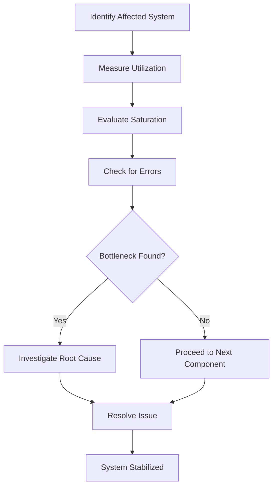
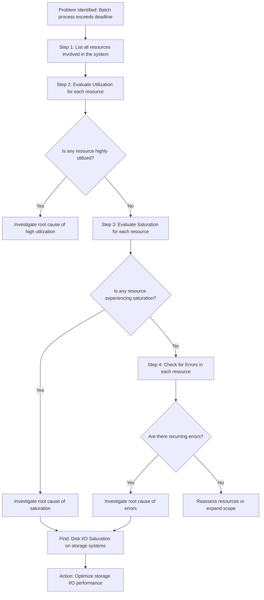
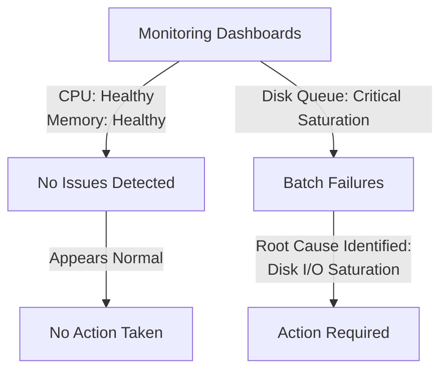
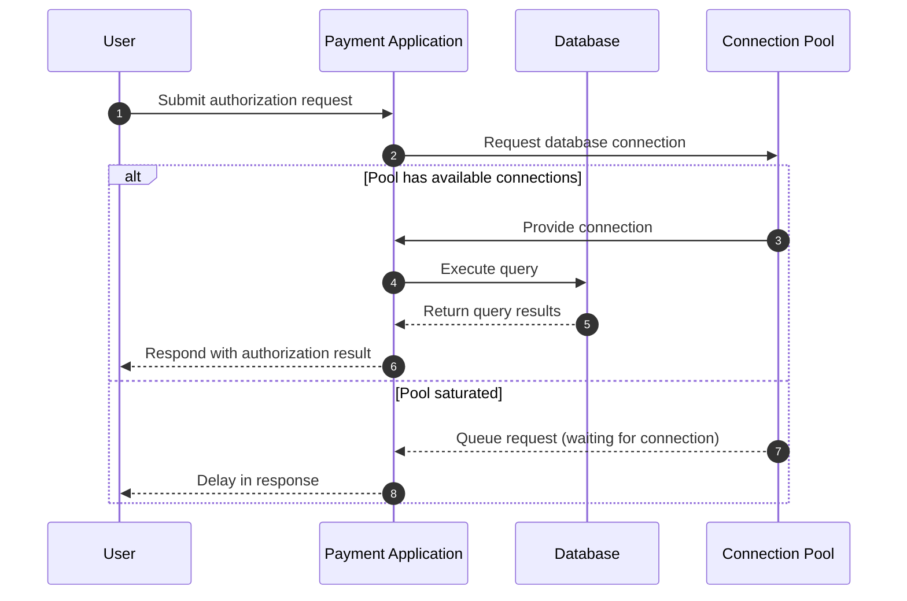
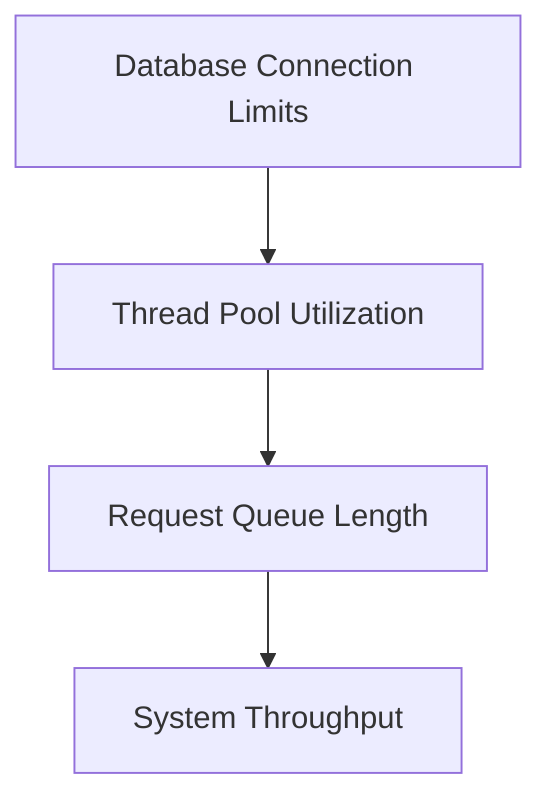

# Chapter 3: Resource-Focused Measurement (USE Method)

## Chapter Overview: Resource-Focused Measurement (USE Method)

This chapter introduces the USE Method—Utilization, Saturation, and Errors—as a systematic framework for resource-level telemetry in complex systems. Moving beyond traditional CPU and memory monitoring, it uncovers how banking systems can experience severe failures due to overlooked resource constraints. From disk I/O saturation to connection pool exhaustion, the chapter presents real-world examples and structured practices that show why comprehensive resource visibility is essential. The chapter equips teams to map, measure, and monitor every layer of infrastructure and application architecture to find root causes before they escalate into business-impacting failures.

______________________________________________________________________

## Learning Objectives

By the end of this chapter, readers will be able to:

1. Define the three pillars of the USE Method: Utilization, Saturation, and Errors.
2. Apply USE methodology to all system resources—not just the obvious ones.
3. Detect hidden constraints using saturation metrics and queue depths.
4. Extend resource monitoring to application-level constraints (e.g., thread pools, connection limits).
5. Construct a measurement matrix that covers system layers from hardware to middleware.
6. Correlate constraints across components to identify cascading failures.
7. Prioritize root-cause bottlenecks over symptomatic performance issues.

______________________________________________________________________

## Key Takeaways

- **Most Problems Aren’t Where You’re Looking**: Just because your CPU isn’t on fire doesn’t mean everything’s fine. Bottlenecks are shy.
- **Saturation Is the Canary in the Coal Mine**: It tells you where queues are building, and where your next 3 AM page is coming from.
- **If It Can Queue, It Can Kill You**: Disk writes, DB connections, message queues—all innocent-looking until they clog up and ruin your batch window.
- **USE Your Head**: Stop staring at 40% CPU dashboards like they owe you answers. Build full resource inventories and measure everything.
- **Applications Have Bottlenecks Too**: Thread pools and connection pools need as much love (and scrutiny) as your servers.
- **The Matrix Is Real**: Build a measurement matrix so you can find blind spots before they find you.
- **Fix the Cause, Not the Echo**: Don’t throw memory at a queueing problem or scale your way out of a lock—you’ll just look busy while doing nothing useful.

______________________________________________________________________

## Panel 1: The Resource Detective

### Scene Description

The infrastructure team is shown systematically applying the USE method checklist to diagnose a batch processing failure in the core banking system. Engineers are collaboratively analyzing metrics for Utilization, Saturation, and Errors across system components. The process is depicted in a clear, structured flow to emphasize the methodical nature of the investigation.

Below is a simplified representation of the troubleshooting workflow:



This visualization reinforces the systematic approach of the USE method, as engineers evaluate each resource dimension step by step to isolate bottlenecks or failures.

### Teaching Narrative

The USE Method provides a comprehensive framework for measuring resource health through three key dimensions: Utilization (how busy the resource is), Saturation (how much queueing is occurring), and Errors (failure counts). This systematic measurement approach ensures no resource constraints go unexamined, creating a methodical path through performance investigation. For banking infrastructure, USE metrics create a structured approach to identifying bottlenecks that might otherwise remain hidden during critical financial processing.

### Common Example of the Problem

A bank's nightly batch reconciliation process has been gradually taking longer to complete, now threatening its 6 AM completion deadline before daily operations begin. The operations team has tried various troubleshooting approaches: examining application logs, increasing server CPU and memory allocation, and optimizing database queries. None of these efforts have improved completion times. Without a systematic approach to resource measurement, the team keeps focusing on the most visible components while missing the actual constraint: disk I/O saturation on storage systems handling the transaction journaling.

The USE method provides a structured way to identify such hidden constraints. Below is a flowchart illustrating how the troubleshooting process would look using the USE methodology:



By systematically applying the USE method, the team identifies disk I/O saturation as the root cause, which was previously overlooked. This structured process ensures no critical resource is ignored, preventing wasted effort on non-constraining components and enabling targeted resolution of the actual bottleneck.

### SRE Best Practice: Evidence-Based Investigation

Implement the USE method comprehensively across all system resources to ensure no potential bottlenecks are overlooked. Use the following checklist to guide your investigation:

#### Checklist for USE Method Application

| Step | Action                                                                                           | Example Metrics/Tools                                                               |
| ---- | ------------------------------------------------------------------------------------------------ | ----------------------------------------------------------------------------------- |
| 1    | **Inventory Resources**: Identify all system resources to evaluate.                              | CPU, memory, network interfaces, disk I/O, storage capacity, file descriptors, etc. |
| 2    | **Measure Utilization**: Assess how busy the resource is (0-100%).                               | CPU usage %, disk busy time %, network bandwidth usage                              |
| 3    | **Measure Saturation**: Determine the extent of queued work that cannot be processed.            | Load average, queue depth, thread pool backlogs                                     |
| 4    | **Measure Errors**: Count error events associated with the resource.                             | Disk I/O errors, dropped packets, failed transactions                               |
| 5    | **Prioritize Analysis**: Focus on resources with the highest utilization or saturation first.    | Identify and address the most constrained resources                                 |
| 6    | **Correlate Metrics**: Link resource metrics to application performance for root cause analysis. | Latency spikes, throughput drops, error rate increases                              |

#### Example Application

Systematic USE analysis uncovered disk I/O saturation as the root cause of write operation delays during high-volume journal processing. Despite traditional monitoring overlooking this issue, the USE method revealed a severe performance constraint caused by queued write operations on storage. Resolving this bottleneck significantly improved processing times for critical financial transactions.

### Banking Impact

For batch reconciliation processes, completion within defined windows directly impacts regulatory compliance and start-of-day operations. When reconciliation misses its completion window, downstream effects cascade throughout the organization: branch openings may be delayed, customer account balances remain unupdated, financial reporting deadlines are missed, and regulatory submissions become late.

#### Real-World Example: Case of Apex Bank

Apex Bank, a mid-sized regional financial institution, experienced a critical failure in its nightly batch processing due to resource saturation in its database layer. The reconciliation process, which typically concludes by 3:00 AM, extended past 7:00 AM, delaying the generation of updated account balances. As a result:

- **Branch Operations:** Several branches were unable to open on time due to unverified cash flow reports, impacting customers reliant on early transactions.
- **Customer Dissatisfaction:** Account holders attempting to view their balances via online banking encountered outdated information, leading to a surge in support calls and complaints.
- **Regulatory Risks:** The delay caused the bank to file late reporting for daily liquidity metrics, triggering scrutiny from financial regulators and risking potential penalties.

This incident highlighted how resource constraints—particularly high utilization and queueing at peak processing times—can create operational bottlenecks with wide-ranging impacts. By applying the USE Method to systematically assess utilization, saturation, and errors across their infrastructure, Apex Bank was able to identify misconfigured database parameters and optimize resource allocation, preventing further disruptions.

The business impact of such failures extends beyond technical concerns, encompassing potential regulatory penalties, customer dissatisfaction, and operational disruption across multiple departments. Proactive monitoring and troubleshooting using the USE Method can mitigate these risks, ensuring smoother operations and maintaining customer trust.

### Implementation Guidance

1. **Create a comprehensive resource inventory**\
   Begin by cataloging all infrastructure components, including servers, storage systems, databases, and network devices. Ensure each component is tagged with relevant metadata (e.g., environment, resource type, criticality).

2. **Implement standardized USE dashboards**\
   Build dashboards to visualize Utilization, Saturation, and Errors for each resource. Below is an example Python snippet using Prometheus and Grafana to define a USE dashboard for CPU metrics:

   ```python
   from prometheus_api_client import PrometheusConnect

   prom = PrometheusConnect(url="http://prometheus-server:9090", disable_ssl=True)

   # Query for CPU utilization
   cpu_util_query = '100 - (avg by(instance)(rate(node_cpu_seconds_total{mode="idle"}[5m])) * 100)'

   # Query for CPU saturation (run queue length)
   cpu_sat_query = 'avg by(instance)(node_load1)'

   # Query for CPU errors (example: CPU throttling)
   cpu_err_query = 'sum by(instance)(rate(container_cpu_cfs_throttled_seconds_total[5m]))'

   # Fetch data
   cpu_util_data = prom.custom_query(query=cpu_util_query)
   cpu_sat_data = prom.custom_query(query=cpu_sat_query)
   cpu_err_data = prom.custom_query(query=cpu_err_query)

   print("CPU Utilization:", cpu_util_data)
   print("CPU Saturation:", cpu_sat_data)
   print("CPU Errors:", cpu_err_data)
   ```

   Use tools like Grafana to visualize these metrics in real-time, enabling quick identification of problematic patterns.

3. **Develop systematic troubleshooting runbooks**\
   Create detailed runbooks that guide engineers through a step-by-step USE methodology for each resource type. For example:

   - Check utilization: Is the resource overused? Identify top consumers.
   - Check saturation: Is queuing causing delays? Investigate queue metrics.
   - Check errors: Are there failure patterns? Correlate error logs with resource behavior.

4. **Establish baseline performance**\
   Record and define normal operation thresholds for all resources during periods of stable system performance. Use these baselines to compare against live metrics during incidents.

5. **Build automated analysis tools**\
   Develop scripts or monitoring tools that flag anomalous USE metrics. For instance, use a simple logic flow to detect deviations:

   ```
   If (Utilization > 80%) AND (Saturation > threshold) THEN alert "High resource contention"
   If (Errors > baseline) THEN alert "Error spike detected"
   ```

   These tools can provide early warnings for emerging resource bottlenecks, enabling proactive resolution.

## Panel 2: The Invisible Bottleneck

### Scene Description

The team identifies disk I/O saturation during peak write periods as the root cause of nightly batch processing failures. This occurs despite normal CPU and memory metrics, leading to confusion based on standard monitoring dashboards. The following visual illustrates the contrast between healthy CPU and memory utilization versus critical disk queue metrics:



This comparison highlights how standard monitoring often overlooks disk-specific metrics critical to diagnosing performance bottlenecks.

### Teaching Narrative

USE metrics reveal "invisible" resource constraints that standard monitoring approaches often miss but that significantly impact system performance. By measuring utilization, saturation, and errors for all system resources—not just the obvious ones—this methodology identifies non-intuitive bottlenecks that explain otherwise mysterious performance problems. For banking batch processing, comprehensive resource metrics enable precise identification of constraints that cause processing delays, reconciliation failures, or incomplete operations.

### Common Example of the Problem

A core banking system performs end-of-day processing to calculate interest, update balances, and generate customer statements. Despite running on servers with ample CPU and memory capacity (both showing only 40-50% utilization), processing regularly fails to complete within its operational window. Traditional monitoring focuses exclusively on these primary resources, showing healthy systems with no apparent issues.

The application of the USE methodology reveals the actual issue: disk I/O saturation during peak write periods. Operations are queuing for storage access despite low overall disk utilization. This saturation metric—showing operations waiting in queue—was not being monitored, creating an invisible bottleneck that throttled the entire process.

Below is a summary of the resource metrics during the problem scenario:

| Resource | Utilization (%) | Saturation (e.g., Wait Queue) | Errors |
| -------- | --------------- | ----------------------------- | ------ |
| CPU      | 40-50%          | N/A                           | None   |
| Memory   | 40-50%          | N/A                           | None   |
| Disk I/O | 60%             | High (operations queuing)     | None   |

This table highlights the contrast between traditional resource utilization metrics (CPU and memory) and the critical saturation metric for disk I/O, which exposed the hidden bottleneck. By expanding monitoring to include all three USE metrics—utilization, saturation, and errors—teams can uncover and address non-obvious constraints that impact system performance.

### SRE Best Practice: Evidence-Based Investigation

Implement comprehensive resource measurement to uncover hidden constraints. Use the following checklist during investigations:

- [ ] **Expand Monitoring Scope**\
  Include all potential bottlenecks beyond primary resources like CPU and memory (e.g., disk I/O, network bandwidth, and storage).

- [ ] **Measure Utilization and Saturation**\
  Collect both average utilization and peak saturation metrics for each resource.

- [ ] **Assess Queue Depths and Wait Times**\
  Monitor queue depths and wait times as critical indicators of resource constraints.

- [ ] **Correlate Metrics with Workload Patterns**\
  Identify how resource saturation aligns with specific workload patterns and timing.

- [ ] **Characterize Workload Resource Demands**\
  Analyze operations to understand resource demands by workload type, such as batch jobs or transactional processing.

#### Example Insight

Using the USE methodology, analysis of storage resources revealed a consistent queue of 200+ operations for disk access during nightly statement generation. This bottleneck was invisible through traditional utilization metrics but critically impacted batch processing performance.

### Banking Impact

In financial batch processing, invisible bottlenecks directly affect regulatory compliance and customer service. End-of-day processing failures delay interest calculations, statement generation, and balance updates critical for start-of-day operations. When these processes extend beyond their windows, they affect ATM availability, online banking accuracy, and branch readiness. Beyond operational impacts, these delays can trigger regulatory reporting requirements for system availability and processing completeness, creating compliance issues in addition to customer experience problems.

### Implementation Guidance

1. **Identify Storage Resources**\
   Map all storage resources in the banking architecture, including disks, SSDs, and network-attached storage. Ensure queue monitoring is enabled for each resource to track operational delays.

2. **Set Up Saturation Monitoring**\
   Use a monitoring tool (e.g., Prometheus, Datadog) to display saturation metrics for storage queues. Below is an example Prometheus query to monitor disk queue length:

   ```promql
   node_disk_io_time_seconds_total{device="sda"} / node_disk_io_time_weighted_seconds_total{device="sda"}
   ```

   This query calculates the weighted percentage of time the disk is busy, indicating saturation levels.

3. **Create Saturation Dashboards**\
   Design dashboards to visualize queue length, IOPS (Input/Output Operations Per Second), and latency for each storage resource. Example dashboard structure:

   ```
   +----------------------------+
   | Disk Queue Length          |
   |  - Device: sda             |
   |  - Queue Length: 28        |
   +----------------------------+
   | IOPS                       |
   |  - Read: 1200/s            |
   |  - Write: 800/s            |
   +----------------------------+
   | Latency                    |
   |  - Average: 18ms           |
   |  - Max: 50ms               |
   +----------------------------+
   ```

4. **Develop Resource Demand Profiles**\
   Record resource usage patterns for different batch operations. For example, identify that nightly reconciliation consumes 80% of storage IOPS between 2:00 AM and 4:00 AM. Use this data to predict peak periods and optimize scheduling.

5. **Implement I/O Scheduling Optimizations**\
   Prioritize critical batch operations by implementing I/O scheduling policies. For example, use `ionice` settings to adjust priority levels for processes on Linux systems:

   ```bash
   ionice -c 1 -n 0 -p <process_id>
   ```

   This ensures high-priority operations are not delayed by less critical tasks.

6. **Expand Bottleneck Monitoring**\
   Extend monitoring to include non-traditional metrics such as file descriptor usage, network saturation, and application-level queuing. Example: Monitor application-level queuing with a metric like `requests_in_flight` to identify upstream bottlenecks before they impact disk I/O.

By implementing these steps and leveraging comprehensive dashboards, teams can proactively identify and address invisible bottlenecks, ensuring reliable batch processing and system performance.

## Panel 3: Beyond Basic Resources

### Scene Description

The team is engaged in an advanced monitoring discussion, focusing on identifying non-standard resources to measure in a payment processing system. Key resources under review include connection pools, thread pools, and queue depths. The conversation highlights the importance of extending monitoring beyond traditional metrics.

To aid understanding, below is a text-based hierarchy illustrating the resource structure from physical to logical components:

```
Physical Infrastructure
├── CPU
├── Memory
├── Disk
└── Network
    └── Logical Resources
        ├── Connection Pools
        ├── Thread Pools
        ├── Queue Depths
        ├── Memory Heap Segments
        ├── Buffer Allocations
        └── Query Optimizers
```

This hierarchical view emphasizes how logical resources, while abstracted from physical components, are directly influenced by them and play a critical role in application performance within the banking system.

### Teaching Narrative

Comprehensive USE measurement extends beyond traditional infrastructure metrics (CPU, memory, disk, network) to include application-level resources that often become critical constraints in banking systems. These expanded resource metrics include connection pools, thread pools, memory heap segments, buffer allocations, and query optimizers. By applying the USE methodology to these specialized resources, teams gain visibility into bottlenecks that traditional monitoring overlooks but that directly impact financial transaction processing.

### Common Example of the Problem

A payment processing platform handles credit card authorizations with consistent CPU and memory metrics well within capacity limits, yet transaction latency periodically spikes during peak periods. Traditional monitoring shows no resource constraints at the infrastructure level, creating confusion about the performance degradation. Expanded USE methodology reveals the actual bottleneck: database connection pool saturation where new authorization requests queue waiting for available connections, despite the database server itself showing only moderate load. This application-level resource constraint remained invisible to infrastructure-focused monitoring, yet directly impacted customer transaction times.

To better understand this flow and its bottlenecks, consider the following sequence diagram:



This sequence illustrates how connection pool saturation creates a queue for new database requests during peak periods. Even though the database itself shows moderate load, the limited number of available connections in the pool delays transaction processing, resulting in higher latency for users. By identifying and addressing this previously hidden bottleneck, teams can improve transaction performance and customer satisfaction.

### SRE Best Practice: Evidence-Based Investigation

Implement the expanded USE methodology for application-level resources by following these actionable steps:

#### Checklist: Applying the Expanded USE Methodology

1. **Inventory Constrained Resources**

   - Identify and document all critical resources in the application architecture:
     - Connection pools (e.g., database, API, service connections)
     - Thread pools (e.g., worker threads, asynchronous processing queues)
     - Memory structures (e.g., heap segments, buffer caches, in-memory data)
     - Locks and semaphores (e.g., database locks, file locks, shared resource controls)
     - Message queues (e.g., processing backlog, consumption rates, queue depths)

2. **Measure Key Metrics**

   - For each resource, track:
     - **Utilization**: How much of the resource is being used?
     - **Saturation**: How close is the resource to its limits?
     - **Errors**: Are there failures or anomalies associated with the resource?

3. **Analyze Resource Constraints**

   - Correlate application performance metrics with resource usage to identify bottlenecks.
   - Investigate cascading effects, such as thread pool exhaustion caused by connection pool saturation.

4. **Establish Baselines**

   - Define baseline patterns for both normal and peak operational periods.
   - Use historical data to differentiate typical behavior from anomalies.

5. **Define Early Warning Thresholds**

   - Create actionable thresholds for utilization, saturation, and errors to detect issues before they lead to failures.
   - Implement automated alerts to notify teams when thresholds are breached.

6. **Iterate and Refine**

   - Regularly review the resource inventory and monitoring configurations.
   - Adjust thresholds and baselines based on new insights or changes in application behavior.

#### Visualizing the Process


#### Example Insight

Comprehensive resource analysis often uncovers multi-layered constraints. For instance:

- Connection pool saturation can lead to thread pool exhaustion.
- This, in turn, results in cascading latencies that traditional monitoring might overlook.

By adhering to this checklist, teams can proactively address resource constraints, ensuring smoother operations in high-stakes systems like payment processing.

### Banking Impact

In payment authorization systems, application resource constraints directly impact transaction approval rates and processing times. Connection pool saturation creates authorization timeouts that may appear as technical declines to merchants and customers, potentially triggering unnecessary fraud alerts or transaction retries that compound the problem. These constraint-induced failures affect customer satisfaction, merchant relationships, and interchange revenue. For high-profile merchants or premium customers, these failures can damage strategic relationships beyond the immediate technical impact.

#### Summary of Impacts and Consequences

| Resource Constraint        | Impact on System                   | Consequence                                  |
| -------------------------- | ---------------------------------- | -------------------------------------------- |
| Connection Pool Saturation | Authorization timeouts             | Increased transaction declines, fraud alerts |
| Thread Pool Exhaustion     | Delayed processing of transactions | Customer dissatisfaction, lost transactions  |
| Queue Depth Overflows      | Processing backlogs                | Prolonged settlement times, revenue delays   |
| Memory Heap Fragmentation  | Unstable application performance   | System outages, transaction retries          |
| Buffer Allocation Failures | Data transmission interruptions    | Partial transaction processing, data loss    |

By addressing these resource constraints comprehensively, banks can mitigate technical bottlenecks that directly translate into operational inefficiencies, financial losses, and reputational risks.

### Implementation Guidance

1. Create an inventory of all application resource pools and their configuration limits:

   - Identify key resource pools such as connection pools, thread pools, and buffer allocations.
   - Document their maximum limits, default settings, and any application-specific constraints.

2. Implement comprehensive monitoring of connection acquisition times and queue depths:

   - Use monitoring tools or libraries to collect metrics on connection pool usage, acquisition latency, and queue depth.
   - Example configuration snippet for monitoring connection pools using HikariCP in Java:
     ```java
     HikariConfig config = new HikariConfig();
     config.setJdbcUrl("jdbc:mysql://localhost:3306/payments");
     config.setUsername("user");
     config.setPassword("password");
     config.setMaximumPoolSize(20);
     config.setPoolName("PaymentsPool");

     HikariDataSource dataSource = new HikariDataSource(config);

     // Enable metrics collection
     MetricsTrackerFactory metricsTrackerFactory = new MetricsTrackerFactory() {
         @Override
         public IMetricsTracker create(String poolName, PoolStats poolStats) {
             return new PrometheusMetricsTracker(poolName, poolStats);
         }
     };
     config.setMetricsTrackerFactory(metricsTrackerFactory);
     ```

3. Develop dashboards showing pool utilization and saturation during different load profiles:

   - Visualize metrics such as active connections, pending threads, and pool saturation levels over time.
   - Example: Use Prometheus and Grafana to create a dashboard with alerts for threshold breaches.

4. Configure appropriate pool sizes based on actual usage patterns and transaction priorities:

   - Analyze historical data to determine optimal pool sizes that balance throughput and latency.
   - Adjust pool configurations during peak periods to handle increased transaction loads.

5. Establish graduated alerting for pool saturation with increasing urgency as constraints approach:

   - Define alert thresholds such as 70%, 85%, and 95% pool saturation.
   - Example Prometheus alert rule:
     ```yaml
     groups:
       - name: connection_pool_alerts
         rules:
           - alert: HighPoolSaturation
             expr: hikari_pool_saturation{pool="PaymentsPool"} > 0.85
             for: 2m
             labels:
               severity: warning
             annotations:
               summary: "Connection pool saturation is high"
               description: "The PaymentsPool connection pool is {{ $value | humanizePercentage }} full."
           - alert: CriticalPoolSaturation
             expr: hikari_pool_saturation{pool="PaymentsPool"} > 0.95
             for: 1m
             labels:
               severity: critical
             annotations:
               summary: "Connection pool saturation critical"
               description: "The PaymentsPool connection pool has reached critical saturation at {{ $value | humanizePercentage }}."
     ```

## Panel 4: The Measurement Matrix

### Scene Description

The Operations team is depicted systematically creating a comprehensive resource inventory for the trading platform. They apply USE (Utilization, Saturation, Errors) metrics to each component. The process is visually represented by a structured matrix that maps resources to measurement types across system layers. Below is a text-based representation of the visual matrix:

```
+--------------------+-------------------+----------------+-------------------+----------------+
| Resource Layer     | Resource Type     | Utilization    | Saturation        | Errors         |
+--------------------+-------------------+----------------+-------------------+----------------+
| Physical           | CPU, Memory,     | % Usage        | Queues, Backlogs  | Hardware Faults|
|                    | Network, Disk    |                |                   |                |
+--------------------+-------------------+----------------+-------------------+----------------+
| Virtualization     | Hypervisor,      | Allocated vs.  | Overcommitment,   | Resource Limits|
|                    | Containers       | Used Resources | Contention        |                |
+--------------------+-------------------+----------------+-------------------+----------------+
| Middleware         | Connection Pools,| Active vs. Max | Latency, Drops    | Timeout Errors |
|                    | Caches, Queues   | Connections    |                   |                |
+--------------------+-------------------+----------------+-------------------+----------------+
| Application        | Thread Pools,    | Threads in Use | Thread Starvation | Application    |
|                    | Handlers, Buffers|                |                   | Errors         |
+--------------------+-------------------+----------------+-------------------+----------------+
```

This structured approach ensures no layer of the system is overlooked, enabling the identification and monitoring of potential bottlenecks across the entire trading platform.

### Teaching Narrative

Systematic resource measurement requires a structured approach that inventories all potential constraints and applies consistent metrics across them. This resource measurement matrix applies USE metrics to physical resources (CPU, memory, network, disk), virtualization layers (hypervisor resources, container limits), middleware components (connection pools, caches, queues), and application resources (thread pools, handlers, buffers). For complex trading platforms, this comprehensive measurement approach ensures no potential bottleneck goes unmonitored.

### Common Example of the Problem

A trading platform experiences unpredictable performance degradation during market volatility, despite substantial infrastructure investment. The monitoring team tracks dozens of metrics but lacks a systematic approach to resource measurement. Some components have detailed monitoring while others have significant gaps. During incidents, the team wastes critical time checking resources ad hoc, with no clear methodology.

Below is a summarized representation of the resource layers and monitoring gaps identified in this scenario:

| **Resource Layer**        | **Example Components**                 | **Monitoring Coverage** | **Gap Description**                                             |
| ------------------------- | -------------------------------------- | ----------------------- | --------------------------------------------------------------- |
| **Physical Resources**    | CPU, Memory, Network, Disk             | High                    | Well-monitored but lacks correlation with virtualization layers |
| **Virtualization Layer**  | Hypervisor resources, Container limits | None                    | Missing metrics on CPU throttling, hidden from guest OS         |
| **Middleware Components** | Connection pools, Caches, Queues       | Partial                 | Some components monitored, others overlooked                    |
| **Application Resources** | Thread pools, Handlers, Buffers        | Partial                 | Inconsistent granularity across critical application metrics    |

This table highlights the lack of metrics at the virtualization layer, which concealed critical hypervisor-level CPU throttling during peak loads. A comprehensive USE measurement matrix would systematically address these gaps, ensuring no bottleneck goes unmonitored.

### SRE Best Practice: Evidence-Based Investigation

To implement a structured measurement matrix across all resource layers, follow this actionable checklist:

#### Checklist for Structured Measurement Matrix Implementation

| Step | Action                                  | Details                                                                                                                                                                             |
| ---- | --------------------------------------- | ----------------------------------------------------------------------------------------------------------------------------------------------------------------------------------- |
| 1    | **Define the measurement matrix**       | Map resource types (compute, memory, storage, network, pools, queues) to system layers (hardware, virtualization, OS, middleware, application).                                     |
| 2    | **Apply USE metrics to each cell**      | - **Utilization**: Measure resource usage relative to capacity. <br> - **Saturation**: Monitor queue depth or waiting. <br> - **Errors**: Track failures specific to each resource. |
| 3    | **Identify monitoring gaps**            | Review matrix for any unmonitored resource-layer combinations, ensuring full coverage.                                                                                              |
| 4    | **Standardize measurement methodology** | Use consistent metric definitions and tools across all resources to enable comparable analysis.                                                                                     |
| 5    | **Establish cross-layer correlations**  | Link metrics across layers to detect cascading constraints or upstream/downstream impacts.                                                                                          |

#### Example: Measurement Matrix Overview

Below is an example representation of how the matrix might look after defining resource types and system layers:

```
+-------------------+-------------+--------------+---------------+------------------+--------------------+
| Resource Layer    | Compute     | Memory       | Storage       | Network          | Middleware/Queues  |
+-------------------+-------------+--------------+---------------+------------------+--------------------+
| Hardware          | USE metrics | USE metrics  | USE metrics   | USE metrics      | -                  |
| Virtualization    | USE metrics | USE metrics  | USE metrics   | USE metrics      | -                  |
| OS                | USE metrics | USE metrics  | -             | -                | -                  |
| Middleware        | -           | -            | -             | -                | USE metrics        |
| Application       | USE metrics | USE metrics  | USE metrics   | USE metrics      | USE metrics        |
+-------------------+-------------+--------------+---------------+------------------+--------------------+
```

#### Key Outcome

A comprehensive measurement matrix ensures critical visibility gaps are identified and resolved. For example, monitoring gaps at the virtualization layer may explain previously undiagnosed performance problems during peak trading periods, enabling targeted optimizations.

### Banking Impact

For trading platforms, comprehensive resource visibility directly affects transaction execution quality and regulatory compliance. Invisible resource constraints can cause trade execution delays during market volatility—precisely when performance matters most—potentially costing clients significant amounts on price movements during delayed execution. These performance issues may also trigger regulatory reporting requirements for best execution compliance, creating both financial and regulatory consequences. Complete resource visibility enables the prioritization of critical trading operations even during constrained periods.

### Implementation Guidance

Use the following checklist to systematically implement the measurement matrix:

- [ ] **Develop Resource Inventory**

  - Catalog all physical resources (CPU, memory, network, disk).
  - Include virtualization layers (e.g., hypervisors, container limits).
  - Account for middleware components (e.g., connection pools, caches, queues).
  - Document application-level resources (e.g., thread pools, handlers, buffers).

- [ ] **Define USE Metrics**

  - Identify Utilization, Saturation, and Error metrics for each resource type.
  - Ensure metrics are standardized and consistent across all layers.

- [ ] **Implement Monitoring**

  - Deploy tools to monitor resources where visibility gaps exist.
  - Verify that all critical metrics are tracked in real time.

- [ ] **Build Dashboards**

  - Create dashboards that map resource relationships across layers.
  - Use visualizations to highlight dependencies and potential bottlenecks.

- [ ] **Conduct Regular Reviews**

  - Schedule periodic reviews to evaluate measurement completeness.
  - Adjust metrics and monitoring tools to address any blind spots.

## Panel 5: Correlating Resource Constraints

### Scene Description

Performance engineers mapping relationships between resource metrics to identify cascade patterns where one resource constraint triggers others. The diagram below illustrates a dependency flow where database connection limits directly influence thread pool utilization, leading to potential cascading effects on request processing and system throughput.



This dependency diagram highlights how saturation in database connections can propagate through other system components, emphasizing the importance of identifying and addressing root causes of resource constraints.

### Teaching Narrative

Advanced resource metrics reveal causal relationships between different system constraints, showing how saturation in one component can cascade to others. These correlation metrics map dependencies between resources, identify trigger thresholds where constraints begin to propagate, and measure amplification effects where small limitations in one area cause larger problems elsewhere. For banking systems, understanding these resource interaction patterns enables targeted optimization at constraint sources rather than just addressing symptoms.

### Common Example of the Problem

A bank's mobile deposit system experiences periodic processing delays despite having apparently adequate resources at each individual component. Engineers optimize each system in isolation based on its utilization metrics, but problems persist. Correlation analysis of resource metrics reveals the actual pattern: when image processing threads reach 70% utilization, database connections begin to be held longer, which then saturates the connection pool at 85% capacity, triggering a queue in the API gateway, ultimately causing end-user latency.

The cascade can be visualized as follows:

```
Image Processing Threads (70% utilization)
    ↓ Increased hold time on DB connections
Database Connections (85% saturation)
    ↓ Saturation of connection pool
Connection Pool
    ↓ Queue builds in API Gateway
API Gateway
    ↓
End-User Latency
```

Without understanding these cascade relationships, engineers focus on symptoms (API gateway queuing) rather than the root cause (image processing efficiency), implementing ineffective solutions that waste resources.

### SRE Best Practice: Evidence-Based Investigation

Implement resource correlation analysis using the following checklist to identify and address dependency patterns:

#### Checklist for Evidence-Based Investigation:

- **Map Resource Dependencies**

  - Create detailed maps showing relationships and dependencies between system components.
  - Highlight critical paths where resource constraints are most likely to propagate.

- **Measure Correlations**

  - Calculate correlation coefficients between key resource metrics to quantify relationships.
  - Focus on metrics with strong correlations to identify potential cause-and-effect links.

- **Identify Threshold Triggers**

  - Determine specific thresholds where saturation or limits in one resource begin to impact others.
  - Document these trigger points to anticipate and mitigate cascading effects.

- **Analyze Propagation Delays**

  - Measure time delays between saturations of related resources.
  - Use timing data to identify causal chains and sequence of constraint propagation.

- **Evaluate Amplification Effects**

  - Assess how small constraints in one area can amplify into larger system-wide issues.
  - Quantify these effects to prioritize optimizations where they will have the greatest impact.

#### Example Scenario:

Resource correlation analysis reveals that image processing thread saturation is the root cause of multiple downstream constraints. Timing signatures indicate how problems cascade through the system, with propagation delays aligning with thread pool utilization spikes and database connection saturation. Addressing the thread saturation prevents the cascade and restores stability.

### Banking Impact

In mobile deposit processing, understanding resource dependencies directly affects both customer experience and operational efficiency. Correlation metrics enable targeted optimization at constraint sources, reducing processing delays that affect funds availability and customer satisfaction. These insights also prevent wasteful overprovisioning of downstream resources that won't resolve the root constraint. For financial institutions, this analytical approach enables cost-effective reliability improvements by addressing actual bottlenecks rather than symptoms.

### Implementation Guidance

1. **Create Visualization Tools**\
   Develop visualization tools that display resource metric correlations over time. For example, use Python with libraries like `matplotlib` or `plotly` to create time-series correlation graphs. Here's a sample snippet:

   ```python
   import pandas as pd
   import seaborn as sns
   import matplotlib.pyplot as plt

   # Example dataset: resource metrics over time
   data = {
       "timestamp": ["2023-10-01 10:00", "2023-10-01 10:01", "2023-10-01 10:02"],
       "db_connections": [120, 130, 140],
       "thread_pool_utilization": [70, 75, 80]
   }
   df = pd.DataFrame(data)
   df["timestamp"] = pd.to_datetime(df["timestamp"])

   # Correlation heatmap
   correlations = df.drop(columns=["timestamp"]).corr()
   sns.heatmap(correlations, annot=True, cmap="coolwarm")
   plt.title("Resource Metric Correlations")
   plt.show()
   ```

2. **Implement Statistical Analysis**\
   Use statistical methods to identify significant relationships between resource metrics. For instance, calculate Pearson correlation coefficients to quantify linear dependencies. This can help reveal trigger thresholds for cascading constraints.

   ```python
   # Calculate Pearson correlation
   pearson_corr = df.corr(method='pearson')
   print("Pearson Correlation Coefficients:\n", pearson_corr)
   ```

3. **Develop Cascading Constraint Models**\
   Model cascading constraints for critical transaction paths by simulating how resource saturation propagates. Use tools like Python's `networkx` to represent and analyze resource dependencies:

   ```python
   import networkx as nx

   # Create a directed graph for resource dependencies
   G = nx.DiGraph()
   G.add_edges_from([
       ("DB Connections", "Thread Pool Utilization"),
       ("Thread Pool Utilization", "Transaction Latency")
   ])

   # Visualize the graph
   nx.draw(G, with_labels=True, node_color='lightblue', arrowsize=20)
   plt.title("Cascading Constraint Model")
   plt.show()
   ```

4. **Build Dependency-Aware Dashboards**\
   Create dashboards that highlight root constraints in real-time. Use frameworks like Grafana or custom web apps with libraries such as `Dash` or `Streamlit` to integrate dependency awareness into operational monitoring.

5. **Establish Optimization Priorities**\
   Perform constraint impact analysis to prioritize optimization efforts. Focus on components with the highest amplification effects. For example, leverage simulations or historical analysis to identify the "bottleneck multiplier" where small changes yield the biggest performance improvements.
