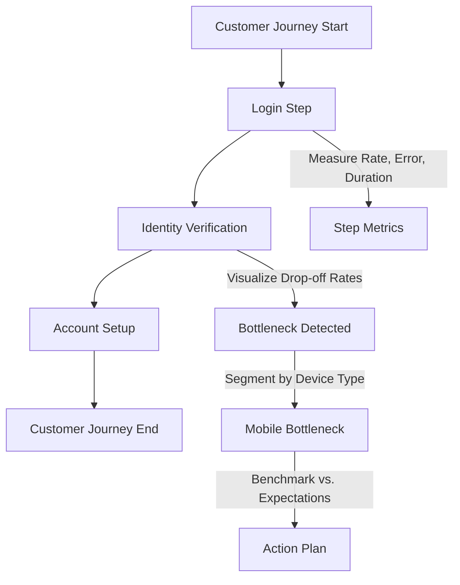
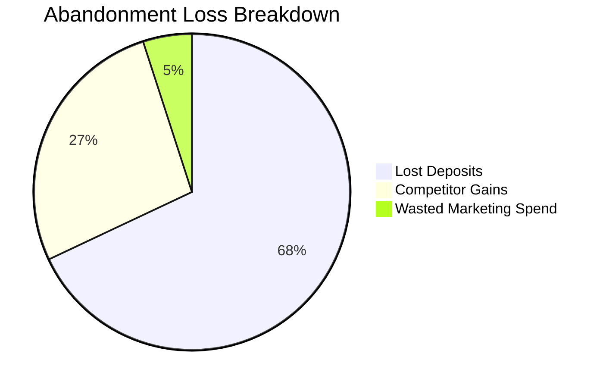
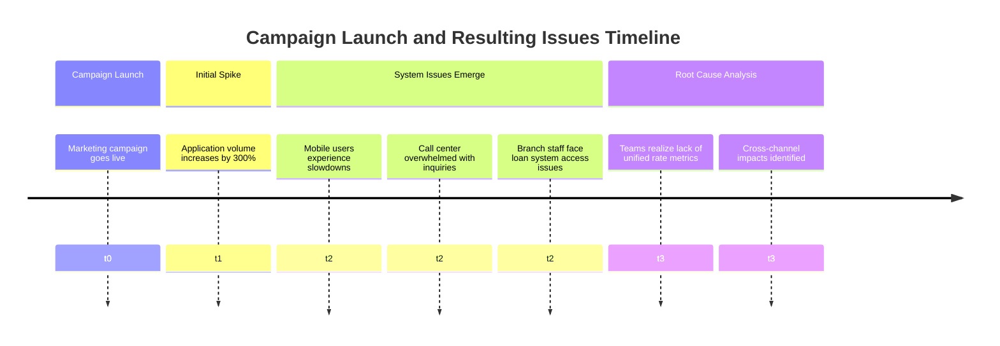
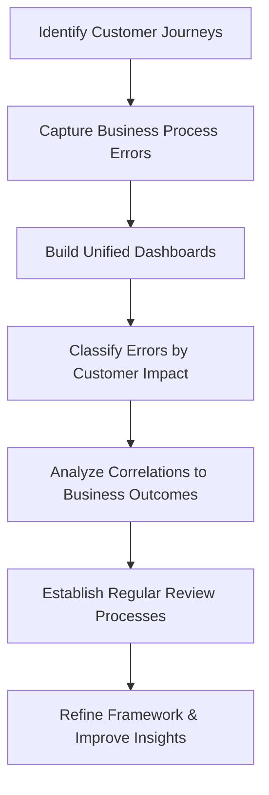

# Chapter 4: Customer-Centric Measurement (RED Method)

## Chapter Overview: Customer-Centric Measurement (RED Method)

This chapter explores the RED Method—Rate, Errors, Duration—as a framework for understanding system performance from the customer’s point of view. Where USE focuses on system internals, RED reveals what the user experiences, mapping failures, slowness, and demand patterns directly to customer satisfaction and business outcomes. Set in banking scenarios, this chapter highlights how technical teams can stop obsessing over green dashboards and start measuring what actually matters: whether people can complete tasks, how often things go wrong, and how long it all takes. If your system looks healthy but your customers are angry, RED is how you figure out why.

______________________________________________________________________

## Learning Objectives

By the end of this chapter, readers will be able to:

1. Define the three pillars of the RED Method: Rate, Errors, and Duration.
2. Map RED metrics to actual customer journeys across digital channels.
3. Measure errors in terms of customer impact, not just technical status codes.
4. Track journey-based duration metrics including perceived wait times.
5. Use rate metrics to identify shifting customer demand and channel strain.
6. Build RED dashboards that highlight drop-off points and customer pain.
7. Translate RED metrics into business KPIs for executive alignment.

______________________________________________________________________

## Key Takeaways

- **Green Dashboards, Red Faces**: Just because your system is "up" doesn’t mean your customers are sticking around. RED metrics show you why they’re leaving.
- **Not All Errors Are Equal**: A successful API call that leads to a failed experience is just a stealth failure in fancy clothes.
- **Time Is Subjective, Especially When You're Waiting**: Measuring actual duration isn't enough—you have to capture how long it *feels* when nothing is happening.
- **Traffic Doesn’t Lie, But It Does Confuse**: Rate spikes aren’t always a win—they can signal broken experiences, marketing mismatches, or desperate retries.
- **Your Funnel Is Leaking**: RED metrics let you measure where, when, and how people abandon your carefully crafted customer journeys.
- **Translation Is the Final Step**: If your metrics can't speak to your executives in dollars, churn, or growth—you’re not done yet.
- **Business Outcomes Demand Business Metrics**: RED helps SREs and product owners finally speak the same language: customer impact.

> It’s time to stop admiring your uptime and start measuring your letdowns.

______________________________________________________________________

## Chapter Overview: Resource-Focused Measurement (USE Method)

This chapter introduces the USE Method—Utilization, Saturation, and Errors—as a systematic framework for resource-level telemetry in complex systems. Moving beyond traditional CPU and memory monitoring, it uncovers how banking systems can experience severe failures due to overlooked resource constraints. From disk I/O saturation to connection pool exhaustion, the chapter presents real-world examples and structured practices that show why comprehensive resource visibility is essential. The chapter equips teams to map, measure, and monitor every layer of infrastructure and application architecture to find root causes before they escalate into business-impacting failures.

## Learning Objectives

By the end of this chapter, readers will be able to:

1. Define the three pillars of the USE Method: Utilization, Saturation, and Errors.
2. Apply USE methodology to all system resources—not just the obvious ones.
3. Detect hidden constraints using saturation metrics and queue depths.
4. Extend resource monitoring to application-level constraints (e.g., thread pools, connection limits).
5. Construct a measurement matrix that covers system layers from hardware to middleware.
6. Correlate constraints across components to identify cascading failures.
7. Prioritize root-cause bottlenecks over symptomatic performance issues.

## Key Takeaways

- **Most Problems Aren’t Where You’re Looking**: Just because your CPU isn’t on fire doesn’t mean everything’s fine. Bottlenecks are shy.
- **Saturation Is the Canary in the Coal Mine**: It tells you where queues are building, and where your next 3 AM page is coming from.
- **If It Can Queue, It Can Kill You**: Disk writes, DB connections, message queues—all innocent-looking until they clog up and ruin your batch window.
- **USE Your Head**: Stop staring at 40% CPU dashboards like they owe you answers. Build full resource inventories and measure everything.
- **Applications Have Bottlenecks Too**: Thread pools and connection pools need as much love (and scrutiny) as your servers.
- **The Matrix Is Real**: Build a measurement matrix so you can find blind spots before they find you.
- **Fix the Cause, Not the Echo**: Don’t throw memory at a queueing problem or scale your way out of a lock—you’ll just look busy while doing nothing useful.

______________________________________________________________________

## Panel 1: Through the Customer's Eyes

### Scene Description

UX researchers and SREs are collaborating on a metrics dashboard designed to visualize the customer journey through the digital account opening process. The dashboard integrates RED metrics—Rate, Error, and Duration—at each step of the journey, emphasizing how customers experience the service in real-time.

Below is a text-based representation of the multi-step customer journey map, with RED metrics overlaid:

```
Customer Journey: Digital Account Opening

[Start] --> [Step 1: Login] 
  Rate: 1000 req/s
  Error: 0.5%
  Duration: 150ms

[Step 1: Login] --> [Step 2: Identity Verification]
  Rate: 950 req/s
  Error: 1%
  Duration: 300ms

[Step 2: Identity Verification] --> [Step 3: Account Selection]
  Rate: 920 req/s
  Error: 0.8%
  Duration: 200ms

[Step 3: Account Selection] --> [Step 4: Terms Agreement]
  Rate: 900 req/s
  Error: 0.3%
  Duration: 100ms

[Step 4: Terms Agreement] --> [Step 5: Account Creation]
  Rate: 890 req/s
  Error: 0.2%
  Duration: 250ms

[Step 5: Account Creation] --> [Finish]
```

This journey map highlights how RED metrics are tracked at each stage, providing actionable insights into the customer experience and enabling teams to identify potential bottlenecks or areas for improvement.

### Teaching Narrative

The RED Method focuses on service-level metrics that directly reflect customer experience: Request Rate (traffic), Error Rate (failures), and Duration (latency). This customer-centric measurement approach aligns technical metrics with user journeys, making service performance directly relatable to business outcomes. For banking applications, RED metrics transform abstract technical measurements into clear indicators of service quality as customers experience it, bridging the gap between infrastructure performance and business impact.

### Common Example of the Problem

A bank recently launched a digital account opening process but faces an unacceptably high 68% abandonment rate. The technical team monitors dozens of system metrics (CPU, memory, API availability, database performance), all showing healthy values within established thresholds. Despite these positive technical indicators, customers are abandoning the process in alarming numbers. The disconnect exists because current metrics measure system health rather than customer experience.

To illustrate this, consider the following comparison:

| **Metric Type** | **Example Metrics** | **Focus** | **Implication** |
| ------------------ | ----------------------------------- | -------------------------------- | ------------------------------------------------------------------------------ |
| **System Metrics** | CPU usage, memory usage, API uptime | Infrastructure health | Indicates system stability but doesn't reflect customer-facing issues. |
| **RED Metrics** | Request Rate, Error Rate, Duration | Customer experience and behavior | Pinpoints where customers encounter delays, errors, or drop-offs in real time. |

Without RED metrics aligned to each step of the customer journey, the team can't identify where and why customers are abandoning the process. This lack of visibility makes improvement efforts essentially guesswork and prevents the team from resolving the root cause of the high abandonment rate.

### SRE Best Practice: Evidence-Based Investigation

#### Checklist: Implementing Journey-Aligned RED Metrics

1. **Map the Customer Journey**: Identify all touchpoints and transitions in the customer journey, ensuring no significant step is overlooked.
2. **Measure Key RED Dimensions**:
   - **Rate**: Track the volume of customer requests or transactions at each step.
   - **Error**: Calculate the percentage of failures from the customer’s perspective at each step.
   - **Duration**: Measure the time taken to complete each step, focusing on the customer experience.
3. **Visualize Customer Flow**: Create a journey map displaying RED metrics and identify drop-off points or areas of friction.
4. **Segment Metrics**: Break down RED metrics by key dimensions, such as:
   - Customer demographics
   - Device types
   - Interaction channels (e.g., web, mobile app)
5. **Benchmark Against Expectations**: Compare actual journey metrics to customer expectations or SLAs to identify gaps.

#### Example Workflow: RED Metrics for a Banking App



#### Use Case: Identifying Mobile Bottleneck

Journey-aligned RED metrics revealed a critical issue in the identity verification step:

- **Duration**: Mobile users experience a 45-second delay (vs. 12 seconds on desktop).
- **Impact**: 80% of mobile users abandon the process at this step.
- **Back-End Insights**: System performance appears "normal," highlighting a gap between infrastructure metrics and customer experience.

**Actionable Insight**: Focus on optimizing mobile performance for identity verification to reduce abandonment rates and align with customer expectations.

### Banking Impact

In digital account opening, poor customer experience directly impacts new account acquisition and revenue growth. The 68% abandonment rate represents thousands of potential customers and millions in lost deposits and lending opportunities. For financial institutions facing intense digital competition, these abandoned applications often represent permanent customer losses as prospects simply move to competitors with smoother experiences.

#### Quantitative Impact of Abandonment Rates

| Metric | Example Value | Financial Impact Example |
| ---------------------------- | ----------------- | --------------------------------------------------------------------------------------------- |
| Abandonment Rate | 68% | 6,800 out of 10,000 potential customers lost |
| Average Account Value | $10,000 | $68 million in potential deposits lost |
| Marketing Cost per Customer | $200 | $1.36 million in wasted marketing spend |
| Competitor Conversion Impact | 40% of lost users | 2,720 customers moving to competitors, representing $27.2 million in deposits for competitors |

Beyond immediate revenue impact, high abandonment rates waste significant marketing investments that were successful in attracting these prospects initially, dramatically reducing customer acquisition ROI. For example, if a bank spends $2 million monthly on digital marketing, a 68% abandonment rate means that over $1.36 million of that spend is effectively wasted.

#### Breakdown of Abandonment Losses



By addressing these abandonment rates through improved service performance and smoother user experiences, banks not only recover lost revenue but also increase the effectiveness of their marketing spend and protect their competitive position.

### Implementation Guidance

1. **Create comprehensive customer journey maps**\
   Identify all critical banking processes, such as digital account opening or loan applications, and map out the multi-step customer journey. Each step should clearly define its purpose, user action, and expected outcome.

2. **Implement RED metrics instrumentation at each journey step**\
   Use observability tools like Prometheus or OpenTelemetry to collect and expose RED metrics (Rate, Error, Duration) for each step in the customer journey. Below is an example using OpenTelemetry for HTTP requests in a Node.js application:

   ```javascript
   const { MeterProvider, PeriodicExportingMetricReader } = require('@opentelemetry/sdk-metrics');
   const { OTLPMetricExporter } = require('@opentelemetry/exporter-metrics-otlp-http');

   const meterProvider = new MeterProvider();
   const metricExporter = new OTLPMetricExporter({
       url: 'http://your-metrics-endpoint/v1/metrics',
   });
   meterProvider.addMetricReader(new PeriodicExportingMetricReader({
       exporter: metricExporter,
   }));

   const meter = meterProvider.getMeter('customer-journey-metrics');

   // RED Metrics
   const requestRate = meter.createCounter('http_request_rate', {
       description: 'Tracks the number of incoming requests',
   });

   const errorRate = meter.createCounter('http_error_rate', {
       description: 'Tracks the number of failed requests',
   });

   const latencyDuration = meter.createHistogram('http_request_duration', {
       description: 'Measures request latency in milliseconds',
   });

   // Example usage
   function recordMetrics(response, responseTime) {
       requestRate.add(1);
       if (response.statusCode >= 400) {
           errorRate.add(1);
       }
       latencyDuration.record(responseTime);
   }
   ```

3. **Develop funnel visualization showing progression and abandonment by step**\
   Use tools like Grafana to create a dashboard that visualizes the customer journey. For example, create a multi-step funnel chart showing how customers progress through each stage, with overlays for error rates and latency at each step.

4. **Build segmentation analysis to identify patterns in customer behavior**\
   Integrate RED metrics with customer segmentation data (e.g., user geography, device type, or account tier) to identify trends and anomalies in behavior. This can help pinpoint issues affecting specific customer groups.

5. **Establish journey-based SLOs aligned with customer expectations**\
   Define Service Level Objectives (SLOs) for each step in the journey, such as maximum acceptable error rates or latency thresholds. For example:

   - **Step 1 (Account Creation):** Error Rate ≤ 1%, Duration ≤ 500ms
   - **Step 2 (Identity Verification):** Error Rate ≤ 2%, Duration ≤ 1000ms
     Regularly monitor these SLOs and use them to prioritize service improvements.

## Panel 2: Rate - Understanding the Demand

### Scene Description

The team is analyzing transaction rate metrics across multiple banking channels during the launch of a marketing campaign. A multi-channel dashboard is displayed, showcasing transaction volumes for mobile, web, branch, and call center channels. Unusual patterns, such as spikes or drops in transaction rates, are highlighted for further investigation. Below is a simplified text representation of the dashboard:

```
+----------------------+--------------------+--------------------+
| Channel             | Transactions (Rate)| Highlighted Issues |
+----------------------+--------------------+--------------------+
| Mobile              | 5,200/hr          | Spike detected     |
| Web                 | 3,800/hr          | No anomalies       |
| Branch              | 1,200/hr          | Drop detected      |
| Call Center         | 800/hr            | Spike detected     |
+----------------------+--------------------+--------------------+
```

This visualization helps the team quickly identify where unusual transaction patterns are occurring, allowing for targeted analysis and response.

### Teaching Narrative

Rate metrics quantify service demand from a customer perspective, measuring the volume and pattern of requests across different channels, products, and customer segments. These measurements go beyond simple counters to reveal usage patterns, adoption trends, and demand shifts across banking services. By tracking rate metrics across customer journeys, teams gain visibility into how customers interact with financial services, enabling precise capacity planning and targeted optimization based on actual usage patterns.

### Common Example of the Problem

A bank launches a new promotional campaign for personal loans, but the marketing and technical teams use different metrics to measure success. Marketing tracks application starts, while engineering monitors overall system load. When application volume spikes 300% following the campaign launch, multiple issues emerge: mobile users experience significant slowdowns, the call center becomes overwhelmed with abandoned application questions, and branch staff cannot access the loan processing system due to resource contention. Without unified rate metrics across channels, neither team anticipated the cross-channel impact of the promotion, creating a disjointed customer experience despite significant campaign investment.

To better understand the sequence of events and their impact, consider the following timeline illustrating the problem:



This timeline highlights how the absence of shared rate metrics obscured the campaign's full impact across channels until after significant customer friction occurred. Unified metrics would have allowed for proactive capacity planning, minimizing disruptions and improving the overall customer experience.

### SRE Best Practice: Evidence-Based Investigation

Implement comprehensive rate measurement across all banking channels using the following best practices:

#### Checklist for Evidence-Based Rate Analysis

| **Step** | **Details** |
| ------------------------------------- | -------------------------------------------------------------------------------------------------------- |
| **1. Unified Rate Metrics** | Create metrics that span both digital (mobile, web) and physical (branch, call center) banking channels. |
| **2. Multi-Dimensional Analysis** | Analyze rate metrics across: |
| | - **Channel Distribution:** Mobile, web, branch, call center. |
| | - **Temporal Patterns:** Time-of-day, day-of-week, seasonality. |
| | - **Product Types:** Accounts, loans, investments, payments. |
| | - **Customer Segments:** New vs. existing customers, demographic splits. |
| **3. Baseline and Anomaly Detection** | Establish baseline rates and set up alerts for unusual patterns or deviations. |
| **4. Migration and Channel Shifting** | Track customer movement between channels and identify underlying causes for shifts in behavior. |
| **5. Correlation and Context** | Cross-reference rate metrics with marketing campaigns, promotions, and external events (e.g., holidays). |

#### Example Scenario: Unexpected Multi-Channel Pattern

```plaintext
Background: A marketing campaign increased mobile application starts by 400%. 
Issue: Completion rates plummeted to 15%, driving customers to alternate channels.

Impact:
- Call centers and branches experienced an unexpected surge in traffic.
- Staff lacked visibility into partially completed applications, causing delays and customer frustration.

Resolution Steps:
1. Analyze rate metrics to confirm the spike in mobile application starts and drop in completions.
2. Investigate root causes (e.g., app usability issues, network errors).
3. Adjust resource allocation to call centers and branches to handle the overflow.
4. Optimize mobile app workflows to improve completion rates.
```

By following this structured approach, teams can uncover actionable insights, respond effectively to anomalies, and ensure a seamless customer experience across all banking channels.

### Banking Impact

For multi-channel banking operations, rate metric gaps are like blind spots while driving—a lack of visibility can lead to sudden and costly missteps. Just as a driver might miss a car shifting lanes into their blind spot, banking teams risk overlooking shifts in customer demand when channel-specific measurements fail to provide a full picture. These blind spots can cause capacity mismatches, leaving some channels overwhelmed while others are underutilized. The result? Marketing investments are wasted, customers face frustration, and conversion rates suffer across products.

By leveraging comprehensive rate metrics, banks can eliminate these blind spots and respond proactively to changes in demand. This ensures a smooth and consistent customer experience, no matter which channel they choose to interact with—mobile, web, branch, or call center—empowering teams to navigate demand shifts with precision and confidence.

### Implementation Guidance

1. **Implement Unified Rate Metrics Across All Bank Channels and Touchpoints**\
   Use a centralized data pipeline to aggregate transaction rate data from mobile, web, branch, and call center channels. Below is a simplified example using Python and a message queue for real-time metric aggregation:

   ```python
   import time
   from kafka import KafkaProducer

   # Example producer for unified rate metrics
   producer = KafkaProducer(bootstrap_servers='broker1:9092,broker2:9092')

   def send_transaction_rate(channel, rate):
       data = {
           "channel": channel,
           "timestamp": int(time.time()),
           "transaction_rate": rate
       }
       producer.send('rate_metrics', value=json.dumps(data).encode('utf-8'))

   # Example usage
   send_transaction_rate('mobile', 120)
   send_transaction_rate('web', 80)
   send_transaction_rate('branch', 50)
   send_transaction_rate('call_center', 30)
   ```

2. **Create Cross-Channel Dashboards Showing Volume Distributions and Trends**\
   Utilize an analytics platform (e.g., Grafana or Tableau) to visualize transaction rates. Below is an overview of the data flow for dashboard integration:

   ```mermaid
   graph TD
       A[Transaction Data Sources] -->|ETL Pipeline| B[Centralized Metrics Database]
       B --> C[Visualization Tool]
       C --> D[Cross-Channel Dashboard]
   ```

   - **A**: Sources include mobile apps, websites, branch systems, and call center logs.
   - **B**: A metrics database (e.g., Prometheus or Elasticsearch) for storing aggregated data.
   - **C**: Visualization tools configured to show comparative and trend-based insights.

3. **Develop Rate Forecasting Models that Incorporate the Marketing Calendar**\
   Leverage machine learning models, such as ARIMA or Prophet, to predict transaction rates. Include campaign schedules as features to improve forecast accuracy. Ensure models are retrained periodically with updated data.

4. **Build Alerting for Unexpected Rate Pattern Shifts Between Channels**\
   Set up alerts using monitoring tools like Prometheus Alertmanager or CloudWatch. Example PromQL query to detect anomalies:

   ```promql
   increase(transaction_rate[5m]) > threshold
   ```

   Workflow for alerting:

   ```mermaid
   graph TD
       E[Monitoring System] --> F[Anomaly Detected]
       F --> G[Alert Triggered]
       G --> H[Notification Sent to Teams]
   ```

   - **E**: Monitors live rate metrics for anomalies.
   - **F**: Detects unexpected spikes or drops.
   - **H**: Alerts sent via email, Slack, or other communication channels.

5. **Establish Communication Protocols Between Technical and Business Teams for Campaign Planning**\
   Develop predefined workflows for cross-functional collaboration. For example:

   ```plaintext
   1. Marketing team shares campaign details (timelines, expected impact).
   2. Technical team provides capacity forecasts based on historical data.
   3. Regular syncs scheduled during the campaign to review live rate metrics.
   4. Post-campaign analysis meeting to inform future campaigns.
   ```

## Panel 3: Errors - The Customer Perspective

### Scene Description

The group is analyzing a customer-focused error metrics dashboard that categorizes failures based on their impact on users rather than technical root causes. The centerpiece of the discussion is a visual taxonomy that organizes errors into three key dimensions:

1. **Customer Consequences**: Transaction blocked, delayed, or degraded.
2. **Recovery Path**: Automatic, assisted, or manual recovery.
3. **Business Impact**: Financial, regulatory, or experiential consequences.

Below is a text-based representation of the error taxonomy, illustrating how customer impact categories correlate with these dimensions:

```
Error Taxonomy Overview
+-------------------------------+
|       Customer Impact         |
+-------------------------------+
| 1. Consequence               |
|    - Blocked                 |
|    - Delayed                 |
|    - Degraded                |
|                               |
| 2. Recovery Path             |
|    - Automatic               |
|    - Assisted                |
|    - Manual                  |
|                               |
| 3. Business Impact           |
|    - Financial               |
|    - Regulatory              |
|    - Experiential            |
+-------------------------------+
```

This taxonomy highlights the critical role of identifying business process failures—issues that often remain invisible to traditional technical monitoring tools. The visual aids in aligning system-level failures with their real-world customer impact, ensuring the prioritization of issues that matter most to the business and its users.

### Teaching Narrative

Customer-centric error metrics measure failures as users experience them rather than as systems report them. These impact-focused measurements classify errors by customer consequence (transaction blocked, delayed, or degraded), recovery path (automatic, assisted, or manual), and business impact (financial, regulatory, or experiential). For banking services, these comprehensive error metrics connect technical failures to their actual customer impact, enabling prioritization based on business consequences rather than technical severity.

### Common Example of the Problem

A mortgage application platform shows excellent technical reliability metrics: 99.9% API availability, minimal server errors, and consistent response times. Yet customer satisfaction scores for the mortgage process are declining, and loan officers report increasing applicant frustration. Investigation reveals a critical gap in error measurement: while the system itself rarely generates technical errors, customers experience numerous "business failures" entirely invisible to current monitoring. These include document upload rejections, address verification failures, and employment verification timeouts. Despite functioning "correctly" from a technical perspective, the system is failing customers in ways that never appear in error metrics.

#### Comparison of Technical Metrics vs Customer Impact Issues:

| **Category** | **Technical Metrics** | **Customer Impact Issues** |
| ----------------------- | ------------------------------------------------- | ---------------------------------------------------------------- |
| **System Availability** | 99.9% API uptime | Customers unable to complete document uploads |
| **Server Errors** | Minimal server-side errors | Address verification failing due to format mismatches |
| **Response Times** | Consistently low latency | Employment verification timing out, delaying applications |
| **Error Visibility** | Errors logged and monitored via technical systems | Business failures invisible to monitoring (e.g., failed uploads) |
| **Outcome Perception** | System considered highly reliable | Customers frustrated and dissatisfied with the process |

This table highlights the disconnect between traditional technical metrics and the actual customer experience. While the system appears robust in terms of availability and error rates, it fails to capture critical customer-facing issues that directly impact satisfaction and success rates.

### SRE Best Practice: Evidence-Based Investigation

Implement customer-focused error classification and measurement by following this actionable checklist:

#### Checklist for Evidence-Based Investigation

1. **Develop a Comprehensive Error Taxonomy**

   - Include technical errors (e.g., system failures, timeouts, connectivity issues).
   - Capture validation errors (e.g., input rejection, verification failures, format issues).
   - Account for process errors (e.g., workflow blockers, handoff failures, timing constraints).
   - Incorporate business logic errors (e.g., eligibility rejections, policy violations, rule failures).

2. **Classify Errors by Customer Impact**

   - Assess error severity based on customer consequences (blocked, delayed, or degraded transactions).
   - Determine recoverability paths (automatic, assisted, or manual recovery).

3. **Monitor Error Patterns**

   - Track recurring error patterns across customer segments and application types.
   - Identify trends that may indicate systemic or emerging issues.

4. **Correlate Errors with Customer Support Data**

   - Map error occurrences to customer support contacts to understand the relationship between technical failures and user-reported issues.
   - Quantify the proportion of errors leading to support escalations.

5. **Evaluate Recovery Effectiveness**

   - Measure the success rate of recovery mechanisms for each error type.
   - Identify gaps in recovery strategies to reduce customer impact.

#### Key Insight

Comprehensive error analysis reveals that 85% of customer-impacting failures never generate technical errors. These often represent "successful" system operations that fail to meet customer needs, exposing a critical blind spot in conventional monitoring approaches.

By following this checklist, SREs can ensure that error investigations are systematically aligned with customer experience, enabling prioritization of fixes based on real-world business impact.

### Banking Impact

In mortgage processing, error measurement gaps directly affect both customer satisfaction and loan conversion rates. For example, a recent analysis showed that 15% of mortgage applications were abandoned due to errors causing transaction blocks or delays during the document submission phase. This abandonment rate translated to an estimated $50 million in lost revenue annually for a mid-sized banking institution. Beyond immediate revenue loss, reputation damage compounds the impact as dissatisfied applicants share negative experiences, further reducing future customer acquisition.

By implementing comprehensive error metrics, such as tracking abandonment rates and identifying high-friction steps in the application process, banks can target the most critical failure points. This approach has been shown to reduce application abandonment by up to 30%, leading to higher loan conversion rates, increased customer satisfaction, and reduced reliance on costly manual interventions.

### Implementation Guidance

To effectively implement customer-focused error metrics, follow these steps:

1. **Create Business Process Error Capture Mechanisms**\
   Identify key points throughout customer journeys where failures could occur. Ensure mechanisms are in place to capture these errors, focusing on user experience rather than just technical logs.

2. **Develop Unified Error Dashboards**\
   Build dashboards that integrate both technical and business failure data. Ensure the dashboards highlight customer impacts and provide actionable insights.

3. **Implement Error Categorization Framework**\
   Classify errors based on customer impact categories:

   - Transaction outcomes (blocked, delayed, degraded)
   - Recovery paths (automatic, assisted, manual)
   - Business consequences (financial, regulatory, experiential)

4. **Build Correlation Analysis**\
   Analyze error patterns to correlate technical issues with their downstream business outcomes. Use this data to understand the broader implications of failures.

5. **Establish Regular Error Review Processes**\
   Schedule cross-functional team reviews to assess errors, prioritize fixes, and continuously refine the categorization framework.

#### Process Flow Diagram

The following flowchart provides an overview of the implementation process:



This flow ensures a systematic approach to implementing customer-focused error metrics, connecting technical failures to their real-world customer and business impacts.

## Panel 4: Duration - Time is Money

### Scene Description

The performance team is analyzing duration metrics in the mortgage application process to uncover how processing times correlate with customer abandonment. Below is a step-by-step journey timeline, illustrating key stages of the process and highlighting critical abandonment thresholds at decision points:

```mermaid
gantt
    title Mortgage Application Journey Timeline
    dateFormat  HH:mm
    section Application Process
    Start Application       :done, a1, 00:00, 01:00
    Submit Documents        :done, a2, after a1, 02:00
    Initial Review          :active, a3, after a2, 03:00
    Decision Point 1        :crit, milestone, a4, after a3, 00:00
    Underwriting            :active, a5, after a4, 04:00
    Decision Point 2        :crit, milestone, a6, after a5, 00:00
    Final Approval          :done, a7, after a6, 01:00
    Outcome Delivered       :done, a8, after a7, 01:00
```



This timeline provides a clear view of the entire customer journey, from starting the application to receiving the outcome. Critical decision points where abandonment is most likely are marked as milestones, helping the team pinpoint areas where reducing delays can significantly improve customer satisfaction.

### Teaching Narrative

Duration metrics measure time as customers experience it—from the moment they initiate a request until they receive the outcome they need. These comprehensive timing measurements span technical processing time, human decision steps, and waiting periods, providing visibility into the complete customer experience. For financial services like mortgage applications, duration metrics reveal where time is actually spent from the customer perspective, identifying opportunities to improve satisfaction by reducing total time-to-outcome.

### Common Example of the Problem

A bank's mortgage application process takes an average of 27 days from application to closing, which executives consider competitive based on industry benchmarks. However, customer satisfaction surveys show increasing frustration with the process timeline. The disconnect exists because current duration metrics only track the overall average without measuring how customers experience time throughout the journey.

To illustrate this gap, consider the following breakdown:

| Phase | Measured Time (Bank's View) | Perceived Time (Customer's View) | Observations |
| ------------------------ | --------------------------- | -------------------------------- | ---------------------------------------------- |
| Application Submission | 1 day | 1 day | Customers appreciate immediate confirmation. |
| Document Review | 5 days | 7 days | Perceived as longer due to lack of updates. |
| Underwriting Decisions | 15 days | 20+ days | "Black hole" period—status updates are absent. |
| Final Approval & Closing | 6 days | 6 days | Well-aligned due to clear communication. |

Key Insights:

- **"Black hole" periods** (e.g., underwriting) occur when customers receive no updates, amplifying perceived delays and anxiety.
- **Communication gaps** skew customer perception, making the process feel longer than the measured duration.
- Addressing these gaps by improving transparency and providing regular status updates can reduce perceived time and improve satisfaction.

This table highlights the misalignment between operational metrics and customer perception, emphasizing the need for metrics that reflect the complete customer experience.

### SRE Best Practice: Evidence-Based Investigation

Implement comprehensive duration measurement across customer perception dimensions using the checklist below for a structured, actionable approach:

#### Checklist for Evidence-Based Investigation

- [ ] **Create Multi-Level Duration Metrics:**
  - [ ] Measure end-to-end process duration (total time to completion).
  - [ ] Break down stage-by-stage duration (time spent in each process step).
  - [ ] Track waiting period duration (time with no visible progress).
  - [ ] Identify activity duration (time requiring customer engagement).
- [ ] **Measure Time from Both Perspectives:**
  - [ ] Capture actual time taken for each journey step.
  - [ ] Assess perceived time as experienced by the customer.
- [ ] **Analyze Correlations:**
  - [ ] Identify patterns between duration metrics and customer abandonment points.
  - [ ] Quantify the impact of waiting periods and status updates.
- [ ] **Benchmark Against Expectations:**
  - [ ] Compare measured durations with customer expectations for each step.
  - [ ] Use benchmarks to identify gaps and optimization opportunities.
- [ ] **Segment Analysis:**
  - [ ] Break down duration metrics by application complexity (e.g., standard vs. complex cases).
  - [ ] Segment data by customer demographics to uncover unique patterns.

#### Key Insight:

Duration analysis reveals that applications with waiting periods exceeding 3 days without status updates have 5x higher abandonment rates, irrespective of total processing time. This highlights that customers' perception of time often outweighs the actual duration in influencing satisfaction and retention.

### Banking Impact

In mortgage processes, duration perception directly affects both completion rates and customer satisfaction. Applications that exceed customer time expectations or include extended periods without visibility create frustrated applicants who may abandon their applications and seek financing elsewhere. Each abandoned mortgage application represents significant lost revenue in both immediate lending opportunity and long-term customer relationship value.

To illustrate the impact, the table below highlights sample metrics from mortgage application data:

| Metric | Sample Value | Business Impact |
| ------------------------------ | ------------------------------ | ----------------------------------------------------- |
| Average Application Duration | 15 days | Baseline for identifying improvement opportunities |
| Abandonment Rate | 20% | 1 in 5 applications lost due to long processing times |
| Revenue Loss per Abandoned App | $3,500 | Missed revenue from average loan origination fees |
| Total Annual Abandoned Revenue | $7M (based on 2,000 lost apps) | Significant financial loss to the institution |

By leveraging duration metrics that account for customer perception, banks can target the most frustration-inducing delays, such as prolonged decision-making or excessive document requests. Focused improvements in these areas can increase application completion rates, reduce abandonment, and preserve compliance with regulatory processing timelines.

### Implementation Guidance

1. Implement journey-based duration tracking across all process steps
2. Create perception-focused metrics that measure customer waiting experiences
3. Develop SLOs for maximum waiting periods without status updates
4. Build automated communication triggers based on duration thresholds
5. Establish duration-based alerting for processes approaching abandonment thresholds

## Panel 5: The Executive View

### Scene Description

The SRE presents to the executive team using a business-impact dashboard that bridges technical and business metrics. The dashboard visualizes RED metrics—Rate, Errors, and Duration—translated into business KPIs such as revenue, customer retention, and satisfaction. Through a clear transformation process, technical metrics are aligned with business outcomes, enabling leadership to quickly grasp their significance.

Below is an abstract representation of the dashboard flow:

```
+-------------------------+
|  Business-Impact View   |
| Revenue | Retention |   |
| Satisfaction Impacts    |
+-------------------------+
            ▲
            |
+-------------------------+
|  Translated RED Metrics |
| Rate  → Transaction Value|
| Errors → Revenue Impact  |
| Duration → Satisfaction  |
+-------------------------+
            ▲
            |
+-------------------------+
|    Technical Metrics    |
| Rate  | Errors  | Duration |
+-------------------------+
```

This structured approach ensures that technical performance is directly tied to business results, providing executives with actionable insights for data-driven reliability investments.

### Teaching Narrative

Translated RED metrics connect technical measurements to business outcomes, creating a shared understanding between technical and business stakeholders. These business-aligned metrics express rate in terms of transaction value and customer acquisition, errors in terms of revenue impact and regulatory exposure, and duration in terms of customer satisfaction and competitive advantage. For banking executives, these translated metrics demonstrate the direct relationship between technical performance and business results, enabling data-driven decisions about reliability investments.

### Common Example of the Problem

A bank's executive team must prioritize technology investments across multiple initiatives but struggles to evaluate reliability improvement proposals against feature development. Technical teams present reliability metrics using terms like "error budgets," "latency percentiles," and "throughput capacity," which executives find difficult to connect to business priorities. Meanwhile, product teams present feature benefits in clear business terms: revenue growth, customer acquisition, and competitive positioning. Without translations that express reliability in business language, executives consistently prioritize new features over reliability investments despite increasing operational incidents, creating a downward spiral of accumulated technical risk.

#### Comparison Table: Technical Metrics vs. Business Priorities

| **Technical Metric** | **Description** | **Business Translation** | **Business Priority Impact** |
| ----------------------- | --------------------------------------------------- | -------------------------------------------------------- | ----------------------------------------------- |
| **Error Budget** | Allowable margin for service errors or downtime. | Revenue lost due to outages, customer churn risk. | Protects revenue and customer retention. |
| **Latency Percentiles** | Time taken to process requests (e.g., p99 latency). | Delays impacting customer satisfaction and transactions. | Enhances customer experience and brand loyalty. |
| **Throughput Capacity** | Maximum system transaction handling capability. | Ability to meet demand during peak usage. | Supports scalability and competitive advantage. |
| **Incident Rate** | Frequency of operational failures or outages. | Regulatory risks and loss of trust from repeated issues. | Reduces compliance costs and mitigates risk. |

This structured comparison highlights the disconnect between the technical metrics presented by engineering teams and the business priorities valued by executives. Bridging this gap with clear translations enables leadership to make balanced, informed decisions about reliability investments and their direct impact on business performance.

### SRE Best Practice: Evidence-Based Investigation

To effectively implement a business translation layer for RED metrics, follow these actionable steps:

| Step | Action | Example Output |
| -------------------------------- | -------------------------------------------------------------------------------------- | -------------------------------------------------------------------------------------------------- |
| **1. Translate RED Metrics** | Develop business impact expressions for each RED component: | - **Rate**: Transaction volume, revenue flow, customer acquisition |
| | | - **Error**: Lost revenue, regulatory exposure, customer attrition risk |
| | | - **Duration**: Competitive positioning, satisfaction scores, conversion impacts |
| **2. Quantify Financial Impact** | Build financial models that express reliability impacts in monetary terms. | A 15% reduction in mobile banking response time increases monthly revenue by $3.2M. |
| **3. Visualize Trade-Offs** | Create comparative visualizations showing reliability trade-offs in business language. | Graphs comparing downtime (errors) vs. revenue loss or customer attrition. |
| **4. Executive Dashboards** | Implement dashboards that present technical performance in a business context. | Executive-facing dashboards showing uptime as revenue impact or customer retention improvement. |
| **5. Scenario Analysis** | Develop scenario models to illustrate business consequences of reliability decisions. | A model showing how a 5% increase in error rate impacts customer satisfaction and retention rates. |

By following these steps, SREs can demonstrate the direct relationship between technical metrics and business outcomes, enabling executives to make informed, data-driven decisions about reliability investments.

### Banking Impact

For executive decision-making, translated metrics directly impact strategic resource allocation and technology investment. When reliability remains in technical language, it consistently loses priority to business-expressed initiatives despite its critical importance to customer experience and operational stability. This systematic underinvestment in reliability creates increasing technical debt that eventually leads to major incidents with significant business impact.

#### Real-World Example: Online Banking Outage

Consider a leading retail bank that experienced a major online banking outage during a peak transaction period. The root cause was traced back to deferred reliability investments in their transaction processing system. While the technical RED metrics (high error rates and latency in API calls) had been flagged for months, they were deprioritized in favor of launching new customer-facing features.

When the outage occurred, it resulted in:

- **Revenue Impact**: $15M in lost revenue due to failed transactions.
- **Customer Retention Impact**: A 20% increase in account closure requests within 30 days of the incident.
- **Regulatory Exposure**: A $2M penalty due to compliance failures.

Had the RED metrics been translated into business-aligned KPIs earlier—such as lost transaction value (rate), estimated revenue leakage per error (errors), and customer churn probability (duration)—executives could have prioritized the necessary reliability investments. This example highlights how properly translated metrics strategically align reliability with business value, preventing preventable incidents and ensuring sustainable growth.

### Implementation Guidance

Follow this step-by-step process to effectively implement business-aligned metrics for executive communication:

#### Step 1: Design Business-Impact Dashboards

- Identify key technical metrics (e.g., rate, errors, duration).
- Translate these metrics into business KPIs such as revenue impact, customer retention, and satisfaction.
- Ensure dashboards are visually clear and tailored for executive-level consumption.

#### Step 2: Develop ROI Models for Reliability Investments

- Quantify the relationship between reliability improvements and business outcomes.
- Include cost-benefit analysis to show potential revenue growth, risk reduction, or cost savings.
- Use historical data and predictive analytics to validate your models.

#### Step 3: Simulate Business Impact Scenarios

- Create scenarios illustrating the trade-offs of different reliability levels.
- Highlight impacts on revenue, regulatory compliance, and customer satisfaction.
- Use these scenarios to facilitate strategic discussions with executives.

#### Step 4: Benchmark Against Competitors

- Gather industry benchmarks for key experience metrics (e.g., uptime, response time).
- Compare your organization’s metrics against market leaders to identify competitive gaps.
- Present these findings to establish the importance of ongoing reliability investments.

#### Step 5: Establish Regular Business-Technical Reviews

- Schedule recurring meetings between technical teams and executives.
- Use these sessions to review translated metrics, discuss trends, and align on priorities.
- Foster a shared understanding of how technical performance drives business success.

#### Summary Checklist

- [ ] Have you identified and translated RED metrics into business KPIs?
- [ ] Is your dashboard executive-friendly and focused on business outcomes?
- [ ] Do you have validated ROI models for reliability investments?
- [ ] Have you prepared business-impact scenarios for key decisions?
- [ ] Are you benchmarking technical performance against competitors?
- [ ] Have you established regular collaboration between technical and business leaders?
