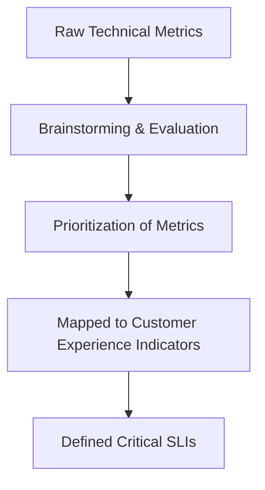
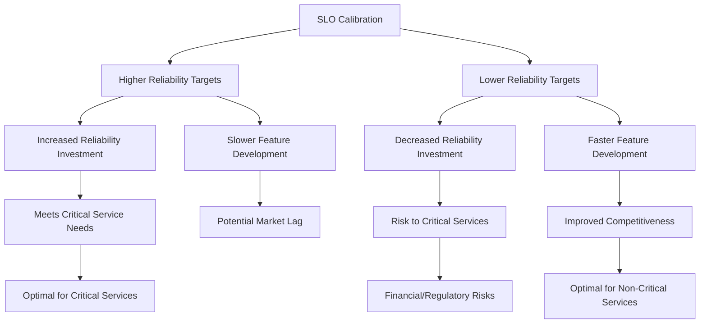
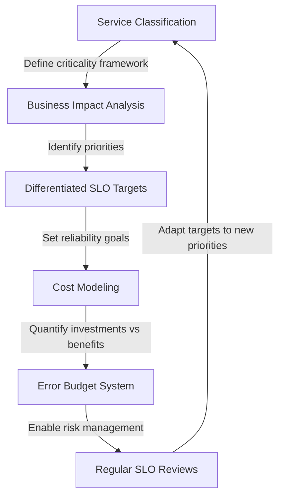
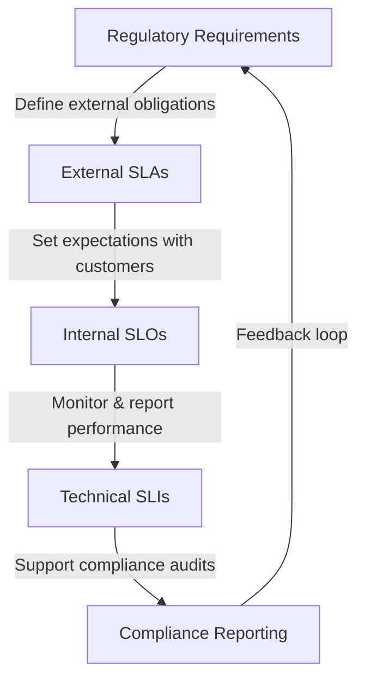
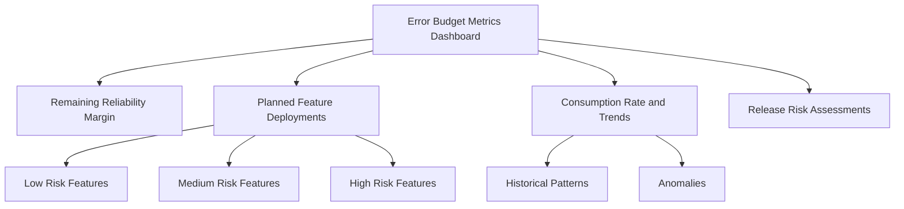
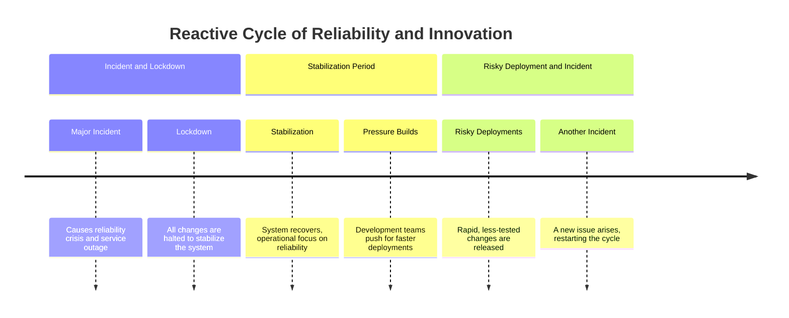
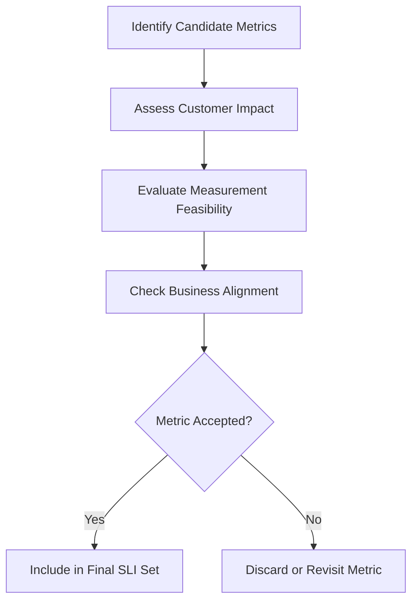
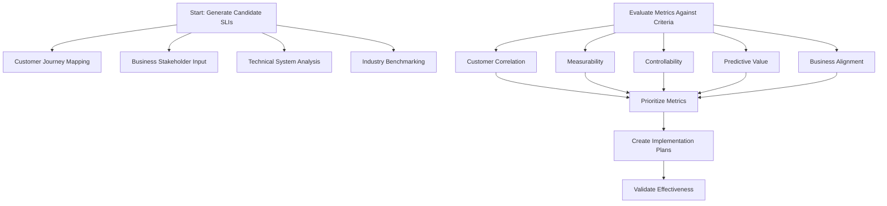
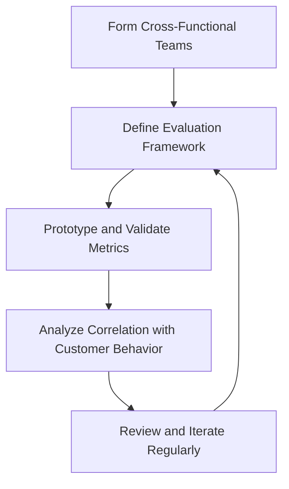
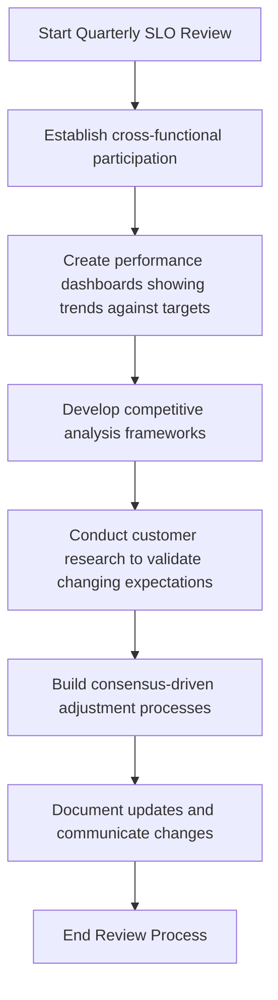

# Chapter 5: Defining Service Quality (SLIs, SLOs, SLAs)

## Chapter Overview: Defining Service Quality (SLIs, SLOs, SLAs)

This chapter defines how we measure, target, and communicate service quality through Service Level Indicators (SLIs), Objectives (SLOs), and Agreements (SLAs). It walks through the journey from raw technical data to metrics that reflect real customer experience, and finally to targets that balance risk, cost, and competitiveness. Set in financial services, it illustrates how misplaced metrics and unrealistic targets create compliance nightmares, customer attrition, and executive confusion. From error budgets to dashboard translation, this chapter turns metric spaghetti into reliability linguine your execs can actually digest.

______________________________________________________________________

## Learning Objectives

By the end of this chapter, readers will be able to:

1. Define SLIs, SLOs, and SLAs and describe how they relate to one another.
2. Design SLIs that reflect actual customer experience, not just system status.
3. Set differentiated SLOs based on service criticality and business impact.
4. Integrate technical SLOs with regulatory requirements and SLAs.
5. Use error budgets to manage trade-offs between reliability and innovation.
6. Build rigorous SLI evaluation frameworks to avoid vanity metrics.
7. Translate technical metrics into business terms for executive decision-making.

______________________________________________________________________

## Key Takeaways

- **Not All Metrics Matter**: Just because it’s measurable doesn’t mean it’s meaningful. Pick SLIs that reflect what customers actually care about.
- **Five Nines Is Not a Religion**: You’re not being holy, you’re being expensive. Calibrate SLOs based on business value, not superstition.
- **Compliance Doesn’t Care About Your Dashboards**: If your metrics don’t align with regulatory definitions, you’re not compliant, you’re just optimistic.
- **Error Budgets Aren’t Just Math, They’re Therapy**: They give your dev and ops teams a shared reality where trade-offs can happen without crying.
- **Vanity Metrics Are the Worst Kind of Self-Care**: Pretty graphs that don’t reflect customer pain are just digital lies we tell ourselves.
- **SLOs Are Not Set-and-Forget**: Review them regularly or risk clinging to outdated targets while the market laps you.
- **If the Execs Don’t Get It, You Didn’t Finish**: Technical metrics must become business language. Otherwise, you’re not communicating—you’re flexing.

> Congratulations, you're now slightly less likely to ruin your SLAs with good intentions and bad telemetry.

______________________________________________________________________

## Panel 1: What Really Matters?

### Scene Description

The team gathers in a collaborative brainstorming session to define critical service metrics for the ATM network. The discussion focuses on transforming raw technical measurements, such as transaction latency and error rates, into meaningful customer experience indicators like withdrawal success rates and transaction completion time.

The visual representation captures the journey on a whiteboard: starting with raw metrics listed on one side, progressing through iterative team evaluations, and culminating in refined customer-focused indicators. Below is a flowchart representation of the process:



Team members debate and refine each step, ensuring the selected indicators align both with customer expectations and the bank's business goals. The dynamic process highlights the importance of collaboration in bridging the gap between technical performance and user satisfaction.

### Teaching Narrative

Service Level Indicators (SLIs) form the foundation of reliability measurement by defining what aspects of service performance actually matter to users. Effective SLIs transform raw technical metrics into meaningful measurements that directly correlate with customer satisfaction and business outcomes. For banking services, well-designed SLIs bridge the gap between technical capabilities and customer expectations, creating a shared definition of quality that aligns engineering efforts with business priorities.

### Common Example of the Problem

A bank's ATM operations team tracks dozens of technical metrics for their network: server uptime, network connectivity, hardware status flags, and software version compliance. Despite "green" dashboards showing 99.8% component availability, customer complaints about ATM issues continue to increase. The disconnect exists because current metrics focus on technical components rather than customer outcomes.

An ATM can be technically "available" (powered on, connected, software running) but functionally useless to customers if it's out of cash, has a jammed card reader, or is processing transactions so slowly that users abandon their attempts. Without customer-focused SLIs, the team optimizes for technical metrics that don't align with actual user experience.

| **Metric Type** | **Example Metric** | **What It Measures** | **Potential Gap** |
| ------------------------ | ------------------------------------ | ----------------------------------------- | ------------------------------------------------------------------------------- |
| **Technical Metric** | Server uptime (e.g., 99.8%) | Availability of the ATM's backend systems | Doesn't account for whether customers can successfully complete transactions. |
| **Technical Metric** | Network connectivity (e.g., 99%) | ATM's ability to communicate with servers | Ignores issues like cash availability or hardware malfunctions affecting users. |
| **Customer-Focused SLI** | Transaction success rate (e.g., 95%) | Percentage of successful ATM transactions | Directly reflects whether customers can use the ATM as intended. |
| **Customer-Focused SLI** | Cash availability (e.g., 99%) | Availability of cash for withdrawals | Ensures the ATM meets a key customer expectation: dispensing cash. |

By comparing these metrics, it becomes clear how focusing on technical measurements alone can lead to a false sense of reliability. Customer-focused SLIs ensure the metrics reflect what truly matters to users, bridging the gap between technical performance and customer experience.

### SRE Best Practice: Evidence-Based Investigation

Implement customer-centric SLI development methodology by following this actionable checklist:

**Checklist for Customer-Centric SLI Development**

1. **Map the Customer Journey**

   - Identify key customer touchpoints and critical outcomes along the journey.

2. **Define "Good Service" from the Customer's Perspective**

   - Understand what success looks like to the customer for each touchpoint.

3. **Identify Measurable Indicators**

   - Select metrics that directly reflect customer outcomes, ensuring they are quantifiable.

4. **Develop Composite SLIs**

   - Combine multiple technical metrics to create SLIs that represent holistic service performance:
     - **Transaction Success Rate SLI**: % of initiated transactions successfully completed.
     - **Cash Availability SLI**: % of time appropriate cash denominations are available.
     - **Time-to-Completion SLI**: Duration from card insert to transaction completion.
     - **Device Functionality SLI**: % of components functioning correctly.

5. **Validate SLIs Against Customer Satisfaction Data**

   - Regularly correlate SLIs with customer feedback and satisfaction metrics to ensure they align with real-world experience.

**Key Insight:**\
Customer-focused analysis revealed that while component availability was 99.8%, actual transaction success rate (the true customer experience) was only 92.3%. This highlights the importance of measuring what matters to the customer, not just what is convenient to monitor technically.

Use this checklist as a guide to create SLIs that bridge the gap between technical metrics and customer expectations, resulting in meaningful and actionable insights.

### Banking Impact

For ATM networks, SLI alignment is akin to optimizing a car for passenger comfort versus engine performance. Imagine focusing solely on the engine's horsepower while ignoring how smooth the ride feels for passengers. Similarly, misaligned SLIs in banking can result in substantial resources being spent on improving technical metrics that fail to enhance customer experience. This disconnect forces customers to abandon self-service options like ATMs and rely on more expensive service channels, such as branches and call centers, driving up operational costs and frustrating users.

By designing SLIs that prioritize what truly matters to customers—such as transaction success rates and ATM availability—banks can ensure their "ride" is smooth. Well-aligned SLIs enable targeted investments that enhance customer outcomes, simultaneously optimizing both the user experience and the cost structure.

### Implementation Guidance

1. Create cross-functional teams including technical, operations, and customer experience staff to define SLIs
2. Develop comprehensive ATM customer journey maps including all transaction types
3. Implement instrumentation that captures the complete customer transaction experience
4. Build dashboards that prominently display customer-focused SLIs alongside technical metrics
5. Establish regular reviews correlating SLI performance with customer feedback and behavior data

## Panel 2: The Impossible Promise

### Scene Description

An SRE engages with the product team to negotiate realistic objectives for payment systems, focusing on the trade-offs between reliability and innovation. A graph is central to the discussion, plotting reliability percentage on the Y-axis against cost and innovation impact on the X-axis. The "five nines" reliability target (99.999%) is prominently marked on the graph, serving as a point of contention and discussion.

Below is a text-based representation of the graph to enhance understanding of the trade-offs:

```
Reliability (%)
100 |                                *
     |                              *
  99 |                            *
     |                          *
  98 |                        *
     |                     *
  97 |                  *
     |            *
  96 |       *
     | *____________________________________ Cost/Innovation Impact
       Low                                       High
```

This visual highlights the steep cost and innovation impact required to achieve near-perfect reliability, prompting the team to evaluate if the "five nines" target is both practical and aligned with business priorities. The scene showcases the tension between technical feasibility and business objectives, fostering an informed discussion on setting achievable Service Level Objectives (SLOs).

### Teaching Narrative

Service Level Objectives (SLOs) establish target values for SLIs, creating quantitative reliability goals based on business requirements and technical capabilities. Unlike aspirational targets, effective SLOs balance customer expectations against implementation costs and innovation needs. For payment systems, appropriate SLO metrics enable teams to make informed trade-offs between reliability and feature velocity, establishing different objectives for different service types based on their criticality and business impact.

### Common Example of the Problem

A bank's payment services product team demands "five nines" reliability (99.999% availability, or just 5 minutes of downtime per year) for all payment-related services. This uniform requirement fails to distinguish between truly critical services (settlement systems, card authorization) and less critical ones (payment history lookup, rewards calculations). The engineering team explains that achieving five nines for all services would require massive infrastructure investment and severely limit development velocity for new features. Without data-driven SLOs based on actual business impact, the conversation remains deadlocked in subjective arguments about what's "good enough" versus what's "necessary" for different payment services.

To clarify the trade-offs, the following table compares reliability requirements, downtime tolerances, and business impacts for various services:

| Service Type | Reliability Target | Downtime Tolerance | Business Impact of Downtime |
| ---------------------- | -------------------- | -------------------- | ---------------------------------------------------- |
| Settlement Systems | 99.999% (Five Nines) | ~5 minutes per year | Delays in fund transfers, potential regulatory fines |
| Card Authorization | 99.99% (Four Nines) | ~52 minutes per year | Customer frustration, potential loss of transactions |
| Payment History Lookup | 99.9% (Three Nines) | ~8.76 hours per year | Minor inconvenience for users, low criticality |
| Rewards Calculations | 99.9% (Three Nines) | ~8.76 hours per year | Limited impact, delays in non-critical features |

This structured comparison highlights that not all services warrant the same level of reliability, allowing teams to prioritize resources effectively. For example, settlement systems are mission-critical, justifying the high cost of achieving "five nines," while services like payment history lookup can tolerate more downtime without significantly harming user experience or business performance.

### SRE Best Practice: Evidence-Based Investigation

Implement a differentiated SLO framework based on service criticality. Follow this checklist to guide your approach:

#### Checklist: Implementing a Differentiated SLO Framework

1. **Develop Service Criticality Classification Methodology:**

   - Identify and categorize services into tiers:
     - **Tier 1:** Critical financial functions (e.g., settlement, core authorization)
     - **Tier 2:** Important customer services (e.g., payment processing, transfers)
     - **Tier 3:** Supporting information services (e.g., history, reporting, analytics)
   - Use business impact analysis to drive classification decisions.

2. **Define Reliability Targets for Each Tier:**

   - Assess the **business impact** of failures (e.g., financial loss, reputation damage).
   - Align with **customer expectations** for each service type.
   - Evaluate **technical feasibility** and **implementation costs**.
   - Benchmark against **competitors** and industry standards.

3. **Model Reliability Cost Curves:**

   - Create economic models to visualize the relationship between reliability levels and associated costs for each service tier.

4. **Establish SLOs for Service Aspects:**

   - Define separate SLOs for critical attributes such as latency, availability, and error rates within the same service to reflect varying customer priorities.

5. **Implement an Error Budget Framework:**

   - Use error budgets to manage trade-offs between reliability and innovation.
   - Monitor error budget consumption to inform decision-making and avoid overengineering.

6. **Communicate and Iterate:**

   - Regularly review and update SLOs based on real-world performance data and evolving business priorities.
   - Share findings and decisions with stakeholders to maintain alignment.

#### Example: Applying the Framework to Payment Systems

- For **Tier 1** services such as settlement, aim for "five nines" reliability (e.g., 99.999%) due to high financial impact of downtime.
- For **Tier 2** services like payment processing, target 99.95% reliability to balance customer satisfaction with manageable costs.
- For **Tier 3** services like payment history, 99.9% reliability (allowing up to 8.7 hours of downtime annually) is sufficient to meet customer expectations at a fraction of the cost.

By following this evidence-based approach, teams can ensure that reliability goals are both realistic and aligned with the business value of each service.

### Banking Impact

For payment systems, appropriate SLO calibration directly impacts both reliability investment and feature development velocity. Excessive reliability requirements for non-critical services create unnecessary engineering costs, slower innovation cycles, and reduced competitiveness in rapidly evolving payment markets. Conversely, insufficient reliability for truly critical services creates unacceptable financial and regulatory risks.

Finding the appropriate balance through data-driven SLOs ensures optimal resource allocation based on actual business value rather than subjective assessment or uniform standards. The cause-and-effect relationship between SLO calibration, reliability investment, and feature velocity can be visualized as follows:



This diagram illustrates how adjusting SLOs influences resource allocation and trade-offs, helping teams prioritize reliability or innovation based on the criticality and business impact of their services.

### Implementation Guidance

#### Workflow for Creating and Maintaining SLOs



1. **Create Service Criticality Framework**\
   Define clear classification criteria to categorize services based on their importance to the business and customers.

2. **Develop Differentiated SLO Targets**\
   Use business impact analysis to create tailored SLOs that align with the criticality of each service and its role in achieving business goals.

3. **Implement Cost Modeling**\
   Quantify the trade-offs between reliability investments and their benefits to ensure resource allocation is justified and effective.

4. **Build Error Budget Systems**\
   Establish mechanisms that allow teams to manage risks and make informed decisions about reliability versus innovation.

5. **Establish Regular SLO Reviews**\
   Conduct periodic reviews to update SLO targets in response to evolving business priorities, customer needs, and system capabilities.

## Panel 3: The Regulatory Review

### Scene Description

Meeting with the compliance team to discuss service guarantees. A hierarchy diagram is presented, illustrating how internal SLOs support external SLAs and regulatory requirements. This visual representation demonstrates how technical measurements align with compliance obligations through a structured framework, ensuring cohesive and effective service-level management.



The diagram highlights the hierarchical relationship:

- **Regulatory Requirements** form the foundation, defining external obligations that drive service expectations.
- **External SLAs** translate these obligations into measurable customer-facing guarantees.
- **Internal SLOs** operationalize these SLAs, ensuring alignment with technical and business goals.
- **Technical SLIs** provide the granular metrics needed to track performance and support compliance.
- A **feedback loop** ensures continuous improvement, with insights from compliance reporting feeding back into regulatory review processes.

### Teaching Narrative

Banking SLIs and SLOs exist within a complex regulatory framework that imposes external requirements on measurement, reporting, and performance. Much like a well-coordinated orchestra, where each musician must follow their individual sheet music while harmonizing with the broader ensemble, effective service level metrics must align technical and regulatory requirements to create a unified system. Each "instrument" in this orchestra—whether it’s an internal SLO or a regulatory mandate—has its role to play, contributing to the overall "performance" of compliance and operational excellence.

When these components are properly synchronized, the result is a cohesive measurement system that satisfies multiple stakeholders. However, when one section plays out of tune—such as disconnected or siloed metrics—the entire system risks falling into discord, leading to confusion and potential compliance gaps during service degradation events. By integrating these elements thoughtfully, teams can ensure their metrics not only meet regulatory obligations but also drive organizational harmony and resilience.

### Common Example of the Problem

A bank implements SLOs based solely on engineering considerations without incorporating regulatory requirements. When a service degradation occurs in the funds transfer system, confusion erupts: while the engineering team considers the incident within acceptable SLO limits (98.7% success vs. 98.5% target), compliance officers point out the event has crossed regulatory thresholds requiring formal notification to financial authorities. The teams are using entirely different measurement systems: engineering using technical SLOs focusing on API availability, compliance using regulation-defined metrics based on transaction completion rates with different measurement windows. This disconnect creates a dangerous compliance gap where reportable events may go unnotified despite SLO monitoring.

| **Aspect** | **Engineering SLOs** | **Regulatory Metrics** |
| --------------------------- | --------------------------------------- | -------------------------------------------------------- |
| **Focus** | API availability | Transaction completion rates |
| **Measurement Window** | Rolling 30-day average | Fixed calendar periods (e.g., daily, quarterly) |
| **Threshold Example** | 98.5% success rate | 99.0% completion rate |
| **Stakeholders** | Engineering teams | Compliance officers, financial authorities |
| **Primary Objective** | Optimize system performance | Ensure regulatory compliance and reporting |
| **Response to Degradation** | Debug technical issues; maintain uptime | Formal notification to regulators if thresholds breached |

This table highlights the fundamental differences between the two measurement systems. While engineering SLOs are designed to optimize and monitor technical performance, regulatory metrics are focused on ensuring compliance and protecting consumer interests. Without aligning these systems, significant gaps in compliance may arise, leading to potential penalties or reputational harm during service degradation events.

### SRE Best Practice: Evidence-Based Investigation

Implement an integrated service level framework that aligns technical and regulatory metrics by following these steps:

#### Checklist for Implementing an Integrated Service Level Framework:

1. **Map Regulatory Requirements to Technical Metrics**:

   - Identify key regulatory definitions, such as:
     - Availability requirements (e.g., successful transaction completion within time limits)
     - Processing time thresholds for specific transaction types
     - Reporting mandates for service disruptions
     - Documentation standards for performance monitoring
   - Translate these requirements into measurable technical metrics.

2. **Design a Hierarchical Metric Structure**:

   - Define foundational technical metrics to support high-level measurements.
   - Create service-level indicators (SLIs) that align with regulatory definitions.
   - Develop composite metrics tailored to compliance reporting needs.

3. **Align Measurement Thresholds**:

   - Ensure internal service level objectives (SLOs) are stricter than regulatory thresholds to provide a safety margin.
   - Validate that all technical metrics reinforce compliance obligations.

4. **Implement Unified Monitoring Systems**:

   - Consolidate monitoring tools to serve both operational and regulatory needs.
   - Integrate dashboards and alerts for real-time tracking of compliance and operational performance.

5. **Establish Joint Review Practices**:

   - Schedule regular reviews with engineering and compliance stakeholders.
   - Use these sessions to address metric gaps, refine definitions, and ensure alignment.

#### Example of Definitional Gap:

Integrated analysis often reveals critical differences in metric definitions. For example:

- **Engineering Definition of Availability**: API responsiveness or uptime.
- **Regulatory Definition of Availability**: Successful transaction completion within specified time limits.

Without a unified framework, these metrics cannot be directly compared or reconciled, leading to potential compliance risks during service degradation events.

By adhering to this checklist, teams can implement a robust, evidence-based investigation process that not only aligns with regulatory requirements but also optimizes operational performance.

### Banking Impact

Misalignment between technical and regulatory metrics creates significant compliance risk beyond the immediate operational impact. When metrics don't properly reflect regulatory definitions, services might violate reporting requirements without triggering appropriate alerts, creating liability for notification failures and potential regulatory penalties. These compliance gaps can lead to formal findings during examinations, heightened scrutiny, and even restrictions on new product launches until controls are strengthened.

The following flow illustrates the cascading impact of misaligned metrics:

```
Misaligned Metrics
      ↓
Regulatory Definitions Not Met
      ↓
Failure to Trigger Alerts
      ↓
Missed Reporting Requirements
      ↓
Compliance Gaps
      ↓
Regulatory Penalties & Findings
      ↓
Heightened Scrutiny and Operational Restrictions
```

Integrated metrics ensure operations teams understand the compliance implications of technical performance and respond appropriately to potential regulatory issues. By aligning technical measurements with regulatory requirements, organizations can avoid these cascading risks and maintain a strong compliance posture.

### Implementation Guidance

1. Develop comprehensive mapping of regulatory requirements to technical metrics
2. Create integrated dashboards showing both technical and compliance perspectives
3. Implement threshold monitoring with buffers ensuring internal alerts trigger before regulatory thresholds
4. Build automated notification systems for approaching compliance boundaries
5. Establish regular joint reviews between engineering, operations, and compliance teams

## Panel 4: The Error Budget Conversation

### Scene Description

Development and operations teams are gathered around an error budget metrics dashboard, which serves as the focal point for their discussion. The dashboard is divided into key sections:

- **Remaining Reliability Margin**: A progress bar indicating the percentage of the error budget consumed versus what remains.
- **Planned Feature Deployments**: A timeline of upcoming releases with risk levels categorized (e.g., low, medium, high).
- **Consumption Rate and Trends**: A line graph illustrating the historical consumption of the error budget over time, helping to identify patterns or anomalies.
- **Release Risk Assessments**: A summary table that evaluates recent and upcoming deployments for potential reliability risks.

Below is a simplified example of how the dashboard might be structured:



The visual displays provide a comprehensive view of the service's reliability and release readiness, enabling the team to make data-driven decisions. For example, the team can use the trends graph to forecast whether upcoming deployments might exceed the error budget and adjust plans accordingly. This collaborative review fosters alignment between development and operations, ensuring that reliability and innovation remain balanced.

### Teaching Narrative

Error budget metrics transform reliability from a binary "always available" goal to a quantitative framework that enables calculated risk-taking. By defining how much unreliability is acceptable over time, these metrics create a shared currency between development and operations teams for balancing reliability and innovation. For banking services, error budget metrics enable data-driven decisions about deployment risk, feature prioritization, and technical debt reduction based on actual service performance against objectives.

### Common Example of the Problem

A bank's mobile application team faces constant tension between feature development and reliability concerns. Without objective data, these conversations follow predictable patterns: operations teams resist changes citing stability concerns, while development teams push for rapid deployment citing competitive pressure. The result is a reactive cycle where decisions are driven by recent incidents or organizational politics rather than objective measurement. This cycle can be visualized as follows:



This repetitive pattern creates both innovation droughts during lockout periods and reliability crises during risky deployment phases. Major incidents often trigger risk-averse lockdowns where all changes are halted, regardless of importance. Conversely, during stable periods, pressure to deliver features leads to increasingly aggressive and risky deployments. Without an objective framework, this reactive cycle perpetuates inefficiency, undermining both reliability and innovation.

### SRE Best Practice: Evidence-Based Investigation

Implement a comprehensive error budget framework based on SLO metrics. Use the following checklist to ensure a structured, actionable approach:

#### Checklist for Evidence-Based Error Budget Investigation

| Step | Actions | Output/Goal |
| --------------------------------------------------------------- | ----------------------------------------------------------------------------------------- | ----------------------------------------------------- |
| **1. Establish Error Budget Calculation Methodology** | | |
| - Define measurement windows | Specify rolling time periods (e.g., 30 days). | Clear time boundaries for monitoring. |
| - Calculate allowed "unreliability" | Derive allowable downtime or error rate based on SLO targets. | Quantified error budget. |
| - Track actual reliability performance | Continuously measure actual service performance against SLOs. | Accurate tracking of reliability metrics. |
| - Compute remaining budget | Compare consumed error budget to allowances based on usage patterns. | Real-time visibility into budget status. |
| **2. Create Graduated Response Protocols** | | |
| - Normal operations | Maintain standard operating procedures when substantial budget remains. | Stable processes with room for deployment. |
| - Increased scrutiny | Apply higher levels of monitoring and risk assessment as the budget depletes. | Proactive identification of potential issues. |
| - Change freezes | Enforce change freezes for critical services when the budget is exhausted. | Prevent further budget depletion. |
| **3. Implement Budget Allocation for Planned Changes** | | |
| - Allocate budget for changes | Reserve portions of the budget for specific planned feature deployments or updates. | Controlled deployment aligned with reliability goals. |
| **4. Develop Forecasting Models** | | |
| - Analyze consumption trends | Use historical patterns to predict future error budget usage. | Data-driven forecasting for proactive planning. |
| **5. Build Risk Assessment Framework for Deployment Decisions** | | |
| - Assess deployment risk | Evaluate changes based on remaining error budget, feature priority, and potential impact. | Informed, risk-aware deployment decisions. |

#### Example Application of Error Budget Analysis

Error budget analysis transforms subjective discussions into data-driven decisions. For example:

- **Current Status**: 72% of the monthly error budget remains.
- **Action Plan**: Proceed with planned feature deployments while monitoring consumption trends.
- **Forecast**: If consumption accelerates to projected levels, defer lower-priority changes and prioritize reliability improvements.

This structured approach ensures reliability and innovation are balanced using quantifiable, evidence-based methods.

### Banking Impact

For mobile banking platforms, error budget metrics directly impact both reliability management and competitive positioning. Objective measurement enables appropriate risk-taking that balances innovation needs against reliability requirements, ensuring consistent customer experience while enabling necessary feature development. This data-driven approach prevents both over-conservative postures that block competitive enhancements and excessive risk-taking that creates customer-impacting incidents. The business impact includes improved customer satisfaction through both better reliability and faster feature deployment targeted at actual customer needs.

### Implementation Guidance

1. **Implement error budget calculations**\
   Begin by defining Service Level Objectives (SLOs) for your services, aligning them with business and user expectations. Use these SLOs to calculate your error budget, which quantifies the allowable margin for unreliability during a given period.

2. **Create visualization dashboards**\
   Develop dashboards to provide a clear, real-time view of error budget status and consumption patterns. Below is an example of a logical dashboard layout:

   ```
   +-------------------------------------------+
   | Error Budget Dashboard                    |
   +-------------------------------------------+
   | Service Name: Banking API                 |
   | ----------------------------------------- |
   | SLO Target: 99.9%                         |
   | Remaining Error Budget: 85%               |
   | Consumption Rate: 5% per week             |
   | ----------------------------------------- |
   | Budget Status: Healthy                    |
   | ----------------------------------------- |
   | Past Week Incidents:                      |
   | - Outage A: 2 hours                       |
   | - Latency Spike B: 30 minutes             |
   | ----------------------------------------- |
   | Forecasted Budget Depletion: 6 weeks      |
   +-------------------------------------------+
   ```

3. **Develop risk assessment framework**\
   Design a framework for evaluating deployment risks based on the current error budget. For example:

   ```
   Deployment Risk Assessment Workflow:
   [Check Budget Status] -->[Budget Healthy?]--Yes-->[Approve Deployment]
                               |
                               No
                               |
                            [High Risk]
   ```

   This ensures that decision-making is consistent and aligned with budget status.

4. **Build forecasting models**\
   Use historical data and consumption trends to project future error budget depletion. For instance, if the consumption rate is increasing due to frequent incidents, adjust release schedules or allocate resources to improve reliability.

5. **Establish clear protocols**\
   Define actionable steps for different budget statuses. Example states:

   - **Healthy (Above 50%)**: Proceed with planned deployments.
   - **Warning (20%-50%)**: Limit high-risk changes; increase monitoring.
   - **Critical (Below 20%)**: Freeze deployments; prioritize reliability improvements.

   These protocols ensure alignment across teams and promote proactive management of the error budget.

## Panel 5: The SLI Workshop

### Scene Description

The scene depicts a cross-functional team collaboratively evaluating potential SLIs for a new wealth management platform using a critical assessment framework. The process is structured and systematic, ensuring candidate metrics are assessed against three key criteria: customer impact, measurement feasibility, and business alignment.

Below is a representation of the evaluation process:



This diagram illustrates the step-by-step approach, emphasizing how each metric is rigorously evaluated to ensure alignment with both customer and business needs. The visual reinforces the importance of a structured methodology in selecting meaningful SLIs.

### Teaching Narrative

Selecting effective SLI metrics requires rigorous evaluation against specific criteria: direct correlation with customer experience, technical feasibility of measurement, team control over performance, and predictive value for problems. This systematic assessment approach ensures that chosen metrics genuinely reflect service quality from the customer perspective. For wealth management platforms, comprehensive SLI evaluation prevents tracking vanity metrics that look good on dashboards but don't actually reflect customer satisfaction or business success.

### Common Example of the Problem

A bank's wealth management division launches a new digital platform with dozens of performance metrics selected primarily based on what's easy to measure: page load times, API response rates, database query performance, and infrastructure utilization. Six months after launch, executive leadership questions the value of the expensive monitoring system, noting that it failed to predict or explain numerous customer complaints about platform usability and reliability. The disconnect occurred because metric selection focused on technical convenience rather than customer experience, creating an expensive monitoring system that measures the wrong things—a classic case of "vanity metrics" that look good on dashboards but don't reflect actual service quality.

#### Comparing Vanity Metrics vs. Customer-Focused Metrics

| **Metric Type** | **Example Metric** | **Focus** | **Limitations** | **Alternative Customer-Focused Metric** | **Why It’s Better** |
| --------------- | -------------------------- | -------------------------------- | ----------------------------------------------------------------------- | --------------------------------------- | --------------------------------------------------------------------------------------------- |
| Vanity Metric | Page Load Time | Technical performance | Doesn’t account for customer perception of usability or task completion | Task Success Rate | Reflects whether customers can complete critical actions (e.g., submitting investment orders) |
| Vanity Metric | API Response Rate | Backend system responsiveness | Ignores end-to-end user experience, including frontend latency | End-to-End Transaction Time | Measures the complete user experience from request initiation to completion |
| Vanity Metric | Database Query Performance | Backend performance optimization | Isolated metric; doesn’t correlate with user satisfaction | Error-Free Transactions Ratio | Focuses on the proportion of successful, error-free customer interactions |
| Vanity Metric | Infrastructure Utilization | Hardware resource usage | Operational focus; doesn’t reflect customer impact | Customer Complaint Volume | Captures real feedback on usability and reliability |

This comparison highlights the gap between metrics that are easy to measure and those that truly reflect customer experience. By prioritizing customer-focused metrics, teams can align monitoring efforts with actual service quality, enabling proactive identification of issues and improved customer satisfaction.

### SRE Best Practice: Evidence-Based Investigation

Implement structured SLI selection methodology using the following step-by-step approach:

#### Checklist for Effective SLI Selection

1. **Generate Candidate SLIs**:

   - Perform customer journey mapping to identify critical interactions.
   - Gather input from business stakeholders on value-defining characteristics.
   - Conduct technical analysis of system components and dependencies.
   - Benchmark against industry-standard measurements.

2. **Evaluate Each Candidate Metric**:

   - **Customer Correlation**: Does it directly reflect user experience?
   - **Measurability**: Can it be captured accurately with available tools?
   - **Controllability**: Is performance within the team's ability to influence?
   - **Predictive Value**: Does it provide early warning of potential issues?
   - **Business Alignment**: Does it connect to organizational goals?

3. **Prioritize Metrics**:

   - Focus on metrics that meet all essential criteria.
   - Avoid vanity metrics that lack actionable insights.

4. **Plan and Validate**:

   - Develop implementation plans for selected SLIs.
   - Establish validation processes to ensure ongoing effectiveness.

#### Step-by-Step Diagram



#### Example Insight

Structured evaluation reveals that while page load time partially reflects customer experience, a composite "time to investment" metric measuring the complete transaction flow from selection to confirmation shows much stronger correlation with customer satisfaction and platform usage.

### Banking Impact

For wealth management platforms, SLI selection directly impacts both customer satisfaction and investment performance. Poorly chosen metrics may show "green" dashboards while customers struggle with critical tasks like portfolio rebalancing, tax-loss harvesting, or investment execution—potentially affecting investment returns and advisor recommendations. The financial implications extend beyond platform usage to actual investment outcomes, with substantial revenue impact from both management fees and customer retention.

#### Case Study: Misaligned SLIs in a Banking Platform

A major banking platform once tracked "average page load time" as a primary SLI for its wealth management service. While this metric consistently appeared healthy, customer complaints about slow transaction processing and failed portfolio rebalancing grew significantly. Upon investigation, the team discovered that the real issue was with backend transaction queuing during peak trading hours—something the "average page load time" metric failed to capture.

This misalignment led to delayed trades, missed tax-loss harvesting opportunities, and poor advisor recommendations, resulting in frustrated customers and churn among high-net-worth clients. The platform faced a measurable drop in management fees and a 12% decline in customer retention over the next quarter.

By realigning their SLIs to include "transaction processing latency" and "trade execution success rate," the engineering and product teams were able to prioritize improvements that directly addressed customer pain points. Within six months, customer complaints decreased by 40%, and the platform saw a recovery in both revenue and customer satisfaction.

#### Key Takeaway

This example highlights the critical importance of selecting SLIs that effectively reflect the true customer experience. Appropriate SLIs ensure the monitoring system focuses engineering efforts on improvements that genuinely enhance customer experience and financial outcomes, avoiding the pitfalls of tracking vanity metrics that mask underlying issues.

### Implementation Guidance

To ensure a structured and effective approach to SLI implementation, follow the steps outlined below. The process is illustrated in the accompanying flowchart for clarity:

#### Steps for SLI Implementation

1. **Form Cross-Functional Teams**\
   Assemble a team with representatives from technical, business, and customer experience domains to ensure diverse perspectives.

2. **Define Evaluation Framework**\
   Develop a framework with weighted criteria, such as:

   - Customer impact
   - Measurement feasibility
   - Team control
   - Predictive value for problems

3. **Prototype and Validate Metrics**\
   Conduct prototype measurements to test the feasibility and relevance of selected metrics.

4. **Analyze Correlation with Customer Behavior**\
   Use data analysis to establish a strong relationship between potential SLIs and actual customer behavior or satisfaction.

5. **Review and Iterate Regularly**\
   Schedule periodic reviews to assess SLI effectiveness using real customer feedback and refine as necessary.

#### Flowchart: SLI Implementation Process



## Panel 6: The SLO Review

### Scene Description

The quarterly service review meeting focuses on analyzing performance metrics trends across critical banking services and proposing adaptation recommendations. Visual aids are employed to enhance understanding, including charts that compare historical performance against objectives. These visuals highlight seasonal patterns and shifting customer expectations, providing a clear picture of how reliability targets are being met.

Below is a sample representation of a performance trends chart using a text-based structure:

```
Performance Metrics Over Time (Sample Data)
+----------------+----------------+----------------+-------------------+
| Time Period    | SLO Objective | Actual Perf.   | Seasonal Impact   |
+----------------+----------------+----------------+-------------------+
| Q1             | 99.9%         | 99.85%         | High traffic due  |
|                |                |                | to tax season     |
+----------------+----------------+----------------+-------------------+
| Q2             | 99.9%         | 99.92%         | Stable operations |
+----------------+----------------+----------------+-------------------+
| Q3             | 99.9%         | 99.87%         | Increased usage   |
|                |                |                | during promotions |
+----------------+----------------+----------------+-------------------+
| Q4             | 99.9%         | 99.90%         | Holiday shopping  |
|                |                |                | spikes            |
+----------------+----------------+----------------+-------------------+
```

This approach provides a structured way to assess whether objectives align with current trends, seasonal variances, and customer expectations, ensuring the review process is both data-driven and actionable.

### Teaching Narrative

SLO metrics require regular review and adaptation based on changing business requirements, customer expectations, and technical capabilities. These review processes examine performance trends, customer feedback, competitive benchmarks, and reliability costs to determine if objectives remain appropriate. For banking services, periodic SLO metric reassessment ensures reliability targets continue to align with business priorities and customer needs as both evolve over time.

### Common Example of the Problem

A bank established SLO targets for its payment services two years ago based on then-current market standards and customer expectations. Since that time, several factors have changed significantly, but the SLO targets have not been updated. This misalignment has created multiple problems, as shown below:

| **Aspect** | **Two Years Ago** | **Current State** |
| ---------------------- | ----------------------------------------- | --------------------------------------------------------------------------- |
| Digital Payment Volume | Moderate traffic | 300% increase in transaction volume |
| Customer Expectations | Transactions completed in seconds | Transactions expected to complete in milliseconds |
| Technical Architecture | On-premises infrastructure | Cloud-based architecture with distributed systems |
| SLO Target Status | Aligned with market standards at the time | Outdated targets causing alert fatigue or misaligned engineering priorities |

#### Impacts of Unchanged SLO Targets:

- **Alert Fatigue**: Outdated targets lead to frequent missed objectives for high-volume services, reducing team responsiveness to alerts.
- **Wasted Effort**: Some services consistently exceed targets, potentially wasting engineering resources that could be better allocated elsewhere.
- **Customer Mismatch**: Evolving customer expectations for faster transaction times are not reflected in the current SLOs, risking customer dissatisfaction.

By failing to reassess SLOs in response to these changes, the bank’s reliability metrics no longer accurately represent service priorities or align with the evolving needs of its customers and technical environment.

### SRE Best Practice: Evidence-Based Investigation

Implement structured SLO review processes that adapt to changing conditions. Use the following checklist to guide your reviews and ensure actionable outcomes:

#### Checklist for Evidence-Based SLO Investigation

1. **Conduct Regular SLO Reviews** (Quarterly/Annually):

   - [ ] Analyze performance trends against current SLO targets.
   - [ ] Assess customer expectations through feedback and market research.
   - [ ] Benchmark against competitors to determine market positioning.
   - [ ] Evaluate technical capabilities, considering recent architecture changes.
   - [ ] Perform a cost-benefit analysis of current reliability investments.

2. **Identify Targets Requiring Adjustment**:

   - [ ] Are any SLOs consistently missed, indicating unrealistic targets?
   - [ ] Are any SLOs easily exceeded, suggesting potential over-engineering?
   - [ ] Are there SLOs misaligned with current business priorities or customer needs?

3. **Implement Controlled Adjustments**:

   - [ ] Adjust SLO targets methodically, ensuring changes are justified and measurable.
   - [ ] Document all adjustments and expected outcomes.

4. **Communicate Changes**:

   - [ ] Share updates with stakeholders, providing clear rationale and supporting data.
   - [ ] Align communication with business priorities and customer-focused narratives.

5. **Monitor Impact of Adjustments**:

   - [ ] Track service behavior post-adjustment to validate changes.
   - [ ] Gather customer and team feedback to assess alignment with expectations.

______________________________________________________________________

#### Example Case Study: Mobile Payment SLO Adjustment

A recent review of mobile payment SLOs revealed significant misalignment:

- **Availability Target**: 99.5% remains appropriate based on usage and feedback.
- **Latency Target**: Current target of 500ms is twice as high as competitor benchmarks and customer expectations, leading to declining satisfaction despite meeting the SLO.

**Action Taken**: The latency target was adjusted to 250ms to reflect competitive and customer standards. Ongoing monitoring will evaluate the impact on satisfaction and reliability costs.

### Banking Impact

For payment services, SLO alignment is like maintaining an up-to-date navigation system for a journey. Outdated SLOs are akin to relying on an old map that no longer reflects current roads—giving a false sense of direction and confidence while failing to account for new routes, detours, or destinations. Similarly, overly stringent SLOs can be compared to insisting on taking the most pristine, well-paved roads exclusively, even when a more balanced route would save time and resources without compromising the journey's success.

In the banking context, outdated targets may create false confidence that services meet requirements when they actually lag behind evolving customer expectations and competitive offerings. Conversely, unnecessarily strict targets may drive excessive reliability investment that could be better allocated to feature development or other priorities. Regular SLO reviews ensure reliability targets reflect current business realities, enabling appropriate resource allocation based on actual customer needs rather than historical standards.

### Implementation Guidance

To ensure a structured approach to the quarterly SLO review process, follow the steps below, illustrated by the flowchart for clarity:



1. **Establish cross-functional participation**\
   Involve stakeholders from product, engineering, operations, and customer experience teams for a holistic review.

2. **Create performance dashboards**\
   Develop clear, visual dashboards to display trends against SLO targets, helping teams identify patterns and areas of concern.

3. **Develop competitive analysis frameworks**\
   Benchmark your reliability metrics against competitors to understand market positioning and identify potential gaps.

4. **Conduct customer research**\
   Gather feedback through surveys, interviews, and behavioral data analysis to ensure SLOs align with evolving customer expectations.

5. **Build consensus-driven adjustment processes**\
   Facilitate discussions to agree on changes, ensuring all stakeholders approve and understand the rationale behind modifications.

6. **Document updates and communicate changes**\
   Clearly record adjustments, reasons for changes, and their anticipated impact. Communicate updates to all relevant teams to ensure alignment.

## Panel 7: The Dashboard Translation

### Scene Description

The SRE team is tasked with creating executive SLO dashboards that effectively translate technical metrics into visualizations emphasizing business impact. This process involves transforming raw technical performance charts into intuitive business-focused indicators that executives can immediately understand and act upon.

To illustrate this transformation, consider the following conceptual flow:

```
+---------------------------+       +-------------------------+       +-------------------------+
| Technical Performance     |       | Mapped to Business      |       | Executive-Friendly      |
| Metrics (e.g., Latency,   | ----> | Outcomes (e.g., Impact  | ----> | Indicators (e.g.,       |
| Error Rates, Availability)|       | on Customer Experience, |       | Customer Satisfaction,  |
|                           |       | Revenue, Compliance)    |       | Revenue Projections)    |
+---------------------------+       +-------------------------+       +-------------------------+
```

This approach ensures that reliability measurements are not only accurate but also contextualized within the priorities and decision-making frameworks of business stakeholders. For example, latency metrics might become visualized as potential revenue loss due to slower customer transactions, enabling executives to make informed decisions quickly.

### Teaching Narrative

Technical SLI/SLO metrics must be translated into business-relevant visualizations to be effective across an organization. This translation process connects reliability measurements to business outcomes, enabling non-technical stakeholders to understand service health in terms relevant to their roles. For banking executives, translated SLO dashboards express reliability in terms of customer satisfaction, regulatory compliance, competitive position, and financial impact rather than technical performance statistics.

### Common Example of the Problem

A bank's technology team presents quarterly reliability metrics to the executive committee using technical language and engineering-focused visualizations: SLI performance trends, error budget consumption charts, and latency percentile graphs. Despite the detailed data, executive leaders struggle to connect these metrics to business priorities or make informed decisions about reliability investments. When forced to choose between funding reliability improvements or new features, executives consistently select new features because their business value is clearly articulated while reliability benefits remain abstract and technical. This systematic underinvestment in reliability eventually leads to major customer-impacting incidents that could have been prevented.

#### Comparison of Metrics: Technical vs. Business-Focused

| **Category** | **Technical Metric** | **Business-Focused Metric** |
| ------------------------ | -------------------------------------- | --------------------------------------------------- |
| **Service Availability** | 99.95% uptime | Percentage of transactions successfully completed |
| **Latency** | P99 latency: 250ms | Average time for customers to complete transactions |
| **Error Budget** | 20% of error budget consumed | Customer complaints related to service disruptions |
| **Incident Impact** | 5 incidents exceeding 30 minutes in Q3 | Lost revenue due to service downtime |

This disconnect between the technical metrics presented and the business-focused metrics desired results in a lack of alignment between engineering priorities and executive decision-making. By failing to frame reliability metrics in terms of customer satisfaction, regulatory compliance, or financial impact, the team inadvertently obscures the real value of reliability improvements.

### SRE Best Practice: Evidence-Based Investigation

Implement a business translation layer for SLI/SLO metrics using the following checklist to ensure actionable and role-specific insights:

| **Step** | **Action** | **Example Output** |
| ------------------------------------------ | --------------------------------------------------------------------- | ---------------------------------------------------------------------------------------------------- |
| **1. Create role-specific visualizations** | Tailor dashboards based on stakeholder roles. | - **Executive View**: Business outcomes, financial impact, competitive position |
| | | - **Business Unit View**: Customer metrics, operational efficiency, satisfaction scores |
| | | - **Regulatory View**: Compliance status, reporting readiness, control effectiveness |
| | | - **Technical View**: Detailed performance data, component analysis, trend examination |
| **2. Develop business impact expressions** | Translate technical reliability metrics into business-relevant terms. | - **Availability**: Revenue protection, customer retention |
| | | - **Latency**: Conversion impact, competitive position |
| | | - **Error Rates**: Customer frustration, support costs |
| **3. Build financial models** | Quantify the financial impact of reliability improvements. | - Example: A 0.5% availability improvement reduces customer attrition by 3.2% ($4.5M annual revenue) |
| **4. Create competitor comparisons** | Visualize service performance relative to industry competitors. | - Example: Latency comparison benchmarks against top 3 competitors |
| **5. Implement scenario analysis** | Show potential business consequences of reliability decisions. | - Example: A 1% drop in availability may result in $2M lost revenue and 5% lower customer retention |

By using this structured approach, SRE teams can demonstrate the clear business value of reliability investments. For instance, translated metrics might reveal that improving mobile availability by 0.5% increases mobile engagement by 8.7% while protecting $4.5M in annual revenue. These insights empower executives to prioritize reliability initiatives with confidence.

### Banking Impact

For executive decision-making, the translation of metrics directly impacts strategic resource allocation and technology investment. When reliability is expressed solely in technical terms, it often loses priority to business-framed initiatives, despite its critical importance to customer experience and operational stability. This misalignment can lead to systematic underinvestment, creating growing technical debt that ultimately results in major incidents with significant business consequences.

Consider a banking case study: A regional bank, eager to stay competitive, prioritized rapid feature development over reliability investments. While the new features attracted customers initially, the infrastructure supporting online transactions became strained due to neglected reliability work. During a peak period, a major outage occurred, leaving customers unable to access their accounts. The fallout included regulatory scrutiny, reputational damage, and a 15% drop in quarterly revenue as customers moved to more stable competitors.

This scenario underscores the importance of translating reliability metrics into business-relevant visualizations. By framing reliability in terms of customer satisfaction, regulatory compliance, and financial risk, executives can better understand its direct impact on business outcomes. Properly translated metrics empower leaders to strike the right balance between innovation and reliability, ensuring decisions are based on actual business value rather than communication gaps.

### Implementation Guidance

Use the following checklist to guide the creation of executive SLO dashboards that effectively translate technical metrics into business-relevant insights:

- [ ] **Define Executive Objectives**

  - Engage with executive stakeholders to identify their key concerns and priorities (e.g., customer satisfaction, financial impact, regulatory compliance).
  - Align dashboard goals with measurable business outcomes.

- [ ] **Map Technical Metrics to Business Impact**

  - Translate technical SLI/SLO metrics into terms that reflect business priorities.
  - Example: Convert "99.9% availability" into "X hours of downtime avoided, preserving $Y in revenue."

- [ ] **Develop Financial Models**

  - Quantify the financial impact of reliability improvements or degradations (e.g., revenue growth, cost savings, or penalties avoided).
  - Collaborate with finance teams to validate assumptions and calculations.

- [ ] **Incorporate Comparative Insights**

  - Include visualizations comparing your organization’s reliability performance against industry benchmarks or competitors.
  - Highlight competitive advantages or areas where improvement is needed.

- [ ] **Enable Scenario Analysis**

  - Create tools or visualizations that model the business consequences of reliability trade-offs (e.g., the impact of scaling back infrastructure investments).
  - Incorporate "what-if" scenarios to aid decision-making.

- [ ] **Establish Governance Practices**

  - Schedule regular cross-functional reviews to discuss SLO performance and business impact.
  - Use translated metrics as a shared language to drive alignment between technical teams and business leaders.
