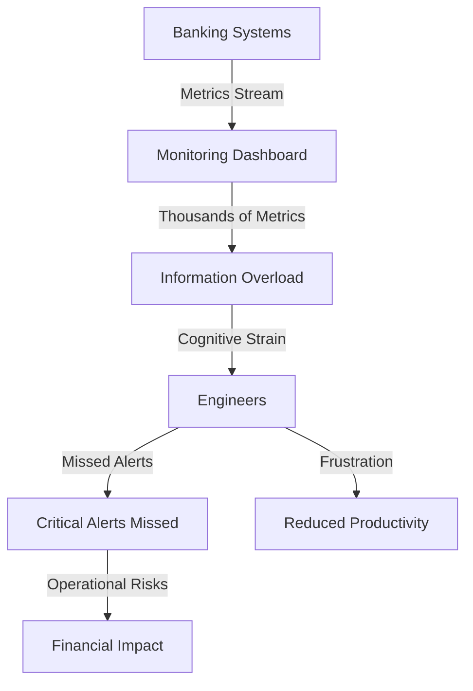
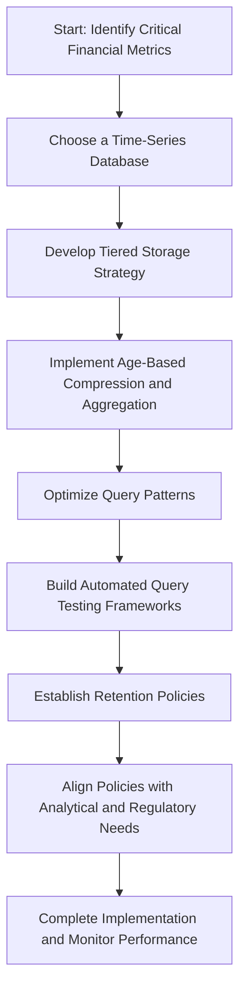
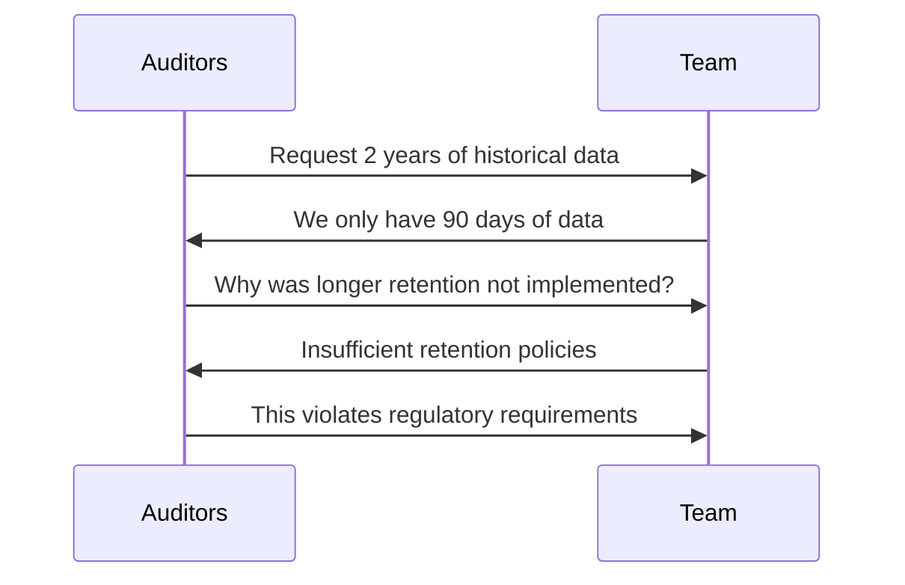
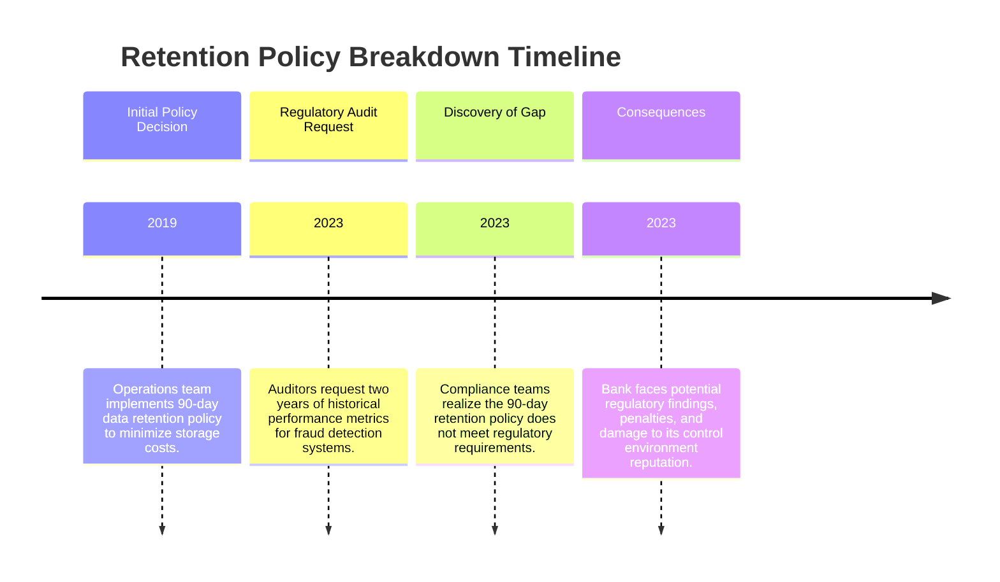
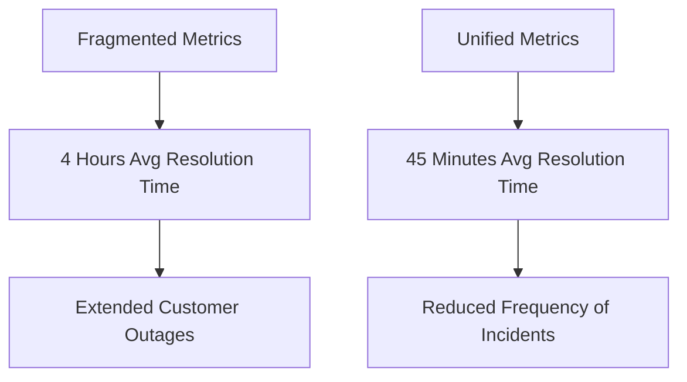
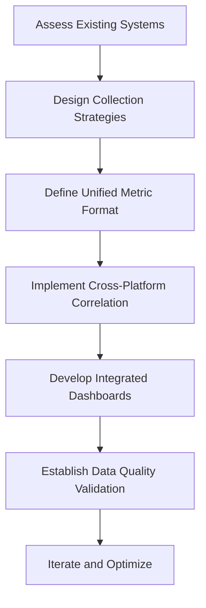
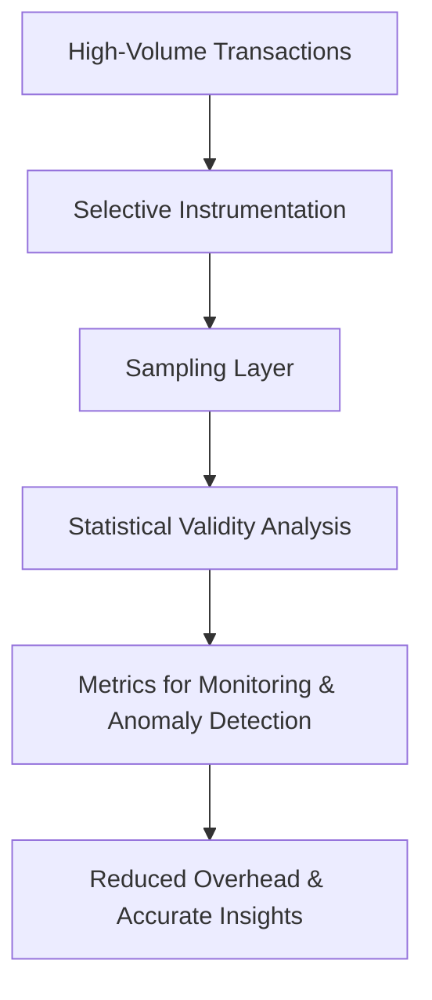
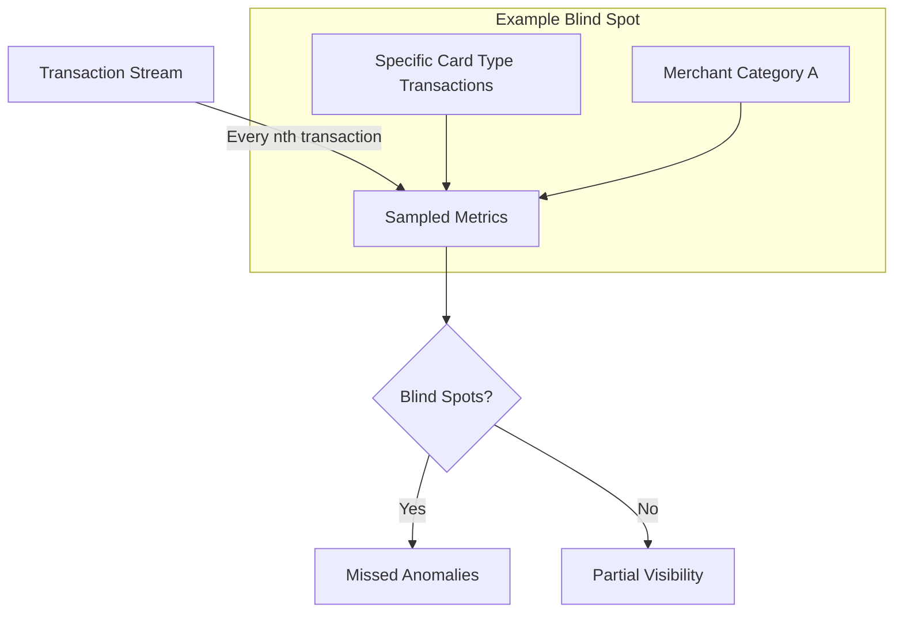
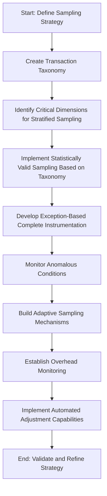
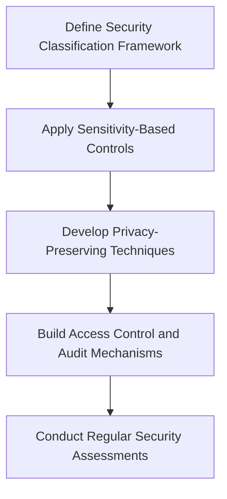

# Chapter 6: Metrics Collection and Storage

## Chapter Overview: Metrics Collection and Storage

This chapter dives into the gritty reality of collecting, storing, and managing metrics in complex, high-stakes environments like banking. Because what good are your precious SLIs and SLOs if they vanish into the void or drown in a flood of cardinality? Covering everything from instrumentation gaps and metric overloads to retention policies, sampling strategies, and security nightmares, this chapter teaches you how to make your metrics useful instead of just expensive. It’s not glamorous work, but it’s the plumbing of observability—and if you mess it up, everything floods.

______________________________________________________________________

## Learning Objectives

By the end of this chapter, readers will be able to:

1. Design and implement effective instrumentation across technical and business dimensions.
2. Manage metric cardinality to prevent overload, cost spikes, and incident blindness.
3. Choose appropriate storage solutions for time-series metrics, enabling historical analysis.
4. Align metrics retention policies with compliance requirements and analytical needs.
5. Integrate metrics across diverse platforms for end-to-end visibility.
6. Apply sampling strategies that balance visibility and performance in high-volume environments.
7. Implement security controls across the metrics pipeline to protect sensitive data.

______________________________________________________________________

## Key Takeaways

- **If You Don’t Instrument It, It Didn’t Happen**: Your debugging can't be data-driven if there’s no data to drive with.
- **Drowning in Metrics Is Not the Same as Observability**: Cardinality chaos is real. Most of your metrics are digital hoarding.
- **Storage Isn’t a Dumpster, It’s a Strategy**: Retention policies should be based on regulation and value, not vibes.
- **No History, No Pattern, No Insight**: You can’t spot trends if your database has the memory of a goldfish.
- **Silos Make Incidents Longer and Jobs Sadder**: Metrics integration isn’t optional in multi-platform systems. It's survival.
- **Sample Smart, Not Dumb**: Sampling lets you see the forest *and* enough trees to dodge the weird ones.
- **Security Isn’t Optional When You’re Logging Bank Data**: If your metrics leak account numbers, congratulations, you now have two incidents.

> Measure responsibly—or prepare for a very expensive lesson in regret.

______________________________________________________________________

## Panel 1: The Missing Piece

### Scene Description

Developer and SRE collaboratively reviewing code for a new payment service, uncovering critical gaps in performance measurement instrumentation. The scene is illustrated with split screens showing code before and after instrumentation. On the left, the "before" screen highlights the absence of key measurement points, while on the right, the "after" screen demonstrates proper instrumentation with added metrics capturing transaction latency, error rates, and customer interaction context.

Below is a conceptual representation of the split screens:

```
+-------------------------+   +-------------------------+
| Before Instrumentation  |   | After Instrumentation   |
|-------------------------|   |-------------------------|
| // Payment Processing   |   | // Payment Processing   |
| processPayment(data) {  |   | processPayment(data) {  |
|   ...                   |   |   recordMetric("start");|
| }                       |   |   ...                  |
|                         |   |   recordMetric("end");  |
|                         |   | }                      |
+-------------------------+   +-------------------------+
```

The SRE points out key areas in the "before" screen where instrumentation is missing and explains how the "after" screen ensures comprehensive visibility into both technical performance and business-critical metrics. This visual setup emphasizes the importance of strategically adding measurement points to improve observability.

### Teaching Narrative

Comprehensive metrics begin with effective instrumentation - the systematic addition of measurement points within applications. Even the most sophisticated monitoring systems cannot provide visibility without properly placed instrumentation that captures the right data at appropriate points in the processing flow. For banking systems, this instrumentation must measure not just technical performance but also business context, transaction characteristics, and customer experience factors.

### Common Example of the Problem

A bank deploys a new peer-to-peer payment service with minimal instrumentation, capturing only basic availability metrics. When customers report intermittent transfer failures, the operations team faces a critical visibility gap: the application logs contain only start/end timestamps with no intermediate stages, transaction context is missing, and error conditions are logged inconsistently. Without proper instrumentation, the team cannot determine which payment types fail most often, where in the processing flow problems occur, or whether specific user segments are affected. What should be data-driven troubleshooting becomes expensive guesswork, extending resolution time while customer frustration grows and financial transactions remain in limbo.

#### Text Diagram: Missing Instrumentation Points and Impact

```text
Start Payment Request
   │
   ▼
[Service Entry Point Instrumented] → Logs: Request Received
   │
   ▼
[Processing Stage 1: User Validation]
   │    ─── (MISSING: Time Taken, Validation Errors)
   ▼
[Processing Stage 2: Fraud Check]
   │    ─── (MISSING: Fraud Flags, Reasons for Failure)
   ▼
[Processing Stage 3: Transaction Execution]
   │    ─── (MISSING: Payment Method, Amount, Failure Codes)
   ▼
[Service Exit Point Instrumented] → Logs: Request Completed
```

#### Impact of Missing Instrumentation:

- **Validation Errors**: Without metrics for user validation outcomes, the team cannot identify whether failures are linked to invalid user data or configuration issues.
- **Fraud Check Insights**: Missing fraud-related data prevents analysis of false positives or patterns in legitimate transactions being flagged.
- **Transaction Details**: Lack of payment-specific information (e.g., payment method and failure codes) obscures which transaction types or amounts are more prone to failure.
- **End-to-End Visibility**: The absence of intermediate stage metrics makes it impossible to isolate where in the flow the failure occurs, turning troubleshooting into guesswork.

### SRE Best Practice: Evidence-Based Investigation

Implement a comprehensive instrumentation strategy across three critical dimensions to ensure visibility into both technical and business-level performance. Use the following checklist to guide instrumentation efforts:

| **Dimension** | **Key Instrumentation Strategies** |
| ------------------------- | ------------------------------------------------------------------ |
| **Technical Performance** | - Function-level timing metrics for all critical processing stages |
| | - Detailed error capture with consistent classification |
| | - Resource utilization tracking (threads, connections, memory) |
| | - Dependency performance for all external service calls |
| **Business Context** | - Transaction type and amount classification |
| | - Processing stage progression tracking |
| | - Customer segmentation and journey position |
| | - Channel and device context information |
| **Service Dependency** | - Third-party API performance and reliability metrics |
| | - Database query performance with context |
| | - Authentication service response times |
| | - Distributed tracing across service boundaries |

By applying this structured approach, you can uncover patterns and insights that would otherwise remain hidden. For example, enhanced instrumentation revealed that failures predominantly occur in the account validation stage for new recipients. Specifically, 85% of errors happen on transactions over $500 that trigger enhanced verification — a critical pattern only identifiable through precise measurement points.

### Banking Impact

For payment services, instrumentation quality directly determines both operational visibility and customer satisfaction. Inadequate instrumentation creates dangerous blind spots where issues develop undetected, potentially allowing transaction failures to persist for hours before patterns become apparent. The business impact includes direct financial consequences from failed transactions, increased support costs as customers seek assistance, and lasting reputation damage as users question the reliability of the bank's digital services. Proper instrumentation enables rapid identification of emerging issues, precise troubleshooting, and continuous optimization based on actual transaction patterns.

### Implementation Guidance

1. **Create standardized instrumentation libraries**\
   Develop reusable libraries that provide consistent metrics across all banking applications. These libraries should include functions for capturing common metrics such as request latency, error rates, and transaction throughput. For example, in Python:

   ```python
   from instrumentation_library import MetricsCollector

   metrics = MetricsCollector(service_name="payment_service")

   def process_transaction(transaction):
       with metrics.timer("transaction_processing_time"):
           # Transaction processing logic here
           if transaction.is_valid():
               metrics.increment("successful_transactions")
           else:
               metrics.increment("failed_transactions")
   ```

2. **Implement comprehensive timing metrics**\
   Add precise timing instrumentation at each critical stage of transaction processing. For example, measure latency for database queries, API calls, and queue processing. Use standardized metric names to facilitate aggregation and comparison.

   ```python
   def execute_db_query(query):
       with metrics.timer("db_query_time"):
           return database.execute(query)
   ```

3. **Add business context dimensions**\
   Enhance all technical metrics with business context for better segmentation and analysis. Include dimensions such as transaction type, customer region, and device type:

   ```python
   def log_transaction(transaction):
       metrics.record(
           "transaction_amount",
           value=transaction.amount,
           dimensions={
               "transaction_type": transaction.type,
               "customer_region": transaction.customer_region,
               "device_type": transaction.device_type,
           },
       )
   ```

4. **Develop correlation identifiers**\
   Implement unique identifiers to correlate transactions across system boundaries. These identifiers should propagate through logs and metrics for end-to-end tracing:

   ```python
   import uuid

   def generate_correlation_id():
       return str(uuid.uuid4())

   correlation_id = generate_correlation_id()
   metrics.set_context("correlation_id", correlation_id)
   ```

5. **Establish mandatory instrumentation reviews**\
   Make instrumentation reviews a standard part of the code review process. Use checklists to ensure all new code includes appropriate metrics, timers, and dimensions. For example:

   ```
   Instrumentation Review Checklist:
   - Are timing metrics added for all critical processing stages?
   - Do metrics include relevant business context dimensions?
   - Are correlation identifiers implemented and propagated?
   - Is the standardized instrumentation library being used?
   ```

## Panel 2: The Data Firehose

### Scene Description

The operations team is overwhelmed by the sheer volume of metrics streaming in from the banking systems. The dashboard displays thousands of metrics, creating a chaotic scene of information overload. Engineers are depicted struggling to sift through the deluge of data, their focus fractured as they attempt to identify critical signals. Amid this noise, vital alerts risk being overlooked, posing significant operational and financial risks.

Below is a conceptual representation of the overwhelming dashboard and its impact:



This diagram highlights the flow of metrics from banking systems into the monitoring dashboard, illustrating how the volume leads to information overload, cognitive strain for engineers, and the potential for missed critical alerts. The cascading effects emphasize the importance of managing metrics cardinality effectively.

### Teaching Narrative

Metrics cardinality—the total number of unique time series collected—requires strategic management to balance comprehensive visibility with sustainable operations. Uncontrolled metric proliferation leads to storage explosion, query performance degradation, and information overload that obscures important signals. For banking systems, effective cardinality management ensures critical financial measurements remain accessible and performant while controlling infrastructure costs and cognitive load.

### Common Example of the Problem

A mid-sized bank implements a new monitoring platform for its digital services, enthusiastically instrumenting everything possible. Within six months, the system collects over 2 million unique time series, with thousands of new metrics added weekly. This explosive growth creates cascading issues for the operations team, as illustrated below:

```mermaid
timeline
    title Cascading Impact of Uncontrolled Metric Growth
    section Month 1-2
      Initial platform deployment: Enthusiastic instrumentation starts.
    section Month 3-4
      Metric growth accelerates: 500k+ time series collected, storage costs rise 50%.
    section Month 5
      Performance degradation begins: Dashboards slow to load, query times increase.
    section Month 6
      Critical failures emerge: 
      - Storage costs exceed projections by 400%.
      - Alerts delayed due to processing bottlenecks.
      - Engineers overwhelmed by noise in incident response.
    section Incident Example
      Mobile banking outage: 
      - Early warning signals missed.
      - Resolution delayed over an hour due to signal noise.
```

This timeline highlights how uncontrolled metric proliferation leads to storage explosion, degraded performance, and an overwhelmed operations team. During the recent mobile banking outage, critical signals were buried in noise, delaying incident resolution and underscoring the importance of strategic cardinality management.

### SRE Best Practice: Evidence-Based Investigation

Implement strategic cardinality management across the metrics lifecycle by adhering to the following best practices:

| **Category** | **Best Practices** |
| ------------------------------------ | ----------------------------------------------------------------- |
| **Metric Design Governance** | - Establish cardinality impact assessment for new metrics |
| | - Create naming conventions that support efficient querying |
| | - Define standardized label schemes to control dimensions |
| | - Implement mandatory review for high-cardinality metrics |
| **Cardinality Reduction Techniques** | - Apply dimensional filtering to high-volume metrics |
| | - Implement aggregation strategies for detailed metrics |
| | - Use client-side processing where appropriate |
| | - Enforce label value limitations for high-cardinality dimensions |
| **Metric Lifecycle Management** | - Implement automated metric usage tracking |
| | - Create deprecation processes for unused metrics |
| | - Develop tiered storage strategies based on access patterns |
| | - Establish regular cardinality review processes |

#### Quick Checklist for Evidence-Based Investigation:

1. **Before Creating Metrics:**

   - [ ] Conduct cardinality impact assessment.
   - [ ] Follow naming and label conventions.
   - [ ] Submit for high-cardinality metric review.

2. **For Existing Metrics:**

   - [ ] Review high-volume metrics for dimensional filtering opportunities.
   - [ ] Evaluate aggregation strategies to reduce detail without losing value.
   - [ ] Limit label values for dimensions with excessive cardinality.

3. **Ongoing Lifecycle Management:**

   - [ ] Track metric usage and identify unused metrics.
   - [ ] Deprecate metrics that are no longer needed.
   - [ ] Implement tiered storage to optimize resource usage.
   - [ ] Schedule regular reviews of overall metric cardinality.

> **Insight:** Analysis reveals that 78% of stored metrics had never been viewed in dashboards or used in alerts. These unused metrics increase storage costs and degrade system performance. Regular reviews and adherence to best practices can mitigate such issues effectively.

### Banking Impact

Imagine walking into a massive, unorganized library where every book ever written is scattered randomly across the shelves. Now, imagine trying to find a single, critical book in the middle of a crisis. This is the challenge posed by metrics overload in banking systems. When thousands of metrics flood dashboards without proper organization or prioritization, it becomes nearly impossible to quickly identify the "critical book"—the key signal needed to resolve an incident.

Excessive cardinality in metrics collection not only drives up platform costs and slows down system performance but also creates a cognitive bottleneck during high-stakes incidents. In the world of financial services, where even a few minutes of downtime can lead to significant revenue loss and customer dissatisfaction, this delay can be catastrophic.

Effective cardinality management transforms the unorganized library into a well-curated system where critical signals are easily accessible, ensuring that monitoring systems are responsive, cost-efficient, and equipped to support teams in resolving issues swiftly and effectively.

### Implementation Guidance

1. **Create Metric Governance Framework with Cardinality Impact Assessment**

   - Define a governance process to evaluate and approve new metrics.
   - Include steps to assess cardinality impact, such as estimating the number of unique time series generated.

2. **Implement Standardized Naming and Labeling Conventions Across All Services**

   - Adopt consistent naming patterns for metrics and labels to simplify aggregation and filtering.
   - Example convention:
     ```
     metric_name: <service>_<resource>_<action>
     label_key: <environment>, <region>, <instance>
     ```

3. **Develop Automated Cardinality Monitoring with Trend Analysis**

   - Use monitoring tools or custom scripts to track metric cardinality trends over time.
   - Example Python code for cardinality monitoring with Prometheus:
     ```python
     from prometheus_api_client import PrometheusConnect

     prom = PrometheusConnect(url="http://<prometheus-server>", disable_ssl=True)

     # Query for high cardinality metrics
     query = 'sum(count by (__name__)({__name__=~".+"}))'
     cardinality_data = prom.custom_query(query=query)

     for metric in cardinality_data:
         print(f"Metric: {metric['metric']['__name__']}, Count: {metric['value'][1]}")
     ```

4. **Build Metric Usage Tracking to Identify Candidates for Deprecation**

   - Track metric usage frequency and query patterns to identify metrics that are unused or redundant.
   - Example workflow:
     ```mermaid
     graph TD
     A[Metric Collection] -->|Usage Logging| B[Storage]
     B --> C[Analyze Usage Frequency]
     C -->|Low Frequency| D[Deprecation Candidate]
     ```

5. **Establish Regular Cardinality Reviews as Part of System Maintenance**

   - Schedule quarterly reviews to evaluate cardinality trends and update the governance framework.
   - Include stakeholders from engineering, operations, and cost management teams to align priorities.

## Panel 3: The History Problem

### Scene Description

An SRE is unable to effectively analyze long-term transaction patterns with current tools, highlighting the limitations of traditional relational databases compared to time-series database approaches for metrics storage. The following table illustrates a clear comparison of these two approaches:

| Feature | Traditional Relational Database | Time-Series Database |
| ---------------------------- | ------------------------------------------------------------------------------- | ------------------------------------------------------------------------------------------ |
| **Data Write Rates** | Optimized for transactional consistency, slower writes for high-frequency data. | High write throughput optimized for time-stamped data. |
| **Historical Data Analysis** | Limited by complex queries and storage constraints. | Designed for efficient querying across time ranges. |
| **Update Frequency** | Frequent updates to rows; not ideal for append-only data. | Rare updates; optimized for append-only data models. |
| **Querying Patterns** | General-purpose queries; requires complex joins for time-based analysis. | Purpose-built time-based querying with built-in aggregation functions. |
| **Storage Optimization** | General-purpose storage; less efficient for time-stamped data. | Specialized storage for time-stamped metrics, enabling better compression and scalability. |

This comparison emphasizes the challenges of using traditional databases for long-term metrics analysis, such as seasonal transaction patterns, and showcases how time-series databases are purpose-built to address these challenges. The SRE identifies that the advanced pattern analysis and efficient querying of time-series systems could significantly enhance their operational insights.

### Teaching Narrative

Time-series metrics databases provide specialized storage optimized for the unique characteristics of measurement data: high write rates, rare updates, and time-based querying patterns. These purpose-built systems enable efficient long-term storage, rapid querying across time ranges, and advanced analytics functions essential for effective performance management. For banking operations with seasonal patterns and compliance requirements, appropriate time-series storage enables both historical analysis and regulatory retention compliance.

### Common Example of the Problem

A bank's fraud detection team needs to analyze transaction pattern anomalies over a two-year period to improve detection algorithms, but their current monitoring system only retains detailed metrics for 30 days due to storage limitations. When examining recent fraud cases, they cannot compare current patterns against historical baselines or seasonal variations. The team implemented their metrics using a standard relational database, which becomes prohibitively expensive and performance-degraded when storing billions of measurement points. This architecture choice creates a fundamental limitation: they cannot perform the long-term pattern analysis needed to improve fraud detection because the necessary historical data simply isn't available when needed.

#### Relational Database Workflow for Metrics Storage

```mermaid
graph TD
    A[Transaction Metrics Collected] --> B[Relational Database]
    B --> C[High Write Operations]
    C --> D[Storage Limitations (30 Days)]
    D --> E[Historical Data Overflow]
    E --> F[Limited Analysis Capability]
```

In this setup, the relational database processes high write operations but struggles with long-term retention due to storage constraints. As a result, older data is overwritten, leading to a loss of historical insights.

#### Time-Series Database Workflow for Metrics Storage

```mermaid
graph TD
    A[Transaction Metrics Collected] --> G[Time-Series Database]
    G --> H[Optimized for High-Volume Writes]
    H --> I[Efficient Long-Term Storage]
    I --> J[Historical Data Retention (Years)]
    J --> K[Advanced Pattern Analysis]
```

By contrast, a time-series database is purpose-built for high-volume writes and efficient long-term storage, enabling the team to retain historical data for years and perform advanced historical and seasonal pattern analysis. This architecture directly addresses the limitations of the relational database approach and empowers the fraud detection team to improve their algorithms effectively.

### SRE Best Practice: Evidence-Based Investigation

To effectively leverage purpose-built time-series storage for financial metrics, follow these best practices:

#### Checklist for Implementing Time-Series Storage Architecture

| **Category** | **Best Practice** |
| ---------------------------------- | --------------------------------------------------------------------------------------- |
| **Time-Series Database Selection** | - Evaluate specialized time-series databases (e.g., Prometheus, InfluxDB, TimescaleDB). |
| | - Assess compression efficiency for financial metrics. |
| | - Test query performance across different time ranges. |
| | - Evaluate retention capabilities and data lifecycle management. |
| **Data Organization Optimization** | - Implement effective sharding strategies for financial metrics. |
| | - Design schema optimized for common query patterns. |
| | - Create appropriate indexing for dimensional queries. |
| | - Develop efficient downsampling for long-term storage. |
| **Query Efficiency Enhancement** | - Create precomputed aggregations for common analyses. |
| | - Implement optimized query patterns for time-range processing. |
| | - Develop specialized analysis functions for financial patterns. |
| | - Build performance testing frameworks for query optimization. |

#### Summary of Benefits

Specialized time-series databases provide significant advantages:

- **Storage Efficiency**: Achieve up to 95% storage reduction through advanced compression techniques.
- **Performance Gains**: Enable rapid query execution, improving performance by orders of magnitude.
- **Long-Term Retention**: Facilitate economical and compliant storage for extended historical analysis.

By adhering to these practices, SREs can ensure an evidence-based approach to investigating and managing long-term transaction patterns.

### Banking Impact

For fraud detection systems, historical pattern analysis directly impacts both detection effectiveness and false positive rates. Without access to long-term metrics, financial institutions cannot identify seasonal variations, establish accurate baselines, or detect subtle pattern shifts that indicate emerging fraud techniques. This limitation increases both fraud losses and customer friction from false positives, directly affecting bottom-line results and customer satisfaction. Appropriate time-series storage enables the sophisticated pattern analysis required for effective fraud management while satisfying regulatory requirements for transaction monitoring and reporting.

### Implementation Guidance

To successfully implement a time-series database for long-term transaction pattern analysis, follow these steps:



#### Step-by-Step Process:

1. **Identify Critical Financial Metrics**\
   Determine the key metrics that require long-term storage and analysis to meet both operational and compliance needs.

2. **Choose a Time-Series Database**\
   Select a purpose-built time-series database optimized for high write rates, efficient storage, and time-based querying.

3. **Develop Tiered Storage Strategy**\
   Design a strategy that organizes data into tiers based on age, with older data subjected to compression and aggregation to save storage.

4. **Implement Age-Based Compression and Aggregation**\
   Configure the database to automatically compress and aggregate data as it ages, ensuring efficient storage without losing analytical utility.

5. **Optimize Query Patterns**\
   Create optimization guides for frequently used query patterns to ensure fast and efficient data retrieval.

6. **Build Automated Query Testing Frameworks**\
   Develop and deploy automated systems to regularly test query performance, ensuring reliability and responsiveness over time.

7. **Establish Retention Policies**\
   Define and enforce data retention policies that balance analytical needs with regulatory requirements.

8. **Align Policies with Analytical and Regulatory Needs**\
   Verify that retention policies comply with industry regulations while still supporting long-term trend analysis.

9. **Complete Implementation and Monitor Performance**\
   Finalize the implementation, continuously monitor performance metrics, and iterate on the strategy based on observed results.

## Panel 4: The Auditor's Question

### Scene Description

The team is confronted with a regulatory audit demanding two years of historical performance data for fraud detection systems. However, due to insufficient retention policies, only 90 days of data were preserved. The scene highlights the auditors formally requesting specific metrics while the team struggles to explain the unavailability of the required data.

#### Visual Representation



This visual illustrates the exchange between the auditors and the team, emphasizing the gap in compliance caused by inadequate data retention policies.

### Teaching Narrative

Metrics retention policies in banking must balance multiple competing requirements: operational needs, analytical value, regulatory obligations, and cost management. Financial services require specialized retention approaches that consider legal mandates, compliance frameworks, and investigation needs while maintaining query performance and controlling costs. Comprehensive retention policies ensure critical historical data remains available when needed for both operational and regulatory purposes.

### Common Example of the Problem

A bank faces a regulatory examination focused on transaction monitoring effectiveness but discovers a critical gap: the auditors require two years of performance metrics for the fraud detection system, while current retention policies only preserve 90 days of data. This situation highlights a breakdown in governance and decision-making processes. The sequence of events leading to this issue is as follows:



The operations team had prioritized cost management by adopting short retention windows without consulting compliance teams or considering regulatory obligations. As a result, the bank now must explain why it cannot provide the required historical evidence of system performance and effectiveness. This governance failure creates not only immediate compliance issues but also undermines confidence in the bank's overall control environment.

### SRE Best Practice: Evidence-Based Investigation

Implement a comprehensive metrics retention framework aligned with multiple requirements. Use the checklist below to guide the process:

#### Metrics Retention Framework Checklist

1. **Regulatory Requirement Mapping**

   - [ ] Create a comprehensive inventory of metric retention regulations.
   - [ ] Map specific metrics to applicable retention requirements.
   - [ ] Identify minimum retention periods for different metric categories.
   - [ ] Document compliance justification for retention decisions.

2. **Multi-tier Retention Strategy**

   - [ ] Implement full-fidelity retention for critical compliance metrics.
   - [ ] Create aggregation-based retention for analytical requirements.
   - [ ] Develop exception-based retention for unusual patterns or anomalies.
   - [ ] Establish cost-effective cold storage for long-term preservation.

3. **Comprehensive Governance Process**

   - [ ] Conduct cross-functional retention policy reviews.
   - [ ] Implement retention compliance validation processes.
   - [ ] Develop audit readiness assessments for metrics systems.
   - [ ] Establish clear ownership and accountability for retention compliance.

#### Key Considerations

- **Balance Compliance and Cost**: Preserve only the metrics required for regulatory purposes at full resolution to satisfy compliance without significant storage cost increases.
- **Audit Preparedness**: Ensure retention policies and processes are well-documented, tested, and audit-ready to address regulatory inquiries efficiently.
- **Continuous Improvement**: Regularly update retention practices to align with evolving regulations and organizational needs.

By following this checklist, teams can build robust evidence-based investigation capabilities that meet both operational and regulatory demands while maintaining cost efficiency.

### Banking Impact

For regulated financial services, metrics retention directly affects both regulatory compliance and operational effectiveness. Inadequate retention creates examination findings, potential penalties, and increased regulatory scrutiny across multiple domains. Beyond immediate compliance concerns, insufficient historical data limits the effectiveness of anomaly detection, pattern analysis, and continuous improvement initiatives. On the other hand, appropriate retention strategies ensure both regulatory requirements and operational needs are met while controlling infrastructure costs through targeted preservation of high-value metrics.

#### Comparison of Retention Strategies

| **Aspect** | **Insufficient Retention** | **Appropriate Retention** |
| ----------------------------- | ----------------------------------------------------------------------------------------------------- | ---------------------------------------------------------------------- |
| **Regulatory Compliance** | Risk of penalties, fines, and findings during audits | Meets regulatory mandates, reducing risk of non-compliance |
| **Operational Effectiveness** | Limited ability to detect fraud and analyze historical trends | Supports anomaly detection, pattern analysis, and optimization efforts |
| **Cost Management** | Potentially lower short-term storage costs but higher long-term costs due to fines and inefficiencies | Balanced infrastructure costs, focusing on high-value metrics |
| **Reputation** | Increased regulatory scrutiny and potential reputational damage | Demonstrates diligence and readiness, enhancing trust |
| **Investigation Readiness** | Limited historical data for fraud or compliance investigations | Ensures critical historical data is available when needed |

This table highlights the critical trade-offs and underscores the importance of designing retention policies that align with both regulatory and operational priorities.

### Implementation Guidance

1. **Create Comprehensive Metric Retention Framework with Regulatory Mapping**\
   Begin by identifying all applicable regulatory requirements and aligning them with operational and analytical needs. Develop a retention matrix that maps specific metrics to their required retention periods and regulatory obligations.

2. **Implement Multi-Tiered Storage Approach with Age-Based Policies**\
   Utilize a multi-tiered storage system to optimize cost and performance:

   - **Hot Storage:** Retain recent, frequently accessed data in high-performance storage.
   - **Warm Storage:** Transition moderately aged data to cost-effective, slower storage.
   - **Cold Storage:** Archive long-term, rarely accessed data in low-cost storage solutions.\
     Example Policy Flow:

   ```mermaid
   flowchart TD
       A[Incoming Metrics] -->|<30 Days| B[Hot Storage]
       B -->|30-90 Days| C[Warm Storage]
       C -->|>90 Days| D[Cold Storage]
   ```

3. **Develop Automated Compliance Validation for Retention Requirements**\
   Automate validation processes to ensure adherence to retention policies. Example pseudocode for compliance checks:

   ```python
   import datetime

   def validate_retention(metric, retention_period, storage_location):
       current_date = datetime.datetime.now()
       retention_deadline = metric['creation_date'] + retention_period

       if current_date > retention_deadline:
           if storage_location != "Cold Storage":
               raise Exception(f"Metric {metric['id']} not in compliance: not archived.")
       else:
           if storage_location == "Cold Storage":
               raise Exception(f"Metric {metric['id']} prematurely archived.")
   ```

4. **Build Cost-Effective Cold Storage Solutions for Long-Term Preservation**\
   Leverage storage technologies like object storage services with infrequent access pricing tiers or geographically distributed archival systems. Implement automated migration scripts to move data to cold storage based on retention policies.

5. **Establish Cross-Functional Governance Processes for Retention Management**\
   Create a governance committee with representatives from compliance, engineering, and operations teams. Define workflows for regular policy reviews, audits, and updates. Example governance workflow:

   ```
   [Policy Drafting] --> [Stakeholder Review] --> [Approval] --> [Implementation] --> [Audit & Metrics Review]
   ```

## Panel 5: The Integration Challenge

### Scene Description

The operations team is depicted grappling with the challenge of collecting unified metrics from a variety of banking systems, including legacy mainframes, modern cloud services, and third-party provider platforms. The visual emphasizes the complexity of achieving consistent measurement across these diverse technological and organizational landscapes.

To illustrate this complexity, consider the following text-based representation of the systems and their data flows:

```
+--------------------+      +-------------------+
| Mainframe Systems  | ---> | Metrics Collector |
+--------------------+      +-------------------+
         |                       ^
         v                       |
+--------------------+      +-------------------+
| Cloud Services     | ---> | Metrics Normalizer|
+--------------------+      +-------------------+
         |                       ^
         v                       |
+--------------------+      +-------------------+
| Third-Party APIs   | ---> | Unified Metrics   |
+--------------------+      +-------------------+
```

Each system has unique formats, protocols, and semantics, requiring normalization and integration to enable consistent visibility. The diagram highlights the flow of metrics from disparate systems into a unified framework, showcasing the operational and technical hurdles the team must navigate.

### Teaching Narrative

Metrics integration in heterogeneous banking environments presents unique challenges spanning technical diversity, organizational boundaries, and historical technology investments. Effective integration requires unifying data collection across diverse platforms, normalizing formats and semantics, and creating consistent visibility across organizational silos. This integration enables end-to-end measurement across system boundaries, providing complete visibility into complex financial transactions that span multiple technologies.

### Common Example of the Problem

A large bank struggles with fragmented visibility across its payment processing architecture, which spans multiple technology generations. This includes mainframe core banking, Java-based middleware, cloud-native microservices, and third-party payment networks. Each platform has its own monitoring approach, making end-to-end visibility and troubleshooting highly complex.

#### Fragmented Systems and Monitoring Challenges

| System Type | Monitoring Approach | Specific Challenges |
| ---------------------------- | ----------------------------------------------- | ------------------------------------------------------------------------------ |
| Mainframe Core Banking | Custom SMF (System Management Facility) records | Legacy format, limited integration with modern tools, high learning curve. |
| Java-based Middleware | Proprietary Java metrics | Inconsistent metric semantics, lack of standardized exporters for aggregation. |
| Cloud-Native Microservices | Cloud provider metrics | Vendor-specific dashboards, missing correlation with on-prem systems. |
| Third-Party Payment Networks | Limited third-party reports | Sparse data, no direct access to raw metrics, delayed reporting. |

#### Key Impact Areas

- **Troubleshooting Complexity**: Teams must manually access and correlate data from disconnected systems, each using different formats, timestamps, and transaction identifiers.
- **Extended Resolution Time**: Fragmentation adds hours to issue resolution, delaying responses to critical transfer failures.
- **Customer and Financial Impact**: Slow investigations frustrate customers and can lead to financial penalties or loss of trust.

#### Checklist for Diagnosis and Resolution

- [ ] Identify all systems involved in the transaction journey.
- [ ] Gather metrics from each platform and normalize formats (e.g., timestamps, identifiers).
- [ ] Correlate transaction data across systems to pinpoint failure points.
- [ ] Implement automated cross-system dashboards for unified visibility.
- [ ] Regularly review third-party data availability and work on integration improvements.

### SRE Best Practice: Evidence-Based Investigation

Implement comprehensive metrics integration strategy across diverse environments:

1. **Unified Collection Architecture**

   - Deploy appropriate collectors for each technology platform
   - Implement secure collection across network boundaries
   - Create consistent collection frequencies across systems
   - Develop resilient collection pipelines with buffering

   ```mermaid
   graph TD
       A[Application Logs] -->|Collected| B[Metrics Collector]
       C[Database Metrics] -->|Collected| B
       D[Third-party APIs] -->|Collected| B
       B --> E[Secure Transport Layer]
       E --> F[Central Metrics Pipeline]
       F --> G[Buffering System]
       G --> H[Unified Metrics Storage]
   ```

2. **Standardized Metric Transformation**

   - Create common metric format for cross-platform consistency
   - Implement timestamp normalization across systems
   - Standardize naming conventions across technology stacks
   - Develop semantic mapping for equivalent measurements

   ```mermaid
   graph TB
       A[Raw Metrics] --> B[Timestamp Normalization]
       B --> C[Standardized Metric Format]
       C --> D[Naming Convention Logic]
       D --> E[Semantic Mapping]
       E --> F[Transformed Metrics]
   ```

3. **End-to-End Correlation Framework**

   - Implement distributed tracing across system boundaries
   - Create consistent transaction identifiers across platforms
   - Develop service topology mapping showing dependencies
   - Build cross-platform dashboards showing unified transaction flows

   Example implementation for distributed tracing:

   ```python
   from opentelemetry import trace
   from opentelemetry.exporter.otlp.proto.grpc.trace_exporter import OTLPSpanExporter
   from opentelemetry.sdk.trace import TracerProvider
   from opentelemetry.sdk.trace.export import BatchSpanProcessor

   # Set up tracing provider and exporter
   trace.set_tracer_provider(TracerProvider())
   tracer = trace.get_tracer(__name__)
   span_processor = BatchSpanProcessor(OTLPSpanExporter(endpoint="http://tracing-backend:4317"))
   trace.get_tracer_provider().add_span_processor(span_processor)

   # Example of creating a trace
   with tracer.start_as_current_span("transaction-root") as root_span:
       root_span.set_attribute("bank.system", "mainframe")
       with tracer.start_as_current_span("subsystem-call") as child_span:
           child_span.set_attribute("service", "payment-processing")
   ```

   Correlation Workflow:

   ```plaintext
   1. Transaction starts in one system (e.g., mainframe).
   2. A unique transaction ID is generated and propagated.
   3. Distributed tracing collects spans as the transaction flows through systems.
   4. Service dependencies and metrics are visualized in a unified dashboard.
   ```

Integration analysis reveals that 78% of extended resolution times were caused by correlation difficulties across system boundaries rather than actual troubleshooting complexity—a direct result of fragmented metrics.

### Banking Impact

For payment systems spanning multiple platforms, metrics integration directly affects both operational efficiency and customer experience. Fragmented visibility extends incident resolution times, complicates root cause analysis, and prevents proactive identification of cross-platform issues. These limitations create extended outages, incomplete problem resolution, and recurring issues that damage customer confidence.

#### Case Study: Reducing Incident Resolution Times

A major banking institution faced recurring outages in its payments processing system, which relied on a mix of mainframe, cloud, and third-party services. Before implementing unified metrics integration, incident resolution times averaged 4 hours per incident due to delays in identifying root causes across disjointed systems. After deploying a centralized metrics platform that normalized data formats and provided end-to-end visibility, the average resolution time dropped to 45 minutes, representing an 81% reduction. This improvement not only minimized service disruptions but also restored customer confidence by ensuring faster and more reliable transaction processing.

#### Visualization: Incident Resolution Time Pre- and Post-Integration



Unified metrics enable faster troubleshooting, accurate pattern identification, and true end-to-end visibility, reducing both incident frequency and duration. With reliable integration, banks can proactively manage cross-platform issues and deliver a seamless customer experience.

### Implementation Guidance

#### Step-by-Step Implementation Checklist

Follow this structured approach to ensure successful integration of metrics across diverse banking systems:

1. **Assess and Document Existing Systems**

   - Identify all platforms and technologies involved (e.g., mainframes, cloud services, third-party providers).
   - Document the current metrics collection capabilities and limitations for each system.

2. **Design Platform-Specific Collection Strategies**

   - Tailor data collection methods to suit each technology stack.
   - For example:
     - Use specialized agents for legacy systems like mainframes.
     - Leverage cloud-native monitoring tools for cloud services.
     - Collaborate with third-party providers to enable metrics export.

3. **Define a Unified Metric Format**

   - Create a consistent naming and labeling convention for metrics across platforms.
   - Ensure semantic alignment by standardizing key identifiers (e.g., transaction IDs, timestamps).

4. **Implement Cross-Platform Correlation**

   - Use distributed tracing tools to link metrics across systems.
   - Introduce shared identifiers (e.g., global transaction IDs) to enable correlation between diverse systems.

5. **Develop Integrated Dashboards**

   - Build dashboards that provide a unified view of end-to-end transaction flows.
   - Ensure dashboards are dynamic and filterable by key dimensions (e.g., transaction type, customer ID).

6. **Establish Data Quality Validation**

   - Implement automated checks to validate data accuracy and completeness at integration points.
   - Set up alerts for detecting anomalies or missing metrics.

7. **Iterate and Optimize**

   - Continuously monitor the performance of the integration setup.
   - Gather feedback from stakeholders to refine dashboards and improve data collection strategies.

#### Visual Workflow Representation



## Panel 6: The Sampling Strategy

### Scene Description

The performance engineering team is depicted implementing a statistical sampling strategy to monitor high-volume credit card transaction metrics. The approach focuses on balancing visibility with system overhead by applying selective instrumentation. Below is a conceptual representation of the process:



This diagram illustrates the flow: high-volume transactions are filtered through selective instrumentation, passed into a sampling layer, and subjected to statistical validity analysis. The result is a set of metrics optimized for anomaly detection and operational visibility, achieving reduced overhead without compromising accuracy.

### Teaching Narrative

Metrics sampling strategies enable sustainable monitoring for high-volume financial transactions where measuring every operation becomes prohibitively expensive. Unlike traditional sampling for analytics, operational metrics sampling must maintain statistical validity while prioritizing anomaly detection and minimizing overhead. When implemented correctly, these strategies provide accurate visibility while reducing collection costs and performance impacts on production systems.

### Common Example of the Problem

A credit card processor handles over 10,000 transactions per second during peak periods, creating a significant metrics challenge. Full instrumentation generates so much measurement data that:

| **Challenge** | **Impact** |
| -------------------------------- | -------------------------------------------------------- |
| High collection overhead | Negatively affects transaction processing performance |
| Excessive data ingestion | Monitoring systems cannot process the volume efficiently |
| Prohibitive storage requirements | Leads to unsustainable infrastructure costs |

The operations team faces a difficult trade-off between maintaining comprehensive visibility and preserving system performance.

Initial attempts to address this through periodic sampling (e.g., measuring every nth transaction) introduced new risks. Blind spots emerged, as shown in the following scenario:



In this approach, anomalies tied to specific card types or merchant categories often went undetected because all related transactions fell between sampling intervals. This resulted in missed patterns and potential risks, illustrating the need for a more statistically robust sampling strategy.

### SRE Best Practice: Evidence-Based Investigation

Implement sophisticated sampling strategies that maintain visibility while controlling volume. Use the following checklist and code snippet to ensure actionable implementation:

#### Checklist for Effective Sampling Strategies

1. **Statistical Sampling Methodology**

   - [ ] Implement representative sampling across transaction dimensions.
   - [ ] Create stratified sampling ensuring coverage across categories.
   - [ ] Develop dynamic sampling rates based on volume patterns.
   - [ ] Establish statistical validity thresholds for different metrics.

2. **Anomaly-Sensitive Sampling**

   - [ ] Implement exception-based complete measurement for anomalies.
   - [ ] Create adaptive sampling that increases during detected issues.
   - [ ] Develop baseline deviation triggers for sampling rate adjustment.
   - [ ] Build targeted sampling for known problem areas.

3. **Overhead Management Framework**

   - [ ] Establish maximum acceptable performance impact thresholds.
   - [ ] Implement client-side pre-aggregation where appropriate.
   - [ ] Create efficient binary encoding for high-volume metrics.
   - [ ] Develop automated overhead monitoring with sampling adjustment.

#### Code Snippet: Dynamic Sampling Implementation (Python Example)

```python
import random
import statistics

# Example function for dynamic sampling
def dynamic_sampler(transaction, baseline, anomaly_threshold, volume_pattern):
    # Define baseline deviation trigger
    deviation = abs(transaction['metric'] - baseline)
    if deviation > anomaly_threshold:
        return True  # Full sampling for anomalies

    # Apply dynamic sampling based on volume pattern
    sampling_rate = min(1.0, max(0.01, 1.0 / volume_pattern.get(transaction['category'], 1)))
    return random.random() < sampling_rate

# Example usage
baseline = 100
anomaly_threshold = 20
volume_pattern = {'category_a': 50, 'category_b': 200}  # Sample less for high-volume categories

transactions = [
    {'id': 1, 'metric': 120, 'category': 'category_a'},
    {'id': 2, 'metric': 95, 'category': 'category_b'},
]

sampled_transactions = [
    txn for txn in transactions if dynamic_sampler(txn, baseline, anomaly_threshold, volume_pattern)
]

print(f"Sampled Transactions: {sampled_transactions}")
```

#### Key Outcomes

- Statistical analysis shows that properly implemented sampling can maintain 99.7% confidence intervals while reducing metrics volume by 95%.
- This approach enables comprehensive monitoring without performance penalties while ensuring visibility into anomalies and critical metrics.

### Banking Impact

For high-volume payment processing, metrics sampling is like managing traffic flow on a busy highway. Imagine trying to track every single car during rush hour—doing so would create bottlenecks, slowing everything down. Similarly, excessive instrumentation in payment systems introduces performance degradation, reducing transaction throughput and increasing response times. This directly impacts customer experience and limits processing capacity, much like a traffic jam inconveniences drivers and delays their journeys.

On the other hand, insufficient visibility is like having too few traffic cameras on that highway—issues like accidents or congestion go unnoticed until they cause widespread disruption. In the same way, inadequate monitoring prevents effective troubleshooting and hides patterns that signal underlying problems, allowing issues to persist undetected in payment systems.

The right sampling strategy strikes a balance: it’s like strategically placing cameras at key intersections to monitor traffic efficiently without causing delays. By maintaining sufficient visibility for operational needs while minimizing performance penalties, metrics sampling ensures smooth transaction processing and a reliable customer experience.

### Implementation Guidance



1. **Create Transaction Taxonomy**: Define and categorize transaction types to identify critical dimensions for stratified sampling.
2. **Implement Statistically Valid Sampling**: Apply sampling techniques that ensure statistical validity while grouping transactions by the defined taxonomy.
3. **Develop Exception-Based Instrumentation**: Implement mechanisms for full instrumentation of transactions exhibiting anomalous or edge-case behavior.
4. **Build Adaptive Sampling**: Design sampling processes that dynamically respond to detected issues or shifts in transaction patterns.
5. **Establish Overhead Monitoring**: Continuously monitor system overhead and integrate automated adjustments to optimize performance without compromising visibility.

## Panel 7: The Secure Pipeline

### Scene Description

Security and compliance teams are reviewing a metrics collection architecture designed with a strong focus on sensitive data protection. The scene highlights key security controls applied at every stage of the metrics pipeline, ensuring end-to-end protection of regulated and sensitive data. Below is a conceptual representation of the secure metrics pipeline, illustrating the flow and security measures at each stage:

```mermaid
flowchart TD
    A[Data Collection] -->|Encryption & Validation| B[Data Ingestion]
    B -->|Secure Transfer Protocols| C[Data Processing]
    C -->|Access Controls & Masking| D[Data Storage]
    D -->|Audit Logs & Monitoring| E[Data Access]

    subgraph Security Measures
        Encryption
        Validation
        "Secure Transfer Protocols"
        "Access Controls"
        Masking
        "Audit Logs"
        Monitoring
    end
```

This flowchart emphasizes the layered security approach, from initial data collection to storage and controlled access, ensuring compliance with regulatory requirements while safeguarding sensitive information throughout its lifecycle.

### Teaching Narrative

Metrics security in banking requires specialized protection for measurement data that often contains sensitive information about customers, transactions, and financial systems. Unlike general IT metrics, banking metrics may include regulated information requiring specific handling, access controls, and privacy protections. A secure metrics pipeline ensures this data is protected throughout its lifecycle while remaining available for legitimate operational needs.

### Common Example of the Problem

A bank implements comprehensive transaction metrics for its wealth management platform without adequate security controls. The metrics inadvertently capture sensitive information, including account numbers, investment amounts, and client identifiers. This creates serious compliance issues: metrics dashboards display regulated customer information to unauthorized personnel, unencrypted metric storage contains protected financial data, and third-party analysis tools receive sensitive information without proper security validation. During a routine security assessment, these violations trigger immediate remediation requirements and potential regulatory notification, forcing the team to disable critical monitoring capabilities while frantically implementing security controls that should have been designed from the beginning.

#### Key Security Gaps Identified:

- **Unauthorized Dashboard Access**: Sensitive customer data displayed to personnel lacking proper clearance.
- **Unencrypted Metric Storage**: Regulated financial information stored without encryption safeguards.
- **Unvetted Third-Party Tools**: Sensitive data shared with external analysis tools without security validation.

#### Checklist for Remediation:

1. **Access Control**:

   - Implement role-based access controls (RBAC) to restrict dashboard access to authorized personnel only.
   - Conduct regular audits of access permissions to ensure proper enforcement.

2. **Data Encryption**:

   - Encrypt metrics data both in transit and at rest using industry-standard encryption protocols.
   - Regularly rotate encryption keys and monitor for unauthorized decryption attempts.

3. **Third-Party Security Validation**:

   - Conduct security assessments and risk evaluations for all third-party tools interacting with sensitive data.
   - Implement data masking or anonymization techniques before sharing metrics with external systems.

4. **Compliance Verification**:

   - Align metrics collection and storage practices with applicable regulatory standards (e.g., GDPR, PCI DSS).
   - Establish automated compliance checks to detect and alert for potential violations.

5. **Security by Design**:

   - Integrate security controls into the metrics pipeline design phase to prevent vulnerabilities.
   - Use threat modeling to identify potential risks early and address them proactively.

This checklist provides actionable steps to ensure sensitive data within metrics pipelines is protected from collection to analysis, reducing the risk of compliance violations and operational disruptions.

### SRE Best Practice: Evidence-Based Investigation

Implement comprehensive security across the entire metrics lifecycle by applying tailored controls at each stage. The table below organizes critical security measures by stage for clarity and ease of reference:

| **Stage** | **Security Measures** |
| --------------- | ----------------------------------------------------- |
| **Collection** | - Data filtering before metric transmission |
| | - Tokenization for sensitive identifiers |
| | - Aggregation strategies to preserve privacy |
| | - Secure transport with end-to-end encryption |
| **Storage** | - Encryption for metrics data |
| | - Access controls based on least-privilege principles |
| | - Data lifecycle policies, including secure disposal |
| | - Comprehensive audit logging for all access |
| **Consumption** | - Role-based dashboard access controls |
| | - Data masking for sensitive information display |
| | - Secure API access for metrics consumption |
| | - Privacy-preserving analytics capabilities |

Security analysis reveals that approximately 15% of collected metrics contain sensitive personal or financial information requiring protection under privacy regulations. Without proper controls, this poses a serious compliance risk.

By systematically addressing security at each stage of the metrics lifecycle, organizations can mitigate risks and ensure compliance with privacy standards while maintaining operational efficiency.

### Banking Impact

Securing financial metrics is like protecting the valuables in a bank vault. Just as a vault employs layered defenses—such as reinforced doors, combination locks, motion sensors, and restricted access—to guard its contents, a secure metrics pipeline uses multiple layers of protection to safeguard sensitive data. Without these controls, the "vault" is at risk: inadequate protection can lead to regulatory violations, steep penalties, and mandated remediation efforts that disrupt operations. Worse, a breach could force public disclosure, tarnishing trust and reputation.

For example, imagine if the vault's security were compromised due to a missing lock. Not only would the valuables inside be vulnerable, but operations would need to halt to restore security, leaving the bank exposed during the downtime. Similarly, insufficient metrics security can result in the disabling of critical monitoring systems during remediation, creating operational blind spots that introduce their own risks.

By implementing properly designed security controls, organizations can maintain full visibility into their operations while ensuring the highest level of protection for sensitive financial and customer information. This approach balances regulatory compliance, operational continuity, and customer trust—much like a bank vault that secures its assets without hindering legitimate access.

### Implementation Guidance

To implement a secure metrics pipeline, follow the structured steps below. The process is visualized in a text-based flow diagram for clarity:

1. **Create Security Classification Framework**\
   Define a framework to classify metric types based on sensitivity (e.g., public, internal, confidential, regulated). Assign each metric type a classification level.

2. **Implement Sensitivity-Based Controls**\
   Apply appropriate security measures based on the classification. For example:

   - **Public Metrics**: Minimal controls, general access.
   - **Confidential Metrics**: Encryption in transit and at rest, restricted access.
   - **Regulated Metrics**: Advanced privacy-preserving techniques, strict access logs.

3. **Develop Privacy-Preserving Techniques**\
   For metrics that contain regulated data (e.g., PII or financial details), integrate techniques such as:

   - Data anonymization
   - Differential privacy
   - Aggregation before external analysis

4. **Build Access Control and Audit Mechanisms**\
   Use role-based access controls (RBAC) and enforce the principle of least privilege. Maintain detailed audit logs for all interactions with the pipeline.

5. **Establish Regular Security Assessments**\
   Conduct periodic reviews of the pipeline to identify vulnerabilities and ensure compliance with evolving regulations.

#### Implementation Flow Diagram



Each stage builds upon the previous, creating a robust and secure pipeline that protects sensitive data while supporting operational needs.
