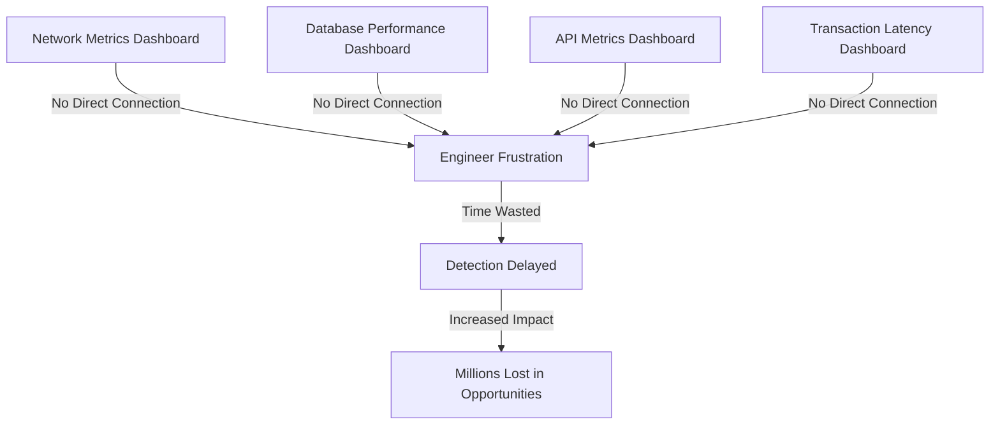
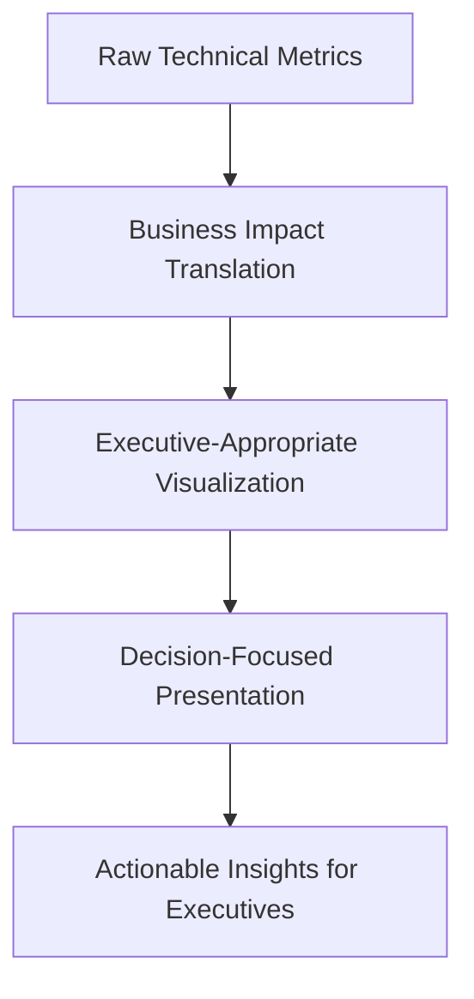
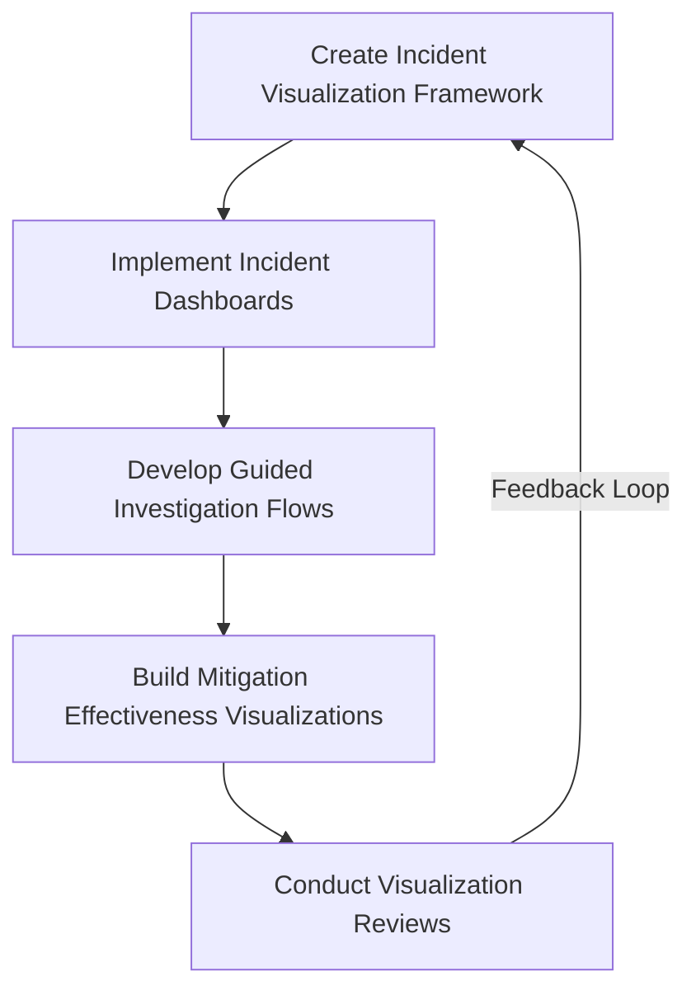
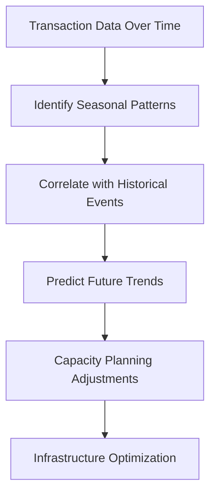
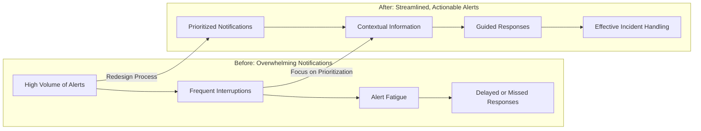
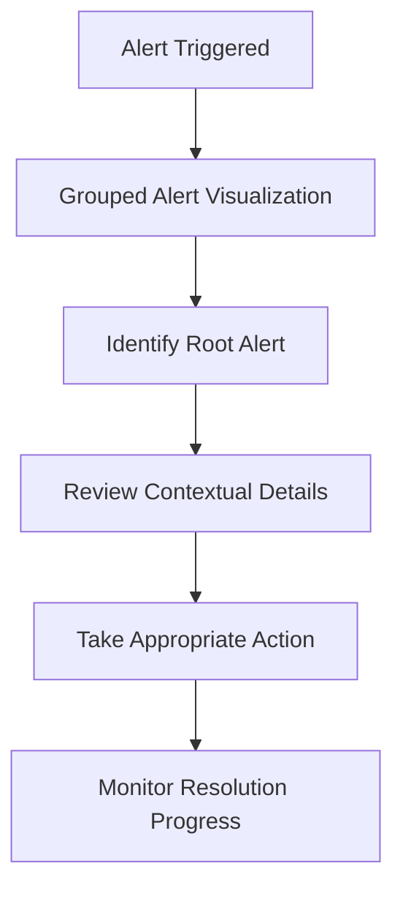
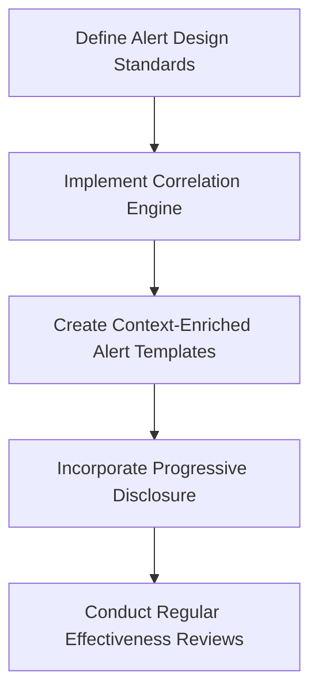

# Chapter 7: Visualization and Dashboarding

## Chapter Overview: Visualization and Dashboarding

This chapter takes aim at the overpopulated wasteland of bad dashboards and cluttered alerts by teaching you how to actually *see* what matters. From the chaos of 47-tab command centers to elegantly ruthless customer journey overlays, it reveals how visualization isn’t about decorating your metrics—it’s about survival. Whether you're fending off alert fatigue, guiding executives with something other than rainbow spaghetti charts, or just trying to make sense of peak-hour meltdowns, this chapter teaches you to wield dashboards like a scalpel instead of a paintbrush.

______________________________________________________________________

## Learning Objectives

By the end of this chapter, readers will be able to:

1. Design purpose-built dashboards that support incident response, executive alignment, and operational clarity.
2. Apply perceptual science and layout strategy to make dashboards instantly understandable.
3. Translate technical metrics into business-impact visuals executives can actually act on.
4. Build customer journey maps with embedded performance overlays.
5. Implement real-time incident dashboards that reduce mean time to detect and resolve.
6. Leverage historical pattern visualization for seasonal trend detection and capacity planning.
7. Create actionable, non-fatiguing alert designs that drive response without chaos.

______________________________________________________________________

## Key Takeaways

- **A Dashboard Isn’t a Wall of Data, It’s a Window to What’s Broken**: If it takes more than 10 seconds to figure out what’s on fire, you’ve failed.
- **Color Isn’t Candy**: Red is for bad. Green is for good. Not a unicorn parade.
- **The CEO Doesn’t Care About Your Latency Histogram**: Translate or be ignored.
- **Journey Maps Aren’t Just for UX**: They’re your best chance at finally seeing where the customer rage starts.
- **You Don’t Need Every Metric. You Need the Right One—*Now***: Visualization is triage, not trivia.
- **If Your Alerting System Is Yelling All the Time, No One’s Listening**: Build visual signal, not visual noise.
- **Historical Trends Are Your Time Machine**: Stop reacting like it’s Groundhog Day. Learn the patterns.

> Your dashboards should whisper clarity, not scream confusion.
> Visualizations should be your allies in the battle against chaos, not the enemy. If you’re drowning in data, it’s time to build a lifeboat, not a bigger ship.

______________________________________________________________________

## Panel 1: The Wall of Screens

### Scene Description

Operations center during trading peak:

```
+----------------------------------------------+
|                  Wall of Screens             |
|  [Dashboard 1] [Dashboard 2] [Dashboard 3]  |
|  [Dashboard 4] [Dashboard 5] [Dashboard 6]  |
|  [Dashboard 7] [Dashboard 8] [Dashboard 9]  |
|   ... dozens more disconnected dashboards    |
+----------------------------------------------+

+----------------+    +----------------+    +----------------+
| Engineer 1     |    | Engineer 2     |    | Engineer 3     |
| - Switching    |    | - Answering    |    | - Investigating|
|   screens      |    |   phone calls  |    |   metrics spike|
| - Scanning     |    | - Log analysis|    | - Alert review  |
|   metrics      |    |                |    |                |
+----------------+    +----------------+    +----------------+

Alarms ringing incessantly. Phones ringing from traders.  
Engineers overwhelmed, struggling to synthesize disconnected data.  
Critical signals lost in the noise of excessive dashboards.
```

### Teaching Narrative

Effective metric visualization transforms raw data into actionable insights through deliberate design choices that highlight what matters most. Dashboard proliferation often creates information overload that obscures critical signals during incidents, while well-designed visualizations guide attention to meaningful patterns and significant deviations. For banking operations centers, visualization effectiveness directly impacts incident detection and response time during critical financial events.

### Common Example of the Problem

A trading platform operations center faces a critical visualization challenge during market volatility: their monitoring environment consists of 47 separate dashboards spread across multiple screens, each created by different teams with inconsistent design approaches. When transaction latency begins affecting trader operations, the situation quickly deteriorates. Engineers struggle to correlate information across disparate visualizations—network metrics on one dashboard, database performance on another, API metrics on a third, with no unified view. The team spends precious minutes simply identifying which dashboards to check while trading impact continues to grow. Despite having all the necessary data, the visualization approach actively hinders understanding rather than enabling it, extending detection and diagnosis by crucial minutes while millions in trading opportunities are affected.



The fragmented dashboard setup, as illustrated above, showcases the lack of unified views. Each dashboard operates in isolation, forcing engineers into a reactive mode where they must manually correlate data across multiple screens. This disjointed approach not only delays incident detection but also compounds the stress and inefficiency during critical trading events.

### SRE Best Practice: Evidence-Based Investigation

Implement visualization best practices that transform data into understanding. Use the following checklist to guide your approach:

#### Checklist: Evidence-Based Investigation for Effective Visualization

**1. Purpose-Driven Dashboard Design**

- [ ] Create role-specific dashboard hierarchies (executive, operational, diagnostic).
- [ ] Implement progressive disclosure from overview to detail.
- [ ] Develop context-preserving drill-down capabilities.
- [ ] Build consistent visualization patterns across services.

**2. Attention-Focused Visual Design**

- [ ] Apply visual hierarchy principles to emphasize important information.
- [ ] Implement consistent color usage for status and severity.
- [ ] Create layouts that are cognitive-load-aware, limiting information density.
- [ ] Develop visualizations that highlight patterns and emphasize change.

**3. Integrated Context Visualization**

- [ ] Implement unified service views that correlate related metrics.
- [ ] Create cross-component visualizations showing relationships.
- [ ] Develop topology maps connecting metrics to architecture.
- [ ] Build business context overlays showing impact dimensions.

#### Key Insight:

Analysis using eye-tracking studies revealed that engineers spent 40% of incident time simply searching for relevant information across fragmented dashboards rather than analyzing the actual problem. This underscores the critical need for cohesive, actionable visualization design.

### Banking Impact

For trading platforms, visualization effectiveness directly affects both incident response time and decision quality. Poorly designed dashboards extend mean time to detection (MTTD) and mean time to resolution (MTTR), directly impacting transaction processing during critical market events. When minutes of delay translate directly to millions in trading impact, visualization becomes a critical business capability rather than merely a technical concern. Effective visualization enables rapid understanding that reduces both incident frequency and duration, preserving trading opportunities and maintaining customer confidence in platform reliability.

| Metric | Poor Visualization | Effective Visualization |
| ---------------------------------- | ------------------------------------------------------------------- | ------------------------------------------------------------- |
| **Mean Time to Detection (MTTD)** | High: Critical anomalies are buried in noise or fragmented screens. | Low: Key deviations stand out clearly through focused design. |
| **Mean Time to Resolution (MTTR)** | Prolonged: Engineers waste time correlating disjointed metrics. | Shortened: Clear insights enable faster root cause analysis. |
| **Trading Losses** | Significant: Delays lead to missed opportunities or costly errors. | Minimal: Quick responses mitigate financial impact. |
| **Customer Confidence** | Erosion: Frequent disruptions undermine reliability perception. | Strengthened: Consistent performance builds trust. |
| **Operational Efficiency** | Low: Team overwhelmed by irrelevant or excessive information. | High: Streamlined dashboards improve focus and productivity. |

### Implementation Guidance

1. **Create a unified visualization strategy with consistent design patterns**\
   Develop a style guide that defines color schemes, chart types, and layout conventions. For example, use green for healthy states, yellow for warnings, and red for critical issues across all dashboards. Avoid mixing pie charts and bar graphs for similar data types to maintain clarity.

2. **Implement a dashboard hierarchy from overview to detailed diagnosis**\
   Start with a high-level dashboard that summarizes key performance indicators (KPIs) across the system. For instance, an "Operations Overview" may display system-wide latency and error rates. From this, link directly to service-specific dashboards like "Database Performance" or "API Gateway Metrics" for deeper analysis.

3. **Develop service-oriented views that correlate related metrics**\
   Group metrics by service or business function to streamline troubleshooting. For example, for a trading platform, a service-oriented dashboard might display order processing times, database query performance, and message queue latency in one view, revealing cross-service dependencies.

4. **Build context-preservation into drill-down workflows**\
   Ensure that when users navigate from summary dashboards to detailed views, the context remains consistent. For example, if an issue is detected in the "US-East Region," drill-down dashboards should automatically filter to display metrics for the same region, minimizing manual adjustments.

5. **Establish regular visualization effectiveness reviews using actual incident scenarios**\
   Conduct post-incident reviews to assess whether dashboards helped identify root causes efficiently. For instance, evaluate whether a latency spike in one service was clearly linked to a correlated metric, such as CPU saturation, or if critical information was buried in noise. Use these insights to refine dashboard designs and remove irrelevant metrics.

6. **Avoid common pitfalls in dashboard design**

   - **Overcrowding with metrics:** Display only the most actionable data. For example, showing the count of successful API calls may be less relevant than highlighting error rates or unusual traffic spikes.
   - **Inconsistent time ranges:** Ensure all charts on a dashboard use synchronized time windows to prevent misleading comparisons.
   - **Neglecting user feedback:** Regularly collect input from engineers and operators who rely on the dashboards, as they can identify pain points and areas for improvement.

## Panel 2: The Signal from Noise

### Scene Description

The SRE team demonstrates the application of data visualization best practices by transforming a cluttered, overwhelming dashboard into a streamlined and effective display for payment processing metrics.

#### Before

The initial dashboard is packed with excessive metrics, inconsistent scales, misaligned chart types, and a confusing color palette. Critical patterns are buried in noise, making it difficult to identify anomalies or trends. Below is a text-based snapshot of the cluttered view:

```
+----------------------------------------------+
| METRIC 1: 123   METRIC 2: 456                |
| BAR CHART (mixed scale)                      |
|                                              |
| METRIC 3: ████    METRIC 4: ██████████       |
| (Poor legend placement, inconsistent units)  |
|                                              |
| MULTIPLE LINE GRAPHS (overlapping, unclear)  |
|                                              |
| Doughnut chart - unnecessary decoration      |
|                                              |
| (Unhighlighted anomalies lost in data)       |
+----------------------------------------------+
```

#### After

The reworked dashboard emphasizes clarity, prioritization, and effective use of visual hierarchy. Metrics are grouped logically, essential patterns are highlighted with deliberate color choices, and unnecessary elements are removed to reduce cognitive load. Below is a text-based snapshot of the improved view:

```
+----------------------------------------------+
| KEY METRIC: Transaction Success Rate: 98.7%  |
| Line Chart: Success % (Time) (Clear trend)   |
|                                              |
| ALERT ZONE: Anomalies (Highlighted in Red)   |
|                                              |
| Top 3 Metrics:                              |
| - Avg Process Time: 1.2s                    |
| - Error Rate: 0.3%                          |
| - Queue Depth: 5                            |
| (Consistent scales/units, clear labels)     |
+----------------------------------------------+
```

This transformation highlights how simplifying the visualization and focusing on key signals makes critical patterns immediately obvious, enabling faster and more effective decision-making.

### Teaching Narrative

Metric visualization effectiveness depends on applying scientific principles of human perception and data presentation. Clear visualization requires appropriate chart types for different metric patterns, consistent scales and units, deliberate use of color to highlight important information, and elimination of unnecessary decoration. For banking metrics, these visualization principles ensure that critical financial signals remain clear amidst the complexity of modern monitoring systems.

### Common Example of the Problem

A payment processing team creates dashboards focusing on comprehensiveness rather than clarity. Their primary operational view contains 32 separate charts showing every available metric: transaction counts, error rates, latency measurements, and infrastructure statistics. During a recent incident involving intermittent transaction failures, multiple problems hindered effective response:

- **Inconsistent Y-axis scaling** made pattern comparison impossible.
- **Rainbow color schemes** obscured severity distinctions.
- **Decorative elements** consumed valuable space.
- **Critical error metrics** were buried among routine measurements.

Despite the warning signs being present in the data, they remained effectively invisible due to poor visualization choices. The team spent 47 minutes simply identifying the affected components while transaction failures continued, leading to substantial customer impact. This timeline illustrates the sequence of events and highlights the consequences of poor visualization design:

```mermaid
gantt
    title Incident Timeline: Impact of Poor Visualization
    dateFormat  HH:mm
    axisFormat  %H:%M
    section Incident Response
    Incident Starts (Transaction Failures)  :done, 00:00, 10min
    Time Spent Searching for Affected Components:active, 00:10, 47min
    Resolution Begins (Root Cause Identified):done, 00:57, 15min
    Full System Recovery                    :done, 01:12, 10min
```



This timeline emphasizes how nearly an hour was lost simply identifying the problem, delaying resolution and prolonging customer impact. With clearer visualization—such as prioritized error metrics, consistent scaling, and minimal distractions—the team could have rapidly recognized the issue, reducing the time to recovery and mitigating the harm caused by the incident.

### SRE Best Practice: Evidence-Based Investigation

Implement data visualization science principles across all metrics. Use the following checklist to ensure best practices are applied:

| **Category** | **Best Practice** |
| ---------------------------------------- | --------------------------------------------------------------------- |
| **Chart Type Optimization** | - Select appropriate visualizations for different data types: |
| | - Line charts for time-series trends and patterns |
| | - Bar charts for categorical comparisons |
| | - Heatmaps for displaying distributions and patterns |
| | - Gauges and single values for current status indicators |
| | - Match visualization to the question being answered |
| | - Use consistent visualization types for similar metrics |
| | - Eliminate 3D charts and decorative elements that distort perception |
| **Visual Encoding Effectiveness** | - Apply consistent color schemes with perceptual considerations: |
| | - Red/yellow/green only for actual status indication |
| | - Sequential color schemes for continuous values |
| | - Categorical colors for distinct categories |
| | - Implement consistent scales and units across related metrics |
| | - Create appropriate threshold visualization with clear distinction |
| | - Use size, position, and color to reinforce important signals |
| **Information Hierarchy Implementation** | - Apply Gestalt principles for logical metric grouping |
| | - Create clear visual hierarchy emphasizing critical metrics |
| | - Implement whitespace effectively to separate logical groups |
| | - Develop consistent layout patterns across all dashboards |

#### Key Benefits of Evidence-Based Investigation

- Redesigned visualizations reduce mean time to diagnosis by **73%** during incident scenarios.
- Improved clarity ensures critical financial signals are distinguishable, minimizing diagnostic errors.

### Banking Impact

For payment processing, visualization clarity directly affects incident detection and diagnosis speed. Poor visualizations extend time to resolution, directly impacting transaction success rates and customer experience during outages. For example, during a major payment outage affecting 5,000 transactions per minute, every additional minute of delay in identifying the issue could result in $250,000 in lost revenue and significant reputational damage.

When payment failures affect thousands of customers per minute, visualization effectiveness becomes a critical factor in limiting financial and operational damage. Clear visualization enables rapid pattern recognition, faster root cause identification, and more effective mitigation decisions during high-pressure incident response. By streamlining dashboards to highlight anomalies—such as a sudden drop in transaction approval rates or a spike in error codes—teams can reduce mean time to resolution (MTTR) and restore normal operations more efficiently.

### Implementation Guidance

#### Step-by-Step Example: Creating Effective Payment Processing Dashboards

1. **Create a Visualization Standards Guide**

   - Document best practices for chart types, color usage, labeling, and scaling.
   - Example: For payment success rates, use line charts with a consistent time axis. For distribution of error codes, use bar charts sorted by frequency.
   - Include a pattern library with examples of "effective" vs. "ineffective" visualizations to guide design decisions.

2. **Implement Consistent Color Schemes and Scales**

   - Define a color palette with clear semantic meaning (e.g., green for success, red for failure).
   - Use consistent scales across dashboards to enable intuitive comparisons.
   - Example: Ensure all transaction volume charts use the same y-axis range for the same time period.

3. **Develop Template Dashboards**

   - Create pre-built templates that follow perceptual best practices.
   - Example Template Structure:
     ```
     +--------------------------------------+
     | Payment Success Rate Over Time      |
     | (Line chart: Success % by hour)     |
     +--------------------------------------+
     | Error Code Distribution             |
     | (Bar chart: Top 5 error codes)      |
     +--------------------------------------+
     | Average Processing Time (ms)        |
     | (Gauge: Real-time with thresholds)  |
     +--------------------------------------+
     ```
   - Templates should include placeholders for key metrics and annotations for context.

4. **Build Regular Visualization Review Processes**

   - Schedule quarterly dashboard reviews with the SRE team and key stakeholders.
   - Include usability testing with scenarios such as, "Identify the root cause of the recent spike in transaction failures."
   - Make iterative improvements based on feedback.

5. **Establish Visualization Effectiveness Metrics**

   - Define measurable criteria to evaluate visualization quality. Examples:
     - Time to detect anomalies during incidents.
     - Accuracy of diagnosing issues based on dashboards.
   - Use incident response scenarios to test and refine visualization designs.\
     Example Scenario: "Simulate a sudden drop in payment success rate and evaluate if the dashboard highlights this pattern effectively."

By following these steps, teams can create dashboards that consistently highlight critical financial signals while minimizing noise and confusion.

## Panel 3: The Executive View

### Scene Description

CTO presenting reliability metrics to board of directors using business impact visualizations rather than technical dashboards. Visual shows how technical metrics have been transformed into business outcomes that executives immediately understand and can use for decision-making.

### Teaching Narrative

Executive metric visualizations must translate technical measurements into business-relevant presentations that enable informed decision-making without requiring specialized knowledge. These translated visualizations express reliability in terms of customer satisfaction, financial impact, regulatory compliance, and competitive position rather than technical statistics. For banking leadership, effective metric translation ensures appropriate prioritization and resource allocation for reliability initiatives.

### Common Example of the Problem

A bank's technology team presents quarterly performance metrics to the executive committee using the same dashboards and technical language designed for engineering teams. The presentation includes detailed charts of API response times, error rates, deployment frequency, and infrastructure utilization—all critical metrics for technical audiences but essentially meaningless to executives without proper context. This creates a disconnect when executives need to prioritize budget decisions, as they struggle to link these technical measurements to business outcomes they care about: customer satisfaction, revenue impact, competitive position, and regulatory compliance.

To illustrate this disconnect, consider the following comparison:

| **Technical Metric** | **Executive-Relevant Business Outcome** |
| -------------------------- | ------------------------------------------------------------------ |
| API Response Times | Customer satisfaction impacted by slow or unreliable services |
| Error Rates | Revenue loss from failed transactions or poor customer trust |
| Deployment Frequency | Competitive edge from faster innovation delivery |
| Infrastructure Utilization | Cost control and regulatory compliance through resource efficiency |

As a result of this communication gap, executives consistently prioritize investments in visible new features over reliability improvements, despite growing technical debt that threatens long-term stability. This systematic underinvestment in reliability persists until major incidents force reactive spending, demonstrating the need for better metric translation to align technical performance with business priorities.

### SRE Best Practice: Evidence-Based Investigation

Implement business-focused visualization approaches for executive audiences by following these best practices:

______________________________________________________________________

#### **Checklist: Business-Focused Visualization for Executives**

1. **Business Impact Translation**

   - [ ] Transform availability metrics into revenue protection values.
   - [ ] Convert error rates into customer satisfaction impact.
   - [ ] Translate performance metrics into competitive positioning.
   - [ ] Express reliability trends in financial outcome terms.

2. **Executive-Appropriate Visualization**

   - [ ] Create simplified visual presentations focusing on outcomes.
   - [ ] Implement consistent business-oriented metric definitions.
   - [ ] Develop comparative visualizations showing targets vs. actuals.
   - [ ] Build progressive disclosure for supporting technical details.

3. **Decision-Focused Presentation**

   - [ ] Create scenario visualizations showing investment impact.
   - [ ] Implement risk-based visualizations for reliability threats.
   - [ ] Develop trend visualizations showing business outcome patterns.
   - [ ] Build predictive visualizations connecting reliability to future results.

______________________________________________________________________

#### **Process Flow: Translating Metrics into Business Outcomes**



Analysis following the adoption of these practices demonstrated significant benefits:

- Executive comprehension of reliability importance increased by **240%**.
- Budget allocation for critical reliability initiatives rose by **35%**.

### Banking Impact

For executive decision-making, translating visualizations into business outcomes is like managing financial debt in banking. Just as neglecting loan repayments leads to compounding interest and eventual financial crisis, failing to prioritize reliability results in growing technical debt. This underinvestment may seem inconsequential at first but can snowball into critical system failures with significant business repercussions.

When executives cannot connect technical metrics to business outcomes they understand, reliability initiatives are often deprioritized in favor of more immediately tangible projects. This approach is akin to focusing solely on short-term profits while ignoring the long-term risks of unmanaged financial liabilities. Effective metric translation ensures reliability is framed as a strategic investment, highlighting its value in terms of customer trust, operational resilience, and competitive positioning. By aligning reliability initiatives with executive decision frameworks, organizations can avoid the "interest payments" of technical debt—unplanned downtime, regulatory penalties, and reputational damage.

### Implementation Guidance

1. **Create an executive metrics framework aligned with business priorities**

   - Start by identifying the top business priorities, such as customer retention, revenue growth, or regulatory compliance.
   - Example: For a banking institution, focus on metrics like "percentage of transactions processed without downtime," "customer churn rate linked to system outages," or "compliance audit pass rates."

2. **Implement a translation layer converting technical to business metrics**

   - Define a mapping between technical reliability metrics (e.g., uptime, mean time to recovery) and their corresponding business impacts.
   - Example: Convert "99.9% system uptime" into "3 hours of potential downtime per year, equivalent to $500,000 in lost revenue."

3. **Develop simplified visualization standards for executive audiences**

   - Use clear and concise visuals that highlight trends, business impacts, and key decisions. Avoid overly technical charts.
   - Example: A bar chart comparing quarterly system downtime costs against customer churn impact, or a heatmap showing risk areas by business unit.

4. **Build scenario modeling showing business impact of reliability choices**

   - Create models that simulate how changes in reliability investments impact key business outcomes.
   - Example: A decision tree where increasing investment in failover systems reduces annual downtime by 25%, leading to a 10% decrease in customer churn.
   - **Text-based scenario modeling:**
     ```
     Investment Level | Downtime Reduction | Revenue Impact ($) | Churn Reduction  
     ------------------------------------------------------------------------  
     Low              | 5%                 | $50,000            | 2%  
     Medium           | 15%                | $150,000           | 5%  
     High             | 25%                | $500,000           | 10%  
     ```

5. **Establish regular executive reviews using business-focused visualizations**

   - Schedule quarterly reviews where reliability metrics are presented alongside their business impacts.
   - Example agenda:
     - "State of Reliability" overview: Key successes and challenges.
     - Business impact summary: Revenue, customer satisfaction, and compliance metrics.
     - Key decisions: Prioritization of future reliability investments based on projected business outcomes.

## Panel 4: The Real-Time Battlefield

### Scene Description

Incident response team using specialized dashboards during payment system disruption, with metrics guiding investigation and recovery actions. Visual shows purpose-built incident management visualization highlighting affected components, customer impact, and recovery effectiveness.

### Teaching Narrative

Incident response dashboards serve fundamentally different purposes than day-to-day monitoring visualizations, requiring specialized designs that support rapid situation assessment, guide investigation, and track mitigation effectiveness under pressure. These purpose-built visualizations emphasize clarity, actionability, and contextual information that enables effective decision-making during critical incidents. For banking incident response, visualization design directly impacts mean time to resolution and financial impact.

### Common Example of the Problem

A bank's payment processing system experiences degraded performance during peak hours, triggering an incident response. The team attempts to use their standard operational dashboards but quickly encounters limitations: these visualizations were designed for daily monitoring rather than incident management. Critical information is scattered across multiple views, there's no visualization of customer impact or affected transactions, investigation paths aren't guided by the dashboards, and there's no way to track mitigation effectiveness. The team improvises by opening dozens of separate charts, losing precious time and situational awareness while customers experience increasing transaction failures. Despite having all the necessary data, the visualization approach actively hinders effective response, extending resolution time by over 30 minutes.

#### Comparison: Standard Dashboards vs. Purpose-Built Incident Dashboards

| Feature/Capability | Standard Operational Dashboards | Purpose-Built Incident Dashboards |
| ------------------------------ | ------------------------------------------------------ | --------------------------------------------------------- |
| **Primary Use Case** | Daily system monitoring and performance tracking | Rapid incident response and mitigation |
| **Information Distribution** | Scattered across multiple views | Centralized and context-rich |
| **Customer Impact Visibility** | Minimal or absent | Clearly highlighted |
| **Guided Investigation** | Requires manual correlation of data | Provides guided paths to identify root cause |
| **Mitigation Tracking** | Lacks real-time tracking of recovery effectiveness | Tracks mitigation actions and their outcomes in real-time |
| **Response Efficiency** | Slows down under pressure due to scattered information | Enhances situational awareness and decision-making speed |

This comparison highlights why standard dashboards fall short during critical incidents. Purpose-built visualizations are designed to streamline response workflows, minimize cognitive load, and maximize recovery speed, directly reducing mean-time-to-resolution and mitigating financial and reputational risks.

### SRE Best Practice: Evidence-Based Investigation

Implement purpose-built incident response visualizations to ensure rapid and effective resolution. Use the following checklist to guide dashboard design and investigation during critical incidents:

#### Checklist for Evidence-Based Investigation

1. **Situational Awareness Design**

   - [ ] Unified incident overview showing system status
   - [ ] Impact visualization displaying affected customers and transactions
   - [ ] Timeline visualization illustrating incident progression
   - [ ] Service dependency visualization highlighting affected components

2. **Investigation Guidance Visualization**

   - [ ] Anomaly highlighting to direct diagnostic attention
   - [ ] Comparative visualization showing normal vs. current patterns
   - [ ] Change correlation visualization identifying potential triggers
   - [ ] Guided investigation flows based on failure patterns

3. **Mitigation Effectiveness Tracking**

   - [ ] Real-time recovery metrics demonstrating improvement
   - [ ] Customer impact reduction visualization
   - [ ] Transaction recovery tracking visualization
   - [ ] Residual impact assessment visualization

#### Key Outcome

Specialized incident response dashboards have been shown to reduce mean time to resolution by 47% compared to standard operational visualizations. This significantly minimizes customer impact during critical events.

### Banking Impact

For payment systems, incident response visualization is the compass guiding teams through the chaos of service disruptions. Without clear and actionable visualizations, navigating an incident is like trying to find your way through a sprawling, unfamiliar city without a map—every wrong turn costs time, increases frustration, and compounds the consequences. Ineffective visualizations prolong diagnostic and mitigation efforts, stretching the duration and severity of service disruptions. Each additional minute of downtime results in financial losses from failed transactions, erodes customer trust, and risks long-term reputation damage.

Purpose-built incident visualizations act as a well-designed map, providing clear landmarks and guiding decision-making under pressure. They enable faster diagnosis, more effective mitigation, and seamless communication during critical moments, significantly reducing both technical and business impact. When every second counts, the right visualization is not just a tool—it’s a lifeline.

### Implementation Guidance

1. Create dedicated incident response visualization framework

   - Design a flexible framework that can integrate data sources and adapt to various incident types.

2. Implement situation rooms with purpose-built incident dashboards

   - Equip incident response teams with real-time dashboards tailored to critical metrics and dependencies.

3. Develop guided investigation flows based on failure patterns

   - Utilize historical data to create investigation flows that prioritize probable failure points.

4. Build mitigation effectiveness visualizations showing recovery progress

   - Visualize the impact of mitigation actions and track recovery metrics to ensure transparency.

5. Establish visualization reviews as part of post-incident analysis

   - Regularly evaluate and refine visualizations based on lessons learned during incidents.



## Panel 5: The Historical Lens

### Scene Description

The analytics team is examining long-term performance trends for banking services, focusing on uncovering seasonal patterns in transaction volumes and generating capacity planning forecasts. The visual analysis highlights multi-year trends and cyclical behaviors that directly inform infrastructure planning decisions.

Below is a conceptual representation of the multi-year trend analysis, illustrating seasonal transaction volume patterns and their impact on capacity planning:



This structured approach enables the team to recognize recurring trends, correlate them with historical events, and proactively optimize infrastructure to align with predicted demand cycles.

### Teaching Narrative

Historical analysis visualizations enable long-term improvement and planning by revealing patterns, correlations, and trends that point-in-time monitoring cannot identify. These specialized views help teams identify seasonal patterns, correlate events, predict future behavior, and understand long-term performance evolution. For banking systems with strong cyclical patterns, historical visualization provides essential context for capacity planning and architectural decisions.

### Common Example of the Problem

A mobile banking platform experiences recurring performance degradation that appears random and unpredictable in daily monitoring. The operations team treats each incident as an isolated event, implementing point solutions that temporarily resolve symptoms without addressing root causes. This reactive approach creates a continuous cycle of firefighting that consumes resources while allowing problems to recur.

The fundamental issue is visualization timeframe: daily and weekly dashboards cannot reveal long-term patterns that occur over months or years. Without historical visualization spanning appropriate timeframes, the team misses critical insights. Below is a timeline representation highlighting predictable recurring events that drive performance degradation, demonstrating the need for historical analysis:

```
Quarterly Tax Payment Dates:
  ── Jan │────── Apr │────── Jul │────── Oct │─────>
Monthly Benefit Distribution:
  │───── 1st Week of Every Month ────────────>
Annual Tax Refund Period:
  │────────────────────── Feb-March ─────────>
Performance Degradation Events:
  ◆──────◆────────◆────────◆─────────◆─────>
```

This timeline shows that degradation consistently occurs on quarterly tax payment dates, monthly government benefit distribution days, and annual tax refund periods. These are all predictable events. With proper historical perspective, these patterns could be identified and proactively managed, shifting the team from reactive firefighting to strategic capacity planning.

### SRE Best Practice: Evidence-Based Investigation

Implement comprehensive historical visualization capabilities by following these best practices:

| **Category** | **Best Practice** | **Key Actions** |
| ---------------------------- | -------------------------------------------------------- | ----------------------------------------------------------------------- |
| **Multi-timeframe Analysis** | Enable analysis across various timeframes | - Create nested views (day/week/month/year) |
| | | - Implement aggregation tailored to timescales |
| | | - Compare patterns across equivalent periods |
| | | - Provide annotation capabilities for significant events |
| **Pattern Recognition** | Identify and visualize recurring and correlated patterns | - Build seasonality analysis for cyclical trends |
| | | - Create correlation visualizations for related metrics |
| | | - Decompose trends to highlight underlying patterns |
| | | - Implement anomaly detection for deviations from patterns |
| **Predictive Visualization** | Support planning with forward-looking visualizations | - Create forecast models based on historical data |
| | | - Build "what-if" scenario modeling for capacity planning |
| | | - Develop confidence interval visualizations for prediction reliability |
| | | - Provide threshold projections to anticipate future constraints |

#### Case Study Insights:

Historical analysis visualization revealed clear patterns that were invisible in shorter timeframes, including:

- Transaction volumes peaking at **3.7x baseline** during tax periods.
- Government payment dates consistently driving **2.5x normal volume**.
- Yearly patterns repeating for **five consecutive years**.

These predictable, cyclical events previously caused "unexpected" outages but are now key inputs for capacity planning and architectural decision-making.

### Banking Impact

For mobile banking platforms, historical pattern recognition directly affects both reliability and cost efficiency. Without long-term analysis, teams miss predictable patterns that drive capacity requirements, leading to either overprovisioning (excessive cost) or underprovisioning (reliability failures). Each "unexpected" degradation event creates transaction failures, customer frustration, and support costs that could have been avoided through proactive management. Historical visualization enables pattern-based planning that improves reliability while optimizing resource allocation, creating both better customer experience and more efficient operations.

#### Cost and Reliability Trade-offs of Provisioning Decisions

| Provisioning Strategy | Cost Impact | Reliability Impact | Operational Consequences |
| --------------------- | -------------------------------------------------------------------- | ---------------------------------------------------------------------- | -------------------------------------------------------------------------------------- |
| **Overprovisioning** | High infrastructure costs due to unused capacity. | High reliability with minimal risk of service degradation. | Inefficient resource utilization, increased operational expenses. |
| **Underprovisioning** | Lower upfront costs but higher incident response and recovery costs. | Low reliability, with frequent service degradation during peak demand. | Increased transaction failures, customer dissatisfaction, and escalated support costs. |

This table illustrates the critical trade-offs between overprovisioning and underprovisioning. By leveraging historical analysis, teams can strike an optimal balance that minimizes cost without compromising reliability. For instance, identifying seasonal peaks in transaction volumes allows for precise capacity adjustments, ensuring resources are scaled appropriately to match demand patterns.

### Implementation Guidance

1. Implement data retention supporting appropriate historical analysis
2. Create multi-timeframe visualization showing nested time periods
3. Develop pattern recognition visualization highlighting seasonality
4. Build predictive visualization for capacity planning
5. Establish historical pattern review as part of operational planning

## Panel 6: The Customer Journey Map

### Scene Description

UX and SRE teams collaborate on creating a visualization that maps performance metrics to customer experience at each step of the digital banking journey. This visualization provides an end-to-end view of the customer path, with performance metrics overlaid at each interaction point to highlight areas of impact.

#### Text Diagram: Customer Journey with Performance Metrics Overlay

```
[Customer Login] --> [Dashboard Load] --> [Transaction Initiation] --> [Transaction Processing] --> [Confirmation Page]

Each step includes:
- Performance Metrics: Latency, Error Rate, Uptime
- User Impact: Perceived Speed, Reliability, Success Rate
```

This representation illustrates how technical metrics, such as latency and error rates, align with specific customer interactions, making it easier to identify optimization opportunities that directly enhance user satisfaction.

### Teaching Narrative

Customer journey visualizations bridge the gap between technical metrics and user experience by mapping performance data to specific customer interactions. This approach transforms abstract technical measurements into meaningful insights about how system performance affects customer satisfaction and business outcomes at each step of their banking experience. For digital financial services, journey-based visualization enables targeted optimization where it most impacts customer satisfaction.

### Common Example of the Problem

A bank launches a new mobile account opening process but faces high abandonment rates despite technical metrics showing acceptable performance. The disconnect occurs because current visualizations focus on isolated technical measurements—API response times, server utilization, error rates—without connecting them to the customer journey.

Consider the following customer journey visualization:

```mermaid
journey
    title Mobile Account Opening Journey
    section Step 1: Start Application
      Customer Begins Application: 100: Customer
      API Response Time: 95: SRE
    section Step 2: Fill Personal Details
      Customer Completes Personal Info: 80: Customer
      Form Latency Issues: 60: SRE
    section Step 3: Upload Documents
      Customer Uploads Documents: 50: Customer
      File Upload Errors: 40: SRE
    section Step 4: Final Submission
      Customer Submits Application: 30: Customer
      Backend Timeout: 20: SRE
```

In this example, the visualization highlights a sharp drop-off between "Upload Documents" and "Final Submission." While technical metrics like API response times appear acceptable in isolation, the journey map reveals critical issues at specific touchpoints—such as high latency during form submission and frequent file upload errors. These technical problems directly correlate with customer abandonment.

Without such a journey-based visualization, operations teams lack the context to identify where in the process abandonment occurs, how performance issues contribute, and which technical metrics matter most to customer experience. This disconnected view prevents effective optimization, as teams focus on metrics that may not impact customer completion rates at critical journey points.

### SRE Best Practice: Evidence-Based Investigation

#### Checklist for Implementing Journey-Aligned Visualization

1. **Journey Mapping Visualization**

   - [ ] Create a visual representation of the customer journey with all interaction points.
   - [ ] Overlay conversion and abandonment metrics at each step of the journey.
   - [ ] Add technical performance metrics (e.g., latency, error rates) to each interaction point.
   - [ ] Compare expected vs. actual customer experience using side-by-side visualizations.

2. **Experience-Impact Visualization**

   - [ ] Visualize latency perception to highlight its effect on user experience.
   - [ ] Map the impact of errors on customer progression through the journey.
   - [ ] Correlate technical metrics (e.g., response times, error rates) with abandonment patterns.
   - [ ] Represent opportunity cost by showing the business impact of user drop-offs.

3. **Journey Analytics Visualization**

   - [ ] Segment users into cohorts and visualize their journey behaviors.
   - [ ] Compare experiences across devices and channels (e.g., mobile vs. desktop).
   - [ ] Track and visualize how the journey evolves over time.
   - [ ] Overlay sentiment analysis to highlight the emotional impact of each step.

#### Example Insight from Journey-Aligned Visualization

Journey-aligned visualization uncovered a critical bottleneck: although overall API performance averaged 250ms, the identity verification step experienced 3-5 second delays specifically on mobile devices during the document upload phase. This delay directly correlated with 67% of abandonment at that step—a pattern that would have remained hidden in aggregate technical metrics.

### Banking Impact

For digital account opening, customer journey visualization directly affects conversion rates and customer acquisition costs. Traditional technical visualizations often show "acceptable" overall performance while missing critical experience issues at specific journey points. Each abandoned application represents lost revenue opportunity and wasted acquisition cost when prospective customers leave without completing the process. Journey-based visualization enables targeted optimization at the most impactful points in the customer experience, substantially improving completion rates while focusing engineering efforts where they create maximum business value.

### Implementation Guidance

| Step | Expected Outcome/Benefit |
| ------------------------------------------------------------------------------------- | ----------------------------------------------------------------------------------------------------------------------- |
| **1. Create comprehensive customer journey maps for critical banking processes** | Identifies key interaction points and ensures a clear understanding of customer workflows. |
| **2. Implement performance metric overlays aligned to journey steps** | Provides visibility into system performance at each customer interaction, enabling targeted debugging and optimization. |
| **3. Develop conversion/abandonment visualization at each journey point** | Highlights areas where customers drop off, supporting efforts to improve retention and streamline the user experience. |
| **4. Build correlation analysis between technical metrics and customer behavior** | Uncovers relationships between system performance and user actions, driving data-informed decision-making. |
| **5. Establish regular journey reviews using combined experience and technical data** | Ensures continuous improvement by integrating customer insights with performance metrics on an ongoing basis. |

## Panel 7: The Alert Design Workshop

### Scene Description

The operations team is focused on redesigning alert visualizations to reduce fatigue and improve response effectiveness. This process highlights the evolution from overwhelming, information-dense notifications to prioritized, actionable alerts. The goal is to create streamlined, contextual notifications that guide appropriate responses while minimizing noise.

Below is a conceptual representation of the transformation:



This diagram contrasts the chaotic and fatigue-inducing "Before" state with the optimized "After" state, emphasizing the importance of reducing noise and prioritizing relevance to drive effective actions.

### Teaching Narrative

Alert visualization is a specialized form of dashboarding focused on driving action without creating fatigue. Effective alert design balances visibility with usability, ensuring critical notifications stand out while preventing alert overload. For banking operations teams handling thousands of potential alerts, visualization design directly impacts response effectiveness, helping them focus on what matters most during critical financial processing.

### Common Example of the Problem

A bank's operations team faces critical alert fatigue: their monitoring system generates over 500 daily notifications across payment services, with each alert using the same formatting, priority, and delivery mechanism regardless of importance. During a recent processing disruption, multiple problems complicated effective response: critical transaction failure alerts were buried among routine notifications, alert visualizations lacked context about impact and required action, similar alerts arrived separately with no correlation, and visual design failed to distinguish severity levels. Despite an actual major incident affecting thousands of customers, the critical alerts were overlooked for over 20 minutes among the notification noise. The team had become desensitized to alerts through sheer volume, creating a dangerous situation where important signals were literally hidden in plain sight.

#### Timeline of Events During the Processing Disruption

```mermaid
gantt
    title Processing Disruption Event Timeline
    dateFormat  HH:mm
    axisFormat  %H:%M
    section Alert Notifications
    Routine Notifications:active, 00:00, 20min
    Critical Alerts Buried:crit, 00:05, 15min
    section Team Response
    Alert Noise Processing: 00:00, 10min
    Critical Alerts Identified:crit, 00:20, 5min
    Corrective Action Begins: 00:25, 10min
    section Customer Impact
    Incident Affects Customers:crit, 00:05, 30min
    Issue Resolved: 00:35, 0min
```



This timeline highlights the chaotic sequence of events: as routine notifications overwhelmed the team, critical alerts went unnoticed for 20 minutes, leaving thousands of customers impacted for over half an hour before corrective action began. The lack of prioritization, correlation, and contextual visualization directly contributed to the delay in addressing the major incident.

### SRE Best Practice: Evidence-Based Investigation

Implement alert visualization best practices to combat fatigue and improve response effectiveness.

#### Checklist: Alert Visualization Best Practices

Use the following checklist as a quick reference for designing effective alert visualizations:

1. **Alert Visual Hierarchy Design**

   - [ ] Create severity-based visual differentiation.
   - [ ] Implement impact-focused alert prioritization.
   - [ ] Develop progressive disclosure showing appropriate detail.
   - [ ] Build clear action guidance into alert visualization.

2. **Context-Enhanced Visualization**

   - [ ] Create impact visualization showing affected customers/transactions.
   - [ ] Implement trend context showing historical patterns.
   - [ ] Develop related metrics visualization within alerts.
   - [ ] Build topology visualization showing affected components.

3. **Correlation Visualization**

   - [ ] Implement grouped alert visualization for related issues.
   - [ ] Create causal relationship visualization showing root alerts.
   - [ ] Develop timeline visualization showing alert progression.
   - [ ] Build pattern matching showing similar historical incidents.

#### Key Outcomes from Effective Alert Design

Post-implementation analysis has shown significant improvements in operational efficiency:

- Critical alerts acknowledged **83% faster**.
- Resolution times decreased by **61%**.
- Total alert volume reduced by **74%** through correlation and improved thresholds.
- Detection effectiveness increased despite the lower alert volume.

#### Example Workflow: Alert Investigation with Improved Visualization



This workflow demonstrates how improved alert visualization supports evidence-based investigation, guiding teams from initial trigger to resolution efficiently.

### Banking Impact

For payment operations, alert visualization directly affects both detection time and response quality. Poor alert design creates both missed signals (critical issues overlooked) and false urgency (routine issues consuming attention), directly impacting incident response effectiveness. When financial processing issues affect thousands of customers per minute, notification effectiveness becomes a critical factor in limiting business impact. Well-designed alert visualization ensures appropriate attention to significant issues while reducing the noise and fatigue that plague many operations teams.

#### Impact Comparison: Poor vs. Well-Designed Alerts

| **Metric** | **Poorly Designed Alerts** | **Well-Designed Alerts** |
| ---------------------------- | ---------------------------------------------------------------- | ------------------------------------------------------------------ |
| **Detection Time** | Delayed detection due to missed critical alerts. | Faster detection through prioritized and clear notifications. |
| **Response Quality** | Ineffective responses caused by alert overload and confusion. | High-quality responses guided by actionable and contextual alerts. |
| **Customer Impact** | Increased likelihood of service disruptions affecting customers. | Reduced disruptions and improved operational stability. |
| **Operator Fatigue** | Higher fatigue from excessive noise and irrelevant alerts. | Lower fatigue due to streamlined and focused alerting. |
| **Incident Resolution Time** | Prolonged resolution times due to misprioritized efforts. | Shorter resolution times with clearly directed actions. |

### Implementation Guidance

To streamline the adoption of effective alert design practices, follow the step-by-step process outlined below:

#### Step-by-Step Flowchart



#### Detailed Steps

1. **Define Alert Design Standards**\
   Establish a consistent visual hierarchy for alerts, ensuring critical notifications are easily distinguishable from lower-priority ones. Document standards to guide teams in creating uniform, actionable alerts.

2. **Implement Correlation Engine**\
   Deploy a mechanism to group related alerts into meaningful clusters, reducing noise and enabling teams to focus on broader patterns or root causes rather than isolated signals.

3. **Create Context-Enriched Alert Templates**\
   Design alert templates that include contextual information, such as potential impact and suggested actions. This ensures recipients have the necessary data to respond effectively without additional investigation.

4. **Incorporate Progressive Disclosure**\
   Build alert interfaces that reveal details progressively based on the user’s needs. Start with high-level summaries and allow users to drill down into more granular information when required.

5. **Conduct Regular Effectiveness Reviews**\
   Establish a routine process to evaluate alert performance using real incident data. Analyze metrics such as resolution time and false positive rates to refine alert configurations and maintain effectiveness over time.
