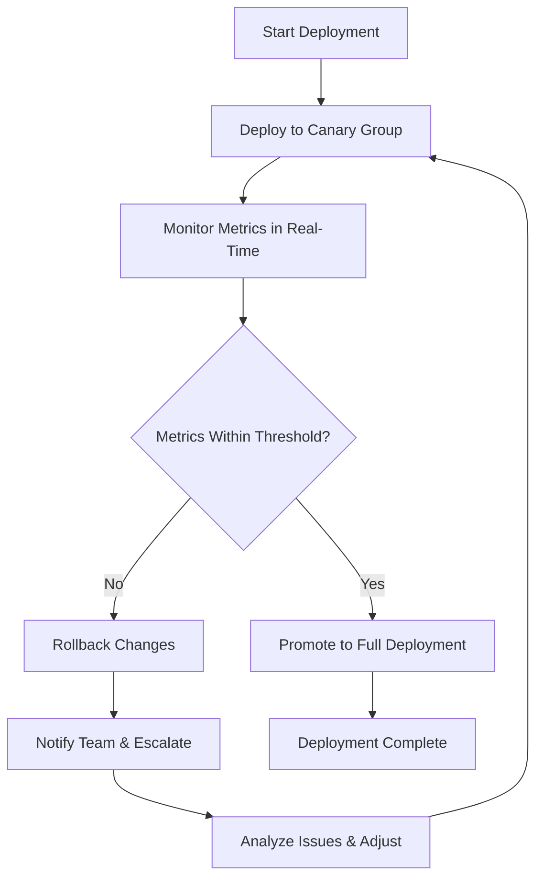
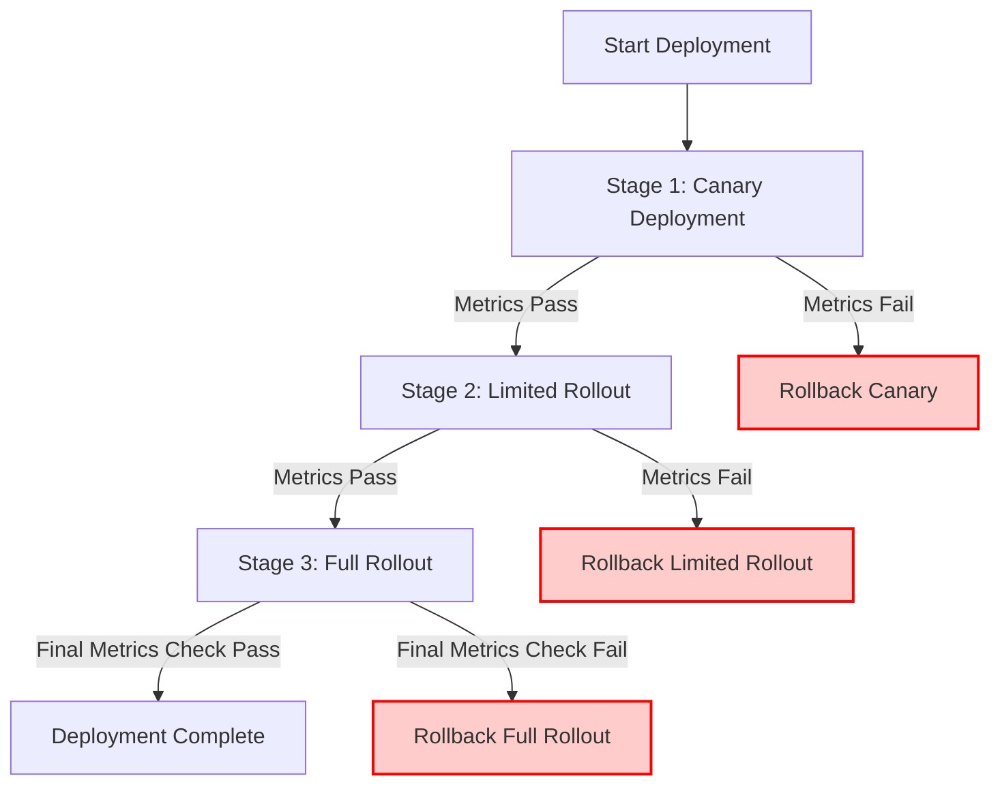
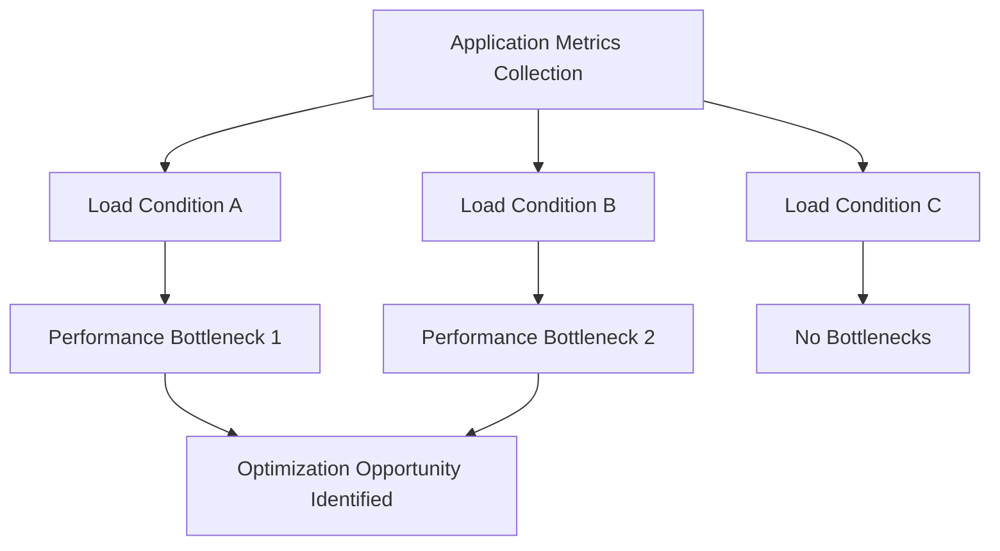
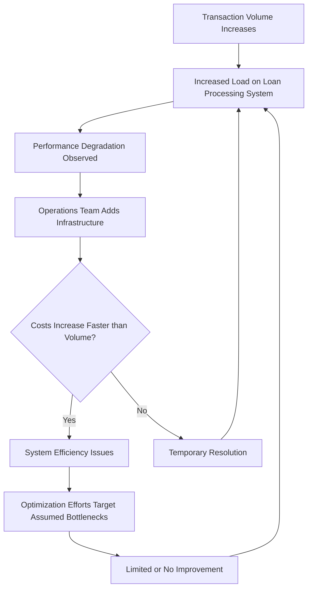
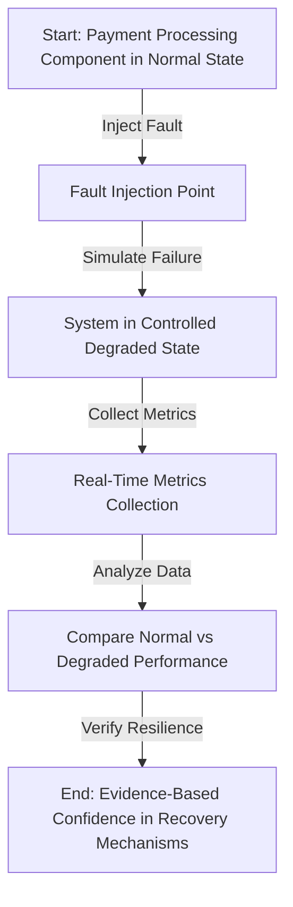
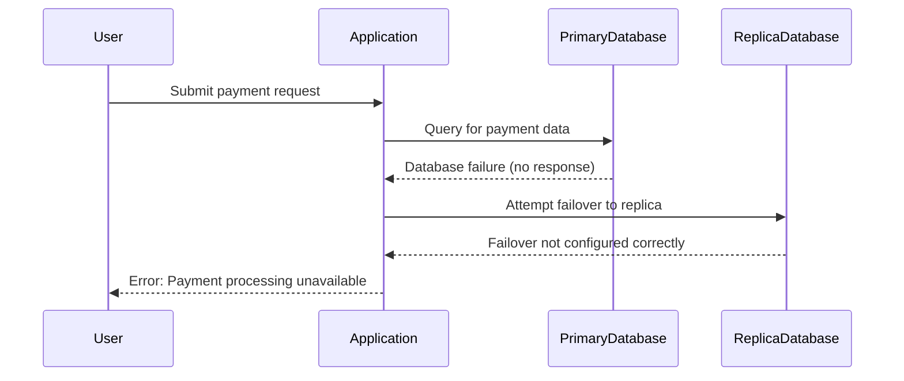
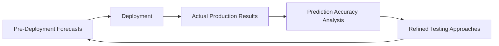

# Chapter 8: Metrics in CI/CD Pipeline

## Chapter Overview: Metrics in CI/CD Pipeline

This chapter slams the brakes on blind deployments by injecting metrics directly into the CI/CD pipeline. It’s not enough for your code to work—now it has to *perform*, *scale*, and *not wreck production*. You’ll learn how to trap regressions before they escape, launch changes with surgical precision, and convert chaos into resilience with metrics as your guide. Whether it’s a latency spike hiding in your PR or a canary deployment gasping under fraud detection load, this chapter turns your release pipeline into an observability gauntlet.

______________________________________________________________________

## Learning Objectives

By the end of this chapter, readers will be able to:

1. Integrate automated performance validation into CI/CD pipelines.
2. Deploy with confidence using metric-driven canary strategies.
3. Define and enforce performance budgets for system components.
4. Use deployment guardrails to detect and recover from emerging problems.
5. Apply performance profiling to pinpoint optimization opportunities.
6. Conduct chaos experiments with real-time metrics to verify resilience.
7. Create feedback loops that improve future release accuracy and testing.

______________________________________________________________________

## Key Takeaways

- **Functional Tests Are the Minimum, Not the Finish Line**: Your code may work, but does it *work well*?
- **Metrics Are Your Canary’s Nervous System**: No metrics, no signal, no rollback until it’s too late.
- **Performance Budgets Prevent Feature Bloat from Becoming Performance Rot**: Set limits before launch, or suffer the lag.
- **Guardrails Aren’t Just for Kids**: They’re how grown-up systems survive adult-sized traffic.
- **Profiling Isn’t Premature Optimization—It’s Preventive Clarity**: Know your limits before your users hit them.
- **Controlled Failure Is the Only Real Proof of Resilience**: If you haven’t tested your failover, you don’t have one.
- **Postmortems Without Feedback Are Just Digital Eulogies**: Compare, learn, improve—or keep making the same mistakes in more expensive ways.

> CI/CD without metrics is just "Ctrl+Ship and Pray." Let’s be better than that.

______________________________________________________________________

## Panel 1: The Prevented Outage

### Scene Description

The release pipeline is depicted as an automated system that blocks a code change which successfully passed functional tests but introduced a latency regression in payment processing. The visual representation includes a deployment pipeline with performance gates. These gates automatically compare the new code's performance metrics against established historical baselines, highlighting the regression.

Below is a simplified text-based representation of the pipeline:

```
Code Commit
    |
    v
Functional Tests  -->  Performance Gate
                           |
         Historical Baseline Comparison
                           |
          Regression Detected (Blocked)
                           |
         Developers Analyze Impact
```

The developers are shown collaboratively analyzing the flagged regression, using detailed metrics and comparisons provided by the pipeline. This proactive approach ensures performance issues are caught and addressed before the code reaches production.

### Teaching Narrative

Integrating metrics into the CI/CD pipeline shifts reliability measurement left in the development lifecycle, detecting potential issues before they reach production. By establishing performance baselines and automatically comparing new code against them, teams can identify regressions before they affect customers. For banking systems, where production issues directly impact financial transactions, these preventive measurements transform reliability from a reactive operational concern to a proactive development consideration.

### Common Example of the Problem

#### Incident Progression Timeline

Below is a step-by-step progression of how an undetected performance issue evolves into a customer-impacting outage:

1. **Code Change Submitted**

   - A developer submits a code change that includes a database query optimization.
   - The change passes all automated unit and functional tests in the CI/CD pipeline.

2. **Deployment to Production**

   - The code is deployed to production during evening hours, following the standard CI/CD process.
   - No performance validation is in place to detect potential regressions under real-world conditions.

3. **Initial Impact**

   - Under production load, the optimized query performs poorly, causing payment processing latency to increase from 0.8 seconds to over 4 seconds.
   - The issue goes unnoticed overnight as there are fewer users on the system.

4. **Customer Complaints**

   - By morning, the increased latency leads to noticeable delays in payment processing.
   - Customers begin contacting the support center, reporting failed or excessively slow transactions.

5. **Incident Investigation**

   - The engineering team is alerted to the issue and begins investigating.
   - They identify the new code as the root cause, specifically the database query optimization.

6. **Emergency Rollback**

   - The team performs an emergency rollback during business hours to mitigate the problem.
   - This rollback causes temporary transaction failures and disrupts services for thousands of customers.

7. **Reputation and Operational Impact**

   - The incident damages customer trust and creates significant operational stress for the team.
   - The post-incident analysis concludes that automated performance testing in the CI/CD pipeline could have prevented the outage entirely.

#### Text-Based Flow Diagram

```plaintext
Code Change Submitted
        ↓
Deployed to Production
        ↓
Latency Increases in Production
        ↓
Customer Complaints Begin
        ↓
Incident Investigation
        ↓
Emergency Rollback
        ↓
Customer Impact and Reputational Damage
```

By integrating automated performance validation into the deployment pipeline, such issues can be detected early, before they ever reach production. This proactive approach ensures smoother operations and prevents costly outages.

### SRE Best Practice: Evidence-Based Investigation

Implement comprehensive performance validation in the CI/CD pipeline by following these best practices:

#### Checklist for Performance Validation

| **Category** | **Best Practices** |
| ---------------------------------- | ----------------------------------------------------------------------------------------------------------------------------------------------------------------------------------------------------------------------------------------------- |
| **Automated Performance Testing** | - Create consistent performance test suites for critical paths<br>- Simulate load patterns matching production behaviors<br>- Execute tests progressively based on change risk<br>- Compare results against established baselines automatically |
| **Multi-dimensional Measurement** | - Test latency across different transaction types<br>- Validate throughput under various load conditions<br>- Profile resource utilization during tests<br>- Detect regressions across all critical dimensions |
| **Deployment Decision Automation** | - Define graduated responses based on performance impact<br>- Automatically block deployments for severe regressions<br>- Notify teams for borderline issues<br>- Establish exception processes for justified performance deviations |

#### Key Steps for Evidence-Based Investigation

1. **Define Performance Baselines**\
   Establish historical metrics for latency, throughput, and resource utilization as benchmarks.

2. **Integrate Testing into CI/CD**\
   Incorporate automated performance tests in pipeline stages to validate changes incrementally.

3. **Analyze Multi-dimensional Metrics**\
   Use dashboards or reports to compare test results across critical dimensions and identify anomalies.

4. **Automate Decision-Making**\
   Implement rules and thresholds for pipeline actions, such as blocking or notifying based on regression severity.

#### Impact of Pipeline-Integrated Performance Testing

- **87% of performance regressions** are caught before production deployment.
- This approach prevents customer impact and allows development teams to resolve issues early, transforming reliability from a reactive to a proactive discipline.

### Banking Impact

For payment systems, performance regressions directly affect both customer experience and transaction completion rates. Production-discovered performance issues create immediate business impact: abandoned transactions, increased support costs, and reputation damage that affects future usage decisions.

Consider a scenario where a 5% latency increase in payment processing leads to a 2% drop in transaction completion rates. For a major bank processing $10 billion in daily transactions, this could result in $200 million in lost transactions per day. Additionally, increased customer support inquiries stemming from failed payments could elevate operational costs by an estimated $50,000 daily, not to mention the long-term impact on customer trust and retention.

By shifting performance validation earlier in the development lifecycle, financial institutions can avoid these costly outcomes. Each prevented outage represents protected revenue, preserved customer trust, and avoided recovery costs. This proactive approach enables banks to maintain rapid innovation while ensuring reliability standards for critical customer-facing services.

### Implementation Guidance

1. **Create Automated Performance Test Suites for Critical Transaction Flows**\
   Design performance test cases that simulate real-world conditions for key business processes, such as payment processing or account updates. Ensure these tests can run automatically in your CI/CD pipeline.

   Example code snippet for a basic load test using `k6`:

   ```javascript
   import http from 'k6/http';
   import { check } from 'k6';

   export let options = {
       stages: [
           { duration: '1m', target: 100 }, // Ramp-up to 100 users
           { duration: '3m', target: 100 }, // Sustain 100 users
           { duration: '1m', target: 0 },   // Ramp-down
       ],
   };

   export default function () {
       let res = http.post('https://api.example.com/payment', {
           transactionId: '12345',
           amount: '100.50',
           currency: 'USD',
       });

       check(res, {
           'status is 200': (r) => r.status === 200,
           'response time < 500ms': (r) => r.timings.duration < 500,
       });
   }
   ```

2. **Implement Baseline Comparison with Statistical Significance Analysis**\
   Integrate performance gates to compare new test results with historical baselines. Use statistical thresholds (e.g., p-value < 0.05) to detect significant regressions.

   Sample logic for a performance gate in Python:

   ```python
   import numpy as np
   from scipy.stats import ttest_ind

   def check_performance_regression(new_data, baseline_data, threshold=0.05):
       t_stat, p_value = ttest_ind(new_data, baseline_data)
       if p_value < threshold:
           return "Regression detected"
       return "No significant regression"
   ```

3. **Develop Graduated Response Protocols Based on Regression Severity**\
   Define response levels (e.g., warn, block, escalate) based on how severe the regression is. For instance:

   - Minor latency increase: Notify developers.
   - Significant regression: Block deployment and require approval.
   - Critical regression: Escalate to SRE or architecture teams.

4. **Build Performance History Tracking Showing Trends Over Time**\
   Use a time-series database (e.g., Prometheus) to store metrics and visualize trends over time. This helps in identifying patterns and predicting potential bottlenecks.

   Example workflow in text format:

   ```
   [CI/CD Pipeline] --> [Performance Test] --> [Metrics Exporter] --> [Time-Series DB] --> [Dashboard]
   ```

5. **Establish Clear Ownership of Pipeline Performance Gates Across Development and Operations**\
   Assign responsibilities for maintaining and tuning performance gates. Create a RACI (Responsible, Accountable, Consulted, Informed) matrix to clarify roles, such as:

   ```
   | Task                     | Developer | SRE Team | QA Team |
   | ------------------------ | --------- | -------- | ------- |
   | Create performance tests | R         | C        | A       |
   | Monitor pipeline metrics | C         | R        | I       |
   | Investigate regressions  | A         | R        | C       |
   ```

## Panel 2: The Careful Rollout

### Scene Description

The team is deploying a high-risk change using a canary approach with metric-based evaluation criteria for a new fraud detection algorithm. The rollout follows a phased deployment process with real-time metric comparison between canary and baseline populations. Key decision points are based on performance data to ensure safety before proceeding further.

Below is a simplified representation of the deployment flow:

```
Baseline Traffic  (Existing System) ---> Compare Metrics ---> Decision: Proceed or Rollback
       |                                             |
       |                                             |
Canary Traffic  (New Algorithm) ---> Monitor Metrics ---> Decision: Adjust Canary Size or Halt
```

This flow illustrates how the canary deployment ensures controlled introduction of the change by continuously evaluating the performance of the new algorithm against the established baseline.

### Teaching Narrative

Canary deployment metrics enable controlled introduction of changes to production by measuring the impact of new code on a small subset of traffic before wider deployment. These comparative measurements track key indicators like error rates, latency, and business outcomes between canary and baseline populations, providing quantitative evidence of deployment safety. For critical banking functions like fraud detection, metric-driven canary deployments significantly reduce risk by verifying algorithm performance with real transactions before full implementation.

### Common Example of the Problem

A bank implements a new fraud detection algorithm designed to reduce false positives while maintaining detection effectiveness. Despite extensive testing in development environments, the team lacks confidence about how the algorithm will perform against real-world fraud patterns. Previous algorithm changes have sometimes created unexpected issues only visible in production, including both false negatives (missed fraud) and false positives (incorrectly blocked legitimate transactions).

Without a measured, incremental deployment approach, the team faces a difficult choice: either deploy to all customers at once and accept the risk of widespread issues, or delay the improvement to conduct extended testing while the current algorithm's problems continue affecting customers.

#### Key Risks and Impacts

| **Risk Type** | **Description** | **Potential Impact** |
| -------------------------- | --------------------------------------------------------------------------------------------- | ----------------------------------------------------------------------------------------------------------- |
| False Negatives | Fraudulent transactions are not detected. | Financial losses, reputational damage, and increased fraud activity. |
| False Positives | Legitimate transactions are incorrectly flagged as fraud. | Frustrated customers, increased support costs, and potential customer churn. |
| Production Instability | Algorithm introduces unforeseen performance or scalability issues in production environments. | Degraded user experience, increased error rates, and operational challenges for the engineering team. |
| Widespread Deployment Risk | Immediate release to all users without incremental validation. | High likelihood of widespread issues impacting all customers simultaneously, with limited rollback options. |

#### Checklist for Understanding the Problem

- [ ] Have real-world fraud patterns and edge cases been thoroughly analyzed?
- [ ] Are key metrics (e.g., false positive rate, false negative rate, latency) clearly defined and measurable?
- [ ] Have past production issues been reviewed to identify potential regression risks?
- [ ] Is there a plan for monitoring and comparing canary and baseline populations in real time?
- [ ] Are rollback mechanisms in place if the algorithm underperforms in production?

This structured approach highlights the critical risks and decisions facing teams deploying high-stakes changes like fraud detection algorithms. It underscores the importance of controlled, incremental deployment strategies in mitigating these risks.

### SRE Best Practice: Evidence-Based Investigation

Implement metric-driven canary deployment methodology:

1. **Phased Exposure Strategy**

   - Create controlled deployment to limited transaction population
   - Implement percentage-based traffic allocation
   - Develop cohort selection ensuring representative sampling
   - Build graduated expansion based on performance validation

   ```python
   # Pseudocode for phased exposure
   def phased_deployment(traffic_percentage, total_users):
       canary_population = int(total_users * traffic_percentage)
       baseline_population = total_users - canary_population
       return canary_population, baseline_population

   # Example usage
   canary, baseline = phased_deployment(0.1, 10000)  # 10% traffic to canary
   print(f"Canary population: {canary}, Baseline population: {baseline}")
   ```

2. **Comparative Measurement Framework**

   - Implement side-by-side metric comparison with baseline population
   - Create multi-dimensional evaluation across key indicators:
     - Technical metrics: latency, error rates, resource utilization
     - Business metrics: approval rates, false positive rates, customer friction
     - Risk metrics: fraud detection rates, loss prevention, suspicious pattern identification
   - Develop statistical significance validation for observed differences
   - Build automated anomaly detection for unexpected behavior patterns

   ```python
   # Example for comparative measurement
   def compare_metrics(canary_metrics, baseline_metrics):
       differences = {}
       for metric in canary_metrics:
           differences[metric] = canary_metrics[metric] - baseline_metrics.get(metric, 0)
       return differences

   # Example usage
   canary_metrics = {"latency": 120, "error_rate": 0.02}
   baseline_metrics = {"latency": 100, "error_rate": 0.01}
   metric_differences = compare_metrics(canary_metrics, baseline_metrics)
   print("Metric differences:", metric_differences)
   ```

3. **Metric-Driven Decision Process**

   - Create clear evaluation criteria with defined thresholds
   - Implement automatic progression/rollback based on metrics
   - Develop exception handling for unexpected patterns
   - Build stakeholder notification at key decision points

   ```python
   # Pseudocode for metric-driven decision
   def evaluate_canary(metrics, thresholds):
       for metric, value in metrics.items():
           if value > thresholds.get(metric, float('inf')):
               return "Rollback"
       return "Progress"

   # Example usage
   thresholds = {"latency": 110, "error_rate": 0.015}
   decision = evaluate_canary(metric_differences, thresholds)
   print(f"Deployment decision: {decision}")
   ```

Metric-driven canary analysis reveals that while the new algorithm successfully reduces false positives by 23% as intended, it also introduces a 15-millisecond latency increase that, while minor, would impact high-frequency trading applications if deployed universally—enabling targeted implementation that excludes latency-sensitive use cases.

### Banking Impact

For fraud detection systems, the deployment approach directly impacts both financial risk and customer experience. Traditional all-at-once deployments risk widespread issues, potentially affecting all customers simultaneously if problems emerge. In contrast, metric-driven canary deployments provide a controlled method to validate changes before full rollout, minimizing these risks.

#### Case Study: Canary Deployment for Fraud Detection Algorithm

A leading banking institution implemented a canary deployment for a new fraud detection algorithm. The canary population represented 5% of live transactions, while the baseline used the previous algorithm on the remaining 95%. Over a 48-hour period, key metrics were monitored:

- **False Positive Rate (FPR):** Reduced by 15% in the canary group, preserving an estimated 500 customer relationships.
- **False Negative Rate (FNR):** Improved by 10%, preventing approximately $250,000 in potential fraud losses.
- **Customer Support Tickets:** Decreased by 20% in the canary population compared to the baseline, reducing operational costs.

At the end of the evaluation period, the metrics confirmed the new algorithm outperformed the baseline, leading to a decision to proceed with full deployment. This approach not only mitigated financial risk but also improved customer trust and operational efficiency.

Metric-driven canary deployments enable risk-appropriate innovation, ensuring fraud detection capabilities are enhanced while safeguarding customer experience and minimizing potential negative consequences of algorithm changes.

### Implementation Guidance

#### Checklist for Canary Deployment Implementation

- [ ] **Create Standardized Framework**

  - Define the scope of critical systems requiring canary deployments.
  - Develop reusable templates and automation tools for deployment processes.

- [ ] **Set Up Comprehensive Metric Collection**

  - Identify key metrics (e.g., error rates, latency, transaction success rates).
  - Ensure consistent metric collection for both canary and baseline groups.
  - Validate metric accuracy and reliability in a staging environment.

- [ ] **Develop Comparison Methodology**

  - Establish statistical methods for comparing canary and baseline performance (e.g., A/B testing, control charts).
  - Define thresholds for acceptable performance variance.
  - Simulate comparisons with historical data before live use.

- [ ] **Automate Decision Systems**

  - Implement automated rollback mechanisms triggered by metric deviations.
  - Write deployment logic to pause or proceed based on predefined performance criteria.
  - Include alerts for manual intervention if automated systems detect anomalies.

- [ ] **Define Ownership and Escalation Processes**

  - Assign clear roles for deployment monitoring and decision-making.
  - Document escalation paths for resolving canary-related incidents.
  - Conduct regular training sessions for the team on canary deployment protocols.

#### Step-by-Step Canary Deployment Flow



## Panel 3: The Performance Budget

### Scene Description

Development and SRE teams are shown negotiating performance requirements for a new mobile banking feature. The scene focuses on metric budgets allocated to various application components, ensuring that latency, resource consumption, and error rates are within acceptable limits. Engineering constraints, such as system capacity and scalability, are also highlighted.

The following text-based representation illustrates the allocation process:

```
+-----------------------+       +---------------------+
|   Performance Budget  |       |   Engineering Team  |
|    (Overall Limits)   |       |  - SREs            |
|                       |       |  - Developers       |
+-----------------------+       +---------------------+
           |                               |
           v                               v
   +--------------------+        +---------------------+
   |  Latency Budget    |        |  Resource Budget    |
   |  (ms per request)  |        |  (CPU/Memory/IO)    |
   +--------------------+        +---------------------+
           |                               |
           v                               v
    +-----------------+           +--------------------+
    | Component A     |           | Component B        |
    | - 50ms          |           | - 100MB RAM        |
    +-----------------+           +--------------------+
           |                               |
           v                               v
  +------------------+         +-----------------------+
  | Error Budget     |         | System Constraints    |
  | (% failure rate) |         |  - Scalability        |
  +------------------+         |  - Load Tolerance     |
                                +-----------------------+
```

This representation clarifies how budgets are distributed across system components and aligned with engineering constraints to maintain consistent customer experience for the mobile banking application.

### Teaching Narrative

Performance budget metrics establish quantitative constraints on system behavior before development begins, creating clear engineering targets that preserve customer experience. These budgets allocate specific allowances for latency, resource consumption, and error rates across components, ensuring that new features don't degrade overall service quality. For mobile banking applications, where performance directly impacts adoption and usage, performance budgets ensure that customer experience remains consistent as features evolve.

### Common Example of the Problem

A bank's mobile team faces recurring performance challenges with each new release: features that work perfectly in isolation begin degrading overall application performance when combined. The latest release introduced a personalized offers feature that individually passed performance reviews but created unacceptable launch delays when integrated into the production app. Without a systematic approach to managing performance across features, each team optimizes individually without understanding their contribution to overall constraints. Customers experience increasingly slow application performance with each release, eventually abandoning the app for competitor solutions that provide similar functionality with better responsiveness.

#### Performance Metrics Example: Before and After Feature Integration

| Metric | Pre-Feature Integration | Post-Feature Integration | Budget Threshold | Status |
| ----------------------- | ----------------------- | ------------------------ | ---------------- | --------------- |
| App Launch Latency (ms) | 1,200 | 1,800 | 1,500 | Exceeded 🚨 |
| API Response Time (ms) | 300 | 400 | 350 | Exceeded 🚨 |
| Memory Usage (MB) | 150 | 200 | 250 | Within Budget ✅ |
| Error Rate (%) | 0.5 | 0.8 | 1.0 | Within Budget ✅ |

This table highlights the impact of the new personalized offers feature on key performance metrics. While some metrics remain within budget, the app launch latency and API response time exceed their allocated thresholds, directly contributing to customer dissatisfaction. Without a clear performance budget, such issues compound across releases, eroding user trust and retention.

### SRE Best Practice: Evidence-Based Investigation

Implement a comprehensive performance budgeting framework using the following steps and tools:

#### Checklist for Performance Budget Implementation:

1. **Top-level Experience Budgets**

   - [ ] Define maximum acceptable startup time for the application.
   - [ ] Set response time budgets for critical user interactions.
   - [ ] Establish resource utilization limits (e.g., memory, CPU, battery) on customer devices.
   - [ ] Define error rate constraints for key workflows.

2. **Component-level Budget Allocation**

   - [ ] Distribute budgets across application components based on their roles.
   - [ ] Create nested budgets for complex features with multiple dependencies.
   - [ ] Map interdependencies to identify shared constraints between components.
   - [ ] Visualize current budget allocation and consumption for better clarity.

3. **Budget Enforcement Mechanisms**

   - [ ] Automate budget validation in the CI/CD pipeline.
   - [ ] Set up alerting for budget variances during development and testing.
   - [ ] Analyze trends in budget consumption over time to identify risks early.
   - [ ] Define exception processes for justified budget adjustments.

#### Example: Automated Validation in CI/CD Pipeline

```yaml
stages:
  - test
  - validate_performance

validate_performance:
  stage: validate_performance
  script:
    - echo "Validating performance budgets..."
    - ./validate_budgets --latency=200ms --startup_time=2s --error_rate=0.01
  allow_failure: false
  only:
    - merge_requests
    - main
```

#### Key Insight:

Performance budget analysis revealed that the existing app had already consumed 92% of the acceptable startup time budget before the new feature was introduced. This critical constraint was not visible to feature developers without explicit budget allocation and real-time validation, highlighting the importance of automated visibility tools.

By following these structured steps and incorporating automated checks, teams can ensure performance budgets remain actionable and enforceable throughout the development lifecycle.

### Banking Impact

For mobile banking applications, performance directly affects both adoption rates and ongoing usage patterns. Slow-performing apps create immediate business impact: abandoned sessions, reduced feature utilization, decreased transaction volume, and ultimately customer attrition to better-performing alternatives. Performance budgets enable continuous feature evolution while protecting the core experience qualities that drive mobile banking adoption. Each preserved millisecond of performance maintains the competitive advantage of convenience that mobile banking offers compared to other channels.

### Implementation Guidance

To systematically implement performance budgets for your system, follow the steps below. Use the provided checklist to ensure completeness:

| Step | Description | Checklist |
| ---- | ------------------------------------------------------------------------------------------------------------------------------------------------------------------------------------------------------------- | ---------------------------------------------------------------------------------------------------------------------------------------------- |
| 1 | **Create experience-based performance requirements**: Define measurable performance targets for critical user journeys, focusing on latency, resource usage, and error rates that impact customer experience. | - [ ] Identify critical user journeys. <br> - [ ] Define measurable performance metrics. <br> - [ ] Validate with stakeholders. |
| 2 | **Implement component-level budget allocation framework**: Break down overall performance budgets into specific allocations for individual application components. | - [ ] Map out system components. <br> - [ ] Allocate budgets per component. <br> - [ ] Align allocations with system architecture. |
| 3 | **Develop automated budget validation in the CI/CD pipeline**: Integrate tools in your CI/CD pipeline to enforce performance budgets during development and deployment. | - [ ] Select validation tools. <br> - [ ] Configure CI/CD pipeline checks. <br> - [ ] Test validation workflows. |
| 4 | **Build budget trending analysis**: Implement monitoring to track performance budget consumption over time, identifying trends and potential risks early. | - [ ] Set up monitoring for budget usage. <br> - [ ] Define alert thresholds. <br> - [ ] Review trends regularly with teams. |
| 5 | **Establish governance processes**: Create policies for managing budget allocation, handling exceptions, and ensuring accountability across teams. | - [ ] Document budget governance policies. <br> - [ ] Define exception handling procedures. <br> - [ ] Assign ownership for budget compliance. |

By following this structured approach, teams can effectively integrate performance budgets into their workflows, ensuring sustainable performance and a seamless customer experience.

## Panel 4: The Deployment Guardrails

### Scene Description

The SRE team is implementing automated deployment safety checks with metric-based rollback triggers for a core banking system update. The process is structured around monitoring gates set at progressive deployment stages, each equipped with automated decision points that evaluate real-time performance metrics to ensure safety and stability.

Below is a visual representation of the deployment process using monitoring gates and decision points:



This diagram illustrates how each stage of the deployment is gated by automated checks. If metrics indicate an issue, the system triggers a rollback to the previous safe state, minimizing risk to the core banking system and ensuring customer impact is avoided.

### Teaching Narrative

Deployment guardrail metrics automate safety checks during the release process, using real-time measurements to detect problems and trigger appropriate responses. These guardrails transform deployment from a binary go/no-go decision to an intelligent process that continuously evaluates impact and adjusts accordingly. For high-risk banking system changes, these metric-based protections create essential safety nets that prevent customer impact if unexpected issues emerge during deployment.

### Common Example of the Problem

A bank's core system team deploys a major update to transaction processing services during a weekend maintenance window. The deployment passes all pre-production validations, and initial smoke tests show the system functioning correctly. However, the following sequence of events illustrates how issues can still arise without automated deployment guardrails:

```plaintext
1. Deployment: Team completes the update and verifies initial success during the maintenance window.
2. Latent Issue Emergence: Under real customer load, a performance degradation appears as transaction volumes rise during the start of the business day in Asian markets.
3. Detection Delay: Without automated metric monitoring, the subtle degradation remains undetected as it worsens.
4. Customer Impact: European markets open, transaction failures occur, and customers experience widespread disruptions.
5. Emergency Response: The SRE team is called in over the weekend to diagnose and mitigate the issue.
```

This timeline highlights the critical need for continuous, automated monitoring and rollback mechanisms. Without guardrails in place, the delay in detecting and addressing performance issues can lead to significant customer impact and unplanned emergency responses.

### SRE Best Practice: Evidence-Based Investigation

Implement a comprehensive deployment guardrail framework to ensure safe and reliable releases. Use the checklist below to guide the setup and evaluation of your deployment safety mechanisms.

#### Checklist: Deployment Guardrail Best Practices

1. **Progressive Exposure Metrics**

   - [ ] Create a phased rollout strategy with incrementally increasing traffic exposure.
   - [ ] Implement health validation at each expansion stage.
   - [ ] Develop comparative metrics against baseline performance.
   - [ ] Build automatic progression/pause mechanisms based on real-time measurements.

2. **Multi-dimensional Validation**

   - [ ] Monitor performance metrics along all critical paths.
   - [ ] Implement error rate tracking with statistical significance analysis.
   - [ ] Develop resource utilization monitoring with defined threshold validations.
   - [ ] Verify business outcomes using success rate metrics tied to key objectives.

3. **Automated Response System**

   - [ ] Build graduated response mechanisms tailored to deviation severity.
   - [ ] Set up automatic rollback triggers for critical issues.
   - [ ] Develop traffic routing adjustments for borderline or recoverable cases.
   - [ ] Establish a notification workflow with clear escalation paths.

#### Example Insight: Metric-Based Analysis in Action

Metric-based deployment analysis can uncover patterns invisible to manual checks. For instance, under increasing load, connection pool utilization might grow non-linearly, reaching critical thresholds only when transaction volumes exceed 40% of peak. Such conditions, often missed during testing, would be detected and mitigated by automated guardrails.

By following this checklist, teams can systematically build robust safety nets that minimize risk and ensure reliable deployments in high-stakes environments such as core banking systems.

### Banking Impact

For core banking systems, deployment safety is as critical as having airbags and anti-lock brakes in a car. Just as those safety features detect and mitigate risks in real-time to protect passengers, deployment guardrails continuously monitor system performance to safeguard operations. Traditional deployment approaches, much like driving without these safety features, leave systems vulnerable to unexpected behavior under real-world conditions—potentially jeopardizing critical financial transactions across markets and customer segments.

Each prevented deployment incident is akin to avoiding a collision: it preserves business continuity, protects customer trust, and eliminates costly emergency interventions. Metric-based guardrails act as these essential safety mechanisms, enabling confident and secure evolution of critical systems by rapidly detecting and responding to emerging issues before they escalate into widespread impact.

### Implementation Guidance

| Step | Intended Outcome or Benefit |
| --------------------------------------------------------------------------- | --------------------------------------------------------------------------------------------------------------- |
| 1. Create comprehensive metric collection for deployment monitoring | Ensures real-time visibility into performance, reliability, and potential issues during and after deployment. |
| 2. Implement phased rollout strategy with automated progression rules | Minimizes risk by gradually releasing changes, allowing early detection of issues before full deployment. |
| 3. Develop multi-dimensional health validation across system aspects | Validates system stability by analyzing multiple facets such as latency, error rates, and resource utilization. |
| 4. Build automated response systems with appropriate escalation | Enables prompt, consistent responses to anomalies, reducing mean time to recovery (MTTR) and customer impact. |
| 5. Establish clear ownership of deployment decisions and exception handling | Ensures accountability and streamlined resolution during edge cases or when manual intervention is required. |

## Panel 5: The Performance Profile

### Scene Description

The performance engineering team is analyzing application metrics across different load conditions to identify optimization opportunities in the loan processing system. A visual representation of the multi-dimensional performance analysis helps illustrate how system behavior changes under varying conditions, making bottlenecks and resource constraints more apparent. Below is a conceptual depiction of the analysis process:



The diagram above captures how metrics are collected and analyzed across different load conditions. Each condition reveals potential bottlenecks or optimal performance states, guiding the team to target specific areas for improvement.

### Teaching Narrative

Performance profiling metrics create comprehensive visibility into application behavior across different conditions by collecting detailed measurements throughout the technology stack. This deep instrumentation enables teams to identify optimization opportunities, predict scaling limits, and understand complex interactions between components. For loan processing systems, comprehensive performance profiling guides optimization efforts to the areas that will most improve customer experience and operational efficiency.

### Common Example of the Problem

A bank's loan processing platform performs adequately under current conditions but faces scalability concerns as volume grows. The operations team has addressed capacity challenges by continuously adding infrastructure, but costs are growing disproportionately faster than transaction volume, indicating fundamental inefficiencies. Attempts at optimization have been largely ineffective because they focus on components that engineers assume are problematic rather than on measured bottlenecks.

The absence of comprehensive performance profiling leaves the team without visibility into how the system behaves under varying conditions. This lack of insight prevents targeted optimization and increases the risk of performance failures as volume continues to rise.

Below is a simplified representation of the problem flow:



This flow illustrates the cyclical nature of the problem. Without detailed metrics from performance profiling, the team is unable to break the cycle and target the true bottlenecks, leading to escalating costs and inefficiencies.

### SRE Best Practice: Evidence-Based Investigation

To implement systematic performance profiling across conditions, follow the steps outlined below to ensure a structured and actionable approach:

| **Step** | **Action** | **Objective** |
| --------------------------------------- | ------------------------------------------------------------------------------------------ | ---------------------------------------------------------------------------- |
| **1. Comprehensive Instrumentation** | | |
| - Code-level performance measurement | Integrate detailed profiling within the codebase. | Gain granular visibility into execution times and resource usage. |
| - Database query analysis | Use execution plans to analyze and optimize query performance. | Detect and resolve inefficient database operations. |
| - Service interaction timing | Measure and correlate timing across service dependencies. | Understand latency contributors across services. |
| - Resource utilization profiling | Monitor CPU, memory, I/O, and network usage across infrastructure. | Identify and address resource contention or inefficiencies. |
| **2. Multi-condition Testing** | | |
| - Variable load testing | Conduct progressive scaling tests under varying load levels. | Assess system behavior and limits under different traffic conditions. |
| - Data volume sensitivity | Test system behavior with varying data volumes. | Identify performance degradation patterns related to data growth. |
| - Concurrency impact measurement | Simulate different levels of concurrent user activity. | Understand how concurrency affects processing times and resource allocation. |
| - Environmental variation testing | Test performance across different environments (e.g., staging, production, cloud regions). | Validate consistent performance in diverse deployment scenarios. |
| **3. Bottleneck Identification** | | |
| - Resource constraint discovery | Perform saturation testing to pinpoint constrained resources. | Expose system limits to guide targeted optimization efforts. |
| - Hot spot analysis | Identify areas of concentrated execution or inefficiency. | Focus optimization on high-impact parts of the system. |
| - Scalability limitation identification | Analyze scalability gaps and barriers to growth. | Prioritize fixes where they will most enhance scalability. |
| - Efficiency opportunity ranking | Rank optimization opportunities by their potential impact. | Maximize performance gains with focused resource investments. |

#### Practical Insight:

Performance profiling often uncovers unexpected bottlenecks. For example, while engineers may initially focus on database optimization, systematic profiling under varying conditions might reveal that document processing serialization is the true limiting factor under increased load. This highlights the importance of evidence-based investigation for accurate root cause identification and effective optimization.

### Banking Impact

For loan processing, performance efficiency directly affects both customer experience and operational cost. Unidentified bottlenecks create risks of processing delays and capacity limitations that extend decision timeframes and reduce application completion rates. For example, a performance profiling exercise identified a bottleneck in database query handling that added an average of 2 seconds to each loan application step. By optimizing the query logic and indexing strategy, the team reduced this delay to 500 milliseconds. This improvement resulted in a 15% increase in application completion rates, saving the bank an estimated $250,000 annually in lost opportunities and operational overhead.

Each optimization opportunity represents potential improvement in both customer satisfaction through faster processing and cost efficiency through better resource utilization. Comprehensive profiling enables evidence-based improvement prioritization that focuses engineering efforts where they will create maximum business benefit rather than on perceived issues.

### Implementation Guidance

1. **Implement comprehensive instrumentation across application layers**\
   Use an instrumentation library such as OpenTelemetry to capture detailed metrics and traces throughout the technology stack. Below is an example of setting up instrumentation for a Python application:

   ```python
   from opentelemetry import trace
   from opentelemetry.sdk.trace import TracerProvider
   from opentelemetry.sdk.trace.export import BatchSpanProcessor
   from opentelemetry.exporter.otlp.proto.grpc.trace_exporter import OTLPSpanExporter

   # Set up the tracer provider
   trace.set_tracer_provider(TracerProvider())
   tracer = trace.get_tracer(__name__)

   # Configure exporter and processor
   span_processor = BatchSpanProcessor(OTLPSpanExporter(endpoint="http://localhost:4317"))
   trace.get_tracer_provider().add_span_processor(span_processor)

   # Example usage
   with tracer.start_as_current_span("process_loan_request") as span:
       span.set_attribute("customer_id", "12345")
       span.set_attribute("request_amount", 50000)
       # Simulate some work
       print("Processing loan request...")
   ```

2. **Create structured load testing framework with variable conditions**\
   Use tools like Apache JMeter, Locust, or k6 to simulate different load scenarios. For example, a Locust script to test loan processing API under varying user loads:

   ```python
   from locust import HttpUser, task, between

   class LoanProcessingUser(HttpUser):
       wait_time = between(1, 5)

       @task
       def process_loan(self):
           self.client.post("/process-loan", json={
               "customer_id": "12345",
               "loan_amount": 50000
           })
   ```

   Run the script with different user counts and ramp-up times to observe system behavior.

3. **Develop bottleneck identification methodology with impact quantification**\
   Use profiling tools such as Flamegraphs (e.g., `py-spy` for Python) or APM solutions (e.g., Dynatrace, New Relic) to identify bottlenecks. For example, generate a Flamegraph from a Python application:

   ```bash
   py-spy record -o profile.svg -- python app.py
   ```

   Use the generated `profile.svg` to visually identify time-consuming code paths.

4. **Build visualization tools showing system behavior across conditions**\
   Leverage visualization frameworks like Grafana to create dashboards for metrics such as response times, throughput, and error rates. A sample PromQL query for Grafana to monitor average response time:

   ```
   avg(rate(http_request_duration_seconds_sum[5m])) / avg(rate(http_request_duration_seconds_count[5m]))
   ```

   Combine with heatmaps or time series to expose performance trends under varying loads.

5. **Establish regular profiling as part of continuous improvement processes**\
   Integrate profiling and load testing into CI/CD pipelines. For example, using GitHub Actions to trigger load tests automatically:

   ```yaml
   name: Load Test

   on:
     push:
       branches:
         - main

   jobs:
     load-test:
       runs-on: ubuntu-latest
       steps:
         - name: Check out code
           uses: actions/checkout@v3

         - name: Run Locust
           run: |
             locust --headless -f locustfile.py -u 100 -r 10 --run-time 10m
   ```

   Ensure profiling results are reviewed during sprint retrospectives to continuously identify optimization opportunities.

## Panel 6: The Chaos Experiment

### Scene Description

The team is shown conducting controlled failure testing to validate the resilience of the payment processing component. This process involves deliberate fault injection to simulate various failure scenarios. Real-time metrics are collected to measure the system's response, capturing performance data during both normal operation and controlled degradation.

To better illustrate this process, the following diagram represents the workflow of fault injection and metric collection during the experiment:



This diagram highlights the sequence of actions, from initiating the fault injection to analyzing the collected metrics. By visually mapping the process, it becomes easier to understand how resilience is verified through deliberate chaos experimentation.

### Teaching Narrative

Chaos engineering metrics apply scientific measurement to system reliability by quantifying behavior during controlled failure conditions. These measurements verify resilience capabilities by comparing system performance during normal operation versus degraded states, creating evidence-based confidence in recovery mechanisms. For payment systems, where resilience is critical during real failures, these metrics provide assurance that redundancy, failover, and recovery capabilities will function as expected during actual incidents.

### Common Example of the Problem

A bank implements high-availability design for payment processing with redundant components, automatic failover, and load balancing. On paper, the architecture should provide resilient operation even during component failures. However, when a production database issue occurs, the failover mechanism fails to activate correctly, creating an extended outage despite the supposedly resilient design.

The fundamental problem is untested recovery: while redundancy exists architecturally, the actual behavior during failure conditions has never been verified under realistic scenarios. Without controlled failure testing, theoretical resilience remains unproven until actual incidents occur—precisely when reliability is most critical.

#### Sequence of Events During the Failover Issue



This sequence illustrates how a failure in the primary database, combined with an untested failover mechanism, leads to a cascading failure that disrupts payment processing. Controlled failure testing can simulate such scenarios to identify and mitigate these issues before they occur in production.

### SRE Best Practice: Evidence-Based Investigation

Implement structured chaos engineering with comprehensive measurement to validate system resilience. Use the following checklist to guide your process:

#### Chaos Engineering Execution Checklist

1. **Controlled Experiment Design**

   - [ ] Identify realistic failure scenarios through risk analysis.
   - [ ] Plan progressive fault injection with increasing complexity.
   - [ ] Define experimental controls to enforce safety boundaries.
   - [ ] Automate experiment execution with validation gates.

2. **Multi-dimensional Measurement**

   - [ ] Collect technical metrics during degraded conditions (e.g., latency, error rates).
   - [ ] Assess customer impact during failure scenarios (e.g., user experience, SLAs).
   - [ ] Measure recovery times across various fault conditions.
   - [ ] Calculate resilience scores based on quantitative data.

3. **Systemic Improvement Process**

   - [ ] Perform gap analysis using experiment findings to identify weaknesses.
   - [ ] Prioritize remediation efforts for critical vulnerabilities.
   - [ ] Track resilience trends over time to measure improvement progress.
   - [ ] Document system behavior patterns and experiment outcomes in a knowledge base.

#### Example Insight from Chaos Experimentation

During a database failover test, metrics revealed that while the failover mechanism functionally succeeded, the 47-second transition caused transaction failures. This vulnerability highlights the need for improved handling during failovers—an insight only uncovered through controlled chaos experimentation.

By following this checklist, teams can ensure structured, evidence-based investigations that lead to actionable resilience improvements.

### Banking Impact

For payment systems, resilience verification directly affects both operational risk and recovery effectiveness. Untested recovery mechanisms often fail during actual incidents, extending outages and increasing customer impact when reliability matters most. Each identified resilience gap represents an opportunity to prevent future outages or minimize their impact through improved handling. Evidence-based chaos engineering transforms theoretical reliability into proven resilience, ensuring that when inevitable component failures occur, systems respond as designed to protect critical financial transactions.

### Implementation Guidance

| Step | Objective | Expected Outcome |
| ---- | -------------------------------------------------------------------------------- | ------------------------------------------------------------------------------------------------------------------- |
| 1 | Create comprehensive chaos engineering framework with safety protocols | Establish a controlled environment to conduct failure testing safely, minimizing risks to production systems. |
| 2 | Implement detailed metric collection during experiment execution | Ensure all relevant system behaviors are captured during tests to provide actionable insights into failure impacts. |
| 3 | Develop resilience scoring methodology based on quantitative measurements | Quantify system reliability and resilience, enabling objective comparison between normal and degraded states. |
| 4 | Build knowledge management system capturing behavioral insights | Facilitate knowledge sharing and historical reference for system behavior under various failure conditions. |
| 5 | Establish regular resilience verification as part of system lifecycle management | Integrate chaos testing into ongoing operational processes to maintain and improve system reliability over time. |

## Panel 7: The Feedback Loop

### Scene Description

The scene depicts a post-deployment review meeting where the team examines metrics to evaluate the impact of a major system change. The discussion focuses on comparing pre-deployment forecasts with actual production results to assess prediction accuracy and identify areas for improvement. Below is a conceptual representation of the comparison process:



This feedback loop illustrates how insights from actual results feed back into refining forecasts and testing strategies, fostering continuous improvement.

### Teaching Narrative

Deployment feedback metrics create a continuous learning cycle by comparing pre-deployment predictions with actual post-deployment results. This systematic analysis helps teams refine their testing approaches, improve prediction accuracy, and build institutional knowledge about system behavior. For banking systems, where accurate performance prediction directly impacts business risk management, these feedback metrics enable progressively more reliable deployments through evidence-based improvement.

### Common Example of the Problem

A bank deploys a reimplemented payment authorization service after extensive performance testing that predicted 30% improved throughput and 45% reduced latency. Initial production monitoring confirms some improvement, but the results fall significantly below expectations: only a 12% throughput increase and an 18% latency reduction. Without structured feedback analysis, the team simply accepts these results without understanding the prediction gap. This missed learning opportunity perpetuates testing limitations, allowing future performance predictions to remain equally inaccurate. Each inaccurate forecast creates deployment surprises that affect capacity planning, customer experience expectations, and business case justifications for future improvements.

#### Predicted vs. Actual Metrics Table

| Metric | Predicted Value | Actual Value | Deviation (Difference) |
| ------------------- | --------------- | ------------ | ---------------------- |
| Throughput Increase | 30% | 12% | -18% |
| Latency Reduction | 45% | 18% | -27% |

This table highlights the measurable gap between the predicted and actual performance metrics. By systematically analyzing such discrepancies, teams can identify testing blind spots and refine their predictive models. For instance, understanding whether the missed predictions stem from unaccounted-for production variables, incomplete test coverage, or overly optimistic assumptions can reveal actionable insights. Over time, this process builds a feedback loop that improves both testing accuracy and the reliability of deployment outcomes.

### SRE Best Practice: Evidence-Based Investigation

Implement comprehensive deployment feedback analysis with actionable steps to ensure systematic improvement. Use this checklist to guide evidence-based investigation:

#### Checklist: Evidence-Based Investigation Steps

1. **Prediction Comparison Framework**

   - [ ] Create structured documentation of pre-deployment forecasts.
   - [ ] Implement consistent measurement of actual results.
   - [ ] Perform variance analysis with statistical significance.
   - [ ] Compare results systematically across multiple dimensions (e.g., latency, throughput, error rates).

2. **Gap Analysis Methodology**

   - [ ] Investigate root causes for significant variances.
   - [ ] Evaluate testing environments for discrepancies against production systems.
   - [ ] Analyze workload patterns to identify key differences.
   - [ ] Develop actionable recommendations for improving modeling accuracy.

3. **Continuous Improvement Process**

   - [ ] Establish a knowledge capture system for documenting prediction learnings.
   - [ ] Conduct trend analysis to track forecast accuracy over time.
   - [ ] Prioritize testing enhancements based on identified gaps.
   - [ ] Integrate feedback into future prediction frameworks for iterative improvement.

#### Example Insight from Feedback Analysis

Feedback analysis revealed a critical limitation: the performance environment failed to simulate the production database's storage subsystem behavior under concurrent write loads. This issue, identified across multiple deployments, highlights the need for test environment upgrades. Addressing this limitation ensures more reliable testing and deployment outcomes moving forward.

### Banking Impact

For banking systems, prediction accuracy directly affects both deployment risk management and business planning. Inaccurate performance forecasts create capacity surprises, unrealized business benefits, and potential customer impact when systems behave differently than expected. Each improvement in prediction quality represents reduced operational risk and more accurate business planning for future changes. Systematic feedback analysis transforms deployment from isolated events into a continuous learning process that progressively improves the organization's ability to evolve critical systems safely and predictably.

### Implementation Guidance

1. **Create standardized prediction documentation for all significant changes**

   - Ensure each deployment includes a detailed prediction document outlining key performance metrics, expected outcomes, and underlying assumptions. Use templates to maintain consistency across teams.

2. **Implement structured measurement of actual production results**

   - Automate the collection of post-deployment performance metrics. Use monitoring tools to track these metrics against the predictions in real time.

3. **Develop variance analysis methodology with root cause investigation**

   - Establish a clear process for comparing predicted and actual results. Use statistical methods or automated scripts to calculate variance and identify significant deviations.
   - Example Python snippet for variance calculation:

   ```python
   import pandas as pd

   # Sample data: predictions vs actual results
   data = {'Metric': ['Response Time', 'Throughput', 'Error Rate'],
           'Predicted': [150, 1200, 0.01],
           'Actual': [160, 1100, 0.015]}

   df = pd.DataFrame(data)

   # Calculate variance and percentage error
   df['Variance'] = df['Actual'] - df['Predicted']
   df['Percent_Error'] = (df['Variance'] / df['Predicted']) * 100

   print(df)
   ```

   Output:

   ```
          Metric  Predicted  Actual  Variance  Percent_Error
   0  Response Time       150     160       10       6.666667
   1     Throughput      1200    1100     -100      -8.333333
   2     Error Rate      0.01   0.015    0.005      50.000000
   ```

4. **Build knowledge management system capturing prediction insights**

   - Use a centralized system (e.g., a Confluence space or database) to document learnings from each deployment. Include variance analysis results, root cause findings, and actionable improvements for future predictions.

5. **Establish feedback review as a mandatory post-deployment activity**

   - Schedule recurring post-deployment review meetings to analyze feedback metrics and discuss improvement opportunities. Use the following workflow to guide the discussion:

   ```mermaid
   graph TD
       A[Deployment Complete] --> B[Collect Metrics]
       B --> C[Compare Predicted vs Actual Results]
       C --> D[Perform Variance Analysis]
       D --> E[Identify Root Causes]
       E --> F[Document Findings in Knowledge Base]
       F --> G[Update Testing & Prediction Strategies]
       G --> H[Prepare for Next Deployment]
   ```
