# Chapter 9: Banking-Specific Metrics

## Chapter Overview: Banking-Specific Metrics

This chapter is where SRE metrics put on a pinstripe suit and start talking about fraud, liquidity, and audit trails. Generic monitoring won’t cut it here—this is where your dashboards need to understand finance as well as they understand uptime. From the Black Friday card bottlenecks to the compliance officer’s favorite kind of bedtime reading (audit trail completeness), this chapter tackles the high-stakes, heavily regulated, and money-moving specifics of banking observability.

______________________________________________________________________

## Learning Objectives

By the end of this chapter, readers will be able to:

1. Design throughput and bottleneck metrics for financial transaction flows.
2. Balance fraud detection with customer experience using precision/recall analysis.
3. Implement predictive metrics for batch processing completion.
4. Build audit trail completeness, integrity, and access metrics.
5. Visualize and manage regulatory reporting readiness.
6. Monitor money movement for settlement, liquidity, and exception handling.
7. Integrate security metrics across protection, vulnerability, and operations.

______________________________________________________________________

## Key Takeaways

- **Banking Metrics Speak in Dollars and Deadlines**: Missing a batch job isn’t just an ops failure—it’s a regulatory offense.
- **Throughput Isn’t Just Volume—It’s a Funnel**: Every blocked card transaction during a shopping peak is a lost sale *and* a customer complaint.
- **False Positives Are Expensive in Emotion, Not Just Revenue**: Declining legit transactions is how you lose trust you can’t buy back.
- **If You Can’t Predict It, You Can’t Prevent It**: Batch job slippage should never be a surprise.
- **Audit Metrics Are the Evidence You Didn’t Screw Up**: No logs? No integrity? No defense.
- **Compliance Isn’t a Checkbox—It’s a Calendar**: Late filings make regulators grumpy. Nobody wants a grumpy regulator.
- **Liquidity Visibility Is Table Stakes**: You can’t manage what you can’t see settling.
- **Security Posture Metrics Shouldn’t Be a Secret**: Measure protection, patching, and privilege—or pray quietly and hope nothing happens.

> Welcome to metrics with money, law, and customer trust on the line. Don’t blink.

______________________________________________________________________

## Panel 1: The Black Friday Survival

### Scene Description

The team is gathered to prepare for the peak shopping season, analyzing a transaction funnel metrics dashboard. The dashboard displays key data from the previous year's credit card authorization flow, including identified bottlenecks, hourly transaction volume patterns, and capacity thresholds. A visual representation of the dashboard might look as follows:

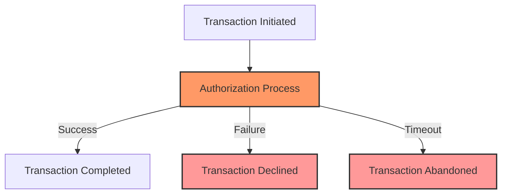

Highlighted areas on the dashboard show historical bottleneck points, such as increased timeout rates in the authorization stage, with clear thresholds indicating system capacity limits. Team members are actively discussing these insights to develop mitigation strategies for the anticipated transaction peaks, ensuring optimized flow and reduced friction during high-traffic periods.

### Teaching Narrative

Transaction throughput metrics provide essential visibility into the volume, pattern, and completion rates of financial operations. Unlike general application traffic measurements, these specialized metrics track monetary flows through processing stages, identifying bottlenecks, abandonment points, and capacity limits. For credit card authorization during peak shopping periods, comprehensive throughput metrics enable precise capacity planning and optimization of the most constrained processing components.

### Common Example of the Problem

A bank's card authorization team faces recurring challenges during Black Friday shopping peaks. Despite significant infrastructure investments, the system struggles with authorization volumes that exceed 300% of normal daily patterns. Previous peak events have created authorization delays and intermittent declines despite monitoring showing adequate capacity. The disconnect exists because current metrics track only aggregate transaction volumes without visibility into the complete processing funnel.

During doorbuster sales, authorization requests spike, and specific processing stages become bottlenecks while overall capacity appears sufficient. Without stage-by-stage throughput metrics, the team cannot identify exactly where transactions queue during peak periods, leading to repeated optimization efforts that miss the actual constraints.

The following text-based flowchart illustrates the typical stages of the credit card authorization process and highlights where bottlenecks commonly occur:

```
Transaction Initiated
    |
    v
Transaction Received by Gateway
    |
    v
Fraud Check
    |
    v
Authorization Request Sent to Bank
    |                (Bottleneck often occurs here)
    v
Bank Processing
    |                (Occasional delays here during peak)
    v
Authorization Response Returned
    |
    v
Transaction Completed
```

This flow demonstrates how transactions progress through the system and where potential bottlenecks can arise. For example, bottlenecks frequently occur at the "Authorization Request Sent to Bank" stage due to insufficient throughput in upstream connections or processing inefficiencies. However, without granular metrics at each stage, identifying these exact points becomes extremely challenging, leading to misdirected optimization efforts.

### SRE Best Practice: Evidence-Based Investigation

Implement comprehensive transaction funnel metrics across the authorization pipeline to ensure accurate bottleneck identification and capacity planning. Use the following checklist to guide your implementation:

| Best Practice | Action Steps | Benefits |
| ---------------------------------------------- | ------------------------------------------------------------------------------------------------------------------------------------------------------------------------------------------------------------------------------------------------------------------------------------------------------------------------------------------------------------------------------------------------------------------------------------------------------------ | -------------------------------------------------------------------------------------------------------------------------------------------- |
| **Stage-by-Stage Throughput Measurement** | - Track per-second volume at each stage:<br> - Initial request receipt and validation<br> - Cardholder verification and authentication<br> - Fraud risk assessment and scoring<br> - Available balance verification<br> - Merchant category validation<br> - Final authorization decision and response<br> - Monitor queue depths between stages<br> - Measure processing rates showing capacity constraints<br> - Analyze throughput trends over time | - Pinpoint specific stages with slowdowns<br> - Identify capacity bottlenecks<br> - Enable proactive scaling or optimization efforts |
| **Multi-dimensional Transaction Segmentation** | - Segment transaction volume by:<br> - Card type<br> - Channel<br> - Merchant category<br> - Geographic distribution | - Understand traffic diversity<br> - Reveal patterns or anomalies per segment<br> - Prioritize optimizations for high-impact segments |
| **Capacity Constraint Identification** | - Use ratio analysis to identify stage-to-stage bottlenecks<br> - Develop saturation metrics for processing components<br> - Create leading indicators for approaching constraints<br> - Perform what-if modeling for capacity planning | - Detect early signs of system strain<br> - Evaluate the impact of peak load scenarios<br> - Ensure sufficient capacity ahead of peak events |

#### Example Bottleneck Analysis

Detailed funnel analysis reveals critical insights: while the overall system handles average volume adequately, the fraud scoring service becomes saturated first during peak periods. This creates a processing bottleneck that affects all subsequent stages—a pattern invisible in aggregate throughput metrics.

By following the checklist above, teams can isolate and address specific constraints while ensuring the system remains resilient during peak transaction loads.

### Banking Impact

For card authorization services, throughput constraints directly affect both revenue generation and customer satisfaction. Each declined transaction due to capacity limitations represents lost interchange revenue, potential customer frustration, and possible permanent shifts to competitor cards. During peak shopping periods, these impacts multiply as customers actively use cards for significant purchases and immediately notice authorization failures.

#### Quantitative Example:

During the previous year's Black Friday event, a global payment processor experienced a 2% transaction decline rate due to authorization bottlenecks. This resulted in approximately $3.5 million in lost interchange fees over a 24-hour period, based on an average transaction value of $70 and a 1.5% interchange fee rate. Additionally, customer feedback surveys indicated a 15% increase in dissatisfaction among affected users, with 8% reporting they would switch their primary card due to repeated failures.

Comprehensive throughput metrics enable precise capacity planning and targeted optimization to prevent such issues. For example, by identifying that 60% of the bottlenecks occurred during the fraud-checking stage, the processor deployed additional fraud-checking nodes and adjusted thresholds for low-risk transactions. These measures reduced peak-time decline rates to 0.5% in subsequent high-traffic events, preserving both revenue and customer trust.

#### Flow Impact Representation:

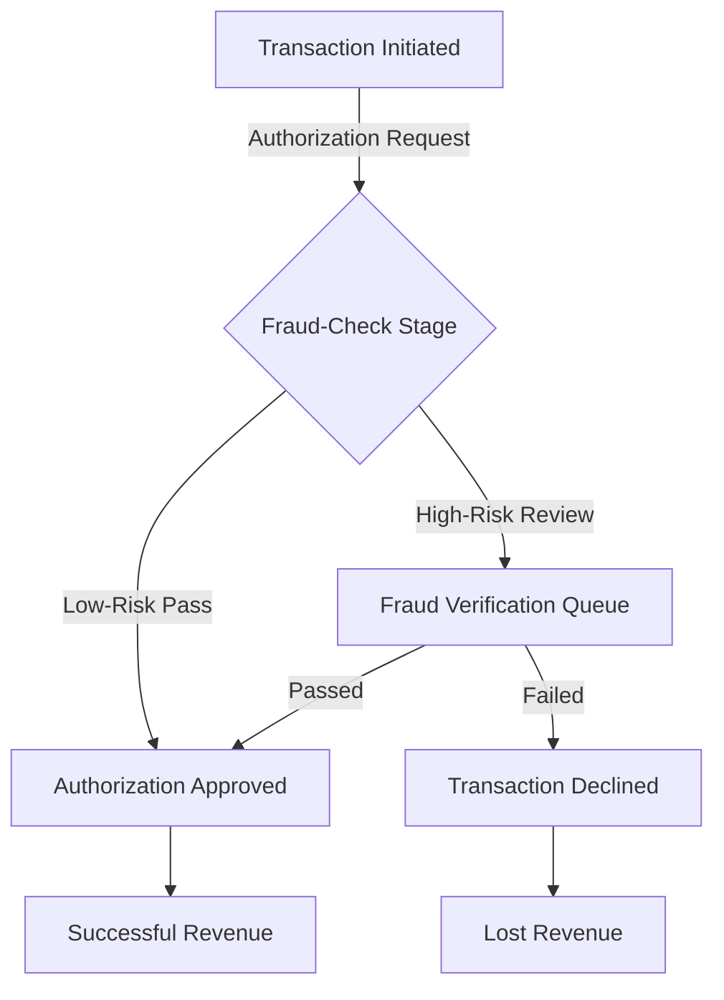

By addressing throughput constraints at critical stages like fraud-checking, businesses can ensure authorization reliability during the most critical usage periods, safeguarding both revenue and customer loyalty.

### Implementation Guidance

To effectively implement transaction funnel metrics for Black Friday peak readiness, follow these steps:

1. **Define Processing Stages**

   - Identify each stage in the transaction funnel, such as:
     - Entry point (e.g., checkout initiation)
     - Payment gateway interaction
     - Credit card authorization
     - Final confirmation and receipt generation
   - Ensure every stage is measurable with distinct entry and exit points.

   ```mermaid
   graph TD
       A[Checkout Initiation] --> B[Payment Gateway]
       B --> C[Card Authorization]
       C --> D[Transaction Confirmation]
   ```

2. **Implement Real-Time Volume Tracking**

   - Use a monitoring tool to collect and visualize transaction data with per-second granularity.
   - Example pseudocode for tracking transaction volume:
     ```python
     import time
     from monitoring_tool import record_metric

     def track_transaction_volume(transaction_stage, count=1):
         timestamp = time.time()
         record_metric(f"transaction_volume.{transaction_stage}", count, timestamp)

     # Example usage
     track_transaction_volume("checkout_initiation")
     ```

3. **Develop Segmentation Analysis**

   - Analyze transactions by key dimensions, such as:
     - Payment method (e.g., credit card, digital wallet)
     - Geographical region
     - Time of day
   - This analysis helps identify patterns and anomalies.

4. **Identify Bottleneck Progression**

   - Measure processing times at each stage and visualize bottlenecks:
     ```mermaid
     graph TD
         A[Checkout Initiation] -->|<10ms| B[Payment Gateway]
         B -->|150ms (bottleneck)| C[Card Authorization]
         C -->|<20ms| D[Transaction Confirmation]
     ```
   - Focus optimization efforts on stages with the highest delays.

5. **Establish Capacity Planning**

   - Use historical transaction patterns and capacity thresholds to project peak load scenarios.
   - Simulate high-volume conditions to stress-test the system:
     ```python
     def simulate_peak_load(transaction_rate, duration):
         for _ in range(duration):
             process_transactions(transaction_rate)
             time.sleep(1)  # Simulate per-second tracking
     ```

By following these steps, your team can establish robust funnel metrics, identify bottlenecks in real time, and confidently manage capacity during Black Friday and other high-traffic events.

## Panel 2: The False Positive Problem

### Scene Description

The Risk team and SRE collaborate to analyze blocked legitimate transactions, focusing on metrics that display fraud detection accuracy versus customer impact trade-offs. The metrics dashboard prominently features a precision-recall balance, breaking down false positive rates by transaction type, merchant category, and customer segment.

Below is a conceptual representation of the precision-recall balance and false positive rates distribution:

```mermaid
graph TD
    A[Transactions] --> B[Analyzed by Fraud Detection Algorithm]
    B --> C{Decision Outcome}
    C -->|Legitimate Transaction Approved| D[True Positive]
    C -->|Fraudulent Transaction Approved| E[False Negative]
    C -->|Legitimate Transaction Declined| F[False Positive]
    C -->|Fraudulent Transaction Declined| G[True Negative]

    subgraph Metrics Dashboard
        H[Precision: TP / (TP + FP)]
        I[Recall: TP / (TP + FN)]
        J[Customer Impact: Declined Legitimate Transactions]
    end

    F --> J
    D --> H
    D --> I
```

This visual emphasizes the trade-offs involved and highlights specific areas for algorithm tuning, allowing teams to refine detection strategies by observing patterns across transaction types, merchant categories, and customer segments.

### Teaching Narrative

Fraud detection metrics require sophisticated balance between security effectiveness and customer experience. Unlike binary correctness measurements in most systems, fraud metrics must quantify the inherent trade-offs between false positives (legitimate transactions incorrectly declined) and false negatives (fraudulent transactions incorrectly approved). These measurements guide algorithm tuning based on actual financial impact rather than technical accuracy alone, ensuring appropriate balance between fraud prevention and customer satisfaction.

### Common Example of the Problem

A bank implements enhanced fraud detection algorithms that successfully reduce fraud losses by 23%, but customer complaints about falsely declined transactions increase by 47%. The security team celebrates improved fraud prevention while the customer experience team raises alarms about satisfaction impact. Without balanced metrics that quantify both dimensions, the organization cannot determine if the net effect is positive or negative.

The fundamental challenge is measurement asymmetry: fraud losses are precisely quantified in dollars while customer frustration remains unquantified, creating systematic bias toward security at the expense of experience. This imbalance leads to algorithms optimized for fraud prevention without appropriate consideration of legitimate transaction impact.

#### Trade-Off Summary Table

| **Metric** | **Outcome** | **Impact** |
| ---------------------------- | ------------------------------------------------------------------- | ---------------------------------------------------------------------------- |
| Fraud Loss Reduction | 23% decrease | Positive: Significant reduction in financial fraud losses. |
| Customer Complaints Increase | 47% increase | Negative: Higher volume of complaints due to falsely declined transactions. |
| Measurement Symmetry | Fraud losses measured in dollars; customer frustration unquantified | Negative: Skewed optimization for fraud prevention over customer experience. |

#### Key Trade-Off Illustration

```mermaid
graph TD
    FraudReduction[Fraud Loss Reduction (23%)] --> NetImpact[Net Impact Unknown]
    CustomerComplaints[Customer Complaints Increase (47%)] --> NetImpact
    MeasurementAsymmetry[Measurement Asymmetry] --> NetImpact
    NetImpact --> AlgorithmTuning[Algorithm Tuning Dilemma]
```

This example demonstrates the crucial need for balanced metrics to enable informed decision-making. Organizations must develop frameworks to quantify both fraud prevention effectiveness and customer satisfaction impact, ensuring algorithms are tuned for a holistic outcome.

### SRE Best Practice: Evidence-Based Investigation

Implement a comprehensive fraud detection measurement framework. Use the checklist below to ensure a systematic, evidence-based investigation process:

#### Checklist for Evidence-Based Investigation

| **Category** | **Steps** |
| ---------------------------------------------- | ------------------------------------------------------------------------ |
| **1. Multi-dimensional Effectiveness Metrics** | |
| | [ ] Create a confusion matrix for all transactions: |
| | - True positives: Correctly identified fraud |
| | - False positives: Legitimate transactions incorrectly declined |
| | - True negatives: Legitimate transactions correctly approved |
| | - False negatives: Fraudulent transactions incorrectly approved |
| | [ ] Quantify financial impact for each confusion matrix category |
| | [ ] Develop precision and recall metrics with a focus on business impact |
| | [ ] Build balanced accuracy measurements to show overall effectiveness |
| **2. Segmented Performance Analysis** | |
| | [ ] Create effectiveness metrics segmented by: |
| | - Transaction characteristics (amount ranges, merchant categories) |
| | - Geographic regions and countries |
| | - Card products and customer segments |
| | [ ] Perform pattern analysis to identify effectiveness variations |
| | [ ] Identify outliers in problematic segments |
| | [ ] Rank tuning opportunities by potential business impact |
| **3. Customer Impact Quantification** | |
| | [ ] Define false positive impact metrics beyond binary counts: |
| | - Customer value attrition risk |
| | - Relationship tenure and product breadth |
| | - Transaction criticality (essentials vs. discretionary) |
| | - Historical behavior patterns |
| | [ ] Implement sentiment measurement through feedback channels |
| | [ ] Track repeat declines to uncover persistent customer issues |
| | [ ] Build holistic impact scoring balancing security and experience |

#### Analysis Insight

Balanced analysis reveals that while overall fraud has decreased, false declines disproportionately affect high-value customers during travel transactions. This creates an attrition risk that exceeds the financial benefit of fraud prevention—an insight only visible through segmented impact metrics.

### Banking Impact

For payment card operations, fraud detection balance directly affects both financial performance and customer relationships. Overly aggressive fraud prevention creates immediate business impact through frustrated customers, lost transaction revenue, and increased service costs as cardholders require assistance. Each false positive affects customer confidence in the card, potentially changing usage patterns and primary card status. Balanced measurement enables algorithm tuning that optimizes both dimensions simultaneously, preventing fraud while preserving positive customer experience for legitimate transactions.

#### Case Study: Balancing Fraud Prevention at Acme Bank

Acme Bank faced significant challenges when their fraud detection system began flagging an unusually high number of legitimate transactions during a peak holiday shopping season. Customers reported frustrations with declined transactions, leading to a rise in support calls and a measurable dip in transaction volume.

To address this, Acme Bank leveraged precision-recall metrics segmented by merchant category and transaction type. By identifying patterns in false positives—such as frequent declines for online electronics retailers—they fine-tuned their fraud detection algorithms to reduce unnecessary blocks for specific low-risk scenarios. This adjustment resulted in a 25% reduction in false positives without a significant increase in fraud rates.

The outcome not only restored customer trust but also improved operational efficiency, as call center inquiries related to declined transactions dropped by 15%. This case highlights the importance of using data-driven insights to strike the right balance between fraud prevention and customer experience.

### Implementation Guidance

To effectively balance fraud prevention and customer experience, follow these steps:

1. **Implement Comprehensive Confusion Matrix Measurement**\
   Collect and analyze detailed confusion matrix metrics for all transactions. This includes true positives, false positives, true negatives, and false negatives, enabling precise identification of trade-offs.

2. **Perform Segmentation Analysis**\
   Break down transaction data by key segments, such as transaction type, merchant category, and customer demographics. Identify pattern variations and outliers within each segment.

3. **Quantify Customer Impact Beyond Decline Counts**\
   Move beyond simple decline rates by incorporating metrics like customer churn, feedback sentiment, and re-engagement rates for declined transactions. This provides a clearer picture of customer experience impact.

4. **Build Balancing Metrics**\
   Develop composite metrics to quantify the net impact of fraud detection. For example:

   - **Security Impact** = Reduction in fraud-loss dollars
   - **Customer Experience Impact** = Declined legitimate transactions weighted by financial and reputational costs\
     Use these metrics to visualize trade-offs and prioritize tuning efforts.

5. **Establish Regular Algorithm Tuning**\
   Conduct periodic reviews of fraud detection algorithms. Use updated confusion matrix metrics, segmentation insights, and balancing metrics to adjust thresholds and model parameters.

#### Step-by-Step Process Overview

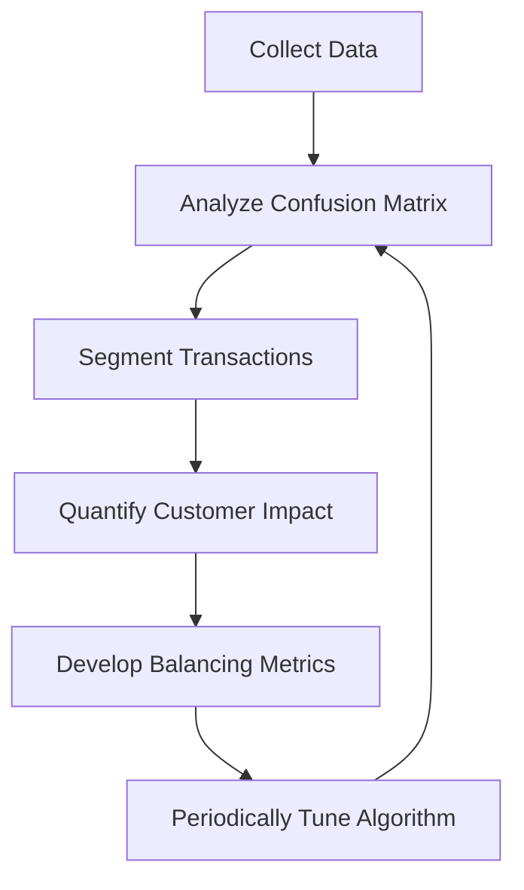

Follow this iterative process to ensure the fraud detection system maintains an optimal balance between security effectiveness and customer satisfaction.

## Panel 3: The Morning Deadline

### Scene Description

The overnight batch processing team races against the morning deadline, closely monitoring critical path metrics for interdependent reconciliation jobs. The timeline dashboard provides a real-time view of job progress, including completion percentages, dependency chains, and processing rates. Below is a textual representation of the dashboard, illustrating the relationships and risks:

```
+----------------+       +----------------+       +----------------+
| Job A: 100%   | ----> | Job B: 75%     | ----> | Job C: 50%     |
| Completed      |       | In Progress   |       | At Risk        |
+----------------+       +----------------+       +----------------+
                            |
                            v
                     +----------------+
                     | Job D: 60%     |
                     | In Progress    |
                     +----------------+
```

Jobs with lower completion percentages and higher dependencies, such as Job C, are identified as being at risk of missing their completion windows. This visualization highlights the critical path, enabling the team to prioritize interventions and ensure all jobs reconcile within the required timeframe.

### Teaching Narrative

Batch processing metrics focus on completion assurance rather than real-time performance, tracking progress against time windows, dependencies, and data correctness. These specialized measurements monitor job completion percentages, processing rates, error frequency, and remaining work volume, providing predictive indicators of whether batch operations will complete within required timeframes. For overnight financial reconciliation processes, these metrics enable early intervention when processing appears likely to miss critical deadlines.

### Common Example of the Problem

A bank's core system performs nightly batch processing to reconcile transactions, update balances, calculate interest, and generate statements. These jobs must complete before 6 AM when online banking and branches become available to customers. Despite monitoring job completion status, the operations team frequently faces morning emergencies when critical jobs remain unfinished as the deadline approaches. Current metrics show simple completion status without predictive insights, leaving the team with insufficient warning to address developing problems.

#### Key Business Impacts of Missed Deadlines

- **Delayed Branch Openings**:

  - Staff cannot access updated customer data or process transactions accurately.
  - Customer dissatisfaction increases due to longer wait times or incomplete services.

- **Outdated Online Banking Information**:

  - Account balances, recent transactions, and pending payments display incorrectly.
  - Customer trust in online services erodes, leading to increased support calls and complaints.

- **Regulatory Compliance Issues**:

  - Failure to meet mandatory reporting deadlines for financial transactions.
  - Potential fines or penalties from regulatory agencies.

- **Operational Disruptions**:

  - Increased workload for both technical and customer-facing teams during business hours.
  - Emergency manual interventions to address incomplete or incorrect data.

#### Visualizing Problem Areas

```mermaid
gantt
    title Batch Processing Timeline and Risk Points
    dateFormat  HH:mm
    section Processing Jobs
    Reconciliation Jobs         :done,    task1, 00:00, 04:00
    Transaction Updates         :active,  task2, 01:00, 05:30
    Interest Calculation        :         task3, 02:00, 05:45
    Statement Generation        :crit,    task4, 03:00, 06:30
    section Risk Indicators
    Predicted Overrun           :crit,    task5, 05:00, 06:30
    Intervention Window         :active,  task6, 05:00, 06:00
```

This breakdown emphasizes the severe downstream consequences of missed batch processing deadlines while illustrating how predictive insights could provide early warning for intervention.

### SRE Best Practice: Evidence-Based Investigation

Implement predictive batch processing metrics:

1. **Critical Path Monitoring**

   - Create dependency mapping for all batch processes
   - Implement critical path analysis showing sequential constraints
   - Develop slack time calculation for parallel processes
   - Build completion risk assessment based on dependency chains

   **Example Pseudo-Code**:

   ```python
   def calculate_slack_time(job, dependencies):
       critical_path_time = sum(dependency['duration'] for dependency in dependencies if dependency['is_critical'])
       available_time = job['deadline'] - job['start_time']
       slack_time = available_time - critical_path_time
       return slack_time
   ```

2. **Progress Rate Analytics**

   - Create historical processing rate baselines for all jobs
   - Implement real-time rate comparison against expectations
   - Develop trend analysis showing completion trajectory
   - Build predictive modeling showing expected completion times

   **Example Pseudo-Code**:

   ```python
   def predict_completion_time(job, historical_rate):
       elapsed_time = job['current_time'] - job['start_time']
       progress_rate = job['progress'] / elapsed_time
       predicted_time_remaining = (1 - job['progress']) / progress_rate
       predicted_completion_time = job['current_time'] + predicted_time_remaining
       baseline_completion_time = historical_rate['average_duration']
       return predicted_completion_time, baseline_completion_time
   ```

3. **Intervention Trigger Metrics**

   - Create time-based warning thresholds with escalation paths
   - Implement anomaly detection for processing rate changes
   - Develop resource constraint identification during execution
   - Build intervention effectiveness tracking for remediation actions

   **Example Pseudo-Code**:

   ```python
   def check_anomalies(job, historical_rate):
       expected_rate = historical_rate['average_rate']
       rate_anomaly = abs(job['current_rate'] - expected_rate) > historical_rate['allowed_variance']
       time_anomaly = job['time_remaining'] < job['min_safe_time']
       return rate_anomaly or time_anomaly

   def trigger_intervention(job):
       if check_anomalies(job, job['historical_rate']):
           escalate_to_on_call_team(job)
           allocate_additional_resources(job)
   ```

Predictive analysis transforms batch monitoring from reactive status checking to proactive management, revealing that a specific reconciliation job is processing 36% slower than the historical baseline and will likely miss its dependency deadline unless addressed within the next 30 minutes.

### Banking Impact

For overnight batch operations, completion predictability directly affects both business continuity and customer experience. Processes extending beyond their allocated windows create cascading impacts across channels: branches cannot open on time, ATMs display outdated balances, online banking shows incorrect information, and regulatory reporting deadlines may be missed. Each minute of delay affects thousands of customers and employees, creating both immediate friction and potential compliance issues.

#### Case Study: Preventing a Major Reconciliation Failure

In a recent financial institution scenario, predictive metrics identified a critical reconciliation job in a high-risk state due to slower-than-expected processing rates and an unexpected increase in data volume. This job was responsible for aligning the institution's overnight transaction data with account balances across all customer-facing systems. Without intervention, the delay would have caused branches to open with inaccurate account information, ATMs to fail balance updates, and regulatory reporting to breach submission deadlines.

Using the metrics dashboard, the operations team pinpointed the bottleneck to a specific upstream dependency that was consuming excessive compute resources. By reallocating processing capacity and prioritizing the delayed job within the dependency chain, the team successfully completed the job within the required time window. This proactive response ensured that branches opened on schedule, ATMs displayed correct balances, and regulatory submissions were filed on time, avoiding both customer dissatisfaction and potential compliance penalties.

This real-world example highlights how predictive metrics empower teams to take early action, safeguarding critical business operations and maintaining trust with customers and regulators alike.

### Implementation Guidance

To ensure effective monitoring and management of overnight batch processing, follow these steps:

#### Checklist for Implementation:

1. **Dependency Mapping**

   - Identify and document all interdependencies between batch jobs.
   - Visualize the dependency chain to pinpoint critical paths and bottlenecks.

2. **Historical Baseline Analysis**

   - Collect historical data on processing rates, job durations, and completion times.
   - Establish baseline performance metrics for typical processing scenarios.

3. **Predictive Completion Modeling**

   - Build models to predict job completion times based on historical data and real-time metrics.
   - Incorporate confidence intervals to account for variability in processing rates.

4. **Risk-Based Escalation Triggers**

   - Define thresholds for completion risks (e.g., percentage of remaining work vs. available time).
   - Configure automated alerts to notify the team when thresholds are breached.

5. **Intervention Procedures**

   - Develop and document action plans for addressing at-risk jobs.
   - Include escalation protocols, re-prioritization strategies, and resource reallocation processes.

#### Example Workflow:

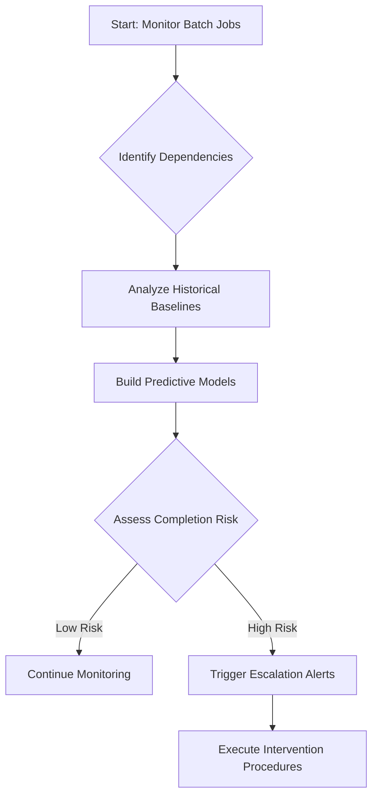

By following this structured approach, teams can proactively ensure batch operations meet critical morning deadlines while minimizing disruption and manual effort.

## Panel 4: The Audit Trail

### Scene Description

The compliance team is meticulously reviewing transaction audit metrics during a regulatory examination, emphasizing completeness and integrity measurements. The visual component features an audit validation dashboard designed to provide a clear overview of critical metrics. Below is a conceptual layout of the dashboard:

```
+-------------------------------------------------------+
|                 Audit Validation Dashboard            |
+---------------------+-----------------+---------------+
| Metric              | Status          | Coverage (%)  |
+---------------------+-----------------+---------------+
| Transaction Log     | Complete        | 98%           |
| Reconciliation      | In Progress     | 75%           |
| Integrity Check     | Verified        | 100%          |
+---------------------+-----------------+---------------+

Legend:
- "Complete": All expected records are present.
- "In Progress": Reconciliation is ongoing for certain records.
- "Verified": No integrity violations detected.
```

This dashboard layout highlights three key metrics:

1. **Transaction Log Coverage**: Ensures all transactions are accounted for in the system.
2. **Reconciliation Status**: Tracks the alignment between system records and external references.
3. **Integrity Verification**: Confirms records have not been tampered with and remain immutable.

The clear and structured presentation of these metrics supports the compliance team's evaluation, providing quantitative assurance that regulatory standards are upheld.

### Teaching Narrative

Audit trail metrics ensure the completeness, accuracy, and integrity of transaction records—a fundamental requirement in regulated financial services. Unlike performance metrics that focus on efficiency, audit metrics concentrate on evidential quality: whether every transaction is properly recorded, whether records remain immutable, and whether appropriate governance controls access to sensitive data. These measurements provide quantitative assurance that record-keeping meets regulatory requirements and supports potential investigations.

### Common Example of the Problem

A bank faces a regulatory examination focused on transaction monitoring controls, but struggles to provide evidence that all transactions are properly captured in audit logs. The technology team asserts that logging is comprehensive, but cannot produce metrics demonstrating complete coverage or integrity verification. Without quantitative measurement of audit trail effectiveness, compliance officers cannot provide confidence in the control environment. This measurement gap creates examination findings that trigger remediation requirements and increased regulatory scrutiny, despite the actual logging infrastructure potentially being adequate.

To illustrate this, consider the following flowchart that highlights the gap between transaction logging and audit verification:

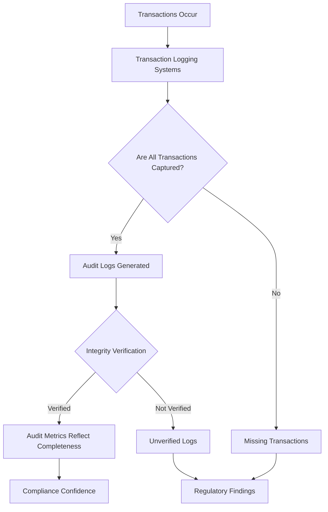

This flowchart demonstrates the critical points where gaps may arise: incomplete transaction capture, lack of integrity verification, or insufficient metrics to validate audit trail completeness. Without addressing these gaps, even robust logging mechanisms can falter under regulatory scrutiny. The fundamental issue is the absence of meta-monitoring: systems that verify the monitoring systems themselves are functioning as intended.

### SRE Best Practice: Evidence-Based Investigation

To ensure a robust audit trail, implement and monitor the following metrics. Use this checklist to guide the setup and evaluation of evidence-based investigation practices.

#### Checklist: Audit Trail Effectiveness Metrics

| **Metric Type** | **Purpose** | **Example Metrics** |
| ----------------------------- | -------------------------------------------------------------------------------------- | --------------------------------------------------------------------------------------------------------------------------------------------------------------------------------- |
| **Completeness Verification** | Ensure all transactions are captured and logged appropriately. | - Transaction reconciliation across systems <br> - Logging coverage percentages <br> - Gap detection for missing events <br> - Transaction-to-audit volume comparison |
| **Integrity Validation** | Verify that audit records remain unaltered and accurate over time. | - Cryptographic log integrity checks <br> - Chain-of-custody tracking <br> - Tampering detection using hash validation <br> - Metadata attribute completeness validation |
| **Governance Effectiveness** | Validate that access and control mechanisms meet regulatory and security requirements. | - Access control verification for audit systems <br> - Separation-of-duties validation <br> - Privileged access monitoring <br> - Compliance scoring against regulatory standards |

#### Key Metrics Summary

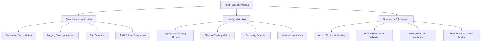

Comprehensive audit metrics transform subjective assertions into quantitative evidence, such as demonstrating that 99.997% of transactions have corresponding audit records with cryptographically verified integrity. This level of precision provides the evidence necessary to meet regulatory requirements and supports investigations with confidence.

### Banking Impact

For regulated financial institutions, audit trail effectiveness directly affects both regulatory standing and fraud investigation capabilities. Inadequate audit metrics create examination findings, potential penalties, and increased regulatory scrutiny that affects everything from new product approvals to acquisition activities. Beyond compliance concerns, audit gaps create vulnerability to internal fraud and hamper investigations when suspicious activity occurs. Comprehensive audit metrics provide assurance that transaction history remains complete and accurate, supporting both regulatory compliance and operational risk management.

### Implementation Guidance

To enhance clarity and provide actionable steps, the following workflow outlines the implementation process for ensuring audit trail completeness, accuracy, and integrity:

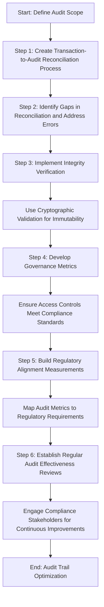

#### Step-by-Step Workflow

1. **Define Audit Scope**\
   Identify the systems, transactions, and data flows that require audit trail coverage.

2. **Create Transaction-to-Audit Reconciliation Process**\
   Develop processes to reconcile transactions with their corresponding audit logs, ensuring no gaps in coverage.

3. **Identify Gaps and Address Errors**\
   Implement mechanisms to detect reconciliation gaps and resolve discrepancies promptly.

4. **Implement Integrity Verification**\
   Use cryptographic validation techniques, such as hash functions, to ensure transaction records remain immutable.

5. **Develop Governance Metrics**\
   Establish metrics to assess the effectiveness of access controls, ensuring only authorized personnel can access sensitive data.

6. **Build Regulatory Alignment Measurements**\
   Map audit trail metrics to specific regulatory requirements to demonstrate compliance quantitatively.

7. **Establish Regular Audit Effectiveness Reviews**\
   Conduct periodic reviews of audit processes with compliance stakeholders to identify improvements and adapt to evolving regulations.

By following this workflow, teams can ensure the audit trail meets regulatory standards and supports compliance objectives effectively.

## Panel 5: The Regulatory Reporting Calendar

### Scene Description

The Operations team is actively reviewing upcoming regulatory deadlines, focusing on the corresponding system readiness metrics required for each reporting obligation. The scene features a dynamic calendar view that clearly illustrates:

- **Reporting Requirements Timeline**: A sequential layout of key submission dates and deadlines.
- **System Preparation Status**: Indicators of readiness for each system associated with the reporting obligations, including status tags such as "Ready," "In Progress," or "At Risk."
- **Readiness Metrics**: Quantitative measures of completeness, accuracy, and timeliness for each regulatory submission.

#### Visual Representation

Below is a conceptual representation of the calendar view using text-based elements:

```
+------------------+------------------+------------------+------------------+
|   Date/Deadline  |   Requirement    |   System Status  | Readiness Metrics|
+------------------+------------------+------------------+------------------+
| 2023-11-01       | Report A         | Ready            | 100% Accuracy    |
| 2023-11-10       | Report B         | In Progress      | 85% Complete     |
| 2023-11-15       | Report C         | At Risk          | Data Pending     |
+------------------+------------------+------------------+------------------+
```

This integrated view provides a comprehensive snapshot of the regulatory reporting landscape, enabling the team to track deadlines, monitor system readiness, and ensure compliance with high accuracy and timeliness.

### Teaching Narrative

Regulatory reporting metrics address the specialized needs of mandatory financial disclosures and examinations. These measurements focus on deadline compliance, report accuracy, data completeness, and supporting system readiness. Unlike business-driven metrics that optimize for efficiency, regulatory metrics prioritize completeness, accuracy, and timely submission to satisfy legal obligations, providing visibility into compliance status across multiple reporting requirements.

### Common Example of the Problem

A bank struggles with regulatory reporting compliance despite significant investments in reporting systems. Financial controllers face recurring stress as reporting deadlines approach, often discovering data quality issues, reconciliation problems, or system limitations only days before mandatory submission dates. The operations team lacks visibility into report readiness until final preparation begins, creating recurring fire drills to address issues discovered late in the process. This reactive approach creates both compliance risk and operational inefficiency as teams repeatedly scramble to meet regulatory obligations without systematic measurement of preparation progress.

#### Timeline of Issues Leading to Submission Deadline

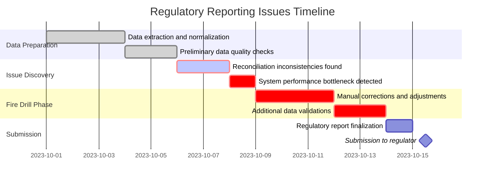

This timeline illustrates the sequence of challenges often encountered during the regulatory reporting process. As shown, critical issues such as reconciliation inconsistencies and system bottlenecks are frequently discovered late in the cycle, triggering costly and inefficient fire drills to resolve them. By the time teams reach the submission phase, manual interventions and rushed validations place compliance at risk, highlighting the need for systematic readiness tracking and earlier issue detection.

### SRE Best Practice: Evidence-Based Investigation

Implement comprehensive regulatory reporting readiness metrics to ensure compliance and system reliability. Use the following table as a reference for key metrics, their purposes, and actionable outcomes:

| **Metric Category** | **Metric Name** | **Purpose** | **Actionable Outcome** |
| --------------------------------- | ----------------------------------- | ------------------------------------------------------------------ | --------------------------------------------------------------------------- |
| **Calendar-Driven Framework** | Regulatory Obligation Inventory | Maintain a comprehensive list of deadlines for all reports. | Ensure no deadlines are missed by tracking against the inventory. |
| | Preparation Milestone Tracking | Monitor progress toward readiness milestones for each report. | Identify bottlenecks early and adjust resource allocation accordingly. |
| | Lead Time Verification | Confirm sufficient preparation time for each reporting cycle. | Adjust timelines or resources to meet preparation requirements. |
| | Readiness Trend Analysis | Track progress trends toward submission readiness over time. | Highlight areas needing intervention before submission deadlines. |
| **Data Quality Assurance** | Completeness Validation | Ensure all required data elements are present. | Prevent incomplete submissions by validating required data completeness. |
| | Reconciliation Metrics | Verify data consistency across systems. | Resolve discrepancies in data before submission. |
| | Anomaly Detection | Identify and flag potential data errors. | Investigate anomalies promptly to ensure accuracy. |
| | Historical Comparison | Compare current data against prior submissions for consistency. | Detect deviations and address unexpected changes in reported metrics. |
| **System Readiness Verification** | Infrastructure Availability Metrics | Ensure the reporting infrastructure is operational and accessible. | Mitigate downtime by ensuring availability aligns with reporting schedules. |
| | Processing Capacity Validation | Confirm systems can handle reporting workload. | Scale resources or optimize systems to meet capacity requirements. |
| | Dependency Checks | Verify the readiness of dependent systems and services. | Address upstream/downstream issues proactively to avoid delays. |
| | Change Freeze Verification | Enforce no-change windows during critical reporting periods. | Reduce risk of instability by freezing changes in critical systems. |

### Application of Metrics in Real-Time Scenarios

Calendar-based readiness metrics transform regulatory reporting from reactive fire drills to proactive management. For example, metrics may reveal that while most reports are on track, the upcoming capital adequacy submission has reconciliation issues flagged in the data quality metrics. This allows the team to address the problem 26 days before the deadline, ensuring timely and accurate submission.

### Banking Impact

For financial institutions, regulatory reporting compliance directly affects both regulatory standing and operational efficiency. Late or inaccurate regulatory submissions create immediate compliance issues with potential penalties, increased scrutiny, and reputational damage. The operational impact of reactive approaches extends beyond compliance concerns to include excessive overtime, emergency changes, and recurring stress across teams involved in the reporting process. Comprehensive readiness metrics enable proactive management that ensures compliance while reducing the operational burden of regulatory reporting.

### Implementation Guidance

To ensure effective implementation of the Regulatory Reporting Calendar, follow this step-by-step checklist:

#### Step 1: Create and Maintain a Comprehensive Calendar

- [ ] Identify all regulatory reporting obligations and their deadlines.
- [ ] Catalog associated dependencies, including data sources and responsible teams.
- [ ] Regularly review and update the calendar to reflect changes in regulations or internal processes.

#### Step 2: Implement Milestone Tracking

- [ ] Define key preparation milestones for each reporting obligation.
- [ ] Assign ownership for each milestone to ensure accountability.
- [ ] Monitor progress against milestones using project tracking tools.

#### Step 3: Develop and Apply Data Quality Metrics

- [ ] Establish data completeness and accuracy criteria for each report.
- [ ] Design reconciliation processes to validate data integrity.
- [ ] Document and address data discrepancies before submission.

#### Step 4: Build System Readiness Verification

- [ ] Define system readiness benchmarks, including performance and availability metrics.
- [ ] Conduct regular end-to-end testing of reporting systems.
- [ ] Create contingency plans for system failures or unexpected downtime.

#### Step 5: Schedule Regular Readiness Reviews

- [ ] Plan periodic reviews to assess preparedness ahead of submission deadlines.
- [ ] Include cross-functional stakeholders to ensure comprehensive coverage.
- [ ] Document findings and take corrective actions to address gaps.

#### Final Review:

- [ ] Verify all checklist items are completed before the reporting deadline.
- [ ] Confirm compliance with regulatory requirements through a final review process.

## Panel 6: The Money Movement Tracker

### Scene Description

The Treasury operations team is actively monitoring interbank fund transfer metrics, focusing on settlement status, timing, and liquidity impacts. The central visual element is a real-time dashboard that tracks large-value transfers through correspondent banking networks. Key metrics include settlement confirmations and liquidity position updates, presented in a clear and actionable format.

Below is a conceptual representation of the dashboard layout:

```
+-------------------------------------------------------+
|                  Real-Time Dashboard                  |
+-------------------------------------------------------+
|    Settlement Status     |   Liquidity Position       |
|  -----------------------  |  -----------------------  |
|  Confirmed: 85%          |  Available: $500M         |
|  Pending: 10%            |  Reserved: $200M          |
|  Failed: 5%              |  Utilized: $300M          |
+-------------------------------------------------------+
|       Transfer Metrics by Region (Heatmap)            |
|  ---------------------------------------------------  |
|  High Volume: North America, Europe                  |
|  Medium Volume: Asia-Pacific                         |
|  Low Volume: Africa, South America                   |
+-------------------------------------------------------+
|       Recent Transfer Logs (Last 5 Transactions)      |
|  ---------------------------------------------------  |
|  TxID 12345 | $10M | Completed | 12:45 UTC           |
|  TxID 12346 | $5M  | Pending   | 12:50 UTC           |
|  TxID 12347 | $2M  | Failed    | 12:52 UTC           |
|  TxID 12348 | $8M  | Completed | 12:55 UTC           |
|  TxID 12349 | $1M  | Completed | 12:57 UTC           |
+-------------------------------------------------------+
```

This layout provides a holistic view of the system's performance, enabling the team to identify bottlenecks in settlement processes, monitor liquidity trends, and ensure timely resolution of failures. The dashboard is designed to support rapid decision-making and maintain the smooth flow of interbank transactions.

### Teaching Narrative

Money movement metrics track the actual flow of funds between accounts, customers, and financial institutions. Unlike application performance metrics that focus on technical operation, these financial metrics concentrate on monetary values, settlement timing, and liquidity impacts. They connect technical performance to the core business of banking: the safe, accurate, and timely movement of money, providing essential visibility into the financial consequences of system behavior.

### Common Example of the Problem

A bank's treasury team manages liquidity across multiple accounts, entities, and currencies, but lacks integrated visibility into fund movements. While individual payment systems function correctly, the operations team struggles with fragmented monitoring that shows technical status without financial context. When large-value transfers experience delays, the impact extends beyond technical metrics to include settlement risks, liquidity management challenges, and potential funding shortfalls in correspondent accounts. Without consolidated money movement tracking, the treasury team cannot effectively manage financial positions or anticipate liquidity needs across the organization.

#### Flow of the Problem: Fragmented Monitoring Process

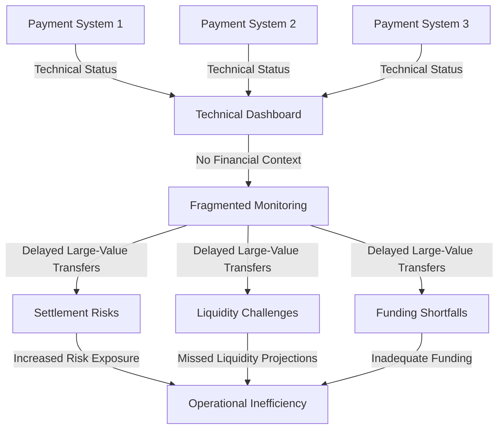

This diagram illustrates how fragmented monitoring impacts treasury operations. While individual payment systems report technical status, the lack of consolidated financial visibility leads to delayed responses to settlement risks, liquidity challenges, and funding shortfalls. This operational inefficiency undermines the treasury team's ability to proactively manage the organization's financial health.

### SRE Best Practice: Evidence-Based Investigation

To implement comprehensive money movement tracking, follow this checklist of best practices:

| **Category** | **Best Practice** |
| ----------------------------------- | ------------------------------------------------------------- |
| **End-to-End Transfer Visibility** | - Consolidate tracking across payment networks |
| | - Monitor status through settlement stages |
| | - Identify exceptions for delayed transfers |
| | - Build cross-border visibility for international payments |
| **Financial Impact Metrics** | - Monitor liquidity positions by account |
| | - Track intraday balances with projections |
| | - Develop settlement risk metrics for in-flight transfers |
| | - Analyze exposure by counterparty and currency |
| **Settlement Confirmation Metrics** | - Verify settlements in real-time |
| | - Implement reconciliation metrics for completed transfers |
| | - Conduct timing analysis against expected settlement windows |
| | - Monitor trends for changes in settlement patterns |

#### Summary Flow of Evidence-Based Investigation:

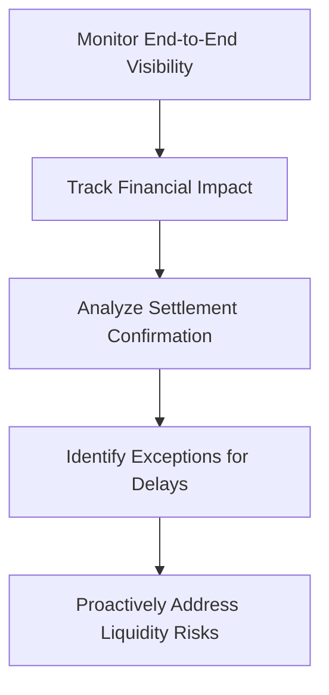

Consolidated money movement metrics transform treasury operations from reactive management to proactive control. For example, while all systems may show "green" technical status, these metrics could reveal that three high-value transfers to a key correspondent bank are delayed in settlement, potentially causing a liquidity shortage for upcoming obligations.

### Banking Impact

For treasury operations, money movement visibility directly affects both financial risk management and regulatory compliance. Fragmented monitoring creates exposure to settlement failures, liquidity shortfalls, and potential regulatory violations related to reserve requirements and position limits. The financial impact extends beyond operational concerns to include potential interest costs for overdrafts, opportunity costs for excess balances, and relationship impacts with correspondent banks.

**Case Study: Liquidity Management During Market Volatility**

In 2020, a major global bank faced significant challenges during a period of heightened market volatility caused by the COVID-19 pandemic. Settlement delays across correspondent banking networks created uncertainty about available liquidity, which was critical for meeting intraday funding obligations. Without accurate, real-time metrics on money movement, the bank risked breaching regulatory reserve requirements and incurring costly overdraft fees.

To address these issues, the bank implemented a comprehensive money movement tracker, integrating settlement status, liquidity positions, and interbank transfer timing across multiple currencies and jurisdictions. This system allowed the treasury team to:

- Identify and resolve settlement delays in real time.
- Optimize liquidity by reallocating funds from overfunded accounts to areas of immediate need.
- Maintain compliance with reserve requirements, avoiding penalties and reputational risk.

Within weeks, the bank reduced overdraft interest costs by 25% and improved settlement efficiency by 30%, strengthening relationships with correspondent banks. This real-world example underscores how precise money movement metrics are essential for navigating financial risks, ensuring compliance, and maintaining operational excellence.

### Implementation Guidance

To effectively implement the Money Movement Tracker, follow the structured workflow below:

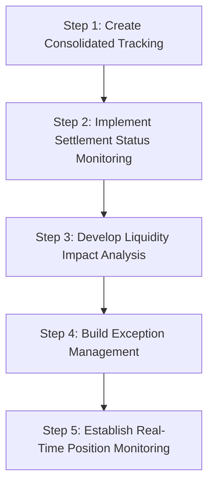

#### Step-by-Step Workflow

1. **Create Consolidated Tracking**\
   Aggregate data across all payment channels and correspondent banking networks into a unified platform to provide a comprehensive view of money movement.

2. **Implement Settlement Status Monitoring**\
   Set up real-time monitoring to track settlement confirmations, ensuring accurate and timely verification of fund transfers.

3. **Develop Liquidity Impact Analysis**\
   Integrate tools for forecasting liquidity positions and assessing the impact of ongoing and future transactions on overall liquidity.

4. **Build Exception Management**\
   Design mechanisms to detect, log, and address delayed or failed settlements, including automated alerts and resolution workflows.

5. **Establish Real-Time Position Monitoring**\
   Deploy continuous monitoring with alerting for potential liquidity shortfalls, enabling proactive decision-making and risk mitigation.

## Panel 7: The Security Posture Dashboard

### Scene Description

Security and operations teams reviewing an integrated security metrics dashboard. The dashboard displays key areas such as threat detection, vulnerability status, and compliance metrics, providing a comprehensive security measurement framework. It includes visualized risk indicators, protection effectiveness scores, and vulnerability management data across banking systems.

#### Dashboard Conceptual Layout

Below is a text-based representation of the dashboard's core layout for conceptual clarity:

```
+-------------------------------------------------------------+
|                      Security Metrics Dashboard             |
+-----------------------+----------------------+--------------+
| Threat Detection      | Vulnerability Status | Compliance   |
| - Alerts by severity  | - Open vulnerabilities| - Policy    |
| - Detection trends    | - Risk prioritization |   adherence |
| - Mitigation status   | - Patch coverage      | - Audit logs|
+-----------------------+----------------------+--------------+
| Risk Indicators       | Protection Scores    | Attack Surface|
| - High-risk systems   | - Endpoint security  | - Entry points|
| - Unusual activity    | - Network resilience | - Exposure   |
| - Fraud patterns      | - Access controls    | - Trust zones|
+-------------------------------------------------------------+
```

This representation highlights the logical grouping of metrics, emphasizing the integration of threat, vulnerability, and compliance data to provide actionable insights for banking security operations.

### Teaching Narrative

Security metrics for banking systems balance threat protection, compliance requirements, and operational accessibility. These specialized measurements quantify protection effectiveness, vulnerability exposure, attack surface, and compliance status across multiple dimensions. Unlike general security metrics, banking security measurements address specific regulatory requirements, financial risk models, and customer trust implications, creating a comprehensive view of security posture aligned with industry-specific needs.

### Common Example of the Problem

A bank's cybersecurity and operations teams maintain separate security measurement approaches, creating visibility gaps and coordination challenges. Security monitors traditional protection metrics (vulnerabilities, threats, incidents) while operations focuses on availability and performance. This fragmentation creates dangerous blind spots: security lacks visibility into operational changes that might affect protection, while operations lacks understanding of security implications for system modifications.

To illustrate this, consider the following sequence of events:

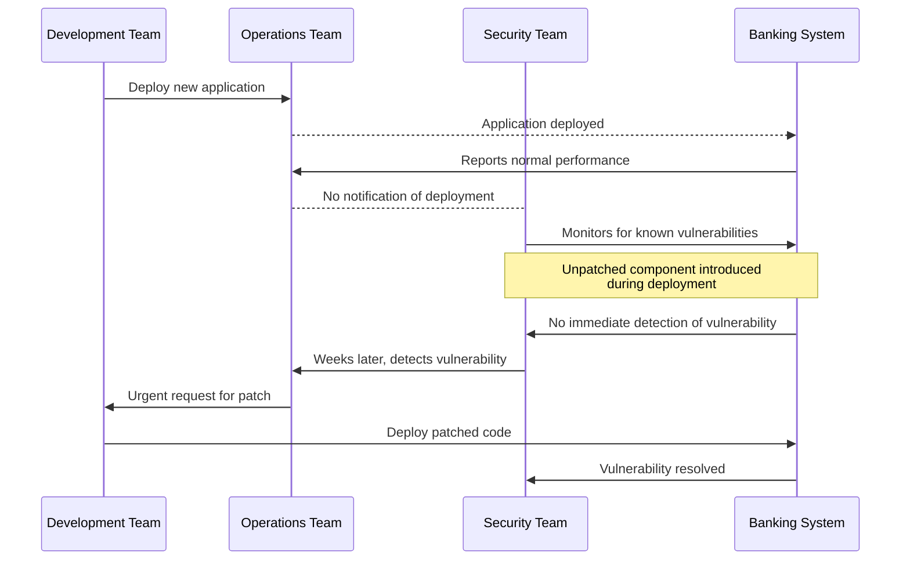

During a recent application deployment, this lack of coordination allowed the release of code with unpatched components, creating vulnerability exposure that remained undetected for weeks. The diagram above highlights the disconnect: the operations team deployed the application without informing security, leading to delayed detection of the vulnerability. Without integrated security metrics that span both domains, neither team has complete visibility into the actual security posture, increasing the risk of prolonged exposure to threats.

### SRE Best Practice: Evidence-Based Investigation

Implement comprehensive security metrics spanning protection and operations to support evidence-based investigation and decision-making. Use the following checklist to organize and evaluate key metrics effectively:

| **Category** | **Metric** | **Purpose** |
| ---------------------------- | ------------------------------------------ | --------------------------------------------------------------------------------------- |
| **Protection Effectiveness** | Threat detection coverage | Quantifies the extent to which threats are identified across the environment. |
| | Control validation through testing | Ensures security controls are functioning as intended through regular testing. |
| | Prevention effectiveness scoring | Measures the success rate of preventive measures in blocking or mitigating threats. |
| | Security responsiveness metrics | Tracks the speed and efficiency of response actions during security incidents. |
| **Vulnerability Management** | Exposure tracking with risk prioritization | Identifies vulnerabilities and prioritizes remediation based on risk assessment. |
| | Patch compliance monitoring | Monitors the percentage of systems with up-to-date patches applied. |
| | Remediation timing measurement | Evaluates the average time taken to remediate identified vulnerabilities. |
| | Vulnerability lifecycle trend analysis | Tracks trends related to the discovery, remediation, and resolution of vulnerabilities. |
| **Operational Security** | Change security validation metrics | Assesses the security impact of operational changes before implementation. |
| | Configuration compliance monitoring | Ensures system configurations adhere to security policies and standards. |
| | Privileged access tracking | Monitors and audits the use of privileged accounts to prevent unauthorized access. |
| | Security-operations alignment scoring | Evaluates the integration and collaboration between security and operational teams. |

#### Key Insights:

- Integrated security metrics reveal critical gaps that may be invisible to siloed approaches. For example:
  - While vulnerability scanning may show 97% patch compliance, operational changes could introduce exposed services without security validation, creating undetected risks.
- By aligning these metrics across protection, vulnerability management, and operational security, teams can uncover hidden risks and ensure a more robust security posture.

### Banking Impact

For financial institutions, security metrics integration directly affects both protection effectiveness and regulatory compliance. Fragmented security measurement creates vulnerability to sophisticated threats that exploit the gaps between security and operations domains. The potential impact extends beyond technical concerns to include financial losses from breaches, regulatory penalties for inadequate controls, and significant reputational damage that affects customer trust.

#### Real-World Example: The Case of FinSecure Bank

In 2021, FinSecure Bank experienced a data breach that exposed sensitive customer information. An investigation revealed that the breach occurred due to fragmented security metrics across their IT infrastructure. While their vulnerability scanners flagged a critical misconfiguration in a customer data repository, the alert went unnoticed because it was not integrated into their centralized monitoring system. This gap allowed attackers to exploit the misconfiguration, resulting in the theft of over 1.2 million customer records.

The fallout was severe: FinSecure Bank incurred $15 million in fines for non-compliance with data protection regulations and faced a $40 million class-action lawsuit from affected customers. Additionally, the breach eroded customer trust, leading to a 12% loss in account holders within the following six months.

This incident underscores the critical need for comprehensive and integrated security metrics. By unifying threat detection, compliance monitoring, and operational metrics, financial institutions can close visibility gaps, improve risk management, and safeguard both their assets and reputation across all threat vectors.

### Implementation Guidance

To effectively implement a security posture dashboard, follow the structured step-by-step checklist below:

#### Step-by-Step Checklist:

1. **Design an Integrated Security Metrics Framework**

   - Identify key security metrics spanning threat protection, vulnerability management, and compliance.
   - Align metrics with organizational priorities, regulatory requirements, and operational goals.
   - Ensure metrics are quantifiable, actionable, and measurable across all systems.

2. **Implement Comprehensive Vulnerability Management**

   - Conduct regular vulnerability scans across all systems and applications.
   - Prioritize vulnerabilities based on risk impact and exploitability using a risk-based approach.
   - Establish a remediation plan with clear ownership and timelines.

3. **Develop Change Security Validation Processes**

   - Integrate security checks into change management workflows.
   - Automate validation steps to detect misconfigurations or vulnerabilities in planned changes.
   - Continuously monitor for unauthorized changes and ensure rollback procedures are in place.

4. **Build Compliance Monitoring Aligned with Regulations**

   - Map compliance requirements (e.g., PCI DSS, GDPR, SOX) to specific security policies and controls.
   - Automate compliance checks to track adherence in real-time.
   - Generate regular reports to demonstrate compliance status to stakeholders.

5. **Establish Joint Security Reviews**

   - Schedule periodic joint reviews involving cybersecurity and operations teams.
   - Use the reviews to assess protection effectiveness, identify gaps, and align on shared objectives.
   - Document action items and follow up on progress between review cycles.

#### Flowchart Representation:

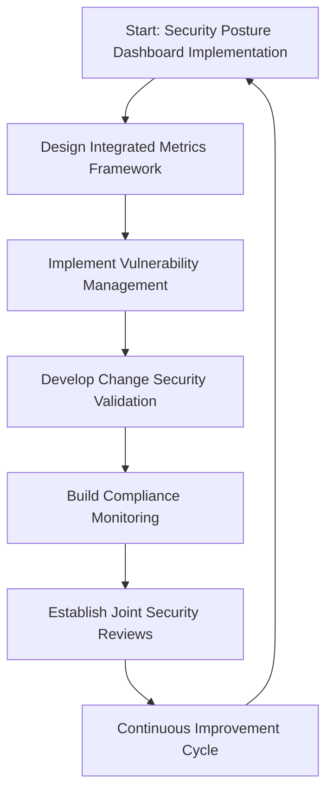

By following this structured approach, organizations can ensure that their security posture dashboard is effectively implemented, continuously improved, and aligned with both operational and regulatory needs.
