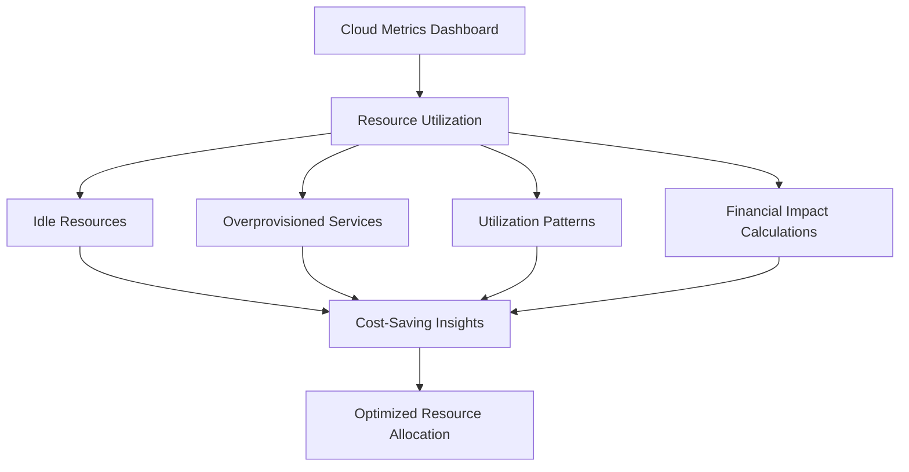
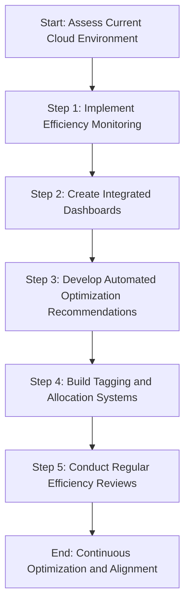
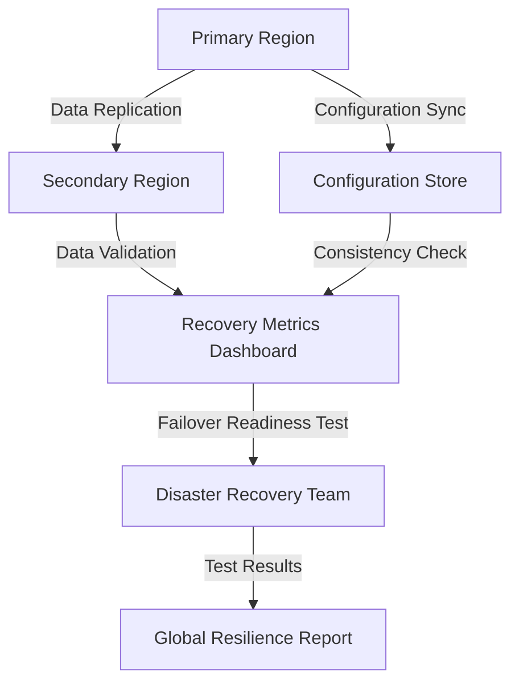
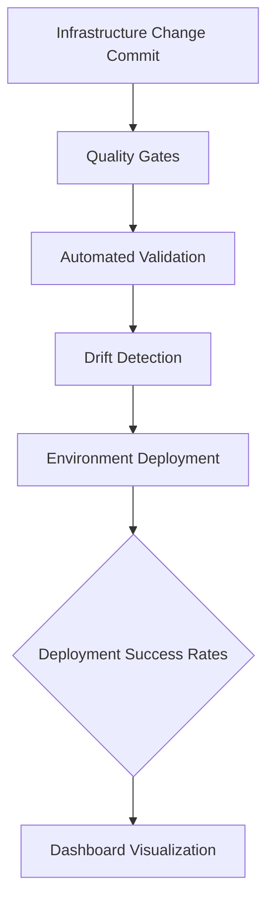
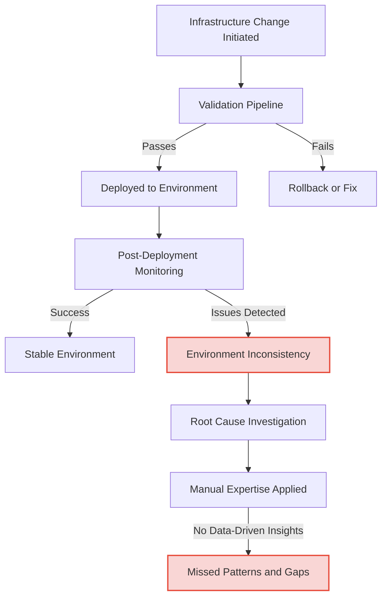
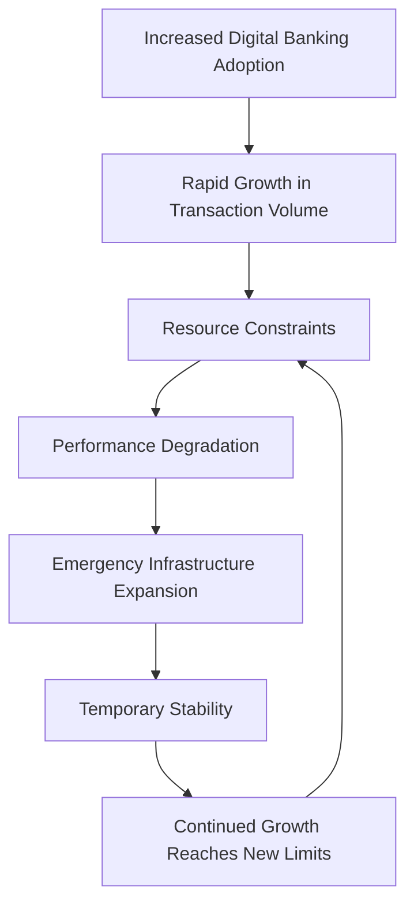

# Chapter 10: Infrastructure-Specific Metrics

## Chapter Overview: Infrastructure-Specific Metrics

This chapter descends into the infrastructure underworld, where metrics don’t just show performance—they expose lies. Whether it’s a hypervisor silently throttling your trades, Kubernetes playing musical chairs with your pods, or your cloud bill gaslighting you with unused resources, this chapter shines a light into the murky depths of compute, container, and cloud operations. It teaches you to monitor where the magic *actually* happens, which is often three layers below where you’re looking.

______________________________________________________________________

## Learning Objectives

By the end of this chapter, readers will be able to:

1. Monitor virtualization layers to detect hypervisor-level performance constraints.
2. Analyze container metrics across pods, nodes, and clusters in orchestrated environments.
3. Connect cloud performance and cost metrics to drive financial efficiency.
4. Track multi-region replication and failover readiness with resilience metrics.
5. Trace hybrid transaction flows across on-prem and cloud systems.
6. Apply Infrastructure as Code metrics for deployment reliability and consistency.
7. Forecast capacity needs with trend-based and business-aligned planning.

______________________________________________________________________

## Key Takeaways

- **Your App Isn't Slow. Your Hypervisor Is Passive-Aggressive**: Look below the VM for the real problem.
- **Kubernetes Isn’t Confusing—Until You Have to Debug It**: Understand the layers or get used to guessing.
- **Cloud Metrics Should Come With Price Tags**: Performance without cost context is just expensive trivia.
- **Failover That Works Only on Paper Doesn’t Work**: Replication status ≠ recovery readiness.
- **Your Monitoring Ends Where the Outage Begins**: Hybrid systems demand end-to-end tracing or enjoy prolonged misery.
- **If Your IaC Pipeline Doesn’t Track Drift, You’re Building Chaos**: Deployment success is more than “it ran.”
- **Capacity Planning Isn’t a Crystal Ball—It’s a Graph**: Trends, not vibes.

> Infrastructure isn’t just pipes and servers. It’s where your SLAs go to die when you stop watching.

______________________________________________________________________

## Panel 1: The Virtual Mystery

### Scene Description

The infrastructure team is investigating trading platform performance inconsistencies by analyzing hypervisor-level metrics, which reveal resource contention patterns undetectable at the application level. The visual setup includes multi-layer monitoring, where application metrics appear normal, but deeper inspection at the hypervisor level uncovers CPU scheduling delays and resource contention invisible to guest operating systems.

Below is a simplified text-based representation of the multi-layer monitoring setup:

```
+------------------------------------+
| Application Metrics Layer          |
| (Normal Performance Observed)      |
+------------------------------------+
                |
                v
+------------------------------------+
| Guest OS Metrics Layer             |
| (No Significant Issues Detected)   |
+------------------------------------+
                |
                v
+------------------------------------+
| Hypervisor Metrics Layer           |
| (CPU Scheduling Delays,            |
| Resource Contention Detected)      |
+------------------------------------+
```

This layered approach highlights the critical need to examine metrics across all levels of the virtualization stack to detect hidden issues such as "noisy neighbor" problems and resource contention that could significantly impact latency-sensitive trading systems.

### Teaching Narrative

Virtual server metrics must span multiple layers of abstraction to provide complete visibility into actual performance. Unlike physical servers with direct resource allocation, virtual environments introduce shared resources, hypervisor overhead, and potential contention that significantly impact application behavior. For latency-sensitive trading systems, comprehensive virtualization metrics enable identification of "noisy neighbor" problems and resource contention that would otherwise remain invisible to application-level monitoring.

### Common Example of the Problem

A bank's trading platform experiences intermittent performance degradation despite monitoring showing healthy resource utilization inside virtual machines. During peak trading periods, transaction latency increases by 300-400%, yet CPU utilization remains below 60%, memory is abundant, and network metrics show normal patterns. This monitoring blindness creates persistent performance issues that technical teams cannot resolve through traditional troubleshooting.

The fundamental problem is measurement abstraction: guest operating system metrics cannot see hypervisor scheduling delays, resource oversubscription, or contention from other virtual machines sharing the same physical infrastructure. Without visibility across virtualization boundaries, the team repeatedly implements ineffective optimizations because they're looking at incomplete performance data.

#### Table: Symptoms vs. Root Causes in Virtualized Environments

| **Symptom** | **Possible Root Cause** |
| ------------------------------------------------- | -------------------------------------------------------- |
| Low CPU utilization within VMs | Hypervisor scheduling delays causing unutilized CPU time |
| High application latency during peak periods | Resource contention from co-resident "noisy neighbors" |
| Normal memory and network metrics in the guest OS | Oversubscription of physical resources at the hypervisor |
| Periodic, unpredictable performance degradations | Latent contention not surfaced by application metrics |

This table provides a quick reference for identifying common symptoms of performance issues and their underlying causes in virtualized environments. By correlating symptoms with potential root causes, technical teams can more effectively diagnose and address issues that stem from virtualization layers.

### SRE Best Practice: Evidence-Based Investigation

Implement multi-layer virtualization monitoring to uncover hidden performance issues. Use the following checklist and example script to guide evidence-based investigation:

#### Checklist for Multi-Layer Virtualization Monitoring

1. **Hypervisor-Level Measurement**

   - [ ] Create CPU ready time metrics showing scheduling delays.
   - [ ] Monitor memory ballooning and swapping activity.
   - [ ] Track I/O wait times across storage layers.
   - [ ] Analyze co-tenancy impact to identify resource competition.

2. **Cross-Layer Correlation Analysis**

   - [ ] Build unified visualizations spanning physical to virtual layers.
   - [ ] Compare guest and hypervisor metrics to identify discrepancies.
   - [ ] Implement transparency metrics to expose abstraction gaps.
   - [ ] Link patterns in application and infrastructure behavior.

3. **Virtualization Optimization Metrics**

   - [ ] Score resource allocation effectiveness.
   - [ ] Monitor virtual machine right-sizing metrics.
   - [ ] Optimize workload placement using targeted metrics.
   - [ ] Evaluate affinity between related application components.

#### Example Script: Collecting CPU Ready Time Metrics

```bash
#!/bin/bash

# Script to collect CPU Ready Time metrics for virtual machines
# Requires access to vSphere CLI (govc) or other virtualization management tools

# Set environment variables for vSphere connection
export GOVC_URL="https://<vcenter-server>/sdk"
export GOVC_USERNAME="your-username"
export GOVC_PASSWORD="your-password"
export GOVC_INSECURE=true  # Set to false if using secure certificates

# Function to collect CPU Ready Time for all VMs
function collect_cpu_ready_time() {
    echo "Fetching CPU Ready Time metrics for all virtual machines..."
    govc metric.sample "cpu.ready.summation" -json | jq '.[] | {VM: .entity, CPU_Ready_Time_ms: .value}'
}

# Execute the function
collect_cpu_ready_time
```

#### Example Analysis Output

```json
[
  { "VM": "TradingApp-VM1", "CPU_Ready_Time_ms": 300 },
  { "VM": "TradingApp-VM2", "CPU_Ready_Time_ms": 450 },
  { "VM": "Analytics-VM1", "CPU_Ready_Time_ms": 150 }
]
```

#### Key Investigation Insight

Cross-layer analysis reveals the root cause invisible to traditional monitoring: CPU ready time exceeds 25% during peak trading as the hypervisor struggles to schedule CPU time across competing workloads. This creates transaction delays despite apparent resource availability within the virtual machine.

Use the checklist and script to systematically identify and address performance bottlenecks in virtualized environments.

### Banking Impact

For trading platforms, virtualization performance directly affects both execution quality and competitive advantage. Hidden performance constraints create trade execution delays during critical market periods, potentially costing clients significant amounts on price movements while orders await processing. These delays affect customer confidence, potentially driving high-value trading activity to competitors with more predictable performance. Beyond immediate financial impact, performance inconsistency may trigger regulatory scrutiny regarding best execution obligations. Complete virtualization visibility enables proactive optimization that ensures consistent performance for critical financial workloads.

### Implementation Guidance

To effectively address virtualization performance inconsistencies, follow this step-by-step guide:

#### Step 1: Implement Comprehensive Monitoring Across Virtualization Layers

- Deploy tools capable of capturing metrics at the hardware, hypervisor, and guest operating system levels.
- Ensure visibility into CPU, memory, storage, and network usage across all layers.
- Enable hypervisor-specific monitoring features (e.g., CPU scheduling delays, resource contention alerts).

#### Step 2: Create Unified Dashboards for Cross-Layer Metrics

- Design dashboards that aggregate metrics from hardware, hypervisor, and application layers.
- Highlight key performance indicators (KPIs) such as CPU ready time, memory ballooning, and I/O latency.
- Use visualizations to clearly differentiate between normal and anomalous behaviors.

#### Step 3: Develop Correlation Analysis Between Guest and Hypervisor Measurements

- Implement data correlation scripts or tools to map application-level performance issues to underlying hypervisor metrics.
- Identify patterns, such as "noisy neighbor" interference or resource contention.
- Test correlations with real-world workloads to validate findings.

#### Step 4: Build Placement Optimization Based on Workload Characteristics

- Analyze workload profiles to determine resource utilization patterns.
- Configure VM placement policies to minimize contention (e.g., through affinity/anti-affinity rules).
- Regularly reassess and adjust placement as workloads and infrastructure evolve.

#### Step 5: Establish Regular Cross-Layer Performance Reviews

- Schedule routine performance audits that involve both application and infrastructure teams.
- Review trends in hypervisor and guest metrics to proactively detect emerging issues.
- Incorporate findings into capacity planning and optimization strategies.

#### Checklist Summary

- [ ] Monitoring tools deployed for all virtualization layers
- [ ] Unified dashboards designed and operational
- [ ] Correlation analysis implemented and validated
- [ ] Resource placement policies optimized
- [ ] Regular cross-layer performance reviews conducted

## Panel 2: The Container Confusion

### Scene Description

A new SRE is puzzled by the differences between pod and node metrics in Kubernetes as they analyze a multi-level dashboard. The dashboard highlights the relationships between different measurement layers within the container orchestration hierarchy. The visual focuses on a payment microservices environment, showcasing how metrics are collected and interconnected across layers.

To clarify the hierarchy, consider the following text-based representation of Kubernetes orchestration levels:

```
Cluster
└── Node
    └── Pod
        └── Container
```

- **Cluster**: The highest level, representing the entire Kubernetes environment.
- **Node**: A physical or virtual machine within the cluster, hosting one or more pods.
- **Pod**: A group of one or more containers that share resources and network.
- **Container**: The smallest unit, running a specific application or service.

This hierarchy helps illustrate how metrics are scoped and how resource allocation and usage are tracked at each level, providing context for troubleshooting and optimization in Kubernetes environments.

### Teaching Narrative

Container orchestration metrics require specialized measurement approaches focusing on the relationships between containers, pods, nodes, and clusters. These multi-level metrics track resource allocation, utilization, and constraints across orchestration layers, providing visibility into complex interactions that affect application performance. For payment microservices in Kubernetes environments, understanding these metric relationships enables effective troubleshooting and optimization across the orchestration hierarchy.

### Common Example of the Problem

A bank migrates its payment processing services to a containerized architecture using Kubernetes, but immediately faces monitoring challenges. Operations teams accustomed to traditional infrastructure struggle with the new abstraction layers and orchestration concepts. When performance issues occur, engineers find themselves lost in a sea of unfamiliar metrics—container metrics, pod metrics, node metrics, and cluster metrics—without understanding how they relate or which ones matter for different scenarios. During a recent incident, the team spent hours examining container CPU metrics while completely missing node-level network constraints that were the actual bottleneck. This measurement confusion significantly extended resolution time as engineers struggled to navigate unfamiliar metric relationships.

#### Checklist: Avoiding Monitoring Pitfalls in Kubernetes

To prevent similar challenges, consider the following key steps:

1. **Understand Metric Hierarchies**:

   - Learn the relationships between container, pod, node, and cluster metrics.
   - Map metrics to their respective abstraction layers and understand their scope.

2. **Define Key Metrics for Your Use Case**:

   - Identify critical metrics for your application (e.g., CPU, memory, network, or disk).
   - Prioritize metrics that directly impact performance for your workload type.

3. **Correlate Metrics Across Layers**:

   - Always correlate metrics from different layers (e.g., pod-level resource usage with node-level constraints).
   - Use monitoring tools or dashboards that support cross-layer analysis.

4. **Establish Baselines and Alerts**:

   - Monitor steady-state performance to establish normal metric baselines.
   - Configure alerts for anomalies at both container and node levels to catch multi-layer issues.

5. **Train Teams on Kubernetes Metrics**:

   - Provide targeted training for engineers to familiarize them with Kubernetes monitoring concepts.
   - Focus on common pitfalls, like misinterpreting metrics or overlooking layer dependencies.

6. **Leverage Visualization Tools**:

   - Use dashboards or tools that clearly illustrate metric relationships (e.g., node-to-pod mappings).
   - Ensure the tools highlight potential bottlenecks or resource contention points.

By following this checklist, teams can reduce confusion and improve their ability to identify and resolve performance issues in Kubernetes environments.

### SRE Best Practice: Evidence-Based Investigation

Implement structured container orchestration metrics framework:

1. **Multi-layer Monitoring Hierarchy**

   - Create container-level resource utilization metrics
   - Implement pod-level aggregate performance measurements
   - Develop node-level resource constraint monitoring
   - Build cluster-level capacity and health metrics

2. **Resource Request vs. Usage Analysis**

   - Create comparison metrics between requests and actual usage
   - Implement headroom analysis showing available capacity
   - Develop constraint identification across orchestration layers
   - Build optimization opportunities based on usage patterns

3. **Orchestration-Specific Measurements**

   - Create pod scheduling and placement metrics
   - Implement health probe effectiveness monitoring
   - Develop service discovery and connectivity metrics
   - Build autoscaling behavior and effectiveness measurements

#### Metrics Overview Table

| **Level** | **Key Metrics** | **Purpose** | **Example Use Case** |
| ------------- | ------------------------------------------- | ---------------------------------------------------------- | ------------------------------------------------------------------------------------------------ |
| **Container** | CPU, memory, disk I/O, network utilization | Monitor resource usage at the container level | Identify which containers are exceeding their memory or CPU limits |
| **Pod** | Aggregate resource usage, restart counts | Understand pod-level performance and stability | Detect recurring failures in pods due to insufficient resource requests |
| **Node** | Resource availability, network throughput | Track node-level constraints and bottlenecks | Identify nodes with saturated network links causing application slowdowns |
| **Cluster** | Capacity, health, autoscaling effectiveness | Monitor overall health and scaling behavior of the cluster | Optimize cluster autoscaling to balance workloads and reduce underutilized or overburdened nodes |

#### Cross-Layer Insight Example

Structured analysis reveals critical insights invisible to single-layer monitoring:

- At the container level, CPU metrics showed 45% utilization.
- At the node level, network throughput was 95% saturated due to pod placement patterns concentrating network-intensive workloads on specific nodes.
- This constraint, only visible through cross-layer orchestration metrics, highlighted the need to adjust pod scheduling policies to distribute network load more evenly across nodes.

### Banking Impact

For payment microservices, container orchestration visibility directly affects both service reliability and operational efficiency. Monitoring confusion creates extended incident resolution times when engineers cannot quickly navigate the metric hierarchy to identify constraints. Each minute of delayed diagnosis potentially affects thousands of payment transactions, creating customer friction and potential financial losses. Beyond incident impact, ineffective container optimization leads to wasted infrastructure resources and unnecessary operational costs. Comprehensive orchestration metrics enable both faster troubleshooting and more efficient resource utilization for critical financial services.

### Implementation Guidance

1. **Create Structured Metric Hierarchy**\
   Design a metric hierarchy that illustrates the relationships between containers, pods, nodes, and clusters. Use labels and annotations in your monitoring tools to group metrics logically. For example:

   ```yaml
   - hierarchy:
       cluster: payment-cluster
       node: node-1
       pod: payment-pod-abc
       container: payment-container
   ```

2. **Implement Unified Dashboards**\
   Set up dashboards that provide visibility across multiple layers of the orchestration hierarchy. For example, in Grafana, you can use Prometheus as a data source and visualize cross-layer metrics:

   ```yaml
   - job_name: 'kubernetes-nodes'
     kubernetes_sd_configs:
       - role: node
   - job_name: 'kubernetes-pods'
     kubernetes_sd_configs:
       - role: pod
   ```

   Example query for CPU usage per pod:

   ```promql
   sum(rate(container_cpu_usage_seconds_total{namespace="payments"}[5m])) by (pod)
   ```

3. **Develop Resource Optimization Analysis**\
   Use historical data to analyze resource usage trends and identify bottlenecks. Automate recommendations for resource requests and limits using tools like the Kubernetes Vertical Pod Autoscaler (VPA) or custom scripts:

   ```bash
   kubectl describe vpa payment-pod-abc
   ```

4. **Build Container-Specific Anomaly Detection**\
   Implement alerting rules for container-level anomalies. For example, using Prometheus Alertmanager:

   ```yaml
   groups:
     - name: container-anomalies
       rules:
         - alert: HighContainerCPU
           expr: rate(container_cpu_usage_seconds_total[2m]) > 0.8
           for: 2m
           labels:
             severity: warning
           annotations:
             summary: "High CPU usage in container"
             description: "Container {{ $labels.container }} is using more than 80% CPU for 2 minutes."
   ```

5. **Establish Education Programs**\
   Create training resources and workshops to help teams transition to understanding and using container metrics effectively. Include examples like the following to guide discussions:

   - How a pod's memory usage impacts node performance.
   - How to use metrics like `container_memory_usage_bytes` and `container_network_receive_bytes_total` for troubleshooting.

## Panel 3: The Cloud Bill Shock

### Scene Description

The finance team is evaluating cloud costs versus performance, focusing on a metrics dashboard that presents detailed resource utilization across AWS services for recently migrated banking components. The dashboard visually highlights key cost optimization metrics, including:

- **Idle Resources**: Identifying underutilized instances and services.
- **Overprovisioned Services**: Pinpointing areas with excessive resource allocation.
- **Utilization Patterns**: Analyzing trends in resource consumption over time.
- **Financial Impact Calculations**: Displaying cost-saving opportunities based on adjustments.

Below is a conceptual representation of the metrics dashboard flow:



This visual flow illustrates how metrics are analyzed and lead to actionable insights for balancing technical performance with financial efficiency.

### Teaching Narrative

Cloud environment metrics span performance, cost efficiency, and shared responsibility models, creating direct relationships between resource consumption and ongoing operational expenses. These measurements track utilization efficiency, idle resources, scaling effectiveness, and cost optimization opportunities across cloud services. For banking systems migrated to cloud platforms, integrated performance and cost metrics enable optimized resource allocation based on both technical requirements and financial considerations.

### Common Example of the Problem

A bank migrates several consumer banking services to the cloud, expecting cost savings compared to on-premises infrastructure. Six months after migration, finance leaders raise alarms as cloud expenses exceed projections by 140% despite transaction volumes matching forecasts. Operations teams monitor traditional performance metrics—CPU, memory, disk, network—but lack visibility into cost efficiency and resource optimization. The fundamental disconnect is measurement philosophy: on-premises metrics focus on capacity constraints while cloud environments require efficiency optimization to control costs. Without metrics connecting consumption to expense, the team has unknowingly created a financially inefficient architecture with overprovisioned resources, idle instances, and unoptimized services driving unnecessarily high operational costs.

#### Summary of Inefficiencies and Financial Impacts

| **Inefficiency** | **Description** | **Financial Impact** |
| ------------------------------- | -------------------------------------------------------------------------------- | ------------------------------------------------ |
| Overprovisioned Resources | Resources allocated far above actual usage needs, such as oversized instances. | Paying for unused capacity, inflating costs. |
| Idle Instances | Instances running without active workloads or significant utilization. | Continuous charges for unused compute power. |
| Unoptimized Services | Suboptimal configurations, such as non-utilized savings plans or outdated tiers. | Higher-than-necessary costs for cloud services. |
| Lack of Cost Metrics Monitoring | Focus on performance metrics without cost-awareness integration. | Inefficient spending with no corrective actions. |

#### Checklist to Mitigate Issues

- [ ] Audit all cloud resources for usage versus allocation.
- [ ] Identify and shut down idle instances.
- [ ] Right-size overprovisioned resources based on actual workloads.
- [ ] Implement savings plans or reserved instances where applicable.
- [ ] Integrate cost metrics into operational dashboards.
- [ ] Regularly review and optimize service configurations.

### SRE Best Practice: Evidence-Based Investigation

Implement comprehensive cloud cost-efficiency metrics by following these best practices:

#### Checklist for Evidence-Based Investigation

1. **Resource Efficiency Measurement**

   - [ ] Create utilization metrics across all provisioned resources.
   - [ ] Implement idle resource identification and tracking scripts.
   - [ ] Develop right-sizing analysis for compute instances.
   - [ ] Build reservation coverage metrics for consistent workloads.

2. **Cost Attribution Analytics**

   - [ ] Create service-level cost allocation metrics.
   - [ ] Implement transaction-cost efficiency measurement.
   - [ ] Develop anomaly detection for spending patterns.
   - [ ] Build forecasting models for budget planning.

3. **Optimization Opportunity Identification**

   - [ ] Create automated efficiency recommendations with impact assessment.
   - [ ] Implement storage lifecycle and tiering effectiveness metrics.
   - [ ] Develop data transfer optimization measurements.
   - [ ] Build serverless execution efficiency metrics.

#### Example Code Snippet: Idle Resource Tracking

```python
import boto3

# Initialize AWS EC2 client
ec2_client = boto3.client('ec2')

# Retrieve all EC2 instances
instances = ec2_client.describe_instances()

# Identify idle instances based on CPU utilization
idle_instances = []
threshold = 5  # CPU utilization threshold in percentage

for reservation in instances['Reservations']:
    for instance in reservation['Instances']:
        instance_id = instance['InstanceId']
        metrics = ec2_client.get_metric_data(
            MetricDataQueries=[
                {
                    'Id': 'cpuUtilizationQuery',
                    'MetricStat': {
                        'Metric': {
                            'Namespace': 'AWS/EC2',
                            'MetricName': 'CPUUtilization',
                            'Dimensions': [{'Name': 'InstanceId', 'Value': instance_id}]
                        },
                        'Period': 300,
                        'Stat': 'Average',
                    },
                    'ReturnData': True
                }
            ],
            StartTime=datetime.utcnow() - timedelta(hours=1),
            EndTime=datetime.utcnow()
        )

        avg_cpu = metrics['MetricDataResults'][0]['Values']
        if avg_cpu and sum(avg_cpu) / len(avg_cpu) < threshold:
            idle_instances.append(instance_id)

print(f"Idle Instances: {idle_instances}")
```

#### Insights from Efficiency Analysis

Efficiency analysis transforms cloud management from performance-only to balanced optimization. For example:

- 42% of instances are significantly overprovisioned.
- 28% of storage uses inappropriate tiers.
- Non-production environments run 24/7 despite being used only during business hours.

These inefficiencies can cost over $230,000 monthly, highlighting the critical need for evidence-based investigation and continuous optimization.

### Banking Impact

For cloud-hosted banking services, cost efficiency directly affects both operational economics and service pricing models. Inefficient cloud implementations create unnecessary expenses that either reduce margins or increase prices for financial products, directly impacting competitiveness.

Consider this analogy: operating an inefficient cloud environment is like leasing a fleet of luxury cars for a delivery service but only using them to transport small packages a few times a week. The excess capacity and high costs of unused resources erode profitability, much like underutilized cloud resources can inflate operational expenses without delivering proportional value.

A case study illustrates this further: a mid-sized bank migrated its loan processing system to the cloud but overprovisioned compute and storage resources to accommodate peak loads. For 80% of the time, these resources remained underutilized, leading to monthly cloud bills exceeding their forecasted budget by 30%. By analyzing cloud metrics and rightsizing their resources, the bank reduced costs by 25%, freeing up capital for a customer-facing mobile app initiative. This realignment not only improved cost efficiency but also accelerated strategic innovation, demonstrating the broader financial and operational impact of cloud optimization.

Comprehensive cloud efficiency metrics enable balanced optimization that maintains performance requirements while controlling costs. This approach fosters sustainable cloud operations aligned with business objectives, ensuring banking services remain competitive and agile in a dynamic market.

### Implementation Guidance

#### Step-by-Step Process for Optimizing Cloud Costs and Performance



1. **Implement Efficiency Monitoring**\
   Deploy comprehensive monitoring tools across all cloud services to track resource utilization, idle resources, and scaling effectiveness.

2. **Create Integrated Dashboards**\
   Design dashboards that combine performance metrics with cost data to provide a unified view of utilization efficiency and financial impact.

3. **Develop Automated Optimization Recommendations**\
   Use analytics and machine learning to generate actionable recommendations for resource optimization, paired with financial impact assessments.

4. **Build Tagging and Allocation Systems**\
   Establish robust tagging and allocation mechanisms to ensure accurate cost attribution for different teams, projects, or services.

5. **Conduct Regular Efficiency Reviews**\
   Schedule routine reviews involving both technical and financial stakeholders to evaluate performance, identify cost-saving opportunities, and align resource allocation with business objectives.

## Panel 4: The Multi-Region Resilience

### Scene Description

The disaster recovery team is actively testing cross-region failover capabilities, using a metrics dashboard to monitor replication status and recovery metrics in real time. The scene includes a visual representation of the disaster recovery measurement framework, highlighting key metrics such as data synchronization, configuration consistency, and recovery time objectives (RTO). Below is a conceptual diagram that outlines the components and flow of the framework across geographically distributed banking infrastructure.



This diagram illustrates how the system components interact to ensure data synchronization, maintain configuration consistency, and validate failover readiness. The metrics dashboard consolidates these inputs to provide a comprehensive overview of the system's disaster recovery capabilities, ensuring operational resilience for a global banking network.

### Teaching Narrative

Multi-region architecture metrics focus on data consistency, failover readiness, and recovery capabilities across geographically distributed systems. These specialized measurements track replication lag, data synchronization, configuration consistency, and recovery time objectives, providing assurance that backup capabilities remain functional and synchronized. For global banking systems, these metrics verify that recovery capabilities remain continuously available rather than discovered to be broken during actual emergencies.

### Common Example of the Problem

A bank implements geographic redundancy for critical banking services with infrastructure in primary and backup regions, but faces a significant verification challenge. Regular disaster recovery tests frequently reveal unexpected issues despite monitoring showing healthy replication. These issues include:

| **Issue** | **Description** | **Impact** |
| ----------------------------- | ----------------------------------------------------------------------------------------- | ------------------------------------------------------------------------------- |
| **Schema Drift** | Database schemas diverge between primary and backup regions due to uncoordinated updates. | Leads to replication failures or incorrect functionality in the backup region. |
| **Configuration Differences** | Discrepancies in system configurations between regions. | Causes misaligned behavior or incompatibility during failover. |
| **Authentication Failures** | Authentication systems are not consistently functional across all regions. | Prevents cross-region user access or service authentication during failover. |
| **Outdated Recovery Steps** | Disaster recovery procedures contain obsolete or incomplete steps. | Extends recovery time or results in failed recovery efforts during emergencies. |

The fundamental problem is verification gaps: while basic replication health appears in monitoring, comprehensive recovery readiness remains unmeasured between infrequent tests. Without continuous metrics verifying all recovery dimensions, protection that appears adequate may fail during actual incidents.

### SRE Best Practice: Evidence-Based Investigation

#### Checklist for Implementing Multi-Region Readiness Metrics

**1. Data Synchronization Verification**

- [ ] Create replication lag monitoring with trend analysis.
- [ ] Implement data consistency validation across regions.
- [ ] Develop schema and structure verification metrics.
- [ ] Build reconciliation metrics ensuring completeness.

**2. Configuration Consistency Measurement**

- [ ] Create drift detection between regional environments.
- [ ] Implement version consistency monitoring for all components.
- [ ] Develop capacity equivalence verification.
- [ ] Build security configuration comparison metrics.

**3. Recovery Capability Validation**

- [ ] Create automated recovery testing with success metrics.
- [ ] Implement dependency verification across regions.
- [ ] Develop time-to-recovery measurement against objectives.
- [ ] Build service-level verification ensuring business continuity.

______________________________________________________________________

#### Table Summary: Multi-Region Best Practices

| Category | Key Metric/Practice | Purpose |
| ----------------------------- | --------------------------------- | ----------------------------------------------- |
| **Data Synchronization** | Replication lag monitoring | Detect delays in cross-region data replication. |
| | Data consistency validation | Ensure synchronized data integrity. |
| | Schema and structure verification | Verify uniformity in schemas across regions. |
| | Reconciliation metrics | Identify incomplete or missing data. |
| **Configuration Consistency** | Drift detection | Detect configuration deviations across regions. |
| | Version consistency monitoring | Ensure all components are on matching versions. |
| | Capacity equivalence verification | Guarantee regional capacity parity. |
| | Security configuration comparison | Identify mismatched security setups. |
| **Recovery Capability** | Automated recovery testing | Validate recovery workflows and success rates. |
| | Dependency verification | Check interdependencies across regions. |
| | Time-to-recovery measurement | Compare recovery times against objectives. |
| | Service-level verification | Ensure business continuity post-failover. |

______________________________________________________________________

Comprehensive analysis reveals critical gaps invisible to basic monitoring: while data replication shows healthy status, authentication service configurations have silently diverged between regions, creating a recovery blocker that would prevent user access after failover—a critical vulnerability despite "green" replication metrics.

### Banking Impact

For financial institutions, recovery capability directly affects both business continuity and regulatory compliance. Inadequate recovery verification creates vulnerability to regional disruptions that could extend outages from hours to days when failover doesn't function as expected. The business impact of extended outages includes direct financial losses, regulatory penalties, and significant reputation damage affecting customer confidence. Beyond immediate incident concerns, unreliable recovery capabilities may violate regulatory requirements for business continuity preparedness. Comprehensive multi-region metrics ensure that disaster recovery capabilities remain continuously functional, providing confidence that critical services can be restored within required timeframes when needed.

### Implementation Guidance

1. **Implement comprehensive replication monitoring with lag measurement**\
   Set up monitoring tools to track replication lag across regions. Use database-native features (e.g., MySQL's `SHOW SLAVE STATUS` or PostgreSQL's replication monitoring views) to measure lag in seconds. Configure alerts to notify teams when lag exceeds acceptable thresholds. Below is an example SQL query for PostgreSQL:

   ```sql
   SELECT pg_last_wal_replay_lsn() AS last_replay_lsn,
          pg_last_wal_receive_lsn() AS last_receive_lsn,
          CASE 
              WHEN pg_last_wal_receive_lsn() = pg_last_wal_replay_lsn() THEN 'Synchronized'
              ELSE 'Lagging'
          END AS replication_status;
   ```

2. **Create automated configuration consistency verification**\
   Automate the validation of configuration consistency across regions using configuration management tools like Ansible, Chef, or Terraform. For example, you can use a script to compare hash values of configuration files:

   ```bash
   # Bash script to compare config file hashes across regions
   REGION1_HASH=$(ssh region1-server "sha256sum /path/to/config/file" | awk '{print $1}')
   REGION2_HASH=$(ssh region2-server "sha256sum /path/to/config/file" | awk '{print $1}')

   if [ "$REGION1_HASH" == "$REGION2_HASH" ]; then
       echo "Configuration files are consistent"
   else
       echo "Configuration mismatch detected"
   fi
   ```

   Schedule this script to run periodically and send alerts if mismatches are found.

3. **Develop regular recovery testing with success metrics**\
   Implement automated disaster recovery drills using infrastructure-as-code tools. For instance, trigger failover simulations and measure Recovery Time Objective (RTO) and Recovery Point Objective (RPO). Use metrics dashboards to visualize results. Example pseudocode for a failover test:

   ```python
   def simulate_failover():
       trigger_failover(primary_region="us-east-1", failover_region="us-west-2")
       recovery_time = measure_recovery_time()
       assert recovery_time < defined_rto, "RTO exceeded!"
   simulate_failover()
   ```

4. **Build dependency validation ensuring complete service functionality**\
   Validate all dependent services during failover testing to ensure they function as expected. Build a dependency map and use automated health-check scripts to verify service readiness. Example dependency validation flow:

   ```
   [Database Check] --> [API Endpoint Check] --> [Frontend Service Check]
   ```

   Write health-check scripts for each component and aggregate results into a dashboard.

5. **Establish continuous readiness verification with alerting for drift**\
   Use continuous integration/continuous deployment (CI/CD) pipelines to detect and alert for configuration drift or unsynchronized data. For example, integrate GitOps workflows to monitor infrastructure state:

   ```yaml
   # Example GitOps workflow for drift detection
   name: Detect Drift
   on:
     schedule:
       - cron: "0 0 * * *" # Daily check
   jobs:
     detect-drift:
       runs-on: ubuntu-latest
       steps:
         - name: Checkout Infrastructure Repo
           uses: actions/checkout@v3
         - name: Run Drift Detection
           run: terraform plan -out=drift.plan
         - name: Alert on Drift
           if: failure()
           run: echo "Configuration drift detected! Notify team."
   ```

These automated measures ensure your multi-region architecture remains reliable, consistent, and ready for disaster recovery scenarios.

## Panel 5: The Hybrid Handoff

### Scene Description

The operations team is responsible for managing transaction flows between on-premises and cloud systems, leveraging unified metrics to provide end-to-end performance insights across boundaries. A visual representation illustrates the transaction path, highlighting the flow from traditional data centers to cloud platforms. Metrics are displayed at each handoff point, identifying bottlenecks and latency contributions.

Below is a text-based diagram representing the transaction flow:

```
[On-Premises System] 
     |
     v
[Handoff Point: Metrics Collected]
     |
     v
[Cloud Gateway]
     |
     v
[Handoff Point: Metrics Collected]
     |
     v
[Cloud System]
```

Each handoff point is monitored with unified metrics to detect bottlenecks, measure latency, and ensure transaction integrity across the hybrid architecture.

### Teaching Narrative

Hybrid architecture metrics bridge traditional data centers and cloud platforms, creating consistent visibility across environment boundaries. These integrated measurements track transaction flows as they cross infrastructure boundaries, identifying performance impacts, data consistency issues, and integration bottlenecks. For banking systems spanning multiple environments, hybrid metrics eliminate dangerous blind spots at system boundaries where transactions can fail without clear detection.

### Common Example of the Problem

A bank implements a hybrid architecture where new digital banking channels run in the cloud while core transaction processing remains on mainframe systems. When customers report inconsistent account information and occasional transaction failures, troubleshooting becomes extraordinarily complex. Operations teams maintain separate monitoring for cloud and on-premises systems, but lack visibility into transactions as they cross environment boundaries. This monitoring gap creates "blindness in the middle" where transactions disappear from visibility during critical integration points. Without end-to-end transaction tracking spanning hybrid infrastructure, teams cannot determine whether reported issues originate in cloud components, on-premises systems, or the integration layer connecting them.

#### Transaction Flow and Monitoring Gap

Below is a text-based representation of the transaction flow and the associated monitoring gap:

```
Customer Action (e.g., Transfer Funds)
    │
    ▼
Cloud System (New Digital Banking Channels)
    │   [Cloud Monitoring Active]
    ▼
Integration Layer (Hybrid Handoff)
    │   [No Unified Monitoring]
    ▼
On-Premises System (Mainframe Processing)
    │   [On-Premises Monitoring Active]
    ▼
Transaction Completion (e.g., Account Updated)
```

In this flow, the "Integration Layer" represents the critical handoff point between cloud and on-premises systems. Without unified monitoring, transactions passing through this layer are effectively invisible, creating a blind spot. This lack of visibility prevents operations teams from diagnosing whether issues like inconsistent account data or failed transactions stem from cloud systems, on-prem components, or the integration itself.

By implementing hybrid metrics with end-to-end monitoring, this gap can be bridged, ensuring transaction flows are fully traceable across all infrastructure boundaries.

### SRE Best Practice: Evidence-Based Investigation

Implement comprehensive hybrid transaction monitoring using the following practices:

#### Checklist: Steps for Evidence-Based Investigation

| Step Category | Actions | Benefits |
| ------------------------------------------ | ------------------------------------------------------------ | ----------------------------------------------------------------------------------- |
| **End-to-End Transaction Tracking** | - Create distributed tracing spanning all environments | - Enables visibility into transaction paths across on-premises and cloud boundaries |
| | - Implement correlation identifiers preserving context | - Facilitates root cause analysis by linking related actions |
| | - Develop integration point performance measurement | - Identifies delays or failures in the integration layer |
| | - Build transaction path visualization across boundaries | - Provides holistic understanding of transaction flow and bottlenecks |
| **Cross-Environment Performance Analysis** | - Create comparative latency metrics by environment | - Highlights latency discrepancies between systems |
| | - Implement bottleneck identification across boundaries | - Pinpoints cross-environment performance constraints |
| | - Develop timing analysis for integration components | - Helps detect delays in specific integration steps |
| | - Build environment contribution metrics showing impact | - Quantifies performance contributions of each environment |
| **Integration Health Verification** | - Create connection pool monitoring for integration services | - Detects resource exhaustion or queuing at integration layers |
| | - Implement data transformation correctness verification | - Ensures accurate data exchanges between environments |
| | - Develop protocol compatibility monitoring | - Prevents mismatches in communication protocols |
| | - Build version synchronization metrics across environments | - Identifies version drift that could impact compatibility |

#### Summary of Benefits

- **Improved Troubleshooting Effectiveness**\
  Comprehensive hybrid analysis reveals issues invisible to environment-specific metrics. For instance, while individual cloud and on-premises systems may appear healthy, connection pooling in the integration layer may cause significant queuing during peak periods. Evidence-based investigation ensures such bottlenecks are detected and addressed.

### Banking Impact

For hybrid banking architectures, cross-boundary visibility directly affects both incident resolution and customer experience. Fragmented monitoring creates extended diagnostic times when issues span environment boundaries, prolonging resolution while customers experience inconsistent service.

Consider the case of a global bank processing millions of daily transactions across on-premises data centers and cloud platforms. During a high-traffic period, the bank experienced transaction failures in its real-time payment system due to latency spikes at the handoff between environments. Without hybrid metrics, it took over 6 hours to identify the root cause: an overloaded API gateway in the cloud environment. This delay led to over $500,000 in lost revenue from interrupted transactions and a 25% increase in customer complaints over the following week.

The business impact extends beyond immediate incidents to include integration inefficiencies that affect transaction throughput, data consistency challenges that create reconciliation work, and potential compliance issues when transactions cannot be fully traced. Comprehensive hybrid metrics enable efficient operations across diverse technologies, ensuring consistent service quality regardless of the underlying infrastructure. For example, by implementing unified end-to-end monitoring, the same bank reduced mean time to resolution (MTTR) by 40% and improved transaction throughput by 15%, directly enhancing customer satisfaction and operational efficiency.

### Implementation Guidance

1. **Implement distributed tracing spanning all technology environments**\
   Use tools like OpenTelemetry to implement distributed tracing across on-premises and cloud infrastructure. Below is an example configuration for an OpenTelemetry collector to aggregate traces from multiple environments:

   ```yaml
   receivers:
     otlp:
       protocols:
         http:
         grpc:

   processors:
     batch:

   exporters:
     logging:
       loglevel: debug
     otlp:
       endpoint: "cloud-telemetry-endpoint:4317"

   service:
     pipelines:
       traces:
         receivers: [otlp]
         processors: [batch]
         exporters: [logging, otlp]
   ```

2. **Create unified dashboards showing end-to-end transaction flows**\
   Leverage tools like Grafana or Kibana to visualize metrics and traces. For example, in Grafana, you can configure a dashboard to display transaction latency by integrating with Prometheus or Jaeger. Below is a JSON snippet to configure a simple panel for transaction latency:

   ```json
   {
     "title": "Transaction Latency",
     "type": "gauge",
     "targets": [
       {
         "expr": "transaction_latency_seconds",
         "legendFormat": "{{service}}"
       }
     ],
     "options": {
       "reduceOptions": {
         "calcs": ["avg"],
         "fields": ""
       },
       "orient": "horizontal"
     }
   }
   ```

3. **Develop integration point monitoring with detailed performance metrics**\
   Implement Prometheus exporters or cloud-native monitoring tools to track metrics at integration points. For example, monitor API latency, request rates, and error rates. Use PromQL queries like:

   ```
   rate(api_requests_total[5m])
   ```

4. **Build automated testing verifying cross-environment functionality**\
   Create a CI/CD pipeline to run integration tests across environments. Example YAML for a GitHub Actions workflow:

   ```yaml
   name: Cross-Environment Tests

   on:
     push:
       branches:
         - main

   jobs:
     test:
       runs-on: ubuntu-latest
       steps:
         - name: Checkout Code
           uses: actions/checkout@v3

         - name: Run Integration Tests
           run: |
             python -m unittest discover -s tests/integration
   ```

5. **Establish regular reviews examining cross-boundary performance patterns**\
   Schedule periodic reviews with stakeholders using reports generated from tools like Elastic APM or AWS X-Ray. Include a summary of metrics like transaction throughput, latency trends, and error rates. Utilize a simple Mermaid diagram to represent the performance review process:

   ```mermaid
   flowchart TD
       A[Collect Metrics] --> B[Generate Reports]
       B --> C[Review Performance]
       C --> D[Identify Bottlenecks]
       D --> E[Implement Improvements]
   ```

## Panel 6: The Infrastructure as Code Metrics

### Scene Description

The DevOps team is gathered to review deployment success metrics for infrastructure changes, focusing on quality gates and validation measurements. The central visual in this scene is a detailed metrics dashboard that provides key insights into the infrastructure deployment pipeline. This dashboard tracks the following:

- **Automated Validation Results**: Displays the percentage of successful and failed validation checks during deployment.
- **Drift Detection**: Highlights discrepancies between the deployed infrastructure and the desired configuration state.
- **Deployment Success Rates**: Breaks down deployment outcomes across different environment types (e.g., development, staging, production).

Below is a conceptual representation of the metrics flow within the pipeline:



This flow illustrates how infrastructure changes progress through validation stages and result in measurable metrics, which are visualized on the dashboard. By systematically tracking these metrics, the team ensures that infrastructure changes are reliable, consistent, and aligned with operational standards.

### Teaching Narrative

Infrastructure as Code metrics apply deployment measurement principles to infrastructure changes, tracking success rates, validation coverage, and environment consistency. These measurements transform infrastructure management from manual processes to systematic, measurable operations with clear success criteria. For banking environments, where infrastructure stability directly impacts financial services, these metrics ensure that infrastructure evolution maintains consistent reliability across all environments.

### Common Example of the Problem

A bank adopts Infrastructure as Code practices for environment management but struggles to achieve consistent results across deployments. Some infrastructure changes deploy flawlessly while others create unexpected issues despite passing initial validation. Operations teams lack visibility into deployment effectiveness beyond basic success/failure status, preventing systematic improvement. Without comprehensive metrics measuring infrastructure deployment quality, the team cannot identify pattern differences between successful and problematic changes, forcing them to rely on individual expertise rather than data-driven processes. This measurement gap creates persistent inconsistency across environments that affects application reliability despite automation adoption.

Below is a simplified representation of the problem flow, highlighting where visibility gaps occur:



In this flow, the lack of detailed metrics impacts two critical areas: detecting and resolving issues in step `G` (Environment Inconsistency) and refining processes in step `J` (Missed Patterns and Gaps). These visibility gaps hinder the team’s ability to systematically improve deployment outcomes and maintain consistent environment reliability.

### SRE Best Practice: Evidence-Based Investigation

Implement comprehensive infrastructure deployment metrics to improve reliability and identify improvement areas. Use the following checklist to guide your practices:

| **Practice Area** | **Key Practices** | **Benefits** |
| --------------------------------------- | ----------------------------------------------------------------- | ------------------------------------------------------------------- |
| **Deployment Success Measurement** | - Track success rates across change types | - Identify trends in deployment success |
| | - Implement validation coverage metrics for testing | - Ensure comprehensive test coverage |
| | - Measure time-to-deployment | - Improve deployment speed while maintaining quality |
| | - Analyze rollback frequency and causation | - Address root causes of deployment failures efficiently |
| **Infrastructure Quality Verification** | - Create configuration validation metrics with compliance scoring | - Ensure configurations align with standards and policies |
| | - Automate testing coverage for infrastructure | - Reduce manual verification effort and errors |
| | - Verify idempotence to ensure repeatability | - Guarantee consistent results for repeated operations |
| | - Monitor drift detection to identify unauthorized changes | - Maintain infrastructure integrity and prevent unexpected issues |
| **Environment Consistency Analysis** | - Compare configurations across environments | - Detect discrepancies between development, staging, and production |
| | - Verify dependencies to ensure completeness | - Avoid runtime failures due to missing dependencies |
| | - Track version consistency for all components | - Maintain alignment and compatibility across infrastructure |
| | - Score environment equality to show overall alignment | - Quantify environment consistency for continuous improvement |

Comprehensive deployment metrics transform infrastructure management from artistic to scientific. Historical analysis reveals that while automation may function technically, insufficient validation testing allows incompatible component combinations to pass deployment gates. This pattern explains 73% of problematic changes, emphasizing the importance of evidence-based investigation in improving infrastructure reliability.

### Banking Impact

For financial institutions, infrastructure consistency directly affects both application reliability and operational efficiency. Inconsistent environments create unpredictable application behavior, configuration-related outages, and extensive troubleshooting efforts to identify environment-specific issues. The business impact includes both direct operational costs from inefficient processes and indirect costs from reliability issues affecting customer-facing services. Beyond immediate operational concerns, inconsistent infrastructure creates compliance challenges when security configurations vary across environments.

A real-world example of this can be seen in the case of BankSecure, a mid-sized financial institution. BankSecure faced frequent outages in their online banking platform due to configuration drift between their staging and production environments. For instance, a misaligned security policy in production allowed unauthorized API access, which triggered a system-wide outage. This not only resulted in customer dissatisfaction but also led to regulatory scrutiny due to non-compliance with financial security standards.

To address these issues, BankSecure implemented an Infrastructure as Code (IaC) approach with comprehensive deployment metrics. By tracking validation coverage and success rates across environments, they identified and resolved inconsistencies before deployment. Over six months, incident rates dropped by 40%, and the time to resolve infrastructure-related issues was reduced by 60%. Additionally, their compliance audit scores improved, as IaC ensured uniform security configurations across all environments.

This case highlights how deployment metrics enable systematic improvements in infrastructure management, increasing both reliability and efficiency across the infrastructure lifecycle—critical for maintaining operational stability and customer trust in financial services.

### Implementation Guidance

1. **Implement comprehensive deployment tracking with success metrics**\
   Use deployment tools to track success rates and monitor metrics such as deployment duration, error rates, and rollback occurrences. Ensure these metrics are stored in a centralized dashboard for continuous evaluation.

2. **Create automated validation testing for infrastructure changes**\
   Define automated tests in your pipeline to validate infrastructure changes before deployment. For example, use tools like `terraform validate` or `aws cloudformation validate-template` to ensure configuration integrity.

3. **Develop environment comparison ensuring configuration consistency**\
   Compare configurations across environments to identify inconsistencies. This can be achieved using configuration management tools like Ansible or Chef to enforce environment baselines.

4. **Build drift detection identifying unauthorized modifications**\
   Implement drift detection to monitor and alert on infrastructure changes that do not align with the desired state. Below is an example workflow for drift detection using Terraform:

   ```mermaid
   graph TD
       A[Start Drift Detection] --> B[Fetch Current State from Cloud Provider]
       B --> C[Retrieve Desired State from Version Control]
       C --> D[Compare Current and Desired States]
       D -->|No Drift Detected| E[Log No Changes]
       D -->|Drift Detected| F[Alert Team & Generate Report]
   ```

   Example code snippet for running a Terraform drift detection:

   ```bash
   # Fetch and save current state from infrastructure
   terraform refresh

   # Identify configuration drift
   terraform plan -detailed-exitcode

   # Exit codes:
   # 0 - No changes
   # 1 - Error occurred
   # 2 - Drift detected (changes present)
   ```

5. **Establish regular review processes examining deployment effectiveness**\
   Schedule periodic reviews to analyze deployment metrics, validation test coverage, and drift detection results. Use these sessions to refine processes, update quality gates, and ensure alignment with reliability goals.

## Panel 7: The Capacity Planning Summit

### Scene Description

IT and business teams are collaborating on future infrastructure requirements using resource trending metrics and business growth projections. The visual representation includes a long-term capacity planning dashboard divided into three key sections:

1. **Historical Utilization Trends**: A line graph displaying past infrastructure usage over time, highlighting peak periods and average utilization rates.
2. **Growth Forecasting Models**: A projection chart showing anticipated resource needs based on current growth rates, seasonal trends, and business expansion plans.
3. **Proactive Expansion Recommendations**: A summary table or callout box that outlines suggested infrastructure upgrades and timelines, aligned with forecasted demand for digital banking services.

Below is a text-based diagram illustrating the dashboard structure:

```
+-------------------------------------------------------+
|                  Capacity Planning Dashboard          |
+----------------------+-------------------------------+
| Historical Trends    | Growth Forecasting Models     |
| - Line graph         | - Projected usage curve       |
| - Peak utilization   | - Seasonal adjustments        |
|                      | - Business growth overlay     |
+----------------------+-------------------------------+
| Proactive Expansion Recommendations                  |
| - Suggested upgrades                                 |
| - Deployment timelines                               |
| - Resource allocation priorities                     |
+-------------------------------------------------------+
```

This structured visualization provides a clear understanding of how historical data, predictive models, and actionable recommendations combine to enable proactive infrastructure planning for digital banking services.

### Teaching Narrative

Capacity metrics enable proactive infrastructure planning based on historical patterns and business projections. These forward-looking measurements analyze utilization trends, growth rates, and resource constraints to predict future requirements before they become operational limitations. For financial institutions, where transaction volume grows with business success, capacity metrics ensure that infrastructure expansion keeps pace with demand, preventing performance degradation during growth periods.

### Common Example of the Problem

A bank experiences recurring capacity challenges as digital banking adoption grows, repeatedly facing performance degradation when resource limits are unexpectedly reached. Despite regular monitoring, the operations team consistently finds themselves reacting to capacity issues rather than proactively expanding infrastructure ahead of demand. The fundamental problem is a timeframe mismatch: daily operational monitoring focuses on immediate status, while capacity planning requires long-term pattern analysis. Without forward-looking capacity metrics connecting historical trends to future projections, the team repeatedly experiences the same reactive cycle.

#### Reactive Capacity Management Cycle



This cycle illustrates how reactive capacity management leads to recurring operational challenges. Growth drives resource constraints, which degrade performance until emergency actions restore temporary stability. Without breaking this cycle through proactive capacity planning, the same issues will persist as digital banking services continue to expand.

### SRE Best Practice: Evidence-Based Investigation

Implement comprehensive capacity planning metrics to enable evidence-based investigation and ensure infrastructure readiness. Use the checklist below to guide the process:

#### Checklist for Evidence-Based Investigation

1. **Long-term Trend Analysis**

   - [ ] Track multi-year utilization for all critical resources.
   - [ ] Identify seasonality and cyclical usage patterns.
   - [ ] Calculate growth rates using regression analysis.
   - [ ] Develop projection models based on historical trends.

2. **Business-Aligned Forecasting**

   - [ ] Perform correlation analysis between business metrics and resource demands.
   - [ ] Create "what-if" models for business scenario simulations.
   - [ ] Identify leading indicators for early detection of capacity needs.
   - [ ] Integrate business calendars to plan for peak demand periods.

3. **Proactive Expansion Planning**

   - [ ] Forecast threshold breaches to predict when constraints will occur.
   - [ ] Analyze lead times required for infrastructure scaling.
   - [ ] Generate cost-effective recommendations for expansion.
   - [ ] Assess risks associated with different capacity strategies.

#### Example Use Case

Forward-looking capacity metrics reveal that current digital payment growth rates will exceed available processing capacity within 67 days, based on consistent 4.3% monthly growth. This insight provides sufficient lead time for planned expansion, avoiding emergency responses and ensuring seamless scalability.

### Banking Impact

For digital banking services, capacity management directly affects both customer experience and operational efficiency. Reactive capacity approaches often result in recurring performance degradation during growth periods, negatively impacting customer satisfaction precisely when adoption is increasing. On the other hand, proactive capacity management leverages comprehensive metrics to maintain consistent performance, regardless of growth patterns, while optimizing infrastructure costs through planned expansion.

The table below compares the costs and impacts of reactive vs. proactive capacity management to highlight the advantages of a forward-looking approach:

| Aspect | Reactive Capacity Management | Proactive Capacity Management |
| ------------------------- | --------------------------------------------------------------------------------------------------- | -------------------------------------------------------------------------------------------------------- |
| **Cost of Expansion** | Emergency expansions are 30-40% more expensive due to rushed procurement and implementation. | Planned expansions optimize costs through bulk procurement and efficient resource allocation. |
| **Performance Impact** | Recurring performance degradation during high-demand periods affects customer experience. | Consistent performance ensures seamless customer experience even during growth. |
| **Customer Satisfaction** | Lower satisfaction as users face delays or failed transactions during resource constraints. | Higher satisfaction due to reliable service availability and performance. |
| **Opportunity Cost** | Customers abandon transactions, leading to lost revenue and potential long-term customer attrition. | Reduced opportunity cost as consistent service encourages transaction completion and customer retention. |
| **Operational Risk** | Increased risk of outages or bottlenecks during peak periods. | Lower risk due to proactive identification and resolution of capacity constraints. |

By adopting proactive capacity management, financial institutions can align infrastructure growth with business needs, ensuring scalability, cost efficiency, and a superior customer experience.

### Implementation Guidance

1. Implement long-term trend analysis with multi-year data retention
2. Create correlation modeling between business metrics and capacity needs
3. Develop predictive forecasting with statistical confidence intervals
4. Build integrated planning processes combining technical and business inputs
5. Establish regular capacity reviews with proactive expansion recommendations
