# Chapter 11: Anomaly Detection and Alerting

## Chapter Overview: Anomaly Detection and Alerting

This chapter finally gets to the part where your alerts either ruin your weekend or save your bacon. Static thresholds? Yeah, those belong in the museum of ancient ops. We’re talking context-aware baselines, machine learning for fraud pattern recognition, alert correlation so your team stops chasing 30 ghosts, and notification routing that doesn’t wake up the intern for a disk warning. From detection to triage to feedback loops, this chapter builds the system that separates signal from noise—and does it before your customers tell you something’s broken.

______________________________________________________________________

## Learning Objectives

By the end of this chapter, readers will be able to:

1. Implement context-aware thresholds that adapt to normal business patterns.
2. Use machine learning to detect multi-dimensional anomalies in complex systems.
3. Correlate alerts into meaningful incidents that guide root cause analysis.
4. Build signal processing pipelines that refine raw telemetry into useful alerts.
5. Design alert taxonomies to prioritize responses based on impact.
6. Route notifications intelligently to the right teams and channels.
7. Create feedback loops that improve detection quality after each incident.

______________________________________________________________________

## Key Takeaways

- **Static Thresholds Are for Statues**: Business-aware, time-sensitive, context-rich thresholds only, please.
- **If ML Isn’t Helping You Find Weirdness, It’s Just Buzzword Confetti**: Use it or lose to smarter fraudsters.
- **Correlation Isn’t Optional—It’s How You Stop Fighting 17 Fires That Are Actually One**: Alert grouping is ops hygiene.
- **Telemetry Without Processing Is Just Expensive Noise**: Build pipelines that *refine*, not just collect.
- **An Alert Without Context Is Just a Ping in the Void**: Classify, prioritize, escalate like you mean it.
- **Page the Right Person, Not the Whole Company**: Nobody wants a 3 a.m. SMS about low disk on staging.
- **If You Don’t Review Alert Quality, You Deserve the Noise**: Every incident is a chance to make your system less annoying.

> Welcome to the fine art of yelling only when it matters—and saying something useful when you do.

______________________________________________________________________

## Panel 1: The Threshold Dilemma

### Scene Description

The operations team is shown analyzing an alert storm caused by static thresholds during the normal payment processing peak. The chaotic visual of dozens of false positive alerts flooding the dashboards is contrasted with a context-aware threshold system. This system intelligently adapts to expected patterns, filtering out normal fluctuations and highlighting true anomalies.

#### Visual Representation

Below is a conceptual illustration of the contrast:

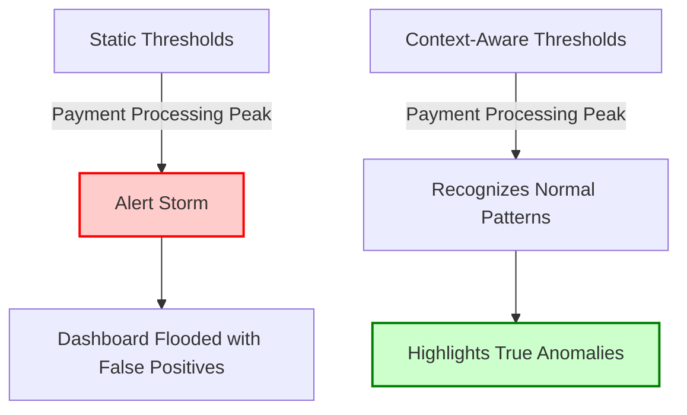

The chaotic red path represents the failure of static thresholds, while the green path showcases the efficiency of context-aware thresholds in filtering out noise and identifying actionable insights.

### Teaching Narrative

Threshold metrics for banking systems require contextual awareness that accounts for normal variations in financial processing patterns. Static thresholds often fail by generating excessive alerts during expected high-volume periods or missing subtle degradations during normal operations. Context-aware thresholds incorporate time-of-day patterns, business calendar events, and seasonal variations to distinguish between normal fluctuations and actual anomalies, significantly improving detection accuracy.

### Common Example of the Problem

A bank's payment operations team configures monitoring with static thresholds: alerts trigger when transaction volume exceeds 5,000 per minute, response time exceeds 500ms, or error rates go above 0.5%. While these thresholds work effectively during typical operations, they fail during predictable business events like payroll processing days, month-end billing cycles, and holiday shopping periods.

The following timeline illustrates a typical sequence of events that highlights the issue:

```mermaid
gantt
    dateFormat  HH:mm
    axisFormat  %H:%M
    section Business Events
    Payroll Day Volume Spike: 09:00, 3h
    Month-End Billing Traffic: 14:00, 2h
    Holiday Shopping Surge: 18:00, 4h
    section Alert Storms
    False Alerts Begin: 08:30, 6h
    Alerts Ignored: 12:30, 6h
    section Real Incident Overlooked
    System Degradation Starts: 15:00, 3h
    Incident Identified: 18:00, 1h
```

During these events, the static thresholds generate dozens of false positive alerts, overwhelming dashboards and causing alert fatigue. Over time, the team begins ignoring alerts during these known peak periods, dismissing them as "expected noise." This desensitization proves catastrophic when an actual system degradation coincides with a payroll day volume spike. Genuine alerts are misclassified as normal, delaying response and extending the incident's impact on customers.

This example underscores the need for context-aware thresholds that adapt to predictable patterns, ensuring critical anomalies are detected without triggering unnecessary noise.

### SRE Best Practice: Evidence-Based Investigation

Implement context-aware threshold management using the following practices:

| Practice | Steps | Benefits |
| ---------------------------------- | ------------------------------------------------------------------------------------------------------------------------------------------------------------------------------------------------------------------------------------------------------------------------------------------------------------------------------------------------------------------------------------------------------------------------------------------------------------------------------------------- | --------------------------------------------------------------------------------------------------------------------------------------------------------------------------- |
| **Temporal Pattern Recognition** | - Create time-based threshold adjustments:<br> - Time-of-day patterns (business hours vs. overnight)<br> - Day-of-week variations (weekday vs. weekend)<br> - Monthly cycles (payroll periods, bill payment peaks)<br> - Seasonal patterns (tax season, holiday shopping)<br>- Implement automatic threshold adjustment based on historical patterns<br>- Develop comparative baselines for specific timeframes<br>- Build deviation metrics measuring variation from expected patterns | - Reduces false positives during predictable peaks<br>- Detects subtle anomalies in expected patterns<br>- Aligns thresholds with historical behavior for improved accuracy |
| **Business Calendar Integration** | - Create event-based threshold adjustments:<br> - Marketing campaign awareness<br> - Product launch sensitivity<br> - Special event correlation | - Captures context for business-specific events<br>- Reduces alert fatigue during predictable spikes<br>- Highlights anomalies tied to critical dates |
| **Dynamic Threshold Intelligence** | - Create self-adjusting thresholds based on recent history<br>- Implement anomaly detection within elevated volumes<br>- Develop rate-of-change metrics beyond absolute values<br>- Build multi-factor alerting requiring multiple indicators | - Adapts to real-time changes in traffic<br>- Detects anomalies within high-volume periods<br>- Improves accuracy by using multiple signals for alerts |

#### Example: Context-Aware Analysis in Action

During a recent incident, Monday morning payment volume exceeded static thresholds as usual but displayed a 43% deviation from expected patterns for that time. This deviation was flagged as an anomaly by the context-aware system, enabling timely investigation and resolution. By incorporating temporal, business calendar, and dynamic intelligence, the team avoided false positives while detecting a genuine issue.

### Banking Impact

For payment processing, alert accuracy directly affects both incident response effectiveness and operational efficiency. False positive alerts create multiple business impacts: wasted engineering time investigating normal conditions, desensitization to alerts that leads to missed actual incidents, and potential customer impact when real issues are overlooked amidst alert noise. Context-aware thresholds enable reliable detection that maintains sensitivity to actual anomalies while preventing alert fatigue during normal business variations, ensuring appropriate response to genuine issues while preserving operational efficiency.

### Implementation Guidance

1. **Create comprehensive temporal pattern analysis for all key metrics**

   - Use historical data to identify patterns by time of day, day of week, and seasonal variations.

   - Example in Python using pandas for temporal aggregation:

     ```python
     import pandas as pd

     # Sample data: timestamps and metric values
     data = {
         'timestamp': ['2023-10-01 10:00', '2023-10-01 11:00', '2023-10-02 10:00'],
         'metric_value': [150, 200, 180]
     }
     df = pd.DataFrame(data)
     df['timestamp'] = pd.to_datetime(df['timestamp'])

     # Extract time-based features
     df['hour'] = df['timestamp'].dt.hour
     df['day_of_week'] = df['timestamp'].dt.day_name()

     # Aggregate metrics by time-based patterns
     temporal_patterns = df.groupby(['hour', 'day_of_week'])['metric_value'].mean()
     print(temporal_patterns)
     ```

2. **Implement business calendar integration with threshold adjustments**

   - Incorporate holidays, business-specific high-volume periods, and other domain-specific events into your detection logic.
   - Maintain a business calendar as a lookup table for adjustments.

3. **Develop dynamic thresholds with statistical confidence intervals**

   - Calculate confidence intervals for metrics based on historical data.

   - Example formula for dynamic thresholds:

     - Upper threshold = mean + (z_score * standard deviation)
     - Lower threshold = mean - (z_score * standard deviation)

     ```python
     import numpy as np

     # Example data
     metric_values = [150, 160, 155, 170, 165]
     mean = np.mean(metric_values)
     std_dev = np.std(metric_values)
     z_score = 1.96  # 95% confidence level

     upper_threshold = mean + (z_score * std_dev)
     lower_threshold = mean - (z_score * std_dev)

     print(f"Dynamic Thresholds: {lower_threshold} - {upper_threshold}")
     ```

4. **Build multi-factor alert conditions for increased accuracy**

   - Combine metrics, such as transaction volume and error rate, into compound alert conditions.

   - Use a decision tree or weighted scoring to evaluate anomalies.

     Example logic in pseudocode:

     ```
     IF (transaction_volume > dynamic_threshold_high) AND (error_rate > 5%)
         THEN flag_alert
     ```

5. **Establish regular threshold review to continuously improve detection accuracy**

   - Automate periodic reviews of thresholds using recent data trends.
   - Integrate feedback loops with post-mortem reviews to refine detection rules.

   Example workflow for threshold review:

   ```mermaid
   flowchart TD
       A[Historical Data Collection] --> B[Analyze Recent Patterns]
       B --> C[Adjust Dynamic Thresholds]
       C --> D[Test Against Real-Time Data]
       D --> E{Thresholds Effective?}
       E -- Yes --> F[Deploy to Production]
       E -- No --> B
   ```

## Panel 2: The Pattern Recognizer

### Scene Description

A data scientist collaborates with the SRE team to implement ML-based anomaly detection metrics for fraud patterns, highlighting the differences between traditional and ML-powered approaches. The scene compares traditional threshold-based monitoring, which relies on static rules, against machine learning techniques that dynamically adapt to evolving data patterns. The visual below illustrates this comparison:

#### Traditional vs. ML-Powered Fraud Detection

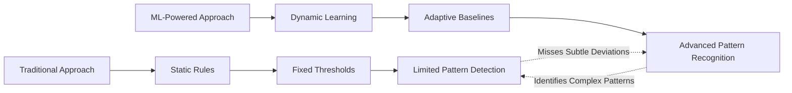

This visual demonstrates how traditional methods focus on pre-defined thresholds, often missing subtle deviations in fraud patterns. In contrast, ML-powered approaches adapt to historical data, enabling detection of complex and evolving interactions within millions of transactions.

### Teaching Narrative

Machine learning anomaly metrics enable identification of complex patterns that rule-based approaches cannot detect. These advanced measurements learn normal system behavior from historical data, establishing adaptive baselines that evolve with changing conditions. For banking systems with sophisticated transaction patterns, ML-based anomaly metrics detect subtle deviations, gradual degradations, and complex interactions that would evade traditional threshold-based detection, providing essential early warning for emerging issues.

### Common Example of the Problem

A bank's fraud detection platform processes millions of transactions daily, spanning complex patterns across merchant categories, geographic regions, and customer segments. Traditional monitoring relies on static rules and thresholds, such as:

- Alert if decline rates exceed 5%.
- Flag when velocity surpasses historical averages.
- Trigger warnings for specific fraud indicators.

However, these static approaches often fail to catch sophisticated fraud patterns. For example, organized fraud rings deliberately craft attack strategies to remain beneath individual thresholds, exploiting the siloed nature of rule-based detection. This results in fraud patterns becoming apparent only after significant financial losses have been incurred.

The core limitation lies in the inability of traditional systems to analyze and correlate across multiple dimensions simultaneously. Machine learning addresses this gap by identifying subtle, multi-dimensional patterns of anomalous behavior.

#### Comparison of Traditional vs. ML-Based Detection

| Feature | Traditional Rule-Based Detection | Machine Learning-Based Detection |
| ---------------------- | ------------------------------------------------------------------------------------------ | -------------------------------------------------------------------------------------- |
| **Pattern Complexity** | Limited to predefined rules and thresholds. Cannot detect complex, multi-faceted patterns. | Learns and adapts to multi-dimensional patterns, even those not explicitly defined. |
| **Adaptability** | Static thresholds require manual updates to adjust for evolving behavior. | Dynamically adapts to changing system behavior over time. |
| **Detection Scope** | Focuses on individual metrics in isolation. | Correlates patterns across multiple dimensions simultaneously. |
| **Response Time** | Reactive, often triggered only after financial impacts are significant. | Proactive, identifying anomalies in early stages before major impacts occur. |
| **Fraud Ring Evasion** | Vulnerable to coordinated attacks designed to evade specific thresholds. | Resilient to circumvention, identifying subtle deviations even in coordinated efforts. |

By leveraging machine learning, the bank's fraud detection system can evolve from a reactive, threshold-based approach to a proactive, adaptive model. This enables the detection of emerging fraud patterns before they cause significant damage, ensuring better financial and operational security.

### SRE Best Practice: Evidence-Based Investigation

Implement ML-powered anomaly detection using the following steps and practices:

#### Checklist for Implementation

1. **Multi-dimensional Pattern Learning**

   - [ ] Create behavioral baselines across multiple factors:
     - [ ] Transaction type patterns
     - [ ] Temporal distributions
     - [ ] Amount clustering
     - [ ] Geographic dispersion
     - [ ] Merchant category relationships
   - [ ] Implement unsupervised learning to establish patterns.
   - [ ] Develop similarity scoring against known behaviors.
   - [ ] Build outlier detection mechanisms to identify unusual combinations.

2. **Adaptive Baseline Evolution**

   - [ ] Enable continuous learning by enriching models with historical data.
   - [ ] Incorporate seasonality awareness into baseline models.
   - [ ] Implement concept drift detection to adapt to changing patterns.
   - [ ] Build confidence scoring mechanisms for prediction reliability.

3. **Explainable Detection Mechanisms**

   - [ ] Implement contribution analysis to identify influential factors behind anomalies.
   - [ ] Provide visual pattern representations for enhanced investigation.
   - [ ] Develop comparative metrics to differentiate normal and anomalous behaviors.
   - [ ] Establish evidence chains to support detection decisions.

#### Example Code Snippet: Outlier Detection with Unsupervised Learning

```python
import numpy as np
from sklearn.ensemble import IsolationForest

# Sample data: Features representing transaction patterns
data = np.array([
    [100, 1, 3, 0.5],  # [transaction_amount, transaction_type, time_of_day, geo_distance]
    [250, 1, 2, 0.3],
    [300, 3, 1, 1.2],
    [5000, 4, 3, 10.0],  # Potential anomaly
])

# Initialize Isolation Forest for outlier detection
model = IsolationForest(n_estimators=100, contamination=0.01, random_state=42)
model.fit(data)

# Predict anomalies (-1 = anomaly, 1 = normal)
predictions = model.predict(data)

# Identify anomalies
anomalies = data[predictions == -1]
print("Detected Anomalies:\n", anomalies)
```

#### Workflow for Evidence-Based Anomaly Investigation

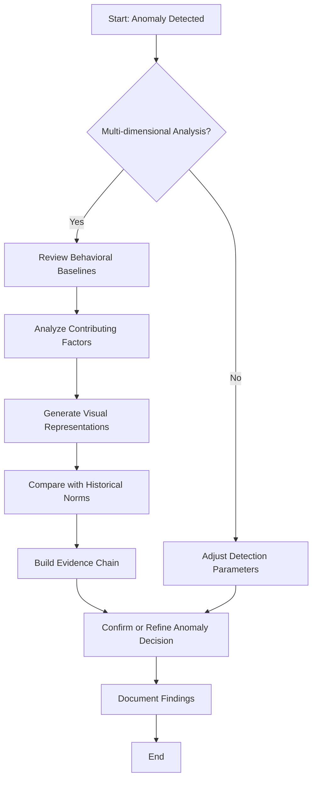

Machine learning analysis reveals subtle fraud patterns invisible to traditional monitoring. For example, even when individual transactions remain below velocity and amount thresholds, unusual cross-border sequences combined with specific merchant type progressions may indicate compromised credentials. These correlations, detectable through multi-dimensional pattern analysis, enable SREs to proactively mitigate fraud risks.

### Banking Impact

For fraud detection systems, pattern recognition effectiveness directly affects both financial losses and customer experience. Rules-based detection creates significant business impact through both false negatives (missed fraud) and false positives (legitimate transactions incorrectly flagged). Studies show that traditional rule-based systems can result in false positive rates as high as 5%, leading to unnecessary friction for customers and operational costs for banks. In contrast, machine learning-based anomaly detection has demonstrated the ability to reduce false positives by up to 30%, while simultaneously increasing fraud detection rates by 20%.

Each fraud pattern that escapes detection represents direct financial losses, potential regulatory concerns, and customer impact when accounts are compromised. For instance, a banking system processing 10 million daily transactions could see a reduction of $2 million in annual fraud losses by improving detection efficiency through advanced ML-based methods. These systems enable the precision needed to balance security and convenience, identifying truly suspicious activity while minimizing disruption to legitimate customer transactions.

### Implementation Guidance

To effectively implement ML-based anomaly detection metrics for fraud patterns, follow these steps:

1. **Data Collection & Preparation**\
   Collect comprehensive transactional data from relevant systems, ensuring it is clean, consistent, and representative of the system's normal behavior. Include metadata like timestamps, transaction types, and user identifiers.

2. **Baseline Model Creation**\
   Train initial machine learning models using historical transaction data. These models should establish adaptive baselines that reflect normal system behavior and account for seasonal or cyclical trends.

3. **Algorithm Development**\
   Design and implement multi-dimensional anomaly detection algorithms capable of identifying deviations across multiple features, such as transaction amounts, frequency, and geolocation.

4. **Explainability & Diagnostics**\
   Build explainability tools that provide insights into why specific transactions or patterns are flagged as anomalies. Use techniques like feature importance or SHAP values to interpret model decisions.

5. **Continuous Learning & Monitoring**\
   Establish processes for continuous model retraining and validation using new transactional data. Monitor model performance metrics, such as precision and recall, to ensure ongoing effectiveness.

#### Step-by-Step Process Diagram

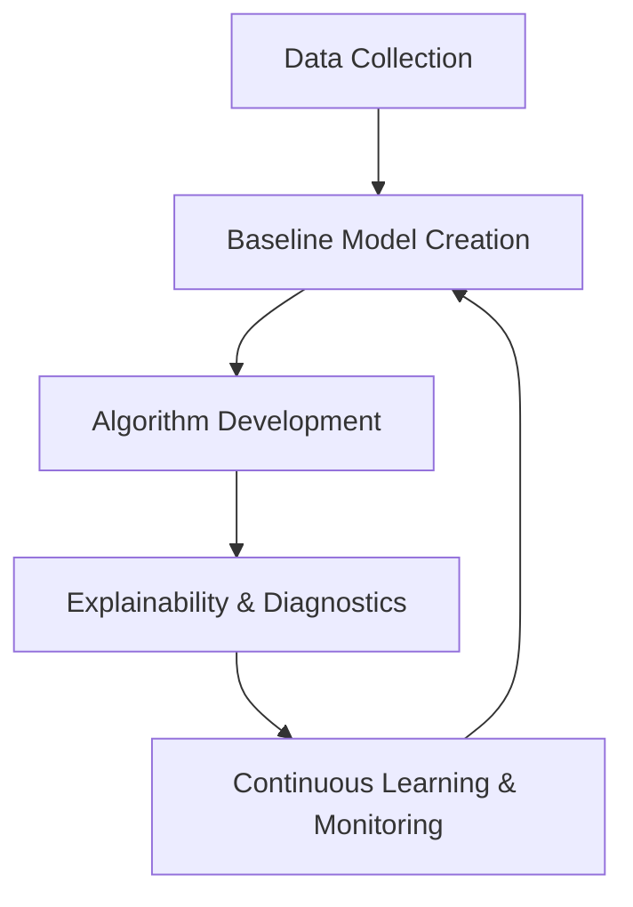

This diagram illustrates the cyclic nature of the implementation process, emphasizing the importance of continuous learning and adaptation.

## Panel 3: The Correlation Engine

### Scene Description

The team is shown implementing alert correlation metrics across banking systems, transforming how related alerts are grouped into meaningful incident patterns. The process evolves from an overwhelming flood of individual alerts to a consolidated view of incidents, revealing the relationships between seemingly unrelated symptoms of underlying issues.

Below is a visual representation of this transformation:

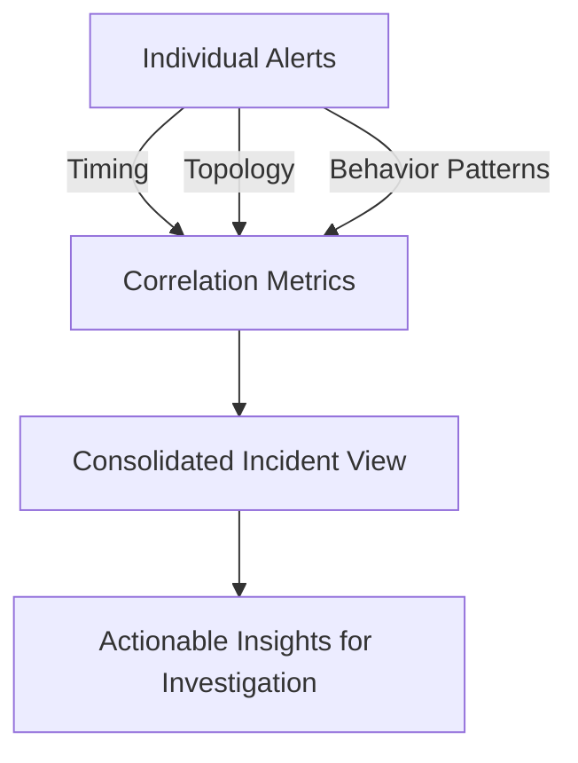

This diagram highlights how alerts are analyzed based on timing, topology, and behavior patterns, enabling the grouping of related notifications into coherent incidents. The consolidated incident view provides actionable insights, helping responders focus on root causes rather than being overwhelmed by alert storms.

### Teaching Narrative

Alert correlation metrics transform isolated notifications into meaningful incident patterns. In complex banking environments with hundreds of interconnected services, individual alerts often represent symptoms of underlying issues rather than root causes. Correlation measurements identify relationships between alerts based on timing, topology, and behavior patterns, grouping related notifications into coherent incidents that guide effective investigation rather than overwhelming responders with alert storms.

### Common Example of the Problem

A bank's digital platform experiences a database slowdown that triggers dozens of separate alerts across multiple systems. Here's a timeline illustrating the sequence of events and their relationships:

```
Database Slowdown
      |
      v
+-----------------------------+
|  1. API Timeouts            |  --> Mobile applications begin to fail.
+-----------------------------+
      |
      v
+-----------------------------+
|  2. Transaction Failures    |  --> Payment services report errors.
+-----------------------------+
      |
      v
+-----------------------------+
|  3. Response Time Degradation| --> Web interfaces slow down significantly.
+-----------------------------+
      |
      v
+-----------------------------+
|  4. Authentication Errors   |  --> Security services detect increased failures.
+-----------------------------+

```

Operations teams receive these alerts as isolated events, with each technology team investigating their specific symptoms without recognizing the common cause: the database slowdown. This fragmented response creates inefficiency and extends resolution time as multiple teams independently troubleshoot what is actually a single incident. Without correlation metrics identifying the relationships between these alerts, teams address symptoms rather than root causes, leading to prolonged customer impact and wasted engineering resources.

By implementing alert correlation, these relationships could be identified early, presenting a consolidated incident view like this:

```
Incident: Database Slowdown
      |
      v
+-----------------------------+
| Related Alerts:            |
| - API Timeouts             |
| - Transaction Failures     |
| - Response Time Degradation|
| - Authentication Errors    |
+-----------------------------+
```

This approach helps responders quickly focus on the root cause, reducing resolution time and minimizing customer disruption.

### SRE Best Practice: Evidence-Based Investigation

Implement comprehensive alert correlation to streamline incident management and reduce mean time to resolution (MTTR). Use the following checklist to guide your approach for each correlation type:

| Correlation Type | Key Techniques | Practical Steps |
| -------------------------- | ----------------------------------------------------------------------------------------------------- | -------------------------------------------------------------------------------------------------------------------------------------------------------------------------------------------------------------------------------------------------------- |
| **Temporal Relationship** | - Time-based clustering<br>- Sequence pattern recognition<br>- Precursor identification | 1. Identify alerts occurring within a short timeframe.<br>2. Detect recurring sequences in alert patterns.<br>3. Flag precursor alerts as early indicators.<br>4. Implement cascade detection to identify failure propagation. |
| **Topological Dependency** | - Service relationship mapping<br>- Infrastructure dependency analysis<br>- Impact path visualization | 1. Map service dependencies and relationships.<br>2. Correlate alerts based on shared infrastructure.<br>3. Trace data flow between components.<br>4. Visualize impact paths to understand spread and affected areas. |
| **Behavioral Pattern** | - Similarity analysis<br>- Causal chain identification<br>- Historical matching | 1. Group alerts with similar symptoms or characteristics.<br>2. Trace causal chains to identify root triggers.<br>3. Rank potential root causes based on behavior patterns.<br>4. Match current patterns with historical incidents for faster diagnosis. |

#### Example Case Study:

Correlation analysis transforms incident management effectiveness. For instance:

- **Scenario**: 17 seemingly separate alerts are triggered across multiple services.
- **Outcome**: Correlation reveals these alerts stem from a single database connection pool saturation issue.
- **Impact**: Predictable propagation patterns are identified, consolidating investigation efforts and dramatically reducing MTTR.

### Banking Impact

For digital banking platforms, alert correlation directly affects both incident resolution time and operational efficiency. Fragmented alerts create significant business impact through extended outages, duplicated investigation efforts, and incomplete problem resolution that allows issues to recur.

For example, in a high-transaction banking environment processing 5,000 transactions per second, a 15-minute delay in resolving an incident caused by fragmented alerts could disrupt up to 4.5 million transactions. Effective correlation reduces this delay by an average of 60%, saving 9 minutes and preserving the integrity of approximately 2.7 million transactions. Beyond transaction volume, this translates into reduced customer friction, protected revenue streams, and minimized operational costs associated with prolonged outages.

By enabling rapid identification of root causes rather than symptoms, correlation ensures comprehensive resolution that addresses underlying issues rather than their surface manifestations, safeguarding both business continuity and customer trust.

### Implementation Guidance

1. **Create Comprehensive Service Dependency Mapping**\
   Develop and maintain an up-to-date service dependency map that outlines how various services interact. This map will act as the foundation for understanding alert relationships. Use tools like service discovery agents or graph-based databases to visualize dependencies.

2. **Implement Temporal Correlation for Related Alerts**\
   Group alerts that occur within a specific time window to identify potential relationships. This involves setting a correlation window based on system-specific factors such as typical processing times or propagation delays. Below is a simplified Python snippet demonstrating temporal correlation logic:

   ```python
   from datetime import datetime, timedelta

   # Example alert data
   alerts = [
       {"id": 1, "timestamp": datetime(2023, 10, 1, 12, 0), "service": "auth-service"},
       {"id": 2, "timestamp": datetime(2023, 10, 1, 12, 2), "service": "db-service"},
       {"id": 3, "timestamp": datetime(2023, 10, 1, 12, 10), "service": "auth-service"},
   ]

   correlation_window = timedelta(minutes=5)  # 5-minute correlation window

   def correlate_alerts(alerts, window):
       alerts = sorted(alerts, key=lambda x: x["timestamp"])
       correlated_groups = []
       current_group = [alerts[0]]

       for i in range(1, len(alerts)):
           if alerts[i]["timestamp"] - current_group[-1]["timestamp"] <= window:
               current_group.append(alerts[i])
           else:
               correlated_groups.append(current_group)
               current_group = [alerts[i]]
       correlated_groups.append(current_group)
       return correlated_groups

   correlated_alerts = correlate_alerts(alerts, correlation_window)
   for group in correlated_alerts:
       print(f"Correlated Group: {[alert['id'] for alert in group]}")
   ```

3. **Develop Topological Grouping Based on System Relationships**\
   Use the service dependency map to group alerts by their topological relationships. For example, if an upstream database fails, group all alerts from downstream services that depend on it. Represent relationships using adjacency lists or matrices for efficient lookups.

   Example (text-based adjacency list):

   ```
   auth-service -> [db-service, cache-service]
   db-service -> [storage-service]
   ```

4. **Build Pattern Recognition Identifying Common Failure Modes**\
   Leverage machine learning or rule-based systems to detect recurring patterns in alerts. For instance, identify if a database timeout often leads to cascading failures across services. Train models or define rules based on historical incidents to predict failure chains.

5. **Establish Incident Libraries Documenting Correlation Patterns**\
   Maintain a repository of known incident patterns and their associated correlation rules. This library should include metadata such as root causes, impact assessments, and recommended mitigations. Use tagging systems to enable quick searches for responders during active incidents.

## Panel 4: The Signal Processing Chain

### Scene Description

The engineering team is collaboratively designing a multi-stage anomaly detection system for payment systems. This system progressively filters, enriches, and analyzes raw telemetry data to identify actionable insights. The process is visualized as a refinement pipeline, transforming massive streams of raw metrics into meaningful signals through successive stages of increasing intelligence.

Below is a conceptual representation of the refinement pipeline:

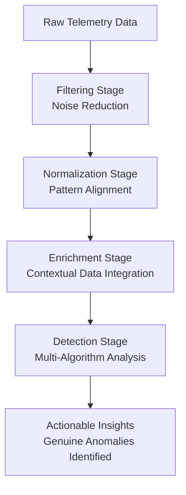

This pipeline illustrates the flow of data as it moves through each stage, with each step enhancing the quality and relevance of the output. The engineering team’s goal is to refine the data efficiently, reducing noise and false positives while enabling precise anomaly detection for swift and targeted responses.

### Teaching Narrative

Signal processing metrics transform raw measurements into actionable insights through sophisticated analysis pipelines. These multi-stage processing chains filter noise, normalize patterns, enrich with context, and apply multiple detection algorithms to identify meaningful anomalies while reducing false positives. For payment systems, this progressive refinement significantly improves detection quality by distinguishing genuine anomalies from normal variations, enabling targeted response to actual issues.

### Common Example of the Problem

A bank's payment monitoring system collects millions of data points hourly, creating a classic "big data" challenge where important signals are overwhelmed by normal operational noise. The monitoring team faces recurring detection problems that highlight key challenges in anomaly detection:

| **Challenge** | **Description** |
| ----------------------------- | ----------------------------------------------------------------------------------------- |
| **Hidden Anomalies** | Genuine anomalies remain masked within natural operational variance. |
| **Gradual Degradations** | Subtle performance issues develop too slowly to trigger static threshold alerts. |
| **Manual Correlation** | Alert correlation across multiple systems is manual, inconsistent, and error-prone. |
| **Prolonged Detection Times** | Extended time to detect and respond allows payment issues to affect customers for longer. |

These limitations underscore the fundamental challenge of data processing maturity: having abundant telemetry without the processing capability to extract meaningful insights from the volume. This results in delayed recognition of significant issues and hampers the ability to deliver timely responses to operational anomalies.

### SRE Best Practice: Evidence-Based Investigation

Implement multi-stage signal processing to enable evidence-based anomaly detection. Use the following checklist to guide your investigation and design process:

#### Checklist for Multi-Stage Signal Processing

1. **Data Conditioning and Filtering**

   - [ ] Apply noise reduction using statistical filtering (e.g., moving averages, z-scores).
   - [ ] Normalize metrics across different types to ensure comparability (e.g., min-max scaling).
   - [ ] Implement outlier detection and handling strategies (e.g., IQR-based filtering).
   - [ ] Perform dimensionality reduction for high-cardinality data (e.g., PCA or feature selection).

2. **Contextual Enrichment Processing**

   - [ ] Integrate business metadata to enhance raw metrics (e.g., transaction types, regions).
   - [ ] Correlate temporal patterns to uncover periodic anomalies (e.g., time windows, seasonality).
   - [ ] Add topology-aware context (e.g., service dependency graphs).
   - [ ] Compare with historical behavior to identify deviations (e.g., baseline drift).

3. **Multi-Algorithm Detection Pipeline**

   - [ ] Combine layered detection techniques:
     - Statistical methods for distribution analysis (e.g., t-tests, histograms).
     - Machine learning models for pattern recognition (e.g., anomaly detection with isolation forests).
     - Heuristic rules for known failure modes (e.g., predefined error thresholds).
     - Correlation engines for dependency analysis (e.g., Granger causality).
   - [ ] Implement confidence scoring for individual detection methods.
   - [ ] Develop consensus mechanisms to combine results (e.g., majority voting, weighted averages).
   - [ ] Build progressive refinement stages to iteratively improve detection accuracy.

#### Example: Statistical Filtering with Z-Scores

```python
import numpy as np

def filter_outliers(data, threshold=3):
    """
    Filters outliers from a dataset using z-score method.

    Parameters:
        data (list or np.array): Input dataset (1D).
        threshold (float): Z-score threshold for detecting outliers.

    Returns:
        np.array: Filtered data with outliers removed.
    """
    mean = np.mean(data)
    std_dev = np.std(data)
    z_scores = np.abs((data - mean) / std_dev)
    return data[z_scores < threshold]

# Example usage
raw_metrics = np.array([10, 12, 10, 15, 100, 12, 11])
filtered_metrics = filter_outliers(raw_metrics)
print("Filtered Metrics:", filtered_metrics)
```

By following this structured approach and leveraging tools like statistical filtering or machine learning, advanced signal processing can unveil subtle trends. For instance, a gradual degradation in payment processing latency over three days—missed by basic threshold monitors—can become evident through statistical trend analysis when raw telemetry is properly processed.

### Banking Impact

For payment systems, detection quality directly affects both customer experience and operational efficiency. Raw telemetry without sophisticated processing creates dangerous blind spots where developing issues remain invisible until they create significant customer impact. Every improvement in signal processing capabilities represents earlier detection, more precise diagnosis, and faster resolution of potential service disruptions. Effective signal processing enables truly proactive operations that address emerging issues before they affect customer transactions, preserving revenue while maintaining service quality expectations.

### Implementation Guidance

To effectively implement a signal processing chain for anomaly detection in payment systems, follow this structured checklist and step-by-step process:

#### Checklist for Implementation

- [ ] Ensure comprehensive data collection with appropriate granularity
- [ ] Design a multi-stage processing pipeline with progressive refinement
- [ ] Develop complementary detection algorithms for diverse anomaly patterns
- [ ] Build an integrated analysis environment combining multiple techniques
- [ ] Establish a continuous improvement process for detection effectiveness

#### Step-by-Step Process

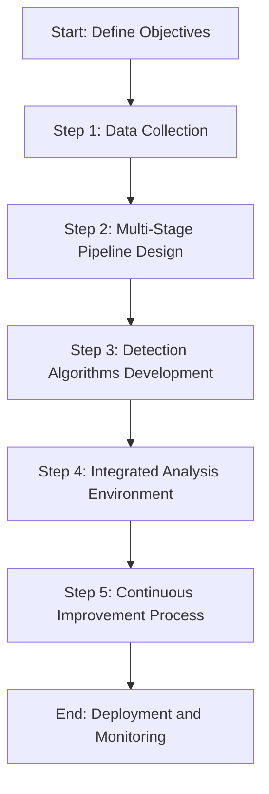

1. **Data Collection**:

   - Gather raw telemetry data with sufficient granularity and coverage.
   - Ensure data is representative of potential anomalies and normal patterns.

2. **Multi-Stage Pipeline Design**:

   - Establish a pipeline that progressively filters noise, normalizes data, and enriches context.
   - Define stages with clear input-output transformations to improve signal quality.

3. **Detection Algorithms Development**:

   - Combine diverse algorithms to detect various anomaly types (e.g., statistical, rule-based, ML-based).
   - Align algorithms to the specific characteristics of payment system anomalies.

4. **Integrated Analysis Environment**:

   - Consolidate outputs from multiple algorithms into a unified analysis framework.
   - Enable cross-validation and correlation of results for higher accuracy.

5. **Continuous Improvement Process**:

   - Monitor performance metrics, such as precision, recall, and false positive rates.
   - Regularly retrain models, refine thresholds, and update algorithms based on feedback.

This structured approach ensures a robust, scalable, and effective signal processing chain for anomaly detection in payment systems.

## Panel 5: The Alert Taxonomy

### Scene Description

The operations team is designing a structured alert classification system that uses hierarchical categorization by system, impact, urgency, and required response. This approach ensures that alerts are prioritized and handled based on their specific characteristics, rather than treating all notifications equally. Below is a text-based representation of the hierarchical categorization framework:

```
Alert Classification System
├── System
│   ├── Service A
│   ├── Service B
│   └── Service C
├── Impact
│   ├── High: Critical customer-facing services
│   ├── Medium: Internal operations
│   └── Low: Non-critical systems
├── Urgency
│   ├── Immediate: Requires action within minutes
│   ├── Near-term: Action within hours
│   └── Deferred: Scheduled response
└── Required Response
    ├── Escalation to Incident Response Team
    ├── Notification to Stakeholders
    └── Automated Resolution
```

This structured framework helps guide the appropriate response to alerts based on their system, impact, urgency, and required actions, ensuring effective prioritization and reducing noise in incident management.

### Teaching Narrative

Alert taxonomy metrics bring structure and clarity to incident response by systematically classifying notifications across multiple dimensions. This classification system categorizes alerts by service type, customer impact, business criticality, and response requirements, enabling consistent handling and appropriate prioritization. For banking operations, structured alert metrics ensure that critical financial services receive appropriate attention based on business impact rather than technical noise level.

### Common Example of the Problem

A bank's operations team faces a common monitoring challenge: all alerts arrive with similar formatting and urgency designations despite vast differences in their actual business impact. During a recent incident involving multiple simultaneous issues, the team struggled with prioritization: was the online banking login slowdown more important than the mobile payment error increase? Should they address the ATM communication errors before or after the credit card authorization latency? Without structured alert classification that provides clear prioritization guidance, these decisions remain subjective and inconsistent, potentially resulting in addressing lower-impact issues while more critical services remain degraded. This classification gap creates both inconsistent customer experiences and inefficient resource allocation during incidents.

To illustrate this problem further, the following table compares these incidents to highlight their business impact, prioritization challenges, and response complexity:

| **Incident** | **Business Impact** | **Prioritization Challenge** | **Response Complexity** |
| --------------------------------- | -------------------------------------------------------- | ----------------------------------------------------------------------------------------- | ------------------------------------------------ |
| Online banking login slowdown | High customer frustration, potential account abandonment | Balancing with other critical services during business hours | Moderate - Backend and load balancing analysis |
| Mobile payment error increase | Direct revenue impact, loss of customer trust | Coordinating across payment gateways and third-party providers | High - Requires cross-system investigation |
| ATM communication errors | Limited to specific regions, impacts cash withdrawals | Often deprioritized due to perceived lower urgency compared to digital services | Low - Localized hardware or network diagnostics |
| Credit card authorization latency | Broad financial impact, affects retail and e-commerce | Difficult to assess urgency without structured metrics for transaction volume degradation | High - Involves database and transaction tracing |

This comparison underscores the need for a structured alert taxonomy to provide clear prioritization guidance. By systematically categorizing alerts based on their business impact and response requirements, teams can ensure that the most critical issues are addressed promptly and effectively.

### SRE Best Practice: Evidence-Based Investigation

#### Checklist for Comprehensive Alert Classification Framework

- **Multi-dimensional Categorization**

  - [ ] Classify alerts by service type:
    - [ ] Core banking functions (accounts, payments, transfers)
    - [ ] Customer channels (online, mobile, ATM, branch)
    - [ ] Supporting services (authentication, reporting, analytics)
    - [ ] Infrastructure components (compute, storage, network)
  - [ ] Define customer impact severity levels
  - [ ] Establish business criticality rankings
  - [ ] Create response urgency classifications

- **Business Impact Assessment**

  - [ ] Quantify financial exposure
  - [ ] Analyze customer segments affected
  - [ ] Evaluate regulatory compliance implications
  - [ ] Assess reputational risks

- **Response Guidance Integration**

  - [ ] Map response procedures to alert types
  - [ ] Identify required skills for resolution
  - [ ] Define escalation paths
  - [ ] Set resolution time expectations

By following this checklist, structured classification transforms incident management from subjective decision-making to a systematic process. For example, while ATM errors might impact fewer customers, they represent complete service unavailability for affected branches. In contrast, an online banking slowdown, though widespread, may still maintain functional service. This framework ensures prioritization is guided by structured impact metrics rather than technical noise.

### Banking Impact

For financial operations, alert classification is as critical as triaging patients in an emergency room. Just as medical staff prioritize patients based on the severity of their condition to ensure the most urgent cases receive immediate attention, a structured alert taxonomy ensures banking alerts are handled based on their actual business impact. Unstructured alerts, like a chaotic ER without triage, can lead to significant business harm through inappropriate prioritization, inconsistent handling, and inefficient resource allocation during critical incidents.

Every improvement to the classification system is akin to refining triage protocols—allowing teams to respond more effectively by focusing on what truly matters. With a comprehensive alert taxonomy, critical financial services, such as payment processing or fraud detection, are prioritized appropriately, avoiding scenarios where urgency is determined by which team notices the alert first or which notification seems most pressing at first glance. This structure ensures resources are allocated efficiently while protecting business-critical operations.

### Implementation Guidance

To implement an effective alert taxonomy, follow these structured steps:

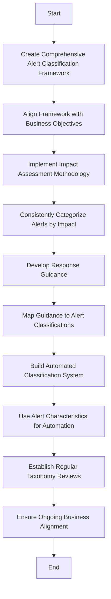

1. **Create comprehensive alert classification framework**: Develop a structured system that categorizes alerts by service type, customer impact, and business criticality.
2. **Align framework with business objectives**: Ensure the classification approach reflects the organization's priorities and operational goals.
3. **Implement impact assessment methodology**: Define consistent metrics and criteria for assessing the impact of alerts.
4. **Develop response guidance**: Create clear, actionable procedures for responding to alerts based on their classification.
5. **Map guidance to classifications**: Integrate response protocols with specific alert categories to standardize incident handling.
6. **Build automated classification system**: Utilize alert characteristics (e.g., source, severity) to automate the classification process.
7. **Establish regular taxonomy reviews**: Schedule periodic reviews to ensure the taxonomy evolves with changing business needs and priorities.

## Panel 6: The Notification Matrix

### Scene Description

The team is designing a targeted alert routing system based on incident characteristics, defining distribution rules for various banking service alerts. The visual showcases the sophisticated notification targeting process, ensuring alerts reach the appropriate responders through optimal channels rather than broadcasting all issues to everyone.

Below is a text diagram illustrating the flow of alerts from detection to targeted routing:

```
[Alert Detection] 
       |
       v
[Incident Classification]
       |
       v
[Severity Assessment]
       |
       v
[Service Type Identification]
       |
       v
[Targeted Routing Rules]
       |
       v
[Optimal Responder Notification]
```

This flow demonstrates how alerts are filtered and directed through logical stages to ensure precise and efficient notification targeting. Each step prioritizes minimizing response time for critical financial services while reducing unnecessary interruptions for non-urgent issues.

### Teaching Narrative

Alert routing metrics ensure notifications reach the right people through appropriate channels based on incident characteristics. These distribution measurements track alert routing effectiveness, acknowledgment times, and resolution paths across different service types and severity levels. For banking operations teams, optimized alert routing metrics minimize response time for critical financial services while reducing unnecessary disruptions for non-urgent issues.

### Common Example of the Problem

A bank's notification system follows a simplistic approach that sends all alerts to all team members through the same channel regardless of issue characteristics. This one-size-fits-all distribution creates multiple operational challenges that hinder effective incident response:

#### Checklist of Operational Challenges and Impacts:

- **Alert Overload:** Critical issues get lost among minor notifications, reducing visibility for urgent incidents.
- **Misrouted Alerts:** Specialists receive alerts for systems outside their expertise, leading to delays in resolution.
- **Unnecessary Disturbances:** Off-hours emergencies wake entire teams instead of targeting only necessary responders.
- **Uniform Delivery Methods:** Alerts of varying urgency levels use the same notification channels, failing to prioritize critical issues effectively.

#### Real-World Impact Example:

During a recent major incident, resolution was delayed because the initial critical alert was buried among dozens of low-priority notifications. The primary database expert, who was best qualified to address the issue, never saw the alert. This routing inefficiency extended the service disruption by over 30 minutes despite appropriate detection mechanisms being in place.

By addressing these challenges with targeted alert routing, such delays and disruptions can be minimized, ensuring a faster and more effective response to critical incidents.

### SRE Best Practice: Evidence-Based Investigation

Implement intelligent notification routing by focusing on three key areas: audience targeting, channel optimization, and notification effectiveness measurement. The table below summarizes actionable best practices for each area:

| **Focus Area** | **Best Practices** | **Example Metrics** |
| ------------------------------ | ------------------------------------------------------------- | ------------------------------------------------- |
| **Audience Targeting** | - Create role-based routing to appropriate specialists | - Percentage of alerts routed to correct team |
| | - Implement team assignment based on service ownership | - Escalation success rate |
| | - Develop escalation paths for unacknowledged alerts | - Average escalation time |
| | - Build dynamic routing based on available personnel | - Incident reassignment frequency |
| **Channel Optimization** | - Create severity-based channel selection | - Acknowledgment time by severity/channel |
| | - Critical: Phone calls + SMS + messaging apps | - Percentage of high-severity alerts acknowledged |
| | - Major: SMS + messaging apps | within SLA |
| | - Minor: Email + ticketing systems | - Channel usage effectiveness |
| | - Informational: Dashboards + status pages | |
| | - Implement time-sensitive delivery methods for urgency | |
| | - Develop acknowledgment tracking with escalation | |
| | - Build noise reduction through channel consolidation | |
| **Notification Effectiveness** | - Create time-to-acknowledgment metrics | - Mean time to acknowledgment (MTTA) |
| | - Implement routing accuracy assessment | - Routing accuracy rate |
| | - Develop resolution time correlation with routing | - Mean time to resolution (MTTR) |
| | - Build continuous improvement through effectiveness analysis | - Improvement trends over time |

#### Insights from Metrics

- **Routing Accuracy**: Database alerts routed to application teams first incurred average delays of 17 minutes before reaching the correct team. Adjusting routing logic can significantly reduce these delays.
- **Channel Effectiveness**: Critical alerts sent via email averaged a 24-minute acknowledgment time, compared to just 3 minutes for SMS notifications. Prioritizing faster channels for critical alerts can dramatically improve response times.

Utilizing these evidence-based strategies ensures that notifications are both actionable and meaningful, supporting faster resolution times and reduced operational disruptions.

### Banking Impact

For financial operations, notification effectiveness is as critical as a triage system in an emergency room. Just as medical professionals prioritize patients based on the urgency of their condition, optimized alert routing ensures that critical issues are immediately escalated to the right specialists, while less urgent matters are directed to appropriate queues without overwhelming the entire team. Inefficient routing, akin to mismanaging triage, can result in prolonged outages, unnecessary disruptions, and alert fatigue, which reduce the team's ability to respond effectively to high-priority incidents.

Every minute saved in routing and acknowledgment is like saving a critical patient in an emergency scenario—preserving transactions, reducing customer impact, and protecting revenue during service disruptions. By streamlining notifications, financial operations teams can address urgent issues swiftly while shielding team members from unnecessary noise, preventing fatigue and burnout that compromise long-term effectiveness. This precision in alert routing safeguards both operational reliability and team sustainability.

### Implementation Guidance

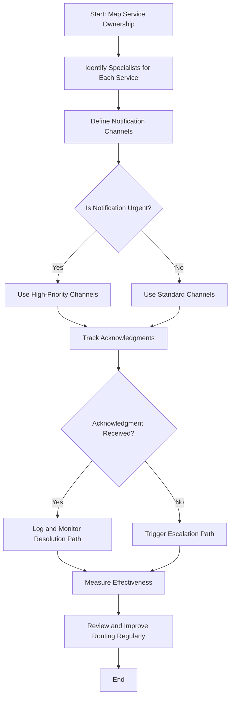

1. **Map Service Ownership**: Create a detailed mapping of all services and assign specific team members or specialists to each service.
2. **Define Notification Channels**: Establish a channel strategy that aligns with the urgency of notifications, ensuring critical issues use high-priority methods like SMS or voice calls.
3. **Track Acknowledgments**: Implement a system to track acknowledgment of notifications, ensuring accountability and timely response.
4. **Develop Escalation Paths**: Define clear escalation paths for unacknowledged alerts to ensure no critical issues are overlooked.
5. **Measure Effectiveness**: Build metrics to evaluate the success of alert routing, including acknowledgment times, resolution paths, and overall response efficiency.
6. **Review Regularly**: Conduct periodic reviews of the notification routing strategy to maintain alignment with organizational objectives and adapt to changes.

## Panel 7: The Feedback Loop

### Scene Description

The post-incident review focuses on alert effectiveness, systematically analyzing detection timing, quality, and response effectiveness metrics. A structured approach is employed to assess alert performance during the recent incident, with a focus on four key dimensions: detection accuracy, timing, clarity, and actionability. This process drives continuous improvement by identifying areas for optimization.

Below is a simplified representation of the structured analysis process:

```
            Start: Post-Incident Review
                      |
      ------------------------------------------------
      |                      |                      |                      |
Accuracy            Timing              Clarity          Actionability
(False Pos/Neg)   (Alert Firing)   (Communication)    (Response Enablement)
      |                      |                      |                      |
  Identify Gaps     Compare to SLAs    Review Language       Assess Response
      |                      |                      |                      |
      ------------------------------------------------
                      |
          Synthesize Findings
                      |
              Actionable Insights
                      |
     Improve Detection Capabilities
```

This structured feedback loop ensures detection systems are progressively improved, reducing the mean time to detection for critical financial services.

### Teaching Narrative

Alert effectiveness metrics provide essential feedback for continuous improvement of detection systems. These measurements analyze timing (when alerts fired relative to actual issues), accuracy (false positive and negative rates), clarity (how effectively alerts communicated the problem), and actionability (whether alerts enabled effective response). For banking incident management, these feedback metrics drive systematic improvement in detection capabilities, progressively reducing mean time to detection for critical financial services.

### Common Example of the Problem

A bank's operations team conducts incident reviews focused primarily on resolution actions, with limited analysis of detection effectiveness. While they thoroughly examine what happened and how they fixed it, they rarely assess whether monitoring performed optimally in identifying the issue. This incomplete feedback loop creates recurring detection gaps where similar issues remain difficult to detect despite previous occurrences.

The table below illustrates common recurring incidents, detection gaps, and missed opportunities for improvement that highlight the need for structured evaluation of alert performance:

| Incident Type | Detection Gap | Missed Opportunity for Improvement |
| ----------------------- | --------------------------------------------------------------------------- | ---------------------------------------------------------------------------------- |
| Database Issue | Alerts triggered 47 minutes after customer transaction failures began | Improve alert timing by refining database monitoring thresholds and patterns |
| Payment Gateway Failure | Alerts failed to specify root cause, leading to 30-minute diagnostic delays | Enhance clarity of alerts with detailed diagnostics and actionable recommendations |
| API Latency Spike | False negatives: Alerts did not trigger for 15% of critical latency events | Adjust detection logic to account for edge cases and improve sensitivity |
| Batch Processing Delay | Alerts fired but were not actionable, causing 20-minute response delays | Redesign alerts to provide clear, actionable guidance for resolution steps |

During a recent major outage, a database issue affected customer transactions for 47 minutes before triggering alerts, despite being the fourth similar incident in six months. Without structured evaluation of alert performance and systematic improvements to detection capabilities, the team continues experiencing the same detection delays despite opportunities to improve monitoring based on previous incidents.

### SRE Best Practice: Evidence-Based Investigation

Implement comprehensive alert effectiveness analysis with a structured approach. Use the following checklist to guide detection timing assessment, alert quality evaluation, and continuous improvement initiatives:

#### Checklist for Evidence-Based Investigation

1. **Detection Timing Assessment**

   - [ ] Create an incident timeline with detection point identification.
   - [ ] Compare customer impact timelines to identify detection gaps.
   - [ ] Perform first-indicator analysis to pinpoint earliest warning signals.
   - [ ] Identify missed opportunities for earlier detection and improvement.

2. **Alert Quality Evaluation**

   - [ ] Track and analyze false positives/negatives to assess alert accuracy.
   - [ ] Measure noise ratio to evaluate signal clarity.
   - [ ] Review information completeness to ensure alerts provide sufficient context.
   - [ ] Assess actionability to determine if alerts enable effective responses.

3. **Continuous Improvement Process**

   - [ ] Document detection enhancement opportunities in a structured format.
   - [ ] Maintain a prioritized tracking system for improvement initiatives.
   - [ ] Monitor and analyze trends in detection effectiveness over time.
   - [ ] Share findings and lessons learned to foster organizational knowledge growth.

#### Example Insight

Feedback analysis reveals systematic improvement opportunities. For instance, while database error rate alerts triggered effectively, analysis showed preceding connection pool saturation patterns consistently occurring 15–20 minutes earlier. This insight enables adjustments to detection systems, improving early warning capabilities for future incidents.

### Banking Impact

For financial incident management, detection feedback directly influences mean time to detection (MTTD) and operational learning, creating a cascading effect on business impact. Incomplete feedback loops result in recurring detection gaps, missed early warning opportunities, and inconsistent system improvements, which can lead to prolonged outages and increased customer dissatisfaction.

A structured feedback system ensures that every incident becomes a learning opportunity, progressively improving detection capabilities. This results in reduced outage duration, minimized customer impact, and enhanced service quality through earlier intervention in developing issues.

The relationship between detection feedback, MTTD, and business impact can be visualized as follows:

```
+-------------------------+
| Detection Feedback      |
| Metrics (Accuracy,      |
| Timing, Clarity,        |
| Actionability)          |
+-------------------------+
            |
            v
+-------------------------+
| Improved Detection      |
| Capabilities            |
+-------------------------+
            |
            v
+-------------------------+
| Reduced Mean Time       |
| to Detection (MTTD)     |
+-------------------------+
            |
            v
+-------------------------+
| Lower Business Impact:  |
| - Shorter Outages       |
| - Minimized Customer    |
|   Impact                |
| - Higher Service        |
|   Quality               |
+-------------------------+
```

This feedback loop ensures that each enhancement builds upon the previous one, turning incidents into opportunities for systematic improvement. By closing feedback gaps, banking incident management can achieve continuous monitoring effectiveness and safeguard critical financial services.

### Implementation Guidance

To establish a structured approach for assessing and improving alert effectiveness, follow the workflow outlined below:

#### Step-by-Step Workflow for Alert Effectiveness Assessment

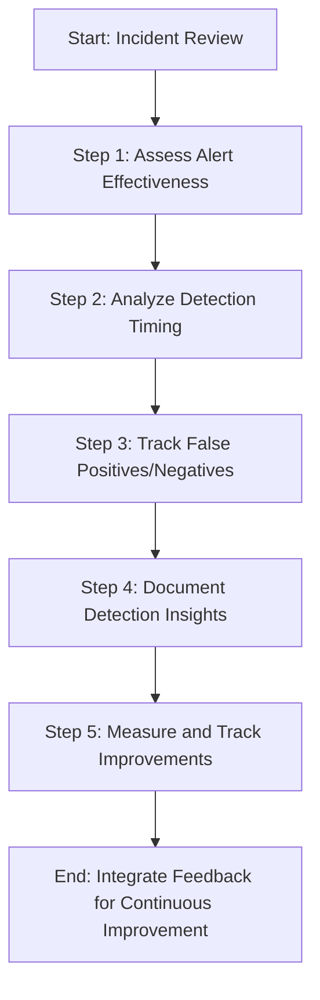

#### Workflow Details

1. **Assess Alert Effectiveness**\
   Review the performance of alerts during the incident, focusing on timing, accuracy, clarity, and actionability metrics.

2. **Analyze Detection Timing**\
   Evaluate when alerts were triggered relative to the actual issue timeline. Identify areas for optimizing early detection.

3. **Track False Positives/Negatives**\
   Maintain a log of false positives and negatives across all alert types to pinpoint patterns and refine detection rules.

4. **Document Detection Insights**\
   Build a knowledge repository capturing key insights from alert performance during incidents, including lessons learned.

5. **Measure and Track Improvements**\
   Establish clear metrics to monitor progressive improvements in detection capabilities, ensuring a reduction in mean time to detection (MTTD).

By following this workflow, teams can systematically enhance detection systems, ensuring alerts become more precise, actionable, and effective over time.
