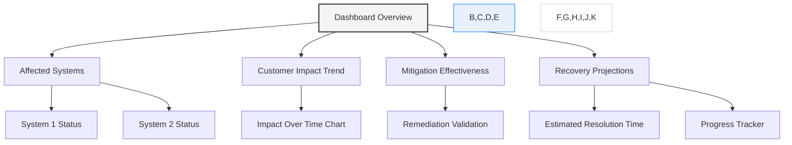
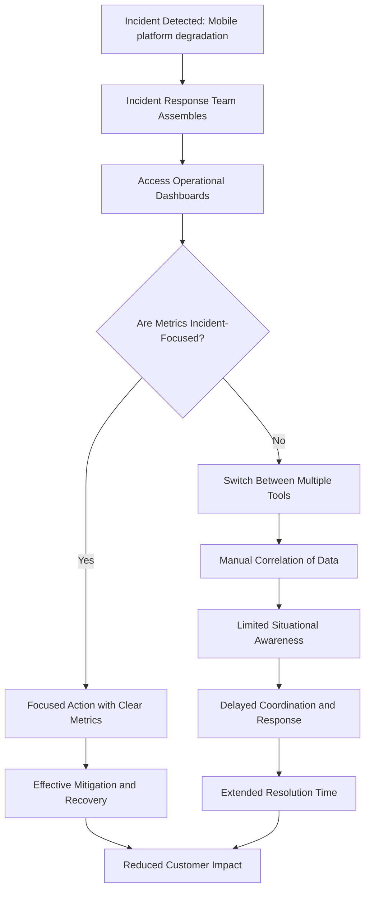
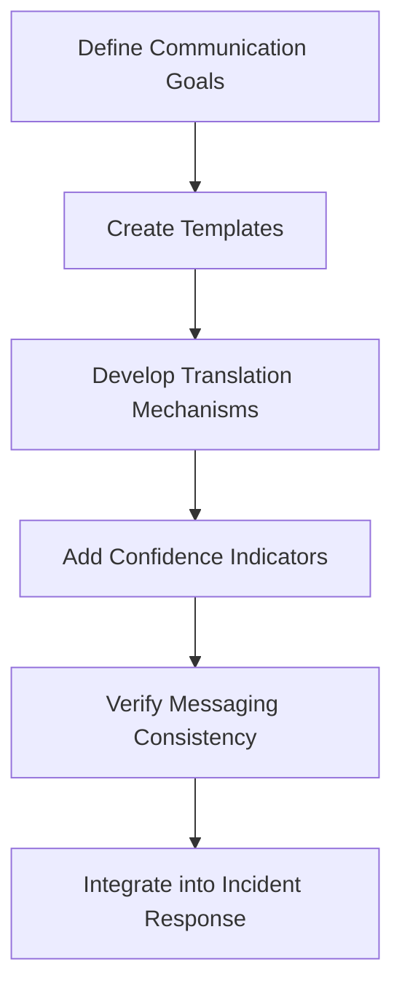
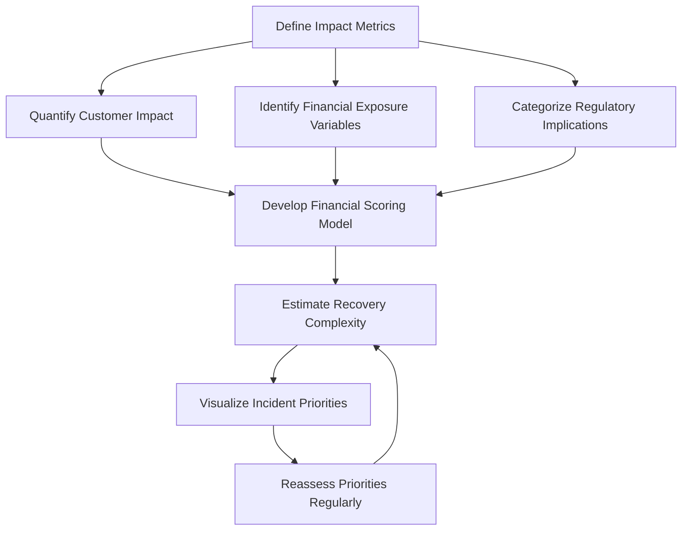
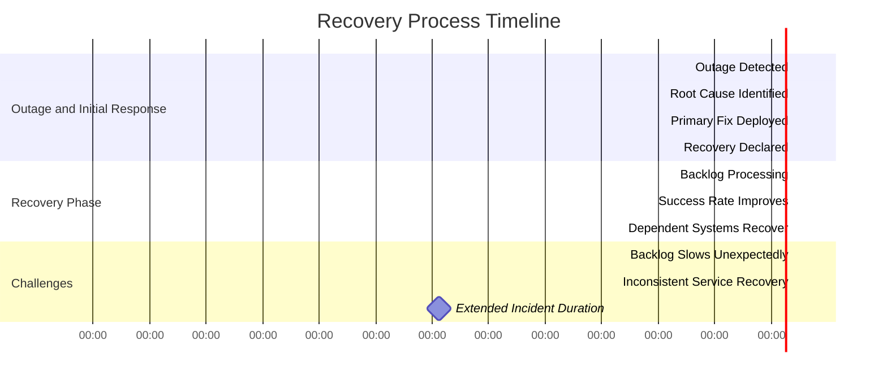
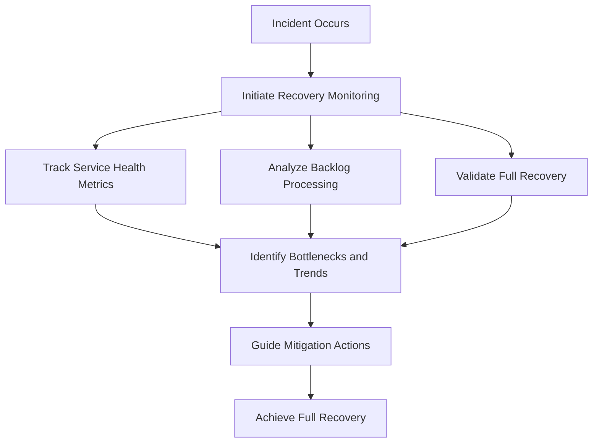
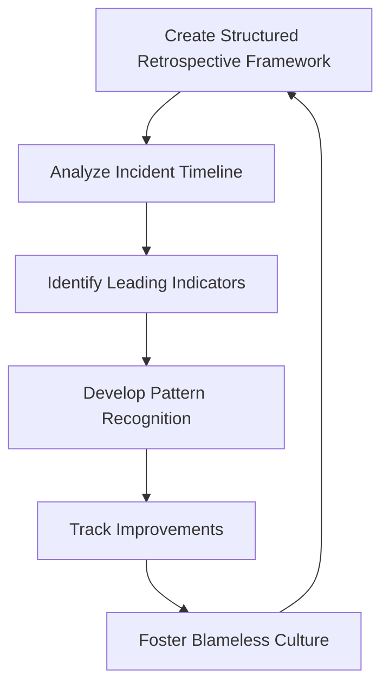
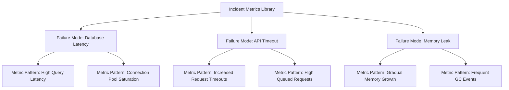
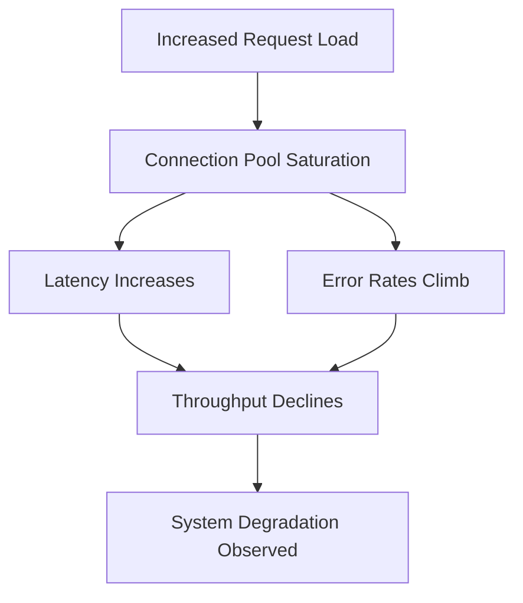

# Chapter 12: Metrics-Driven Incident Response

## Chapter Overview: Metrics-Driven Incident Response

This chapter throws you into the fire—and then hands you a dashboard. Welcome to incident response where metrics don’t just explain what happened—they steer the ship. You’ll learn how to measure impact before your CTO yells, coordinate recovery while everyone’s watching, and triage like your budget depends on it (because it does). If your playbook starts with guesswork and ends in a Slack apology, this is your upgrade. It’s about response built on data, recovery guided by metrics, and learning that sticks.

______________________________________________________________________

## Learning Objectives

By the end of this chapter, readers will be able to:

1. Assess customer, financial, and regulatory impact with real-time metrics.
2. Build incident-specific dashboards for coordinated response and recovery.
3. Translate technical impact into business-language metrics for communication.
4. Prioritize response with a triage framework based on quantifiable consequences.
5. Monitor recovery progress across services, backlogs, and dependencies.
6. Run effective, blameless retrospectives using metric-driven lifecycle analysis.
7. Create and use pattern libraries for rapid diagnosis of recurring failures.

______________________________________________________________________

## Key Takeaways

- **“It’s broken” isn’t helpful—tell me *how bad* and *for whom***: Impact metrics are the difference between firefighting and incident leadership.
- **Operational dashboards ≠ War room dashboards**: Incident metrics need their own spotlight.
- **Speak Finance, not Infrastructure**: Metrics have to talk to execs, customers, and regulators, not just engineers.
- **Priority Isn’t a Gut Feeling**: Use impact + recovery complexity, not alert volume.
- **Fixing isn’t Finishing**: Measure your way through recovery, not just to it.
- **Retrospectives That Don’t Learn Are Just Story Time**: Metrics turn “blameless” into “better.”
- **Don’t Just Investigate—Recognize**: Pattern libraries make response smarter, faster, and more consistent.

> Every incident is a test of your systems, your process, and your nerves. Metrics give you a fighting chance at passing all three.

______________________________________________________________________

## Panel 1: How Bad Is It?

### Scene Description

The incident commander is evaluating the payment gateway outage impact using a service dependency map and detailed customer impact metrics. A comprehensive impact dashboard is central to the scene, providing critical real-time data. The dashboard includes:

- **Transaction Volume Affected**: A bar chart displaying the percentage of transactions disrupted across various time intervals.
- **Customer Segments Impacted**: A table highlighting affected customer groups, segmented by geography and account type.
- **Financial Exposure Estimates**: A dynamic widget calculating potential revenue loss over time based on current outage duration and transaction patterns.
- **Critical Path Visualization**: A dependency map showing disrupted components and their downstream impact on other services.

Below is a text-based representation of the critical path visualization for clarity:

```
Payment Gateway Outage
  ├── Transaction Processor
  │     ├── Fraud Detection Service
  │     └── Settlement Service
  └── API Gateway
        ├── Mobile App
        └── Merchant Portals
```

This structured dashboard ensures the incident commander can quickly assess the scope, severity, and business consequences of the outage, enabling informed prioritization and response decisions.

### Teaching Narrative

Impact assessment metrics provide immediate visibility into incident scope, severity, and business consequences. These measurements quantify affected customers, transaction volumes, financial exposure, and regulatory implications during active incidents, enabling appropriate response scaling and prioritization. For payment gateway outages, comprehensive impact metrics ensure response efforts focus on the most critical business functions based on actual customer and financial consequences rather than technical severity alone.

### Common Example of the Problem

A bank experiences a payment gateway disruption affecting multiple channels, but the operations team struggles to quantify the actual business impact. Initial technical alerts show API error rates of 12% and elevated response times, but provide no insight into which customers are affected, what transaction types are failing, or the financial significance of the disruption. Without comprehensive impact metrics, incident response becomes a technical exercise disconnected from business priorities.

The table below illustrates the gap between technical symptoms and missing business impact metrics, highlighting how this misalignment leads to inefficient incident prioritization and extended resolution times.

| **Category** | **Technical Symptoms** | **Missing Business Impact Metrics** |
| ------------------- | -------------------------------------- | ------------------------------------------------------------------ |
| **Error Rates** | 12% API error rate detected | Which customers (e.g., retail vs. enterprise) are facing failures? |
| **Response Times** | Elevated latency in payment processing | What transaction types (e.g., high-value transfers) are delayed? |
| **Outage Scope** | Affected service components identified | What is the financial exposure (e.g., lost revenue per hour)? |
| **Customer Impact** | No customer granularity in alerts | How many customers are affected, and in which regions/segments? |

By focusing solely on technical metrics, the response team often prioritizes components with the most severe technical symptoms rather than those impacting the most critical business functions. For instance, they may address API latency affecting a low-priority service while overlooking failed transactions for high-value customers. This misalignment extends resolution time for the most business-critical functions while engineering resources address technically interesting but less impactful components.

### SRE Best Practice: Evidence-Based Investigation

Implement comprehensive impact assessment metrics with the following actionable steps:

#### Checklist for Comprehensive Impact Assessment

1. **Customer Impact Quantification**

   - [ ] Create affected user count with segmentation:
     - [ ] Customer type (retail, business, institutional)
     - [ ] Relationship value (high-net-worth, mass market)
     - [ ] Channel utilization (mobile, web, in-person)
     - [ ] Geographic distribution
   - [ ] Implement experience degradation metrics
   - [ ] Develop transaction failure rates by customer segment
   - [ ] Build impact trend analysis showing increasing or decreasing scope

2. **Financial Exposure Measurement**

   - [ ] Create transaction volume analysis for affected services
   - [ ] Implement monetary value quantification of impacted flows
   - [ ] Develop revenue impact projections
   - [ ] Build business consequence assessment using financial metrics

3. **Regulatory and Compliance Assessment**

   - [ ] Create reporting threshold verification
   - [ ] Implement SLA compliance impact measurement
   - [ ] Develop identification of regulated services
   - [ ] Build notification requirement determination

#### Benefits of Evidence-Based Investigation

Comprehensive impact analysis transforms incident response from technology-focused to business-aligned. For example, while an API error rate may affect multiple services, identifying that 83% of the financial impact is concentrated in the commercial payment service used by high-value clients provides clear prioritization guidance. This ensures response efforts are aligned with actual customer and business consequences rather than technical severity alone.

### Banking Impact

For payment systems, impact quantification is as critical to incident response as an accurate diagnosis is to medical treatment. Just as a misdiagnosed condition can lead to ineffective or harmful interventions, an incomplete impact assessment can result in misaligned priorities, wasted resources, and prolonged disruption of essential services. This misstep can escalate financial losses and damage customer trust, much like untreated symptoms can worsen a patient's health.

Every improvement in impact visibility acts as a clearer diagnosis, enabling targeted action to protect core business functions, minimize losses, and maintain customer relationships. Comprehensive impact metrics ensure that incident response strategies are grounded in business priorities rather than reactive technical intuition. This approach safeguards the most valuable services first, addressing the true scope of the impact based on quantifiable metrics rather than perceived technical severity.

### Implementation Guidance

1. **Create Comprehensive Customer Impact Dashboards**

   - Segment customers by geography, tier, or product usage to visualize affected cohorts.
   - Use the following sample code snippet to query and aggregate affected transaction data from a database:
     ```sql
     SELECT 
         customer_segment, 
         COUNT(transaction_id) AS affected_transactions, 
         SUM(transaction_amount) AS total_impact
     FROM 
         transactions
     WHERE 
         status = 'failed' 
         AND updated_at >= NOW() - INTERVAL '1 HOUR'
     GROUP BY 
         customer_segment;
     ```

2. **Implement Financial Exposure Calculation**

   - Estimate the financial impact of the outage by multiplying the affected transaction volume by the average revenue per transaction.
   - Example formula in Python:
     ```python
     def calculate_financial_exposure(affected_transactions, avg_revenue_per_transaction):
         return affected_transactions * avg_revenue_per_transaction

     # Example usage
     affected_transactions = 2500
     avg_revenue_per_transaction = 15.75
     financial_exposure = calculate_financial_exposure(affected_transactions, avg_revenue_per_transaction)
     print(f"Estimated Financial Exposure: ${financial_exposure}")
     ```

3. **Develop Regulatory Impact Assessment**

   - Identify compliance risks by mapping affected services to regulatory obligations.
   - Ensure audit logs track all failed transactions and customer notifications for reporting purposes.

4. **Build Business-Aligned Prioritization Framework**

   - Use a decision matrix to prioritize response efforts based on business impact. Below is an example workflow for prioritization:
     ```
     Start --> Assess Impact --> High Financial Exposure? --> Yes --> Prioritize First
                     |                                      |
                     v                                      v
           Critical Customer Affected? --> Yes --> Prioritize First
                     |                                      |
                     v                                      v
         Non-Critical Impact --> Defer Response Based on SLA
     ```

5. **Establish Impact Assessment as the First Formal Step**

   - Embed impact assessment into the incident response process as shown in the following high-level workflow:
     ```mermaid
     flowchart TD
         Start[Start Incident Response] --> AssessImpact[Assess Impact Metrics]
         AssessImpact --> Decision[Critical Business Impact?]
         Decision -->|Yes| ScaleResponse[Scale Response Efforts]
         Decision -->|No| Monitor[Monitor & Reassess]
         ScaleResponse --> Resolve[Resolve Incident]
         Monitor --> Resolve
     ```

## Panel 2: The War Room Dashboard

### Scene Description

Incident response team coordinating recovery efforts using a specialized real-time metrics dashboard that highlights the impact and recovery progress. This purpose-built incident command center provides a clear view of critical metrics designed specifically for response coordination, including affected systems, customer impact trends, mitigation effectiveness, and recovery projections with clear status indicators.

Below is a conceptual representation of the war room dashboard layout, illustrating its core components and their relationships:



This diagram reflects how the dashboard consolidates and organizes data to support rapid decision-making during incident response: from monitoring the current state of affected systems to predicting resolution timelines and validating the effectiveness of actions taken.

### Teaching Narrative

Incident response metrics serve different purposes than day-to-day monitoring, focusing on situation awareness, impact tracking, mitigation effectiveness, and recovery progress. These specialized measurements provide real-time visibility into incident status, guide investigation paths, validate remediation efforts, and track progress toward resolution. For banking incident management, effective response metrics significantly reduce mean time to resolution by providing clear, actionable information throughout the incident lifecycle.

### Common Example of the Problem

A bank's mobile platform experiences degraded performance affecting customer transactions, triggering incident response procedures. The team assembles but immediately faces a metrics challenge: their standard operational dashboards are designed for daily monitoring rather than incident management. These dashboards show hundreds of technical metrics across dozens of systems but lack the focused, real-time information needed during active incidents.

Below is a simplified flowchart illustrating the steps and challenges faced during the incident:



As shown, the lack of incident-specific metrics forces engineers to waste valuable time switching between tools, correlating data manually, and struggling to assess the overall status. This hampers situational awareness, delays coordination efforts, and extends resolution time, leaving customers to continue experiencing transaction failures. By contrast, having purpose-built incident metrics can streamline actions, improve mitigation effectiveness, and accelerate recovery efforts.

### SRE Best Practice: Evidence-Based Investigation

Implement dedicated incident response metrics to enable effective, data-driven decision-making during incidents. Use the checklist below to ensure comprehensive adoption of best practices:

#### Checklist: Evidence-Based Investigation Metrics

1. **Situational Awareness Measurement**

   - [ ] Create incident scope visualization showing affected systems.
   - [ ] Implement customer impact tracking with real-time updates.
   - [ ] Develop trend analysis showing problem escalation/improvement.
   - [ ] Build status indicators providing at-a-glance assessments.

2. **Investigation Guidance Metrics**

   - [ ] Create change correlation timeline identifying potential triggers.
   - [ ] Implement anomaly highlighting to guide diagnostic focus.
   - [ ] Develop component health indicators showing service status.
   - [ ] Build probable cause ranking based on telemetry patterns.

3. **Mitigation Effectiveness Tracking**

   - [ ] Create before/after comparisons for remediation actions.
   - [ ] Implement recovery progress visualization.
   - [ ] Develop backlog processing metrics for accumulated transactions.
   - [ ] Build time-to-resolution projection based on recovery rate.

#### Example Scenario: Metrics in Action

Purpose-built metrics transform incident coordination effectiveness, providing unified situational awareness that all team members can reference. For example:

- Real-time impact trends reveal that while authentication errors are decreasing after recent mitigation efforts, transaction timeout rates continue climbing.
- Investigation guidance metrics identify a probable cause linked to database connection issues that standard dashboards obscure among hundreds of other metrics.
- Mitigation effectiveness tracking confirms that fixing the database connection resolves the transaction timeout issue, validating the remediation success.

This structured approach ensures incidents are managed systematically, with clear visibility and actionable insights at every stage.

### Banking Impact

For digital banking platforms, incident visualization directly affects both resolution time and team effectiveness. Inappropriate metrics create extended outages through inefficient coordination, missed diagnostic clues, and inability to assess mitigation effectiveness. Every minute saved in resolution translates into tangible benefits: for example, during a critical outage impacting payment processing, reducing resolution time by just 15 minutes could preserve up to $500,000 in transaction volume, minimize customer frustration, and safeguard institutional trust. Specialized incident metrics enable the coordinated response needed for complex banking systems, ensuring all team members maintain consistent situational awareness while focusing efforts on the most impactful aspects of the incident.

### Implementation Guidance

To create an effective incident response dashboard, follow these step-by-step instructions:

1. **Define Key Metrics for Incident Response**

   - Identify metrics that provide actionable insights during an incident. Examples include:
     - Affected systems count
     - Customer impact trends
     - Mitigation effectiveness
     - Recovery progress projections
   - Ensure metrics align with your organization’s incident response priorities.

2. **Design Dashboard Layout**

   - Categorize metrics into clear sections for visibility:
     - **Impact Overview:** Displays affected systems and customer impact trends.
     - **Mitigation Effectiveness:** Shows progress of remediation efforts.
     - **Recovery Projections:** Offers estimated resolution timelines.
   - Use color-coded indicators (e.g., red/yellow/green) for quick status identification.

3. **Implement Real-Time Data Collection**

   - Integrate data sources such as:
     - System monitoring tools (e.g., CPU usage, error rates)
     - Customer support logs
     - Application performance metrics
   - Stream data into the dashboard using APIs or event stream processors.

4. **Visualize Trends and Anomalies**

   - Use trend visualization tools (e.g., line charts, bar graphs) to highlight:
     - Escalating or de-escalating customer impact.
     - Anomalous patterns in system performance.
   - Example:
     ```
     +---------------------+
     |     Impact Trend    |
     |  ██████░░░░░░░░░░   |
     |  █████████░░░░░░░   |
     |  ████████████░░░░   |
     |  ████████████████   |
     +---------------------+
     ```

5. **Incorporate Investigation Guidance**

   - Provide pre-configured filters and drill-down options to help identify:
     - Affected services or regions.
     - Root causes of anomalies.
   - Example process:
     ```
     Incident Detected -> Identify Impacted Service -> Analyze Logs -> Initiate Mitigation
     ```

6. **Measure Mitigation Effectiveness**

   - Add widgets showing:
     - Number of resolved vs. unresolved issues.
     - Performance improvements post-mitigation.
   - Example:
     ```
     Mitigation Status:
     Resolved: 8 | Unresolved: 2
     ```

7. **Integrate Dashboard into Standard Procedures**

   - Train response teams on using the dashboard during incidents.
   - Make the dashboard a mandatory tool in incident management workflows.
   - Conduct regular drills to validate its effectiveness.

By following these steps, you can create a purpose-built incident response dashboard that enhances situational awareness, accelerates decision-making, and ultimately reduces the mean time to resolution.

## Panel 3: The Communication Challenge

### Scene Description

Technical team translating incident metrics into business impact information for executive stakeholders and external communication. The process involves transforming raw technical incident data into business-focused briefing materials tailored to different audience needs. Metrics are reframed in business terms, avoiding technical jargon, to ensure clarity and relevance for executives, customers, and regulators.

Below is a simplified text diagram illustrating this transformation process:

```
[Technical Incident Data]
          |
          v
[Metrics Analysis & Mapping]
          |
          v
[Business Impact Metrics]
          |
          v
[Audience-Specific Briefing Materials]
(Executives, Customers, Regulators)
```

This flow outlines how technical data is analyzed and mapped to business impacts, which are then communicated through customized materials for each stakeholder group.

### Teaching Narrative

Communication metrics translate technical incident data into business impact information for diverse stakeholders. These measurements express system status in terms relevant to executives, customers, and regulators rather than technical details, enabling clear, consistent communication across audiences. For banking incidents, effective communication metrics ensure that all stakeholders understand impact, status, and expectations in relevant terms without requiring technical expertise.

### Common Example of the Problem

A bank experiences a core banking system incident affecting multiple services, but struggles with stakeholder communication. Technical teams understand the database replication failure causing the issue but cannot effectively translate this into meaningful updates for different audiences. Executives receive incomprehensible technical details without clear business impact assessment, customers get vague information without specific service status, and regulators receive inconsistent updates without compliance-relevant metrics. This communication gap creates additional problems beyond the technical incident: executive confusion leading to escalation demands, customer frustration from uncertainty, and potential regulatory concerns from inadequate notification. Without metrics that bridge technical reality and stakeholder needs, even well-managed technical responses create business problems through poor communication.

#### Checklist: Identifying Communication Gaps and Consequences

- **Technical-to-Business Translation Issues**

  - Are technical updates being reframed into business impact terms?
  - Are executives provided with actionable insights rather than technical detail?

- **Customer-Focused Communication**

  - Are customers informed with clear, specific updates about service status?
  - Does the communication reduce uncertainty and provide timelines or next steps?

- **Regulatory Compliance**

  - Are regulators receiving consistent and compliance-relevant metrics?
  - Do updates align with regulatory notification requirements?

- **Broader Impact of Communication Gaps**

  - Are executives escalating unnecessarily due to confusion or lack of clarity?
  - Is customer trust being eroded by vague or incomplete updates?
  - Are regulatory risks increasing because of inadequate or inconsistent notifications?

By using this checklist, technical teams can identify and address communication gaps early, ensuring that stakeholders receive clear, relevant, and consistent information during incidents.

### SRE Best Practice: Evidence-Based Investigation

Implement stakeholder-appropriate communication metrics:

| Stakeholder Type | Metric Purpose | Example Metrics |
| ---------------- | ---------------------------------- | ----------------------------------------------------------------------------------------- |
| **Executives** | Quantify business impact | - Financial metrics: Revenue effects (e.g., $73,000/hour at risk) |
| | | - Customer impact: Affected customer counts by segment |
| | Provide operational context | - Operational metrics: Processing disruption (e.g., SLA breaches, system downtime) |
| | | - Comparative metrics: Incident severity (e.g., benchmarked against historical incidents) |
| | Inform decision-making | - Resolution timeline: Confidence indicators |
| | | - Resource adequacy: Staffing and tooling assessment |
| | | - Decision support: Actionable insights for leadership |
| **Customers** | Communicate service status | - Affected service identification: Outage notifications and current status |
| | | - Estimated resolution times: Timeframes with confidence levels |
| | Offer reassurance | - Alternative channel effectiveness: Availability of backup options |
| | | - Transaction assurance: Metrics addressing service completion concerns |
| **Regulators** | Ensure compliance and transparency | - Compliance metrics: Incident categorization aligned with regulatory requirements |
| | | - Notification timeliness: Verifying reporting deadlines are met |
| | | - Impact metrics: Analysis aligned to regulatory frameworks |
| | | - Remediation documentation: Demonstrating effectiveness of corrective actions |

Translated communication metrics transform stakeholder management, converting technical incident details into audience-appropriate information. For example, while technical teams monitor database replication lag and query performance, executives receive a financial impact assessment of $73,000 revenue at risk per hour alongside affected customer counts by segment. These tailored metrics enable informed business decisions during incidents.

### Banking Impact

For financial institutions, incident communication directly affects both stakeholder confidence and regulatory standing. Ineffective communication creates significant business consequences beyond the technical incident: executive uncertainty leading to disruptive escalations, customer anxiety triggering account relationship concerns, and regulatory scrutiny from inadequate notification. Every improvement in communication effectiveness represents preserved stakeholder confidence, reduced secondary impacts, and protected institutional reputation during service disruptions. Appropriate metrics ensure all stakeholders receive the information they need in terms they understand, maintaining confidence in the institution's management of the situation.

### Implementation Guidance

To effectively translate technical incident data into business impact information, follow this checklist:

#### Checklist for Implementation

1. **Define Communication Goals**

   - Identify key outcomes for each stakeholder group (e.g., executives, customers, regulators).
   - Determine the level of detail and focus required for each audience.

2. **Create Audience-Specific Templates**

   - Design reusable templates tailored to each audience's needs.
   - Include clear sections for impact metrics, timeline updates, and resolution status.

3. **Implement Translation Mechanisms**

   - Develop processes or tools to convert technical metrics (e.g., error rates, latency) into business-oriented terms (e.g., customer transactions affected, revenue impact).
   - Establish a glossary for consistent terminology.

4. **Develop Confidence Indicators**

   - Include confidence levels for impact assessments and timeline projections.
   - Use visual indicators (e.g., low/medium/high confidence) to clarify uncertainty.

5. **Ensure Messaging Consistency**

   - Verify alignment across all communication channels to prevent mixed messages.
   - Perform regular reviews of messaging for accuracy and relevance.

6. **Integrate Communication Metrics into Incident Response**

   - Make communication planning a core part of incident management workflows.
   - Assign roles for maintaining and updating communication materials during incidents.

#### Example Workflow for Implementation



By following this structured approach, teams can ensure that technical incident data is consistently and effectively communicated in terms that are meaningful to all stakeholders.

## Panel 4: The Triage Matrix

### Scene Description

Multiple incidents are occurring simultaneously, with the team using impact-based metrics to prioritize response allocation. The prioritization framework ranks incidents based on customer impact, financial exposure, and recovery complexity rather than technical severity alone, guiding resource allocation across competing demands.

Below is a textual representation of the prioritization framework to illustrate how incidents are evaluated and ranked:

```
+----------------------+---------------------+----------------------+
| Incident             | Customer Impact    | Financial Exposure   | Recovery Complexity |
+----------------------+---------------------+----------------------+
| Incident A           | High               | Medium               | High                |
| Incident B           | Medium             | High                 | Low                 |
| Incident C           | Low                | Low                  | Medium              |
| Incident D           | High               | High                 | High                |
+----------------------+---------------------+----------------------+

Priority Order: Incident D > Incident A > Incident B > Incident C
```

This structured approach ensures that response efforts are focused on the highest-priority issues, balancing business impact across multiple dimensions for effective resource management.

### Teaching Narrative

Triage metrics enable data-driven prioritization when multiple incidents compete for limited response resources. These measurements compare incidents across dimensions including customer impact, financial exposure, regulatory requirements, and recovery complexity, creating objective criteria for resource allocation. For banking operations, effective triage metrics ensure that response efforts focus on the most critical issues based on actual business impact rather than subjective assessment or political pressure.

### Common Example of the Problem

A bank's operations team faces a challenging Monday morning with four simultaneous incidents: mobile banking performance degradation, payment processing errors for certain transaction types, online banking login issues, and branch connectivity problems at several locations. With limited incident response resources, the team struggles with prioritization, initially focusing on the mobile banking issue because it generated the most monitoring alerts. This decision reflects technical visibility rather than business impact assessment. Without objective triage metrics comparing these incidents across business dimensions, the team makes prioritization decisions based on technical severity, alert volume, or which stakeholders are most vocal—potentially addressing lower-impact issues while more critical services remain disrupted.

To illustrate this, the incidents can be compared across the key triage dimensions:

| Incident | Customer Impact | Financial Exposure | Recovery Complexity | Regulatory Requirements |
| -------------------------------------- | --------------------------------------------------------------------- | ------------------------------------------------------------- | ------------------------------------------------------ | --------------------------------------------- |
| Mobile Banking Performance Degradation | High: Affects many customers but with minor usability issues | Moderate: Potential loss of revenue due to reduced usage | Medium: Requires performance tuning and load testing | Low: No direct compliance issues |
| Payment Processing Errors | High: Impacts transactions directly, risking customer dissatisfaction | High: Direct financial loss from failed payments | High: Involves complex debugging of transaction flows | High: Non-compliance with payment regulations |
| Online Banking Login Issues | High: Prevents access for many customers | Moderate: Loss of transactional opportunities during downtime | Medium: Relatively standard troubleshooting process | Low: No immediate compliance risks |
| Branch Connectivity Problems | Moderate: Affects specific locations, lower customer volume | Low: Limited financial impact due to localized nature | High: Network troubleshooting across multiple branches | Low: No direct compliance issues |

This table highlights how reliance on alerts or vocal stakeholders can lead to suboptimal decisions. For example, while mobile banking generated the most alerts, payment processing errors pose the highest financial, regulatory, and recovery challenges. A structured triage matrix would prioritize the payment processing issue, ensuring resources are allocated to the most critical incidents based on objective criteria.

### SRE Best Practice: Evidence-Based Investigation

#### Checklist for Implementing Data-Driven Incident Triage

Use the following step-by-step guide to apply evidence-based investigation practices effectively during incident triage:

______________________________________________________________________

#### 1. Multi-Dimensional Impact Comparison

- **Customer Impact Analysis**:
  - Identify the number of affected customers.
  - Assess customer segments and their relationship value.
  - Determine transaction criticality and urgency.
  - Check availability of alternative channels.
- **Financial Exposure Comparison**:
  - Quantify financial loss per minute or transaction.
  - Identify potential long-term revenue impact.
- **Regulatory Significance Assessment**:
  - Review compliance risks or legal penalties.
  - Account for mandated reporting timelines.
- **Brand and Reputation Impact Evaluation**:
  - Assess potential media or public perception risks.
  - Evaluate the impact on customer trust and loyalty.

______________________________________________________________________

#### 2. Recovery Complexity Assessment

- **Resource Requirements**:
  - Estimate the team size, skillsets, and tools needed.
- **Time-to-Resolution**:
  - Project resolution timelines for each incident.
- **Dependency Analysis**:
  - Map cascading effects on other systems or services.
- **Mitigation Options**:
  - Identify temporary workarounds or fixes.
  - Evaluate feasibility and risks of each option.

______________________________________________________________________

#### 3. Dynamic Priority Management

- **Continuous Re-Assessment**:
  - Regularly update metrics as new data becomes available.
- **Escalation Triggers**:
  - Define thresholds for escalating incidents (e.g., SLA breaches, increased customer impact).
- **Resource Reallocation**:
  - Establish criteria for reallocating teams or resources dynamically.
- **Priority Visualization**:
  - Maintain a real-time dashboard or chart showing current focus areas and priorities.

______________________________________________________________________

#### Example Scenario: Applying Objective Triage Metrics

When comparing incidents, consider:

- **Mobile App Outage**: Large number of affected users but limited financial exposure due to existing workarounds.
- **Payment Processing Errors**: Fewer affected users but 7x greater financial loss per minute and no workaround available.

**Priority Decision**: Resolve payment processing errors first to minimize financial impact, even though fewer users are affected.

This structured approach ensures triage decisions are objective, transparent, and aligned with business impacts, avoiding subjective or politically influenced prioritization.

### Banking Impact

For financial operations, triage effectiveness directly affects both incident impact and resource utilization. Subjective prioritization creates significant business consequences through misaligned response efforts, extended disruption of critical services, and inefficient resource allocation during multiple incidents. Every improvement in triage decision quality represents reduced financial losses, preserved customer relationships, and protected regulatory standing during complex operational situations. Objective metrics ensure that limited response resources focus first on the incidents with greatest business importance, regardless of technical visibility or stakeholder influence.

### Implementation Guidance

Below is a step-by-step workflow for implementing the triage matrix, along with a visual representation in a Mermaid diagram to illustrate the interconnected steps:

1. **Create Comprehensive Impact Assessment Framework**

   - Define metrics for customer impact (e.g., affected users, SLA breaches).
   - Identify financial exposure variables (e.g., transaction volume, penalties).
   - Categorize incidents by regulatory or reputational implications.

2. **Implement Financial Exposure Calculation Across Incident Types**

   - Develop a scoring model to quantify financial impact per incident.
   - Automate data collection for financial metrics where possible.

3. **Develop Recovery Complexity Estimation with Resource Requirements**

   - Create time-to-recover benchmarks based on historical data.
   - Map resource dependencies for common incident types.

4. **Build Visualization Tools Showing Relative Incident Priority**

   - Integrate a dashboard that ranks incidents using weighted scores.
   - Ensure real-time updates as incident statuses evolve.

5. **Establish Regular Reassessment Processes as Incidents Evolve**

   - Implement checkpoints to re-evaluate priorities during incident lifecycle.
   - Incorporate feedback loops to refine triage metrics over time.



This workflow ensures a systematic and iterative approach to implementing the triage matrix, enabling teams to make objective, impact-driven decisions during incident response.

## Panel 5: The Recovery Tracker

### Scene Description

The Operations team is actively monitoring service restoration metrics displayed on a recovery dashboard during the recovery process. The dashboard provides a comprehensive view of key metrics, including:

- **Success Rate Improvement**: Tracking the increase in successful transaction rates over time.
- **Backlog Processing Progress**: Monitoring the reduction of queued tasks and pending operations.
- **Resource Normalization**: Visualizing the stabilization of system resources such as CPU, memory, and database connections.
- **Projected Full Recovery Timing**: Estimating the timeline for complete system restoration.

Below is a conceptual representation of the recovery dashboard:

```
+------------------------------------------------------+
|                  Recovery Dashboard                  |
+------------------------------------------------------+
| Success Rate:   | ██████████ 85%                     |
| Backlog:        | ▂▃▅▇█ 40%                          |
| Resources:      | CPU: 70% | Mem: 65% | DB: 60%      |
| Full Recovery:  | Estimated Time: 2h 15m             |
+------------------------------------------------------+
| Recent Trends:                                      |
| - Transactions Success: ↑ 15%                       |
| - Queue Drainage: ↓ 25%                             |
+------------------------------------------------------+
```

This visual representation highlights the multiple dimensions of recovery, enabling the team to assess progress and adjust remediation efforts dynamically. By closely monitoring these metrics, the Operations team ensures data-driven decision-making and transparent progress reporting to stakeholders.

### Teaching Narrative

Recovery tracking metrics provide visibility into remediation effectiveness and progress toward service restoration. These measurements monitor key indicators including error rate trends, transaction success improvements, queue drainage, and backlog processing as systems recover from incidents. For banking services, comprehensive recovery metrics enable accurate progress reporting to stakeholders and data-driven decisions about additional mitigation efforts during extended recovery operations.

### Common Example of the Problem

A bank's payment platform experiences a significant outage, creating transaction processing backlogs and affecting multiple dependent systems. After implementing the primary fix, the operations team declares "recovery in progress" but lacks detailed visibility into the actual restoration state. Multiple challenges emerge during the recovery phase: transaction backlogs process more slowly than expected, success rates improve unevenly across services, and dependent systems show inconsistent recovery patterns.

The following timeline illustrates the sequence of events during the recovery process, highlighting key pain points and challenges:



Without comprehensive recovery metrics, the team struggles to provide accurate status updates, estimate completion timeframes, or determine whether additional interventions are needed. This recovery blindness causes delays as unexpected complications remain hidden, extending the total incident duration and impacting service restoration timelines.

### SRE Best Practice: Evidence-Based Investigation

Implement comprehensive recovery monitoring using the following checklist:

#### Service Health Restoration Measurement

- [ ] Create success rate trending to visualize improvement trajectory.
- [ ] Implement error rate reduction verification to track system stabilization.
- [ ] Develop performance normalization tracking for key metrics.
- [ ] Build comparative metrics to measure progress against baseline conditions.

#### Backlog Processing Analytics

- [ ] Create queue depth monitoring with drainage rate visualization.
- [ ] Implement processing rate measurement to assess throughput.
- [ ] Develop completion projections based on current processing rates.
- [ ] Build backlog composition analysis to identify transaction types and priorities.

#### Full Recovery Validation

- [ ] Verify restoration of dependent services to ensure end-to-end functionality.
- [ ] Confirm resource normalization for system stability.
- [ ] Develop customer experience validation metrics to ensure usability and satisfaction.
- [ ] Confirm business process resumption to validate operational readiness.

#### Recovery Monitoring Workflow (High-Level)



Comprehensive recovery metrics transform restoration management from hopeful waiting to data-driven control. For example, API success rates may show steady improvement, but recovery monitoring could reveal that payment authorization backlog processing has stalled at 74% completion due to database connection limitations—a critical insight that guides targeted intervention to achieve full recovery.

### Banking Impact

For payment systems, recovery visibility directly affects both total incident duration and customer confidence. Insufficient recovery metrics create significant business consequences through extended service restoration, inaccurate status communications, and ineffective resource allocation during the critical recovery phase. Every improvement in recovery management represents faster service normalization, more accurate stakeholder communications, and reduced total business impact from the incident. Comprehensive metrics ensure that recovery progresses efficiently toward full service restoration rather than stalling with partial functionality that continues affecting customer transactions.

| **Aspect** | **Insufficient Recovery Metrics** | **Comprehensive Recovery Metrics** |
| ------------------------- | -------------------------------------------------------- | --------------------------------------------------- |
| **Incident Duration** | Extended due to delays in detecting and resolving issues | Reduced through precise tracking and prioritization |
| **Customer Confidence** | Decreases due to vague or inaccurate updates | Increases with clear and reliable communications |
| **Status Communication** | Inconsistent, leading to stakeholder frustration | Accurate, improving trust with stakeholders |
| **Resource Allocation** | Inefficient, with potential misallocation of efforts | Optimized based on real-time recovery data |
| **Service Normalization** | Partial functionality persists, prolonging impact | Full restoration achieved efficiently |
| **Business Impact** | Higher costs, reputational damage, and prolonged effects | Minimized disruption and faster business recovery |

### Implementation Guidance

1. **Create recovery-specific dashboards with restoration metrics**\
   Design dashboards that track key service restoration metrics such as error rate trends, transaction success improvements, backlog processing progress, and resource utilization. Below is an example configuration snippet for a recovery dashboard using a common monitoring tool:

   ```yaml
   dashboard:
     title: "Service Recovery Tracker"
     widgets:
       - type: timeseries
         title: "Error Rate Trend"
         query: "avg:service.errors{*}.rollup(sum, 5m)"
       - type: timeseries
         title: "Transaction Success Rate"
         query: "avg:service.transactions.success{*}.rollup(sum, 5m)"
       - type: toplist
         title: "Backlog Processing Progress"
         query: "sum:queue.backlog{*} by {service}"
       - type: timeseries
         title: "Resource Utilization"
         query: "avg:system.cpu.usage{*} by {host}.rollup(avg, 5m)"
     layout:
       grid: auto
   ```

2. **Implement backlog monitoring with processing rate tracking**\
   Set up metrics to monitor backlog levels and processing rates in real-time. For example, use a query that calculates the difference between incoming and processed transactions per minute to identify bottlenecks.

   Example calculation:

   ```
   backlog_rate = incoming_transactions - processed_transactions
   ```

3. **Develop completion projections based on actual progress**\
   Use historical data and current processing rates to estimate recovery completion time. Incorporate these projections directly into your dashboards as a visual trendline or single-value metric. For instance, use a linear regression trend based on backlog reduction rates.

4. **Build dependent system verification ensuring complete recovery**\
   Create automated checks to verify the status of dependent systems post-restoration. An example flow for dependent system verification could look like this:

   ```mermaid
   graph TD
     A[Service Recovery Initiated] --> B[Verify Database Connectivity]
     B --> C[Check Queue Drainage Status]
     C --> D[Validate API Dependencies]
     D --> E[Confirm Full Service Availability]
   ```

5. **Establish regular recovery status reviews during extended incidents**\
   Schedule structured reviews to evaluate recovery metrics, address anomalies, and adjust mitigation strategies. Use the configured dashboard to guide discussions and ensure a data-driven approach to decision-making.

## Panel 6: The Blameless Retrospective

### Scene Description

The team is collaboratively analyzing metric patterns leading up to the incident, focusing on identifying missed signals and enhancing detection capabilities. The process is represented as a timeline analysis, highlighting key pre-incident metrics and their corresponding warning signs. The timeline is divided into phases—normal operations, anomaly detection, and incident onset—each annotated with specific data patterns and potential signals that were overlooked. Improvement opportunities are marked with actionable notes to foster a forward-looking, constructive approach.

#### Timeline Representation:

```mermaid
gantt
    dateFormat HH:mm
    title Incident Timeline Analysis
    section Normal Operations
    Stable Metrics       :done, 2023-10-10T00:00, 4h
    section Anomaly Detection
    Minor Metric Deviations :active, 2023-10-10T04:00, 2h
    Missed Early Warning Signals :crit, 2023-10-10T06:00, 1h
    section Incident Onset
    Metric Spike Observed :crit, active, 2023-10-10T07:00, 1h
    Incident Declared     :done, 2023-10-10T08:00, 1h
```



This structured visualization provides a clear chronological view of metric behaviors, enabling the team to pinpoint gaps in detection and response mechanisms. By analyzing these phases, the team identifies systemic improvements to reduce the likelihood and impact of similar incidents in the future.

### Teaching Narrative

Retrospective metrics provide structured analysis of incident lifecycle data to drive systemic improvements. These measurements examine detection timing, response effectiveness, mitigation strategies, and recovery efficiency to identify improvement opportunities. For banking incident management, retrospective metrics transform individual incidents into organizational learning, systematically reducing both frequency and impact of similar incidents through evidence-based improvements.

### Common Example of the Problem

A bank conducts incident post-mortems focused primarily on the immediate technical cause rather than systemic improvement opportunities. After resolving a major payment outage, the team identifies the proximate cause—a database configuration change—and implements specific fixes to prevent recurrence of this exact scenario. However, this narrow approach misses broader learning opportunities. The missed signals and systemic implications can be broken down as follows:

| **Category** | **Missed Opportunity** | **Systemic Implication** |
| ---------------------------- | -------------------------------------------------------------------------------------------------- | -------------------------------------------------------------------------------------------------------- |
| **Early Warning Indicators** | Metrics indicating unusual query latency or increased error rates were not flagged or acted upon. | Reduced ability to detect and respond to similar anomalies before they escalate into full-scale outages. |
| **Process Gaps** | Insufficient review processes allowed the configuration change to bypass adequate testing. | Increased risk of unvetted changes causing future incidents. |
| **Detection Delays** | Monitoring systems failed to detect the issue immediately, resulting in prolonged customer impact. | Slower incident response times and greater customer dissatisfaction. |

Without comprehensive retrospective metrics examining the complete incident lifecycle, the team addresses only the specific technical failure rather than the systemic patterns that allowed it to occur and persist. This limited learning creates an endless cycle of fixing specific causes while missing the opportunity to address underlying patterns.

### SRE Best Practice: Evidence-Based Investigation

Implement comprehensive retrospective analysis by following this structured checklist for evidence-based investigation:

| **Category** | **Action** |
| --------------------------- | ------------------------------------------------------------- |
| **Detection Effectiveness** | - Perform timeline analysis to identify first warning signals |
| | - Identify missed indicators |
| | - Measure detection delays |
| | - Conduct monitoring gap analysis to target improvements |
| **Response Process** | - Measure mobilization effectiveness |
| | - Assess coordination efficiency |
| | - Evaluate diagnostic accuracy |
| | - Analyze mitigation selection effectiveness |
| **Systemic Improvement** | - Recognize patterns across similar incidents |
| | - Perform root cause analysis beyond technical failures |
| | - Identify process gaps |
| | - Prioritize improvement recommendations using metrics |

#### Key Insights from Retrospective Metrics:

- Retrospective metrics enable identification of systemic issues beyond immediate technical causes.
- Example: A database configuration change was identified as the root cause of an incident, but retrospective analysis revealed five prior incidents with similar patterns. These incidents consistently highlighted gaps in change validation processes and monitoring coverage, leading to actionable systemic improvements.

### Banking Impact

For financial operations, learning effectiveness directly affects both incident frequency and long-term reliability. Limited retrospectives create significant business consequences through recurring incident patterns, missed improvement opportunities, and continued exposure to similar failures.

Consider this example: A mid-tier bank experienced three separate outages over six months due to similar misconfigurations in their payment processing pipeline. Initial retrospectives focused solely on immediate remediation, leading to surface-level fixes. These outages collectively caused $1.2M in direct losses, including SLA penalties and customer churn. After adopting comprehensive retrospective metrics, the bank identified systemic gaps in change validation processes. By implementing automated configuration checks and improving deployment pipelines, they reduced similar incidents by 80% over the following year, saving an estimated $4.5M in prevented downtime and SLA-related costs.

Every enhancement to post-incident learning represents prevented future incidents, reduced customer impact, and improved operational resilience through systemic improvements. Comprehensive metrics ensure that each incident becomes a valuable learning opportunity that strengthens the organization rather than an isolated event addressed only in its specific manifestation.

### Implementation Guidance

#### Step-by-Step Retrospective Framework

1. **Create Structured Retrospective Framework**

   - Define a consistent process for analyzing incidents.
   - Identify key metrics: detection timing, response duration, mitigation effectiveness, and recovery time.

2. **Incident Timeline Analysis**

   - Break down the incident into a detailed timeline.
   - Highlight leading indicators or potential early-warning signals.

3. **Develop Pattern Recognition**

   - Compare the incident with historical data.
   - Identify recurring trends or systemic gaps.

4. **Track Improvements**

   - Document actionable improvement steps.
   - Measure their effectiveness over time through follow-up reviews.

5. **Foster a Blameless Culture**

   - Focus on systemic root causes and learning opportunities.
   - Encourage open, constructive discussions free of personal blame.

#### Visual Workflow



This iterative framework ensures actionable insights and continuous improvement while maintaining a blame-free environment.

## Panel 7: The Incident Metrics Library

### Scene Description

The SRE team is collaboratively building a knowledge base of metric patterns associated with common failure modes in banking systems. This knowledge base takes the form of a pattern library, which catalogs the metric signatures of various failure types. These characteristic patterns are designed for rapid recognition during future incidents, enabling quicker diagnostics and resolutions.

Below is a conceptual representation of how the pattern library might be organized:



This diagram illustrates how the library organizes failure modes and their associated metric patterns, offering a structured reference for identifying and addressing recurring issues in banking systems.

### Teaching Narrative

Pattern recognition metrics capture the signature measurements associated with specific failure modes, creating a reference library for faster diagnosis of recurring issues. These pattern collections document the metric behaviors that characterize different failure types, enabling teams to recognize similar incidents based on measurement similarities. For banking systems, comprehensive pattern libraries significantly reduce diagnostic time for common issues by mapping observed metric patterns to known causes and solutions.

### Common Example of the Problem

A bank's operations team repeatedly investigates similar incidents as if encountering them for the first time, failing to leverage experience from previous occurrences. When database connection pool saturation affects the payment system, engineers spend hours diagnosing familiar symptoms—despite having encountered this exact pattern multiple times before. The fundamental gap is knowledge management: without a structured library of metric patterns associated with common failure modes, each incident becomes an independent investigation rather than pattern recognition of known issues. This diagnostic inefficiency extends resolution time for recurring problems that could be identified almost immediately through pattern matching.

#### Example: Database Connection Pool Saturation

The following metrics illustrate the characteristic pattern observed during a database connection pool saturation incident:

| Metric | Normal Range | Deviation During Incident | Observed Behavior |
| ------------------- | --------------------- | --------------------------- | --------------------------------------------- |
| **Latency** | \<100ms | 500ms - 2s | Gradual increase, then spikes as demand grows |
| **Error Rates** | \<0.1% | 5% - 30% | Steady increase, peaking during saturation |
| **Throughput** | 1000-2000 req/sec | Drops to 200-800 req/sec | Decline as connection pool reaches capacity |
| **Connection Pool** | 50-70 active sessions | Peaks at 100 (max capacity) | Saturates, blocking new connections |

#### Sequence of Events



By cataloging these metrics and their deviations in a pattern library, engineers can quickly identify database connection pool saturation as the root cause during future incidents. This structured approach allows teams to skip time-consuming diagnostic steps and proceed directly to remediation strategies.

### SRE Best Practice: Evidence-Based Investigation

Implement comprehensive pattern recognition library:

1. **Failure Mode Cataloging**

   - Create categorized collection of common failure patterns:
     - Infrastructure failures (compute, storage, network)
     - Resource constraints (connection pools, memory, threads)
     - Dependency issues (external services, databases, caches)
     - Security events (DDoS, credential issues, certificate expiration)
   - Implement metric signature documentation for each pattern
   - Develop visual reference guides showing characteristic behaviors
   - Build search capability for pattern identification

2. **Pattern Matching Automation**

   - Create similarity detection between current and historical patterns
   - Implement confidence scoring for pattern matches
   - Develop variant recognition for pattern variations
   - Build recommendation engine suggesting potential causes

3. **Continuous Knowledge Enhancement**

   - Create pattern library enrichment from each incident
   - Implement effectiveness measurement for pattern matching
   - Develop knowledge sharing mechanisms across teams
   - Build organizational learning metrics showing improvement

#### Checklist for Evidence-Based Investigation Implementation

- [ ] **Catalog Failure Modes**: Identify and categorize common failure patterns, and document their metric signatures.
- [ ] **Develop Visual References**: Create visual guides to represent characteristic metric behaviors for each failure mode.
- [ ] **Automate Pattern Matching**: Build tools for detecting similarities between current and historical patterns, with confidence scoring and variant recognition.
- [ ] **Integrate Recommendations**: Create a recommendation engine to suggest potential causes based on pattern matches.
- [ ] **Continuously Enrich Library**: Update the pattern library after each incident, and measure the effectiveness of the matching process.
- [ ] **Foster Knowledge Sharing**: Share updated patterns and insights across teams to improve organizational learning.

#### Example: Automating Pattern Matching with Python

```python
from sklearn.metrics.pairwise import cosine_similarity
import numpy as np

# Example: Historical pattern metrics (normalized)
historical_patterns = {
    "db_connection_pool_saturation": [0.8, 0.9, 0.85],
    "memory_leak": [0.6, 0.7, 0.65]
}

# Current incident metrics (normalized)
current_metrics = [0.79, 0.91, 0.83]

# Calculate similarity scores
def find_best_match(historical_patterns, current_metrics):
    best_match = None
    highest_similarity = 0

    for pattern_name, metrics in historical_patterns.items():
        similarity = cosine_similarity(
            [metrics], [current_metrics]
        )[0][0]
        if similarity > highest_similarity:
            best_match = pattern_name
            highest_similarity = similarity

    return best_match, highest_similarity

# Run pattern matching
match, confidence = find_best_match(historical_patterns, current_metrics)
print(f"Best Match: {match}, Confidence: {confidence:.2f}")
```

By combining a structured checklist with automation examples, teams can implement evidence-based investigations that are both methodical and efficient, reducing diagnostic time and enhancing incident response capabilities.

### Banking Impact

For financial systems, diagnostic efficiency directly affects both incident duration and operational learning. Repeated rediscovery of known issues creates significant business consequences through extended outages for familiar problems, inconsistent solutions to similar situations, and inefficient use of specialized expertise during incidents. Every improvement in pattern recognition represents faster resolution of common problems, more consistent remediation approaches, and better utilization of technical resources during critical situations. Comprehensive pattern libraries ensure that organizational experience becomes a tangible asset that improves future incident response rather than knowledge that exists only in individual engineers' memories.

### Implementation Guidance

Follow this step-by-step process to implement an Incident Metrics Library effectively:

#### Step 1: Create a Structured Pattern Library

- Identify common failure modes specific to your system, starting with high-priority incidents.
- Document the metric behaviors (e.g., latency spikes, error rate increases) associated with each failure mode.
- Organize patterns into a structured format for easy reference (e.g., categories by service or subsystem).

#### Step 2: Implement Visual Reference Guides

- Develop clear, visual representations of characteristic metric patterns for each documented failure mode.
- Ensure diagrams highlight time-based trends and thresholds that signify specific issues.
- Use consistent visual formats for easier recognition and comparison across patterns.

#### Step 3: Develop Search and Matching Capabilities

- Implement a search interface that allows teams to query and match observed metrics to known patterns.
- Include tools for similarity scoring or ranking to help prioritize potential matches.
- Test the matching capabilities with historical incident data to validate accuracy and effectiveness.

#### Step 4: Build Continuous Enrichment Processes

- Establish automated pipelines to capture and analyze metrics during new incidents.
- Regularly update the library with new patterns as they emerge, ensuring it evolves with the system.
- Incorporate feedback loops from post-incident reviews to refine pattern accuracy.

#### Step 5: Establish Knowledge Sharing Practices

- Train all team members on how to use the pattern library effectively during incident response.
- Foster a culture of collaboration by encouraging teams to contribute new patterns and insights.
- Regularly review and share updates to ensure broad recognition of emerging patterns across the organization.

#### Checklist for Implementation Readiness

- [ ] Catalog of known failure modes and their metric behaviors is prepared.
- [ ] Visual reference guides for each failure mode are created and standardized.
- [ ] Search and matching tools for pattern identification are functional and tested.
- [ ] Processes for capturing, analyzing, and updating patterns are automated.
- [ ] Knowledge-sharing mechanisms (e.g., training sessions, documentation updates) are in place.
