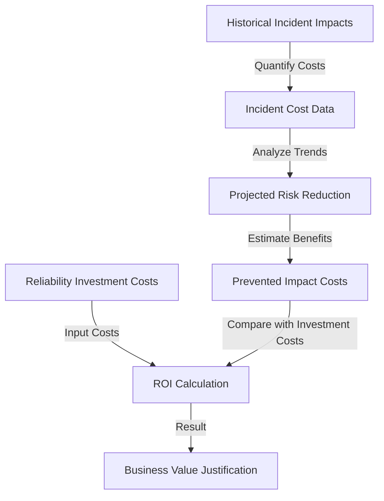
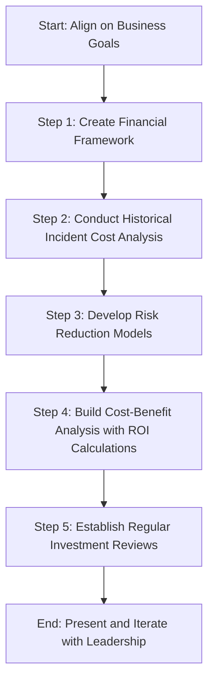
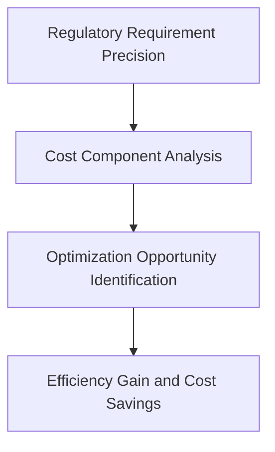
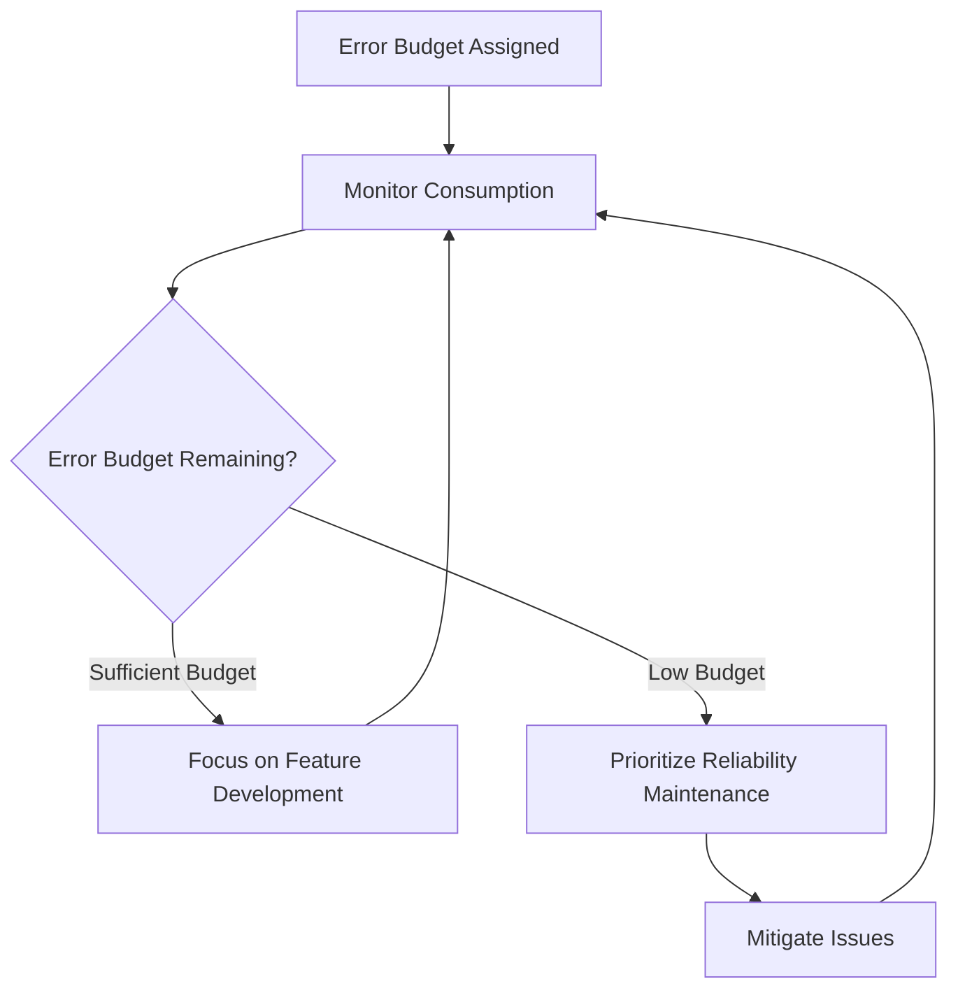
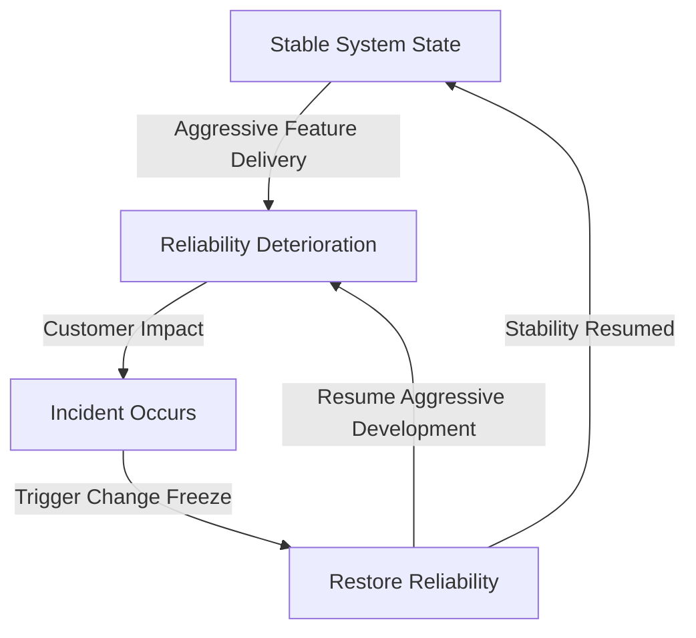

# Chapter 13: Cost of Reliability Engineering

## Chapter Overview: Cost of Reliability Engineering

This chapter finally answers the question your finance team’s been muttering for months: “How much is this reliability thing *actually* costing us?” It moves from hand-wavy technical excuses to crisp, dollar-driven answers. You’ll measure the real business cost of outages, justify reliability investments like a CFO-in-training, find the break-even point before you gold-plate every service to five nines, and even translate reliability metrics into your org’s risk management language. If you want more budget, fewer outages, and less finger-pointing, welcome to the economics class you didn’t know SRE needed.

## Learning Objectives

By the end of this chapter, readers will be able to:

1. Quantify direct and indirect financial impacts of outages with reliability metrics.
2. Justify reliability investments using ROI, payback period, and risk reduction modeling.
3. Build economic models that balance reliability investment against business value.
4. Identify optimization points where marginal cost equals marginal benefit.
5. Integrate reliability metrics into enterprise risk management frameworks.
6. Distinguish mandatory compliance costs from discretionary reliability enhancements.
7. Use error budgets to balance reliability protection with innovation speed.

## Key Takeaways

- **Reliability Isn’t Free—But Neither Is Downtime**: Measure both, or lose the argument.
- **You Can’t Manage What You Don’t Cost Out**: Map incidents to dollars or keep losing the budget battle.
- **Uniform Reliability Standards Are Just Waste Dressed as Consistency**: Not all services deserve five nines.
- **Chasing Five Nines Without Economics Is a Fool’s Errand**: Find the point where investment stops being smart.
- **Risk Management Doesn’t Speak “Latency”**: Translate availability into exposure.
- **Compliance Isn’t a Blank Check for Overengineering**: Spend wisely, not religiously.
- **Innovation Needs a Speed Limit**: Error budgets tell you when to go fast—and when to fix your brakes.

> This isn’t about spending less. It’s about spending *right*. Let’s give your reliability budget the math it deserves.

## Panel 1: The Million Dollar Minute

### Scene Description

The executive review meeting focuses on examining the financial impact metrics resulting from a trading platform outage, emphasizing both direct and indirect costs. At the center of the discussion is a comprehensive impact dashboard, which provides a clear, quantified breakdown of multiple cost dimensions. These include:

- **Lost Transaction Revenue**: Financial losses from halted trades.
- **Compensation Costs**: Payouts to affected clients or partners.
- **Regulatory Penalties**: Fines or sanctions incurred due to non-compliance.
- **Reputation Damage**: Projected financial impact of customer attrition and market trust erosion.

Below is a simplified text-based representation of the dashboard layout, illustrating how these metrics are structured and visually prioritized during the meeting:

```
+------------------------------------------------------+
|                     Impact Dashboard                 |
+-------------------+-------------------+--------------+
| Metric            | Financial Value  | Percentage   |
+-------------------+-------------------+--------------+
| Lost Revenue      | $1,250,000       | 45%          |
| Compensation Costs| $750,000         | 27%          |
| Regulatory Penalty| $500,000         | 18%          |
| Reputation Impact | $300,000         | 10%          |
+-------------------+-------------------+--------------+
| Total Impact      | $2,800,000       | 100%         |
+------------------------------------------------------+
```

This structured visualization ensures that financial values are based on actual measurements, not estimates, allowing executives to immediately grasp the scale and dimensions of the outage's impact. The dashboard underscores the direct link between system reliability and critical business outcomes, particularly in high-stakes environments like trading platforms.

### Teaching Narrative

Financial impact metrics quantify the business consequences of reliability incidents across multiple dimensions: direct losses, operational costs, regulatory penalties, and reputational damage. These comprehensive measurements translate technical failures into business terms that executive leaders understand and value. For trading platforms, where outages during market volatility can have enormous financial consequences, these metrics demonstrate the direct relationship between technical reliability and business outcomes.

### Common Example of the Problem

A bank's trading platform experiences a 47-minute outage during peak market volatility, causing widespread disruption. However, the technology team struggles to quantify the actual business impact. When executives ask about the incident cost, they receive vague estimates mentioning "significant impact" and "customer dissatisfaction" without concrete measurements. This lack of financial quantification creates a disconnect between technical and business leaders, as illustrated in the sequence of events below:

```mermaid
timeline
    title Trading Platform Outage Impact Timeline
    section Outage Incident
    09:03:00 : Outage begins during peak trading hours
    09:10:00 : Initial troubleshooting starts; no root cause identified
    09:30:00 : Escalation to senior engineers; trading remains offline
    09:50:00 : Partial recovery achieved, full service restored
    section Business Consequences
    09:05:00 : Missed high-priority trades; market volatility spikes
    09:20:00 : Customer complaints flood support channels
    09:40:00 : Regulatory monitoring flags potential compliance risks
    10:00:00 : Reputational damage spreads via social media
    section Executive Response
    10:15:00 : Executives request financial impact analysis
    10:30:00 : Technology team provides only vague estimations
    11:00:00 : Disconnect persists; no actionable business insights
```

Without specific metrics translating the technical outage into financial terms, executives cannot properly evaluate reliability investments against other business priorities. When the next budget cycle approaches, reliability initiatives compete unsuccessfully against feature development with clearly articulated revenue projections. As a result, critical infrastructure remains chronically underfunded despite its essential business value.

### SRE Best Practice: Evidence-Based Investigation

Implement comprehensive financial impact measurement to translate reliability incidents into quantifiable business terms. Use the following table to guide your investigation and ensure all dimensions of financial impact are covered:

| **Category** | **Key Metrics** | **Example Metrics** |
| -------------------------------- | ----------------------------------------------------------------------------------------- | ------------------------------------------------------------------------------------------- |
| **Direct Financial Loss** | Quantify the direct monetary impact of outages on revenue and liabilities. | - Lost transaction revenue: $890K<br>- Customer compensation: $350K<br>- Liability exposure |
| **Operational Cost** | Assess costs related to incident response and recovery efforts. | - Incident response costs: $215K<br>- Recovery effort costs<br>- Emergency staffing costs |
| **Regulatory & Compliance** | Measure penalties and costs associated with meeting regulatory obligations post-incident. | - Regulatory penalties: $275K<br>- Reporting obligation costs<br>- Remediation costs |
| **Reputation & Customer Impact** | Evaluate the broader impact on customer trust, brand perception, and long-term retention. | - Customer attrition risk<br>- Social media sentiment<br>- Brand damage valuation |

#### Checklist for Evidence-Based Financial Impact Analysis:

1. **Direct Financial Loss**

   - [ ] Calculate lost transaction revenue.
   - [ ] Measure customer compensation costs.
   - [ ] Quantify liability exposure.
   - [ ] Estimate market opportunity losses.

2. **Operational Costs**

   - [ ] Track incident response costs.
   - [ ] Quantify recovery effort expenses.
   - [ ] Measure opportunity costs of diverted resources.
   - [ ] Assess overtime and emergency staffing costs.

3. **Regulatory and Compliance Impacts**

   - [ ] Identify penalty risks.
   - [ ] Calculate reporting obligation costs.
   - [ ] Measure examination overhead.
   - [ ] Estimate remediation requirements.

4. **Reputation and Customer Impact**

   - [ ] Assess customer attrition risk.
   - [ ] Quantify satisfaction impact.
   - [ ] Measure social media sentiment changes.
   - [ ] Evaluate brand damage.

By systematically applying these metrics and checklist items, organizations can conduct thorough, evidence-based investigations. For example, a 47-minute trading outage resulted in a $1.73M financial impact, equating to over $36K per minute. This included $890K in lost transaction revenue, $350K in customer compensation, $275K in regulatory penalties, and $215K in operational response costs. Such data-driven insights enable leaders to understand the true business implications of reliability incidents.

### Banking Impact

For trading platforms, financial impact quantification directly affects both executive understanding and investment prioritization. Vague impact descriptions create significant business consequences through underinvestment in critical reliability capabilities, misalignment between technical and business priorities, and repeated incidents that could have been prevented with appropriate funding. Every improvement in financial quantification represents better-informed investment decisions, appropriate prioritization of reliability initiatives, and clearer accountability for service quality. Comprehensive metrics ensure that executives understand the true business cost of reliability failures, enabling informed decisions about appropriate investment levels.

### Implementation Guidance

To effectively implement a financial impact framework and connect reliability incidents to business outcomes, follow this step-by-step example based on a trading platform outage case study:

1. **Create a comprehensive financial impact framework with business alignment**

   - Collaborate with finance, compliance, and operations teams to identify all relevant cost categories, such as lost transaction revenue, penalty fees, compensation payouts, and reputational damage.
   - Define clear measurement methodologies for each category, ensuring they align with organizational financial reporting standards.

2. **Implement transaction value measurement for affected services**

   - For trading platforms, calculate the average transaction value during normal operations for each service.
   - Use historical data to determine peak trading periods and expected transaction volumes to assess the outage's potential impact.
   - Example: If Service A facilitates 1,000 trades per minute with an average transaction value of $10,000, then a one-minute outage equates to $10 million in lost transaction revenue.

3. **Develop multiple impact dimension calculations beyond direct losses**

   - Quantify indirect costs such as customer compensation.
   - Include regulatory penalties by referencing similar incidents within the industry.
   - Estimate reputational damage by analyzing customer churn rates or media sentiment shifts post-incident.
   - Example: Following a one-hour outage, customer churn analysis revealed a 5% drop in active users, translating to $500,000 in lost annual revenue.

4. **Build executive dashboards expressing incidents in financial terms**

   - Create visual dashboards that aggregate all cost dimensions into a single view. Include breakdowns for direct losses, operational costs, regulatory penalties, and reputational impact.
   - Use clear financial metrics and charts (e.g., bar graphs for cost categories or trend lines showing recovery time impact).
   - Example: One dashboard panel highlights "Outage Cost by Category," showing $10 million (lost revenue), $500,000 (compensation), $250,000 (penalties), and $500,000 (reputational damage).

5. **Establish regular reviews connecting reliability metrics to business outcomes**

   - Schedule quarterly executive reviews to present updates on reliability metrics and their financial implications.
   - Use these sessions to highlight trends, identify areas for improvement, and demonstrate progress in mitigating reliability risks.
   - Example: A review highlights how implementing proactive monitoring reduced average outage duration by 20%, saving the company $2 million in potential losses over six months.

By applying this structured approach, organizations can meaningfully translate technical reliability data into actionable business insights, fostering alignment between engineering and executive stakeholders.

## Panel 2: The Budget Defender

### Scene Description

The SRE lead presents a metrics-based business case to the finance team, justifying reliability investments by demonstrating risk reduction and impact prevention. The discussion is supported by a cost-benefit analysis comparing reliability investment costs against historical incident impacts and projected risk reduction. Return-on-investment calculations, based on quantified reliability improvements, are central to illustrating the business value.

Below is a conceptual representation of the cost-benefit analysis and ROI calculations:



This diagram illustrates the flow of data and calculations, showing how historical incident impacts and reliability investment costs are used to determine the return on investment. The SRE lead uses these insights to translate technical reliability efforts into measurable financial terms, aligning with the priorities of business leaders.

### Teaching Narrative

Investment justification metrics connect reliability engineering costs to business value through quantifiable risk reduction and impact prevention. These measurements demonstrate the return on reliability investments by comparing historical incident costs with prevention expenses and expected impact reduction. For banking technology investments, these metrics transform reliability from a technical concern to a business investment with measurable returns expressed in financial terms relevant to business leaders.

### Common Example of the Problem

A bank's SRE team proposes critical infrastructure improvements to prevent recurring payment processing incidents, but faces skepticism from finance leaders who perceive reliability investments as technical "nice-to-haves" rather than business necessities. When questioned about the business case, the technical team provides detailed architectural diagrams and technical justifications but struggles to express value in financial terms that would resonate with budget decision-makers. This misalignment results in unfunded improvements and a dangerous cycle of recurring incidents.

#### Problem Summary Table

| Aspect | Example Details |
| --------------------------- | ------------------------------------------------------------------------------- |
| **Recurring Incident** | Payment processing failures causing downtime during peak transaction periods. |
| **Historical Impact** | $1.5M lost revenue annually due to transaction declines and customer churn. |
| **Proposed Investment** | $500K for infrastructure upgrades and monitoring improvements. |
| **Business Case Challenge** | Technical team struggles to quantify financial ROI for finance decision-makers. |
| **Outcome Without Action** | Ongoing incidents repeatedly exceeding the cost of proposed prevention efforts. |

This table highlights the disconnect between technical justifications and financial framing, emphasizing the need for metrics that align reliability improvements with measurable business outcomes. By failing to bridge this gap, the organization perpetuates a cycle where preventable incidents continue to incur costs that far outweigh the proposed investments.

### SRE Best Practice: Evidence-Based Investigation

Implement data-driven investment justification through the following actionable steps:

| **Step** | **Actions** | **Outcome** |
| ----------------------------------- | ----------------------------------------------------------------------- | ------------------------------------------------------------------------------------------- |
| **1. Risk Exposure Quantification** | - Analyze historical incidents and assign financial valuations. | Understand the financial impact of past incidents. |
| | - Model the probability of incident recurrence. | Quantify the likelihood of future failures. |
| | - Calculate the expected annual loss (EAL). | Provide a clear financial risk metric for decision-making. |
| | - Evaluate trends in risk exposure over time. | Identify whether risk is increasing, decreasing, or stable. |
| **2. Investment Return Modeling** | - Calculate potential risk reduction from proposed investments. | Highlight the risk mitigation benefits of the investment. |
| | - Perform cost-benefit analysis, including ROI calculations. | Demonstrate the financial efficiency of the investment. |
| | - Determine the payback period for the investment. | Provide a timeline for when the investment will break even. |
| | - Compare the proposed investment to alternative options. | Ensure the selected investment is the most effective use of resources. |
| **3. Business Value Translation** | - Assess the impact of reliability improvements on customer experience. | Link technical improvements to customer satisfaction and retention. |
| | - Develop metrics showcasing competitive advantages gained. | Show how reliability investments position the business ahead of competitors. |
| | - Quantify regulatory compliance improvements. | Demonstrate alignment with legal and regulatory requirements. |
| | - Identify efficiency gains beyond incident prevention. | Highlight operational benefits such as reduced manual intervention or improved scalability. |

By following this structured approach, SREs can effectively justify reliability investments as strategic business decisions. For example, a proposed $375K infrastructure improvement could mitigate $2.1M in annual expected incident impacts—a 5.6x ROI over 12 months—while also enhancing customer satisfaction and regulatory compliance.

### Banking Impact

For financial institutions, investment justification directly affects both reliability funding and operational stability. Poorly articulated business cases create significant consequences through underinvestment in critical infrastructure, continued exposure to preventable incidents, and misalignment between technical and business priorities.

Consider the example of BankSecure, a mid-sized financial institution that experienced a series of high-severity outages due to underfunded reliability initiatives. In one notable incident, a 6-hour outage in their online banking platform resulted in $1.8 million in direct financial losses, customer churn, and reputational damage. Following this event, the SRE team crafted a business case using metrics that connected reliability investments to business outcomes. They highlighted how a proposed $500,000 investment in automated failover systems and enhanced monitoring could have reduced incident duration to under 10 minutes, preventing 95% of the financial losses.

This case study illustrates how comprehensive and data-driven metrics ensure that business leaders understand reliability investments as essential business expenditures with quantifiable returns. By framing reliability as a mechanism for risk mitigation and cost avoidance, BankSecure successfully secured funding for critical upgrades, aligning technical priorities with business goals and significantly reducing future incident impact.

### Implementation Guidance

#### Step-by-Step Flowchart for Reliability Investment Justification



#### Detailed Steps:

1. **Create Financial Framework for Reliability Investment Justification**\
   Align the framework with organizational goals and ensure it incorporates financial metrics that resonate with business decision-makers, such as ROI, NPV, and payback periods.

2. **Implement Historical Incident Cost Analysis for Baseline Establishment**\
   Analyze past incidents to quantify their financial impact, including downtime costs, lost revenue, and reputational damage. Use this data to establish a baseline for measuring future improvements.

3. **Develop Risk Reduction Modeling for Proposed Investments**\
   Model the potential risk reduction of proposed reliability investments. Include scenarios that estimate the likelihood and impact of avoided incidents based on historical data and system improvements.

4. **Build Cost-Benefit Analysis with Clear ROI Calculations**\
   Compare the costs of proposed reliability investments against the modeled risk reduction benefits. Quantify the financial return by calculating metrics like ROI or cost savings, and ensure these align with business priorities.

5. **Establish Regular Investment Reviews with Business and Finance Leadership**\
   Set up recurring reviews to evaluate the performance of reliability investments, update risk models, and adjust strategies in collaboration with business and finance leaders. Use these sessions to reinforce the alignment between reliability efforts and business value.

By following these steps, organizations can create a structured approach to justifying and optimizing reliability investments in terms that resonate with both technical and financial stakeholders.

## Panel 3: The Reliability Economics Model

### Scene Description

Business and technical leaders are reviewing a comprehensive framework designed to measure reliability costs versus benefits across different banking services. The visual showcases a sophisticated economic model that balances key components:

- **Investment Costs**: Engineering effort, infrastructure expenses, and velocity trade-offs.
- **Operational Expenses**: Ongoing costs to maintain and improve reliability.
- **Business Value**: Prevented losses, enhanced customer satisfaction, and competitive advantage.
- **Service Criticality Tiers**: Categorization of services based on their importance to the business.

The model highlights optimization points tailored to various banking functions, ensuring reliability investments align with actual business impact and value.

#### Text Diagram: Reliability Economics Model Overview

```
+------------------------+
|  Investment Costs      | ---> Balances ----+
|  (Engineering/Infra)   |                   |
+------------------------+                   |
                                             | 
+------------------------+                   |
|  Operational Expenses  | ---> Balances ----+---> Optimization Points
|  (Maintenance/Improvement)                |      (Banking Functions)
+------------------------+                   |
                                             | 
+------------------------+                   |
|  Business Value        | ---> Balances ----+
|  (Loss Prevention, CX) |
+------------------------+

Service Criticality Tiers (Across All Components)
```

### Teaching Narrative

Economic modeling metrics provide structured analysis of reliability trade-offs through comprehensive cost-benefit measurement. These models quantify both the costs of achieving reliability (engineering effort, infrastructure, velocity impact) and the benefits (prevented losses, customer satisfaction, competitive advantage), enabling optimized investment decisions. For financial institutions, these metrics ensure appropriate reliability investment across different services based on their actual business impact and value.

### Common Example of the Problem

A bank applies uniform reliability standards across all digital services, mandating 99.99% availability regardless of service function or business value. This one-size-fits-all approach creates significant inefficiency: critical payment services receive insufficient investment relative to their business importance, while informational services consume disproportionate resources to maintain unnecessarily high reliability levels. Without comprehensive economic modeling that balances costs and benefits, the organization cannot determine appropriate reliability targets for different services. This misalignment creates both overengineering waste for lower-value services and underinvestment risk for critical functions—fundamentally a resource allocation problem arising from treating all services with equal reliability requirements regardless of their business value.

#### Comparative Table: Reliability Levels, Costs, and Business Impacts

| Service Type | Target Reliability Level | Estimated Annual Cost | Business Impact of Downtime |
| -------------------------- | ------------------------ | --------------------- | ----------------------------------------------------------------- |
| **Critical Services** | 99.99% | High | Severe: Direct revenue loss, customer churn, reputational damage. |
| **Non-Critical Services** | 99.9% | Moderate | Minor: Minimal customer impact, low operational disruption. |
| **Informational Services** | 99.5% | Low | Negligible: No direct revenue impact, limited user impact. |

This table illustrates the problem: applying 99.99% availability to all services unnecessarily increases costs for non-critical and informational services, where the business impact of downtime is minimal. Conversely, failing to allocate sufficient resources to critical services—where downtime has severe consequences—risks significant financial and reputational harm. A systematic reliability economics model is essential to align reliability targets with the specific business value and impact of each service, ensuring efficient and effective resource allocation.

### SRE Best Practice: Evidence-Based Investigation

Implement comprehensive reliability economics framework with the following actionable checklist:

#### **Checklist for Evidence-Based Investigation**

1. **Service Criticality Differentiation**

   - [ ] Classify services by business impact.
   - [ ] Define value-tiered reliability requirements for each service type.
   - [ ] Rank services based on customer experience significance.
   - [ ] Categorize services by regulatory importance.

2. **Cost Modeling Dimensions**

   - [ ] Quantify engineering effort required for each reliability level.
   - [ ] Scale infrastructure costs across service tiers.
   - [ ] Measure the impact of reliability on innovation velocity.
   - [ ] Assess operational support requirements by reliability tier.

3. **Benefit Valuation Framework**

   - [ ] Quantify incident prevention value for each service tier.
   - [ ] Define metrics for customer satisfaction contribution.
   - [ ] Evaluate competitive positioning benefits of reliability improvements.
   - [ ] Value compliance assurance for services with regulatory dependencies.

4. **Optimization Modeling**

   - [ ] Conduct marginal cost analysis across reliability levels.
   - [ ] Identify points of diminishing returns for further reliability investment.
   - [ ] Determine optimal investment points for each service tier.
   - [ ] Develop data-driven resource allocation recommendations.

#### **Example Output from Economic Modeling**

- **Payment Services**: Achieve 99.99% reliability with $8.7M annual value against $1.2M implementation cost.
- **Informational Services**: Optimal at 99.9% reliability, with diminishing returns beyond this point.

This structured checklist enables SRE teams to methodically apply reliability economics, ensuring that investment decisions are aligned with service criticality, cost efficiency, and business value optimization.

### Banking Impact

For digital banking services, economic optimization is akin to determining the right level of insurance coverage for a portfolio of assets. Just as over-insuring low-value items wastes money and under-insuring critical assets exposes them to catastrophic losses, applying uniform reliability standards across banking services leads to significant business inefficiencies. Misaligned investments can result in wasted resources on non-critical services or insufficient protection for functions that are vital to the business.

Each improvement in economic modeling is like refining an insurance policy to ensure coverage matches the actual value and risk of each asset. This enables better resource allocation, tailoring reliability to the true importance of each service, and ensuring limited engineering and infrastructure efforts are used efficiently. By leveraging comprehensive metrics, financial institutions can prioritize reliability investments based on actual business impact, avoiding wasteful overengineering while providing optimized protection where it matters most.

### Implementation Guidance

1. Create comprehensive service classification framework based on business impact
2. Implement cost modeling for different reliability levels
3. Develop benefit valuation tailored to service criticality
4. Build optimization analysis identifying appropriate reliability targets
5. Establish regular economic reviews ensuring continued alignment with business priorities

## Panel 4: The Optimization Point

### Scene Description

The team is analyzing metrics to identify the optimal reliability investment level, where the marginal cost equals the marginal benefit for the payment processing system. Below is a text-based representation of the visual concept, illustrating the relationship between additional reliability investment and the resulting business returns:

```
Marginal Cost Curve (y-axis: Costs/Benefits, x-axis: Investment Level)

  Benefit
    |\
    | \
    |  \
    |   \
    |    \------------------> Diminishing Returns
    |     \
    |      \
    |       \
    |        \
    |         \
    |___________\_________________ Investment
                      ^
                      |
               Optimal Point
```

At the optimal point, the graph highlights where additional spending begins to yield reduced value. This visualization underscores the principle of balancing investments to avoid both under-investment, which leaves unacceptable risks, and over-investment, which wastes resources without proportional benefits.

### Teaching Narrative

Optimization metrics identify the point of diminishing returns for reliability investments through marginal cost-benefit analysis. These measurements track the incremental cost of achieving each reliability improvement against the incremental benefit, identifying where additional investment produces less value than cost. For banking services, these metrics prevent both under-investment that leaves unacceptable risks and over-investment that consumes resources without proportional benefit.

### Common Example of the Problem

A bank's payments team faces persistent pressure to increase system reliability from its current 99.95% to "five nines" (99.999%), requiring substantial additional investment in infrastructure, engineering resources, and operational support. Technical leaders question whether this investment produces appropriate business returns, but lack the metrics to determine the optimal reliability target. Without marginal analysis that compares incremental costs against incremental benefits at different reliability levels, the organization cannot identify the point where additional investment produces diminishing returns. This optimization gap creates risk of either stopping investment too early (leaving preventable risks) or continuing investment too far (consuming resources that would produce more value elsewhere).

Below is a summarized table showing the relationship between reliability levels, estimated costs, and corresponding business impact to illustrate the challenge:

| Reliability Level | Estimated Annual Cost | Incremental Cost vs. Previous Level | Business Impact (Estimated Annual Loss Avoidance) |
| ----------------- | --------------------- | ----------------------------------- | ------------------------------------------------- |
| 99.95% | $1M | - | $10M |
| 99.97% | $1.5M | $0.5M | $12M |
| 99.99% | $3M | $1.5M | $13M |
| 99.995% | $6M | $3M | $13.5M |
| 99.999% | $12M | $6M | $13.7M |

This table highlights how costs increase disproportionately as reliability approaches "five nines," while the additional business benefit diminishes. Such marginal analysis underscores the importance of identifying the optimization point where further investment ceases to yield proportional returns.

### SRE Best Practice: Evidence-Based Investigation

Implement marginal cost-benefit analysis by following this structured checklist:

| **Step** | **Key Activities** | **Outcome** |
| -------------------------------------------- | ----------------------------------------------------------------------------------------------------- | ------------------------------------------------------------- |
| **1. Incremental Cost Quantification** | | |
| - Create reliability increment cost modeling | Analyze engineering requirements for reliability levels (e.g., 99.9% → 99.95%, 99.95% → 99.99%, etc.) | Understand cost differences between reliability tiers. |
| - Measure engineering effort | Quantify time and resources needed for incremental improvements. | Identify resource allocation for each improvement. |
| - Assess operational costs | Evaluate ongoing operational expenses at each reliability increment. | Map operational expenditure to reliability levels. |
| - Quantify velocity impact | Analyze how reliability investments impact feature delivery speed. | Balance reliability goals with development velocity. |
| **2. Incremental Benefit Valuation** | | |
| - Predict incident reduction | Estimate the number of incidents mitigated by each reliability increment. | Calculate direct operational benefits. |
| - Assess customer satisfaction | Measure improvements in user experience or satisfaction metrics. | Identify customer impact at varying reliability tiers. |
| - Evaluate competitive advantage | Quantify market differentiation or revenue growth tied to improved reliability. | Understand strategic value from reliability investments. |
| - Quantify compliance value | Assess risk mitigation or regulatory benefits tied to higher reliability. | Ensure alignment with legal and compliance requirements. |
| **3. Marginal Analysis Modeling** | | |
| - Calculate cost-benefit ratios | Compare incremental costs to incremental benefits for each reliability level. | Identify the efficiency of investments at each tier. |
| - Identify diminishing returns | Detect points where additional investments yield decreasing marginal benefits. | Highlight thresholds where investment becomes less effective. |
| - Determine optimal stopping point | Calculate the economic breakpoint where marginal costs equal marginal benefits. | Pinpoint the most cost-effective reliability target. |
| - Build investment recommendations | Develop actionable investment strategies supported by data-driven metrics. | Enable informed decision-making for reliability investments. |

#### Practical Example: Marginal Analysis in Action

Marginal analysis reveals that the economically optimal reliability target for the payment system is 99.97%. At this point:

- Each additional $1M investment prevents $3.2M in business impact.
- Investments beyond 99.97% show diminishing returns, with exponentially increasing costs and linearly decreasing benefits.

This structured approach ensures reliability targets are data-driven, balancing costs, benefits, and business impact to achieve optimal outcomes.

### Banking Impact

For financial services, identifying the optimization point directly impacts both reliability effectiveness and resource efficiency. Arbitrary reliability targets can lead to significant business consequences, either by leaving critical systems under-protected or by wasting resources that could be better utilized elsewhere.

To illustrate, consider reliability investment as akin to purchasing insurance for a bank's operations. If a bank under-insures, it risks catastrophic losses during unforeseen events, just as under-investment in reliability could lead to system outages and reputational damage. Conversely, over-insuring results in excessive premiums without proportional benefit—mirroring how over-investment in reliability can drain resources without meaningful improvements.

Every improvement in optimization analysis is like refining an insurance policy to balance cost with adequate coverage. This ensures resources are allocated effectively, reliability targets align with economic realities, and the organization achieves maximum value from its technology investments. Comprehensive metrics, much like actuarial assessments in insurance, ensure that decisions are data-driven, avoiding both under-protection and unnecessary expenditure while maximizing overall business value.

### Implementation Guidance

Follow this step-by-step checklist to identify and implement the optimal reliability investment point:

#### Step 1: Model Costs

- Identify all potential reliability improvements.
- Create detailed cost models for each reliability increment.
- Include both direct and indirect costs (e.g., infrastructure, staffing, downtime impacts).

#### Step 2: Evaluate Benefits

- Quantify the business value of improved reliability at different levels.
- Consider metrics such as transaction success rates, customer satisfaction, and regulatory compliance.
- Assign monetary value to these benefits where possible.

#### Step 3: Conduct Marginal Analysis

- Calculate the incremental cost for each reliability improvement step.
- Measure the incremental business benefit for corresponding steps.
- Identify the point where costs begin to outweigh benefits (diminishing returns).

#### Step 4: Visualize Optimization

- Build a visualization that plots:
  - Marginal cost versus marginal benefit.
  - Optimal investment point where marginal cost equals marginal benefit.
- Use this visualization to communicate findings with stakeholders.

#### Step 5: Establish Review Process

- Schedule regular reviews to reassess cost and benefit models.
- Adjust for changes in business needs, operational conditions, or external factors.
- Ensure ongoing alignment with organizational economic goals.

## Panel 5: The Risk Management Integration

### Scene Description

Enterprise risk and SRE teams aligning reliability metrics with organizational risk management framework for financial services. The integration is depicted through a shared assessment methodology, consistent risk categorization, and unified reporting structure across both domains.

To illustrate this integration, consider the following text-based diagram:

```
[Traditional Risk Management Processes]
                |
                v
[Shared Assessment Methodology]
                |
                v
[Unified Risk Categorization]
                |
                v
[Unified Reporting Structure]
                |
                v
[Reliability Engineering Metrics]
```

This flow represents the bidirectional connection between traditional enterprise risk processes and SRE reliability metrics. By aligning these components, financial institutions achieve consistent risk assessment and prioritization across all threat types within a unified framework.

### Teaching Narrative

Integrated risk metrics connect reliability engineering to enterprise risk management through shared measurement frameworks. These unified metrics express technical reliability in terms compatible with organizational risk models, creating consistent risk assessment across all threat types. For financial institutions, this integration ensures appropriate prioritization of technology risks relative to other enterprise risks within a consistent, comprehensive framework.

### Common Example of the Problem

A bank maintains separate risk measurement approaches between technology reliability and enterprise risk management. SRE teams quantify technical risks using availability percentages, error budgets, and mean time metrics, while the enterprise risk function uses likelihood and impact scales with financial thresholds. This measurement disconnect creates significant challenges during risk prioritization: senior leadership cannot directly compare a 99.9% vs. 99.99% reliability difference against credit default risk or market exposure because the measurements use fundamentally different frameworks. Without integrated metrics that create common terminology and compatible assessment approaches, technology reliability risks remain poorly understood and frequently misaligned in enterprise risk prioritization, potentially leaving critical exposures inadequately addressed.

| Aspect | SRE Metrics | Enterprise Risk Metrics | Resulting Gap |
| ---------------------------- | --------------------------------------------------------------------------- | ------------------------------------------------------------------- | --------------------------------------------------------------------------------------- |
| **Measurement Basis** | Technical reliability (e.g., availability percentages, error budgets, MTTR) | Risk likelihood and impact scales with financial thresholds | No direct correlation between technical reliability and financial/business risk impacts |
| **Terminology** | Engineering-focused (e.g., "five nines availability") | Risk-focused (e.g., "High likelihood, $10M impact") | Lack of common language for senior leadership to interpret risks |
| **Prioritization Framework** | Error budget consumption, incident trends | Financial exposure, compliance, and operational risk prioritization | Misaligned risk prioritization due to incompatible frameworks |
| **Reporting Structure** | System-specific dashboards and metrics | Enterprise-wide risk registers and reports | Disjointed reporting prevents unified risk visibility |

This table highlights the disparity between the two approaches, emphasizing how the lack of integration leads to miscommunication, misalignment, and potential underestimation of critical technology reliability risks in the broader enterprise risk context.

### SRE Best Practice: Evidence-Based Investigation

Implement an integrated risk measurement framework by following this actionable checklist:

#### 1. Unified Assessment Methodology

- [ ] Define a common impact categorization:
  - [ ] Measure financial impacts (e.g., revenue loss, fines).
  - [ ] Assess customer experience consequences (e.g., downtime effects).
  - [ ] Identify regulatory compliance implications.
  - [ ] Evaluate potential reputational damage.
- [ ] Establish shared likelihood evaluation scales for risk scenarios.
- [ ] Develop a consistent risk quantification approach (e.g., combining likelihood and impact).
- [ ] Build an integrated risk register that spans both SRE and enterprise domains.

#### 2. Reliability Risk Translation

- [ ] Translate availability metrics into enterprise risk terms (e.g., map availability percentages to financial exposure).
- [ ] Map incident impacts to predefined enterprise risk categories.
- [ ] Express technical debt in organizational risk language.
- [ ] Integrate resilience measurements into the enterprise risk framework.

#### 3. Comprehensive Reporting Integration

- [ ] Create unified dashboards to display risk metrics across teams.
- [ ] Implement consistent measurement of risk trends over time.
- [ ] Develop shared risk acceptance processes for cross-domain alignment.
- [ ] Track mitigation efforts across both SRE and organizational initiatives.

#### Example Insight:

Use integrated risk metrics to guide prioritization. For instance:

- A 99.9% availability target for payment processing equates to an annual expected financial loss of $7.2M. This risk level surpasses certain credit risk factors with stringent controls.
- Such insights justify elevating reliability investment within the enterprise risk management strategy, ensuring alignment with overall organizational priorities.

### Banking Impact

For financial institutions, risk integration can be likened to translating between two languages: the technical language of reliability engineering and the financial language of enterprise risk management. Just as a skilled translator ensures that meaning is preserved across languages, unified metrics enable seamless communication between these domains. When these "translations" are clear and consistent, organizations avoid the pitfalls of misaligned priorities, resource misallocation, and overlooked risks.

Disconnected risk approaches are like having multiple interpreters providing conflicting translations—introducing confusion and blind spots that can lead to significant business consequences. By integrating risk metrics, financial institutions achieve a shared "vocabulary" that supports consistent evaluation across domains. This ensures that reliability risks are prioritized appropriately based on actual business impact, aligning with the organization's overall risk appetite. The result is a more balanced and comprehensive approach to protecting the institution against all risk types, fostering stronger alignment and resilience across the enterprise.

### Implementation Guidance

1. Create common risk assessment framework spanning all domains
2. Implement translation mechanisms for technical metrics to risk language
3. Develop integrated risk dashboards with consistent measurements
4. Build unified risk acceptance and mitigation processes
5. Establish regular cross-functional reviews ensuring comprehensive risk management

## Panel 6: The Compliance Cost Metrics

### Scene Description

The team is focused on analyzing regulatory compliance costs related to reliability requirements and identifying optimization opportunities. The scene visually breaks down the component analysis of compliance-driven reliability costs into two key categories:

- **Mandatory Regulatory Minimums**: The baseline reliability requirements mandated by regulations.
- **Discretionary Enhancements**: Additional reliability measures implemented beyond the mandated minimums for operational or strategic reasons.

The visual representation includes a flow diagram illustrating the relationship between these components and the optimization process. Below is a text-based diagram representing this analysis:

```
[Regulatory Requirements]
          |
          v
[Mandatory Regulatory Minimums] --> [Compliance Costs]
          |
          v
[Discretionary Enhancements] --> [Optimization Opportunities]
```

This structured breakdown highlights areas where efficiency improvements can be made while maintaining regulatory compliance. The visual aids guide the team in distinguishing between required expenditures and potential optimizations, ensuring clarity in cost allocation and decision-making.

### Teaching Narrative

Compliance cost metrics measure the specific reliability expenses driven by regulatory requirements rather than customer expectations or business needs. These specialized measurements identify where compliance obligations impose reliability requirements beyond business optimization points, enabling appropriate cost allocation and focused optimization. For highly regulated banking functions, these metrics ensure efficient compliance while preventing unnecessary over-engineering beyond regulatory requirements.

### Common Example of the Problem

A bank implements enhanced disaster recovery capabilities across all systems, creating significant infrastructure and operational costs. The compliance team insists these measures are regulatory requirements, while business leaders question whether the implementation exceeds actual obligations. Without clear metrics differentiating between mandatory compliance requirements and discretionary enhancements, the organization cannot determine appropriate investment levels or identify optimization opportunities. This compliance opacity creates organizational tension and potential waste as regulatory requirements become a blanket justification for any reliability enhancement regardless of actual obligation levels or implementation efficiency.

#### Key Issues Summary

| **Category** | **Description** |
| ------------------------------- | --------------------------------------------------------------------------------------------------- |
| **Mandatory vs. Discretionary** | Lack of clarity on which reliability costs are required by regulation versus optional enhancements. |
| **Absence of Metrics** | No clear framework to measure and differentiate compliance-driven costs from business-driven costs. |
| **Organizational Tension** | Disputes between compliance teams (focused on regulations) and business leaders (focused on costs). |
| **Potential Waste** | Over-engineering driven by unclear compliance scope leads to unnecessary expenses and inefficiency. |

#### Checklist for Addressing the Problem

- [ ] Identify all regulatory requirements explicitly tied to reliability improvements.
- [ ] Separate mandatory compliance costs from discretionary enhancements.
- [ ] Develop metrics to track and evaluate compliance-driven reliability expenses.
- [ ] Foster cross-team collaboration to align compliance obligations with business goals.
- [ ] Regularly review and optimize implemented measures to mitigate over-engineering risks.

### SRE Best Practice: Evidence-Based Investigation

Implement compliance cost differentiation:

#### Steps Overview



#### Detailed Process

| Step | Key Actions | Example Outcome |
| ------------------------------------------- | --------------------------------------------------------------------------------------------------------------------------------------------------------------------------------------------- | --------------------------------------------------------------------------------------------------------------- |
| **Regulatory Requirement Precision** | - Identify specific obligations by regulation<br>- Determine minimum compliance thresholds<br>- Develop interpretation documentation<br>- Trace requirements to regulatory language | Clear mapping of geographic redundancy requirement for core banking systems to specific regulatory clauses |
| **Cost Component Analysis** | - Segment mandatory vs. discretionary costs<br>- Isolate compliance-driven expenses<br>- Assess implementation efficiency<br>- Evaluate alternative approaches | Identification of excessive redundancy costs—current implementation costs 3.7x more than compliant alternatives |
| **Optimization Opportunity Identification** | - Measure compliance-maintaining efficiency improvements<br>- Quantify cost reductions by component<br>- Assess risk-based compliance approaches<br>- Prioritize optimization recommendations | Highlighted $2.3M annual savings opportunity with alternative redundancy setups that meet full compliance |

Comprehensive compliance analysis transforms the regulatory reliability approach, enabling teams to uncover significant cost-saving opportunities while adhering to all regulations. For example, geographic redundancy for core banking systems can be re-engineered to achieve compliance at a fraction of the current cost, aligning reliability with regulatory requirements without over-engineering.

### Banking Impact

For regulated financial services, compliance optimization directly affects both regulatory standing and operational efficiency. Undifferentiated compliance approaches create significant business consequences through unnecessary costs, excessive implementation complexity, and resources diverted from other priorities. Every improvement in compliance cost analysis represents more efficient regulatory satisfaction, appropriate resource allocation to mandatory requirements, and better alignment between compliance needs and business operations. Precise metrics ensure that regulatory requirements are satisfied efficiently rather than used as unlimited justification for reliability enhancements regardless of actual obligation or cost-effectiveness.

### Implementation Guidance

To effectively implement compliance cost metrics, follow this checklist:

- [ ] **Create Comprehensive Regulatory Mapping**\
  Identify and document specific regulatory requirements that impact reliability obligations.

- [ ] **Conduct Detailed Cost Analysis**\
  Analyze the costs associated with compliance-driven components to quantify their impact.

- [ ] **Evaluate Alternative Approaches**\
  Assess different methods or strategies to achieve required outcomes while balancing efficiency and compliance.

- [ ] **Develop an Optimization Roadmap**\
  Plan and prioritize initiatives to improve efficiency while maintaining full compliance.

- [ ] **Establish Regular Compliance Reviews**\
  Schedule periodic reviews involving both regulatory and business stakeholders to ensure ongoing alignment and identify new optimization opportunities.

## Panel 7: The Innovation Balance

### Scene Description

Product and operations teams collaborate using error budget metrics to balance reliability maintenance with feature development velocity. A visual framework helps clarify the practical implementation of error budgets, showcasing how remaining error budgets guide decision-making.

The following diagram illustrates the key components of this process:



This flow demonstrates how teams use error budgets to dynamically adjust priorities: when there is sufficient error budget remaining, teams prioritize feature innovation; when budgets are running low, reliability improvement becomes the focus. This approach replaces subjective risk assessments with data-driven decisions, ensuring a calculated balance between innovation speed and reliability protection.

### Teaching Narrative

Innovation balance metrics quantify the relationship between reliability maintenance and feature development through error budget measurement. These metrics transform reliability from an absolute requirement to a managed resource that can be strategically invested in either maintenance or innovation based on current consumption and business priorities. For banking products, these measurements enable calculated risk-taking that balances competitive innovation with appropriate reliability for different service types.

### Common Example of the Problem

A bank's mobile application team faces recurring tension between reliability protection and feature development velocity. During periods of stability, aggressive feature delivery creates reliability deterioration that eventually triggers customer impact. This leads to extended change freezes while reliability is restored, followed by another cycle of aggressive development until the next incident occurs. Without quantitative error budget metrics defining acceptable reliability thresholds and remaining margin, these decisions remain subjective and inconsistent, creating an inefficient cycle of overreaching followed by overcorrection. This volatility damages both reliability (through periodic degradation) and innovation (through extended freezes), preventing optimal balance between these competing priorities.

#### Problem Cycle Flowchart



The flowchart illustrates the repetitive cycle: stability enables aggressive feature development, leading to reliability degradation and customer impact. This prompts an incident, followed by a change freeze to restore reliability. Once stability is regained, the cycle repeats without clear boundaries, perpetuating inefficiency and imbalance.

### SRE Best Practice: Evidence-Based Investigation

Implement error budget framework for innovation balance by following these structured practices:

| **Category** | **Action** | **Example/Details** |
| --------------------------------------- | ----------------------------------------------------------------------------------------------- | --------------------------------------------------------------------------- |
| **Quantitative Reliability Management** | | |
| - Service-Level Objectives (SLOs) | Define SLOs tailored to service needs. | E.g., 99.9% availability for critical banking services. |
| - Error Budget Calculation | Implement methodology to calculate error budgets. | Budget = (1 - SLO target) * total time. |
| - Consumption Tracking | Develop tracking systems to monitor budget usage trends. | Use tools like monitoring dashboards or logs. |
| - Budget Visualization | Create real-time dashboards to show remaining error budget. | E.g., "73% of monthly budget remaining." |
| **Risk-Based Development Guidance** | | |
| - Deployment Strategies | Design phased deployment approaches based on current budget status. | Canary releases for high-risk changes when budget is low. |
| - Change Risk Assessment | Assess risk levels for each change and estimate budget impact. | Use scoring or modeling tools to predict reliability impact. |
| - Approval Thresholds | Adjust approval processes dynamically based on remaining error budget. | High-risk changes need tighter reviews when budget is \<50%. |
| - Automated Deployment Guidance | Build tools to provide automated suggestions for deployment decisions. | Integrate CI/CD pipelines with error budget checks. |
| **Dynamic Priority Balancing** | | |
| - Trade-Off Visualizations | Create visual tools to illustrate the balance between reliability and velocity. | Use graphs showing error budget consumption vs. feature delivery rate. |
| - Business Priority Alignment | Allocate error budgets based on business-critical priorities. | Prioritize critical services for reliability, non-critical for innovation. |
| - Cycle Time Optimization | Adjust processes to maintain a consistent balance between delivery speed and reliability needs. | E.g., increase sprint focus on reliability tasks during low budget periods. |
| - Strategic Budget Investment | Plan proactive investments in reliability or innovation based on business strategy. | Scale reliability tasks during high-demand periods (e.g., holidays). |

#### Example Application: Error Budget Utilization

Error budget metrics transform the reliability-innovation balance from subjective to objective. For instance, with **73% of the monthly error budget remaining**, the team can confidently proceed with **moderately risky feature deployments**, while monitoring consumption trends to ensure reliability remains within acceptable thresholds. This evidence-based approach enables strategic, data-driven decision-making to maintain service quality and accelerate innovation.

### Banking Impact

For digital banking products, innovation balance directly affects both reliability stability and competitive positioning. Subjective risk approaches create significant business consequences through oscillating reliability levels, inconsistent innovation velocity, and inefficient engineering cycles responding to self-created crises. Every improvement in balance metrics represents more consistent reliability within acceptable thresholds, appropriate feature velocity aligned with business priorities, and more efficient use of engineering resources across both reliability and innovation objectives.

A real-world example of successful error budget implementation can be seen in a major global bank's mobile banking app. Faced with increasing competition from fintech startups, the bank adopted error budgets to manage the trade-off between rapid feature development and system reliability. By setting clear error budget thresholds, the engineering teams were able to prioritize efforts based on measured reliability trends. For instance, when the error budget reached critical consumption levels during the rollout of a new payment feature, the teams temporarily paused further feature releases. They redirected efforts toward addressing the underlying reliability issues, ensuring the platform remained stable for millions of users. Once the error budget recovered to safe levels, development resumed at full velocity, enabling the bank to stay competitive without compromising reliability. This approach not only enhanced customer trust but also optimized engineering resource allocation, demonstrating how quantitative frameworks can drive strategic trade-offs in banking innovation.

### Implementation Guidance

To effectively implement error budgets and achieve the innovation balance, follow these structured steps:

#### Step-by-Step Process

```mermaid
graph TD
    A[Define SLOs] --> B[Calculate Error Budgets]
    B --> C[Track Budget Consumption]
    C --> D[Develop Risk-Based Deployment Framework]
    D --> E[Build Visualization Tools]
    E --> F[Establish Regular Reviews]

    subgraph Step 1: Define SLOs
        A1[Identify critical service types]
        A2[Set service-level objectives (SLOs) for availability and performance]
        A --> A1 --> A2
    end

    subgraph Step 2: Calculate Error Budgets
        B1[Determine allowable downtime or errors for each SLO]
        B2[Create tracking mechanisms for budget consumption]
        B --> B1 --> B2
    end

    subgraph Step 3: Track Budget Consumption
        C1[Integrate error tracking into monitoring systems]
        C2[Visualize consumption trends over time]
        C --> C1 --> C2
    end

    subgraph Step 4: Develop Risk-Based Deployment Framework
        D1[Define deployment criteria based on remaining error budget]
        D2[Prioritize updates and fixes with calculated risk tolerance]
        D --> D1 --> D2
    end

    subgraph Step 5: Build Visualization Tools
        E1[Create dashboards for reliability and innovation metrics]
        E2[Enable real-time insights into error budget usage]
        E --> E1 --> E2
    end

    subgraph Step 6: Establish Regular Reviews
        F1[Conduct periodic reviews of error budget consumption]
        F2[Align adjustments with business priorities and goals]
        F --> F1 --> F2
    end
```

Each step builds on the previous one to ensure a systematic approach to balancing reliability and innovation. This workflow provides a clear, actionable path for teams responsible for implementing error budgets effectively.
