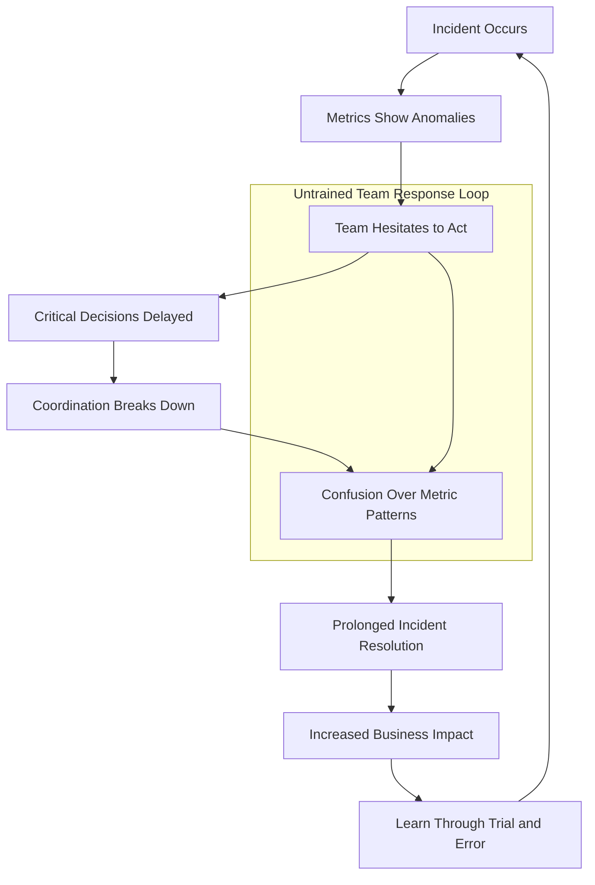
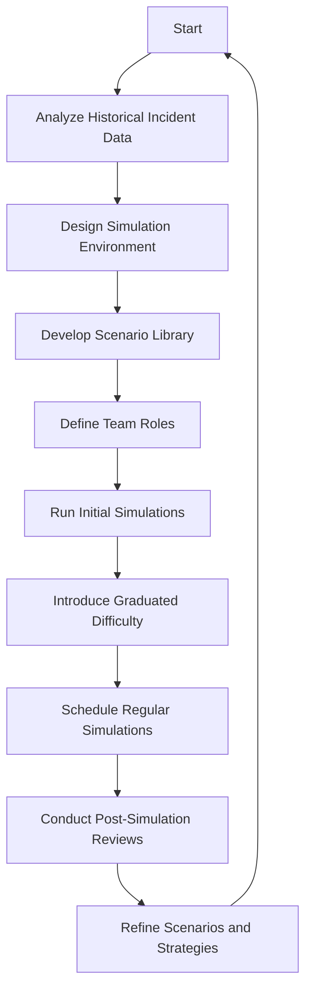
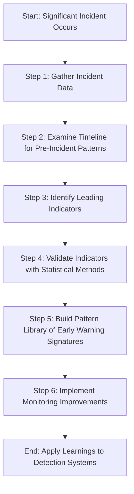
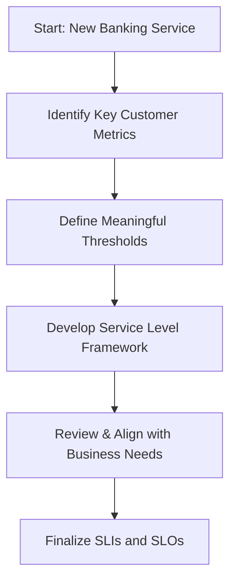
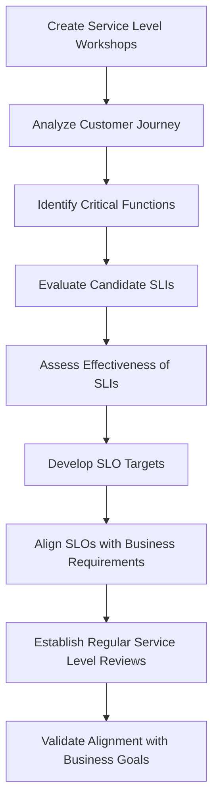
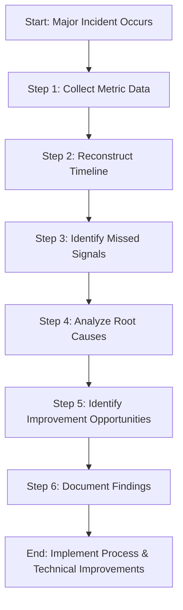

# Chapter 14: Limited Hands-on Exercises

## Chapter Overview: Organizational Adoption of Metrics

This chapter is the part where the metrics leave the dashboard and crash headfirst into your org chart. Metrics don’t work unless people use them—and people won’t use them unless they trust them, understand them, and see them make their lives better. This is where process, politics, and practicality meet precision. You’ll learn how to build adoption muscle across teams, avoid metrics theater, and scale observability culture from a few nerds with Grafana to an entire company that actually cares.

______________________________________________________________________

## Learning Objectives

By the end of this chapter, readers will be able to:

1. Promote cross-team trust and understanding of shared metrics.
2. Avoid metrics misuse and “observability theater.”
3. Establish feedback loops that make metrics actionable.
4. Integrate metrics into workflows across engineering, product, and operations.
5. Scale observability practices without creating overhead paralysis.
6. Drive executive alignment with business-focused dashboards.
7. Foster a metrics-driven culture that values outcomes over dashboards.

______________________________________________________________________

## Key Takeaways

- **Metrics That Aren’t Used Are Just Pretty Lies**: Adoption matters more than fidelity.
- **Observability Theater Is Real—and Loud**: Dashboards aren’t proof of insight.
- **No Trust, No Traction**: If your teams don’t believe the numbers, they won’t act on them.
- **If It Doesn’t Drive Action, It’s Not a Metric—It’s Decoration**: Insight demands impact.
- **The Goal Isn’t Dashboards—It’s Decisions**: Metrics should reduce friction, not just scroll beautifully on a TV.
- **Executive Buy-in Requires Translation, Not Telemetry**: Show them value, not verbosity.
- **Culture Eats Telemetry for Breakfast**: You’re building behavior, not just exporting time series.

> This is the part where metrics get social. Handle with care—and a plan.

______________________________________________________________________

## Panel 1: The Metric Detective

### Scene Description

The scene depicts a collaborative diagnostic exercise where a Senior SRE mentors a junior engineer in identifying subtle metric patterns that indicate emerging issues. A structured dashboard comparison is central to the exercise, showcasing two panels side-by-side: one representing normal metric behavior and the other highlighting problematic patterns. The mentor guides the junior engineer through a step-by-step analysis, emphasizing key differences and teaching pattern recognition techniques.

Below is a conceptual representation of the dashboard comparison:

```
Normal Metrics          | Problematic Metrics
------------------------|------------------------
Stable response times   | Spiking response times
Low error rates         | Gradual increase in error rates
Consistent throughput   | Throughput dips over time
Healthy latency trends  | Latency spikes intermittently
```

This side-by-side approach helps the junior engineer visually correlate the subtle indicators of a potential issue with their impact on system performance. The mentor reinforces the importance of early identification and proactive intervention to prevent customer-impacting failures, particularly in critical systems like payment processing.

### Teaching Narrative

Pattern recognition metrics develop diagnostic skills by highlighting the subtle measurement indicators that precede major incidents. These exercises train engineers to identify emerging issues from metric patterns before they become customer-impacting failures. For banking reliability engineers, pattern recognition skills enable proactive intervention based on early warning metrics, preventing potential outages before they affect critical financial services.

### Common Example of the Problem

A production support engineer transitioning to an SRE role faces a significant diagnostic challenge during their on-call rotation. System dashboards show subtle anomalies in payment processing: slightly elevated latency in the 95th percentile, minor increases in database connection acquisition times, and intermittent spikes in queue depths—all individually within acceptable thresholds. The engineer examines each metric independently, concluding that no action is needed since no single measurement exceeds alert thresholds.

The timeline below illustrates how these metrics evolved and interacted over time, leading to a major outage:

```mermaid
timeline
    title Metric Evolution Leading to Outage
    section Observations
    00:00: Slight increase in 95th percentile latency (e.g., 10ms above baseline)
    00:30: Minor spikes in queue depth, still within thresholds
    01:00: Gradual rise in database connection acquisition times
    01:30: Combined impact: sporadic delays in payment processing
    02:00: Outage occurs: transaction failures across the system
    section Root Cause Accumulation
    00:00: Metrics appear unrelated and within thresholds
    01:00: Latency + queue depth + database delays compound
    02:00: System overwhelmed, leading to failure cascade
```

This progression highlights the fundamental gap: pattern recognition. The relationships between these seemingly unrelated metrics were not identified early enough to enable proactive intervention. Structured exercises and mentorship are essential to developing the ability to connect these early warning signals, ensuring engineers can recognize and respond to emerging issues before they escalate into customer-impacting outages.

### SRE Best Practice: Evidence-Based Investigation

Implement structured pattern recognition training using the following steps:

| **Step** | **Action** | **Objective** |
| ---------------------------- | ------------------------------------------------------------------------------------------------------------------------------------------------------------------------------------------- | ------------------------------------------------------------------------------------------------ |
| **1. Comparative Analysis** | - Examine normal vs. problematic patterns side-by-side<br>- Conduct "spot the difference" exercises<br>- Gradually increase difficulty<br>- Build a library of historical incident patterns | Train engineers to identify subtle anomalies and build familiarity with recurring patterns. |
| **2. Relationship Mapping** | - Correlate related metrics<br>- Analyze cause-effect chains<br>- Map interactions across system components<br>- Practice identifying early indicators | Develop an understanding of metric relationships and system-wide interactions to predict issues. |
| **3. Progressive Exercises** | - Perform time-sequence analyses<br>- Practice forecasting metric trends<br>- Identify intervention points<br>- Solve increasingly complex interpretation scenarios | Enhance diagnostic proficiency by simulating realistic incident evolutions. |

#### Quick Reference Checklist for Evidence-Based Investigation Training:

1. **Comparative Analysis Exercises**

   - [ ] Use side-by-side comparisons of normal vs. problematic patterns.
   - [ ] Include subtle anomalies and progressively harder exercises.
   - [ ] Maintain a reference library of historical incident patterns.

2. **Relationship Identification Training**

   - [ ] Correlate related metrics and analyze cause-effect chains.
   - [ ] Map system interactions and identify early warning indicators.

3. **Progressive Pattern Exercises**

   - [ ] Analyze time-sequenced metrics to track problem evolution.
   - [ ] Practice predicting trends and identifying intervention points.
   - [ ] Solve scenarios with increasing complexity.

Structured pattern training transforms diagnostic capabilities. For example, recognizing the combination of elevated latency percentiles, increasing connection times, and queue depth spikes as early indicators of database connection pool saturation provides a 30-45 minute window for intervention—preventing potential outages.

### Banking Impact

For payment systems, early pattern recognition directly impacts both incident prevention and service reliability. Missed early indicators can lead to significant business consequences, such as preventable outages or extended resolution times. For example, failing to detect a subtle metric deviation in transaction processing rates could result in a two-hour outage, potentially affecting 500,000 transactions. At an average transaction value of $50, this equates to $25 million in delayed or lost revenue. Furthermore, such incidents can erode customer trust and damage the institution's reputation.

Every improvement in diagnostic skills represents potential incidents prevented, customer disruption avoided, and transaction revenue protected through earlier intervention. Structured pattern recognition training ensures reliability engineers develop the critical skills to identify emerging issues before they escalate into customer-impacting events, safeguarding both operational performance and financial outcomes.

### Implementation Guidance

1. Create comprehensive pattern recognition exercises using historical data
2. Implement guided practice with increasing difficulty levels
3. Develop relationship mapping exercises connecting system components
4. Build real-world scenarios based on actual incident patterns
5. Establish regular diagnostic skill development sessions with feedback

## Panel 2: The Control Room Simulation

### Scene Description

The team is engaged in a simulated incident scenario, collaboratively analyzing and responding to evolving metric patterns displayed on a banking system dashboard. The simulation environment replicates a realistic control room setup, complete with a central dashboard showcasing key performance indicators (KPIs), diagnostic logs, and alert notifications. Team members are situated around the workspace, actively communicating and coordinating their efforts to address the scenario.

Below is a conceptual representation of the simulation environment:

```
+--------------------------------------------------------+
|                   Control Room Layout                  |
|                                                        |
|  +----------------+   +----------------+   +--------+  |
|  |  Team Member   |   |  Team Member   |   | Leader |  |
|  |  Workstation   |   |  Workstation   |   |  Desk  |  |
|  +----------------+   +----------------+   +--------+  |
|                                                        |
|                      Central Dashboard                 |
|  +--------------------------------------------------+  |
|  | [Metrics Graphs]  [Logs Panel]  [Alerts Panel]   |  |
|  +--------------------------------------------------+  |
|                                                        |
|                  Simulated Incident Metrics            |
|                                                        |
+--------------------------------------------------------+
```

This setup enables the team to practice coordinated responses in a safe training environment, fostering critical analysis and decision-making skills in preparation for handling real-world incidents in production systems.

### Teaching Narrative

Simulation metrics provide safe practice environments for incident response skills by presenting realistic measurement patterns from historical or synthetic incidents. These controlled exercises develop critical analysis abilities, diagnostic approaches, and decision-making skills without affecting production systems. For banking operations teams, regular simulation practice using actual metrics significantly improves response effectiveness during real incidents affecting financial services.

### Common Example of the Problem

A bank's operations team consists primarily of engineers transitioning from traditional production support roles to SRE responsibilities. While they receive technical training on monitoring systems and procedures, they lack practical experience responding to complex incidents under pressure. Their first real incidents become painful learning experiences: hesitation delays critical decisions, coordination breaks down under stress, and unfamiliar metric patterns create confusion rather than insight. Without structured simulation practice, these engineers must develop essential response skills during actual production incidents, extending outage durations while they learn through trial and error. This skill gap creates preventable business impact through extended resolution times for incidents that experienced responders could address more effectively.

Below is a flowchart illustrating how the lack of structured simulation practice can lead to prolonged incident resolution times and amplified business impact:



This diagram highlights the cyclical nature of untrained response patterns, where each misstep compounds the overall resolution time. Teams without prior simulation practice are trapped in this loop, making real-world incidents far more disruptive than they need to be.

### SRE Best Practice: Evidence-Based Investigation

Implement comprehensive incident simulation training by following this actionable checklist:

#### Checklist for Effective Incident Simulations

1. **Realistic Scenario Development**

   - [ ] Create historical incident replays with actual metrics.
   - [ ] Design scenarios with progressively increasing complexity to build skills.
   - [ ] Incorporate realistic time pressures and critical decision points.
   - [ ] Build a diverse library of scenarios covering common and high-impact failures.

2. **Decision-Making Skills Development**

   - [ ] Design exercises with clear decision points and consequence tracking.
   - [ ] Practice prioritization under constraints like limited resources or time.
   - [ ] Simulate uncertainty by including incomplete or ambiguous information.
   - [ ] Include escalation decision-making with structured guidelines.

3. **Team Coordination Practice**

   - [ ] Create role-specific exercises to simulate different team functions.
   - [ ] Practice communication strategies in controlled, high-stress scenarios.
   - [ ] Simulate handoffs and transitions between teams to improve workflow.
   - [ ] Develop stakeholder management simulations with realistic challenges.

#### Benefits of Evidence-Based Investigation

Structured simulations like these significantly enhance incident response capabilities by:

- Improving diagnostic skills with real-world metric patterns.
- Building confidence in decision-making under pressure.
- Strengthening team coordination and reducing resolution times.

Performance measurements show that teams incorporating these practices achieve a 37% reduction in incident resolution time, ensuring faster recovery and improved stability in production environments.

### Banking Impact

For financial operations, response effectiveness directly impacts incident duration, customer satisfaction, and business outcomes. Unpracticed teams can inadvertently extend outages, create uncoordinated responses, and miss critical diagnostic clues during live incidents, leading to significant business consequences. To emphasize the importance of simulation training, consider the following quantified impacts of outages in banking operations:

| Metric | Average Impact During Outage | Potential Improvement with Simulation Training |
| -------------------------------- | ---------------------------- | ---------------------------------------------- |
| Average Downtime Cost per Hour | $500,000 - $1,000,000 | Reduction of 20-40% in downtime hours |
| Customer Transactions Affected | 50,000 - 100,000 per hour | Faster recovery reduces affected customers |
| Customer Complaints per Incident | 1,000 - 5,000 | Decrease in complaints due to faster response |
| Revenue Loss per Major Outage | $5M - $10M | Minimized revenue impact through readiness |

Regular simulation practice allows teams to develop and maintain critical skills for effective incident management. This preparation reduces outage durations, minimizes customer impacts, and protects transaction revenue during inevitable service disruptions. By training in a safe, metrics-driven environment, teams ensure they are prepared to manage high-stakes production incidents with precision and confidence.

### Implementation Guidance

To effectively implement control room simulations for incident response training, follow these structured steps:

1. **Create Realistic Simulation Environments**

   - Leverage historical incident data or synthetic metrics to design accurate simulation scenarios.
   - Ensure the environment mirrors production systems closely to enhance realism.

2. **Implement Graduated Difficulty Progression**

   - Start with basic scenarios for new team members to build confidence.
   - Gradually introduce complex failure modes and multi-layered incidents as skills improve.

3. **Develop a Diverse Scenario Library**

   - Include scenarios addressing common failure modes, such as latency spikes, transaction errors, or database outages.
   - Regularly update the library with new scenarios reflecting emerging industry trends.

4. **Build Team Coordination Exercises**

   - Define clear roles (e.g., incident commander, communications lead, diagnostics lead) for each exercise.
   - Incorporate role rotation to ensure all team members understand different perspectives.

5. **Establish Regular Simulation Practice**

   - Schedule simulations as a standard part of team development, e.g., bi-weekly or monthly.
   - Use post-simulation reviews to identify improvement areas and refine team strategies.

#### Step-by-Step Process Diagram



This iterative process ensures continuous improvement in simulation quality and team preparedness for real-world incidents.

## Panel 3: The System Historian

### Scene Description

The team is shown analyzing historical metric data from a past incident, focusing on identifying leading indicators that could have provided earlier detection. The scene includes a timeline analysis of pre-incident metrics, with potential warning signs highlighted and annotated. This process develops pattern recognition skills for future incidents by learning from previous experiences.

Below is a conceptual representation of the timeline analysis:

```
Incident Timeline
|---------------------------|--------------------------|-----------------------|
| Normal Operation          | Early Warning Indicators| Incident Occurs       |
|---------------------------|--------------------------|-----------------------|
| Metric A Stable           | Metric A Spike          | Metric A Critical     |
| Metric B Normal           | Metric B Deviation      | Metric B Failure      |
| Metric C Steady           | Metric C Irregularity   | Metric C Drop         |
```

Annotations in the timeline emphasize where subtle deviations occurred (e.g., spikes, irregular patterns) and how they relate to the eventual incident. This structured approach enables the team to better recognize these early warning signs in similar circumstances.

### Teaching Narrative

Historical analysis metrics build pattern recognition skills by examining the measurement signatures of past incidents to identify subtle indicators that preceded customer impact. These retrospective exercises identify the early warning metrics that could enable earlier detection of similar issues in the future. For banking reliability teams, historical pattern recognition directly improves mean time to detection for recurring issues by creating awareness of their early warning signatures.

### Common Example of the Problem

A recurring issue occurs in a bank's payment processing platform where similar performance degradations happen every few months. Each incident is treated as a unique and isolated event, despite sharing common root causes. Engineers focus primarily on resolving the immediate issue, without leveraging historical patterns to prevent recurrence. This creates a cycle of reactive firefighting rather than proactive prevention.

#### Recurring Metric Patterns

The following metric patterns are consistently observed in the lead-up to these incidents:

| Metric | Behavior Observed | Timeframe Before Impact |
| --------------------------- | ----------------------------------------- | ----------------------- |
| Connection Pool Utilization | Gradual increase beyond normal thresholds | 1-2 hours |
| Transaction Queues | Subtle growth in queue length | 30-60 minutes |
| Specific Error Types | Repeated appearance of known error codes | 20-30 minutes |

Without structured historical analysis to highlight these patterns, the team overlooks early warning indicators. This gap in learning perpetuates customer impact, as proactive intervention opportunities are missed despite the availability of historical evidence. By identifying and acting on these recurring metric behaviors, teams can break the cycle and enable earlier detection of similar issues in the future.

### SRE Best Practice: Evidence-Based Investigation

Implement historical pattern analysis using the following checklist and example code snippet to make your investigations more structured and actionable.

#### Checklist for Evidence-Based Investigation

1. **Pre-Incident Timeline Examination**

   - [ ] Create a detailed metric timeline before the customer impact window.
   - [ ] Identify recurring patterns across multiple incidents.
   - [ ] Analyze lead times for each potential early indicator.
   - [ ] Assess detection opportunities for improvement.

2. **Leading Indicator Discovery**

   - [ ] Perform correlation analysis between early metrics and incidents.
   - [ ] Evaluate sensitivity and specificity of potential warning signals.
   - [ ] Identify compound indicators by connecting related metrics.
   - [ ] Document reliable precursors in a reusable pattern library.

3. **Detection Enhancement Implementation**

   - [ ] Update monitoring systems based on identified historical patterns.
   - [ ] Design new alerts leveraging leading indicators.
   - [ ] Establish a validation process for enhanced detection mechanisms.
   - [ ] Measure and track the effectiveness of implemented improvements.

#### Example Code Snippet: Correlation Analysis for Leading Indicators

The following Python example demonstrates how to perform a correlation analysis between historical metrics and known incident timestamps using `pandas` and `numpy`.

```python
import pandas as pd
import numpy as np

# Load historical metric data and incident logs
metrics_df = pd.read_csv("metric_data.csv")  # Time-series metrics data
incidents_df = pd.read_csv("incident_data.csv")  # Incident timestamps

# Convert timestamps to datetime for alignment
metrics_df['timestamp'] = pd.to_datetime(metrics_df['timestamp'])
incidents_df['incident_time'] = pd.to_datetime(incidents_df['incident_time'])

# Example: Calculate correlation between a metric and incident occurrences
metrics_df['incident_flag'] = metrics_df['timestamp'].isin(incidents_df['incident_time']).astype(int)

# Compute correlation
correlation_results = {}
for metric in metrics_df.columns:
    if metric not in ['timestamp', 'incident_flag']:
        correlation_results[metric] = np.corrcoef(metrics_df[metric], metrics_df['incident_flag'])[0, 1]

# Display metrics with strong correlation to incidents
strong_correlations = {k: v for k, v in correlation_results.items() if abs(v) > 0.7}
print("Metrics strongly correlated with incidents:", strong_correlations)
```

#### Key Insights

Historical analysis transforms detection capabilities. For example, analysis revealed that five previous payment processing incidents shared nearly identical patterns: database read latency increased by 40%+ while connection acquisition time doubled. These patterns provided early warning signatures that, if monitored, could enable detection 17-25 minutes earlier. Use the checklist and code snippet to replicate and build upon such findings in your systems.

### Banking Impact

For financial systems, pattern recognition directly affects both detection time and incident prevention. Unrecognized early indicators create significant business consequences through preventable outages, repeated incidents with similar patterns, and missed intervention opportunities. Every improvement in early detection represents potential customer impact avoided, transaction revenue protected, and operational disruption prevented through earlier response. Structured historical analysis ensures that reliability teams learn effectively from previous incidents, transforming past problems into future prevention through enhanced pattern recognition and monitoring improvements.

### Implementation Guidance

To streamline the historical analysis process and make it easier to follow, use the following structured steps. The flowchart below outlines the key stages:



1. **Gather Incident Data**: Collect all relevant metrics, logs, and telemetry data associated with the incident.
2. **Examine Timeline for Pre-Incident Patterns**: Analyze the timeline leading up to the incident to identify anomalies or trends.
3. **Identify Leading Indicators**: Pinpoint specific metrics or signals that showed unusual behavior before the incident.
4. **Validate Indicators with Statistical Methods**: Confirm the reliability of the identified indicators using statistical or machine learning techniques.
5. **Build Pattern Library of Early Warning Signatures**: Document these indicators in a centralized repository for future reference.
6. **Implement Monitoring Improvements**: Enhance monitoring systems to track the identified early warning metrics and alert on similar patterns.

By following this structured process, teams can develop actionable insights and improve mean time to detection for recurring issues.

## Panel 4: The Dashboard Designer

### Scene Description

Workshop exercise where participants create effective metric visualizations from raw banking system data sets. Visual shows transformation process from complex raw monitoring data to clear, actionable dashboards that highlight important patterns and guide appropriate response during different operational scenarios.

### Teaching Narrative

Visualization design metrics develop essential skills for transforming raw measurements into actionable insights through effective dashboard creation. These exercises build understanding of data presentation principles, chart selection, visual hierarchy, and information design that highlight important patterns while reducing noise. For banking operations, visualization skills directly impact incident detection and response effectiveness by ensuring critical signals remain visible amidst complex monitoring data.

### Common Example of the Problem

A bank's monitoring systems generate thousands of measurements across hundreds of services, creating a significant visualization challenge for operations teams. Engineers transitioning from production support roles often design dashboards that are cluttered, disorganized, and ineffective. These issues can be summarized as follows:

#### Key Issues in Poor Dashboard Design:

1. **Cluttered Dashboards**:

   - Too many metrics displayed at once without prioritization.
   - Critical signals buried among irrelevant or low-priority data.

2. **Lack of Visual Hierarchy**:

   - No clear structure or grouping of related metrics.
   - Important information is not visually distinct from less critical data.

3. **Poor Visualization Choices**:

   - Inappropriate chart types (e.g., using pie charts for time-series data).
   - Overuse of similar colors or styles that make patterns hard to discern.

4. **Fragmented Information**:

   - Related metrics scattered across multiple screens or panels.
   - Lack of contextual linking between metrics, making troubleshooting inefficient.

#### Checklist for Identifying Problematic Dashboards:

- [ ] Are key metrics easily visible and prioritized?
- [ ] Is there a clear grouping or logical flow to related data?
- [ ] Are visualization types appropriate for the data being presented?
- [ ] Can patterns and anomalies be identified at a glance?
- [ ] Are critical signals distinguishable from background noise?
- [ ] Do related metrics appear together, or is context fragmented across views?

Without addressing these issues, dashboards become obstacles rather than tools during incidents. Critical signals may remain hidden in plain sight, delaying detection and diagnosis while impacting operational response times.

### SRE Best Practice: Evidence-Based Investigation

Implement structured dashboard design training to enhance investigation effectiveness. Use the following checklist to guide best practices and expected outcomes:

#### Checklist: Evidence-Based Dashboard Design Practices

| **Best Practice** | **Key Actions** | **Expected Outcomes** |
| ---------------------------------------- | --------------------------------------------------------------------------------------- | ------------------------------------------------------------------------ |
| **Visual Design Principles Application** | - Create exercises on information hierarchy and emphasis techniques | - Improved clarity and focus on critical metrics |
| | - Practice color palette selection for effective communication | - Enhanced signal visibility while reducing visual noise |
| | - Optimize data-ink ratio to minimize clutter | - Cleaner, more interpretable dashboards |
| | - Highlight important signals through pattern emphasis techniques | - Quicker identification of anomalies and trends |
| **Chart Selection Optimization** | - Match visualization types to data characteristics | - Improved accuracy in data interpretation |
| | - Conduct comparison exercises to evaluate visualization effectiveness | - Evidence-based selection of chart types |
| | - Develop correlation visualizations for multi-metric insights | - Enhanced understanding of relationships between metrics |
| | - Optimize time-series presentations for pattern recognition | - Clearer trend analysis and early anomaly detection |
| **Purpose-Driven Dashboard Exercises** | - Tailor designs to specific roles and audiences | - Dashboards aligned with user needs, improving usability |
| | - Build scenario-specific dashboards for operational relevance | - Faster and more effective responses to diverse operational scenarios |
| | - Incorporate progressive disclosure, starting with overviews and drilling into details | - Simplified navigation and reduced cognitive load |
| | - Enhance actionable insights to directly support decision-making | - Reduced mean time to resolution (MTTR) and better operational outcomes |

#### Summary of Impact

Structured visualization training transforms monitoring effectiveness, enabling engineers to create dashboards that highlight critical patterns such as database connection pool saturation. By applying these practices, teams have achieved a 67% reduction in mean time to detection (MTTD) for this common failure pattern, compared to prior cluttered designs.

### Banking Impact

For financial operations, visualization effectiveness directly impacts both incident detection and response efficiency. Poor dashboard design can be likened to navigating a city with an outdated, cluttered map—critical routes are obscured, delays occur, and reaching the destination becomes unnecessarily difficult. Similarly, in banking operations, ineffective dashboards lead to delayed recognition of emerging issues, extended diagnosis times, and missed patterns during critical incidents.

Consider a real-world example: a banking institution once suffered a prolonged outage in their payment processing system due to a spike in transaction failures. The dashboards in use at the time relied on dense, text-heavy tables without clear visual cues for anomalies. As a result, the spike went unnoticed for hours, causing frustrated customers and financial losses. After redesigning the dashboards to include color-coded trend lines and threshold alerts, the team was able to detect similar anomalies within minutes, drastically reducing outage durations and improving customer satisfaction.

Every improvement in visualization skills represents faster problem detection, more efficient troubleshooting, and reduced outage durations through clearer operational visibility. Effective dashboard design ensures that monitoring systems transform abundant data into actionable insights, enabling rapid identification of the specific issues affecting customer transactions.

### Implementation Guidance

#### Step-by-Step Checklist for Effective Visualization Design:

1. **Organize Workshops**

   - Design hands-on visualization workshops with practical exercises tailored to real-world banking scenarios.
   - Ensure participants work with raw operations data to simulate realistic challenges.

2. **Compare Before/After States**

   - Use actual operational data to demonstrate the transformation from raw data to actionable visualizations.
   - Highlight improvements in clarity, usability, and decision-making efficiency in the "after" state.

3. **Focus on Purpose-Driven Design**

   - Identify specific operational scenarios (e.g., incident detection, performance monitoring).
   - Create visualizations that prioritize key metrics for each scenario while minimizing noise.

4. **Integrate a Design Review Process**

   - Develop a structured process for peer reviews of dashboards.
   - Include usability assessments to ensure designs are intuitive and effective.

5. **Measure Visualization Effectiveness**

   - Define metrics to evaluate visualization success (e.g., faster incident detection, reduced response time).
   - Regularly review outcomes to refine and improve designs.

#### Step-by-Step Visualization Workflow (Text-Based Representation):

```
[Raw Data Extraction] --> [Scenario Definition] --> [Metrics Identification] --> [Visualization Design] 
--> [Design Review & Feedback] --> [Usability Assessment] --> [Dashboard Deployment]
```

## Panel 5: The SLI-SLO Workshop

### Scene Description

Hands-on exercise defining appropriate service level metrics and objectives for a new banking service. The workshop facilitates a collaborative process where team members:

1. Identify the metrics that truly matter to customers.
2. Establish meaningful thresholds for these metrics.
3. Create comprehensive service level frameworks that balance technical and business needs.

The process can be visualized as follows:



This structured approach ensures the team aligns technical indicators with real customer expectations and business priorities, resulting in actionable service level definitions.

### Teaching Narrative

Service level definition metrics provide practical experience in identifying and defining appropriate reliability measurements for banking services. These exercises develop skills in selecting relevant indicators, establishing realistic objectives, and creating comprehensive service level frameworks that align technical and business perspectives. For banking reliability engineers, these capabilities ensure appropriate reliability definitions for new services based on their actual business impact and customer expectations.

### Common Example of the Problem

A bank prepares to launch a new wealth management platform but struggles with defining appropriate reliability measurements. Engineers from production support backgrounds default to familiar infrastructure metrics: server uptime, CPU utilization, and network availability. These technical measurements fail to capture what actually matters to customers using the service: portfolio data accuracy, transaction completion rates, and report generation reliability. Without structured exercises in service level definition, the team implements misleading reliability measurements that show "green" dashboards despite customer-impacting issues. This measurement gap creates a dangerous disconnection between monitored reliability and actual customer experience, allowing service problems to persist despite apparently healthy monitoring.

#### Comparison of Ineffective vs. Customer-Focused Metrics

| **Metric Type** | **Example Metric** | **Why It Fails or Succeeds** |
| ----------------------- | ----------------------------- | ------------------------------------------------------------------------------------------------------------ |
| Ineffective Technical | Server Uptime | High uptime does not guarantee the service is functioning correctly for users. |
| Ineffective Technical | CPU Utilization | CPU usage offers no insight into whether customers can complete transactions or access accurate data. |
| Ineffective Technical | Network Availability | A working network does not ensure customers can perform critical actions like generating reports. |
| Customer-Focused Metric | Transaction Completion Rate | Directly measures whether customers can successfully complete intended actions without errors or delays. |
| Customer-Focused Metric | Portfolio Data Accuracy | Reflects the reliability of the most critical customer-facing feature: accurate financial data presentation. |
| Customer-Focused Metric | Report Generation Reliability | Ensures that customers can access detailed reports on demand without interruptions or failures. |

By shifting focus from internal infrastructure metrics to customer-focused metrics, the team can bridge the gap between monitored reliability and customer experience, ensuring the platform meets real-world expectations.

### SRE Best Practice: Evidence-Based Investigation

To effectively implement service level definition exercises, follow this actionable checklist:

#### 1. Customer-Centric Metric Identification

- [ ] Perform journey mapping to identify critical customer touchpoints.
- [ ] Analyze customer expectations for key service functions.
- [ ] Align reliability metrics with business outcomes.
- [ ] Validate the significance of selected metrics to ensure they reflect customer experience.

#### 2. SLI Effectiveness Evaluation

- [ ] Validate measurement accuracy using customer feedback.
- [ ] Conduct correlation analysis between metrics and customer satisfaction.
- [ ] Assess the technical feasibility of candidate indicators.
- [ ] Develop a comprehensive SLI framework that spans all service dimensions.

#### 3. Appropriate SLO Establishment

- [ ] Set realistic targets based on business requirements and priorities.
- [ ] Define differentiated objectives for distinct service components.
- [ ] Calculate error budgets with input and alignment from stakeholders.
- [ ] Establish a continuous improvement process for service levels.

#### Example: Banking Service Metrics

Apply these steps to create customer-focused indicators tailored to banking services. For example:

- Portfolio data accuracy: 99.99%
- Transaction completion reliability: 99.95%
- Report generation success: 99.9%

This approach ensures reliability metrics are customer-centric, actionable, and aligned with both technical and business impact, enabling true visibility into the quality of service as experienced by customers.

### Banking Impact

For financial services, appropriate service levels directly affect both reliability management and customer satisfaction. Misaligned metrics create significant business consequences through false confidence in service quality, missed improvement opportunities, and disconnection between technical and customer perspectives. Every improvement in service level definition represents better alignment between measured reliability and actual customer experience, enabling focused improvements where they most impact customer satisfaction.

Consider a real-world example: A regional bank introduced a new online loan application service. Initially, the service level indicators (SLIs) focused only on backend system uptime and transaction success rates. However, customers frequently complained about slow application processing times and unclear status updates. By revisiting their service level objectives (SLOs), the bank included new SLIs, such as loan application processing time and notification delivery time. These revised objectives aligned more closely with customer expectations. Within six months, customer satisfaction scores increased by 15%, and the bank saw a 20% increase in completed loan applications. This demonstrates how comprehensive service level frameworks ensure that reliability efforts focus on what truly matters to customers, rather than technical metrics that may not reflect actual experience quality.

### Implementation Guidance

To effectively implement service level metrics and objectives, follow this step-by-step process. The flowchart below outlines the key stages for clarity:



1. **Create service level workshops for new service development**\
   Facilitate sessions with cross-functional teams to collaboratively define service level metrics and objectives. Ensure participants include both technical and business stakeholders.

2. **Analyze customer journey and identify critical functions**\
   Map out the customer journey to pinpoint the most critical service functions that directly impact the user experience and business success.

3. **Evaluate candidate SLIs and assess their effectiveness**\
   Identify potential service level indicators (SLIs) and evaluate their relevance. Assess how well each SLI reflects the performance and reliability of critical functions.

4. **Develop SLO targets aligned with business requirements**\
   Define specific, measurable service level objectives (SLOs) that align with both technical capabilities and business needs. Use historical data and stakeholder input to set realistic thresholds.

5. **Establish regular service level reviews with business alignment validation**\
   Schedule periodic reviews to measure performance against defined SLOs. Ensure continuous alignment with evolving business goals and customer expectations.

## Panel 6: The Alert Tuning Lab

### Scene Description

Team practicing alert threshold optimization using historical metric data to reduce false positives while maintaining detection capability. Visual shows engineers analyzing metric patterns across different time periods, testing various threshold configurations, and measuring detection effectiveness to find the optimal balance between sensitivity and specificity in payment monitoring.

#### Alert Tuning Workflow:

```
Analyze Metrics
      ↓
Test Thresholds
      ↓
Measure Effectiveness
      ↓
Optimize Balance
```

This iterative process ensures that alerting systems are fine-tuned to minimize noise while maintaining robust detection of critical issues in payment monitoring.

### Teaching Narrative

Alert tuning metrics build practical skills in optimizing detection systems through threshold adjustment, correlation rule development, and notification refinement. These exercises use historical data to evaluate detection effectiveness across different configuration options, identifying optimal settings that minimize noise while maintaining coverage. For banking operations teams, alert tuning capabilities directly reduce alert fatigue while ensuring reliable detection of actual issues affecting financial services.

### Common Example of the Problem

Imagine a fire alarm system in a large office building that triggers every time someone burns toast in the break room. At first, employees rush to investigate each alarm, but over time, they begin to ignore them, assuming it’s another false alarm. Now, picture what happens when a real fire breaks out—the genuine alert is drowned in the noise of false positives, and the delayed response leads to significant damage.

In a similar way, a bank's payment monitoring system might generate dozens of alerts daily, many of which flag normal variations in transaction patterns rather than true issues. Operations engineers face a scenario akin to the "boy who cried wolf," where excessive false positives cause alert fatigue, leading to desensitization and slower responses. This creates two major risks: operational inefficiency, as engineers waste time chasing false leads, and increased danger, as critical issues may go unnoticed or unaddressed in time.

Without structured practice in alert optimization, engineers often resort to basic threshold adjustments. These simplistic changes can swing too far in either direction—creating an overwhelming volume of insignificant alerts or leaving dangerous gaps by suppressing too many signals. A well-tuned alerting system is essential to maintain both operational efficiency and effective risk mitigation, ensuring that genuine issues stand out clearly from the background noise.

### SRE Best Practice: Evidence-Based Investigation

Implement alert optimization exercises with a structured approach to improve detection effectiveness and reduce false positives. The table below summarizes key steps, their goals, and expected outcomes:

| **Step** | **Goal** | **Expected Outcome** |
| ---------------------------------------- | --------------------------------------------------- | ------------------------------------------------------------- |
| **Threshold Effectiveness Analysis** | Optimize alert thresholds | Reduced false positives, improved sensitivity and specificity |
| - Historical data evaluation | Use known incidents to analyze detection thresholds | Insights into threshold performance |
| - Detection rate measurement | Quantify detection rates at various thresholds | Identification of optimal thresholds |
| - False positive/negative quantification | Measure error types for threshold settings | Balanced sensitivity and specificity |
| - Sensitivity/specificity optimization | Achieve balance between detection and noise | Reliable detection with minimal noise |
| **Context-Aware Alerting Practice** | Develop adaptive alert configurations | Alerts aligned with business patterns, reduced noise |
| - Time-based threshold adaptation | Adjust thresholds for time-specific variations | Reduced false positives during predictable changes |
| - Business pattern integration | Incorporate expected variations into alerting logic | Context-aware alerts minimizing unnecessary noise |
| - Multi-condition alert design | Combine conditions to refine alert triggers | Fewer isolated alerts, higher relevance |
| - Correlation rule creation | Link related alerts for better incident grouping | Noise reduction and improved alert accuracy |
| **Alert Quality Measurement** | Evaluate and track alerting effectiveness | Continuous improvement of alerting systems |
| - Precision and recall calculation | Measure how well alerts capture actual issues | Metrics to evaluate alert quality |
| - Noise reduction quantification | Track reduction in irrelevant alerts | Higher signal-to-noise ratio |
| - Signal-to-noise ratio tracking | Monitor improvements in alert quality over time | Enhanced operational focus on meaningful alerts |
| - Alert confidence scoring | Assess historical accuracy of alerts | Higher trust in alert reliability |

Structured alert tuning exercises transform detection effectiveness, enabling the team to reduce payment monitoring false positives by 73% while maintaining 98.7% detection sensitivity for actual incidents. This is achieved through context-aware thresholds, multi-condition alerting, and ongoing quality measurement—dramatically improving both operational efficiency and reliable detection.

### Banking Impact

For payment operations, alert effectiveness directly influences both incident response and operational efficiency. Poorly tuned alerts can lead to severe business consequences, such as missed detection of fraudulent transactions, which may result in financial losses and reputational damage. For example, failing to catch a fraud pattern due to overly lenient thresholds could allow unauthorized transactions to go unnoticed until significant harm is done. Conversely, overly sensitive thresholds may flag legitimate transactions as suspicious, causing delays in customer service and eroding trust.

Delayed responses to critical alerts can escalate system outages, leading to service interruptions for customers and potential regulatory penalties for downtime. Additionally, excessive false positives waste engineering time, pulling teams away from higher-priority tasks and increasing operational costs. For instance, an engineer spending hours triaging false alerts during a peak business period can result in missed opportunities to enhance platform stability or scalability.

Every improvement in alert optimization represents faster detection and response to genuine incidents, reduced operational waste, and a more sustainable on-call experience for engineering teams. By fine-tuning alert thresholds and configurations, systems can reliably identify high-priority issues requiring immediate attention while minimizing noise caused by normal metric fluctuations. This balance not only ensures better protection against critical risks but also supports efficient, uninterrupted operations, ultimately benefiting both the business and its customers.

### Implementation Guidance

Use the following checklist to guide your alert tuning workshops and reviews:

#### Workshop Preparation

- [ ] Gather historical incident data relevant to the system being monitored.
- [ ] Identify key metrics and alerts prone to false positives or missed detections.
- [ ] Define specific scenarios (e.g., peak load periods, low activity windows) for threshold exercises.

#### Conducting the Workshop

- [ ] Create exercises to adjust alert thresholds and evaluate their impact on detection effectiveness.
- [ ] Measure detection effectiveness using precision, recall, and false positive rate metrics.
- [ ] Develop and test correlation rules to reduce isolated or redundant notifications.
- [ ] Encourage team discussions on balancing sensitivity and specificity for different alert types.

#### Post-Workshop Actions

- [ ] Document adjusted thresholds, newly developed correlation rules, and key findings.
- [ ] Implement changes in the monitoring system based on workshop outcomes.
- [ ] Schedule regular reviews to refine alert thresholds and rules using updated historical data.

#### Ongoing Maintenance

- [ ] Monitor the impact of changes on alert performance over time.
- [ ] Incorporate new incident data to validate and refine thresholds regularly.
- [ ] Promote a culture of continuous improvement by sharing insights and updates across teams.

## Panel 7: The Post-Incident Analysis

### Scene Description

Guided exercise analyzing metric patterns from a major incident to identify missed signals and improvement opportunities. The exercise focuses on a structured analysis process, examining the complete metric timeline before, during, and after a significant outage. This process identifies both technical and process improvement opportunities through a comprehensive review.

Below is a flowchart illustrating the structured analysis process:



By following this structured approach, teams can systematically uncover lessons from the incident, enabling continuous improvement in both detection systems and response processes.

### Teaching Narrative

Incident analysis metrics develop systematic assessment skills through structured examination of measurement data from significant incidents. These exercises build capabilities in timeline reconstruction, signal identification, pattern recognition, and root cause analysis using comprehensive metric data. For banking reliability teams, incident analysis skills enable continuous improvement of both detection systems and response processes based on lessons learned from actual incidents.

### Common Example of the Problem

A bank's payment system experiences a significant outage affecting thousands of customers, but the post-incident review focuses primarily on immediate technical causes rather than comprehensive improvement opportunities. Engineers identify and address the specific database configuration issue that triggered the incident but miss broader learning opportunities: early warning signals that went unnoticed, monitoring gaps that delayed detection, and process inefficiencies that extended resolution.

This analysis gap creates a cycle of treating symptoms rather than addressing underlying patterns, allowing related incidents to occur despite opportunities to implement broader preventive measures. The following table summarizes common missed opportunities and potential improvements:

| **Missed Opportunity** | **Description** | **Potential Improvement** |
| ----------------------------- | ---------------------------------------------------------------------------- | -------------------------------------------------------------------------- |
| **Unnoticed Early Signals** | Metric anomalies in database performance were present but not acted upon. | Implement anomaly detection alerts for database performance metrics. |
| **Monitoring Gaps** | Key transaction metrics were not monitored, delaying incident detection. | Expand monitoring to include critical transaction and dependency metrics. |
| **Process Inefficiencies** | Escalation procedures were unclear, prolonging resolution time. | Conduct drills to test and refine escalation and communication processes. |
| **Narrow Fix Implementation** | Fix addressed the specific issue but ignored broader system vulnerabilities. | Perform systemic reviews to identify and mitigate related vulnerabilities. |

This structured approach highlights how systematic analysis can uncover and address underlying issues, enabling teams to break the cycle of symptom-based fixes and move toward long-term reliability improvements.

### SRE Best Practice: Evidence-Based Investigation

Implement comprehensive incident analysis training by following these key practices:

#### Checklist for Evidence-Based Investigation

1. **Complete Timeline Reconstruction**

   - [ ] Create a detailed chronology with metric correlation.
   - [ ] Identify and map relationships between key events.
   - [ ] Perform contributing factor analysis beyond immediate causes.
   - [ ] Develop a comprehensive narrative connecting technical and process elements.

2. **Detection Enhancement Analysis**

   - [ ] Identify early signals from historical data.
   - [ ] Assess monitoring gaps and recommend improvements.
   - [ ] Discover leading indicators for similar scenarios.
   - [ ] Optimize detection times with actionable recommendations.

3. **Response Effectiveness Evaluation**

   - [ ] Assess coordination efficiency and recommend process improvements.
   - [ ] Analyze decision points to identify optimization opportunities.
   - [ ] Break down response time consumption and recommend efficiencies.
   - [ ] Identify knowledge gaps and define learning needs.

#### Structured Analysis in Practice

Comprehensive incident analysis reveals improvement opportunities that go beyond addressing the immediate issue. For example:

- Connection pool metrics indicated warning signs 27 minutes before alerts triggered.
- Monitoring gaps were identified in middleware components.
- Coordination delays occurred during the initial response phase.

Addressing these findings through timeline reconstruction, detection enhancement, and response evaluation strengthens organizational learning and minimizes the likelihood of similar incidents in the future.

### Banking Impact

For financial operations, incident analysis is as critical as a financial audit or health check—it ensures the long-term health and reliability of systems that underpin banking services. Just as a thorough audit identifies inefficiencies, risks, and opportunities for improvement in financial processes, a comprehensive incident analysis uncovers hidden patterns, missed signals, and areas where systems and processes can be strengthened.

Limited post-incident learning can lead to recurring failures, much like ignoring a financial audit might result in repeated losses or unaddressed vulnerabilities. Conversely, every enhancement to incident analysis represents a proactive step toward preventing future outages, refining detection mechanisms, and optimizing response processes based on real-world experience. By treating each incident as an opportunity for systemic improvement, organizations ensure that outages are not just isolated disruptions but catalysts for building greater reliability and operational maturity.

### Implementation Guidance

To conduct a structured incident analysis workshop, follow these detailed steps:

1. **Select an Incident Case**\
   Choose a significant past incident with rich metric data and clear impact points. Ensure the case is relevant to the team’s domain and provides lessons applicable to current systems and processes.

2. **Prepare Timeline Data**\
   Gather all available metrics, logs, and event data related to the incident. Organize this data into a timeline format, covering the period before, during, and after the incident.

3. **Reconstruct the Incident Timeline**

   - **Step 1:** Identify key events and signals leading up to the incident.
   - **Step 2:** Pinpoint the exact start, peak, and resolution phases of the incident.
   - **Step 3:** Highlight gaps or unclear points in the timeline that require further investigation.

4. **Identify Missed Signals**

   - Search for early warnings or patterns in the metrics that were not acted upon.
   - Discuss why these signals were missed (e.g., noise, lack of visibility, insufficient thresholds).

5. **Evaluate Detection Systems**

   - Analyze current detection mechanisms against the missed signals.
   - Brainstorm ways to improve early warning systems, such as adjusting thresholds, adding new monitors, or refining alerting rules.

6. **Analyze Response Process**

   - Map out the team’s response actions during the incident.
   - Assess efficiency, decision-making, and communication dynamics.
   - Identify delays, bottlenecks, or missteps, and propose actionable improvements.

7. **Generate Systemic Recommendations**

   - Look beyond the specific root cause to uncover systemic issues (e.g., team training needs, tool limitations, or recurring process gaps).
   - Document recommendations in actionable terms, aligning them with broader reliability goals.

#### Example Workshop Scenario (Text-Based)

```
Incident: Payment system outage on 2023-09-15  
1. Timeline Reconstruction:  
   - 08:45: Unusual latency spike observed in transaction processing metrics.  
   - 09:00: Alert triggered for elevated database response times.  
   - 09:15: First user-reported error logged in customer support system.  
   - 09:30: Investigation begins; issue escalated to on-call DB admin.  
   - 10:00: Root cause identified as a misconfigured query optimizer.  

2. Missed Signals:  
   - Latency spikes occurred intermittently for 24 hours prior to the outage but were below alert thresholds.  

3. Recommendations:  
   - Adjust database latency alert thresholds to detect anomalies earlier.  
   - Introduce automated query optimization validation during deployment.  
   - Conduct team training on interpreting latency metrics in real time.
```

By following these steps and using structured scenarios, teams can transform past incidents into valuable learning opportunities that drive continuous improvement.
