# Chapter 15: Advanced Topics

## Chapter Overview: Advanced Topics

This chapter is the boss level. Welcome to the observability endgame: tracing full transaction journeys, predicting failures before they happen, injecting chaos on purpose, and automating your way out of repetitive incident hell. You’ll go beyond reactive monitoring and into proactive, predictive, and preventative reliability engineering. From machine learning models that spot trouble early to global metrics strategies for hybrid infrastructure, this is where SRE stops being tactical and starts being strategic.

______________________________________________________________________

## Learning Objectives

By the end of this chapter, readers will be able to:

1. Use distributed tracing to visualize and debug complex transaction paths.
2. Build predictive models that identify reliability risks in advance.
3. Conduct chaos engineering experiments and measure resilience impact.
4. Automate recovery workflows using metric-based triggers.
5. Implement unified observability across global, hybrid-cloud environments.
6. Continuously verify system functionality through automated testing.
7. Develop specialized metrics for blockchain, AI, and open banking systems.

______________________________________________________________________

## Key Takeaways

- **Tracing Reveals What Dashboards Hide**: Bottlenecks don’t respect service boundaries—neither should your visibility.
- **Predict Before You Panic**: Use history to stop firefights before they start.
- **Chaos Is a Tool, Not a Threat**: If you haven’t tested your failover, it’s theoretical.
- **Automated Remediation Isn’t Fancy—It’s Just Faster**: If it happens twice, automate the fix.
- **Global Means Global**: Your metrics can’t stop at the datacenter door.
- **Quarterly Testing Is Not Enough**: Trust requires constant verification, not annual rituals.
- **New Tech, New Metrics**: Blockchain, AI, and APIs have different rules. Measure accordingly.

> You’ve built the dashboards. You’ve tuned the alerts. Now it’s time to take the system—and your team—to the next level.

______________________________________________________________________

## Panel 1: The Transaction Journey

### Scene Description

The architecture team is implementing distributed tracing across complex banking systems to provide a comprehensive visualization of the complete funds transfer flow. This visualization captures the end-to-end transaction path spanning multiple services, databases, and external dependencies, with performance metrics displayed at each step. By revealing previously invisible bottlenecks and dependencies across system boundaries, the system enables precise identification of performance issues.

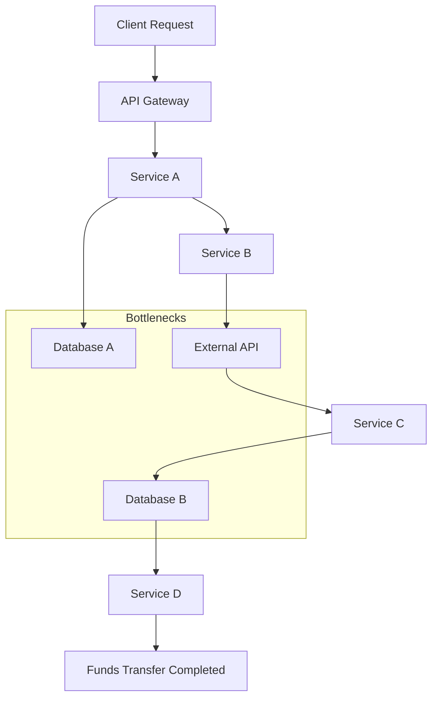

In the diagram above, the transaction flow is represented as a directed graph, with each node indicating a service, database, or external dependency involved in the process. Bottlenecks identified through distributed tracing are highlighted, enabling teams to focus on resolving critical performance issues within the system.

### Teaching Narrative

Distributed tracing metrics extend observability beyond individual components to provide end-to-end visibility across complex transaction flows. These advanced measurements track requests as they traverse multiple services, databases, and external dependencies, revealing timing, dependencies, and bottlenecks across system boundaries. For banking transactions that span numerous components, distributed tracing metrics enable precise identification of performance issues that would remain invisible to component-level monitoring alone.

### Common Example of the Problem

A bank implements a funds transfer service spanning multiple systems: mobile front-end, API gateway, authentication service, account validation, balance verification, transaction processing, and notification systems. When customers report transfer delays, troubleshooting becomes extraordinarily complex as each team monitors only their specific component, with no visibility into the complete transaction path. The mobile team confirms requests are sent properly, the API gateway shows normal processing, and each downstream service reports acceptable performance in isolation. Despite all components appearing healthy individually, transfers take over 15 seconds to complete.

To illustrate this problem, consider the following simplified transaction flow:

```
[Mobile App] --> [API Gateway] --> [Auth Service] --> [Account Validation] --> [Balance Verification] --> [Transaction Processing] --> [Notification Service]
```

Each arrow represents a service-to-service handoff in the transaction journey. Without distributed tracing, if a delay occurs between `Balance Verification` and `Transaction Processing`, it remains invisible to teams monitoring only their isolated components. This lack of end-to-end visibility leads to:

- Teams confirming their portion operates correctly.
- Unnecessary finger-pointing between teams.
- Delayed resolution of customer-reported issues.

Distributed tracing solves this by providing a unified view of the entire path, enabling precise identification of bottlenecks and their root causes.

### SRE Best Practice: Evidence-Based Investigation

Implement comprehensive distributed tracing to enable evidence-based troubleshooting and optimization. Use the following checklist to guide the process:

#### Checklist for Distributed Tracing Implementation

1. **End-to-End Journey Visualization**

   - [ ] Map the complete transaction path across all services and dependencies.
   - [ ] Implement consistent correlation identifiers throughout the transaction flow.
   - [ ] Develop timing metrics for each processing stage, from initiation to completion.
   - [ ] Visualize dependencies to understand service relationships and interactions.

2. **Bottleneck Identification Analysis**

   - [ ] Determine the critical path by identifying sequential constraints in the transaction flow.
   - [ ] Break down timing contributions to each step, showing percentage impact.
   - [ ] Flag bottlenecks by highlighting steps with disproportionate delays.
   - [ ] Compare observed performance metrics against established baselines.

3. **Cross-Component Optimization**

   - [ ] Measure and analyze performance holistically across system boundaries.
   - [ ] Assess interaction efficiency between services to identify improvement areas.
   - [ ] Quantify end-to-end latency contributions from each component.
   - [ ] Prioritize optimization efforts based on customer impact and business goals.

#### Example Insight from Distributed Tracing

Distributed tracing transforms troubleshooting capabilities, exposing performance issues that are invisible in component-level monitoring. For example, while all services may meet their individual performance targets, tracing can reveal that the authentication service adds a 4.7-second delay during token validation against an external provider. This bottleneck, accounting for 70% of the total transfer delay, becomes the focal point for optimization efforts.

### Banking Impact

For financial transactions, end-to-end visibility directly affects both customer experience and operational efficiency. Siloed monitoring creates significant business consequences through extended resolution times, unidentified bottlenecks, and customer frustration with unexplained delays. Every improvement in transaction visibility represents enhanced customer satisfaction through faster processing, more efficient troubleshooting through precise targeting, and better architectural decisions based on actual transaction paths. Comprehensive tracing ensures that complex financial transactions perform efficiently across system boundaries, delivering the seamless experience customers expect regardless of the underlying technical complexity.

### Implementation Guidance

1. **Implement Correlation Identifiers**\
   Use unique correlation identifiers to track requests across all transaction components. These identifiers should be propagated through HTTP headers, messaging queues, or other communication mechanisms to maintain traceability.\
   Example implementation in Python using Flask and OpenTelemetry:

   ```python
   from flask import Flask, request
   from opentelemetry import trace
   from opentelemetry.instrumentation.flask import FlaskInstrumentor
   from opentelemetry.sdk.trace import TracerProvider
   from opentelemetry.sdk.trace.export import BatchSpanProcessor, ConsoleSpanExporter

   # Initialize tracing
   trace.set_tracer_provider(TracerProvider())
   tracer = trace.get_tracer(__name__)
   span_processor = BatchSpanProcessor(ConsoleSpanExporter())
   trace.get_tracer_provider().add_span_processor(span_processor)

   # Create Flask app and instrument it
   app = Flask(__name__)
   FlaskInstrumentor().instrument_app(app)

   @app.before_request
   def start_trace():
       request_id = request.headers.get('X-Request-ID', 'unknown')
       span = tracer.start_span(f"Transaction-{request_id}")
       span.set_attribute("http.request_id", request_id)

   @app.route('/process', methods=['POST'])
   def process_transaction():
       # Simulate transaction processing
       return "Transaction processed"

   @app.after_request
   def end_trace(response):
       trace.get_current_span().end()
       return response

   if __name__ == "__main__":
       app.run(debug=True)
   ```

2. **Create Visualization Tools**\
   Develop tools or integrate with existing observability platforms to visualize the full transaction flow. These tools should display the sequence of service calls, associated latency, and any errors encountered.

3. **Develop Timing Analytics**\
   Implement timing analytics to identify services or components contributing disproportionately to transaction latency. Use distributed tracing libraries to measure and aggregate service call durations.\
   Example visualization with **Mermaid**:

   ```mermaid
   graph TD
       A[Client Request] --> B[Service A]
       B --> C[Service B]
       C --> D[Database]
       B --> E[External API]
   ```

4. **Build Baseline Comparison**\
   Establish baselines for normal transaction performance and highlight deviations. Use statistical methods or machine learning models to predict acceptable performance ranges and flag anomalies.

5. **Establish Cross-Team Analysis Processes**\
   Promote collaboration across teams by ensuring shared access to tracing data and analytics. Schedule regular reviews of transaction flow metrics to identify bottlenecks and improve performance collectively.

## Panel 2: The Prediction Engine

### Scene Description

The data science team is shown collaborating on building predictive metrics using machine learning to forecast potential failures in banking systems. A visual representation illustrates sophisticated forecasting models analyzing historical patterns and leading indicators. The diagram below provides a conceptual flow of how these predictive models operate:

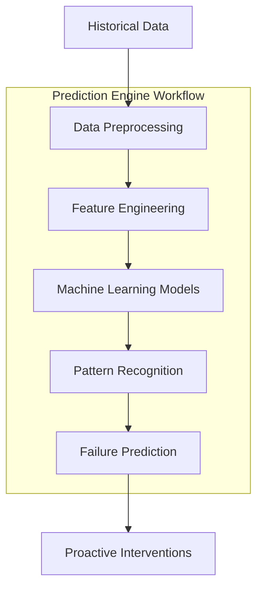

The models detect complex relationships between system behaviors, identifying subtle patterns that precede known failure modes. This approach predicts potential issues hours or days before traditional monitoring systems, enabling truly proactive reliability management and preventive action before any customer impact occurs.

### Teaching Narrative

Predictive metrics use machine learning to forecast potential failures before they occur based on historical patterns and leading indicators. These advanced measurements analyze complex relationships between system behaviors, identifying subtle patterns that precede known failure modes. For banking systems, predictive metrics enable truly proactive reliability management by identifying emerging issues with sufficient lead time for preventive intervention before customer impact occurs.

### Common Example of the Problem

A bank experiences recurring database performance degradation affecting payment processing approximately once per quarter. Traditional monitoring detects these issues only when they begin impacting transactions, creating customer disruption before remediation can occur. Despite post-incident analysis, the team struggles to identify reliable early warning signals through conventional threshold-based monitoring.

The root cause lies in the complexity of interacting factors that contribute to degradation. These factors include:

| **Factor** | **Description** | **Impact on Degradation** |
| -------------------- | ---------------------------------------------------------------------------------------------------- | --------------------------------------------------------------------- |
| Query Patterns | High-frequency or inefficient queries that evolve with application changes. | Increased load and contention on the database. |
| Data Growth | Gradual accumulation of records over time, pushing the system beyond its originally optimized state. | Slower query execution and higher resource consumption. |
| Index Fragmentation | Progressive breakdown of database indices due to frequent updates or deletes. | Reduced efficiency in retrieving data, leading to longer query times. |
| Connection Behaviors | Irregular patterns in client connections, such as bursts or prolonged idle sessions. | Higher latency and resource contention during peak activity. |

These factors interact in subtle and dynamic ways, creating a cumulative impact that traditional threshold-based monitoring fails to capture. For example:

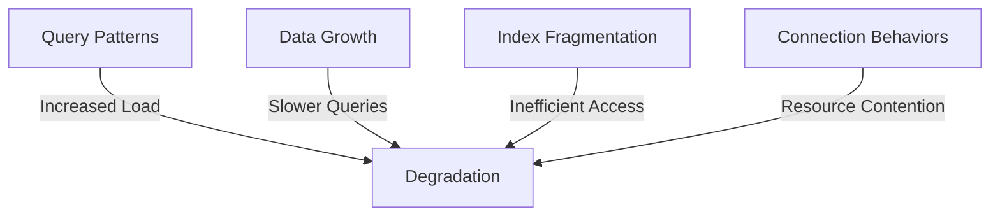

Without predictive capabilities that can analyze historical data to recognize these complex combinations and subtle trends, the team remains locked in a reactive cycle. This allows the same incident pattern to recur repeatedly, preventing true proactive reliability management.

### SRE Best Practice: Evidence-Based Investigation

Implement predictive reliability analytics by following these practical steps:

#### Checklist for Implementation

1. **Historical Pattern Analysis**

   - [ ] Create comprehensive incident timeline databases.
   - [ ] Implement feature identification for relevant metrics.
   - [ ] Develop pattern extraction across historical incidents.
   - [ ] Build correlation discovery between precursors and failures.

2. **Predictive Model Development**

   - [ ] Create supervised learning using labeled incident data.
   - [ ] Compare multiple algorithms for effectiveness.
   - [ ] Develop confidence scoring mechanisms for predictions.
   - [ ] Optimize lead time for maximum warning.

3. **Preventive Action Integration**

   - [ ] Create graduated alert mechanisms based on prediction confidence.
   - [ ] Implement automated remediation for high-confidence predictions.
   - [ ] Track intervention effectiveness.
   - [ ] Continuously improve models through feedback.

#### Sample Code Snippet: Simple Predictive Model

Below is a Python-based example of a simple predictive model using historical incident data and a supervised learning approach.

```python
import pandas as pd
from sklearn.model_selection import train_test_split
from sklearn.ensemble import RandomForestClassifier
from sklearn.metrics import accuracy_score

# Load and prepare data
data = pd.read_csv('incident_data.csv')  # Historical incident dataset
X = data.drop(columns=['failure_event'])  # Features
y = data['failure_event']  # Labels

# Split into training and testing sets
X_train, X_test, y_train, y_test = train_test_split(X, y, test_size=0.2, random_state=42)

# Train a predictive model
model = RandomForestClassifier(random_state=42)
model.fit(X_train, y_train)

# Make predictions and evaluate
predictions = model.predict(X_test)
accuracy = accuracy_score(y_test, predictions)

print(f"Model Accuracy: {accuracy:.2f}")

# Feature importance for analysis
feature_importance = pd.DataFrame({
    'Feature': X.columns,
    'Importance': model.feature_importances_
}).sort_values(by='Importance', ascending=False)

print("Feature Importance:")
print(feature_importance)
```

#### Example Flow: Predictive Reliability in Action

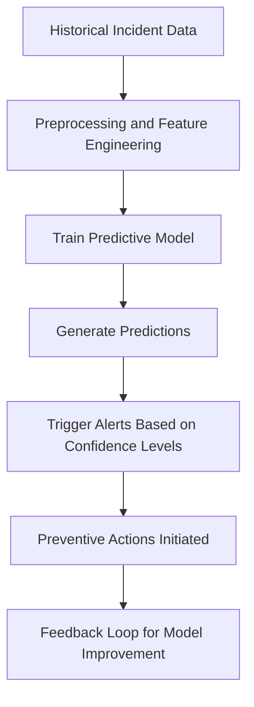

Machine learning analysis transforms reliability management from reactive to preventive, identifying distinct metric signatures that precede database degradation by 48-72 hours with 93% accuracy—providing sufficient warning for scheduled maintenance rather than emergency response after customer impact occurs.

### Banking Impact

For financial systems, predictive capabilities directly enhance both service reliability and operational efficiency. Reactive monitoring often results in significant business consequences, including recurring incidents, customer-impacting outages, and inefficient emergency responses. Predictive metrics, by contrast, allow for proactive prevention, minimizing disruptions and optimizing operational resources. Engineering teams can address emerging issues during planned maintenance windows instead of reacting to failures during critical business hours.

The table below quantifies the potential benefits of predictive capabilities in a banking context, highlighting the measurable impact on reliability and cost efficiency:

| **Metric** | **Reactive Monitoring** | **With Predictive Capabilities** | **Improvement** |
| ------------------------------ | ----------------------- | -------------------------------- | ----------------------------------- |
| Incidents Prevented (per year) | 0 | 50 - 100 | Reduction of recurring failures |
| Average Downtime (hours/year) | 200+ | < 50 | 75%+ decrease in downtime |
| Customer Impact (outages/year) | 5 - 10 | 0 - 2 | 80%+ fewer customer disruptions |
| Emergency Responses (per year) | 20+ | < 5 | 75%+ decrease in urgent escalations |
| Cost Savings ($/year) | $0 | $500,000+ | Significant operational savings |

By leveraging predictive capabilities, financial institutions not only reduce the frequency and severity of incidents but also achieve substantial cost savings. This ensures a more reliable banking experience for customers while enabling engineering teams to focus on strategic improvements rather than firefighting operational issues.

### Implementation Guidance

To implement predictive metrics for proactive reliability management, follow these steps:

1. **Create Historical Incident Database**

   - Aggregate comprehensive system metrics and historical incident data.
   - Ensure the dataset includes timestamps, failure modes, and leading indicators.

2. **Implement Machine Learning Pipelines**

   - Design and deploy pipelines to process and analyze historical data.
   - Use feature engineering to identify relevant variables and normalize data.

3. **Develop and Evaluate Prediction Models**

   - Train multiple machine learning models to predict potential failures.
   - Compare model effectiveness using metrics such as precision, recall, and F1-score.

4. **Build Confidence Scoring Mechanisms**

   - Implement confidence scoring for predictions to guide response prioritization.
   - Define thresholds for triggering automated or manual interventions.

5. **Establish Continuous Feedback Loops**

   - Monitor model performance in production and collect feedback from operations teams.
   - Use feedback to iteratively retrain models and improve accuracy.

#### Workflow Overview

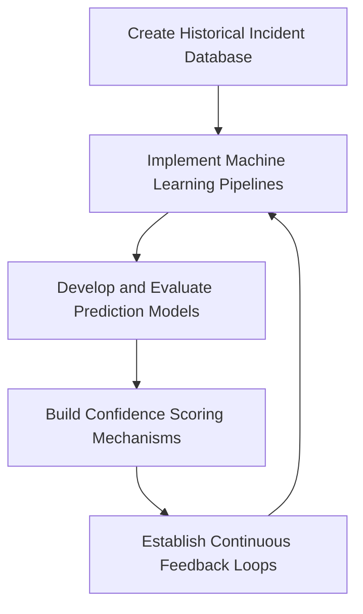

## Panel 3: The Controlled Failure

### Scene Description

The SRE team presents a chaos engineering program to management, supported by metrics that demonstrate reliability improvements through systematic resilience testing. The visual representation highlights a structured experimentation framework consisting of three key elements:

1. **Controlled Failure Injection**: Introducing deliberate disruptions to simulate real-world failure scenarios.
2. **Comprehensive Measurement**: Capturing detailed metrics to analyze system behaviors and validate recovery mechanisms.
3. **Progressive Complexity**: Gradually increasing the scope and intensity of experiments to build verified resilience over time.

Below is a text-based illustration of the framework:

```
+---------------------------+
|    Structured Chaos       |
|    Experimentation        |
+---------------------------+
           |
           v
+---------------------------+
| Controlled Failure        |
| Injection                 |
+---------------------------+
           |
           v
+---------------------------+
| Comprehensive             |
| Measurement               |
+---------------------------+
           |
           v
+---------------------------+
| Progressive               |
| Complexity                |
+---------------------------+
           |
           v
+---------------------------+
| Verified Resilience       |
+---------------------------+
```

This structured approach transitions the system from theoretical reliability to evidence-based resilience, ensuring critical banking infrastructure can withstand and recover from unexpected failures.

### Teaching Narrative

Chaos engineering metrics provide quantitative evidence of system resilience through controlled failure testing and rigorous measurement. These experimental metrics compare system behavior during normal operation versus deliberately degraded states, validating recovery mechanisms and identifying unexpected dependencies. For critical banking systems, chaos metrics create confidence in resilience capabilities through evidence-based testing rather than theoretical designs or untested assumptions.

### Common Example of the Problem

A bank implements geographic redundancy for critical payment services, with substantial investment in replicated infrastructure, automated failover mechanisms, and documented recovery procedures. Despite this significant reliability investment, actual regional failover has never been tested in production due to perceived risk. During a genuine disaster scenario, the failover process fails in multiple unexpected ways: authentication systems lack proper cross-region configuration, database replication experiences unexpected lag, and monitoring systems lose visibility during the transition. Without controlled testing that verifies resilience capabilities under realistic conditions, the organization has created expensive redundancy that fails to provide actual protection during real emergencies—essentially reliability theater rather than genuine resilience.

#### Sequence of Failures in the Disaster Scenario

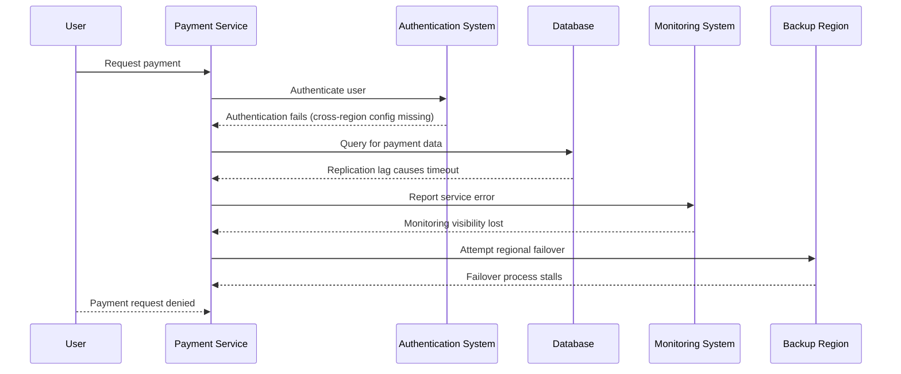

This sequence highlights the cascading nature of failures during the disaster scenario:

1. **Authentication Issues**: The authentication system is not properly configured for cross-region operations, causing login failures.
2. **Database Replication Lag**: The database replication process introduces unforeseen delays, leading to timeouts when querying payment information.
3. **Monitoring Breakdown**: Monitoring systems lose visibility during the transition, making it difficult to detect and resolve issues in real-time.
4. **Failover Stalls**: The regional failover process encounters unexpected bottlenecks, preventing a seamless recovery.

By failing to conduct controlled testing under realistic disaster conditions, the organization not only misses critical failure points but also risks operational paralysis during emergencies. This underscores the importance of chaos engineering practices in validating resilience mechanisms systematically.

### SRE Best Practice: Evidence-Based Investigation

Implement structured chaos engineering program with the following steps and metrics:

#### Checklist: Steps for Implementing Chaos Engineering

1. **Controlled Experimentation Framework**

   - [ ] Design a progressive testing methodology:
     - [ ] Test individual component failures in non-critical paths.
     - [ ] Simulate service-level degradation in peripheral systems.
     - [ ] Introduce dependency failures in critical transaction flows.
     - [ ] Conduct regional failover tests for core financial services.
   - [ ] Limit blast radius with automatic termination mechanisms.
   - [ ] Develop failure scenario libraries using historical incidents.
   - [ ] Integrate comprehensive measurement tools during experiments.

2. **Resilience Measurement Analytics**

   - [ ] Establish baseline performance metrics prior to experiments.
   - [ ] Quantify system degradation during controlled failures.
   - [ ] Measure recovery effectiveness of automated mechanisms.
   - [ ] Verify customer impact prevention measures.

3. **Systematic Improvement Process**

   - [ ] Perform gap analysis based on experimental outcomes.
   - [ ] Prioritize and implement remediation for identified weaknesses.
   - [ ] Track resilience trends to demonstrate continuous improvement.
   - [ ] Document system behavior patterns in a knowledge base.

#### Table: Key Metrics for Chaos Engineering

| Metric Category | Description | Example Metrics |
| ------------------------------ | -------------------------------------------------------------- | -------------------------------------------------------- |
| **Baseline Performance** | Metrics collected during normal operations for comparison. | Response time, throughput, system load |
| **Degradation Quantification** | Metrics that measure the impact of simulated failures. | Error rates, latency increases, SLA breaches |
| **Recovery Effectiveness** | Metrics to evaluate the success of recovery mechanisms. | Time to recovery, rollback success rate |
| **Customer Impact Prevention** | Metrics that validate the system protects end-user experience. | Percentage of unaffected transactions, downtime duration |

Structured chaos engineering transforms theoretical reliability into verified resilience. For example, testing geographic failover revealed that while basic services were unaffected, payment processing experienced an 8-12 minute disruption due to previously unknown session management limitations—a critical vulnerability identified only through controlled experimentation.

### Banking Impact

For financial institutions, resilience verification directly impacts both business continuity and disaster recovery effectiveness. Untested redundancy is like a safety net in a circus that has never been inspected—it may appear reliable, but when put to the test during a critical moment, it could fail catastrophically. This false confidence introduces significant business risk, exposing unexpected failure modes and potentially leading to extended outages during actual emergencies.

Every improvement in verified resilience is like reinforcing that safety net with tested, high-strength materials, ensuring it will perform when needed. These improvements translate to shorter recovery times during real incidents, more effective protection for critical services, and greater returns on substantial redundancy investments. Comprehensive chaos engineering ensures that disaster recovery capabilities function as expected when the stakes are highest, providing genuine protection rather than theoretical assurances that may crumble under real-world pressures.

### Implementation Guidance

1. Create structured chaos engineering framework with safety protocols
2. Implement progressive experiment design with increasing complexity
3. Develop comprehensive measurement during controlled failures
4. Build remediation processes addressing identified weaknesses
5. Establish regular resilience verification as standard operational practice

## Panel 4: The Automated Remediation

### Scene Description

The team is designing an automated response system that leverages metric triggers to execute predefined recovery actions for common failure patterns. This system embodies a self-healing infrastructure capable of detecting known failure signatures and implementing appropriate recovery actions without human intervention, significantly reducing mean time to recovery for well-understood failure modes.

Below is a conceptual representation of the self-healing infrastructure and its automated remediation flow:

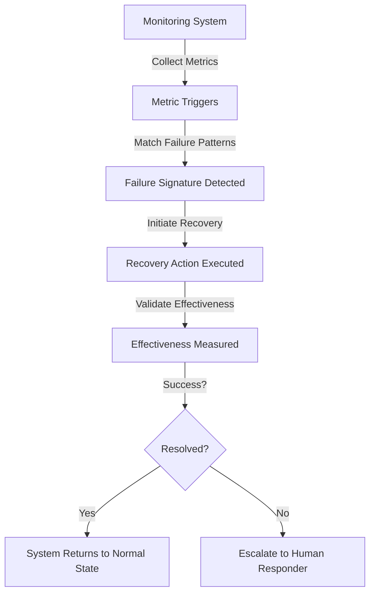

This flow illustrates how the system operates autonomously to identify and remediate known issues, ensuring rapid recovery while escalating unresolved or novel problems to human responders for further analysis.

### Teaching Narrative

Automated remediation metrics drive self-healing capabilities by connecting detection systems directly to recovery mechanisms through predefined trigger conditions and measured effectiveness. These advanced measurements identify known failure patterns, initiate appropriate recovery actions, and measure their effectiveness without human intervention. For example, in a banking operation, consider a scenario where a transaction processing service experiences a sudden spike in database connection errors due to connection pool exhaustion.

An automated remediation system would detect the error pattern through predefined metrics, such as a high rate of connection failures combined with elevated latency. Upon detection, the system could trigger a series of recovery actions, such as automatically increasing the connection pool size, restarting the affected service, or redirecting traffic to an alternate database replica. Once the recovery action is executed, the system would continue to monitor key metrics to verify the effectiveness of the remediation, ensuring that transaction processing returns to normal levels.

By handling such common failure modes autonomously, automated remediation metrics enable faster recovery while freeing human responders to focus on novel or complex incidents requiring judgment.

### Common Example of the Problem

A bank's payment processing system experiences recurring connection pool exhaustion that follows a consistent pattern: gradual resource depletion, queue building, latency increases, and eventually transaction failures. The current response process requires an on-call engineer to recognize the pattern, analyze metrics, restart affected services, and monitor recovery—a process taking 15-45 minutes depending on engineer experience and response time. Despite this being a well-understood failure with consistent remediation steps, the process remains manual and time-dependent. Without automated remediation that implements proven recovery actions based on recognized patterns, these recurring incidents continue creating preventable customer impact while consuming valuable engineering time on repetitive resolution procedures.

### SRE Best Practice: Evidence-Based Investigation

#### Automated Remediation Framework Checklist

| Step | Key Actions | Example Outcomes |
| ------------------------------------- | --------------------------------------------------------------------------------------------- | ------------------------------------------------------------------------------------------------- |
| **1. Pattern Recognition Automation** | | |
| Create signature identification | Identify and define common failure modes with specific patterns. | Exhaustion of connection pools detected with a unique signature. |
| Implement confidence scoring | Assign confidence levels to pattern matches based on historical accuracy and signal strength. | 96% confidence in detecting connection pool exhaustion. |
| Develop multi-signal correlation | Combine multiple signals to reduce noise and improve accuracy of failure detection. | Correlation of CPU spikes, memory leaks, and queue length for accurate root cause identification. |
| Build false positive prevention | Add verification layers to avoid triggering remediation on incorrect detections. | Ensure no action is taken on transient or unrelated issues. |

| Step | Key Actions | Example Outcomes |
| ---------------------------------------- | ------------------------------------------------------------------------------------------- | -------------------------------------------------------------------------------------------- |
| **2. Graduated Response Implementation** | | |
| Create tiered remediation | Define response tiers based on confidence levels and potential impact of the failure. | Tiered actions range from notifications to human-approved interventions. |
| Implement progressive escalation | Design responses to escalate in severity based on predefined conditions. | Non-disruptive recovery attempts escalate to service restarts if initial actions fail. |
| Develop contextual action selection | Enable dynamic selection of recovery actions based on the system state and failure context. | Transaction-safe service restarts applied during peak hours to minimize customer disruption. |
| Build remediation verification | Ensure recovery actions are verified for success before concluding the response process. | Confirmation checks validate that service health is restored after remediation. |

| Step | Key Actions | Example Outcomes |
| ------------------------------------------ | ------------------------------------------------------------------------------ | -------------------------------------------------------------------------------- |
| **3. Effectiveness Measurement Analytics** | | |
| Compare resolution times | Track the time taken for automated responses compared to manual interventions. | Resolution time reduced from 27 minutes (manual) to under 3 minutes (automated). |
| Track success rates | Monitor success rates of automated actions to identify improvement areas. | 96% success rate in resolving connection pool exhaustion scenarios. |
| Monitor false positives/negatives | Evaluate the frequency of incorrect detections and unnecessary actions. | Reduction in false positives through refined pattern matching and verification. |
| Build continuous improvement | Use outcome analysis to iterate on detection and remediation logic. | Enhanced detection accuracy and reduced mean time to recovery over time. |

______________________________________________________________________

#### Automated Remediation Workflow (Example)

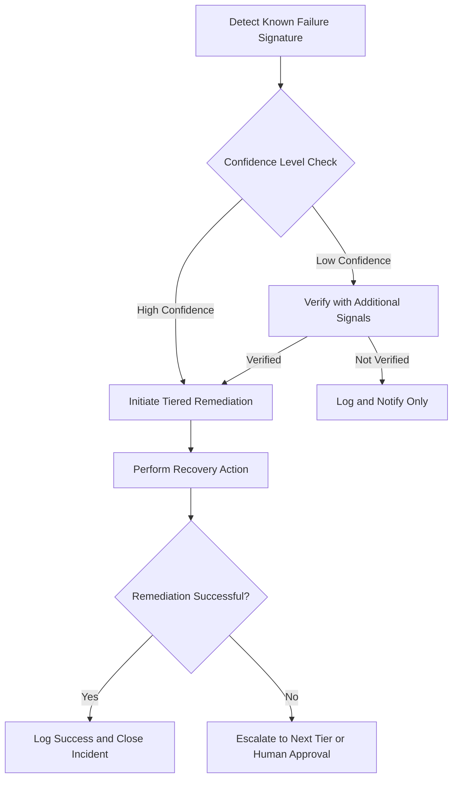

Automated remediation transforms incident response for well-understood patterns. For example, when a connection pool exhaustion signature is detected with 96% confidence, the system triggers a tiered response. The initial non-disruptive recovery reduces mean time to recovery from 27 minutes to under 3 minutes—a 9x improvement—minimizing customer impact and freeing human responders to focus on novel issues.

### Banking Impact

For payment systems, recovery speed directly affects both customer experience and transaction revenue. Manual remediation creates significant business consequences through extended outages, inconsistent response times, and inefficient use of specialized engineering resources. Automated remediation addresses these challenges by ensuring well-understood issues receive immediate response regardless of time of day or engineer availability, providing consistent, rapid recovery while enabling human responders to focus on complex problems requiring judgment and creativity.

To highlight the benefits of automated remediation, consider the following quantitative comparison between manual and automated recovery approaches:

| Metric | Manual Recovery | Automated Recovery | Improvement |
| ------------------------------ | -------------------- | ---------------------- | ------------- |
| Average Recovery Time | 45 minutes | 3 minutes | 93% faster |
| Customer Transactions Impacted | ~15,000 | ~500 | 97% reduction |
| Engineer Hours Utilized | 5 hours per incident | 0.2 hours per incident | 96% reduction |
| Revenue Loss (per hour outage) | $100,000 | $5,000 | 95% reduction |

This comparison demonstrates how automated remediation significantly reduces recovery time, minimizes customer impact, preserves transaction revenue, and optimizes the use of valuable engineering resources. By enabling faster recovery for common failure scenarios, banks can deliver a more reliable customer experience while redirecting human expertise to high-value activities.

### Implementation Guidance

1. **Create a Pattern Library**\
   Document reliable failure signatures in a centralized repository. Each failure signature should include:

   - Identifier (e.g., unique ID or name)
   - Trigger conditions (e.g., metric thresholds, logs, or events)
   - Associated remediation actions
     Example JSON schema for storing failure signatures:

   ```json
   {
     "failure_signature_id": "FS001",
     "name": "Database Connection Timeout",
     "trigger_conditions": {
       "metric": "db_connection_timeout_rate",
       "threshold": ">=5%",
       "duration": "5 minutes"
     },
     "remediation_action": "Restart database connection pool"
   }
   ```

2. **Implement Confidence Scoring Mechanisms**\
   Add scoring logic to reduce false activations. Confidence scores can be calculated based on historical occurrence patterns and real-time metric behavior. Below is a simplified pseudocode example:

   ```python
   def calculate_confidence_score(trigger_conditions, history):
       score = 0
       if history['occurrence_rate'] > trigger_conditions['threshold']:
           score += 70
       if history['similar_failures'] > 5:
           score += 20
       return min(score, 100)  # Cap at 100
   ```

3. **Develop Graduated Response Frameworks**\
   Use a tiered response strategy for escalating remediation. Below is a workflow representation in Mermaid illustrating graduated responses:

   ```mermaid
   graph TD
       A[Trigger Detected] -->|Low Confidence| B[Log Incident]
       A -->|Medium Confidence| C[Trigger Non-Intrusive Recovery]
       A -->|High Confidence| D[Trigger Full Recovery]
       C --> E[Monitor Results]
       D --> E
       E -->|Failure Persists| F[Escalate to Human Intervention]
   ```

4. **Build Verification Mechanisms**\
   Integrate post-remediation checks into workflows. Example Bash script to verify service recovery:

   ```bash
   # Verify key service is running
   if systemctl is-active my_service; then
     echo "Service successfully recovered"
   else
     echo "Service recovery failed, escalating..."
   fi
   ```

5. **Establish Effectiveness Measurement**\
   Track metrics such as Mean Time to Recovery (MTTR) and success rate of automated actions. Use a continuous improvement loop:

   - Monitor MTTR trends
   - Analyze remediation success rates
   - Update pattern library and confidence scoring based on feedback
     Example metrics tracking loop:

   ```mermaid
   graph LR
       A[Track MTTR and Success Rate] --> B[Identify Inefficiencies]
       B --> C[Update Patterns and Triggers]
       C --> D[Deploy Improvements]
       D --> A
   ```

## Panel 5: The Global View

### Scene Description

The operations team is depicted implementing multi-region and hybrid cloud metrics for a complex international banking infrastructure. The unified visualization showcases comprehensive monitoring that spans geographic regions, technology platforms, and organizational boundaries. This ensures consistent visibility, eliminating dangerous blind spots at traditional monitoring boundaries.

Below is a conceptual representation of the unified visualization:

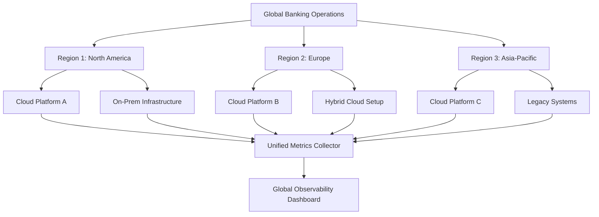

This diagram illustrates how metrics are collected across diverse regions, platforms, and infrastructures, feeding into a centralized dashboard to provide end-to-end visibility across the entire global system.

### Teaching Narrative

Global observability metrics create consistent visibility across geographic regions, technology platforms, and organizational boundaries for international banking operations. These comprehensive measurements transcend traditional silos to provide end-to-end visibility regardless of where services are hosted or how they're implemented. For international financial institutions, global metrics eliminate dangerous blind spots at regional or technological boundaries where transactions might otherwise fail without clear detection.

### Common Example of the Problem

A multinational bank operates payment infrastructure across multiple geographic regions and technology platforms: traditional data centers in Europe, public cloud services in North America, and managed services in Asia. Each environment maintains separate monitoring systems with different metrics, visualization approaches, and operational practices based on regional preferences and historical decisions.

This fragmented approach creates significant challenges when international transactions experience delays or failures. Troubleshooting becomes extraordinarily complex as multiple teams examine isolated dashboards that only represent specific portions of the transaction path. Without unified global visibility across these traditional boundaries, the organization faces extended incident resolution times, inconsistent reliability, and a fragmented customer experience across regions.

The problem can be visualized as follows:

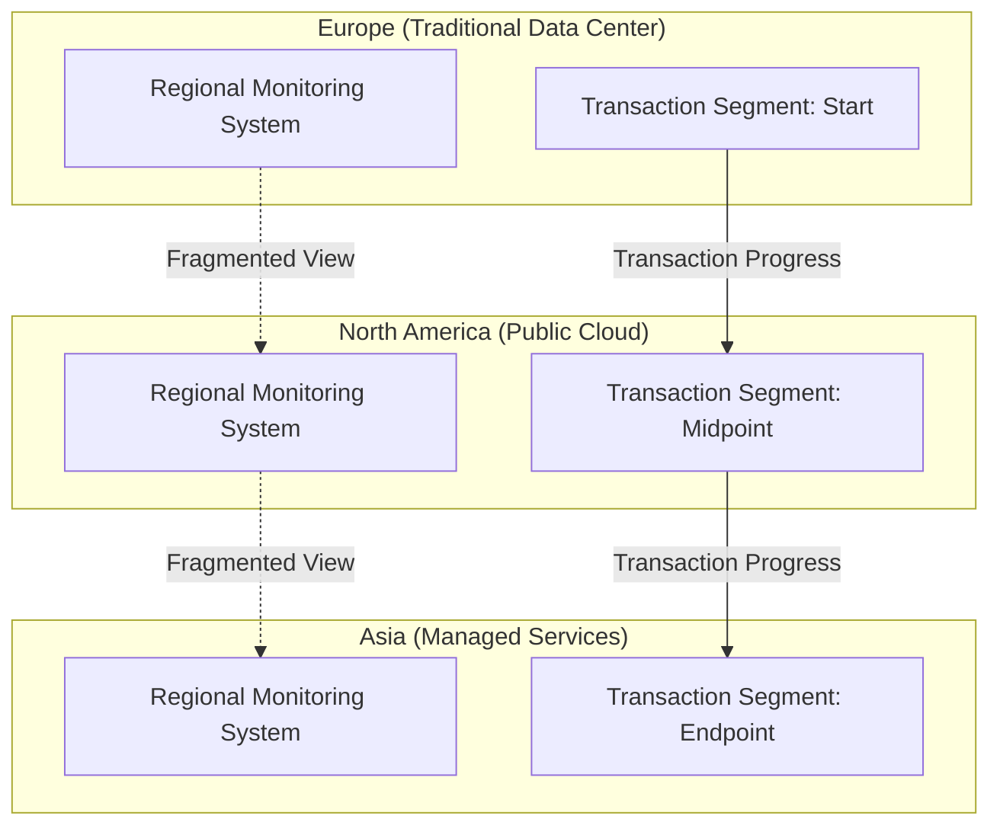

In this flowchart, each region operates in isolation, with its own monitoring system (A1, B1, C1) providing only a partial view of the transaction path (A2 → B2 → C2). The lack of a unified monitoring solution means teams cannot effectively trace the full transaction lifecycle, leading to blind spots where failures or delays may occur unnoticed. This disjointed visibility undermines the organization's ability to ensure seamless and reliable operations on a global scale.

### SRE Best Practice: Evidence-Based Investigation

#### Checklist for Implementing Unified Global Observability

**1. Cross-Boundary Standardization**

- [ ] Define consistent metrics across all geographic regions.
- [ ] Implement unified data collection pipelines across platforms.
- [ ] Standardize visualization formats to ensure shared understanding.
- [ ] Build a centralized observability platform with federated, role-based views.

**2. Multi-Environment Correlation**

- [ ] Establish end-to-end transaction tracking that spans geographic and platform boundaries.
- [ ] Enable geographical visualizations to monitor regional status in real-time.
- [ ] Map cross-platform dependencies to understand system interconnections.
- [ ] Develop a unified topology visualization that integrates all environments.

**3. Organizational Integration**

- [ ] Create role-based dashboards to facilitate global team collaboration.
- [ ] Implement a shared incident management platform to centralize workflows.
- [ ] Standardize escalation procedures across all regions and organizations.
- [ ] Promote knowledge sharing through centralized documentation and cross-region training programs.

______________________________________________________________________

#### Unified Global Observability Workflow

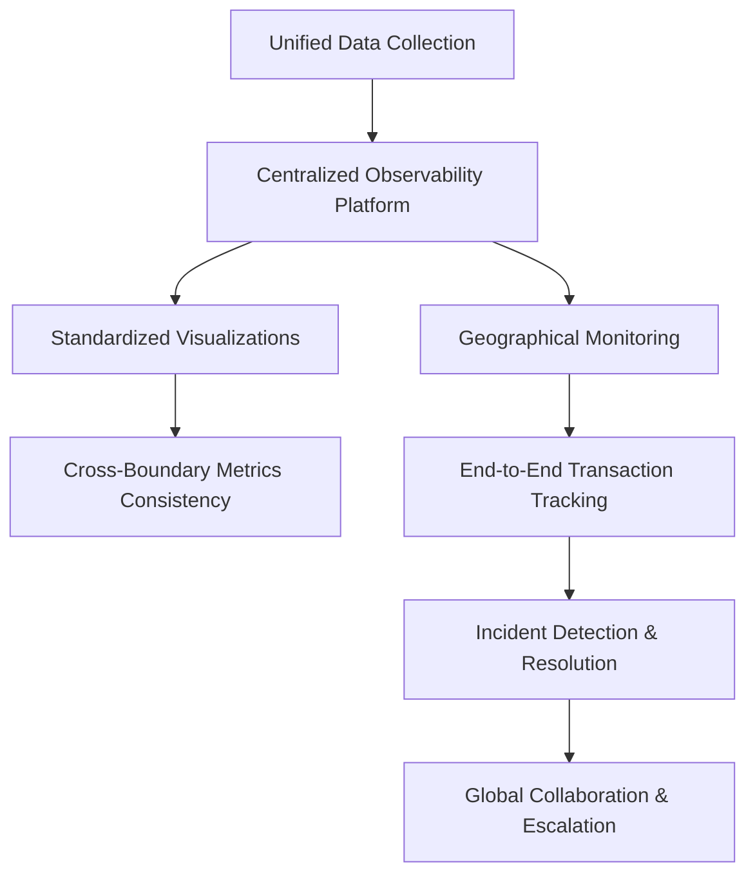

______________________________________________________________________

Global observability transforms operational capabilities, enabling teams to trace transaction paths across three continents and multiple technology platforms within a single interface. This approach reduces mean time to detection by 74% for international payment issues, streamlining incident resolution that previously required manual coordination across fragmented monitoring systems.

### Banking Impact

For multinational financial institutions, unified visibility directly affects both operational effectiveness and customer experience. Fragmented monitoring creates significant business consequences through extended incident resolution, inconsistent service quality across regions, and inefficient operations requiring duplicate expertise in each location. Every improvement in global observability represents enhanced reliability through more effective troubleshooting, more consistent customer experience regardless of location, and more efficient operations through shared capabilities and knowledge. Comprehensive metrics ensure that international banking services maintain reliability across traditional boundaries, delivering consistent quality regardless of customer location or transaction path.

### Implementation Guidance

To implement global observability metrics effectively, follow these step-by-step guidelines. The process is visualized below in a text-based flowchart for clarity.

#### Step-by-Step Implementation Flowchart

```
[Define Metric Standards] --> [Centralized Collection Setup] --> [Unified Visualization Development]
                            --> [Cross-Region Correlation Building] --> [Collaborative Processes Establishment]
```

1. **Define Global Metric Standards**

   - Create standardized definitions for metrics across all regions and platforms.
   - Ensure consistency in naming conventions, thresholds, and measurement units.

2. **Set Up Centralized Collection with Distributed Access**

   - Implement a centralized system for collecting metrics from all geographic locations.
   - Provide role-based access to the centralized data for regional and functional teams.

3. **Develop Unified Visualization Spanning Geographical Boundaries**

   - Build dashboards that offer a single-pane-of-glass view, integrating data from multiple regions and platforms.
   - Use visualization tools designed for scalability and multi-region compatibility.

4. **Build Cross-Region Correlation Capabilities for Global Transactions**

   - Enable the system to correlate metrics and events across regions to identify trends and anomalies.
   - Leverage AI/ML models for predictive analysis and anomaly detection in real-time.

5. **Establish Collaborative Processes Leveraging Shared Visibility**

   - Design workflows that promote cross-team collaboration using shared dashboards and alerts.
   - Conduct regular reviews and drills to ensure teams are aligned on global observability practices.

## Panel 6: The Continuous Verification

### Scene Description

SRE team presenting metrics from an automated testing program that continuously validates critical banking system functionality. Visual shows a comprehensive verification framework that ensures essential capabilities remain operational, detecting subtle degradations before they affect customers through ongoing functional validation rather than point-in-time testing.

#### Verification Framework Flow

The framework operates as follows:

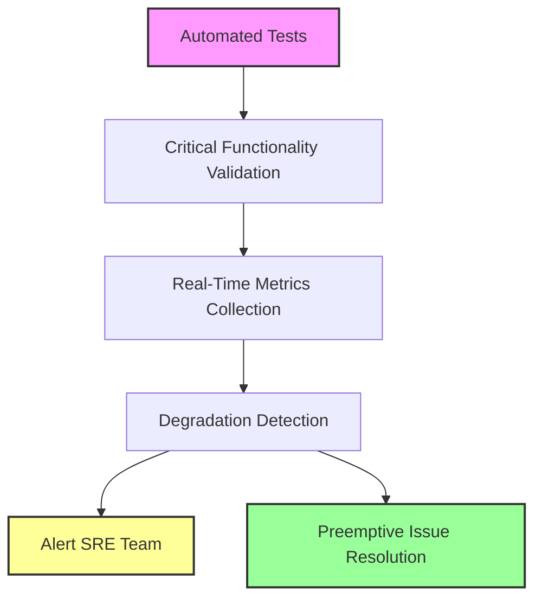

This flow highlights how the automated testing program continuously monitors critical banking functionality, collects real-time metrics, identifies subtle degradations, and triggers alerts for preemptive resolution, ensuring consistent service quality.

### Teaching Narrative

Continuous verification metrics provide ongoing confidence in critical functionality through automated testing and measurement rather than point-in-time validation. These advanced measurements constantly verify that essential banking capabilities remain functional, detecting subtle degradations before they affect customers. For financial services where functionality directly affects monetary transactions, continuous verification metrics ensure consistent service quality between explicit test cycles.

### Common Example of the Problem

A bank conducts quarterly compliance testing for critical money movement functions, executing comprehensive test suites that verify all required capabilities. However, between these formal test cycles, subtle degradations can develop unnoticed. These issues include:

- **Slower authentication flows**: Login or transaction authentication times gradually increase, frustrating users.
- **Intermittent transaction failures**: Certain transaction types sporadically fail, impacting reliability.
- **Edge case issues for specific customer segments**: Unique scenarios affecting subsets of customers go undetected.
- **False sense of system health**: Monitoring infrastructure metrics may show all systems as operational while functional issues persist.

Despite these problems, technical monitoring often fails to detect them until they surface during formal testing or through customer complaints. Without continuous functional verification that regularly confirms critical capabilities remain operational, these degradations can persist for weeks or even months. This results in extended periods of suboptimal customer experience, despite systems appearing healthy in traditional monitoring.

### SRE Best Practice: Evidence-Based Investigation

Implement continuous functional verification to ensure critical capabilities remain operational and issues are detected early. The following table summarizes best practices, their goals, and implementation examples for evidence-based investigation:

| **Best Practice** | **Goal** | **Implementation Examples** |
| ---------------------------------------- | --------------------------------------------------------------------- | --------------------------------------------------------------------------------------------------------------------------------------------------------------------------------------------------------------------------------------------------------------------------------------------------------------- |
| **Synthetic Transaction Automation** | Ensure comprehensive functional coverage across critical system paths | - Simulate account access and authentication flows<br>- Test balance inquiries and payment processing<br>- Automate statement generation and reporting<br>- Schedule recurring test execution<br>- Model realistic data usage<br>- Track results with trend analysis |
| **Progressive Alert Sensitivity** | Detect and prioritize issues based on severity and business impact | - Send information notices for isolated anomalies<br>- Escalate to warnings for repeated deviations<br>- Trigger critical alerts for persistent failures<br>- Use pattern recognition across test outputs<br>- Adjust sensitivity aligned to user impact<br>- Correlate alerts with customer experience metrics |
| **Validation Effectiveness Measurement** | Evaluate the success and scope of validation efforts | - Measure detection accuracy for known issues<br>- Track lead time from detection to resolution<br>- Assess functional coverage comprehensively<br>- Perform continuous improvement by analyzing validation effectiveness |

Continuous verification transforms quality assurance from periodic to constant monitoring. For example, subtle authentication degradations affecting approximately 5% of mobile banking customers were detected three weeks before quarterly testing would have identified the issue. This early detection prevented extended customer impact through timely remediation.

### Banking Impact

For financial services, functional verification is as critical to operations as health monitoring is to personal well-being. Think of periodic testing like an annual health checkup—it provides a snapshot of current status but leaves room for issues to develop undetected between appointments. In contrast, continuous verification is akin to wearing a fitness tracker that monitors your vital signs in real time, alerting you immediately to abnormalities before they escalate into serious problems.

This continuous approach reduces business exposure by identifying potential degradations as they occur, ensuring that critical financial functions remain operational without extended periods of undetected risk. It strengthens regulatory compliance by providing ongoing validation and enhances customer satisfaction by delivering consistent service quality throughout the year rather than in bursts following formal test cycles. Just as a fitness tracker ensures your health is consistently managed, comprehensive verification ensures that banking services maintain uninterrupted functionality, offering reliability that customers and regulators can trust.

### Implementation Guidance

1. **Create Comprehensive Test Suite Covering Critical Banking Functions**\
   Identify critical functionalities, such as transaction processing, account balance updates, and fraud detection. For each function, define test cases that validate both expected behaviors and edge cases.

   Example critical function: **Transaction Processing Validation**\
   Below is a sample pseudocode snippet for automating a test that verifies transaction integrity:

   ```python
   def test_transaction_integrity():
       # Simulate a banking transaction
       initial_balance = get_account_balance(account_id="12345")
       transaction_amount = 100

       # Perform debit transaction
       process_transaction(account_id="12345", amount=-transaction_amount)

       # Verify updated balance
       updated_balance = get_account_balance(account_id="12345")
       assert updated_balance == initial_balance - transaction_amount, \
           "Transaction integrity test failed: Balance mismatch"
   ```

2. **Implement Automated Execution on Appropriate Frequency Schedules**\
   Schedule test suite executions based on system criticality. For example:

   - High-frequency tests: Run every 5 minutes for core functions like transaction processing.
   - Daily tests: Cover broader functionality during off-peak hours.

3. **Develop Sensitive Detection Identifying Subtle Degradations**\
   Use thresholds and anomaly detection techniques to identify small deviations in metrics such as transaction latency, error rates, or balance discrepancies. For example:

   - Track average transaction processing time and alert if it increases by more than 10% compared to the baseline.

4. **Build Trending Analysis Highlighting Developing Patterns**\
   Aggregate metrics over time to identify trends. Use tools like time-series databases and visualization dashboards to monitor changes in system performance or customer interactions.

5. **Establish Integration Between Verification Findings and Incident Response**\
   Configure automated alerts to trigger incident response workflows. For example:

   - If a test failure is detected, log the incident, notify the on-call SRE, and create a ticket in the incident management system.

   Example integration flow:

   ```mermaid
   flowchart TD
       A[Test Failure Detected] --> B[Log Incident]
       B --> C[Notify On-Call SRE]
       C --> D[Create Incident Ticket]
   ```

## Panel 7: The Next Frontier

### Scene Description

The research team is engaged in exploring emerging metrics approaches tailored to next-generation banking technologies, including blockchain, AI-based services, and open banking. A conceptual framework is visualized to illustrate advanced measurement systems addressing the unique reliability challenges posed by these technologies.

#### Visual Representation of Advanced Measurement Frameworks:

```
flowchart TB
    A[Emerging Banking Technologies] --> B[Blockchain]
    A --> C[AI-Based Services]
    A --> D[Open Banking]

    B --> E[Distributed Ledger Consensus]
    C --> F[Machine Learning Model Accuracy]
    D --> G[API Ecosystem Integrity]

    E --> H[Novel Reliability Metrics]
    F --> H
    G --> H

    H --> I[Extending Reliability Engineering]
    I --> J[Next-Generation Financial Platforms]
```

This representation highlights how distributed ledger consensus, machine learning model accuracy, and API ecosystem integrity are interconnected with novel reliability metrics. These metrics collectively enable the extension of reliability engineering principles into innovative financial platforms, ensuring operational integrity and resilience in these emerging domains.

### Teaching Narrative

Emerging technology metrics extend reliability measurement to new financial services platforms with unique characteristics and requirements. These specialized measurements address the distinct reliability concerns of blockchain consensus, AI model accuracy, open banking integration, and other evolving technologies. For banking innovation teams, these advanced metrics ensure that new financial technologies maintain appropriate reliability standards despite their novel architectures and operational characteristics.

### Common Example of the Problem

A bank implements multiple next-generation technologies including distributed ledger for settlement, AI-based fraud detection, and open banking APIs for partner integration. Traditional reliability approaches prove insufficient for these novel architectures, leading to critical measurement gaps. Below is a summary table highlighting these gaps and the unique needs of next-generation technologies:

| **Technology** | **Traditional Metric Gap** | **Unique Reliability Need** |
| ---------------------------- | ----------------------------------------------------------------- | --------------------------------------------------------------------------------- |
| **Distributed Ledger** | Standard availability metrics fail to address consensus issues | Metrics for consensus integrity, fork resolution, and transaction finality |
| **AI-Based Fraud Detection** | Conventional error rates overlook false positive/negative impacts | Metrics for model accuracy, bias detection, and drift monitoring |
| **Open Banking APIs** | Component-level monitoring misses ecosystem dependencies | Metrics for API dependency health, partner SLA adherence, and ecosystem integrity |

Without specialized measurement approaches that align with these unique reliability characteristics, the innovation team cannot effectively manage the operational risks of these technologies. This measurement gap creates dangerous blind spots where novel failure modes develop undetected. These blind spots can disrupt critical financial functions through previously unknown mechanisms, which are not adequately addressed by traditional reliability metrics.

### SRE Best Practice: Evidence-Based Investigation

Implement specialized emerging technology metrics using the following checklist and example code snippet:

#### Checklist for Implementing Specialized Metrics

1. **Blockchain Reliability Measurement**

   - [ ] Define consensus health metrics for distributed validation.
   - [ ] Implement transaction finality tracking with confirmation depth.
   - [ ] Develop fork detection and resolution monitoring.
   - [ ] Build smart contract execution verification mechanisms.

2. **AI Effectiveness Measurement**

   - [ ] Create model accuracy tracking with drift detection.
   - [ ] Implement decision quality metrics beyond binary correctness.
   - [ ] Develop false positive/negative impact assessment.
   - [ ] Build explanation quality verification for regulatory compliance.

3. **Open Banking Ecosystem Monitoring**

   - [ ] Define API availability metrics across partner boundaries.
   - [ ] Implement standard compliance verification procedures.
   - [ ] Map ecosystem dependencies to identify critical failure points.
   - [ ] Track transaction completion across multi-party integrations.

#### Example Code Snippet: Monitoring Blockchain Consensus Health

```python
from prometheus_client import Gauge, start_http_server
import time

# Initialize Prometheus metrics
consensus_health = Gauge('consensus_health', 'Health of blockchain consensus mechanism')
transaction_finality = Gauge('transaction_finality', 'Average confirmation depth of transactions')
fork_count = Gauge('fork_count', 'Number of detected forks in the blockchain')

def monitor_blockchain():
    while True:
        # Example logic for consensus health
        consensus_status = get_consensus_status()  # Replace with actual function
        consensus_health.set(1 if consensus_status == "healthy" else 0)

        # Example logic for transaction finality
        avg_finality = calculate_avg_confirmation_depth()  # Replace with actual function
        transaction_finality.set(avg_finality)

        # Example logic for fork detection
        forks = detect_forks()  # Replace with actual function
        fork_count.set(len(forks))

        time.sleep(10)

if __name__ == "__main__":
    start_http_server(8000)  # Expose metrics on port 8000
    monitor_blockchain()
```

Specialized measurement transforms reliability management for emerging technologies, revealing critical insights. For example, while the bank's blockchain settlement system may maintain technical availability, consensus formation times exceeding design parameters during high-volume periods could threaten settlement finality guarantees—a novel reliability concern invisible to traditional metrics.

### Banking Impact

For financial innovation, appropriate reliability measurement directly affects both operational stability and regulatory acceptance. Traditional metrics applied to novel technologies create significant business risks through undetected failure modes, inappropriate reliability management, and potential regulatory concerns from unmeasured characteristics. Every advancement in specialized measurement represents improved operational control of emerging technologies, enhanced risk management for novel architectures, and better regulatory positioning through comprehensive governance. Advanced metrics ensure that banking innovation delivers appropriate reliability despite architectural novelty, maintaining the stability requirements of financial services regardless of underlying technology approaches.

### Implementation Guidance

To effectively implement technology-specific reliability frameworks, follow the step-by-step workflow below:

1. **Assess Platform-Specific Requirements**

   - Identify the unique reliability concerns for each platform (e.g., blockchain consensus, AI model accuracy, open banking APIs).
   - Conduct stakeholder interviews and technical analysis to capture platform-specific operational challenges.

2. **Design Technology-Specific Metrics**

   - Define specialized metrics tailored to the platform's unique characteristics (e.g., transaction finality for blockchain, precision/recall for AI models, uptime SLAs for open banking APIs).
   - Ensure metrics align with both business objectives and technical reliability goals.

3. **Integrate Metrics into Existing Frameworks**

   - Map new metrics to existing reliability management processes.
   - Develop cross-platform monitoring strategies that unify traditional and emerging technology metrics.

4. **Implement Monitoring and Visualization Dashboards**

   - Build dashboards that provide an end-to-end view of reliability across all platforms.
   - Include drill-down capabilities for platform-specific metric analysis and anomaly detection.

5. **Establish Iterative Review and Optimization**

   - Schedule regular reviews with domain experts to validate metric effectiveness and identify improvement areas.
   - Incorporate feedback loops to refine metrics and frameworks as technologies and requirements evolve.

#### Workflow Diagram

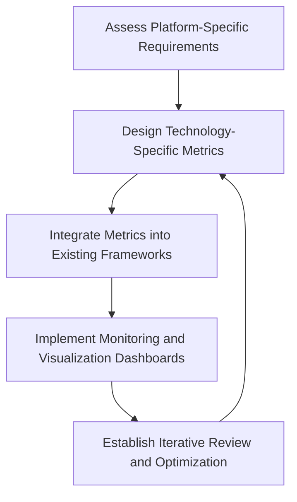

By following this structured workflow, banking innovation teams can ensure reliable operation and continuous optimization of next-generation financial technologies.
