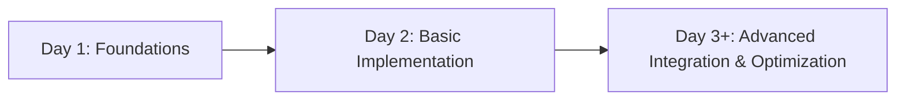
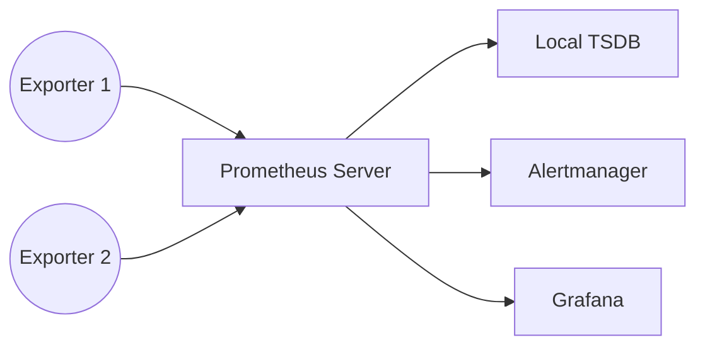
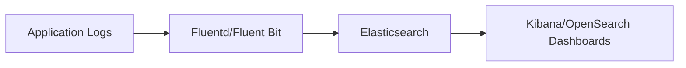
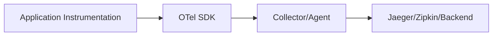

# Day 2 Training Module: Observability Implementation & Tools

Welcome to Day 2 of our observability training! Today, we will move beyond theory and into real-world implementation, building on the concepts you learned on Day 1. We’ll examine how to set up, configure, and integrate observability tools (metrics, logs, and traces) in production environments—both on traditional Virtual Server Infrastructure (VSI) and container/orchestrator platforms like Kubernetes (K8s) and AWS (ECS, EKS). By the end of this module, you’ll have a thorough, hands-on understanding of how to implement and operate an observability stack in practice.

---
## 1. Introduction: From Concepts to Implementation

### Recap of Day 1 Core Concepts
- **Three Pillars of Observability**: Metrics, Logs, and Traces.
- **Value of Observability**: Faster troubleshooting, proactive alerting, better insights into production systems.
- **Mindset Shift**: From reactive “alert and fix” to proactive, data-driven decision-making.

### Implementation Journey & Objectives
- **Gradual Adoption**: Start small (pilot or proof-of-concept) and grow as your team gains familiarity.
- **Hybrid Approaches**: Integrate existing tools (Geneos, Splunk, Dynatrace, Datadog) while adopting open-source solutions (Prometheus, ELK/OpenSearch, OpenTelemetry).
- **Maturity Model**: Progress from simple data collection to advanced correlation, machine learning, and predictive analysis.

### Introduction to Observability Implementation & Strategies YouTube Video
**AWS re:Invent 2023 – [Building an Effective Observability Strategy](https://www.youtube.com/watch?v=TmEDm7eQvSU)**

- Comprehensive overview of transitioning from theory to practical implementation.
- Discusses strategies like gradual rollout, pilot projects, and maturity models.

---
## 2. Implementing Metrics Collection

Metrics help you quantify the behavior of your applications and infrastructure over time. Below, we’ll walk through setting up Prometheus and Grafana at different experience levels, with Python code examples to instrument applications.

### 🔍 Beginner Level: Setting up Basic Prometheus and Grafana

1. **Prometheus Architecture Components**  
   - **Prometheus Server**: Scrapes metrics from exporters, stores data.  
   - **Exporters**: Provide metrics in a format Prometheus understands (e.g., Node Exporter for system metrics).  
   - **Alertmanager**: (Optional for beginner level) Handles routing of alerts generated by Prometheus rules.

2. **Installation for Different Environments**
   - **VSI**: Install Prometheus as a system service or Docker container.  
   - **Kubernetes**: Deploy with Helm charts (`prometheus-community/prometheus`).  
   - **AWS (EKS, ECS)**: Use Managed Prometheus (AMP) or self-managed instances on ECS tasks or EKS pods.

3. **Python Instrumentation with `prometheus_client`**
```python
from prometheus_client import start_http_server, Counter
import time
import random

REQUEST_COUNT = Counter('myapp_request_count', 'Total request count')

def process_request():
    REQUEST_COUNT.inc()
    time.sleep(random.random())

if __name__ == '__main__':
    # Start Prometheus metrics server on port 8000
    start_http_server(8000)
    while True:
        process_request()
```
   - Access metrics at `http://<host>:8000/metrics`.

4. **Creating Your First Exporter**
   - Use the above Python code or an existing exporter (Node Exporter, Redis Exporter, etc.).
   - Configure Prometheus to scrape your exporter in `prometheus.yml`:
```yaml
scrape_configs:
  - job_name: 'myapp'
    static_configs:
      - targets: ['localhost:8000']
```

5. **Basic PromQL Queries**
   - Example: `sum(myapp_request_count)` to see the total requests.

### 🧩 Intermediate Level: Advanced Instrumentation and Visualization

1. **Custom Instrumentation Strategies**  
   - Use Counters, Gauges, Histograms, and Summaries for more nuanced metrics.  
   - Choose Histograms for latency distributions to understand request performance.

2. **Metric Naming and Labeling Schemes**  
   - Follow guidelines like `component_subsystem_metric_name`.
   - Use labels to differentiate instances, clusters, or environments (e.g., `env="prod"`).

3. **Building Comprehensive Grafana Dashboards**  
   - Create dashboards for application performance, resource utilization, and error rates.  
   - Example JSON snippet for a Grafana dashboard:
   ```json
   {
     "title": "MyApp Metrics",
     "panels": [
       {
         "type": "graph",
         "title": "Request Count",
         "targets": [
           {
             "expr": "sum(rate(myapp_request_count[1m]))"
           }
         ]
       }
     ]
   }
   ```

4. **Setting Up Basic Alerting Rules**  
   - Example Prometheus alert rule (`alert.rules`):
   ```yaml
   groups:
     - name: myapp_alerts
       rules:
         - alert: HighRequestRate
           expr: rate(myapp_request_count[5m]) > 100
           for: 5m
           labels:
             severity: warning
           annotations:
             description: "High request rate detected."
   ```
5. **Integration with Existing Metrics Systems**  
   - **Datadog**: Use the Datadog agent as a sidecar or direct Prometheus integration.  
   - **Geneos**: Use plugins that scrape Prometheus endpoints or push metrics to Geneos Gateway.

### 💡 Advanced/SRE Level: Enterprise-Scale Metrics Implementation

1. **High-Availability Prometheus Setup**  
   - Use multiple Prometheus instances with a load balancer or Thanos for long-term storage and global querying.

2. **Remote Storage Solutions**  
   - Thanos, Cortex, Mimir for storing metrics long-term beyond Prometheus’ local retention.

3. **Federation and Hierarchical Collection**  
   - Federate multiple Prometheus servers for large-scale or multi-region architectures.

4. **Performance Optimization & Cardinality Management**  
   - Avoid unbounded label dimensions (e.g., user ID, session ID) to prevent explosion of metric series.

5. **Advanced Alerting with AlertManager**  
   - Route alerts to specific teams, Slack channels, or ticketing systems with grouping and inhibition rules.

---
#### **Implementation War Story: Metrics**
> **Scenario**: A mid-sized ecommerce platform adopted Prometheus for metrics, but stored user IDs as labels. Within weeks, their Prometheus server became overloaded.  
> **Pitfall**: Metric cardinality exploded, leading to performance degradation and slow queries.  
> **Solution**: They refactored their instrumentation to remove user IDs from labels, instead storing them in logs or traces. They also implemented Thanos for high availability and long-term metric retention.  
> **Lesson Learned**: Carefully plan metric labels to avoid runaway cardinality. Focus on data essential for troubleshooting and capacity planning.

---

## 3. Structured Logging Implementation

Logging provides a textual trail of events and behaviors. Structured logs are easier to query, parse, and correlate than unstructured text.

### 🔍 Beginner Level: Setting up Structured Logging Pipelines

1. **Python Structured Logging**
   - Libraries: [structlog](https://www.structlog.org/), [loguru](https://github.com/Delgan/loguru)
```python
import structlog

structlog.configure(processors=[structlog.processors.JSONRenderer()])
logger = structlog.get_logger()

logger.info("user_login", user_id="12345", action="login_success")
```

2. **ELK/OpenSearch Stack Deployment Basics**
   - **Elasticsearch**: Data storage and indexing.  
   - **Logstash** / **Fluentd**: Data ingestion and processing.  
   - **Kibana** / **OpenSearch Dashboards**: Visualization layer.

3. **Log Format Standardization and Schema Design**  
   - Define a consistent schema for fields like `timestamp`, `log_level`, `message`, `service`, etc.
   - Example Logstash config snippet:
   ```bash
   input {
     beats {
       port => 5044
     }
   }
   filter {
     json {
       source => "message"
     }
   }
   output {
     elasticsearch {
       hosts => ["elasticsearch:9200"]
       index => "myapp-logs-%{+YYYY.MM.dd}"
     }
   }
   ```

4. **Basic Query Patterns for Troubleshooting**
   - Search by timeframe, level, and service name.  
   - Use Kibana or OpenSearch Dashboards to filter logs quickly (e.g., `service:myapp AND level:ERROR`).

### 🧩 Intermediate Level: Advanced Log Processing and Analysis

1. **Log Enrichment and Correlation**  
   - Append additional context (e.g., environment, cluster name) to each log event.

2. **Logging Middleware & Context Propagation**  
   - Capture user/session context from incoming HTTP requests and pass it to all downstream logs.

3. **Setting Up Log Aggregation with Fluentd/Fluent Bit**
   - Collect logs from containers, transform them, and route them to Elasticsearch or other storage.

4. **Creating Useful Visualizations & Dashboards**  
   - Build Kibana visualizations for error analysis, top N endpoints, or performance bottlenecks.

5. **Integration with Existing Logging Systems**  
   - **Splunk**: Forward logs to Splunk HEC (HTTP Event Collector) or Splunk Connect for Kubernetes.

### 💡 Advanced/SRE Level: Enterprise Logging Architecture

1. **Scaling Log Collection and Storage**  
   - Use Elasticsearch clusters with sharding and replication.  
   - Offload older logs to cheaper storage (S3, Glacier, etc.) via lifecycle policies.

2. **Retention and Lifecycle Policies**  
   - Balance data retention needs with storage costs.  
   - Automate index rollover and deletion for compliance and cost management.

3. **Advanced Elasticsearch Querying and Aggregations**  
   - Leverage [Elasticsearch aggregations](https://www.elastic.co/guide/en/elasticsearch/reference/current/search-aggregations.html) for real-time analytics.

4. **Machine Learning for Log Analysis**  
   - Use ML-based anomaly detection (e.g., Elastic ML, third-party AIOps tools).

5. **High-Volume Logging Strategies and Sampling**  
   - Log sampling or dynamic log levels to reduce ingestion in high-traffic environments.

---
#### **Implementation War Story: Logging**
> **Scenario**: A financial services application used unstructured logs with minimal correlation. Troubleshooting user issues took days.  
> **Pitfall**: Developers needed to grep across multiple servers, often missing critical context.  
> **Solution**: They implemented a structured logging pipeline with correlated IDs. By adding a `transaction_id` across services, they could trace a single request from start to finish.  
> **Lesson Learned**: Standardizing logging formats and including correlation IDs drastically reduces mean time to resolution (MTTR).

---

## 4. Distributed Tracing Implementation

Tracing reveals the journey of a request across microservices, making it indispensable for troubleshooting performance and latency problems in modern distributed systems.

### 🔍 Beginner Level: Setting up Basic Distributed Tracing

1. **OpenTelemetry Fundamentals**  
   - **OpenTelemetry SDK**: Provides a vendor-neutral framework for instrumentation.  
   - **Collectors/Agents**: Collect spans from your application, export to Jaeger/Zipkin or commercial backends.

2. **Python Instrumentation with OpenTelemetry**
```bash
pip install opentelemetry-api opentelemetry-sdk opentelemetry-instrumentation
pip install opentelemetry-exporter-jaeger  # or Zipkin, or others
```
```python
from opentelemetry import trace
from opentelemetry.sdk.resources import Resource
from opentelemetry.sdk.trace import TracerProvider
from opentelemetry.sdk.trace.export import (
    BatchSpanProcessor,
    JaegerExporter,
)

# Configure tracer provider
trace.set_tracer_provider(
    TracerProvider(resource=Resource.create({"service.name": "myapp"}))
)

# Create a Jaeger exporter
jaeger_exporter = JaegerExporter(
    collector_endpoint="http://localhost:14268/api/traces"
)

# Add to the tracer
trace.get_tracer_provider().add_span_processor(
    BatchSpanProcessor(jaeger_exporter)
)

tracer = trace.get_tracer(__name__)

def handle_request():
    with tracer.start_as_current_span("handle_request") as span:
        # Application logic here
        pass
```

3. **Jaeger/Zipkin Deployment Basics**
   - **Jaeger**: Components include Collector, Query, and UI.  
   - **Zipkin**: Similar functionality, simpler architecture, smaller footprint.

4. **Visualizing Your First Traces**
   - Access Jaeger UI at `http://<host>:16686` and search for spans from your `myapp` service.

### 🧩 Intermediate Level: Advanced Tracing Techniques

1. **Manual Instrumentation Strategies**  
   - Instrument your code at critical transaction boundaries for the most visibility.  
   - Use decorators or context managers to wrap function calls.

2. **Context Propagation Across Services**  
   - Ensure your tracing headers (e.g., `traceparent`) are forwarded across microservices.

3. **Effective Sampling Strategies**  
   - Adjust sampling rates (constant, probabilistic, tail-based) to limit overhead while retaining valuable traces.

4. **Correlation with Logs and Metrics**  
   - Include trace IDs in logs to link them back to specific spans.  
   - Use shared metadata fields (e.g., `service.name`) across metrics and traces.

5. **Integration with Existing APM Tools**  
   - **Dynatrace**: Link OpenTelemetry with Dynatrace OneAgent or use native ingestion.  
   - **Datadog**: Use Datadog’s OpenTelemetry collector or distributed tracing libraries.

### 💡 Advanced/SRE Level: Enterprise Tracing Architecture

1. **Scaling Trace Collection & Storage**  
   - Run multiple Jaeger collectors behind a load balancer.  
   - Use external storage (Cassandra, Elasticsearch) for large trace volumes.

2. **Advanced Visualization & Analysis**  
   - Service dependency diagrams, critical path analysis, and custom dashboards.

3. **Custom Processors & Exporters**  
   - Filter or transform spans (e.g., scrubbing sensitive data before export).

4. **Performance Optimization**  
   - Use asynchronous or batch exporters to reduce overhead.  
   - Fine-tune sampling for high-traffic microservices.

5. **Cross-Language Tracing Implementation**  
   - Ensure standard instrumentation across Python, Java, Node.js, etc.

---
#### **Implementation War Story: Tracing**
> **Scenario**: A global retail application had sporadic timeouts during peak sales. Traditional logs and metrics showed increased load but not where the bottleneck was.  
> **Pitfall**: Lack of end-to-end visibility across microservices in different regions.  
> **Solution**: Implemented OpenTelemetry instrumentation in Python and Java services, correlating each request across regions. Identified a slow internal API call due to misconfigured DNS.  
> **Lesson Learned**: Distributed tracing can pinpoint hidden bottlenecks that might not surface in isolated metrics or logs. Context propagation and consistent sampling are key.

---

## 5. Practical Integration Patterns

Integrating metrics, logs, and traces unlocks the true power of observability. Below are common patterns that unify these pillars:

1. **Implementing Correlation IDs Across the Three Pillars**  
   - Generate a unique ID at ingress. Propagate it through logs, metrics labels, and trace spans.

2. **Unified Dashboards Across Tools**  
   - Grafana: Combine panels for metrics (Prometheus), logs (Loki/Elasticsearch), and traces (Tempo/Jaeger).

3. **Building Cross-Pillar Alerting Strategies**  
   - Alert on correlated data: e.g., spikes in error logs + latency in traces + CPU metrics.

4. **Designing Effective On-Call Workflows**  
   - Single point of entry (Slack/Teams or ticketing) for all alerts.  
   - Include trace links and recent logs in alert messages.

5. **Observability as Code (Configuration Management, GitOps)**  
   - Store Prometheus rules, Grafana dashboards, and logging configs in Git repos.  
   - Automatically deploy configurations with CI/CD pipelines.

6. **Environment-Specific Implementation Considerations**  
   - **VSI**: Agents installed directly on servers, manual service discovery.  
   - **K8s**: Use sidecar containers or DaemonSets for log collection and autodiscovery.  
   - **AWS**: Leverage managed services (CloudWatch, Managed Prometheus) or self-deployed open-source solutions.

7. **Migration Strategies from Existing Tools**  
   - **Geneos**: Gradually replace or augment with Prometheus or OpenTelemetry collectors.  
   - **Splunk**: Mirror logs to ELK/OpenSearch or integrate with Fluentd for advanced correlation.  
   - **Dynatrace, Datadog**: Bridge metrics and traces with OpenTelemetry to unify instrumentation data.

**YouTube Video Placeholder**: {{VIDEO_LINK_INTEGRATION}}

---
## 6. Hands-On Implementation Exercises

Nothing beats learning by doing! Below are recommended exercises to solidify your Day 2 skills.

1. **Guided End-to-End Observability Stack Setup**  
   - **Metrics Pipeline**: Deploy Prometheus, configure Python instrumentation, build a Grafana dashboard.  
   - **Logging Pipeline**: Set up Fluentd → Elasticsearch → Kibana, instrument Python structured logs.  
   - **Tracing Pipeline**: Install Jaeger, instrument Python with OpenTelemetry, visualize end-to-end requests.

2. **Tool Configuration and Integration Walkthroughs**  
   - Deploy a simple multi-service app, connect logs, metrics, and traces for each service.

3. **Troubleshooting Scenarios**  
   - Inject random latency or errors and track them down using the three pillars.

4. **Environment-Focused Exercises**  
   - **VSI**: Manual installs of Prometheus/ELK/Jaeger and user-level configuration.  
   - **K8s**: Use Helm or Operators to deploy stacks.  
   - **AWS**: Configure managed services or self-deployed containers on ECS/EKS.

5. **Real-World Challenges & Solutions**  
   - Address high cardinality in metrics.  
   - Resolve ingestion bottlenecks in logs.  
   - Implement tail-based sampling in tracing to capture only slow requests.

**YouTube Video Placeholder**: {{VIDEO_LINK_EXERCISES}}

---

## Required Diagrams (Mermaid Examples)

Below are some example Mermaid diagrams you can adapt and expand in your final materials.

**Observability Implementation Roadmap**



**Prometheus Architecture Diagram**



**Logging Pipeline Flow**



**OpenTelemetry Architecture**



*(Additional diagrams such as Metrics Pipeline Flow, Cross-Pillar Integration, Environment-Specific Architectures, and an Implementation Maturity Model can be created similarly.)*

---

## Putting It All Together

By implementing metrics, structured logs, and distributed tracing—with correlation IDs and unified dashboards—you gain complete visibility into your applications. Follow these steps incrementally:

1. **Start with a pilot** using Prometheus/Grafana for metrics or a small structured logging deployment.  
2. **Add logs and traces** as your team becomes more comfortable, focusing on robust data correlation.  
3. **Iterate and refine**: Tweak metrics labeling, logging schemas, and tracing sampling strategies.  
4. **Automate and scale** with best practices in GitOps, container orchestration, and managed cloud services.

With this approach, you’ll evolve from basic data collection to a mature, fully integrated observability practice—enabling faster incident resolution, proactive monitoring, and deeper insights into system behavior.

---

### Final Note
You have now explored practical, step-by-step guidance on observability implementation. Continue building your knowledge by experimenting in real environments, refining your dashboards and alerts, and always sharing lessons learned with your team. This iterative approach will strengthen your SRE practices and help you deliver more reliable, resilient systems.

**Happy Observing!**